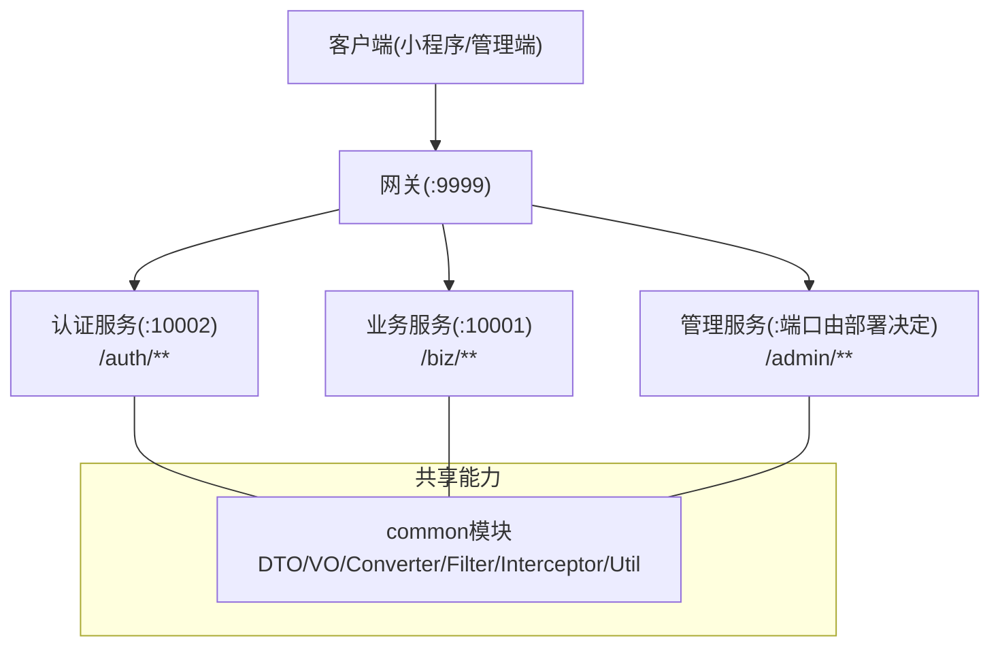
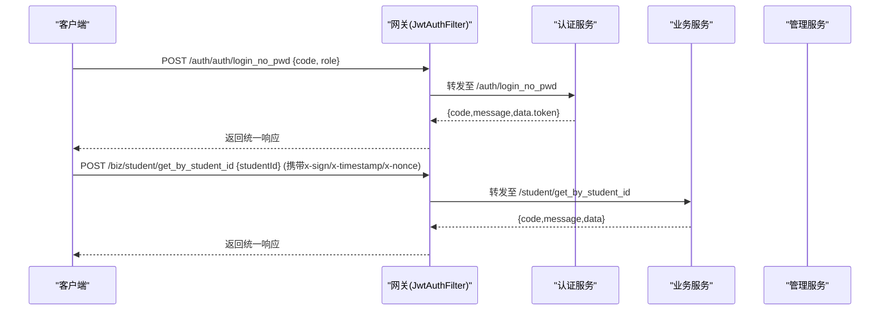
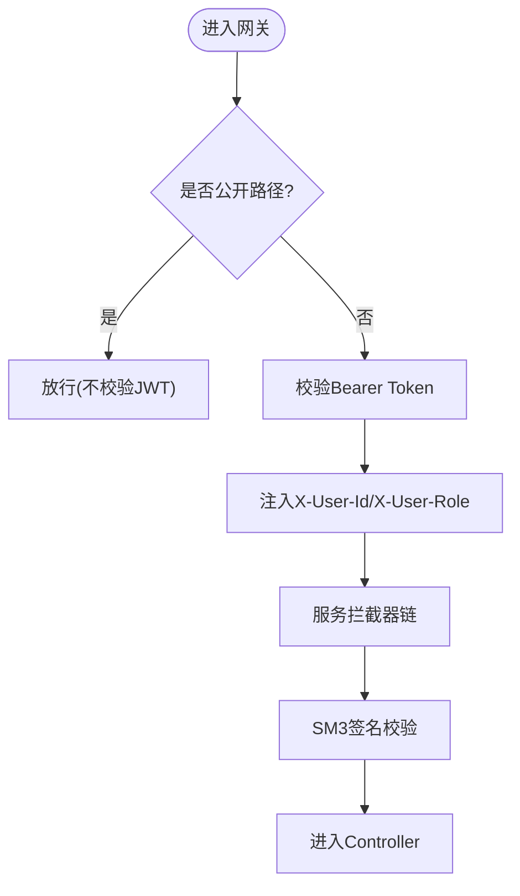
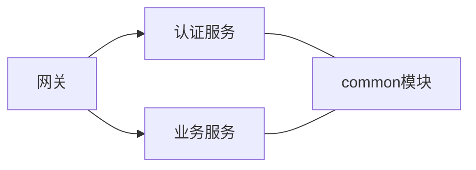
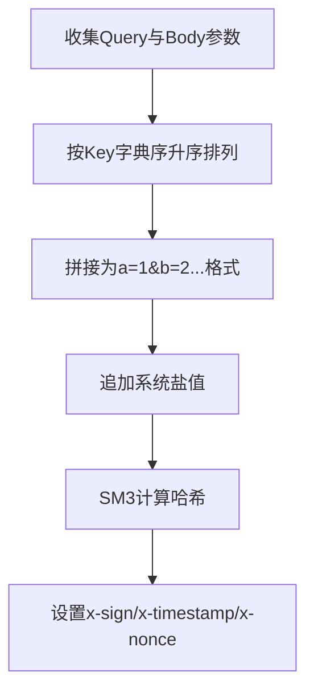

# API接口文档

<cite>
**本文引用的文件**
- [架构设计文档](file://class_times_record_back/docs/architecture.md)
- [API测试文档](file://class_times_record_back/docs/api-test.md)
- [认证控制器](file://class_times_record_back/auth-service/src/main/java/com/shiroko/controller/AuthController.java)
- [机构控制器](file://class_times_record_back/business-service/src/main/java/com/shiroko/controller/InstitutionController.java)
- [学生控制器](file://class_times_record_back/business-service/src/main/java/com/shiroko/controller/StudentController.java)
- [教师控制器](file://class_times_record_back/business-service/src/main/java/com/shiroko/controller/TeacherController.java)
- [班级控制器](file://class_times_record_back/business-service/src/main/java/com/shiroko/controller/ClassController.java)
- [课程控制器](file://class_times_record_back/business-service/src/main/java/com/shiroko/controller/CourseController.java)
- [课程记录控制器](file://class_times_record_back/business-service/src/main/java/com/shiroko/controller/CourseRecordController.java)
- [课时记录控制器](file://class_times_record_back/business-service/src/main/java/com/shiroko/controller/RecordController.java)
- [排课控制器](file://class_times_record_back/business-service/src/main/java/com/shiroko/controller/ClassScheduleController.java)
- [系统用户控制器](file://class_times_record_back/admin-service/src/main/java/com/shiroko/controller/SysUserController.java)
</cite>

## 目录
1. [简介](#简介)
2. [项目结构](#项目结构)
3. [核心组件](#核心组件)
4. [架构总览](#架构总览)
5. [详细接口说明](#详细接口说明)
6. [依赖关系分析](#依赖关系分析)
7. [性能与一致性](#性能与一致性)
8. [故障排查指南](#故障排查指南)
9. [结论](#结论)
10. [附录：前端集成与调试](#附录前端集成与调试)

## 简介
本文件为“课时记录系统”的完整API接口文档，覆盖认证、业务与管理三大域。所有对外接口统一经网关聚合，采用POST + @RequestBody风格，统一响应体封装，并提供JWT鉴权与SM3请求签名校验等安全机制。文档同时给出接口版本管理与向后兼容策略、测试用例与调试方法，以及面向前端的集成指引。

## 项目结构
后端采用Spring Cloud Alibaba微服务架构，包含网关、认证服务、业务服务与管理服务；前端包含管理端与小程序端。

图表来源
- [架构设计文档:59-65](file://class_times_record_back/docs/architecture.md#L59-L65)
- [架构设计文档:473-511](file://class_times_record_back/docs/architecture.md#L473-L511)

章节来源
- [架构设计文档:1-90](file://class_times_record_back/docs/architecture.md#L1-L90)
- [架构设计文档:473-511](file://class_times_record_back/docs/architecture.md#L473-L511)

## 核心组件
- 网关层：统一路由分发、JWT校验、签名校验、CORS与限流熔断。
- 认证服务：提供登录、注册、Token刷新、绑定二维码、订阅消息授权等能力。
- 业务服务：提供机构、学生、教师、班级、课程、课程记录、课时记录、排课等能力。
- 管理服务：提供后台管理员登录、用户/角色/菜单/日志/配置等能力。
- 公共模块：统一的DTO/VO、转换器、拦截器、过滤器、工具类与异常处理。

章节来源
- [架构设计文档:92-186](file://class_times_record_back/docs/architecture.md#L92-L186)
- [架构设计文档:265-324](file://class_times_record_back/docs/architecture.md#L265-L324)

## 架构总览
- 两级防护体系：网关级JwtAuthFilter与服务级拦截器链（缓存请求体、注入用户上下文、二次JWT校验、SM3签名校验）。
- 统一响应格式：code/message/data。
- 接口风格：全部使用POST + @RequestBody；查询类接口亦如此。
- 路由规则：/auth/** → auth-service；/biz/** → business-service；/admin/** → admin-service。

图表来源
- [架构设计文档:92-147](file://class_times_record_back/docs/architecture.md#L92-L147)
- [架构设计文档:59-65](file://class_times_record_back/docs/architecture.md#L59-L65)

## 详细接口说明

### 通用规范
- 基础URL
  - 认证域：/auth/**
  - 业务域：/biz/**
  - 管理域：/admin/**
- 请求方式：全部POST（含查询），参数通过@RequestBody传递
- 统一响应体
  - code: 业务状态码（成功通常为200）
  - message: 提示信息
  - data: 业务数据对象或集合
- 分页字段：currentPage、pageSize（如未特别说明，默认从1开始）
- 错误码：具体业务异常由全局异常处理器统一返回，常见包括参数校验失败（400）、业务异常、运行时异常、数据库异常等

章节来源
- [架构设计文档:473-511](file://class_times_record_back/docs/architecture.md#L473-L511)
- [架构设计文档:250-262](file://class_times_record_back/docs/architecture.md#L250-L262)

### 安全与认证
- JWT双Token
  - AccessToken：用于业务鉴权，默认过期时间可配置
  - RefreshToken：用于刷新AccessToken
- 公开路径（无需JWT）
  - 登录/注册/获取OpenId/刷新Token等
- 签名校验（非公开接口必须）
  - 请求头：x-sign、x-timestamp、x-nonce
  - 算法：SM3对Query+Body参数按Key字典序拼接后加盐计算
  - 时效：x-timestamp有效期60秒
- 权限控制
  - 网关层注入X-User-Id/X-User-Role到下游服务
  - 服务层从上下文读取并做进一步权限判断（按角色/菜单）

图表来源
- [架构设计文档:92-147](file://class_times_record_back/docs/architecture.md#L92-L147)
- [架构设计文档:149-176](file://class_times_record_back/docs/architecture.md#L149-L176)

章节来源
- [架构设计文档:92-186](file://class_times_record_back/docs/architecture.md#L92-L186)

### 认证接口（/auth/**）
以下接口均位于认证服务，经网关映射为/auth/**。

- 获取微信OpenId
  - 方法/路径：POST /auth/auth/get_open_id
  - 请求体：{ code }
  - 响应：data包含openId
  - 备注：公开接口，无需JWT与签名
- 微信免密登录
  - 方法/路径：POST /auth/auth/login_no_pwd
  - 请求体：{ code, role }
  - 响应：data包含token等信息
  - 备注：公开接口
- 密码登录
  - 方法/路径：POST /auth/auth/login_by_pwd
  - 请求体：{ openId, role, account, password, ... }
  - 响应：data包含token等信息
  - 备注：公开接口
- Token登录
  - 方法/路径：POST /auth/auth/login_by_token
  - 请求体：{ openId, token, needValidateAdmin }
  - 响应：data包含refreshed_token
  - 备注：公开接口
- 注册
  - 方法/路径：POST /auth/auth/register
  - 请求体：{ account, password, role, openId, ... }
  - 响应：data包含openId
  - 备注：公开接口
- 退出登录
  - 方法/路径：POST /auth/auth/logout
  - 请求体：{ token }
  - 响应：code=200
  - 备注：需JWT
- 刷新AccessToken
  - 方法/路径：POST /auth/auth/refresh
  - 请求体：{ accessToken, refreshToken }
  - 响应：data包含新token
  - 备注：公开接口
- 按教师ID查询认证信息
  - 方法/路径：POST /auth/auth/get_user_auth_info_by_teacher_id
  - 请求体：{ teacherId }
  - 响应：data包含认证信息
  - 备注：需JWT
- 生成绑定二维码
  - 方法/路径：POST /auth/auth/generate_bind_qrcode
  - 请求体：{ studentId, relation, isPrimary }
  - 响应：data包含qrcode、token、bindCode
  - 备注：需JWT
- 生成订阅专用二维码
  - 方法/路径：POST /auth/auth/generate_subscribe_qrcode
  - 请求体：同绑定二维码
  - 响应：同上
  - 备注：家长端仅订阅不可绑定账号
- 查询绑定信息
  - 方法/路径：GET /auth/auth/get_bind_info?token=...
  - 响应：data包含绑定信息
  - 备注：无需JWT
- 通过绑定码查询学生信息（不执行绑定）
  - 方法/路径：GET /auth/auth/get_bind_info_by_code?bindCode=...
  - 响应：data包含学生绑定信息
  - 备注：无需JWT
- 检查绑定状态
  - 方法/路径：GET /auth/auth/check_bind_status?token=...&code=...
  - 响应：data包含绑定状态
  - 备注：无需JWT
- 确认绑定
  - 方法/路径：POST /auth/auth/confirm_bind
  - 请求体：{ token, code, ... }
  - 响应：code=200
  - 备注：无需JWT
- 通过绑定码绑定学生
  - 方法/路径：POST /auth/auth/bind_by_code
  - 请求体：{ bindCode, code, account?, password? }
  - 响应：操作结果消息
  - 备注：无需JWT
- 记录微信订阅消息授权
  - 方法/路径：POST /auth/auth/record_subscribe
  - 请求体：{ code, templateId }
  - 响应：操作结果消息
  - 备注：无需JWT
- 查询订阅消息授权状态
  - 方法/路径：GET /auth/auth/get_subscribe_status?code=...&templateId=...&studentId?
  - 响应：data包含授权次数、是否已订阅指定学生
  - 备注：无需JWT
- 测试发送微信订阅消息
  - 方法/路径：GET /auth/auth/test_send_subscribe?code=...
  - 响应：发送结果消息
  - 备注：无需JWT

章节来源
- [认证控制器:48-197](file://class_times_record_back/auth-service/src/main/java/com/shiroko/controller/AuthController.java#L48-L197)
- [架构设计文档:512-524](file://class_times_record_back/docs/architecture.md#L512-L524)

### 业务接口（/biz/**）
以下接口均位于业务服务，经网关映射为/biz/**。

#### 机构管理（/biz/institution）
- 按ID查询
  - 方法/路径：POST /biz/institution/get_by_id
  - 请求体：{ id }
  - 响应：data包含机构信息
- 按学生ID查询
  - 方法/路径：POST /biz/institution/get_institution_by_student_id
  - 请求体：{ studentId }
  - 响应：data包含机构信息
- 按OpenId查询
  - 方法/路径：POST /biz/institution/get_by_open_id
  - 请求体：{ openId }
  - 响应：data包含机构信息
- 按机构编码查询
  - 方法/路径：POST /biz/institution/get_by_institution_code
  - 请求体：{ institutionCode }
  - 响应：data包含机构信息
- 更新机构
  - 方法/路径：POST /biz/institution/update
  - 请求体：UpdateInstitutionDTO
  - 响应：data包含更新后的机构信息

章节来源
- [机构控制器:31-54](file://class_times_record_back/business-service/src/main/java/com/shiroko/controller/InstitutionController.java#L31-L54)

#### 学生管理（/biz/student）
- 按学生ID查询
  - 方法/路径：POST /biz/student/get_by_student_id
  - 请求体：{ studentId }
  - 响应：data包含学生列表
- 按家长ID查询
  - 方法/路径：POST /biz/student/get_by_parent_id
  - 请求体：{ parentId }
  - 响应：data包含学生列表
- 按教师ID查询
  - 方法/路径：POST /biz/student/get_by_teacher_id
  - 请求体：{ teacherId }
  - 响应：data包含学生列表
- 按班级ID查询
  - 方法/路径：POST /biz/student/get_by_class_id
  - 请求体：{ classId }
  - 响应：data包含学生列表（含家长信息）
- 按机构ID查询
  - 方法/路径：POST /biz/student/get_by_institution_id
  - 请求体：{ institutionId }
  - 响应：data包含学生列表
- 按课程ID查询
  - 方法/路径：POST /biz/student/get_by_course_id
  - 请求体：{ courseId }
  - 响应：data包含学生列表
- 新增学生
  - 方法/路径：POST /biz/student/insert
  - 请求体：InsertStudentDTO
  - 响应：data包含新生成的学生ID
- 更新学生
  - 方法/路径：POST /biz/student/update
  - 请求体：UpdateStudentDTO
  - 响应：data包含更新后的学生信息
- 解绑家长-学生关联
  - 方法/路径：POST /biz/student/unbind
  - 请求体：{ parentId, studentId }
  - 响应：操作结果消息
- 取消家长对学生的微信订阅通知
  - 方法/路径：POST /biz/student/cancel_subscribe
  - 请求体：{ parentId, studentId }
  - 响应：操作结果消息

章节来源
- [学生控制器:36-94](file://class_times_record_back/business-service/src/main/java/com/shiroko/controller/StudentController.java#L36-L94)

#### 教师管理（/biz/teacher）
- 按ID查询
  - 方法/路径：POST /biz/teacher/get_by_id
  - 请求体：{ teacherId }
  - 响应：data包含教师信息
- 按机构ID查询
  - 方法/路径：POST /biz/teacher/get_teacher_by_institution_id
  - 请求体：{ institutionId }
  - 响应：data包含教师列表
- 更新教师
  - 方法/路径：POST /biz/teacher/update_by_id
  - 请求体：UpdateTeacherDTO
  - 响应：data包含更新后的教师信息
- 新增教师
  - 方法/路径：POST /biz/teacher/insert
  - 请求体：InsertTeacherDTO
  - 响应：data包含新增的教师信息
- 删除教师
  - 方法/路径：POST /biz/teacher/delete
  - 请求体：{ teacherId }
  - 响应：操作结果消息

章节来源
- [教师控制器:35-64](file://class_times_record_back/business-service/src/main/java/com/shiroko/controller/TeacherController.java#L35-L64)

#### 班级管理（/biz/class）
- 按学生ID查询班级
  - 方法/路径：POST /biz/class/get_classes_by_student_id
  - 请求体：{ studentId }
  - 响应：data包含班级列表
- 按教师ID查询班级
  - 方法/路径：POST /biz/class/get_classes_by_teacher_id
  - 请求体：{ teacherId }
  - 响应：data包含班级列表
- 按机构ID查询班级
  - 方法/路径：POST /biz/class/get_classes_by_institution_id
  - 请求体：{ institutionId }
  - 响应：data包含班级列表
- 按ID查询班级
  - 方法/路径：POST /biz/class/get_class_by_id
  - 请求体：{ classId }
  - 响应：data包含班级信息
- 添加学生到班级
  - 方法/路径：POST /biz/class/add_student_to_class
  - 请求体：UpdateClassDTO
  - 响应：data包含更新后的班级信息
- 从班级移除学生
  - 方法/路径：POST /biz/class/remove_student_from_class
  - 请求体：UpdateClassDTO
  - 响应：data包含更新后的班级信息
- 新增班级
  - 方法/路径：POST /biz/class/insert
  - 请求体：InsertClassDTO
  - 响应：data包含新增的班级信息
- 更新班级
  - 方法/路径：POST /biz/class/update_by_id
  - 请求体：UpdateClassDTO
  - 响应：data包含更新后的班级信息

章节来源
- [班级控制器:35-73](file://class_times_record_back/business-service/src/main/java/com/shiroko/controller/ClassController.java#L35-L73)

#### 课程管理（/biz/course）
- 按机构ID查询课程
  - 方法/路径：POST /biz/course/get_course_by_institution_id
  - 请求体：{ institutionId }
  - 响应：data包含课程列表
- 按学生ID查询课程
  - 方法/路径：POST /biz/course/get_course_by_student_id
  - 请求体：{ studentId }
  - 响应：data包含课程列表
- 新增课程
  - 方法/路径：POST /biz/course/add_course
  - 请求体：InsertCourseDTO
  - 响应：data包含新增的课程信息
- 更新课程
  - 方法/路径：POST /biz/course/update_by_id
  - 请求体：UpdateCourseDTO
  - 响应：data包含更新后的课程信息

章节来源
- [课程控制器:33-51](file://class_times_record_back/business-service/src/main/java/com/shiroko/controller/CourseController.java#L33-L51)

#### 课程记录（/biz/course_record）
- 分页查询（旧版）
  - 方法/路径：POST /biz/course_record/get
  - 请求体：QueryCourseRecordDTO
  - 响应：data包含courseRecords列表
- 分页查询（新版）
  - 方法/路径：POST /biz/course_record/new_get
  - 请求体：QueryCourseRecordDTO
  - 响应：data包含total与records
- 新增购课记录（旧校验组）
  - 方法/路径：POST /biz/course_record/add
  - 请求体：InsertCourseRecordDTO
  - 响应：code=200
- 新增购课记录（新校验组）
  - 方法/路径：POST /biz/course_record/insert
  - 请求体：InsertCourseRecordDTO
  - 响应：code=200
- 逻辑删除
  - 方法/路径：POST /biz/course_record/delete
  - 请求体：{ id }
  - 响应：code=200
- 按学生扣课
  - 方法/路径：POST /biz/course_record/deduct_by_student_id
  - 请求体：DeductCourseRecordDTO
  - 响应：data包含res=受影响行数
- 按课程扣课
  - 方法/路径：POST /biz/course_record/deduct_by_course_id
  - 请求体：DeductCourseRecordDTO
  - 响应：data包含res
- 按班级扣课
  - 方法/路径：POST /biz/course_record/deduct_by_class_id
  - 请求体：DeductCourseRecordDTO
  - 响应：data包含res
- 更新课程记录
  - 方法/路径：POST /biz/course_record/update
  - 请求体：UpdateCourseRecordDTO
  - 响应：code=200
- 按学生ID查询课程记录
  - 方法/路径：POST /biz/course_record/get_by_student_id
  - 请求体：{ studentId }
  - 响应：data包含课程记录列表
- 按机构ID查询课程记录
  - 方法/路径：POST /biz/course_record/get_by_institution_id
  - 请求体：{ institutionId }
  - 响应：data包含课程记录列表
- 扣费详情（家长端通知点击后调用）
  - 方法/路径：GET /biz/course_record/deduct-detail?recordId=...
  - 响应：data包含扣费详情

章节来源
- [课程记录控制器:37-104](file://class_times_record_back/business-service/src/main/java/com/shiroko/controller/CourseRecordController.java#L37-L104)

#### 课时记录（/biz/record）
- 分页查询
  - 方法/路径：POST /biz/record/get
  - 请求体：{ courseRecordId, currentPage, pageSize }
  - 响应：data.total、data.records
- 新版查询
  - 方法/路径：POST /biz/record/new_get
  - 请求体：QueryRecordDTO
  - 响应：data.total、data.records
- 单条新增
  - 方法/路径：POST /biz/record/add
  - 请求体：InsertRecordDTO
  - 响应：code=200
- 批量新增
  - 方法/路径：POST /biz/record/add_all
  - 请求体：InsertRecordsDTO
  - 响应：code=200

章节来源
- [课时记录控制器:33-51](file://class_times_record_back/business-service/src/main/java/com/shiroko/controller/RecordController.java#L33-L51)

#### 排课管理（/biz/class_schedule）
- 按班级ID查询
  - 方法/路径：POST /biz/class_schedule/get_by_class_id
  - 请求体：QueryClassScheduleDTO
  - 响应：data包含排课列表
- 按机构ID查询
  - 方法/路径：POST /biz/class_schedule/get_by_institution_id
  - 请求体：QueryClassScheduleDTO
  - 响应：data包含排课列表
- 按教师ID查询
  - 方法/路径：POST /biz/class_schedule/get_by_teacher_id
  - 请求体：QueryClassScheduleDTO
  - 响应：data包含排课列表
- 按ID查询
  - 方法/路径：POST /biz/class_schedule/get_by_id
  - 请求体：QueryClassScheduleDTO
  - 响应：data包含排课信息
- 更新排课
  - 方法/路径：POST /biz/class_schedule/update_by_id
  - 请求体：UpdateClassScheduleDTO
  - 响应：data包含更新后的排课信息

章节来源
- [排课控制器:30-53](file://class_times_record_back/business-service/src/main/java/com/shiroko/controller/ClassScheduleController.java#L30-L53)

### 管理接口（/admin/**）
以下接口位于管理服务，经网关映射为/admin/**。

- 管理员登录
  - 方法/路径：POST /admin/user/login
  - 请求体：LoginSysUserDTO
  - 响应：data包含登录令牌
- 管理员列表
  - 方法/路径：POST /admin/user/list
  - 请求体：QuerySysUserDTO
  - 响应：data包含分页结果
- 按ID查询管理员
  - 方法/路径：POST /admin/user/get_by_id
  - 请求体：{ id }
  - 响应：data包含管理员信息
- 新增管理员
  - 方法/路径：POST /admin/user/insert
  - 请求体：InsertSysUserDTO
  - 响应：data包含新增的管理员信息
- 更新管理员
  - 方法/路径：POST /admin/user/update
  - 请求体：UpdateSysUserDTO
  - 响应：data包含更新后的管理员信息
- 删除管理员
  - 方法/路径：POST /admin/user/delete
  - 请求体：{ id }
  - 响应：操作结果消息
- 重置管理员密码
  - 方法/路径：POST /admin/user/reset_password
  - 请求体：{ id, newPassword }
  - 响应：操作结果消息
- 获取管理员角色
  - 方法/路径：POST /admin/user/get_roles
  - 请求体：{ userId }
  - 响应：data包含角色列表
- 刷新管理员Token
  - 方法/路径：POST /admin/user/refresh
  - 请求体：{ refreshToken }
  - 响应：data包含新的登录令牌

章节来源
- [系统用户控制器:30-77](file://class_times_record_back/admin-service/src/main/java/com/shiroko/controller/SysUserController.java#L30-L77)

## 依赖关系分析
- 网关到服务的路由映射
  - /auth/** → lb://auth-service
  - /biz/** → lb://business-service
- 服务间依赖
  - business-service保留少量auth域Mapper以满足跨域数据关联
- 公共模块
  - DTO/VO/Converter/Filter/Interceptor/Config/Util被各服务复用

图表来源
- [架构设计文档:59-65](file://class_times_record_back/docs/architecture.md#L59-L65)
- [架构设计文档:265-296](file://class_times_record_back/docs/architecture.md#L265-L296)

章节来源
- [架构设计文档:59-65](file://class_times_record_back/docs/architecture.md#L59-L65)
- [架构设计文档:265-296](file://class_times_record_back/docs/architecture.md#L265-L296)

## 性能与一致性
- 虚拟线程：JDK 21虚拟线程提升I/O密集型场景吞吐
- 主键策略：雪花算法分布式唯一ID，趋势递增利于索引
- 逻辑删除：统一isDeleted字段，查询自动追加过滤条件
- 限流熔断：Sentinel在网关层提供流量控制与降级

章节来源
- [架构设计文档:234-249](file://class_times_record_back/docs/architecture.md#L234-L249)
- [架构设计文档:216-233](file://class_times_record_back/docs/architecture.md#L216-L233)
- [架构设计文档:66-89](file://class_times_record_back/docs/architecture.md#L66-L89)

## 故障排查指南
- 参数校验失败
  - 现象：返回400，message包含字段错误信息
  - 定位：检查DTO校验注解与分组校验
- 业务异常
  - 现象：自定义BusinessException，返回对应code与message
  - 定位：查看Service层抛出的业务异常
- 运行时异常/数据库异常
  - 现象：兜底处理，返回通用错误
  - 定位：结合日志与SQL日志排查
- 签名校验失败
  - 现象：返回签名无效或时间戳过期
  - 定位：核对x-sign、x-timestamp、x-nonce与参数排序拼接

章节来源
- [架构设计文档:250-262](file://class_times_record_back/docs/architecture.md#L250-L262)
- [架构设计文档:149-176](file://class_times_record_back/docs/architecture.md#L149-L176)

## 结论
本API文档基于现有控制器与架构文档整理，覆盖了认证、业务与管理三大域的接口定义、安全机制与统一规范。建议后续引入Redis防重放、完善API版本路径、逐步将查询接口改为GET以符合REST语义，并将配置迁移至Nacos Config实现动态管理。

## 附录：前端集成与调试

### 请求签名流程

图表来源
- [架构设计文档:149-176](file://class_times_record_back/docs/architecture.md#L149-L176)

### 接口版本管理与向后兼容
- 现状：部分接口以new_get/newGet命名区分新旧实现
- 建议：采用/v1/、/v2/版本路径进行演进，保持旧接口稳定运行直至下线

章节来源
- [架构设计文档:635-644](file://class_times_record_back/docs/architecture.md#L635-L644)

### 接口测试与调试
- 单元测试：Controller层Slice Test，MockMvc独立启动，验证路由、参数绑定、校验与响应
- 运行命令
  - 全部测试：mvn test
  - 仅API测试：mvn test -Dtest="*ControllerApiTest"
  - 指定模块：mvn test -Dtest="AuthControllerApiTest" -pl auth-service
- 已知未覆盖清单：InstitutionController、CourseController等后续补充

章节来源
- [API测试文档:1-167](file://class_times_record_back/docs/api-test.md#L1-L167)

### 前端集成要点
- 统一请求封装：所有接口POST + @RequestBody
- 统一响应解析：根据code判断成功与否，data承载业务数据
- 鉴权与签名：登录后保存AccessToken；非公开接口携带x-sign/x-timestamp/x-nonce
- 错误处理：捕获400与业务异常，提示用户友好信息

[本节为通用指导，不直接分析具体文件]