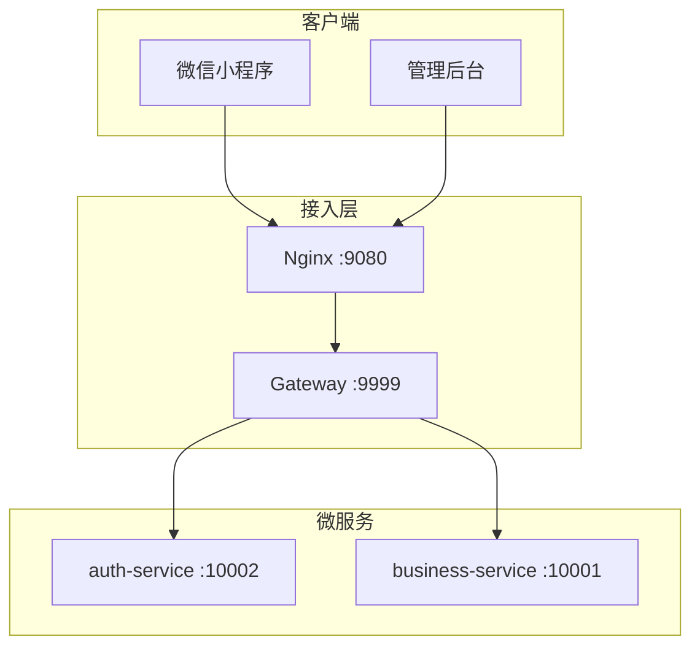
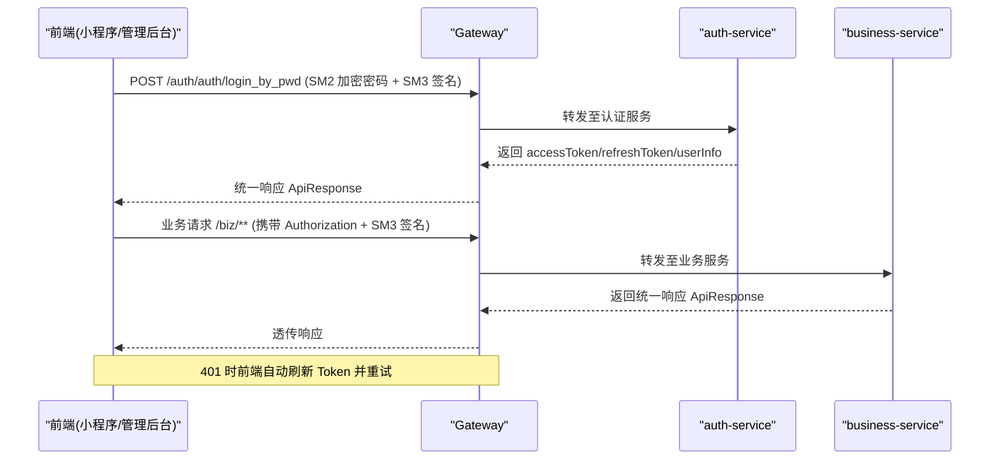
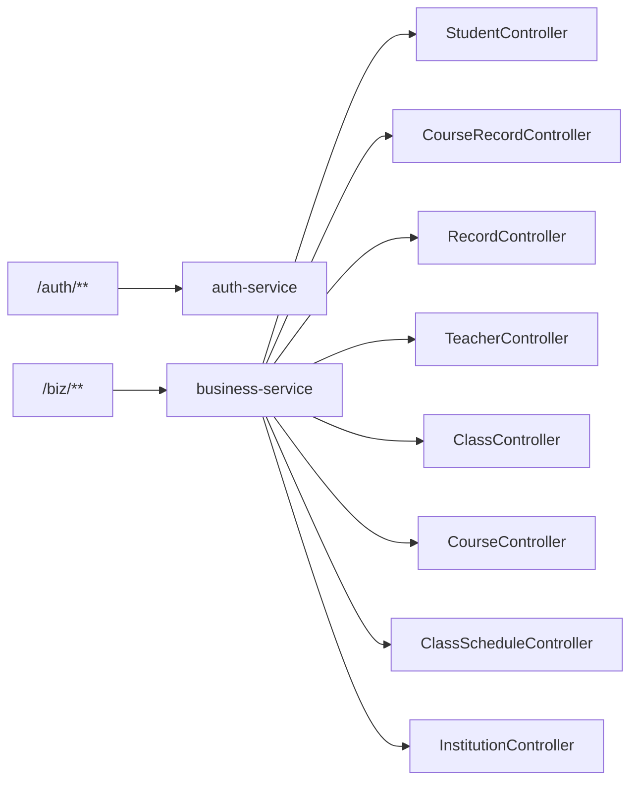

# 业务接口

<cite>
**本文引用的文件**   
- [class_times_record/README.md](file://class_times_record/README.md)
- [class_record_admin_front/README.md](file://class_record_admin_front/README.md)
- [class_times_record/docs/architecture.md](file://class_times_record/docs/architecture.md)
- [class_times_record_back/docs/api-test.md](file://class_times_record_back/docs/api-test.md)
</cite>

## 目录
1. [简介](#简介)
2. [项目结构](#项目结构)
3. [核心组件](#核心组件)
4. [架构总览](#架构总览)
5. [详细组件分析](#详细组件分析)
6. [依赖分析](#依赖分析)
7. [性能考虑](#性能考虑)
8. [故障排查指南](#故障排查指南)
9. [结论](#结论)
10. [附录](#附录)

## 简介
本文件面向“课时管理”系统的后端业务接口，覆盖机构管理、教师管理、学生管理、课程管理、班级管理、课时记录等核心模块。文档基于前端与测试文档中已暴露的网关路由规则与端点清单进行整理，给出统一的请求路径约定、认证与签名要求、分页参数规范、常见校验约束以及典型调用流程说明，帮助前后端协同开发与联调。

## 项目结构
系统采用微服务架构，前端（小程序与管理后台）统一经 Nginx 反向代理至 Gateway，再由 Gateway 将请求分发到认证服务与业务服务：
- 认证服务：提供登录、菜单、权限等能力
- 业务服务：承载学生、教师、班级、课程、课表、课时记录等业务

图示来源
- [class_times_record/README.md:1-127](file://class_times_record/README.md#L1-L127)
- [class_times_record/docs/architecture.md:305-355](file://class_times_record/docs/architecture.md#L305-L355)

章节来源
- [class_times_record/README.md:1-127](file://class_times_record/README.md#L1-L127)
- [class_record_admin_front/README.md:1-127](file://class_record_admin_front/README.md#L1-L127)
- [class_times_record/docs/architecture.md:305-355](file://class_times_record/docs/architecture.md#L305-L355)

## 核心组件
- 认证与鉴权
  - 登录、刷新 Token、获取菜单与权限
  - 统一通过 /auth/** 前缀进入认证服务
- 业务域
  - 学生、教师、班级、课程、排课、课时记录、机构、扣课记录等
  - 统一通过 /biz/** 前缀进入业务服务

统一响应格式
- 所有接口返回统一包装对象，包含 code、message、data 字段；code=200 表示成功，非 200 为业务错误码。

章节来源
- [class_times_record/docs/architecture.md:305-355](file://class_times_record/docs/architecture.md#L305-L355)
- [class_times_record/docs/architecture.md:358-395](file://class_times_record/docs/architecture.md#L358-L395)

## 架构总览
请求链路与安全机制
- 认证方式：Bearer Token（Authorization: Bearer {accessToken}）
- 自动刷新：401 时前端使用 refreshToken 静默刷新
- 请求签名：每个请求附加 SM3 签名头 x-sign、x-timestamp、x-nonce
- 密码加密：SM2 公钥加密传输

图示来源
- [class_times_record/docs/architecture.md:146-213](file://class_times_record/docs/architecture.md#L146-L213)
- [class_times_record/docs/architecture.md:305-355](file://class_times_record/docs/architecture.md#L305-L355)

## 详细组件分析

### 认证模块（/auth）
- 主要端点
  - 登录（账号密码）：POST /auth/auth/login_by_pwd
  - 刷新 Token：POST /auth/auth/refresh
  - 获取菜单：GET /auth/menu/get_menu_by_role
- 认证与鉴权要点
  - 登录后保存 accessToken 与 refreshToken
  - 后续请求在 Header 中携带 Authorization: Bearer {accessToken}
  - 每次请求附带 SM3 签名头 x-sign、x-timestamp、x-nonce
  - 401 时前端自动使用 refreshToken 刷新并重试

章节来源
- [class_times_record/docs/architecture.md:305-355](file://class_times_record/docs/architecture.md#L305-L355)
- [class_times_record/docs/architecture.md:146-213](file://class_times_record/docs/architecture.md#L146-L213)

### 学生管理（/student）
- 主要端点
  - 新增学生：POST /student/insert
  - 更新学生：POST /student/update
  - 按学生ID查询：POST /student/get_by_student_id
  - 按家长ID分页查询：POST /student/get_by_parent_id
  - 按教师ID分页查询：POST /student/get_by_teacher_id
  - 按班级ID查询（含家长信息）：POST /student/get_by_class_id
  - 按机构ID分页查询：POST /student/get_by_institution_id
- 通用分页参数
  - currentPage：当前页码，默认 1
  - pageSize：每页条数，默认 10
- 校验与约束
  - 必填字段缺失将返回 400 Bad Request
  - 列表查询支持按关联实体筛选（家长/教师/班级/机构）

章节来源
- [class_times_record_back/docs/api-test.md:101-116](file://class_times_record_back/docs/api-test.md#L101-L116)
- [class_times_record/docs/architecture.md:305-355](file://class_times_record/docs/architecture.md#L305-L355)

### 教师管理（/teacher）
- 主要端点
  - 新增教师：POST /teacher/insert
  - 更新教师：POST /teacher/update_by_id
  - 其他教师相关操作遵循 /biz/teacher/** 命名约定
- 角色与权限
  - 教师角色用于访问教师端功能；管理员可切换教师是否为机构管理员

章节来源
- [class_times_record/docs/architecture.md:305-355](file://class_times_record/docs/architecture.md#L305-L355)

### 课程管理（/course）
- 主要端点
  - 按学生ID查询课程：POST /course/get_by_student_id
  - 其他课程管理操作遵循 /biz/course/** 命名约定
- 数据模型
  - 课程类型支持按次/按天

章节来源
- [class_times_record/docs/architecture.md:305-355](file://class_times_record/docs/architecture.md#L305-L355)

### 班级管理（/class）
- 主要端点
  - 向班级添加学生：POST /class/add_student_to_class
  - 其他班级管理操作遵循 /biz/class/** 命名约定
- 关联关系
  - 班级与学生多对多，支持按班级维度查看学生列表

章节来源
- [class_times_record/docs/architecture.md:305-355](file://class_times_record/docs/architecture.md#L305-L355)

### 排课管理（/class_schedule）
- 主要端点
  - 按班级ID查询课表：POST /class_schedule/get_by_class_id
  - 其他排课操作遵循 /biz/class_schedule/** 命名约定
- 视图展示
  - 支持学校课表与个人课表两种视角

章节来源
- [class_times_record/docs/architecture.md:305-355](file://class_times_record/docs/architecture.md#L305-L355)

### 课时记录（/course_record）
- 主要端点
  - 新增购课记录：POST /course_record/add
  - 逻辑删除：POST /course_record/delete
  - 更新记录：POST /course_record/update
  - 按学生ID扣课：POST /course_record/deduct_by_student_id
  - 分页查询：POST /course_record/get 或新式分页 POST /course_record/new_get
- 业务约束
  - 扣课需传入学生ID及扣减明细数组
  - 分页查询支持新旧两种方式，建议优先使用 new_get

章节来源
- [class_times_record_back/docs/api-test.md:86-100](file://class_times_record_back/docs/api-test.md#L86-L100)
- [class_times_record/docs/architecture.md:305-355](file://class_times_record/docs/architecture.md#L305-L355)

### 课时变更记录（/record）
- 主要端点
  - 插入单条记录：POST /record/add
  - 批量插入记录：POST /record/add_all
  - 分页查询记录：POST /record/get
- 变更追踪
  - 记录类型与变更数量用于描述课时增减与纯记录场景

章节来源
- [class_times_record_back/docs/api-test.md:75-85](file://class_times_record_back/docs/api-test.md#L75-L85)

### 机构管理（/institution）
- 主要端点
  - 按ID查询机构：POST /institution/get_by_id
  - 其他机构管理操作遵循 /biz/institution/** 命名约定
- 订阅与租期
  - 支持订阅套餐管理与租期到期控制（管理后台可见）

章节来源
- [class_times_record/docs/architecture.md:305-355](file://class_times_record/docs/architecture.md#L305-L355)
- [class_record_admin_front/README.md:1-127](file://class_record_admin_front/README.md#L1-L127)

### 统一分页与查询规范
- 分页参数
  - currentPage：当前页码，默认 1
  - pageSize：每页条数，默认 10
- 排序与过滤
  - 根据具体接口定义支持的筛选字段（如按家长/教师/班级/机构ID）
- 响应结构
  - data 中包含 records/list 与 total 字段

章节来源
- [class_times_record_back/docs/api-test.md:75-116](file://class_times_record_back/docs/api-test.md#L75-L116)
- [class_times_record/docs/architecture.md:358-395](file://class_times_record/docs/architecture.md#L358-L395)

### 复杂业务场景示例
- 快速扣课
  - 场景：教师选择学生后，批量选择课程与课时进行扣减
  - 流程：先查询学生课程记录，再调用扣课接口，最后生成课时变更记录
- 调整排课
  - 场景：修改某班级的上课时间
  - 流程：查询班级课表详情 → 提交调整请求 → 返回新的课表信息

章节来源
- [class_times_record/docs/architecture.md:305-355](file://class_times_record/docs/architecture.md#L305-L355)

## 依赖分析
- 网关路由映射
  - /auth/** → auth-service
  - /biz/** → business-service
- 控制器与路径推导
  - 前端路径 = Gateway前缀 + Controller类路径 + 方法路径
  - 例如：/biz/student/get_by_student_id、/biz/course_record/deduct_by_student_id

图示来源
- [class_times_record/docs/architecture.md:305-355](file://class_times_record/docs/architecture.md#L305-L355)

章节来源
- [class_times_record/docs/architecture.md:305-355](file://class_times_record/docs/architecture.md#L305-L355)

## 性能考虑
- 分页查询
  - 合理设置 pageSize，避免一次性拉取过多数据
- 缓存策略
  - 对热点数据（如菜单、字典）可在网关或服务层引入缓存
- 连接池与超时
  - 合理配置数据库连接池与 HTTP 超时，避免长事务阻塞
- 批量操作
  - 批量插入/更新优于循环单条操作，减少网络往返

[本节为通用指导，无需源码引用]

## 故障排查指南
- 401 未认证
  - 检查 Authorization 头是否携带正确的 accessToken
  - 确认 refreshToken 有效且未被清理
- 400 参数校验失败
  - 检查必填字段是否完整，是否符合分组校验要求
- 签名失败
  - 确认 x-sign、x-timestamp、x-nonce 是否正确生成
  - 注意时间戳有效期（通常为 60s）
- 路由不匹配
  - 确认请求路径以 /auth/ 或 /biz/ 开头，符合 Gateway 路由规则

章节来源
- [class_times_record/docs/architecture.md:146-213](file://class_times_record/docs/architecture.md#L146-L213)
- [class_times_record_back/docs/api-test.md:101-116](file://class_times_record_back/docs/api-test.md#L101-L116)

## 结论
本文基于现有前端与测试文档梳理了课时管理系统的主要业务接口与调用规范，明确了认证与签名机制、网关路由规则、分页与校验约定，并对关键业务模块进行了归纳。建议在后续迭代中补充更多 API 测试用例，完善异常码体系与接口版本管理，以提升稳定性与可维护性。

[本节为总结，无需源码引用]

## 附录
- 环境配置
  - 开发 baseUrl：http://localhost:9080
  - 生产 baseUrl：https://api.kurimula-airi.top
- 安全要点
  - 密码使用 SM2 加密传输
  - 请求使用 SM3 签名防篡改与重放攻击

章节来源
- [class_times_record/README.md:116-127](file://class_times_record/README.md#L116-L127)
- [class_times_record/docs/architecture.md:214-241](file://class_times_record/docs/architecture.md#L214-L241)