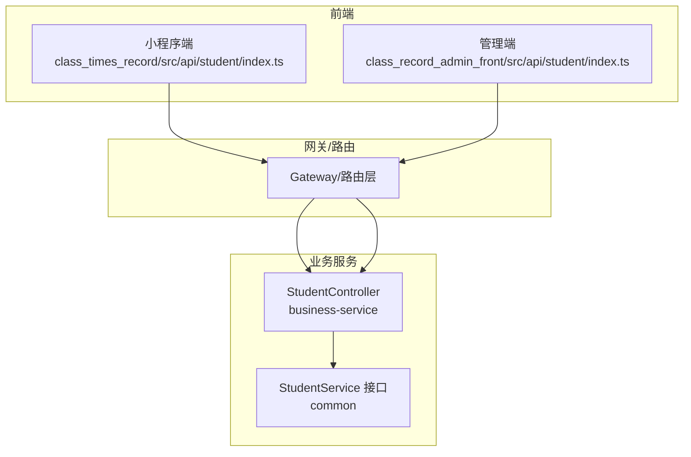
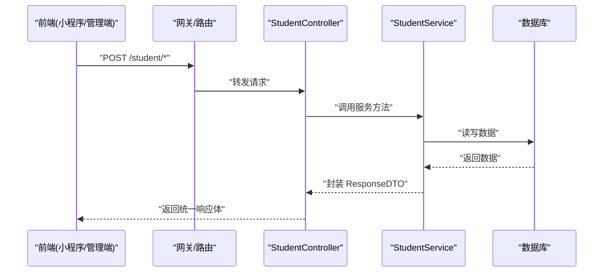
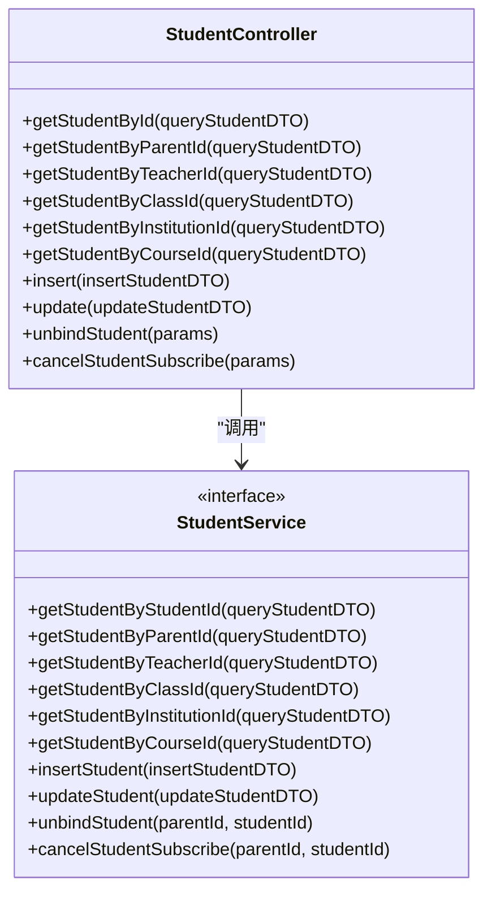
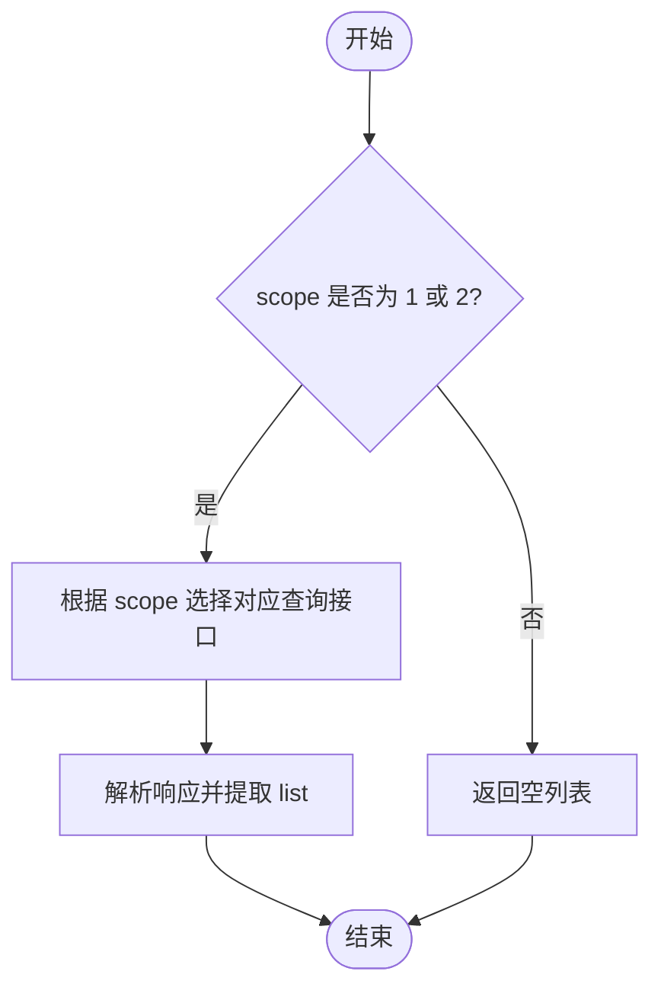
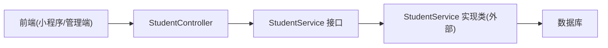
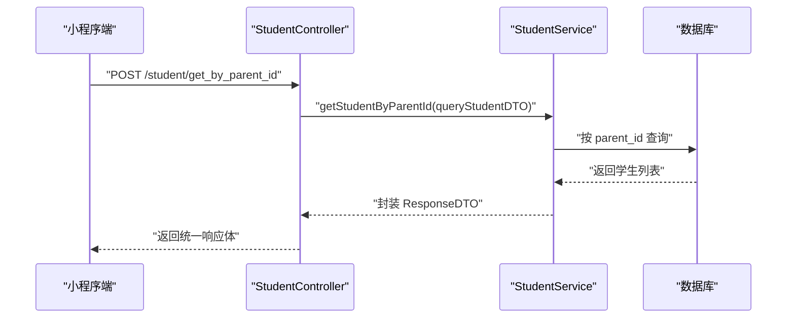

# 学生管理接口

<cite>
**本文引用的文件**   
- [StudentController.java](file://class_times_record_back/business-service/src/main/java/com/shiroko/controller/StudentController.java)
- [StudentService.java](file://class_times_record_back/common/src/main/java/com/shiroko/service/StudentService.java)
- [student/index.ts（小程序端）](file://class_times_record/src/api/student/index.ts)
- [student/index.ts（管理端）](file://class_record_admin_front/src/api/student/index.ts)
</cite>

## 目录
1. [简介](#简介)
2. [项目结构](#项目结构)
3. [核心组件](#核心组件)
4. [架构总览](#架构总览)
5. [详细组件分析](#详细组件分析)
6. [依赖关系分析](#依赖关系分析)
7. [性能考虑](#性能考虑)
8. [故障排查指南](#故障排查指南)
9. [结论](#结论)
10. [附录：接口清单与示例](#附录接口清单与示例)

## 简介
本文件面向“学生管理”相关接口的完整文档，覆盖学生的全生命周期管理（注册、信息维护、状态管理）、家长绑定关系的建立与维护、正式学员与普通学员的差异处理、与班级/课程/课时记录的关联查询、复杂多维筛选条件、以及数据统计与分析能力。同时提供完整的请求响应示例与错误处理机制说明，帮助前后端开发者快速集成与排障。

## 项目结构
围绕学生管理的代码主要分布在以下位置：
- 后端控制器与服务接口定义：business-service 的 StudentController 与 common 层的 StudentService 接口
- 前端调用封装：小程序端 class_times_record 的 student API 模块；管理端 class_record_admin_front 的 student API 模块

图表来源
- [StudentController.java:1-97](file://class_times_record_back/business-service/src/main/java/com/shiroko/controller/StudentController.java#L1-L97)
- [StudentService.java:1-59](file://class_times_record_back/common/src/main/java/com/shiroko/service/StudentService.java#L1-L59)
- [student/index.ts（小程序端）:1-238](file://class_times_record/src/api/student/index.ts#L1-L238)
- [student/index.ts（管理端）:1-14](file://class_record_admin_front/src/api/student/index.ts#L1-L14)

章节来源
- [StudentController.java:1-97](file://class_times_record_back/business-service/src/main/java/com/shiroko/controller/StudentController.java#L1-L97)
- [StudentService.java:1-59](file://class_times_record_back/common/src/main/java/com/shiroko/service/StudentService.java#L1-L59)
- [student/index.ts（小程序端）:1-238](file://class_times_record/src/api/student/index.ts#L1-L238)
- [student/index.ts（管理端）:1-14](file://class_record_admin_front/src/api/student/index.ts#L1-L14)

## 核心组件
- 控制器层：暴露 RESTful 风格的 POST 接口，统一以 /student 为路径前缀，负责参数校验与结果包装。
- 服务接口层：定义学生领域能力（按多条件查询、新增、更新、解绑、取消订阅等），供实现类扩展。
- 前端封装：分别提供小程序端与管理端的调用方法，统一通过 HTTP 客户端发起请求并返回 Promise。

章节来源
- [StudentController.java:1-97](file://class_times_record_back/business-service/src/main/java/com/shiroko/controller/StudentController.java#L1-L97)
- [StudentService.java:1-59](file://class_times_record_back/common/src/main/java/com/shiroko/service/StudentService.java#L1-L59)
- [student/index.ts（小程序端）:1-238](file://class_times_record/src/api/student/index.ts#L1-L238)
- [student/index.ts（管理端）:1-14](file://class_record_admin_front/src/api/student/index.ts#L1-L14)

## 架构总览
下图展示了从前端到后端的典型调用链路，涵盖按不同维度查询、增删改、家长绑定与订阅管理等场景。

图表来源
- [StudentController.java:1-97](file://class_times_record_back/business-service/src/main/java/com/shiroko/controller/StudentController.java#L1-L97)
- [StudentService.java:1-59](file://class_times_record_back/common/src/main/java/com/shiroko/service/StudentService.java#L1-L59)

## 详细组件分析

### 控制器层（StudentController）
- 职责：接收 HTTP 请求，进行参数校验，委托给 Service 层执行，返回统一响应体。
- 关键接口：
  - 按 ID 查询：get_by_student_id
  - 按家长/教师/班级/机构/课程维度查询：get_by_parent_id、get_by_teacher_id、get_by_class_id、get_by_institution_id、get_by_course_id
  - 新增/更新：insert、update
  - 家长绑定管理：unbind、cancel_subscribe

图表来源
- [StudentController.java:1-97](file://class_times_record_back/business-service/src/main/java/com/shiroko/controller/StudentController.java#L1-L97)
- [StudentService.java:1-59](file://class_times_record_back/common/src/main/java/com/shiroko/service/StudentService.java#L1-L59)

章节来源
- [StudentController.java:1-97](file://class_times_record_back/business-service/src/main/java/com/shiroko/controller/StudentController.java#L1-L97)
- [StudentService.java:1-59](file://class_times_record_back/common/src/main/java/com/shiroko/service/StudentService.java#L1-L59)

### 服务接口层（StudentService）
- 职责：定义学生领域操作契约，包括按多种维度查询、新增、更新、解绑、取消订阅等。
- 设计要点：
  - 使用统一的 QueryStudentDTO 作为查询入参，支持分页、关键词、性别、是否已分班等多维筛选。
  - 返回统一 ResponseDTO<T>，便于前端一致化处理。
  - 家长绑定与订阅管理采用独立方法，语义清晰、易于扩展。

章节来源
- [StudentService.java:1-59](file://class_times_record_back/common/src/main/java/com/shiroko/service/StudentService.java#L1-L59)

### 前端封装（小程序端）
- 提供按家长/教师/班级/课程/机构维度获取学生列表的方法，内部统一走 /biz/student/* 路径。
- 提供按学生 ID 获取单个学生信息、新增、更新、解绑、取消订阅等方法。
- 在更新成功后主动刷新本地 Store 缓存，保证界面一致性。

图表来源
- [student/index.ts（小程序端）:133-158](file://class_times_record/src/api/student/index.ts#L133-L158)

章节来源
- [student/index.ts（小程序端）:1-238](file://class_times_record/src/api/student/index.ts#L1-L238)

### 前端封装（管理端）
- 提供学生列表查询、新增、更新等基础管理能力，统一走 /admin/business/student/* 路径。
- 适合后台管理系统中的学生信息管理页面集成。

章节来源
- [student/index.ts（管理端）:1-14](file://class_record_admin_front/src/api/student/index.ts#L1-L14)

## 依赖关系分析
- 控制器依赖服务接口，服务接口由具体实现类完成（实现类不在当前片段中）。
- 前端通过 HTTP 客户端调用后端接口，统一封装为 Promise，便于异步处理。
- 查询 DTO 与 VO 在各层之间传递，确保类型安全与字段约束。

图表来源
- [StudentController.java:1-97](file://class_times_record_back/business-service/src/main/java/com/shiroko/controller/StudentController.java#L1-L97)
- [StudentService.java:1-59](file://class_times_record_back/common/src/main/java/com/shiroko/service/StudentService.java#L1-L59)
- [student/index.ts（小程序端）:1-238](file://class_times_record/src/api/student/index.ts#L1-L238)
- [student/index.ts（管理端）:1-14](file://class_record_admin_front/src/api/student/index.ts#L1-L14)

章节来源
- [StudentController.java:1-97](file://class_times_record_back/business-service/src/main/java/com/shiroko/controller/StudentController.java#L1-L97)
- [StudentService.java:1-59](file://class_times_record_back/common/src/main/java/com/shiroko/service/StudentService.java#L1-L59)
- [student/index.ts（小程序端）:1-238](file://class_times_record/src/api/student/index.ts#L1-L238)
- [student/index.ts（管理端）:1-14](file://class_record_admin_front/src/api/student/index.ts#L1-L14)

## 性能考虑
- 分页与过滤：所有列表查询均支持分页参数（currentPage、pageSize），建议合理设置 pageSize，避免一次性拉取过多数据。
- 索引优化：按 parent_id、teacher_id、class_id、institution_id、course_id 等高频查询字段应建立合适索引，提升查询效率。
- 批量导入导出：若后续引入批量导入/导出，建议使用流式处理与分批写入，降低内存占用与事务时长。
- 缓存策略：对热点数据（如按机构/班级的学生列表）可考虑短期缓存，注意失效策略与一致性。
- 网络传输：统一压缩与最小化响应体，减少不必要字段返回。

[本节为通用指导，不直接分析具体文件]

## 故障排查指南
- 参数校验失败：控制器使用 @Valid/@Validated 注解，若出现校验错误，检查请求体字段是否符合 DTO 约束。
- 身份错误提示：小程序端在 parentId/teacherId/classId/courseId/institutionId 为空时给出明确提示，请确认上下文是否正确。
- 更新后数据不一致：小程序端在更新成功后会重新拉取最新学生信息并刷新 Store，若仍不一致，检查网络与缓存同步逻辑。
- 解绑/取消订阅失败：检查传入的 parentId 与 studentId 是否匹配，确认绑定关系是否存在。

章节来源
- [StudentController.java:1-97](file://class_times_record_back/business-service/src/main/java/com/shiroko/controller/StudentController.java#L1-97)
- [student/index.ts（小程序端）:28-126](file://class_times_record/src/api/student/index.ts#L28-L126)

## 结论
学生管理接口围绕“多维度查询、基础 CRUD、家长绑定与订阅管理”展开，具备清晰的层次结构与统一的响应格式。结合分页与过滤能力，可满足日常管理与统计需求。建议在实现层完善索引与缓存策略，并在必要时扩展批量导入导出与统计分析接口。

[本节为总结性内容，不直接分析具体文件]

## 附录：接口清单与示例

### 接口清单（POST /student/*）
- 按学生 ID 查询：/student/get_by_student_id
- 按家长 ID 查询：/student/get_by_parent_id
- 按教师 ID 查询：/student/get_by_teacher_id
- 按班级 ID 查询：/student/get_by_class_id
- 按机构 ID 查询：/student/get_by_institution_id
- 按课程 ID 查询：/student/get_by_course_id
- 新增学生：/student/insert
- 更新学生：/student/update
- 解绑家长与学生：/student/unbind
- 取消家长对学生的微信订阅通知：/student/cancel_subscribe

章节来源
- [StudentController.java:1-97](file://class_times_record_back/business-service/src/main/java/com/shiroko/controller/StudentController.java#L1-97)

### 请求与响应约定
- 请求方式：POST
- 请求体：JSON，字段名与含义参考各接口描述
- 响应体：统一 ResponseDTO<T>，包含状态码、消息与数据体
- 分页参数：currentPage、pageSize
- 筛选参数：keyword、sex、hasClass 等（依查询维度而定）

章节来源
- [StudentService.java:1-59](file://class_times_record_back/common/src/main/java/com/shiroko/service/StudentService.java#L1-59)

### 典型调用序列（按家长查询）

图表来源
- [StudentController.java:1-97](file://class_times_record_back/business-service/src/main/java/com/shiroko/controller/StudentController.java#L1-97)
- [StudentService.java:1-59](file://class_times_record_back/common/src/main/java/com/shiroko/service/StudentService.java#L1-59)

### 常见错误与处理
- 参数缺失或非法：返回统一错误码与提示信息，前端需展示友好提示。
- 权限不足：根据角色与范围（scope）控制访问，未授权时返回相应错误。
- 数据不存在：当按 ID 查询不到记录时，返回空列表或空对象，前端需做空态处理。
- 系统异常：统一捕获并返回标准错误结构，便于日志追踪与告警。

章节来源
- [StudentController.java:1-97](file://class_times_record_back/business-service/src/main/java/com/shiroko/controller/StudentController.java#L1-97)

### 复杂查询条件说明
- 按维度筛选：支持按家长、教师、班级、机构、课程等维度组合查询。
- 关键字搜索：keyword 用于模糊匹配姓名、学号等字段。
- 性别与分班状态：sex、hasClass 用于进一步细化筛选。
- 分页：currentPage、pageSize 控制返回条数与页码。

章节来源
- [StudentService.java:1-59](file://class_times_record_back/common/src/main/java/com/shiroko/service/StudentService.java#L1-59)
- [student/index.ts（小程序端）:133-158](file://class_times_record/src/api/student/index.ts#L133-L158)

### 家长绑定关系管理
- 建立绑定：通常通过新增学生或家长侧绑定流程完成（具体实现位于服务层）。
- 解绑关系：/student/unbind，传入 parentId 与 studentId。
- 取消订阅：/student/cancel_subscribe，删除订阅与授权次数记录。

章节来源
- [StudentController.java:1-97](file://class_times_record_back/business-service/src/main/java/com/shiroko/controller/StudentController.java#L75-94)
- [StudentService.java:1-59](file://class_times_record_back/common/src/main/java/com/shiroko/service/StudentService.java#L40-57)

### 正式学员与普通学员差异处理
- 差异字段与规则在服务层与数据模型中体现，例如是否已分班、是否纳入正式教学管理等。
- 前端可通过 hasClass 等字段进行区分展示与交互。

章节来源
- [StudentService.java:1-59](file://class_times_record_back/common/src/main/java/com/shiroko/service/StudentService.java#L1-59)
- [student/index.ts（小程序端）:133-158](file://class_times_record/src/api/student/index.ts#L133-L158)

### 与班级、课程、课时记录的关联
- 班级关联：通过 class_id 维度查询学生列表。
- 课程关联：通过 course_id 维度查询选修该课程的学生列表。
- 课时记录：可在课程维度下进一步查看学生的上课记录（由课程与课时记录服务提供）。

章节来源
- [StudentController.java:1-97](file://class_times_record_back/business-service/src/main/java/com/shiroko/controller/StudentController.java#L50-63)
- [StudentService.java:1-59](file://class_times_record_back/common/src/main/java/com/shiroko/service/StudentService.java#L28-38)

### 数据统计与分析接口
- 当前控制器与服务接口未直接暴露统计与分析专用端点。
- 建议基于现有查询能力聚合统计（如按班级/课程的在读人数、出勤率等），或在服务层新增统计方法并对外暴露。

[本节为规划建议，不直接分析具体文件]