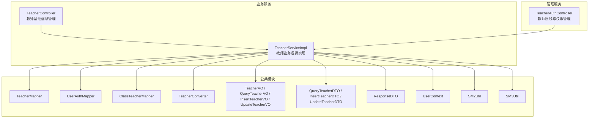
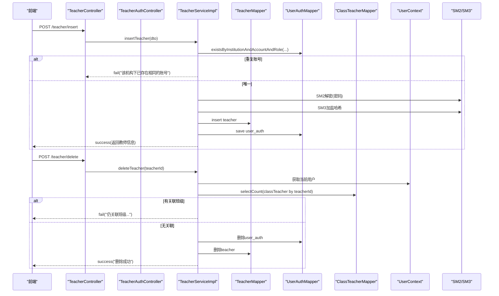
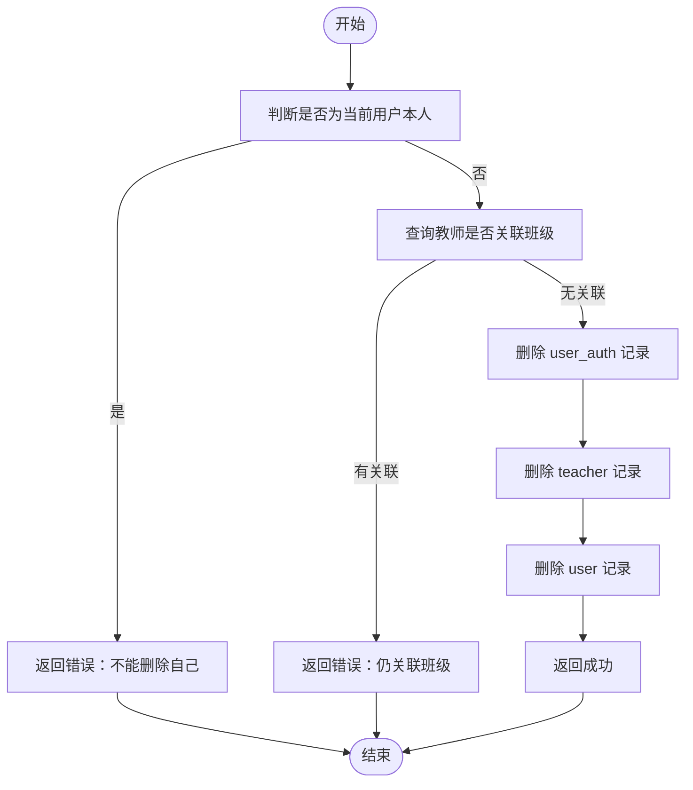
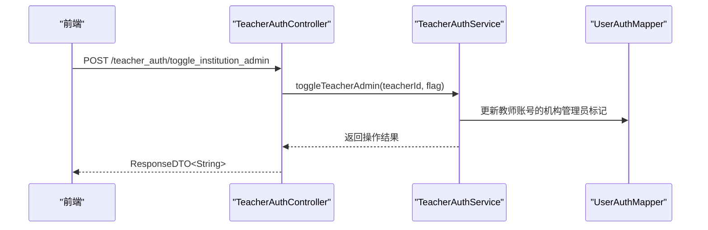
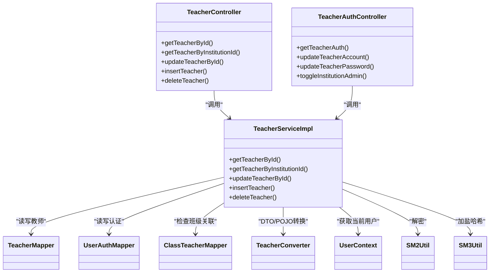

# 教师管理接口

<cite>
**本文引用的文件**   
- [TeacherController.java](file://class_times_record_back/business-service/src/main/java/com/shiroko/controller/TeacherController.java)
- [TeacherServiceImpl.java](file://class_times_record_back/business-service/src/main/java/com/shiroko/service/impl/TeacherServiceImpl.java)
- [TeacherService.java](file://class_times_record_back/common/src/main/java/com/shiroko/service/TeacherService.java)
- [TeacherAuthController.java](file://class_times_record_back/admin-service/src/main/java/com/shiroko/controller/TeacherAuthController.java)
- [TeacherMapper.java](file://class_times_record_back/common/src/main/java/com/shiroko/mapper/TeacherMapper.java)
- [UserAuthMapper.java](file://class_times_record_back/common/src/main/java/com/shiroko/mapper/UserAuthMapper.java)
- [ClassTeacherMapper.java](file://class_times_record_back/common/src/main/java/com/shiroko/mapper/ClassTeacherMapper.java)
- [TeacherConverter.java](file://class_times_record_back/common/src/main/java/com/shiroko/converter/TeacherConverter.java)
- [TeacherVO.java](file://class_times_record_back/common/src/main/java/com/shiroko/repository/vo/teacher/TeacherVO.java)
- [QueryTeacherDTO.java](file://class_times_record_back/common/src/main/java/com/shiroko/repository/dto/teacher/QueryTeacherDTO.java)
- [InsertTeacherDTO.java](file://class_times_record_back/common/src/main/java/com/shiroko/repository/dto/teacher/InsertTeacherDTO.java)
- [UpdateTeacherDTO.java](file://class_times_record_back/common/src/main/java/com/shiroko/repository/dto/teacher/UpdateTeacherDTO.java)
- [QueryTeacherVO.java](file://class_times_record_back/common/src/main/java/com/shiroko/repository/vo/teacher/QueryTeacherVO.java)
- [InsertTeacherVO.java](file://class_times_record_back/common/src/main/java/com/shiroko/repository/vo/teacher/InsertTeacherVO.java)
- [UpdateTeacherVO.java](file://class_times_record_back/common/src/main/java/com/shiroko/repository/vo/teacher/UpdateTeacherVO.java)
- [ResponseDTO.java](file://class_times_record_back/common/src/main/java/com/shiroko/repository/dto/ResponseDTO.java)
- [UserContext.java](file://class_times_record_back/common/src/main/java/com/shiroko/context/UserContext.java)
- [SM2Util.java](file://class_times_record_back/common/src/main/java/com/shiroko/util/SM2Util.java)
- [SM3Util.java](file://class_times_record_back/common/src/main/java/com/shiroko/util/SM3Util.java)
</cite>

## 目录
1. [简介](#简介)
2. [项目结构](#项目结构)
3. [核心组件](#核心组件)
4. [架构总览](#架构总览)
5. [详细组件分析](#详细组件分析)
6. [依赖关系分析](#依赖关系分析)
7. [性能考虑](#性能考虑)
8. [故障排查指南](#故障排查指南)
9. [结论](#结论)
10. [附录：接口规范与示例](#附录接口规范与示例)

## 简介
本文件为“教师管理”相关接口的完整技术文档，覆盖教师的增删改查、账号与密码管理、机构管理员身份切换等能力；同时说明教师与机构、班级、课程等实体的关联处理思路、权限控制与数据隔离机制、分页与筛选排序的扩展建议，以及性能优化与最佳实践。文档以现有后端代码为依据，结合前端调用约定进行统一描述。

## 项目结构
教师管理功能主要分布在以下模块：
- 业务服务（business-service）：提供教师基础信息管理的控制器与服务实现
- 管理服务（admin-service）：提供教师账号、密码及机构管理员身份的管理接口
- 公共模块（common）：定义教师相关的实体、DTO/VO、转换器、Mapper 与通用工具

图示来源
- [TeacherController.java:1-66](file://class_times_record_back/business-service/src/main/java/com/shiroko/controller/TeacherController.java#L1-L66)
- [TeacherServiceImpl.java:1-237](file://class_times_record_back/business-service/src/main/java/com/shiroko/service/impl/TeacherServiceImpl.java#L1-L237)
- [TeacherAuthController.java:1-55](file://class_times_record_back/admin-service/src/main/java/com/shiroko/controller/TeacherAuthController.java#L1-L55)
- [TeacherMapper.java](file://class_times_record_back/common/src/main/java/com/shiroko/mapper/TeacherMapper.java)
- [UserAuthMapper.java](file://class_times_record_back/common/src/main/java/com/shiroko/mapper/UserAuthMapper.java)
- [ClassTeacherMapper.java](file://class_times_record_back/common/src/main/java/com/shiroko/mapper/ClassTeacherMapper.java)
- [TeacherConverter.java](file://class_times_record_back/common/src/main/java/com/shiroko/converter/TeacherConverter.java)
- [TeacherVO.java](file://class_times_record_back/common/src/main/java/com/shiroko/repository/vo/teacher/TeacherVO.java)
- [QueryTeacherDTO.java](file://class_times_record_back/common/src/main/java/com/shiroko/repository/dto/teacher/QueryTeacherDTO.java)
- [InsertTeacherDTO.java](file://class_times_record_back/common/src/main/java/com/shiroko/repository/dto/teacher/InsertTeacherDTO.java)
- [UpdateTeacherDTO.java](file://class_times_record_back/common/src/main/java/com/shiroko/repository/dto/teacher/UpdateTeacherDTO.java)
- [QueryTeacherVO.java](file://class_times_record_back/common/src/main/java/com/shiroko/repository/vo/teacher/QueryTeacherVO.java)
- [InsertTeacherVO.java](file://class_times_record_back/common/src/main/java/com/shiroko/repository/vo/teacher/InsertTeacherVO.java)
- [UpdateTeacherVO.java](file://class_times_record_back/common/src/main/java/com/shiroko/repository/vo/teacher/UpdateTeacherVO.java)
- [ResponseDTO.java](file://class_times_record_back/common/src/main/java/com/shiroko/repository/dto/ResponseDTO.java)
- [UserContext.java](file://class_times_record_back/common/src/main/java/com/shiroko/context/UserContext.java)
- [SM2Util.java](file://class_times_record_back/common/src/main/java/com/shiroko/util/SM2Util.java)
- [SM3Util.java](file://class_times_record_back/common/src/main/java/com/shiroko/util/SM3Util.java)

章节来源
- [TeacherController.java:1-66](file://class_times_record_back/business-service/src/main/java/com/shiroko/controller/TeacherController.java#L1-L66)
- [TeacherServiceImpl.java:1-237](file://class_times_record_back/business-service/src/main/java/com/shiroko/service/impl/TeacherServiceImpl.java#L1-L237)
- [TeacherAuthController.java:1-55](file://class_times_record_back/admin-service/src/main/java/com/shiroko/controller/TeacherAuthController.java#L1-L55)

## 核心组件
- 控制器层
  - 业务服务控制器：负责教师基本信息的新增、更新、按ID查询、按机构查询、删除
  - 管理服务控制器：负责教师账号获取、账号修改、密码修改、机构管理员身份切换
- 服务层
  - 教师服务接口：定义教师CRUD与删除方法
  - 教师服务实现：封装新增、更新、查询、删除的业务规则，包含唯一性校验、密码加盐哈希、关联检查与级联清理
- 数据访问层
  - TeacherMapper：教师表读写
  - UserAuthMapper：用户认证表读写（含按机构+账号+角色唯一性校验）
  - ClassTeacherMapper：教师-班级关联表计数，用于删除前关联检查
- 转换与模型
  - TeacherConverter：DTO 与 POJO 互转
  - VO/DTO：请求参数与响应对象
- 安全与上下文
  - UserContext：当前登录用户上下文
  - SM2Util/SM3Util：国密算法解密与加盐哈希

章节来源
- [TeacherService.java:1-38](file://class_times_record_back/common/src/main/java/com/shiroko/service/TeacherService.java#L1-L38)
- [TeacherServiceImpl.java:1-237](file://class_times_record_back/business-service/src/main/java/com/shiroko/service/impl/TeacherServiceImpl.java#L1-L237)
- [TeacherController.java:1-66](file://class_times_record_back/business-service/src/main/java/com/shiroko/controller/TeacherController.java#L1-L66)
- [TeacherAuthController.java:1-55](file://class_times_record_back/admin-service/src/main/java/com/shiroko/controller/TeacherAuthController.java#L1-L55)

## 架构总览
下图展示了教师管理在前后端交互中的关键路径：前端通过 REST 调用业务服务与管理服务的控制器，服务层执行业务规则并访问数据库，必要时使用加密工具与上下文完成安全操作。

图示来源
- [TeacherController.java:1-66](file://class_times_record_back/business-service/src/main/java/com/shiroko/controller/TeacherController.java#L1-L66)
- [TeacherServiceImpl.java:1-237](file://class_times_record_back/business-service/src/main/java/com/shiroko/service/impl/TeacherServiceImpl.java#L1-L237)
- [TeacherAuthController.java:1-55](file://class_times_record_back/admin-service/src/main/java/com/shiroko/controller/TeacherAuthController.java#L1-L55)
- [TeacherMapper.java](file://class_times_record_back/common/src/main/java/com/shiroko/mapper/TeacherMapper.java)
- [UserAuthMapper.java](file://class_times_record_back/common/src/main/java/com/shiroko/mapper/UserAuthMapper.java)
- [ClassTeacherMapper.java](file://class_times_record_back/common/src/main/java/com/shiroko/mapper/ClassTeacherMapper.java)
- [UserContext.java](file://class_times_record_back/common/src/main/java/com/shiroko/context/UserContext.java)
- [SM2Util.java](file://class_times_record_back/common/src/main/java/com/shiroko/util/SM2Util.java)
- [SM3Util.java](file://class_times_record_back/common/src/main/java/com/shiroko/util/SM3Util.java)

## 详细组件分析

### 教师基础信息管理（业务服务）
- 新增教师
  - 入口：POST /teacher/insert
  - 输入：InsertTeacherDTO（包含机构ID、账号、加密后的密码等）
  - 流程要点：
    - 唯一性校验：同一机构下账号不可重复（基于角色=教师）
    - 创建用户记录与教师记录
    - 使用 SM2 解密前端传来的密码明文，再用 SM3 加盐哈希后保存
    - 返回插入结果与教师信息
  - 输出：InsertTeacherVO
- 更新教师
  - 入口：POST /teacher/update_by_id
  - 输入：UpdateTeacherDTO（可更新教师信息与可选的账号/密码）
  - 流程要点：
    - 若更新账号：在同一机构下进行唯一性校验
    - 若更新密码：SM2 解密 + SM3 加盐哈希后更新
    - 返回受影响行数
- 按ID查询
  - 入口：POST /teacher/get_by_id
  - 输入：QueryTeacherDTO（包含 teacherId）
  - 输出：QueryTeacherVO（包含教师列表与总数）
- 按机构查询
  - 入口：POST /teacher/get_teacher_by_institution_id
  - 输入：QueryTeacherDTO（包含 institutionId）
  - 输出：QueryTeacherVO（包含教师列表与总数）
- 删除教师
  - 入口：POST /teacher/delete
  - 输入：{ teacherId }
  - 流程要点：
    - 禁止删除自己
    - 检查是否仍关联班级，若有则拒绝删除
    - 级联清理：先删 user_auth，再删 teacher，最后删 user
  - 输出：成功或失败消息

图示来源
- [TeacherServiceImpl.java:174-231](file://class_times_record_back/business-service/src/main/java/com/shiroko/service/impl/TeacherServiceImpl.java#L174-L231)
- [ClassTeacherMapper.java](file://class_times_record_back/common/src/main/java/com/shiroko/mapper/ClassTeacherMapper.java)
- [UserAuthMapper.java](file://class_times_record_back/common/src/main/java/com/shiroko/mapper/UserAuthMapper.java)
- [TeacherMapper.java](file://class_times_record_back/common/src/main/java/com/shiroko/mapper/TeacherMapper.java)
- [UserContext.java](file://class_times_record_back/common/src/main/java/com/shiroko/context/UserContext.java)

章节来源
- [TeacherController.java:35-64](file://class_times_record_back/business-service/src/main/java/com/shiroko/controller/TeacherController.java#L35-L64)
- [TeacherServiceImpl.java:60-172](file://class_times_record_back/business-service/src/main/java/com/shiroko/service/impl/TeacherServiceImpl.java#L60-L172)
- [TeacherServiceImpl.java:174-231](file://class_times_record_back/business-service/src/main/java/com/shiroko/service/impl/TeacherServiceImpl.java#L174-L231)

### 教师账号与权限管理（管理服务）
- 获取教师账号信息
  - 入口：POST /teacher_auth/get
  - 输入：{ teacherId }
  - 输出：Map<String, Object>（包含账号等信息）
- 修改教师账号
  - 入口：POST /teacher_auth/update_account
  - 输入：{ teacherId, account }
  - 行为：更新教师账号（建议在业务侧增加唯一性校验）
- 修改教师密码
  - 入口：POST /teacher_auth/update_password
  - 输入：{ teacherId, password }
  - 行为：更新教师密码（建议采用与新增一致的加盐哈希策略）
- 切换机构管理员身份
  - 入口：POST /teacher_auth/toggle_institution_admin
  - 输入：{ teacherId, isInstitutionAdmin }
  - 行为：将教师设置为机构管理员或取消该身份（与系统管理员不同）

图示来源
- [TeacherAuthController.java:42-53](file://class_times_record_back/admin-service/src/main/java/com/shiroko/controller/TeacherAuthController.java#L42-L53)
- [UserAuthMapper.java](file://class_times_record_back/common/src/main/java/com/shiroko/mapper/UserAuthMapper.java)

章节来源
- [TeacherAuthController.java:21-53](file://class_times_record_back/admin-service/src/main/java/com/shiroko/controller/TeacherAuthController.java#L21-L53)

### 数据模型与约束
- 教师实体与视图
  - Teacher：教师主实体
  - TeacherVO：查询返回的教师信息视图
  - QueryTeacherVO：分页/列表包装（包含 teachers 列表与 total）
- 请求与响应
  - InsertTeacherDTO：新增教师所需字段（机构ID、账号、加密密码等）
  - UpdateTeacherDTO：更新教师所需字段（可包含账号/密码）
  - QueryTeacherDTO：查询条件（teacherId 或 institutionId）
  - InsertTeacherVO / UpdateTeacherVO：对应操作的返回体
- 业务规则约束
  - 账号唯一性：同一机构下教师账号不可重复
  - 删除保护：禁止删除自己；若仍关联班级则不允许删除
  - 密码安全：前端使用 SM2 加密传输，服务端使用 SM3 加盐哈希存储
  - 事务一致性：新增/更新/删除均处于事务中，确保多表操作一致性

章节来源
- [TeacherServiceImpl.java:85-172](file://class_times_record_back/business-service/src/main/java/com/shiroko/service/impl/TeacherServiceImpl.java#L85-L172)
- [TeacherServiceImpl.java:174-231](file://class_times_record_back/business-service/src/main/java/com/shiroko/service/impl/TeacherServiceImpl.java#L174-L231)
- [TeacherVO.java](file://class_times_record_back/common/src/main/java/com/shiroko/repository/vo/teacher/TeacherVO.java)
- [QueryTeacherVO.java](file://class_times_record_back/common/src/main/java/com/shiroko/repository/vo/teacher/QueryTeacherVO.java)
- [InsertTeacherDTO.java](file://class_times_record_back/common/src/main/java/com/shiroko/repository/dto/teacher/InsertTeacherDTO.java)
- [UpdateTeacherDTO.java](file://class_times_record_back/common/src/main/java/com/shiroko/repository/dto/teacher/UpdateTeacherDTO.java)
- [QueryTeacherDTO.java](file://class_times_record_back/common/src/main/java/com/shiroko/repository/dto/teacher/QueryTeacherDTO.java)
- [InsertTeacherVO.java](file://class_times_record_back/common/src/main/java/com/shiroko/repository/vo/teacher/InsertTeacherVO.java)
- [UpdateTeacherVO.java](file://class_times_record_back/common/src/main/java/com/shiroko/repository/vo/teacher/UpdateTeacherVO.java)

## 依赖关系分析
- 控制器到服务：TeacherController 与 TeacherAuthController 分别依赖各自的服务接口
- 服务到数据访问：TeacherServiceImpl 依赖 TeacherMapper、UserAuthMapper、ClassTeacherMapper
- 服务到工具：依赖 SM2/SM3 工具类与 UserContext
- 服务到转换器：使用 TeacherConverter 进行 DTO/POJO 转换
- 服务到通用响应：统一使用 ResponseDTO 封装返回

图示来源
- [TeacherController.java:1-66](file://class_times_record_back/business-service/src/main/java/com/shiroko/controller/TeacherController.java#L1-L66)
- [TeacherAuthController.java:1-55](file://class_times_record_back/admin-service/src/main/java/com/shiroko/controller/TeacherAuthController.java#L1-L55)
- [TeacherServiceImpl.java:1-237](file://class_times_record_back/business-service/src/main/java/com/shiroko/service/impl/TeacherServiceImpl.java#L1-L237)
- [TeacherMapper.java](file://class_times_record_back/common/src/main/java/com/shiroko/mapper/TeacherMapper.java)
- [UserAuthMapper.java](file://class_times_record_back/common/src/main/java/com/shiroko/mapper/UserAuthMapper.java)
- [ClassTeacherMapper.java](file://class_times_record_back/common/src/main/java/com/shiroko/mapper/ClassTeacherMapper.java)
- [TeacherConverter.java](file://class_times_record_back/common/src/main/java/com/shiroko/converter/TeacherConverter.java)
- [UserContext.java](file://class_times_record_back/common/src/main/java/com/shiroko/context/UserContext.java)
- [SM2Util.java](file://class_times_record_back/common/src/main/java/com/shiroko/util/SM2Util.java)
- [SM3Util.java](file://class_times_record_back/common/src/main/java/com/shiroko/util/SM3Util.java)

## 性能考虑
- 查询优化
  - 按机构查询当前未实现分页，建议在 Mapper 层引入分页参数并在 Service 层组装分页结果，避免一次性加载大量数据
  - 对常用查询字段（如 institutionId、account）建立索引，提升检索效率
- 写入优化
  - 新增/更新时减少不必要的查询，尽量使用批量或合并更新
  - 密码哈希计算开销较大，建议在高并发场景下评估是否需要异步化或缓存策略
- 事务边界
  - 删除操作涉及多表清理，保持事务一致性的同时注意锁粒度，避免长事务影响其他请求
- 日志与监控
  - 关键路径添加必要日志（如重复账号、关联检查失败），便于问题定位与性能分析

[本节为通用指导，不直接分析具体文件]

## 故障排查指南
- 常见错误与原因
  - “该机构下已存在相同的账号”：新增或更新账号时触发唯一性校验失败
  - “不能删除自己”：尝试删除当前登录用户对应的教师记录
  - “该教师仍关联班级，请先将该教师从班级中移除或删除相关班级后再删除”：删除前检查发现仍有班级关联
  - “删除失败”：删除 teacher 记录受影响行数为 0，可能由于外键约束或数据不存在
- 排查步骤
  - 确认请求参数是否正确（teacherId、institutionId、账号格式等）
  - 检查数据库中是否存在重复账号或关联班级记录
  - 查看服务日志中关于重复账号、关联检查、删除顺序的提示
  - 验证前端是否正确使用 SM2 加密密码，服务端是否能正确解密与哈希

章节来源
- [TeacherServiceImpl.java:85-172](file://class_times_record_back/business-service/src/main/java/com/shiroko/service/impl/TeacherServiceImpl.java#L85-L172)
- [TeacherServiceImpl.java:174-231](file://class_times_record_back/business-service/src/main/java/com/shiroko/service/impl/TeacherServiceImpl.java#L174-L231)

## 结论
教师管理接口围绕“基础信息 CRUD + 账号与权限管理”展开，实现了严格的唯一性与关联保护规则，并通过国密算法保障密码安全。当前查询尚未支持分页与复杂筛选，建议后续在服务层与 Mapper 层扩展分页与条件查询能力，以提升大数据量下的性能与用户体验。

[本节为总结性内容，不直接分析具体文件]

## 附录：接口规范与示例

### 接口清单
- 教师基础信息
  - POST /teacher/insert
  - POST /teacher/update_by_id
  - POST /teacher/get_by_id
  - POST /teacher/get_teacher_by_institution_id
  - POST /teacher/delete
- 教师账号与权限
  - POST /teacher_auth/get
  - POST /teacher_auth/update_account
  - POST /teacher_auth/update_password
  - POST /teacher_auth/toggle_institution_admin

### 请求与响应示例（文本形式）
- 新增教师
  - 请求体（InsertTeacherDTO）
    - institutionId: 数字
    - account: 字符串
    - password: 字符串（SM2 加密后的密文）
  - 成功响应（InsertTeacherVO）
    - 包含教师信息（由 TeacherVO 组成）
  - 失败响应
    - 消息：“该机构下已存在相同的账号”
- 更新教师
  - 请求体（UpdateTeacherDTO）
    - teacherId: 数字
    - 可选字段：account、password（SM2 加密）、其他教师属性
  - 成功响应（UpdateTeacherVO）
    - 受影响行数
  - 失败响应
    - 消息：“该机构下已存在相同的账号”或“更新失败”
- 按ID查询
  - 请求体（QueryTeacherDTO）
    - teacherId: 数字
  - 成功响应（QueryTeacherVO）
    - teachers: 列表（TeacherVO）
    - total: 数字
- 按机构查询
  - 请求体（QueryTeacherDTO）
    - institutionId: 数字
  - 成功响应（QueryTeacherVO）
    - teachers: 列表（TeacherVO）
    - total: 数字
- 删除教师
  - 请求体
    - teacherId: 数字
  - 成功响应
    - 消息：“删除成功”
  - 失败响应
    - 消息：“教师不存在”、“不能删除自己”、“该教师仍关联班级...”、“删除失败”
- 获取教师账号
  - 请求体
    - teacherId: 数字
  - 成功响应
    - Map<String, Object>（包含账号等信息）
- 修改教师账号
  - 请求体
    - teacherId: 数字
    - account: 字符串
  - 成功响应
    - 消息：“操作成功”（具体以服务实现为准）
- 修改教师密码
  - 请求体
    - teacherId: 数字
    - password: 字符串（建议与服务端策略一致，如 SM2 加密后传入）
  - 成功响应
    - 消息：“操作成功”
- 切换机构管理员身份
  - 请求体
    - teacherId: 数字
    - isInstitutionAdmin: 布尔值
  - 成功响应
    - 消息：“操作成功”

### 高级查询与排序（扩展建议）
- 分页查询
  - 建议在 QueryTeacherDTO 中增加 page、size 字段
  - 在 Service 层使用 MyBatis-Plus 的分页插件或自定义 SQL 分页
  - 返回 QueryTeacherVO 中的 total 与实际 pages 信息
- 条件筛选
  - 支持按姓名、手机号、状态等字段模糊匹配
  - 在 Mapper 层使用动态条件构建（LambdaQueryWrapper 或 XML）
- 排序
  - 支持按创建时间、更新时间等字段升序/降序
  - 在 Service 层拼接 orderBy 条件

[本节为接口规范与扩展建议，不直接分析具体文件]