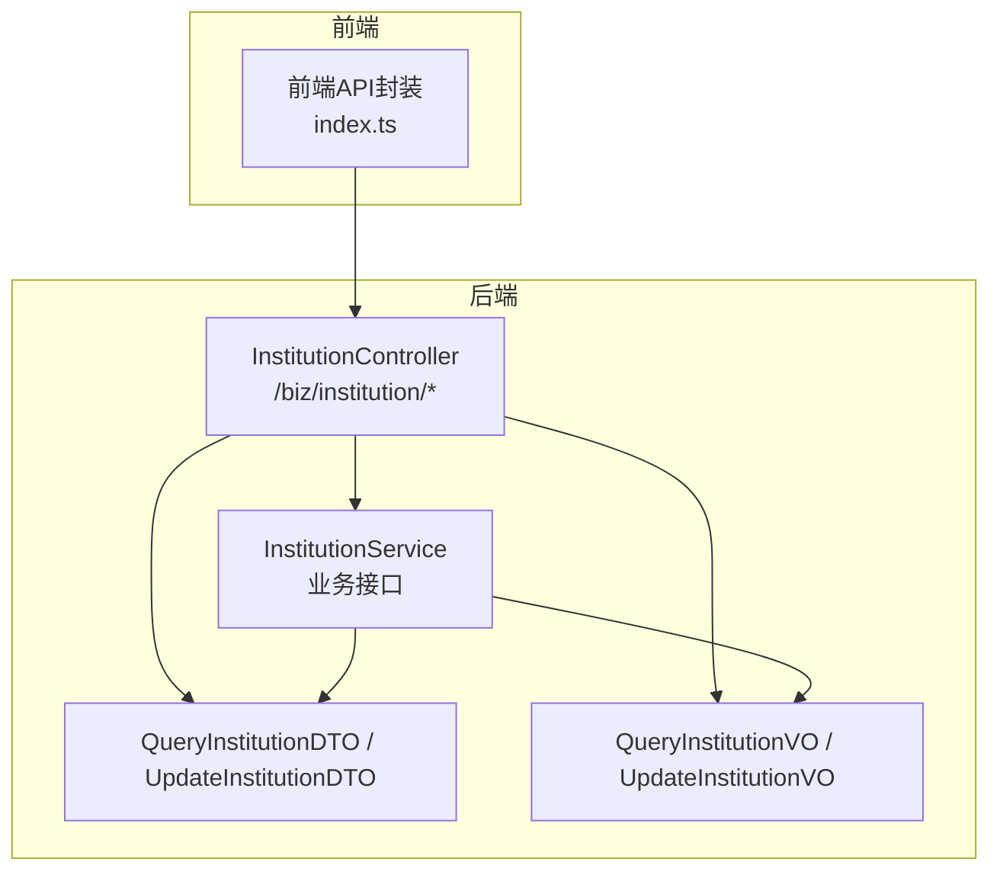
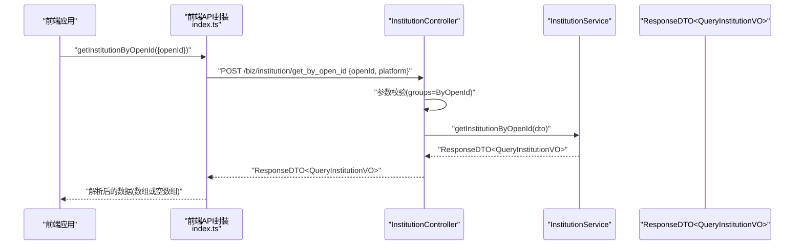
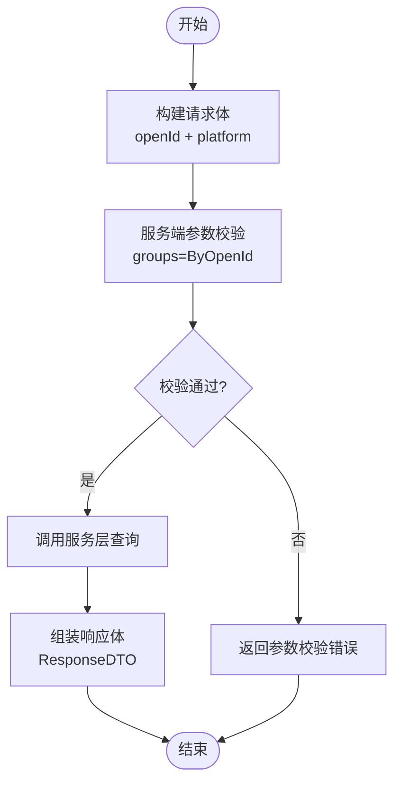

# 机构管理接口

<cite>
**本文引用的文件**   
- [InstitutionController.java](file://class_times_record_back/business-service/src/main/java/com/shiroko/controller/InstitutionController.java)
- [InstitutionService.java](file://class_times_record_back/business-service/src/main/java/com/shiroko/service/InstitutionService.java)
- [QueryInstitutionDTO.java](file://class_times_record_back/common/src/main/java/com/shiroko/repository/dto/institution/QueryInstitutionDTO.java)
- [QueryInstitutionVO.java](file://class_times_record_back/common/src/main/java/com/shiroko/repository/vo/institution/QueryInstitutionVO.java)
- [UpdateInstitutionDTO.java](file://class_times_record_back/common/src/main/java/com/shiroko/repository/dto/institution/UpdateInstitutionDTO.java)
- [UpdateInstitutionVO.java](file://class_times_record_back/common/src/main/java/com/shiroko/repository/vo/institution/UpdateInstitutionVO.java)
- [index.ts](file://class_times_record/src/api/institution/index.ts)
</cite>

## 目录
1. [简介](#简介)
2. [项目结构](#项目结构)
3. [核心组件](#核心组件)
4. [架构总览](#架构总览)
5. [详细组件分析](#详细组件分析)
6. [依赖关系分析](#依赖关系分析)
7. [性能考虑](#性能考虑)
8. [故障排查指南](#故障排查指南)
9. [结论](#结论)
10. [附录](#附录)

## 简介
本文件为“机构管理”相关接口的权威文档，覆盖以下能力：
- 按机构ID查询
- 按学生ID查询
- 按OpenId查询（需平台标识）
- 按机构编码查询
- 更新机构信息

文档包含请求参数规范、验证规则与必填字段说明；响应数据结构定义；典型调用示例；业务含义与关联关系；错误码与异常处理机制。

## 项目结构
后端采用分层架构：控制器层暴露REST接口，服务层封装业务逻辑，通用模块提供DTO/VO定义与校验分组。前端通过统一HTTP客户端调用后端接口。

图表来源
- [InstitutionController.java:1-57](file://class_times_record_back/business-service/src/main/java/com/shiroko/controller/InstitutionController.java#L1-L57)
- [InstitutionService.java:1-30](file://class_times_record_back/business-service/src/main/java/com/shiroko/service/InstitutionService.java#L1-L30)
- [QueryInstitutionDTO.java:1-31](file://class_times_record_back/common/src/main/java/com/shiroko/repository/dto/institution/QueryInstitutionDTO.java#L1-L31)
- [QueryInstitutionVO.java:1-23](file://class_times_record_back/common/src/main/java/com/shiroko/repository/vo/institution/QueryInstitutionVO.java#L1-L23)
- [index.ts:1-86](file://class_times_record/src/api/institution/index.ts#L1-L86)

章节来源
- [InstitutionController.java:1-57](file://class_times_record_back/business-service/src/main/java/com/shiroko/controller/InstitutionController.java#L1-L57)
- [InstitutionService.java:1-30](file://class_times_record_back/business-service/src/main/java/com/shiroko/service/InstitutionService.java#L1-L30)
- [QueryInstitutionDTO.java:1-31](file://class_times_record_back/common/src/main/java/com/shiroko/repository/dto/institution/QueryInstitutionDTO.java#L1-L31)
- [QueryInstitutionVO.java:1-23](file://class_times_record_back/common/src/main/java/com/shiroko/repository/vo/institution/QueryInstitutionVO.java#L1-L23)
- [index.ts:1-86](file://class_times_record/src/api/institution/index.ts#L1-L86)

## 核心组件
- 控制器：对外暴露统一的机构查询与更新接口，路径前缀为 /institution，网关或路由层映射到 /biz/institution。
- 服务：定义查询与更新的业务方法签名，返回统一响应包装对象。
- DTO/VO：
  - QueryInstitutionDTO：查询入参，使用校验分组控制不同场景的必填字段。
  - QueryInstitutionVO：查询出参，包含机构列表。
  - UpdateInstitutionDTO/UpdateInstitutionVO：更新入参与出参。

章节来源
- [InstitutionController.java:1-57](file://class_times_record_back/business-service/src/main/java/com/shiroko/controller/InstitutionController.java#L1-L57)
- [InstitutionService.java:1-30](file://class_times_record_back/business-service/src/main/java/com/shiroko/service/InstitutionService.java#L1-L30)
- [QueryInstitutionDTO.java:1-31](file://class_times_record_back/common/src/main/java/com/shiroko/repository/dto/institution/QueryInstitutionDTO.java#L1-L31)
- [QueryInstitutionVO.java:1-23](file://class_times_record_back/common/src/main/java/com/shiroko/repository/vo/institution/QueryInstitutionVO.java#L1-L23)
- [UpdateInstitutionDTO.java](file://class_times_record_back/common/src/main/java/com/shiroko/repository/dto/institution/UpdateInstitutionDTO.java)
- [UpdateInstitutionVO.java](file://class_times_record_back/common/src/main/java/com/shiroko/repository/vo/institution/UpdateInstitutionVO.java)

## 架构总览
下图展示一次“按OpenId查询机构”的典型调用链：前端发起POST请求，控制器接收并校验参数，委托服务完成查询，最终返回统一响应体。

图表来源
- [InstitutionController.java:41-44](file://class_times_record_back/business-service/src/main/java/com/shiroko/controller/InstitutionController.java#L41-L44)
- [InstitutionService.java:22](file://class_times_record_back/business-service/src/main/java/com/shiroko/service/InstitutionService.java#L22)
- [QueryInstitutionDTO.java:25-29](file://class_times_record_back/common/src/main/java/com/shiroko/repository/dto/institution/QueryInstitutionDTO.java#L25-L29)
- [index.ts:19-42](file://class_times_record/src/api/institution/index.ts#L19-L42)

## 详细组件分析

### 接口清单与路由
- 基础路径：/institution（由网关或路由映射为 /biz/institution）
- 接口列表：
  - POST /institution/get_by_id
  - POST /institution/get_institution_by_student_id
  - POST /institution/get_by_open_id
  - POST /institution/get_by_institution_code
  - POST /institution/update

章节来源
- [InstitutionController.java:31-54](file://class_times_record_back/business-service/src/main/java/com/shiroko/controller/InstitutionController.java#L31-L54)

### 请求参数规范与验证规则

#### 公共响应包装
- 所有接口均返回统一响应包装对象 ResponseDTO<T>，其中 T 为具体业务VO。

章节来源
- [InstitutionController.java:3-8](file://class_times_record_back/business-service/src/main/java/com/shiroko/controller/InstitutionController.java#L3-L8)

#### 查询入参：QueryInstitutionDTO
- 字段
  - institutionId：Long，按ID查询时必填
  - studentId：Long，按学生ID查询时使用
  - institutionCode：String，按机构编码查询时必填
  - openId：String，按OpenId查询时必填
  - platform：String，按OpenId查询时必填
- 校验分组
  - ById：仅校验 institutionId 非空
  - ByInstitutionCode：仅校验 institutionCode 非空
  - ByOpenId：仅校验 openId、platform 非空

章节来源
- [QueryInstitutionDTO.java:17-29](file://class_times_record_back/common/src/main/java/com/shiroko/repository/dto/institution/QueryInstitutionDTO.java#L17-L29)

#### 查询出参：QueryInstitutionVO
- 字段
  - institutions：List<InstitutionVO>，机构集合（包含基本信息与配置信息等）

章节来源
- [QueryInstitutionVO.java:20-22](file://class_times_record_back/common/src/main/java/com/shiroko/repository/vo/institution/QueryInstitutionVO.java#L20-L22)

#### 更新入参：UpdateInstitutionDTO
- 用于更新机构信息，具体字段以该DTO定义为准。

章节来源
- [UpdateInstitutionDTO.java](file://class_times_record_back/common/src/main/java/com/shiroko/repository/dto/institution/UpdateInstitutionDTO.java)

#### 更新出参：UpdateInstitutionVO
- 更新操作的结果对象，具体字段以该VO定义为准。

章节来源
- [UpdateInstitutionVO.java](file://class_times_record_back/common/src/main/java/com/shiroko/repository/vo/institution/UpdateInstitutionVO.java)

### 接口详情

#### 按ID查询机构
- 路由：POST /institution/get_by_id
- 请求体：QueryInstitutionDTO（校验分组 ById）
- 必填字段：institutionId
- 响应体：ResponseDTO<QueryInstitutionVO>
- 行为：根据机构主键精确查询，返回匹配的机构列表（通常为一个元素）

章节来源
- [InstitutionController.java:31-34](file://class_times_record_back/business-service/src/main/java/com/shiroko/controller/InstitutionController.java#L31-L34)
- [QueryInstitutionDTO.java:17-18](file://class_times_record_back/common/src/main/java/com/shiroko/repository/dto/institution/QueryInstitutionDTO.java#L17-L18)
- [QueryInstitutionVO.java:20-22](file://class_times_record_back/common/src/main/java/com/shiroko/repository/vo/institution/QueryInstitutionVO.java#L20-L22)

#### 按学生ID查询机构
- 路由：POST /institution/get_institution_by_student_id
- 请求体：QueryInstitutionDTO（studentId）
- 必填字段：studentId
- 响应体：ResponseDTO<QueryInstitutionVO>
- 行为：根据学生ID定位其所属机构

章节来源
- [InstitutionController.java:36-39](file://class_times_record_back/business-service/src/main/java/com/shiroko/controller/InstitutionController.java#L36-L39)
- [QueryInstitutionDTO.java:20](file://class_times_record_back/common/src/main/java/com/shiroko/repository/dto/institution/QueryInstitutionDTO.java#L20)
- [QueryInstitutionVO.java:20-22](file://class_times_record_back/common/src/main/java/com/shiroko/repository/vo/institution/QueryInstitutionVO.java#L20-L22)

#### 按OpenId查询机构
- 路由：POST /institution/get_by_open_id
- 请求体：QueryInstitutionDTO（校验分组 ByOpenId）
- 必填字段：openId、platform
- 响应体：ResponseDTO<QueryInstitutionVO>
- 行为：根据第三方平台的openId查询对应机构

章节来源
- [InstitutionController.java:41-44](file://class_times_record_back/business-service/src/main/java/com/shiroko/controller/InstitutionController.java#L41-L44)
- [QueryInstitutionDTO.java:25-29](file://class_times_record_back/common/src/main/java/com/shiroko/repository/dto/institution/QueryInstitutionDTO.java#L25-L29)
- [QueryInstitutionVO.java:20-22](file://class_times_record_back/common/src/main/java/com/shiroko/repository/vo/institution/QueryInstitutionVO.java#L20-L22)

#### 按机构编码查询
- 路由：POST /institution/get_by_institution_code
- 请求体：QueryInstitutionDTO（校验分组 ByInstitutionCode）
- 必填字段：institutionCode
- 响应体：ResponseDTO<QueryInstitutionVO>
- 行为：根据唯一机构编码查询机构

章节来源
- [InstitutionController.java:46-49](file://class_times_record_back/business-service/src/main/java/com/shiroko/controller/InstitutionController.java#L46-L49)
- [QueryInstitutionDTO.java:22-23](file://class_times_record_back/common/src/main/java/com/shiroko/repository/dto/institution/QueryInstitutionDTO.java#L22-L23)
- [QueryInstitutionVO.java:20-22](file://class_times_record_back/common/src/main/java/com/shiroko/repository/vo/institution/QueryInstitutionVO.java#L20-L22)

#### 更新机构信息
- 路由：POST /institution/update
- 请求体：UpdateInstitutionDTO
- 响应体：ResponseDTO<UpdateInstitutionVO>
- 行为：更新机构基本信息与配置项等

章节来源
- [InstitutionController.java:51-54](file://class_times_record_back/business-service/src/main/java/com/shiroko/controller/InstitutionController.java#L51-L54)
- [UpdateInstitutionDTO.java](file://class_times_record_back/common/src/main/java/com/shiroko/repository/dto/institution/UpdateInstitutionDTO.java)
- [UpdateInstitutionVO.java](file://class_times_record_back/common/src/main/java/com/shiroko/repository/vo/institution/UpdateInstitutionVO.java)

### 前端调用示例与注意事项
- getInstitutionById：传入 { institutionId }，返回第一个机构对象或空
- getInstitutionByOpenId：传入 { openId }，自动附加 platform 字段（如小程序环境），返回机构数组
- getInstitutionByCode：传入 { institutionCode }，返回第一个机构对象或空
- updateInstitution：传入更新字段，返回更新结果

章节来源
- [index.ts:3-17](file://class_times_record/src/api/institution/index.ts#L3-L17)
- [index.ts:19-42](file://class_times_record/src/api/institution/index.ts#L19-L42)
- [index.ts:44-61](file://class_times_record/src/api/institution/index.ts#L44-L61)
- [index.ts:63-78](file://class_times_record/src/api/institution/index.ts#L63-L78)

### 业务流程图（按OpenId查询）

图表来源
- [InstitutionController.java:41-44](file://class_times_record_back/business-service/src/main/java/com/shiroko/controller/InstitutionController.java#L41-L44)
- [QueryInstitutionDTO.java:25-29](file://class_times_record_back/common/src/main/java/com/shiroko/repository/dto/institution/QueryInstitutionDTO.java#L25-L29)

## 依赖关系分析
- 控制器依赖服务接口进行业务处理
- 控制器与服务均依赖DTO/VO进行数据传输
- 前端API封装直接调用控制器暴露的路径

```mermaid
classDiagram
class InstitutionController {
+getInstitutionById(dto)
+getInstitutionByStudentId(dto)
+getInstitutionByOpenId(dto)
+getInstitutionByCode(dto)
+updateInstitution(dto)
}
class InstitutionService {
+getInstitutionById(dto)
+getInstitutionByStudentId(dto)
+getInstitutionByOpenId(dto)
+getInstitutionByCode(dto)
+updateInstitution(dto)
}
class QueryInstitutionDTO
class QueryInstitutionVO
class UpdateInstitutionDTO
class UpdateInstitutionVO
InstitutionController --> InstitutionService : "调用"
InstitutionController --> QueryInstitutionDTO : "入参"
InstitutionController --> QueryInstitutionVO : "出参"
InstitutionController --> UpdateInstitutionDTO : "入参"
InstitutionController --> UpdateInstitutionVO : "出参"
InstitutionService --> QueryInstitutionDTO
InstitutionService --> QueryInstitutionVO
InstitutionService --> UpdateInstitutionDTO
InstitutionService --> UpdateInstitutionVO
```

图表来源
- [InstitutionController.java:27-54](file://class_times_record_back/business-service/src/main/java/com/shiroko/controller/InstitutionController.java#L27-L54)
- [InstitutionService.java:18-29](file://class_times_record_back/business-service/src/main/java/com/shiroko/service/InstitutionService.java#L18-L29)
- [QueryInstitutionDTO.java:14-30](file://class_times_record_back/common/src/main/java/com/shiroko/repository/dto/institution/QueryInstitutionDTO.java#L14-L30)
- [QueryInstitutionVO.java:17-22](file://class_times_record_back/common/src/main/java/com/shiroko/repository/vo/institution/QueryInstitutionVO.java#L17-L22)
- [UpdateInstitutionDTO.java](file://class_times_record_back/common/src/main/java/com/shiroko/repository/dto/institution/UpdateInstitutionDTO.java)
- [UpdateInstitutionVO.java](file://class_times_record_back/common/src/main/java/com/shiroko/repository/vo/institution/UpdateInstitutionVO.java)

## 性能考虑
- 查询接口均为单条记录定位，建议数据库层面在 institutionId、institutionCode、openId+platform、studentId 上建立合适索引以提升查询效率。
- 批量查询未在当前接口体现，若后续扩展为分页或列表查询，应关注分页参数与排序策略。
- 前端对返回数组做了安全处理，避免空引用导致渲染异常。

[本节为通用指导，不直接分析具体文件]

## 故障排查指南
- 参数校验失败
  - 现象：返回参数校验异常，提示某字段不能为空
  - 常见原因：缺少必填字段或未携带平台标识
  - 处理：检查请求体是否包含校验分组要求的字段
- 无数据返回
  - 现象：institutions 为空数组
  - 可能原因：查询条件不存在匹配记录
  - 处理：核对输入值是否正确，确认数据是否存在
- 前端异常捕获
  - 前端已对异常进行捕获并输出日志，便于快速定位问题

章节来源
- [index.ts:13-16](file://class_times_record/src/api/institution/index.ts#L13-L16)
- [index.ts:38-41](file://class_times_record/src/api/institution/index.ts#L38-L41)
- [index.ts:57-60](file://class_times_record/src/api/institution/index.ts#L57-L60)
- [index.ts:74-77](file://class_times_record/src/api/institution/index.ts#L74-L77)

## 结论
机构管理接口提供了灵活的查询方式与统一的更新入口，配合严格的参数校验与统一响应包装，具备良好的可维护性与可扩展性。建议在接入侧严格遵循各接口的必填字段与校验分组要求，并在数据库层完善索引策略以保障查询性能。

[本节为总结性内容，不直接分析具体文件]

## 附录

### 请求/响应示例（文本描述）
- 按ID查询
  - 请求：{ institutionId: 123 }
  - 响应：ResponseDTO<QueryInstitutionVO>，其中 institutions 包含一个机构对象
- 按学生ID查询
  - 请求：{ studentId: 456 }
  - 响应：ResponseDTO<QueryInstitutionVO>，返回该学生所属机构
- 按OpenId查询
  - 请求：{ openId: "wx_xxx", platform: "WEIXIN" }
  - 响应：ResponseDTO<QueryInstitutionVO>，返回匹配机构
- 按机构编码查询
  - 请求：{ institutionCode: "SCH001" }
  - 响应：ResponseDTO<QueryInstitutionVO>，返回匹配机构
- 更新机构
  - 请求：UpdateInstitutionDTO（字段以定义为准）
  - 响应：ResponseDTO<UpdateInstitutionVO>

[本节为概念性示例，不直接分析具体文件]