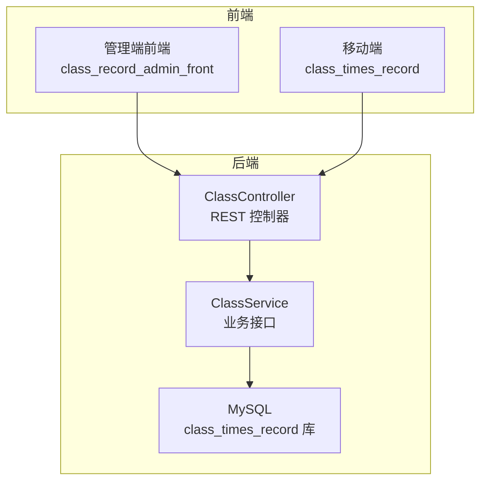
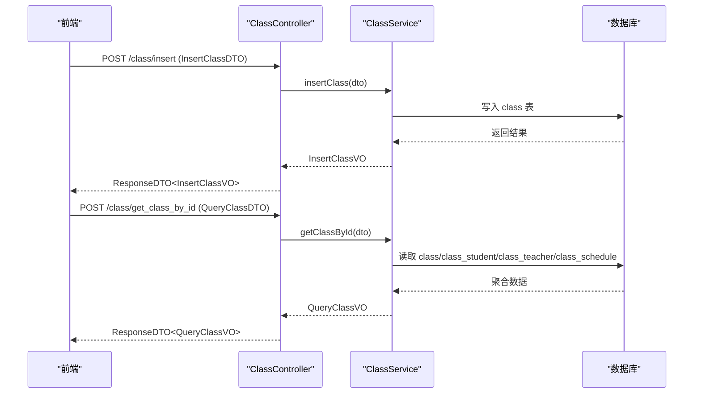
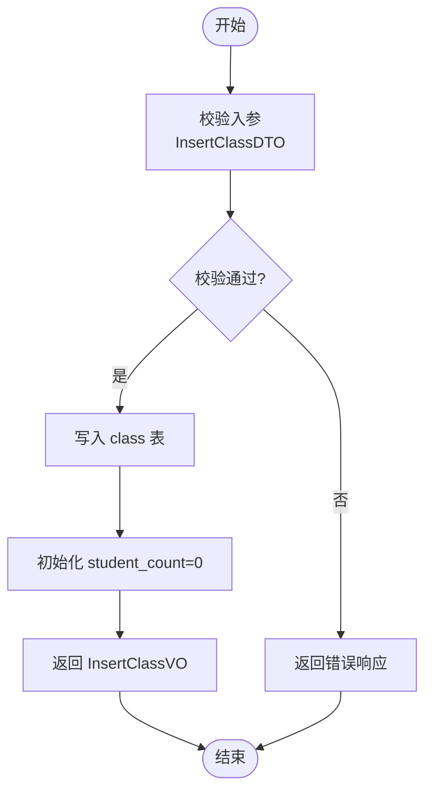
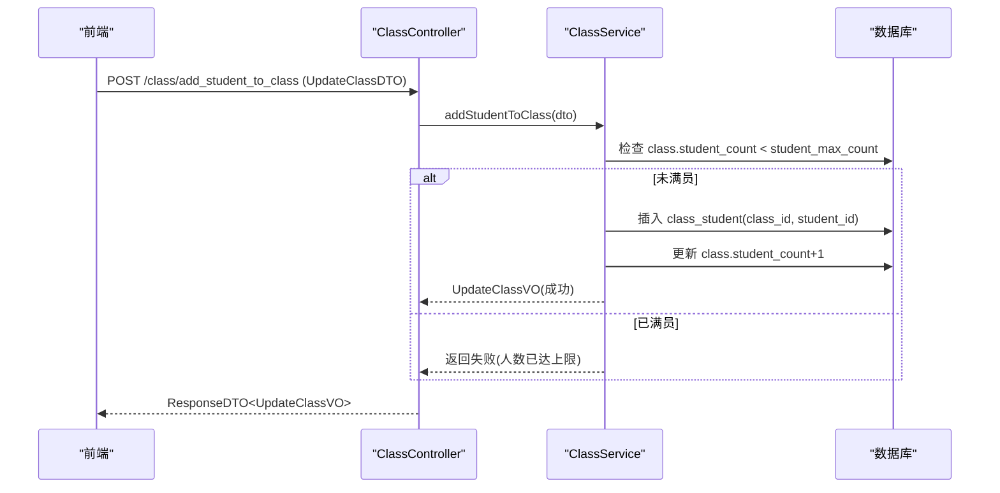
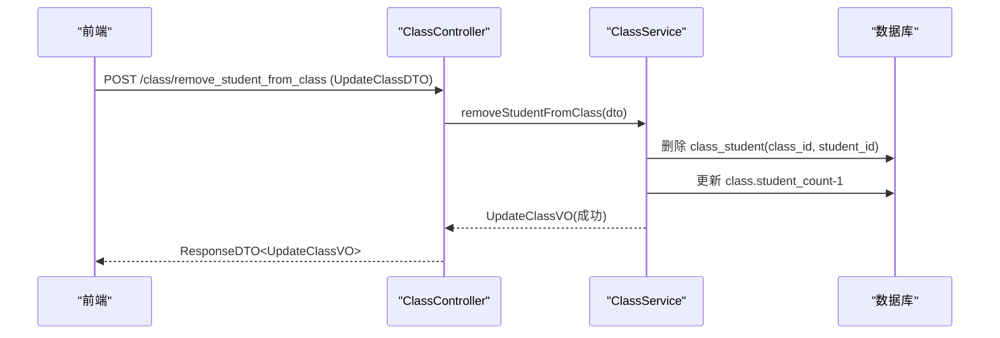
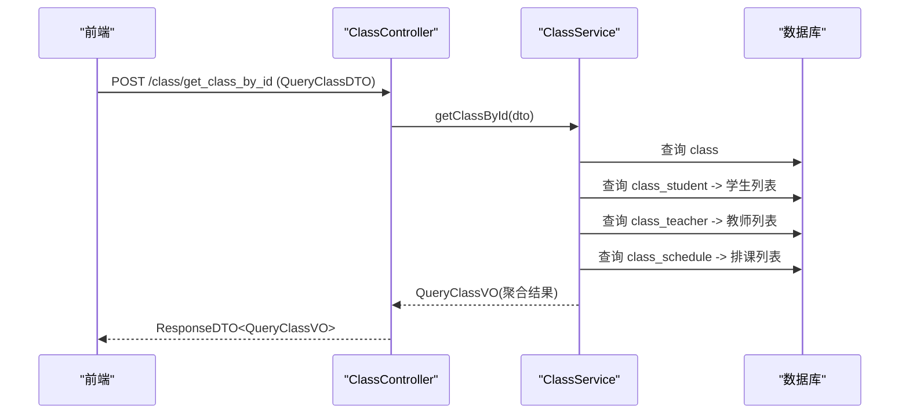
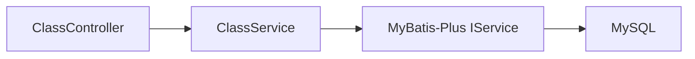

# 班级管理接口

<cite>
**本文引用的文件**   
- [ClassController.java](file://class_times_record_back/business-service/src/main/java/com/shiroko/controller/ClassController.java)
- [ClassService.java](file://class_times_record_back/business-service/src/main/java/com/shiroko/service/ClassService.java)
- [class_times_record.sql](file://class_times_record_back/docs/class_times_record.sql)
</cite>

## 目录
1. [简介](#简介)
2. [项目结构](#项目结构)
3. [核心组件](#核心组件)
4. [架构总览](#架构总览)
5. [详细组件分析](#详细组件分析)
6. [依赖关系分析](#依赖关系分析)
7. [性能考虑](#性能考虑)
8. [故障排查指南](#故障排查指南)
9. [结论](#结论)
10. [附录](#附录)

## 简介
本文件面向“课时记录”系统中的“班级管理”能力，围绕班级生命周期与成员管理、排课与课时记录关联、状态流转、统计信息以及数据迁移/转班等场景，提供完整的接口说明与实现要点。文档基于后端控制器与服务层接口定义及数据库模型进行梳理，确保读者既能快速上手调用，也能理解业务约束与扩展点。

## 项目结构
- 后端服务：business-service 模块暴露班级相关 REST 接口；common 模块提供通用 DTO/VO、异常与工具；数据库脚本位于 docs 目录。
- 前端（管理端）：class_record_admin_front 提供班级管理与排课页面，通过 API 调用后端接口。
- 移动端（教师/家长）：class_times_record 提供教师与家长侧的班级与课时操作入口。



图表来源
- [ClassController.java:1-75](file://class_times_record_back/business-service/src/main/java/com/shiroko/controller/ClassController.java#L1-L75)
- [ClassService.java:1-38](file://class_times_record_back/business-service/src/main/java/com/shiroko/service/ClassService.java#L1-L38)
- [class_times_record.sql:37-105](file://class_times_record_back/docs/class_times_record.sql#L37-L105)

章节来源
- [ClassController.java:1-75](file://class_times_record_back/business-service/src/main/java/com/shiroko/controller/ClassController.java#L1-L75)
- [ClassService.java:1-38](file://class_times_record_back/business-service/src/main/java/com/shiroko/service/ClassService.java#L1-L38)
- [class_times_record.sql:37-105](file://class_times_record_back/docs/class_times_record.sql#L37-L105)

## 核心组件
- 控制器：ClassController 暴露班级查询、创建、更新、成员增删等 HTTP 接口。
- 服务：ClassService 定义班级领域能力（按学生/教师/机构查询、插入、更新、成员管理等）。
- 数据模型：class、class_student、class_teacher、class_schedule、course_record、record 等表构成班级与课程、教师、学生、排课、课时记录的关联基础。

章节来源
- [ClassController.java:27-74](file://class_times_record_back/business-service/src/main/java/com/shiroko/controller/ClassController.java#L27-L74)
- [ClassService.java:20-37](file://class_times_record_back/business-service/src/main/java/com/shiroko/service/ClassService.java#L20-L37)
- [class_times_record.sql:37-105](file://class_times_record_back/docs/class_times_record.sql#L37-L105)

## 架构总览
班级管理的请求链路为：前端发起 HTTP 请求至 ClassController，控制器将参数封装为 DTO 并委托给 ClassService 处理，服务层再访问数据库完成持久化与聚合查询。



图表来源
- [ClassController.java:65-73](file://class_times_record_back/business-service/src/main/java/com/shiroko/controller/ClassController.java#L65-L73)
- [ClassService.java:30-34](file://class_times_record_back/business-service/src/main/java/com/shiroko/service/ClassService.java#L30-L34)
- [class_times_record.sql:37-73](file://class_times_record_back/docs/class_times_record.sql#L37-L73)

## 详细组件分析

### 接口清单与职责
- 创建班级
  - 路径：POST /class/insert
  - 入参：InsertClassDTO
  - 出参：ResponseDTO<InsertClassVO>
  - 职责：新建班级，初始化基本信息与默认人数上限等。
- 更新班级
  - 路径：POST /class/update_by_id
  - 入参：UpdateClassDTO（带 UpdateGroup.UpdateClass 校验）
  - 出参：ResponseDTO<UpdateClassVO>
  - 职责：修改班级名称、人数上限、状态等。
- 删除/解散班级
  - 说明：当前控制器未直接暴露“解散”接口；可通过更新逻辑或后续扩展实现（例如软删除或状态变更）。
- 查询班级
  - 按 ID 查询：POST /class/get_class_by_id
  - 按学生查询：POST /class/get_classes_by_student_id
  - 按教师查询：POST /class/get_classes_by_teacher_id
  - 按机构查询：POST /class/get_classes_by_institution_id
  - 出参：ResponseDTO<QueryClassVO>
- 班级成员管理
  - 添加学生：POST /class/add_student_to_class
  - 移除学生：POST /class/remove_student_from_class（带 RemoveStudent 校验）
- 其他
  - 状态管理（开班/停课/结班）：建议通过 update_by_id 的状态字段控制，具体枚举值以业务约定为准。
  - 排课与课时记录：通过 class_schedule 与 course_record/record 表维护，通常由排课与课时记录模块协同完成。
  - 统计信息：如人数统计、出勤率等，可在服务层聚合 class/class_student/course_record/record 计算后返回。
  - 数据迁移/转班：建议在服务层提供批量迁移方法，保证事务一致性与审计日志。

章节来源
- [ClassController.java:35-73](file://class_times_record_back/business-service/src/main/java/com/shiroko/controller/ClassController.java#L35-L73)
- [ClassService.java:22-36](file://class_times_record_back/business-service/src/main/java/com/shiroko/service/ClassService.java#L22-L36)

### 数据模型与多对多关系
- 实体与关系
  - 班级 class 与课程 course：一对多（一个课程可对应多个班级）。
  - 班级 class 与学生 student：多对多，通过 class_student 关联。
  - 班级 class 与教师 teacher：多对多，通过 class_teacher 关联。
  - 班级 class 与排课 class_schedule：一对多。
  - 学生 student 与课程记录 course_record：一对一或多条（按业务），记录剩余课时、到期时间等。
  - 课时记录 record：与 course_record 一对多，记录增课/消课/纯记录等。
- 关键约束
  - class_student.class_id + student_id 唯一索引，避免重复加入同一班级。
  - class_teacher.class_id + teacher_id 唯一索引，避免重复绑定同一教师。
  - class.student_count 与 student_max_count 用于容量控制。
  - class.status 表示班级状态（示例中为“进行中/已结束”，可按需扩展更多状态）。

```mermaid
erDiagram
CLASS {
int id PK
int course_id FK
string class_name
int student_count
int student_max_count
tinyint status
tinyint isDelete
datetime create_time
datetime update_time
}
COURSE {
int id PK
string course_name
tinyint course_type
int institution_id FK
tinyint is_available
datetime create_time
datetime update_time
}
STUDENT {
int id PK
string student_name
int institution_id FK
tinyint sex
date birth
string school
string address
datetime create_time
datetime update_time
}
TEACHER {
int id PK
int institution_id
int user_id FK
tinyint is_available
string username
string phone
}
CLASS_STUDENT {
int id PK
int class_id FK
int student_id FK
datetime create_time
}
CLASS_TEACHER {
int id PK
int class_id FK
int teacher_id FK
datetime create_time
}
CLASS_SCHEDULE {
int id PK
int class_id FK
date start_date
date end_date
tinyint day_of_week
time start_time
time end_time
varchar remark
datetime create_time
datetime update_time
}
COURSE_RECORD {
int id PK
int student_id FK
int course_id FK
int course_total_time
int course_rest_time
datetime course_last_time
datetime expire_time
int course_status
int course_owner_user_id FK
varchar course_remark
tinyint is_delete
datetime create_time
datetime update_time
}
RECORD {
int id PK
int course_record_id FK
datetime record_time
varchar record_remark
int record_type
int record_change
int operate_teacher_id FK
tinyint is_delete
datetime create_time
datetime update_time
}
CLASS ||--o{ CLASS_STUDENT : "包含"
CLASS ||--o{ CLASS_TEACHER : "拥有"
CLASS ||--o{ CLASS_SCHEDULE : "排课"
CLASS }o--|| COURSE : "属于"
STUDENT ||--o{ CLASS_STUDENT : "加入"
TEACHER ||--o{ CLASS_TEACHER : "任教"
STUDENT ||--o{ COURSE_RECORD : "选课记录"
COURSE ||--o{ COURSE_RECORD : "被选"
COURSE_RECORD ||--o{ RECORD : "课时流水"
```

图表来源
- [class_times_record.sql:37-105](file://class_times_record_back/docs/class_times_record.sql#L37-L105)
- [class_times_record.sql:108-164](file://class_times_record_back/docs/class_times_record.sql#L108-L164)
- [class_times_record.sql:262-281](file://class_times_record_back/docs/class_times_record.sql#L262-L281)

### 业务流程与时序

#### 创建班级流程


图表来源
- [ClassController.java:65-68](file://class_times_record_back/business-service/src/main/java/com/shiroko/controller/ClassController.java#L65-L68)
- [ClassService.java:30-30](file://class_times_record_back/business-service/src/main/java/com/shiroko/service/ClassService.java#L30-L30)
- [class_times_record.sql:37-53](file://class_times_record_back/docs/class_times_record.sql#L37-L53)

#### 添加学生到班级


图表来源
- [ClassController.java:55-58](file://class_times_record_back/business-service/src/main/java/com/shiroko/controller/ClassController.java#L55-L58)
- [ClassService.java:26-26](file://class_times_record_back/business-service/src/main/java/com/shiroko/service/ClassService.java#L26-L26)
- [class_times_record.sql:76-89](file://class_times_record_back/docs/class_times_record.sql#L76-L89)
- [class_times_record.sql:37-53](file://class_times_record_back/docs/class_times_record.sql#L37-L53)

#### 移除学生从班级


图表来源
- [ClassController.java:60-63](file://class_times_record_back/business-service/src/main/java/com/shiroko/controller/ClassController.java#L60-L63)
- [ClassService.java:32-32](file://class_times_record_back/business-service/src/main/java/com/shiroko/service/ClassService.java#L32-L32)
- [class_times_record.sql:76-89](file://class_times_record_back/docs/class_times_record.sql#L76-L89)
- [class_times_record.sql:37-53](file://class_times_record_back/docs/class_times_record.sql#L37-L53)

#### 查询班级详情（含成员与排课）


图表来源
- [ClassController.java:50-53](file://class_times_record_back/business-service/src/main/java/com/shiroko/controller/ClassController.java#L50-L53)
- [ClassService.java:28-28](file://class_times_record_back/business-service/src/main/java/com/shiroko/service/ClassService.java#L28-L28)
- [class_times_record.sql:37-73](file://class_times_record_back/docs/class_times_record.sql#L37-L73)

### 状态管理与流程
- 状态字段：class.status 用于标识班级状态（示例中为“进行中/已结束”）。
- 建议流程
  - 开班：创建班级后，status 设为“进行中”。
  - 停课：临时暂停教学，status 可新增“已停课”（需在服务层增加校验与提示）。
  - 结班：课程周期结束，status 设为“已结束”，并冻结成员变更。
- 注意：当前控制器未显式暴露“开班/停课/结班”专用接口，可通过 update_by_id 统一更新状态，并在服务层补充相应校验与审计。

章节来源
- [class_times_record.sql:37-53](file://class_times_record_back/docs/class_times_record.sql#L37-L53)
- [ClassController.java:70-73](file://class_times_record_back/business-service/src/main/java/com/shiroko/controller/ClassController.java#L70-L73)

### 排课与课时记录
- 排课：class_schedule 表记录班级的上课时间段、星期、起止时间等。
- 课时记录：course_record 记录学生的课程总量、剩余次数、到期时间等；record 记录每次增课/消课/纯记录的流水。
- 典型联动
  - 排课变更后，影响教师/学生日程视图。
  - 消课/增课会更新 course_record.course_rest_time 与 course_record.course_last_time，并生成 record 流水。

章节来源
- [class_times_record.sql:56-73](file://class_times_record_back/docs/class_times_record.sql#L56-L73)
- [class_times_record.sql:140-164](file://class_times_record_back/docs/class_times_record.sql#L140-L164)
- [class_times_record.sql:262-281](file://class_times_record_back/docs/class_times_record.sql#L262-L281)

### 统计信息
- 人数统计：class.student_count 可直接使用；也可通过 class_student 计数验证一致性。
- 出勤率：结合 record.record_type 与 course_record 的课时总数/剩余次数计算，或在服务层提供专门的统计接口。
- 建议：在服务层提供统计聚合方法，避免前端多次往返查询。

章节来源
- [class_times_record.sql:37-53](file://class_times_record_back/docs/class_times_record.sql#L37-L53)
- [class_times_record.sql:262-281](file://class_times_record_back/docs/class_times_record.sql#L262-L281)

### 数据迁移与转班
- 转班场景：将学生从 A 班级转移到 B 班级。
- 建议流程
  - 校验目标班级容量（student_max_count）。
  - 在事务内：删除原 class_student 记录，插入新 class_student 记录，分别更新两班的 student_count。
  - 记录审计日志（操作人、时间、原因）。
- 注意：若涉及跨机构或跨课程，需额外校验权限与业务规则。

章节来源
- [class_times_record.sql:76-89](file://class_times_record_back/docs/class_times_record.sql#L76-L89)
- [class_times_record.sql:37-53](file://class_times_record_back/docs/class_times_record.sql#L37-L53)

## 依赖关系分析
- 控制器依赖服务：ClassController 依赖 ClassService。
- 服务依赖数据模型：ClassService 通过 MyBatis-Plus IService<Class> 访问 class 表，并通过关联表访问 class_student、class_teacher、class_schedule。
- 外部依赖：MySQL 数据库。



图表来源
- [ClassController.java:31-33](file://class_times_record_back/business-service/src/main/java/com/shiroko/controller/ClassController.java#L31-L33)
- [ClassService.java:20-20](file://class_times_record_back/business-service/src/main/java/com/shiroko/service/ClassService.java#L20-L20)
- [class_times_record.sql:37-53](file://class_times_record_back/docs/class_times_record.sql#L37-L53)

章节来源
- [ClassController.java:31-33](file://class_times_record_back/business-service/src/main/java/com/shiroko/controller/ClassController.java#L31-L33)
- [ClassService.java:20-20](file://class_times_record_back/business-service/src/main/java/com/shiroko/service/ClassService.java#L20-L20)

## 性能考虑
- 查询优化
  - 按学生/教师/机构查询时，确保关联字段有合适索引（class_student.student_id、class_teacher.teacher_id、class.course_id 等已有索引）。
  - 分页与过滤：建议在服务层支持分页参数，减少一次性返回大量数据。
- 写入优化
  - 批量添加/移除学生时，采用批量 SQL 与事务，降低往返开销。
  - 更新 student_count 时使用原子操作（如自增/自减），避免并发导致的不一致。
- 缓存策略
  - 对热点班级信息（名称、状态、人数上限）可引入短期缓存，但需注意失效策略与一致性。

[本节为通用指导，不直接分析具体文件]

## 故障排查指南
- 常见错误
  - 人数已达上限：添加学生前需校验 class.student_count < student_max_count。
  - 重复加入：class_student 存在唯一索引，重复插入会触发唯一性冲突。
  - 无效 ID：传入的 class_id/student_id/teacher_id 不存在，应返回明确错误码。
- 定位步骤
  - 查看控制器日志与异常堆栈。
  - 核对数据库唯一索引与外键约束是否命中。
  - 检查事务边界与回滚情况。
- 建议改进
  - 统一错误码与消息，便于前端展示。
  - 增加操作审计日志，便于追溯。

章节来源
- [class_times_record.sql:76-89](file://class_times_record_back/docs/class_times_record.sql#L76-L89)
- [class_times_record.sql:37-53](file://class_times_record_back/docs/class_times_record.sql#L37-L53)

## 结论
本接口体系围绕班级全生命周期与成员管理展开，结合排课与课时记录形成完整的教学管理闭环。通过清晰的控制器与服务分层、完善的数据库约束与索引，系统具备良好的可扩展性与稳定性。建议后续在服务层补充状态管理、统计与迁移等高级能力，并提供统一的错误码与审计机制。

[本节为总结性内容，不直接分析具体文件]

## 附录

### 接口一览（摘要）
- 创建班级：POST /class/insert
- 更新班级：POST /class/update_by_id
- 查询班级：POST /class/get_class_by_id、/get_classes_by_student_id、/get_classes_by_teacher_id、/get_classes_by_institution_id
- 成员管理：POST /class/add_student_to_class、/remove_student_from_class

章节来源
- [ClassController.java:35-73](file://class_times_record_back/business-service/src/main/java/com/shiroko/controller/ClassController.java#L35-L73)

### 数据模型要点（摘要）
- class：班级主表，含课程关联、人数与状态。
- class_student/class_teacher：班级与学生的多对多、班级与教师的多对多。
- class_schedule：班级排课。
- course_record/record：课时记录与流水。

章节来源
- [class_times_record.sql:37-105](file://class_times_record_back/docs/class_times_record.sql#L37-L105)
- [class_times_record.sql:140-164](file://class_times_record_back/docs/class_times_record.sql#L140-L164)
- [class_times_record.sql:262-281](file://class_times_record_back/docs/class_times_record.sql#L262-L281)