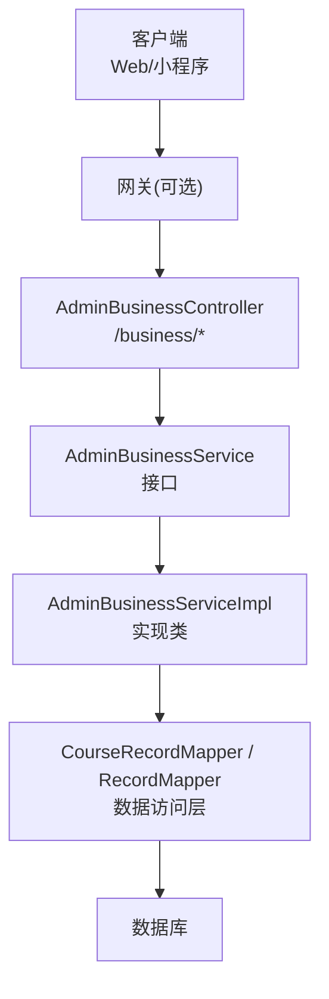
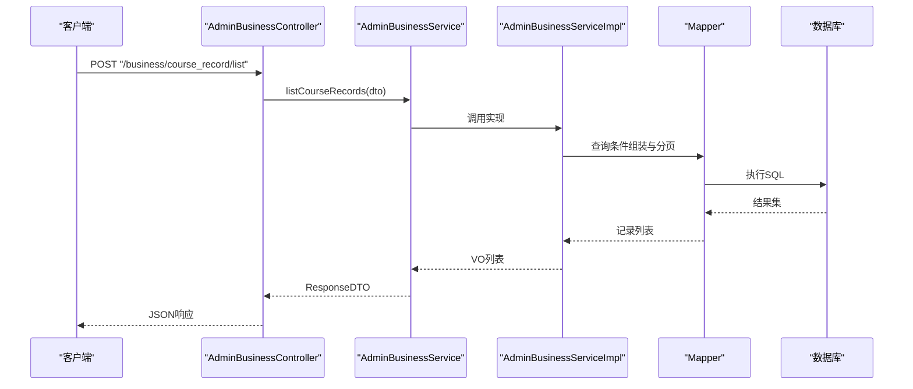
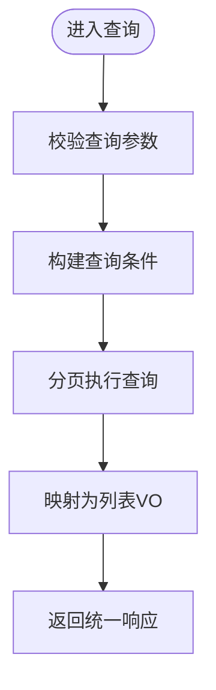
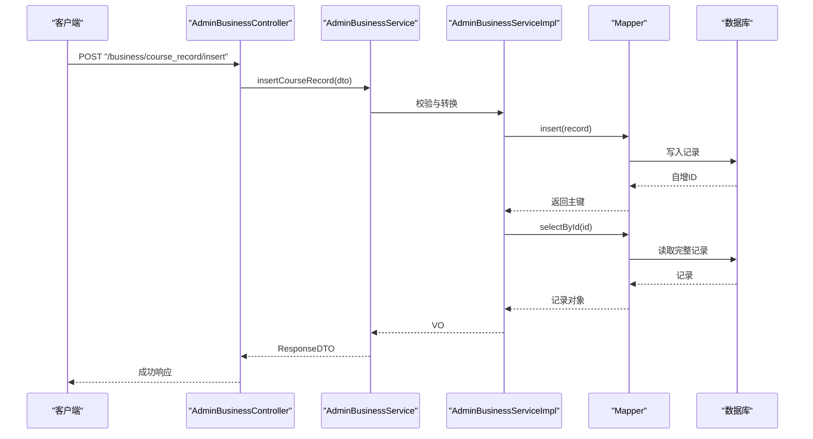
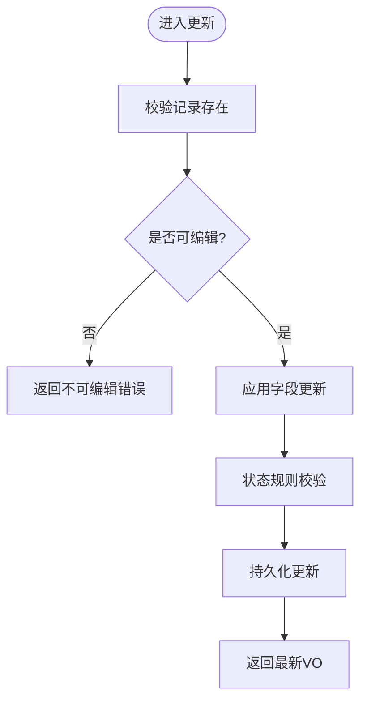
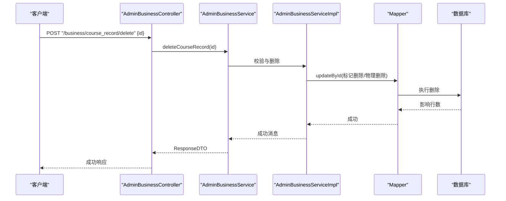

# 课时记录接口

<cite>
**本文引用的文件**   
- [AdminBusinessController.java](file://class_times_record_back/admin-service/src/main/java/com/shiroko/controller/AdminBusinessController.java)
- [AdminBusinessService.java](file://class_times_record_back/admin-service/src/main/java/com/shiroko/service/AdminBusinessService.java)
- [AdminBusinessServiceImpl.java](file://class_times_record_back/admin-service/src/main/java/com/shiroko/service/impl/AdminBusinessServiceImpl.java)
- [AdminBusinessControllerApiTest.java](file://class_times_record_back/admin-service/src/test/java/com/shiroko/controller/AdminBusinessControllerApiTest.java)
</cite>

## 目录
1. [简介](#简介)
2. [项目结构](#项目结构)
3. [核心组件](#核心组件)
4. [架构总览](#架构总览)
5. [详细组件分析](#详细组件分析)
6. [依赖关系分析](#依赖关系分析)
7. [性能考虑](#性能考虑)
8. [故障排查指南](#故障排查指南)
9. [结论](#结论)
10. [附录](#附录)

## 简介
本文件面向“课时记录”相关接口的完整文档，覆盖创建、编辑、删除、查询等核心能力；说明上课记录的录入字段（上课时间、时长、状态等）；提供课时扣减与退费处理思路；包含请假、补课等特殊场景的处理建议；阐述课时记录与班级、课程、学生、教师的关联关系；给出统计与报表生成方案；描述审核与确认流程；提供批量导入导出建议；明确课时计算规则与费用结算逻辑；并给出请求响应示例与错误处理机制。

## 项目结构
后端采用分层架构：控制器层暴露 REST 接口，服务层封装业务逻辑，数据访问层通过 Mapper 操作数据库。课时记录相关的入口集中在管理端业务控制器中，统一以 /business 为前缀。

图示来源
- [AdminBusinessController.java:34-76](file://class_times_record_back/admin-service/src/main/java/com/shiroko/controller/AdminBusinessController.java#L34-L76)
- [AdminBusinessController.java:202-228](file://class_times_record_back/admin-service/src/main/java/com/shiroko/controller/AdminBusinessController.java#L202-L228)
- [AdminBusinessServiceImpl.java:584-614](file://class_times_record_back/admin-service/src/main/java/com/shiroko/service/impl/AdminBusinessServiceImpl.java#L584-L614)

章节来源
- [AdminBusinessController.java:34-76](file://class_times_record_back/admin-service/src/main/java/com/shiroko/controller/AdminBusinessController.java#L34-L76)
- [AdminBusinessController.java:202-228](file://class_times_record_back/admin-service/src/main/java/com/shiroko/controller/AdminBusinessController.java#L202-L228)

## 核心组件
- 控制器：AdminBusinessController 暴露课时记录相关接口，包括列表查询、新增、更新、删除等。
- 服务：AdminBusinessService 定义课时记录的业务方法契约。
- 实现：AdminBusinessServiceImpl 实现具体业务逻辑，调用 Mapper 完成持久化。
- 测试：AdminBusinessControllerApiTest 对关键接口进行集成测试，验证路径与基本行为。

章节来源
- [AdminBusinessController.java:72-81](file://class_times_record_back/admin-service/src/main/java/com/shiroko/controller/AdminBusinessController.java#L72-L81)
- [AdminBusinessController.java:202-228](file://class_times_record_back/admin-service/src/main/java/com/shiroko/controller/AdminBusinessController.java#L202-L228)
- [AdminBusinessService.java:70-76](file://class_times_record_back/admin-service/src/main/java/com/shiroko/service/AdminBusinessService.java#L70-L76)
- [AdminBusinessServiceImpl.java:584-614](file://class_times_record_back/admin-service/src/main/java/com/shiroko/service/impl/AdminBusinessServiceImpl.java#L584-L614)
- [AdminBusinessControllerApiTest.java:165-181](file://class_times_record_back/admin-service/src/test/java/com/shiroko/controller/AdminBusinessControllerApiTest.java#L165-L181)

## 架构总览
课时记录在系统中的位置如下：
- 前端或第三方系统通过 HTTP 调用 /business/course_record/* 与 /business/record/* 系列接口。
- 控制器接收请求，校验参数后委托服务层处理。
- 服务层执行业务规则（如状态机、权限、事务），并通过 Mapper 读写数据库。
- 返回统一响应体 ResponseDTO。

图示来源
- [AdminBusinessController.java:72-76](file://class_times_record_back/admin-service/src/main/java/com/shiroko/controller/AdminBusinessController.java#L72-L76)
- [AdminBusinessServiceImpl.java:584-614](file://class_times_record_back/admin-service/src/main/java/com/shiroko/service/impl/AdminBusinessServiceImpl.java#L584-L614)

## 详细组件分析

### 课时记录查询接口
- 接口路径：POST /business/course_record/list
- 功能：按条件分页查询课时记录列表，支持多条件筛选（如机构、班级、课程、教师、学生、时间范围、状态等）。
- 入参：QueryCourseRecordDTO（由服务层 DTO 定义）
- 出参：ResponseDTO<AdminCourseRecordListVO>
- 典型流程：控制器接收请求 -> 服务层校验与组装查询条件 -> 数据层分页查询 -> 转换为 VO 返回。

章节来源
- [AdminBusinessController.java:72-76](file://class_times_record_back/admin-service/src/main/java/com/shiroko/controller/AdminBusinessController.java#L72-L76)
- [AdminBusinessControllerApiTest.java:165-181](file://class_times_record_back/admin-service/src/test/java/com/shiroko/controller/AdminBusinessControllerApiTest.java#L165-L181)

### 课时记录新增接口
- 接口路径：POST /business/course_record/insert
- 功能：新增一条课时记录，包含上课时间、时长、状态、关联的班级/课程/学生/教师等信息。
- 入参：AdminInsertCourseRecordDTO
- 出参：ResponseDTO<AdminCourseRecordVO>
- 业务要点：
  - 必填字段校验（如上课时间、时长、关联实体ID等）。
  - 状态默认值与幂等性控制（避免重复提交）。
  - 事务包裹插入与后续初始化动作。

章节来源
- [AdminBusinessController.java:203-208](file://class_times_record_back/admin-service/src/main/java/com/shiroko/controller/AdminBusinessController.java#L203-L208)
- [AdminBusinessServiceImpl.java:584-585](file://class_times_record_back/admin-service/src/main/java/com/shiroko/service/impl/AdminBusinessServiceImpl.java#L584-L585)
- [AdminBusinessControllerApiTest.java:494-500](file://class_times_record_back/admin-service/src/test/java/com/shiroko/controller/AdminBusinessControllerApiTest.java#L494-L500)

### 课时记录更新接口
- 接口路径：POST /business/course_record/update
- 功能：更新已存在的课时记录，支持修改上课时间、时长、状态、备注等。
- 入参：AdminUpdateCourseRecordDTO
- 出参：ResponseDTO<AdminCourseRecordVO>
- 业务要点：
  - 存在性校验（记录是否存在且未被锁定）。
  - 状态变更策略（如从“待确认”到“已确认”的规则）。
  - 审计日志与版本控制（如需）。

章节来源
- [AdminBusinessController.java:209-214](file://class_times_record_back/admin-service/src/main/java/com/shiroko/controller/AdminBusinessController.java#L209-L214)
- [AdminBusinessServiceImpl.java:600](file://class_times_record_back/admin-service/src/main/java/com/shiroko/service/impl/AdminBusinessServiceImpl.java#L600)

### 课时记录删除接口
- 接口路径：POST /business/course_record/delete
- 功能：删除指定课时记录。
- 入参：Map<String, Long>，包含 id 字段。
- 出参：ResponseDTO<String>
- 业务要点：
  - 软删除或硬删除策略需明确。
  - 删除前检查是否有强依赖（如已结算、已归档）。

章节来源
- [AdminBusinessController.java:215-220](file://class_times_record_back/admin-service/src/main/java/com/shiroko/controller/AdminBusinessController.java#L215-L220)
- [AdminBusinessServiceImpl.java:610](file://class_times_record_back/admin-service/src/main/java/com/shiroko/service/impl/AdminBusinessServiceImpl.java#L610)

### 课时记录（Record）新增接口
- 接口路径：POST /business/record/insert
- 功能：新增课时记录（Record），用于记录实际发生的课时消耗或收入。
- 入参：AdminInsertRecordDTO
- 出参：ResponseDTO<AdminRecordVO>
- 业务要点：
  - 与 CourseRecord 的关系：一次上课可能产生多条 Record（如正课、补课、请假扣减等）。
  - 费用结算联动：根据课时类型与单价计算金额。

章节来源
- [AdminBusinessController.java:224-228](file://class_times_record_back/admin-service/src/main/java/com/shiroko/controller/AdminBusinessController.java#L224-L228)

### 课时记录的数据模型与关联关系
- 实体关系：
  - 课时记录（CourseRecord）与班级（Class）、课程（Course）、学生（Student）、教师（Teacher）存在外键关联。
  - 课时记录（Record）与课时记录（CourseRecord）一对多，表示一次上课的多条消费明细。
- 关键字段（概念性说明）：
  - 上课时间：精确到分钟，支持时区。
  - 时长：单位分钟，需与课程时长配置一致。
  - 状态：待确认、已确认、已取消、已退款等。
  - 类型：正课、补课、请假、调课等。
  - 费用：单价、数量、折扣、实付金额等。
- 约束与规则：
  - 同一学生在同一时间段内不应有冲突的上课记录。
  - 状态流转需遵循有限状态机。
  - 删除与更新需满足审计与合规要求。

[本节为概念性说明，不直接分析具体文件]

### 课时扣减与退费处理
- 课时扣减：
  - 触发条件：学生缺勤、请假、调课后未补课等。
  - 计算规则：按课时类型与单价计算扣减金额，生成对应 Record。
- 退费处理：
  - 触发条件：课程取消、退班、超额退费审批通过后。
  - 计算规则：按剩余课时、折扣、已使用课时比例计算应退金额。
- 流程建议：
  - 先校验余额与冻结额度，再执行扣减或退费。
  - 生成财务流水与审计日志，确保可追溯。

[本节为概念性说明，不直接分析具体文件]

### 请假与补课特殊场景
- 请假：
  - 标记请假状态，生成请假记录，可选择是否扣减课时。
  - 允许设置补课时有效期与次数限制。
- 补课：
  - 基于原上课记录生成补课记录，保持关联关系。
  - 补课成功后，将原记录状态调整为“已补课”。

[本节为概念性说明，不直接分析具体文件]

### 课时统计与报表生成
- 统计维度：
  - 按机构、班级、课程、教师、学生、时间范围聚合。
  - 指标：上课次数、总时长、出勤率、请假率、退费金额、实收金额等。
- 报表输出：
  - 支持导出 Excel/CSV，便于线下核对。
  - 支持分页加载大数据量报表。

[本节为概念性说明，不直接分析具体文件]

### 审核与确认流程
- 流程阶段：
  - 待确认：教师或管理员录入后处于待确认。
  - 已确认：经审核后生效，参与结算。
  - 已取消/已退款：异常或逆向流程。
- 规则：
  - 仅允许特定角色进行审核。
  - 审核通过后不允许随意修改，需走变更流程。

[本节为概念性说明，不直接分析具体文件]

### 批量导入与导出
- 导入：
  - 模板字段：学生、课程、班级、教师、上课时间、时长、类型、备注。
  - 校验：重复检测、时间冲突、必填项校验。
- 导出：
  - 按筛选条件导出，支持增量导出。
  - 大文件分片下载与异步任务。

[本节为概念性说明，不直接分析具体文件]

### 课时计算规则与费用结算逻辑
- 课时计算：
  - 标准课时：按课程配置的时长计算。
  - 特殊课时：补课、加课、压缩课时等按规则折算。
- 费用结算：
  - 单价×数量-折扣=应付金额。
  - 退费=剩余价值-手续费（如有）。
- 结算周期：
  - 按月/季度结算，支持预付费与后付费模式。

[本节为概念性说明，不直接分析具体文件]

## 依赖关系分析
课时记录相关接口的主要依赖如下：
- 控制器依赖服务接口。
- 服务实现依赖 Mapper 进行数据访问。
- 测试用例验证控制器与服务交互的基本路径。

图示来源
- [AdminBusinessController.java:34-76](file://class_times_record_back/admin-service/src/main/java/com/shiroko/controller/AdminBusinessController.java#L34-L76)
- [AdminBusinessServiceImpl.java:584-614](file://class_times_record_back/admin-service/src/main/java/com/shiroko/service/impl/AdminBusinessServiceImpl.java#L584-L614)
- [AdminBusinessControllerApiTest.java:165-181](file://class_times_record_back/admin-service/src/test/java/com/shiroko/controller/AdminBusinessControllerApiTest.java#L165-L181)

章节来源
- [AdminBusinessController.java:34-76](file://class_times_record_back/admin-service/src/main/java/com/shiroko/controller/AdminBusinessController.java#L34-L76)
- [AdminBusinessServiceImpl.java:584-614](file://class_times_record_back/admin-service/src/main/java/com/shiroko/service/impl/AdminBusinessServiceImpl.java#L584-L614)
- [AdminBusinessControllerApiTest.java:165-181](file://class_times_record_back/admin-service/src/test/java/com/shiroko/controller/AdminBusinessControllerApiTest.java#L165-L181)

## 性能考虑
- 查询优化：
  - 合理使用索引（时间、状态、关联ID）。
  - 分页查询避免全表扫描。
- 写入优化：
  - 批量插入时使用批量接口。
  - 事务粒度最小化，减少锁竞争。
- 缓存策略：
  - 热点字典与配置信息缓存。
  - 报表数据异步生成与缓存。

[本节为通用指导，不直接分析具体文件]

## 故障排查指南
- 常见问题：
  - 参数缺失或类型错误：检查 DTO 字段与必填项。
  - 记录不存在或不可编辑：检查状态与权限。
  - 并发冲突：重试与幂等设计。
- 定位步骤：
  - 查看控制器日志与统一响应体。
  - 检查服务层异常与事务回滚。
  - 核对数据库记录与审计日志。

章节来源
- [AdminBusinessController.java:202-228](file://class_times_record_back/admin-service/src/main/java/com/shiroko/controller/AdminBusinessController.java#L202-L228)
- [AdminBusinessServiceImpl.java:584-614](file://class_times_record_back/admin-service/src/main/java/com/shiroko/service/impl/AdminBusinessServiceImpl.java#L584-L614)

## 结论
课时记录接口围绕 CRUD 与状态流转展开，结合请假、补课、扣减、退费等业务场景，形成完整的课时管理与结算体系。建议在实现中强化状态机、幂等性与审计追踪，保障数据一致性与可追溯性。

[本节为总结性内容，不直接分析具体文件]

## 附录

### 接口清单与示例
- 查询课时记录列表
  - 路径：POST /business/course_record/list
  - 请求体：QueryCourseRecordDTO
  - 响应：ResponseDTO<AdminCourseRecordListVO>
  - 参考测试：AdminBusinessControllerApiTest 中的列表查询用例
- 新增课时记录
  - 路径：POST /business/course_record/insert
  - 请求体：AdminInsertCourseRecordDTO
  - 响应：ResponseDTO<AdminCourseRecordVO>
  - 参考测试：AdminBusinessControllerApiTest 中的新增用例
- 更新课时记录
  - 路径：POST /business/course_record/update
  - 请求体：AdminUpdateCourseRecordDTO
  - 响应：ResponseDTO<AdminCourseRecordVO>
- 删除课时记录
  - 路径：POST /business/course_record/delete
  - 请求体：{ "id": <Long> }
  - 响应：ResponseDTO<String>
- 新增课时记录（Record）
  - 路径：POST /business/record/insert
  - 请求体：AdminInsertRecordDTO
  - 响应：ResponseDTO<AdminRecordVO>

章节来源
- [AdminBusinessController.java:72-81](file://class_times_record_back/admin-service/src/main/java/com/shiroko/controller/AdminBusinessController.java#L72-L81)
- [AdminBusinessController.java:202-228](file://class_times_record_back/admin-service/src/main/java/com/shiroko/controller/AdminBusinessController.java#L202-L228)
- [AdminBusinessControllerApiTest.java:165-181](file://class_times_record_back/admin-service/src/test/java/com/shiroko/controller/AdminBusinessControllerApiTest.java#L165-L181)
- [AdminBusinessControllerApiTest.java:494-500](file://class_times_record_back/admin-service/src/test/java/com/shiroko/controller/AdminBusinessControllerApiTest.java#L494-L500)