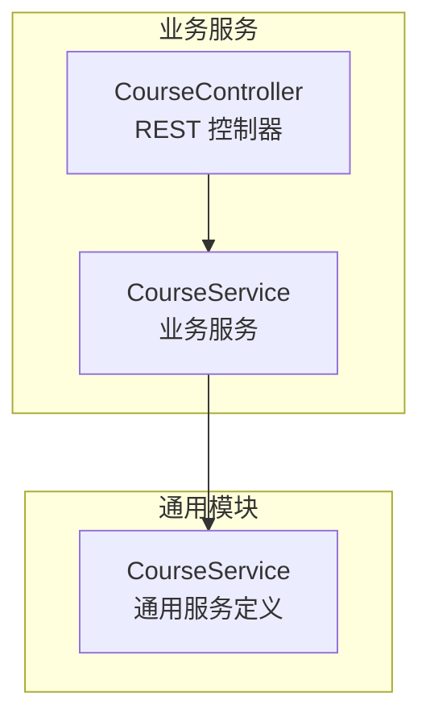
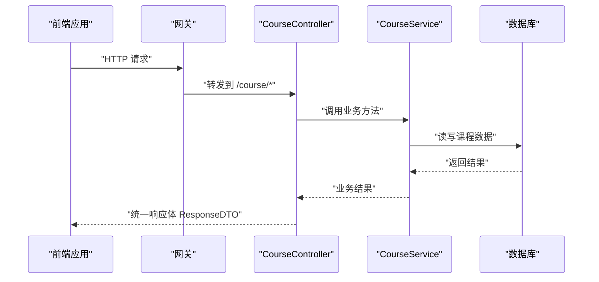
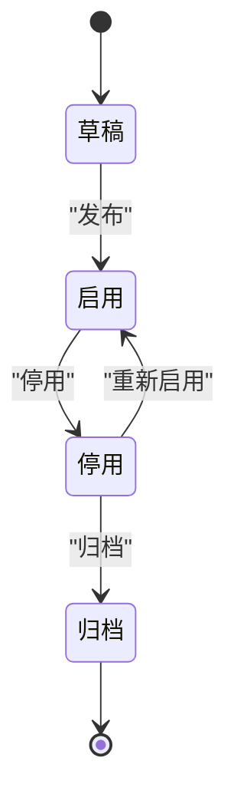
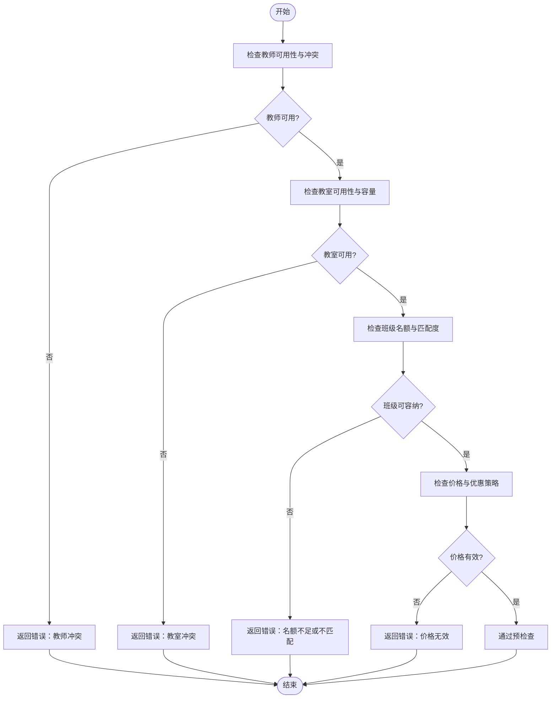
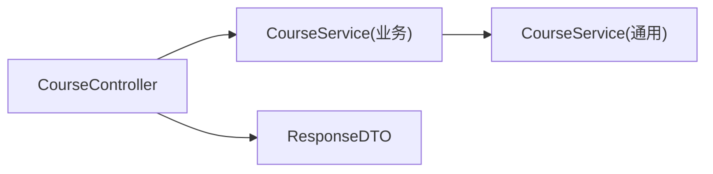

# 课程管理接口

<cite>
**本文引用的文件**   
- [CourseController.java](file://class_times_record_back/business-service/src/main/java/com/shiroko/controller/CourseController.java)
- [CourseService.java（业务服务）](file://class_times_record_back/business-service/src/main/java/com/shiroko/service/CourseService.java)
- [CourseService.java（通用服务）](file://class_times_record_back/common/src/main/java/com/shiroko/service/CourseService.java)
</cite>

## 目录
1. [简介](#简介)
2. [项目结构](#项目结构)
3. [核心组件](#核心组件)
4. [架构总览](#架构总览)
5. [详细组件分析](#详细组件分析)
6. [依赖关系分析](#依赖关系分析)
7. [性能考虑](#性能考虑)
8. [故障排查指南](#故障排查指南)
9. [结论](#结论)
10. [附录](#附录)

## 简介
本文件面向“课程管理”相关接口的完整文档，覆盖课程的创建、编辑、删除、查询等基础操作；说明课程分类、级别、时长、价格等业务属性的设置与管理；提供课程模板与批量创建能力说明；阐述课程与教师、班级、机构的关联关系管理；详细说明课程状态流转（启用、停用、归档等）；提供课程统计与数据分析接口建议；包含排课相关的预检查接口建议；并给出完整的请求/响应示例以展示复杂业务场景的处理方式。同时解释课程数据模型与业务规则，帮助前后端开发者快速对接与落地。

## 项目结构
后端采用微服务分层：控制器层暴露 REST API，服务层封装业务逻辑，DTO/VO 用于入参与出参建模。当前仓库中已存在课程控制器的实现，定义了按机构/学生查询、新增、更新等接口。

图表来源
- [CourseController.java:1-54](file://class_times_record_back/business-service/src/main/java/com/shiroko/controller/CourseController.java#L1-L54)
- [CourseService.java（业务服务）](file://class_times_record_back/business-service/src/main/java/com/shiroko/service/CourseService.java)
- [CourseService.java（通用服务）](file://class_times_record_back/common/src/main/java/com/shiroko/service/CourseService.java)

章节来源
- [CourseController.java:1-54](file://class_times_record_back/business-service/src/main/java/com/shiroko/controller/CourseController.java#L1-L54)

## 核心组件
- 控制器 CourseController
  - 负责接收 HTTP 请求，参数校验后委托给服务层处理，返回统一响应体 ResponseDTO。
  - 已实现的接口包括：
    - POST /course/get_course_by_institution_id：按机构查询课程列表
    - POST /course/get_course_by_student_id：按学生查询课程列表
    - POST /course/add_course：新增课程
    - POST /course/update_by_id：根据 ID 更新课程
- 服务层 CourseService
  - 业务服务实现具体课程业务逻辑（如权限校验、数据一致性、状态机校验等）。
  - 通用服务定义位于 common 模块，供多服务复用。

章节来源
- [CourseController.java:26-53](file://class_times_record_back/business-service/src/main/java/com/shiroko/controller/CourseController.java#L26-L53)
- [CourseService.java（业务服务）](file://class_times_record_back/business-service/src/main/java/com/shiroko/service/CourseService.java)
- [CourseService.java（通用服务）](file://class_times_record_back/common/src/main/java/com/shiroko/service/CourseService.java)

## 架构总览
下图展示了课程管理的端到端调用链路：前端通过网关访问业务服务的控制器，控制器再调用服务层完成业务处理。

图表来源
- [CourseController.java:26-53](file://class_times_record_back/business-service/src/main/java/com/shiroko/controller/CourseController.java#L26-L53)

## 详细组件分析

### 接口清单与契约
以下接口均使用统一响应体 ResponseDTO<T> 包裹成功或失败信息。

- 新增课程
  - 路径：POST /course/add_course
  - 入参：InsertCourseDTO
  - 出参：ResponseDTO<InsertCourseVO>
  - 说明：创建新课程，支持设置分类、级别、时长、价格等属性；可结合模板字段进行初始化。
- 更新课程
  - 路径：POST /course/update_by_id
  - 入参：UpdateCourseDTO
  - 出参：ResponseDTO<UpdateCourseVO>
  - 说明：按课程 ID 更新课程信息，需满足状态约束（如仅允许在特定状态下修改）。
- 按机构查询课程
  - 路径：POST /course/get_course_by_institution_id
  - 入参：QueryCourseDTO（带 ByInstitutionId 校验组）
  - 出参：ResponseDTO<QueryCourseVO>
  - 说明：返回该机构下的课程集合，支持分页与筛选条件。
- 按学生查询课程
  - 路径：POST /course/get_course_by_student_id
  - 入参：QueryCourseDTO（带 ByStudentId 校验组）
  - 出参：ResponseDTO<QueryCourseVO>
  - 说明：返回该学生可选或已选的课程集合。

章节来源
- [CourseController.java:33-51](file://class_times_record_back/business-service/src/main/java/com/shiroko/controller/CourseController.java#L33-L51)

### 请求与响应示例（典型场景）
以下为常见业务场景的请求/响应结构示例（字段名与类型以 DTO/VO 为准，此处为示意）：

- 新增课程（含模板与批量）
  - 请求体 InsertCourseDTO 关键字段
    - institutionId：所属机构
    - categoryId：课程分类
    - level：课程级别
    - durationMinutes：课时时长（分钟）
    - price：价格
    - status：初始状态（如草稿）
    - templateId：模板 ID（可选，用于填充默认属性）
    - batchItems：批量条目数组（可选，用于批量创建）
  - 响应体 ResponseDTO<InsertCourseVO>
    - data：新建课程主键或课程对象
    - code/msg：统一错误码与消息
- 更新课程
  - 请求体 UpdateCourseDTO 关键字段
    - id：课程 ID
    - categoryId/level/durationMinutes/price/status：待更新字段
  - 响应体 ResponseDTO<UpdateCourseVO>
    - data：更新后的课程对象
- 按机构查询
  - 请求体 QueryCourseDTO 关键字段
    - institutionId：必填
    - categoryId/level/status/pageNo/pageSize：可选筛选与分页
  - 响应体 ResponseDTO<QueryCourseVO>
    - data：课程列表与分页信息
- 按学生查询
  - 请求体 QueryCourseDTO 关键字段
    - studentId：必填
    - 其他筛选同按机构查询
  - 响应体 ResponseDTO<QueryCourseVO>

章节来源
- [CourseController.java:33-51](file://class_times_record_back/business-service/src/main/java/com/shiroko/controller/CourseController.java#L33-L51)

### 课程数据模型与业务规则
- 数据模型要点
  - 课程实体包含：分类、级别、时长、价格、状态、所属机构、创建/更新时间等。
  - 与教师、班级、机构的关联：
    - 机构：一对多（一个机构下有多门课程）
    - 教师：多对多（一门课程可由多位教师教授）
    - 班级：多对多（一门课程可被多个班级选用）
- 业务规则建议
  - 状态机：草稿 → 启用 → 停用 → 归档（禁用不可直接归档，需先停用）
  - 价格与时长：非负数；级别与分类需在字典中存在
  - 模板：模板仅作为默认值填充，不改变课程独立属性
  - 批量创建：原子性保证，部分失败应回滚或记录明细
  - 权限：仅机构管理员或授权角色可增删改查

章节来源
- [CourseController.java:26-53](file://class_times_record_back/business-service/src/main/java/com/shiroko/controller/CourseController.java#L26-L53)

### 课程状态流转

[此图为概念图，无需代码来源]

### 排课预检查接口（建议）
为保证排课成功率，建议在排课前进行如下预检查：
- 教师可用性：时间冲突、最大授课量限制
- 教室可用性与容量
- 班级名额上限与历史出勤率阈值
- 课程级别与班级匹配度
- 价格与优惠策略校验

[此图为概念图，无需代码来源]

### 课程统计与数据分析接口（建议）
- 课程维度
  - 各分类/级别的课程数量、平均价格、平均时长
  - 课程启用/停用/归档占比
- 教学维度
  - 教师授课课程数、人均课时
  - 班级选课覆盖率
- 运营维度
  - 课程报名趋势、退课率、续报率
  - 收入贡献 Top N 课程

[本节为通用设计建议，无需代码来源]

## 依赖关系分析
- 控制器与服务耦合
  - CourseController 依赖 CourseService 完成业务处理
- 服务分层
  - 业务服务 CourseService 位于 business-service，通用服务定义位于 common
- 外部依赖
  - 统一响应体 ResponseDTO 由 repository 模块提供
  - DTO/VO 由 repository.dto 与 repository.vo 包提供

图表来源
- [CourseController.java:1-54](file://class_times_record_back/business-service/src/main/java/com/shiroko/controller/CourseController.java#L1-L54)
- [CourseService.java（业务服务）](file://class_times_record_back/business-service/src/main/java/com/shiroko/service/CourseService.java)
- [CourseService.java（通用服务）](file://class_times_record_back/common/src/main/java/com/shiroko/service/CourseService.java)

章节来源
- [CourseController.java:1-54](file://class_times_record_back/business-service/src/main/java/com/shiroko/controller/CourseController.java#L1-L54)

## 性能考虑
- 查询优化
  - 按机构/学生查询时，建议对常用筛选字段建立索引（如 institutionId、studentId、categoryId、status）
  - 分页查询避免大偏移量，必要时使用游标分页
- 写入优化
  - 批量创建使用事务与分批提交，降低锁竞争
  - 模板填充尽量在内存中计算，减少额外 IO
- 缓存策略
  - 课程字典（分类、级别）可缓存
  - 热门课程列表可短期缓存，注意失效策略

[本节为通用指导，无需代码来源]

## 故障排查指南
- 参数校验失败
  - 现象：返回统一错误码与消息
  - 排查：确认请求体字段是否符合 DTO 校验规则（如必填、范围）
- 状态非法
  - 现象：更新/发布失败
  - 排查：检查当前状态是否允许执行目标动作（如从草稿直接归档）
- 关联数据不存在
  - 现象：机构/教师/班级 ID 无效
  - 排查：确认外键数据是否存在且具备访问权限
- 并发冲突
  - 现象：更新丢失或排课冲突
  - 排查：引入乐观锁或分布式锁，确保幂等与一致性

章节来源
- [CourseController.java:26-53](file://class_times_record_back/business-service/src/main/java/com/shiroko/controller/CourseController.java#L26-L53)

## 结论
本课程管理接口已提供基础的增删改查与按维度查询能力，并通过统一响应体保障前后端交互一致性。建议后续完善删除接口、状态机与权限控制、排课预检查与统计分析接口，以提升系统完整性与可观测性。

## 附录
- 术语
  - 课程：教学产品的基本单元，包含分类、级别、时长、价格等属性
  - 模板：预设的课程属性组合，用于快速创建
  - 状态机：描述课程生命周期状态的转换规则
- 参考
  - 控制器实现路径：[CourseController.java](file://class_times_record_back/business-service/src/main/java/com/shiroko/controller/CourseController.java)
  - 服务实现路径：[CourseService.java（业务服务）](file://class_times_record_back/business-service/src/main/java/com/shiroko/service/CourseService.java)、[CourseService.java（通用服务）](file://class_times_record_back/common/src/main/java/com/shiroko/service/CourseService.java)