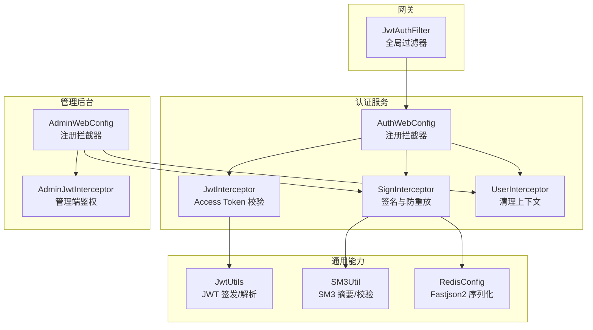
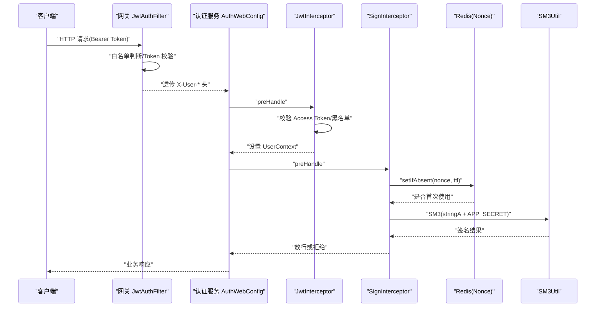
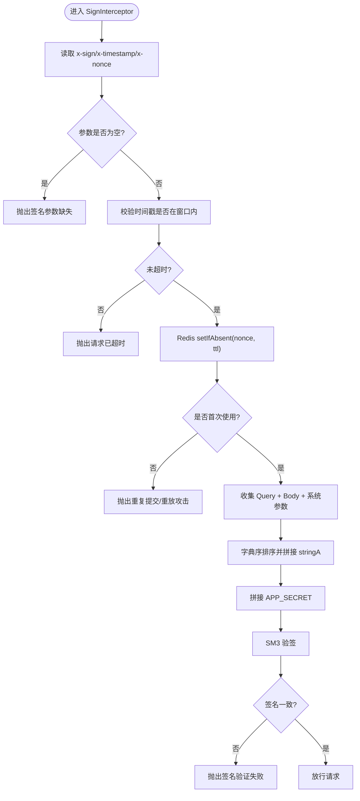
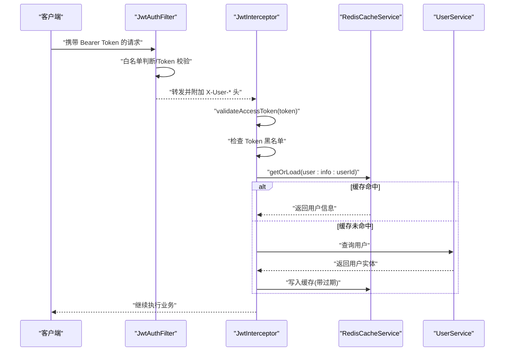
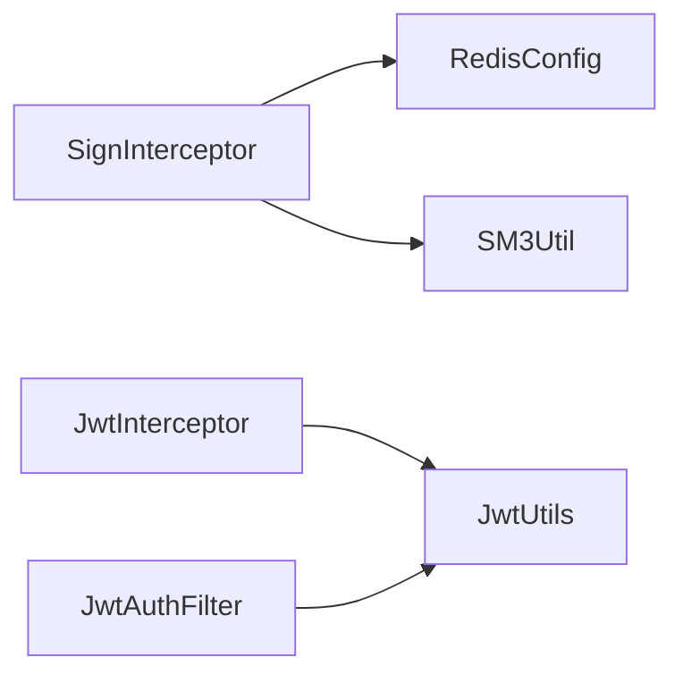

# 安全机制

<cite>
**本文引用的文件**
- [SignInterceptor.java](file://class_times_record_back/common/src/main/java/com/shiroko/interceptor/SignInterceptor.java)
- [JwtInterceptor.java](file://class_times_record_back/auth-service/src/main/java/com/shiroko/interceptor/JwtInterceptor.java)
- [JwtAuthFilter.java](file://class_times_record_back/gateway/src/main/java/com/shiroko/gateway/filter/JwtAuthFilter.java)
- [SM3Util.java](file://class_times_record_back/common/src/main/java/com/shiroko/util/SM3Util.java)
- [JwtUtils.java](file://class_times_record_back/common/src/main/java/com/shiroko/util/JwtUtils.java)
- [RedisConfig.java](file://class_times_record_back/common/src/main/java/com/shiroko/config/RedisConfig.java)
- [AdminWebConfig.java](file://class_times_record_back/admin-service/src/main/java/com/shiroko/config/AdminWebConfig.java)
- [AuthWebConfig.java](file://class_times_record_back/auth-service/src/main/java/com/shiroko/config/AuthWebConfig.java)
</cite>

## 目录
1. [引言](#引言)
2. [项目结构](#项目结构)
3. [核心组件](#核心组件)
4. [架构总览](#架构总览)
5. [详细组件分析](#详细组件分析)
6. [依赖关系分析](#依赖关系分析)
7. [性能考量](#性能考量)
8. [故障排查指南](#故障排查指南)
9. [结论](#结论)
10. [附录：安全配置与最佳实践](#附录安全配置与最佳实践)

## 引言
本文件聚焦于课程记录系统的安全机制，围绕多层防护体系进行系统化说明，包括：
- 国密算法 SM2 加密传输（前端集成点）
- SM3 哈希签名与防重放
- JWT Token 认证授权（网关与服务端双校验）
- 请求签名生成与验证流程（时间戳、随机数、字典序拼接、SM3 验签）
- Web 安全策略（跨域、SQL 注入、XSS）
- 安全配置与最佳实践
- 漏洞检测与防护措施
- 开发者安全编码规范与常见问题解决方案

## 项目结构
后端采用微服务分层：网关层负责统一鉴权与透传；认证服务与管理后台分别通过拦截器完成用户上下文与签名校验；通用模块提供工具类与缓存配置。

图表来源
- [JwtAuthFilter.java:1-101](file://class_times_record_back/gateway/src/main/java/com/shiroko/gateway/filter/JwtAuthFilter.java#L1-L101)
- [AuthWebConfig.java:1-60](file://class_times_record_back/auth-service/src/main/java/com/shiroko/config/AuthWebConfig.java#L1-L60)
- [AdminWebConfig.java:1-64](file://class_times_record_back/admin-service/src/main/java/com/shiroko/config/AdminWebConfig.java#L1-L64)
- [JwtInterceptor.java:1-153](file://class_times_record_back/auth-service/src/main/java/com/shiroko/interceptor/JwtInterceptor.java#L1-L153)
- [SignInterceptor.java:1-149](file://class_times_record_back/common/src/main/java/com/shiroko/interceptor/SignInterceptor.java#L1-L149)
- [JwtUtils.java:1-213](file://class_times_record_back/common/src/main/java/com/shiroko/util/JwtUtils.java#L1-L213)
- [SM3Util.java:1-85](file://class_times_record_back/common/src/main/java/com/shiroko/util/SM3Util.java#L1-L85)
- [RedisConfig.java:1-90](file://class_times_record_back/common/src/main/java/com/shiroko/config/RedisConfig.java#L1-L90)

章节来源
- [AuthWebConfig.java:1-60](file://class_times_record_back/auth-service/src/main/java/com/shiroko/config/AuthWebConfig.java#L1-L60)
- [AdminWebConfig.java:1-64](file://class_times_record_back/admin-service/src/main/java/com/shiroko/config/AdminWebConfig.java#L1-L64)

## 核心组件
- 网关 JWT 鉴权过滤器：对非公开路径进行 Bearer Token 校验，并将用户信息以请求头形式透传到下游服务。
- 认证服务 JWT 拦截器：校验 Access Token、黑名单、并加载用户信息到线程上下文。
- 签名拦截器：校验 x-sign/x-timestamp/x-nonce，基于 Redis 的 Nonce 去重实现防重放，使用 SM3 对参数集合进行签名校验。
- JWT 工具类：支持双 Token（Access/Refresh），动态过期时间，HS256 签名。
- SM3 工具类：提供摘要计算与校验，基于 BouncyCastle 实现。
- Redis 配置：统一 Fastjson2 序列化，开启 Map 键排序特性，保证与签名逻辑一致。

章节来源
- [JwtAuthFilter.java:1-101](file://class_times_record_back/gateway/src/main/java/com/shiroko/gateway/filter/JwtAuthFilter.java#L1-L101)
- [JwtInterceptor.java:1-153](file://class_times_record_back/auth-service/src/main/java/com/shiroko/interceptor/JwtInterceptor.java#L1-L153)
- [SignInterceptor.java:1-149](file://class_times_record_back/common/src/main/java/com/shiroko/interceptor/SignInterceptor.java#L1-L149)
- [JwtUtils.java:1-213](file://class_times_record_back/common/src/main/java/com/shiroko/util/JwtUtils.java#L1-L213)
- [SM3Util.java:1-85](file://class_times_record_back/common/src/main/java/com/shiroko/util/SM3Util.java#L1-L85)
- [RedisConfig.java:1-90](file://class_times_record_back/common/src/main/java/com/shiroko/config/RedisConfig.java#L1-L90)

## 架构总览
下图展示一次受保护 API 请求从客户端到业务处理的完整安全链路：

图表来源
- [JwtAuthFilter.java:1-101](file://class_times_record_back/gateway/src/main/java/com/shiroko/gateway/filter/JwtAuthFilter.java#L1-L101)
- [AuthWebConfig.java:1-60](file://class_times_record_back/auth-service/src/main/java/com/shiroko/config/AuthWebConfig.java#L1-L60)
- [JwtInterceptor.java:1-153](file://class_times_record_back/auth-service/src/main/java/com/shiroko/interceptor/JwtInterceptor.java#L1-L153)
- [SignInterceptor.java:1-149](file://class_times_record_back/common/src/main/java/com/shiroko/interceptor/SignInterceptor.java#L1-L149)
- [SM3Util.java:1-85](file://class_times_record_back/common/src/main/java/com/shiroko/util/SM3Util.java#L1-L85)

## 详细组件分析

### 请求签名与防重放（SM3 + Nonce + 时间戳）
- 参与签名的参数来源
  - URL Query 参数
  - JSON Body 参数（需可被解析为对象）
  - 系统级参数：timestamp、nonce
- 签名构造
  - 将所有参数按 Key 字典序排序，值为复杂类型时序列化为 JSON 字符串且强制字段排序
  - 拼接成 stringA，再追加固定盐值 APP_SECRET
  - 使用 SM3 计算摘要得到签名
- 防重放
  - 时间戳窗口限制（默认 60 秒）
  - Nonce 在 Redis 中 SETNX，同一窗口内仅允许一次
- 关键风险点
  - Body 必须为对象格式，数组将导致解析异常
  - 前后端序列化与排序策略必须一致（Fastjson2 SortMapEntriesByKeys）

图表来源
- [SignInterceptor.java:1-149](file://class_times_record_back/common/src/main/java/com/shiroko/interceptor/SignInterceptor.java#L1-L149)
- [SM3Util.java:1-85](file://class_times_record_back/common/src/main/java/com/shiroko/util/SM3Util.java#L1-L85)
- [RedisConfig.java:1-90](file://class_times_record_back/common/src/main/java/com/shiroko/config/RedisConfig.java#L1-L90)

章节来源
- [SignInterceptor.java:1-149](file://class_times_record_back/common/src/main/java/com/shiroko/interceptor/SignInterceptor.java#L1-L149)
- [SM3Util.java:1-85](file://class_times_record_back/common/src/main/java/com/shiroko/util/SM3Util.java#L1-L85)
- [RedisConfig.java:1-90](file://class_times_record_back/common/src/main/java/com/shiroko/config/RedisConfig.java#L1-L90)

### JWT 认证与授权（网关 + 服务拦截器）
- 网关层
  - 白名单路径免检
  - 校验 Authorization: Bearer <token>，解析 Claims 后注入 X-User-Id/X-User-Role/X-User-OpenId 透传给下游
- 服务层（认证服务）
  - 校验 Access Token 有效性
  - 检查 Token 黑名单（登出失效）
  - 从 Redis 缓存用户信息，减少数据库压力
  - 将用户信息写入 UserContext 供后续处理使用

图表来源
- [JwtAuthFilter.java:1-101](file://class_times_record_back/gateway/src/main/java/com/shiroko/gateway/filter/JwtAuthFilter.java#L1-L101)
- [JwtInterceptor.java:1-153](file://class_times_record_back/auth-service/src/main/java/com/shiroko/interceptor/JwtInterceptor.java#L1-L153)

章节来源
- [JwtAuthFilter.java:1-101](file://class_times_record_back/gateway/src/main/java/com/shiroko/gateway/filter/JwtAuthFilter.java#L1-L101)
- [JwtInterceptor.java:1-153](file://class_times_record_back/auth-service/src/main/java/com/shiroko/interceptor/JwtInterceptor.java#L1-L153)
- [JwtUtils.java:1-213](file://class_times_record_back/common/src/main/java/com/shiroko/util/JwtUtils.java#L1-L213)

### 国密算法集成（SM2/SM3）
- SM3
  - 用于请求签名与数据完整性校验
  - 提供摘要计算、带盐摘要、校验方法
- SM2
  - 前端侧通过 sm-crypto 等库实现公钥加密/私钥解密，保障敏感数据传输机密性
  - 服务端可通过对应国密库进行解密（本项目前端已集成 sm-crypto）

章节来源
- [SM3Util.java:1-85](file://class_times_record_back/common/src/main/java/com/shiroko/util/SM3Util.java#L1-L85)
- [SignInterceptor.java:1-149](file://class_times_record_back/common/src/main/java/com/shiroko/interceptor/SignInterceptor.java#L1-L149)

### 跨域访问控制（CORS）
- 建议在各服务中启用 CORS，并严格限定允许的源、方法与头部
- 生产环境避免使用通配符 *，按需开放最小权限
- 网关层亦可集中配置 CORS，简化多服务治理

[本节为通用指导，不直接分析具体文件]

### SQL 注入防护
- 使用 MyBatis Plus 的参数化查询，禁止拼接 SQL
- 对输入进行类型校验与长度限制
- 对特殊字符进行转义与白名单过滤

[本节为通用指导，不直接分析具体文件]

### XSS 攻击防护
- 输出前对用户输入进行 HTML 转义
- 设置 Content-Type 为 application/json 时避免浏览器误解析
- 结合 CSP 策略限制脚本执行来源

[本节为通用指导，不直接分析具体文件]

## 依赖关系分析
- 组件耦合
  - 网关与认证服务通过标准 HTTP 头传递用户上下文，降低耦合度
  - 签名拦截器依赖 Redis 与 SM3 工具类，职责单一、内聚度高
- 外部依赖
  - Redis：用于 Nonce 防重放与用户信息缓存
  - BouncyCastle：提供 SM3 算法实现
  - JWT 库：HS256 签名与解析

图表来源
- [SignInterceptor.java:1-149](file://class_times_record_back/common/src/main/java/com/shiroko/interceptor/SignInterceptor.java#L1-L149)
- [JwtInterceptor.java:1-153](file://class_times_record_back/auth-service/src/main/java/com/shiroko/interceptor/JwtInterceptor.java#L1-L153)
- [JwtAuthFilter.java:1-101](file://class_times_record_back/gateway/src/main/java/com/shiroko/gateway/filter/JwtAuthFilter.java#L1-L101)
- [SM3Util.java:1-85](file://class_times_record_back/common/src/main/java/com/shiroko/util/SM3Util.java#L1-L85)
- [JwtUtils.java:1-213](file://class_times_record_back/common/src/main/java/com/shiroko/util/JwtUtils.java#L1-L213)
- [RedisConfig.java:1-90](file://class_times_record_back/common/src/main/java/com/shiroko/config/RedisConfig.java#L1-L90)

章节来源
- [SignInterceptor.java:1-149](file://class_times_record_back/common/src/main/java/com/shiroko/interceptor/SignInterceptor.java#L1-L149)
- [JwtInterceptor.java:1-153](file://class_times_record_back/auth-service/src/main/java/com/shiroko/interceptor/JwtInterceptor.java#L1-L153)
- [JwtAuthFilter.java:1-101](file://class_times_record_back/gateway/src/main/java/com/shiroko/gateway/filter/JwtAuthFilter.java#L1-L101)

## 性能考量
- 签名计算
  - SM3 为轻量哈希，开销较小；注意避免对超大 Body 进行二次解析
- Redis 操作
  - Nonce 写入与用户信息缓存均为 O(1) 操作，注意 TTL 合理设置
- 缓存命中率
  - 用户信息缓存可减少数据库压力，建议根据活跃度调整过期时间
- 网关校验
  - JWT 解析为 CPU 密集型，但 HS256 开销可控；必要时可在网关层做本地缓存黑名单

[本节为通用指导，不直接分析具体文件]

## 故障排查指南
- 签名失败
  - 检查前后端参数顺序与排序策略是否一致（Fastjson2 SortMapEntriesByKeys）
  - 确认 Body 为对象而非数组
  - 核对 APP_SECRET 一致性
- 重放攻击告警
  - 观察 Redis 中 nonce 是否存在冲突，检查客户端时钟同步
- Token 无效
  - 检查网关白名单配置与服务端拦截器排除路径
  - 确认 Token 未被加入黑名单
- 用户信息为空
  - 检查 Redis 缓存 key 前缀与过期时间
  - 确认数据库用户存在且状态正常

章节来源
- [SignInterceptor.java:1-149](file://class_times_record_back/common/src/main/java/com/shiroko/interceptor/SignInterceptor.java#L1-L149)
- [JwtInterceptor.java:1-153](file://class_times_record_back/auth-service/src/main/java/com/shiroko/interceptor/JwtInterceptor.java#L1-L153)
- [JwtAuthFilter.java:1-101](file://class_times_record_back/gateway/src/main/java/com/shiroko/gateway/filter/JwtAuthFilter.java#L1-L101)

## 结论
本系统通过“网关统一鉴权 + 服务层签名校验 + 国密算法 + 防重放 + 缓存优化”的多层安全体系，有效提升了接口安全性与可用性。建议在后续迭代中持续完善 CORS、SQL 注入与 XSS 防护策略，并引入更完善的密钥管理与审计日志。

[本节为总结性内容，不直接分析具体文件]

## 附录：安全配置与最佳实践
- 密钥管理
  - 将 APP_SECRET、JWT Secret 等敏感配置纳入配置中心或密钥管理服务
  - 定期轮换密钥，确保历史 Token 平滑过渡
- 时间同步
  - 客户端与服务端保持 NTP 同步，避免时间戳校验误判
- 限流与熔断
  - 在网关层对高频接口实施限流，防止暴力破解与重放放大
- 日志与审计
  - 记录鉴权失败、签名失败、重放告警等关键事件，便于溯源
- 安全测试
  - 引入静态扫描与动态渗透测试，覆盖 OWASP Top 10
- 开发规范
  - 禁止明文存储密码，统一使用 SM3 加盐哈希
  - 所有用户输入均需校验与转义，输出前进行 HTML 转义
  - 对外暴露接口遵循最小权限原则，关闭不必要的调试端点

[本节为通用指导，不直接分析具体文件]