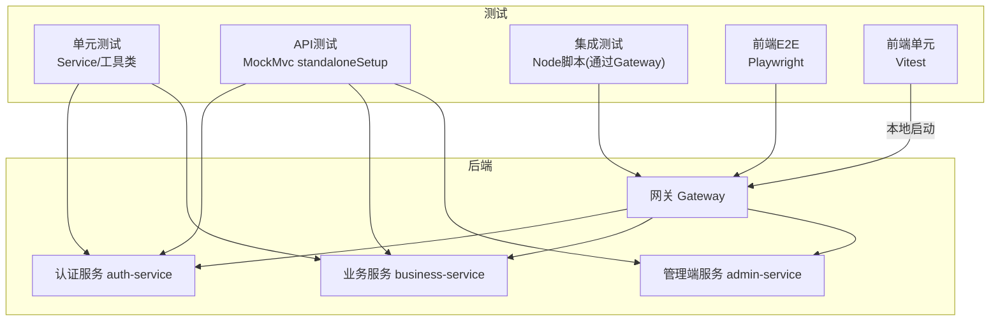
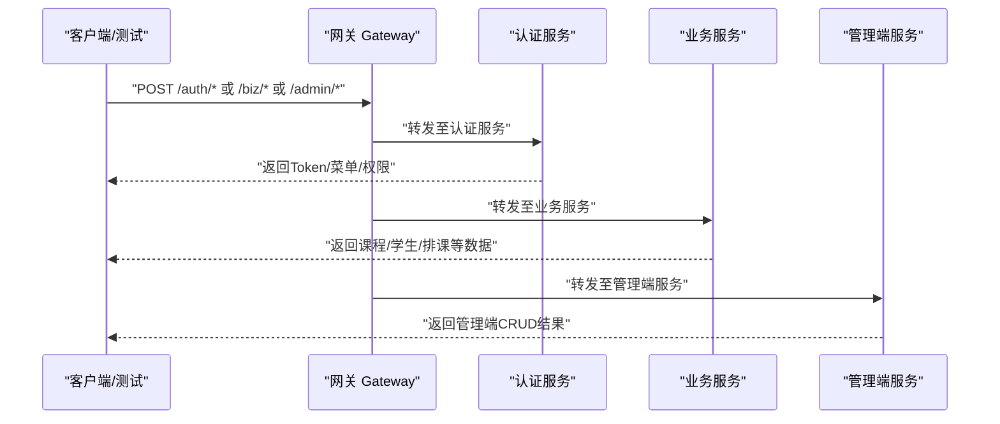
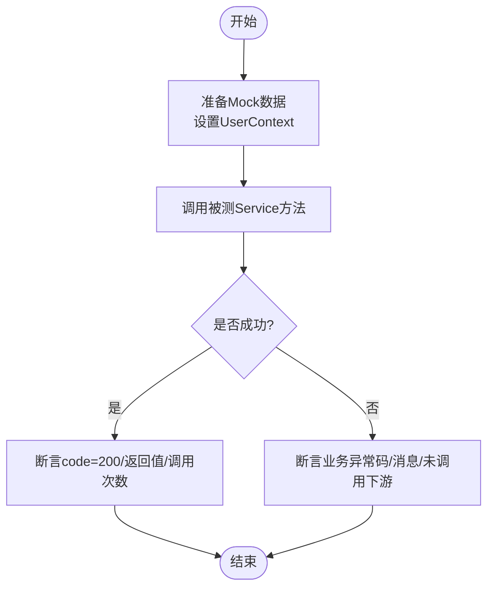
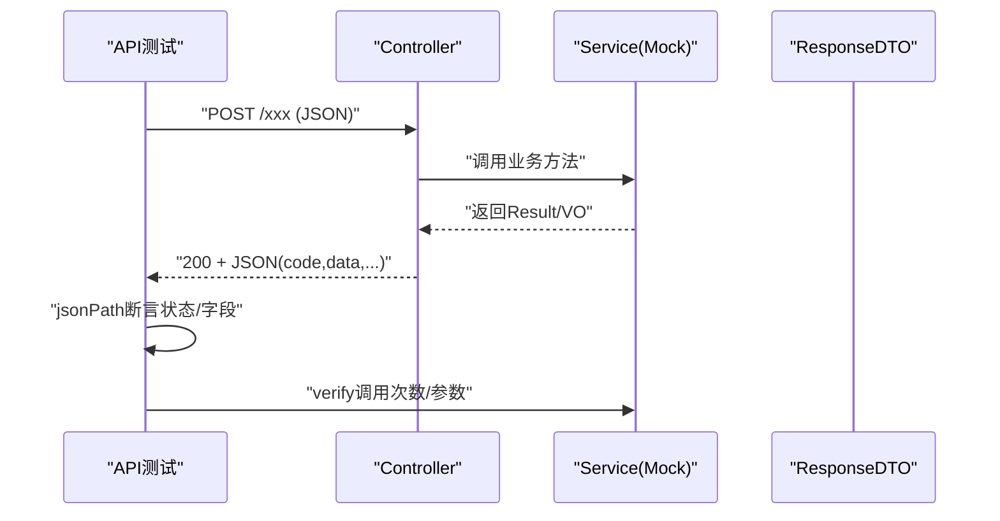
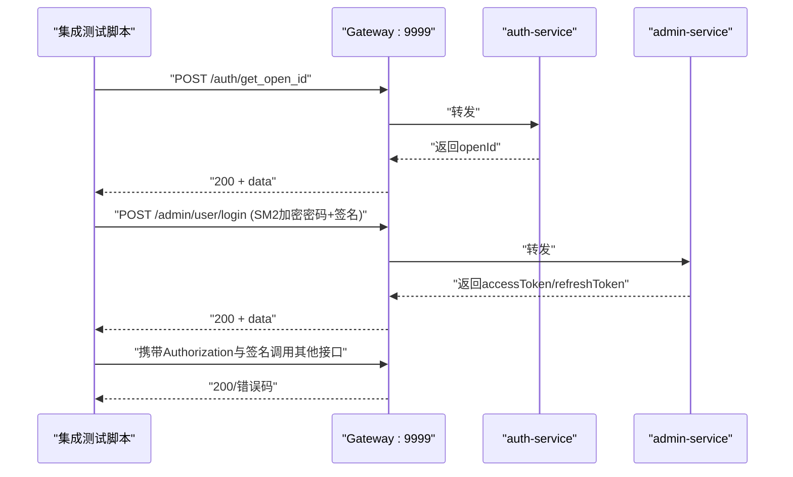
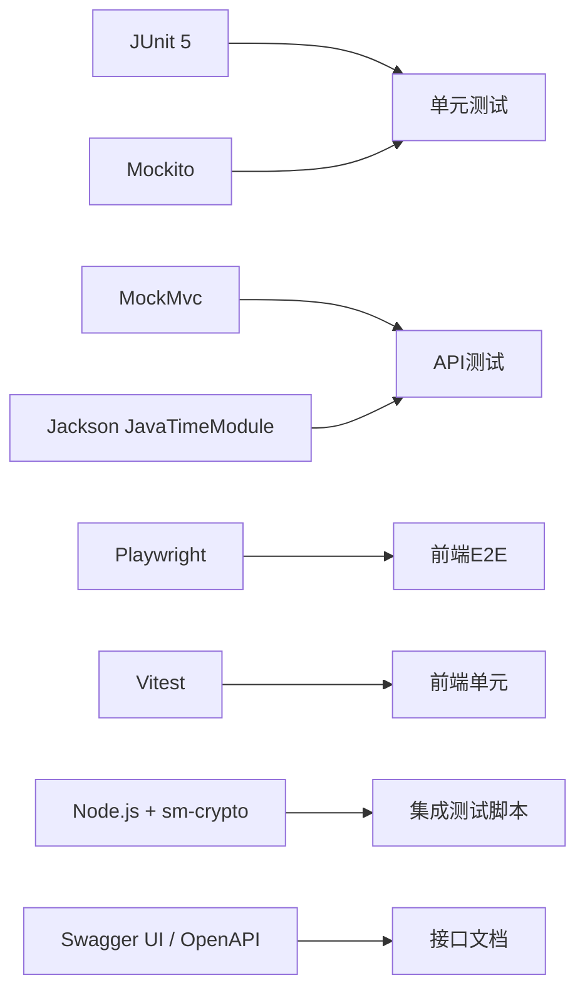

# 接口测试

<cite>
**本文引用的文件**   
- [api-test.md](file://class_times_record_back/docs/api-test.md)
- [test-cases.md](file://class_times_record_back/docs/test-cases.md)
- [test-plan.md](file://class_times_record_back/docs/test-plan.md)
- [api-test.mjs](file://class_times_record_back/docs/api-test.mjs)
- [AdminBusinessControllerApiTest.java](file://class_times_record_back/admin-service/src/test/java/com/shiroko/controller/AdminBusinessControllerApiTest.java)
- [AuthWebConfig.java](file://class_times_record_back/auth-service/src/main/java/com/shiroko/config/AuthWebConfig.java)
- [README.md](file://class_times_record_back/README.md)
- [vue.spec.ts](file://class_record_admin_front/e2e/vue.spec.ts)
- [App.spec.ts](file://class_record_admin_front/src/__tests__/App.spec.ts)
</cite>

## 目录
1. [引言](#引言)
2. [项目结构](#项目结构)
3. [核心组件](#核心组件)
4. [架构总览](#架构总览)
5. [详细组件分析](#详细组件分析)
6. [依赖分析](#依赖分析)
7. [性能考虑](#性能考虑)
8. [故障排查指南](#故障排查指南)
9. [结论](#结论)
10. [附录](#附录)

## 引言
本文件面向“课时记录系统”的接口测试，覆盖单元测试、集成测试与端到端测试的实施方法；提供用例设计原则与编写规范（正常流程、异常场景、边界条件）；说明自动化测试框架的使用（Mock数据准备、测试环境搭建、结果验证）；给出Postman集合与Swagger文档使用建议；补充性能与压力测试指导；并解释持续集成中的自动化测试流程与报告生成。同时为开发者提供调试工具与故障排查方法。

## 项目结构
后端采用微服务架构：Gateway + auth-service + business-service + admin-service。测试体系包含：
- 单元测试：Service层与工具类（JUnit 5 + Mockito）
- API 测试：Controller层（MockMvc standaloneSetup）
- 集成测试：Node脚本通过Gateway对真实运行环境发起请求
- 前端E2E与单元：Playwright与Vitest

图表来源
- [test-plan.md:32-52](file://class_times_record_back/docs/test-plan.md#L32-L52)
- [api-test.md:16-28](file://class_times_record_back/docs/api-test.md#L16-L28)
- [api-test.mjs:127-140](file://class_times_record_back/docs/api-test.mjs#L127-L140)

章节来源
- [test-plan.md:32-52](file://class_times_record_back/docs/test-plan.md#L32-L52)
- [api-test.md:16-28](file://class_times_record_back/docs/api-test.md#L16-L28)

## 核心组件
- 单元测试（Service/工具类）
  - 目标：验证业务逻辑、事务与异常处理、边界条件
  - 技术栈：JUnit 5 + MockitoExtension
  - 示例范围：JWT工具、Record/CourseRecord/Student等Service方法
- API 测试（Controller层）
  - 目标：验证路由映射、参数绑定、校验、响应格式
  - 技术栈：MockMvcBuilders.standaloneSetup()，避免加载完整Spring容器
  - 示例范围：auth-service、business-service、admin-service多个控制器
- 集成测试（端到端）
  - 目标：验证Gateway路由与各服务联调、鉴权与签名
  - 技术栈：Node.js脚本，通过HTTP调用Gateway端口
- 前端测试
  - E2E：Playwright访问根路径断言
  - 单元：Vitest挂载Vue组件断言渲染

章节来源
- [test-cases.md:1-306](file://class_times_record_back/docs/test-cases.md#L1-L306)
- [api-test.md:16-53](file://class_times_record_back/docs/api-test.md#L16-L53)
- [api-test.mjs:127-140](file://class_times_record_back/docs/api-test.mjs#L127-L140)
- [vue.spec.ts:1-9](file://class_record_admin_front/e2e/vue.spec.ts#L1-L9)
- [App.spec.ts:1-15](file://class_record_admin_front/src/__tests__/App.spec.ts#L1-L15)

## 架构总览
下图展示从客户端到各服务的请求链路，以及测试在何处介入。

图表来源
- [api-test.mjs:127-140](file://class_times_record_back/docs/api-test.mjs#L127-L140)
- [test-plan.md:32-52](file://class_times_record_back/docs/test-plan.md#L32-L52)

## 详细组件分析

### 单元测试（Service/工具类）
- 覆盖范围
  - JWT工具：创建/解析/校验AccessToken与RefreshToken，含空串、null、篡改等边界
  - RecordService：单条/批量插入、分页查询、余额扣减与增加
  - CourseRecordService：增删改、按学生扣课（聚合扣减、余额不足异常）、分页查询与权限注入
  - StudentService：新增/更新、多维度查询（按学生/家长/教师/班级/机构），含空结果与字段转换
- 设计要点
  - 使用@ExtendWith(MockitoExtension.class)
  - Mock所有Mapper/Converter，隔离外部依赖
  - 使用ArgumentCaptor验证复杂对象变更
  - 明确业务异常码与消息断言

图表来源
- [test-cases.md:29-178](file://class_times_record_back/docs/test-cases.md#L29-L178)

章节来源
- [test-cases.md:1-306](file://class_times_record_back/docs/test-cases.md#L1-L306)

### API 测试（Controller层）
- 策略
  - 使用MockMvcBuilders.standaloneSetup()，不启动Spring容器，避免MyBatis自动配置冲突
  - 验证URL路由、JSON反序列化、@Valid/@Validated分组校验、响应JSON结构
  - 使用verify(service).method(...)确认Service被调用或未被调用
- 覆盖模块
  - auth-service：登录、注册、退出、OpenId、刷新Token等
  - business-service：记录、课程记录、学生管理等
  - admin-service：机构/学生/教师/课程/班级/排课/课程记录/课时记录/小程序菜单等

图表来源
- [api-test.md:16-53](file://class_times_record_back/docs/api-test.md#L16-L53)
- [AdminBusinessControllerApiTest.java:62-83](file://class_times_record_back/admin-service/src/test/java/com/shiroko/controller/AdminBusinessControllerApiTest.java#L62-L83)

章节来源
- [api-test.md:16-53](file://class_times_record_back/docs/api-test.md#L16-L53)
- [AdminBusinessControllerApiTest.java:1-620](file://class_times_record_back/admin-service/src/test/java/com/shiroko/controller/AdminBusinessControllerApiTest.java#L1-L620)

### 集成测试（端到端）
- 目标
  - 验证Gateway路由分发、跨服务鉴权与签名、登录与刷新Token、关键业务查询
- 实现
  - Node脚本通过http模块向Gateway发送请求，计算SM3签名与时间戳、Nonce
  - 支持直接直连admin-service绕过Gateway进行对比测试
  - 统计PASS/FAIL并输出失败详情

图表来源
- [api-test.mjs:127-140](file://class_times_record_back/docs/api-test.mjs#L127-L140)
- [api-test.mjs:142-186](file://class_times_record_back/docs/api-test.mjs#L142-L186)

章节来源
- [api-test.mjs:1-356](file://class_times_record_back/docs/api-test.mjs#L1-L356)

### 前端测试（E2E与单元）
- E2E（Playwright）
  - 访问应用根路径，断言页面标题文本
- 单元（Vitest）
  - 挂载App组件，断言渲染内容

章节来源
- [vue.spec.ts:1-9](file://class_record_admin_front/e2e/vue.spec.ts#L1-L9)
- [App.spec.ts:1-15](file://class_record_admin_front/src/__tests__/App.spec.ts#L1-L15)

## 依赖分析
- 测试框架与库
  - JUnit 5、Mockito、MockMvc、Jackson JavaTimeModule
  - Playwright、Vitest
  - Node.js http/crypto/sm-crypto
- 外部依赖隔离
  - 单元测试与API测试均Mock Mapper/Converter，避免数据库与第三方服务耦合
- Swagger与文档
  - 服务内暴露/swagger-ui/**与/v3/api-docs/**，便于接口查阅与手工测试

图表来源
- [test-plan.md:18-31](file://class_times_record_back/docs/test-plan.md#L18-L31)
- [README.md:152-182](file://class_times_record_back/README.md#L152-L182)
- [AuthWebConfig.java:34-50](file://class_times_record_back/auth-service/src/main/java/com/shiroko/config/AuthWebConfig.java#L34-L50)

章节来源
- [test-plan.md:18-31](file://class_times_record_back/docs/test-plan.md#L18-L31)
- [README.md:152-182](file://class_times_record_back/README.md#L152-L182)
- [AuthWebConfig.java:34-50](file://class_times_record_back/auth-service/src/main/java/com/shiroko/config/AuthWebConfig.java#L34-L50)

## 性能考虑
- 当前仓库未内置JMeter/Gatling等压测脚本，建议在CI中引入轻量压测任务：
  - 针对高频读接口（如列表分页）与写接口（批量插入/扣课）分别设计场景
  - 指标：P95/P99延迟、吞吐、错误率、资源占用（CPU/内存/连接池）
  - 阈值：以基线为准，回归时比较差异
- 建议
  - 将压测作为独立流水线阶段，仅在发布候选版本执行
  - 结合Micrometer/Actuator采集运行时指标，关联压测结果

[本节为通用指导，无需源码引用]

## 故障排查指南
- 常见问题定位
  - 路由404/405：检查Gateway路由配置与服务实际路径
  - 鉴权失败：确认签名算法（SM3）、时间戳与Nonce、Authorization头
  - 参数校验失败：检查@Valid/@Validated分组与必填字段
  - 数据库相关：API测试已排除MyBatis自动配置，若需集成测试请启用H2或真实库
- 快速复现
  - 使用集成测试脚本最小化用例复现问题
  - 借助Swagger UI手动构造请求，逐步缩小范围
- 日志与报告
  - 查看Maven Surefire报告与集成测试控制台输出
  - 开启服务DEBUG日志，关注拦截器与过滤器链

章节来源
- [api-test.md:16-28](file://class_times_record_back/docs/api-test.md#L16-L28)
- [api-test.mjs:127-140](file://class_times_record_back/docs/api-test.mjs#L127-L140)
- [README.md:152-182](file://class_times_record_back/README.md#L152-L182)

## 结论
本项目已形成较完整的测试体系：单元测试覆盖核心业务与边界条件，API测试保障接口契约，集成测试验证网关与多服务协作，前端E2E与单元确保基础交互稳定。后续可继续完善集成测试深度、补充更多控制器API测试、引入性能测试并在CI中固化报告产出。

[本节为总结性内容，无需源码引用]

## 附录

### 一、测试环境与运行
- 环境要求
  - JDK 21、Maven 3.9+、Node.js 22+（集成测试脚本）
- 运行命令
  - 全部测试：mvn test
  - 仅API测试：mvn test -Dtest="*ControllerApiTest"
  - 指定模块：mvn test -pl auth-service | -pl business-service
  - 生成报告：mvn test surefire-report:report
  - 集成测试：cd docs && node api-test.mjs

章节来源
- [test-plan.md:199-228](file://class_times_record_back/docs/test-plan.md#L199-L228)
- [api-test.md:136-153](file://class_times_record_back/docs/api-test.md#L136-L153)
- [api-test.mjs:1-12](file://class_times_record_back/docs/api-test.mjs#L1-L12)

### 二、用例设计与编写规范
- 正常流程
  - 输入合法数据，断言状态码200与关键字段存在且正确
- 异常场景
  - 缺失必填字段、非法枚举值、余额不足等，断言400或业务异常码
- 边界条件
  - 空列表、空字符串、null、超大分页、重复操作等
- 命名与组织
  - 用例编号统一前缀（如API-AUTH-xx、TC-CR-xx），按模块分文件存放
  - 每个用例只验证一个行为，保持原子性与可读性

章节来源
- [test-cases.md:1-306](file://class_times_record_back/docs/test-cases.md#L1-L306)
- [api-test.md:56-116](file://class_times_record_back/docs/api-test.md#L56-L116)

### 三、Mock数据与环境搭建
- 单元测试
  - 使用@Mock/@InjectMocks或@ExtendWith(MockitoExtension.class)
  - 使用when(...).thenReturn(...)设定返回值，verify(...)验证调用
- API测试
  - 使用standaloneSetup，仅装配Controller与Service Mock
- 集成测试
  - 启动Gateway与各服务，配置公钥与签名盐值一致
  - 通过脚本获取Token后复用至后续请求

章节来源
- [test-plan.md:60-71](file://class_times_record_back/docs/test-plan.md#L60-L71)
- [api-test.md:16-28](file://class_times_record_back/docs/api-test.md#L16-L28)
- [api-test.mjs:18-65](file://class_times_record_back/docs/api-test.mjs#L18-L65)

### 四、Postman集合与Swagger文档
- Swagger
  - 访问地址：/swagger-ui/index.html 与 /v3/api-docs/**
  - 用于浏览接口定义、在线调试与导出集合
- Postman
  - 从OpenAPI导入集合，配置环境变量（Base URL、Token、签名参数）
  - 将鉴权与签名步骤封装为Pre-request Script

章节来源
- [README.md:152-182](file://class_times_record_back/README.md#L152-L182)
- [AuthWebConfig.java:34-50](file://class_times_record_back/auth-service/src/main/java/com/shiroko/config/AuthWebConfig.java#L34-L50)

### 五、持续集成与报告
- CI建议
  - 构建阶段：mvn compile
  - 测试阶段：mvn test（含单元与API）
  - 集成阶段：node api-test.mjs（可选）
  - 报告阶段：mvn surefire-report:report，归档HTML报告
- 门禁策略
  - 测试失败阻断合并；覆盖率阈值告警；性能回归对比

章节来源
- [test-plan.md:199-228](file://class_times_record_back/docs/test-plan.md#L199-L228)
- [api-test.md:136-153](file://class_times_record_back/docs/api-test.md#L136-L153)