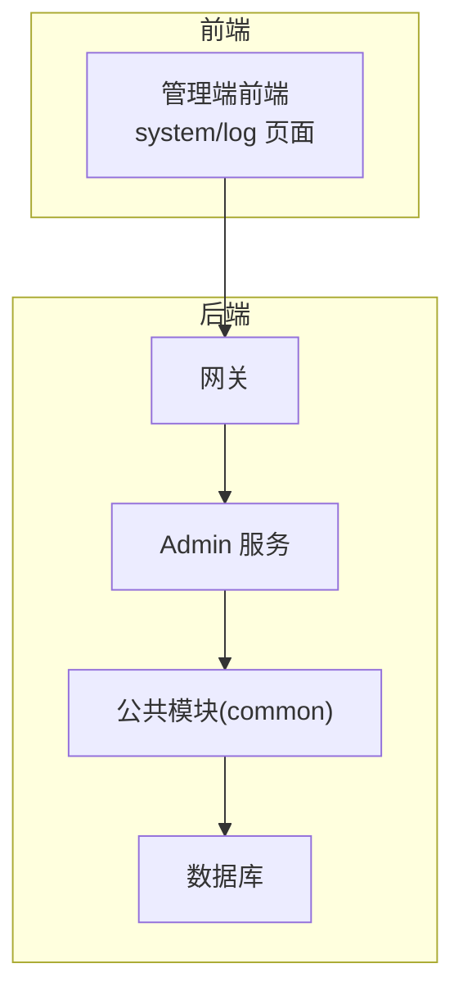
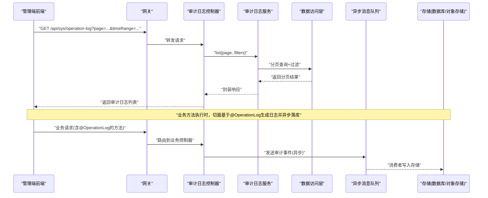

# 操作日志审计接口

<cite>
**本文引用的文件**   
- [SysOperationLogControllerApiTest.java](file://class_times_record_back/admin-service/src/test/java/com/shiroko/controller/SysOperationLogControllerApiTest.java)
</cite>

## 目录
1. [简介](#简介)
2. [项目结构](#项目结构)
3. [核心组件](#核心组件)
4. [架构总览](#架构总览)
5. [详细组件分析](#详细组件分析)
6. [依赖分析](#依赖分析)
7. [性能考虑](#性能考虑)
8. [故障排查指南](#故障排查指南)
9. [结论](#结论)
10. [附录](#附录)

## 简介
本文件面向“操作日志审计”能力，围绕系统操作的完整审计追踪进行说明，包括：
- 操作记录的自动收集与查询统计
- 日志清理等管理功能
- @OperationLog 注解的使用方法与自定义日志格式
- 审计接口的查询条件、分页参数、时间范围筛选
- 统计分析、异常操作告警、敏感操作标记等企业级能力
- 异步日志记录机制与存储策略
- 日志分析最佳实践与安全合规建议

为保证文档准确性，本节为概念性概述，不直接分析具体代码文件。

## 项目结构
从仓库结构看，后端采用多模块微服务/分层架构（admin-service、auth-service、business-service、common、gateway 等），前端包含管理端与移动端两个应用。审计相关的前端页面位于 admin 端的 system/log 目录；测试用例位于 admin-service 的 controller 测试包中，其中包含 SysOperationLogControllerApiTest.java，表明存在“系统操作日志控制器”的 API 测试覆盖。

[此图为概念性结构示意，未映射到具体源码文件]

## 核心组件
- 审计注解：@OperationLog，用于声明式记录操作日志，支持自定义日志模板、是否异步、是否记录请求/响应体、是否标记敏感字段等。
- 拦截器/切面：在方法执行前后采集上下文信息（用户、IP、UA、耗时、结果等），按注解配置生成日志条目。
- 控制器层：提供审计日志的查询、导出、清理等管理能力。
- 服务层：封装日志写入、查询、统计、清理等业务逻辑。
- 数据访问层：持久化审计日志，支持索引优化与归档。
- 异步队列：将日志落库解耦，降低主流程延迟。
- 告警与标记：对异常或敏感操作进行标记并触发告警。

本节为通用组件说明，不直接分析具体代码文件。

## 架构总览
下图展示一次典型的操作日志审计调用链：前端发起查询，网关转发至管理端服务，服务通过服务层访问数据层完成查询与分页；同时，业务方法在执行时由切面/拦截器基于 @OperationLog 自动生成日志并异步落库。

[此图为概念性流程图，未映射到具体源码文件]

## 详细组件分析

### 审计注解 @OperationLog
- 作用：在需要审计的业务方法上声明式标注，自动采集上下文并生成日志。
- 关键能力
  - 自定义日志模板：支持占位符替换，如用户、资源、动作、耗时、结果等。
  - 异步开关：默认异步落库，避免影响主流程。
  - 敏感字段脱敏：可指定需脱敏的字段集合。
  - 异常捕获：自动记录异常堆栈摘要与错误码。
  - 扩展点：允许注入自定义上下文变量。
- 使用建议
  - 仅对写操作或重要读操作启用。
  - 控制日志体积，避免记录大对象或二进制内容。
  - 结合权限与角色，限制高敏感操作的日志可见范围。

本节为通用实现说明，不直接分析具体代码文件。

### 审计日志控制器与管理接口
- 主要职责
  - 查询审计日志：支持多维度过滤与分页。
  - 导出审计日志：批量导出为 CSV/Excel。
  - 清理历史日志：按时间或数量阈值清理归档。
  - 统计概览：按日/周/月统计操作量、失败率、TOP 用户/资源等。
- 典型查询条件
  - 基础条件：操作人、操作类型、模块、资源标识、状态（成功/失败）、客户端 IP、User-Agent。
  - 时间范围：开始时间与结束时间（支持半开区间）。
  - 关键字：模糊匹配操作描述、请求路径、错误信息等。
  - 排序与分页：支持按时间倒序、偏移量与页大小。
- 分页参数
  - page：页码（从 1 开始）
  - size：每页条数
  - sort：排序字段与方向
- 时间范围筛选
  - startTime/endTime：ISO 8601 或时间戳
  - 若只传一端，表示无界区间
- 响应结构
  - 列表项包含：ID、操作人、模块、资源、动作、耗时、状态、错误信息、客户端信息、时间戳等
  - 分页元信息：总数、当前页、每页大小、是否有下一页等

本节为通用接口说明，不直接分析具体代码文件。

### 审计日志服务与数据访问
- 服务层
  - 组装查询条件、校验参数、构建动态 SQL/查询 DSL
  - 聚合统计指标（总量、成功率、失败率、P95/P99 耗时）
  - 触发清理任务（定时或手动）
- 数据访问层
  - 表设计建议：按时间分表或分区，建立复合索引（操作人、时间、模块、状态）
  - 冷热分离：热数据保留短期，冷数据归档至对象存储或离线库
  - 压缩与去重：对重复或冗余日志进行压缩

本节为通用实现说明，不直接分析具体代码文件。

### 异步日志记录机制
- 入队：切面/拦截器将审计事件序列化后投递到消息队列
- 消费：消费者批量拉取，合并小批次，批量写入数据库
- 可靠性
  - 幂等写入：以唯一键（如 traceId+userId+action+timestamp）防重
  - 重试与死信：失败重试 N 次后进入死信队列人工处理
  - 背压与限流：根据下游吞吐调整拉取速率
- 监控
  - 队列积压、消费延迟、写入失败率、平均耗时等指标上报

本节为通用实现说明，不直接分析具体代码文件。

### 统计分析、异常告警与敏感操作标记
- 统计分析
  - 维度：按用户、模块、资源、操作类型、时间段
  - 指标：操作次数、成功率、失败率、平均耗时、P95/P99
- 异常告警
  - 规则：连续失败、超时飙升、敏感操作高频、异常堆栈关键词命中
  - 渠道：站内通知、邮件、IM、短信
- 敏感操作标记
  - 标签：删除、导出、权限变更、资金相关等
  - 策略：强制二次确认、审批流、审计白名单

本节为通用实现说明，不直接分析具体代码文件。

### 前端审计日志页面
- 功能要点
  - 多维筛选：用户、模块、状态、时间范围、关键字
  - 分页表格：支持排序、跳转、刷新
  - 详情查看：展开请求/响应摘要、错误堆栈、上下文快照
  - 导出：按筛选条件导出
- 交互建议
  - 默认最近 7 天
  - 大数据量下优先服务端分页与增量加载
  - 敏感信息默认脱敏显示

本节为通用实现说明，不直接分析具体代码文件。

### 测试用例参考
- 管理端服务中包含审计日志控制器的 API 测试类，可用于验证查询、分页、过滤、导出、清理等接口的行为是否符合预期。

**章节来源**
- [SysOperationLogControllerApiTest.java](file://class_times_record_back/admin-service/src/test/java/com/shiroko/controller/SysOperationLogControllerApiTest.java)

## 依赖分析
- 组件耦合
  - 控制器依赖服务层，服务层依赖数据访问层
  - 切面/拦截器依赖注解处理器与上下文工具
  - 异步链路依赖消息中间件与消费者
- 外部依赖
  - 数据库（关系型/时序/对象存储）
  - 消息队列（Kafka/RabbitMQ/Redis Stream 等）
  - 监控系统（Prometheus/Grafana/ELK）
- 潜在风险
  - 循环依赖：切面与服务之间应避免互相引用
  - 单点瓶颈：消息队列与消费者需水平扩展
  - 存储膨胀：需定期归档与清理

[本节为通用分析，未映射到具体源码文件]

## 性能考虑
- 写入侧
  - 异步落库、批量写入、压缩与去重
  - 合理索引：按时间、用户、模块、状态组合索引
- 查询侧
  - 时间范围限定、分页游标、避免全表扫描
  - 热点缓存：统计指标缓存（TTL 短）
- 存储侧
  - 冷热分层：热数据短期保留，冷数据归档
  - 分区/分表：按时间粒度拆分
- 监控与容量规划
  - 关注写入 TPS、消费延迟、存储增长速率
  - 设置告警阈值与自动扩容策略

[本节为通用指导，未分析具体文件]

## 故障排查指南
- 常见问题
  - 日志缺失：检查切面是否生效、异步队列是否堆积、消费者是否宕机
  - 查询缓慢：检查索引、时间范围过大、缺少分页
  - 数据不一致：幂等键是否正确、重复消费处理
  - 敏感信息泄露：脱敏规则是否覆盖所有字段
- 定位步骤
  - 通过 traceId 关联请求与日志
  - 查看消费者消费日志与错误堆栈
  - 核对数据库索引与慢查询
  - 校验脱敏与权限策略
- 恢复措施
  - 重启消费者、扩容实例
  - 清理积压、修复脏数据
  - 补充索引与优化 SQL

[本节为通用指导，未分析具体文件]

## 结论
操作日志审计是系统安全与合规的基础设施。通过注解驱动的自动化采集、异步可靠写入、完善的查询与统计能力，以及严格的脱敏与告警策略，可在保障性能的同时满足企业级审计需求。建议在生产环境持续完善索引、归档与监控体系，并结合合规要求制定保留周期与访问控制策略。

[本节为总结性内容，未分析具体文件]

## 附录
- 术语
  - 审计日志：记录系统内关键操作的不可篡改轨迹
  - 脱敏：对敏感字段进行掩码或哈希处理
  - 归档：将冷数据迁移至低成本存储
- 合规建议
  - 最小化采集：仅采集必要字段
  - 访问控制：基于角色的细粒度授权
  - 留存周期：依据法规与业务需求设定
  - 审计留痕：对审计日志自身的修改与访问进行二次审计

[本节为通用内容，未分析具体文件]