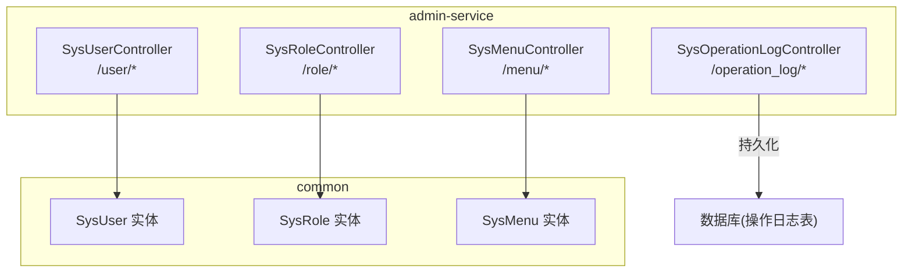
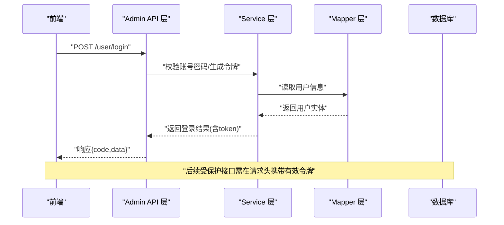
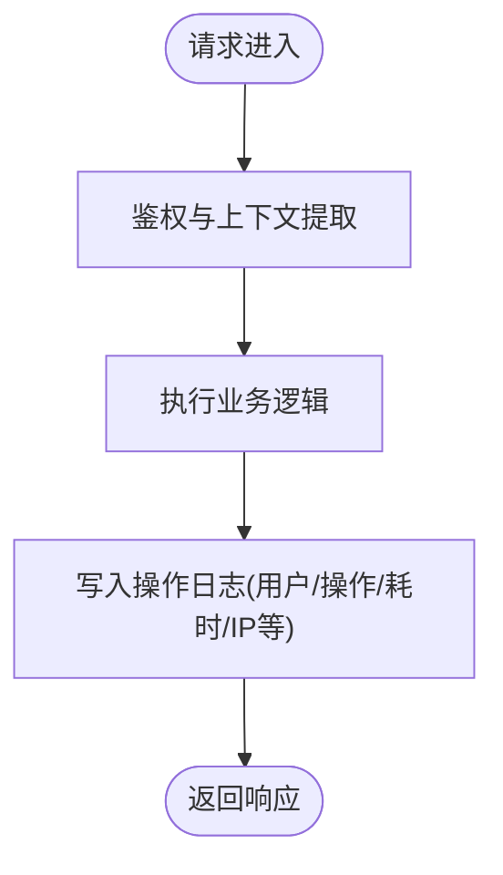
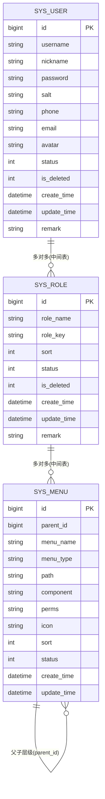

# 管理接口

<cite>
**本文引用的文件**
- [SysUserControllerApiTest.java](file://class_times_record_back/admin-service/src/test/java/com/shiroko/controller/SysUserControllerApiTest.java)
- [SysRoleControllerApiTest.java](file://class_times_record_back/admin-service/src/test/java/com/shiroko/controller/SysRoleControllerApiTest.java)
- [SysMenuControllerApiTest.java](file://class_times_record_back/admin-service/src/test/java/com/shiroko/controller/SysMenuControllerApiTest.java)
- [SysOperationLogControllerApiTest.java](file://class_times_record_back/admin-service/src/test/java/com/shiroko/controller/SysOperationLogControllerApiTest.java)
- [SysUser.java](file://class_times_record_back/common/src/main/java/com/shiroko/repository/entity/SysUser.java)
- [SysRole.java](file://class_times_record_back/common/src/main/java/com/shiroko/repository/entity/SysRole.java)
- [SysMenu.java](file://class_times_record_back/common/src/main/java/com/shiroko/repository/entity/SysMenu.java)
</cite>

## 目录
1. [简介](#简介)
2. [项目结构](#项目结构)
3. [核心组件](#核心组件)
4. [架构总览](#架构总览)
5. [详细组件分析](#详细组件分析)
6. [依赖关系分析](#依赖关系分析)
7. [性能与扩展性](#性能与扩展性)
8. [故障排查指南](#故障排查指南)
9. [结论](#结论)
10. [附录](#附录)

## 简介
本文件面向系统管理员与后端开发者，系统化梳理并文档化后台管理相关的所有API接口，覆盖：
- 系统用户管理（登录、查询、新增、更新、删除、重置密码、角色关联、Token刷新）
- 角色权限管理（角色的增删改查、菜单授权）
- 菜单配置管理（菜单树、用户可见菜单树、CRUD）
- 操作日志审计（分页查询、筛选、删除、清空）
- RBAC权限模型说明（用户-角色-权限/菜单的关联关系）
- 企业级能力建议（批量操作、导入导出、数据备份恢复）
- 管理员最佳实践与安全建议
- 操作日志记录机制与审计追踪

说明：
- 以下接口定义基于测试用例中实际使用的路径与方法进行归纳，确保与实现一致。
- 未在前端或测试中出现的管理功能（如系统配置管理、数据备份恢复等）在本仓库中未见直接证据，本节提供通用设计建议与落地指引，但不作为已实现的接口清单。

## 项目结构
本项目采用多模块微服务架构，管理接口集中在 admin-service 模块，通过 Controller → Service → Mapper 的分层组织；实体与通用类型位于 common 模块。

图表来源
- [SysUserControllerApiTest.java:56-74](file://class_times_record_back/admin-service/src/test/java/com/shiroko/controller/SysUserControllerApiTest.java#L56-L74)
- [SysRoleControllerApiTest.java:53-67](file://class_times_record_back/admin-service/src/test/java/com/shiroko/controller/SysRoleControllerApiTest.java#L53-L67)
- [SysMenuControllerApiTest.java:52-66](file://class_times_record_back/admin-service/src/test/java/com/shiroko/controller/SysMenuControllerApiTest.java#L52-L66)
- [SysOperationLogControllerApiTest.java:55-84](file://class_times_record_back/admin-service/src/test/java/com/shiroko/controller/SysOperationLogControllerApiTest.java#L55-L84)
- [SysUser.java:14-49](file://class_times_record_back/common/src/main/java/com/shiroko/repository/entity/SysUser.java#L14-L49)
- [SysRole.java:14-41](file://class_times_record_back/common/src/main/java/com/shiroko/repository/entity/SysRole.java#L14-L41)
- [SysMenu.java:13-45](file://class_times_record_back/common/src/main/java/com/shiroko/repository/entity/SysMenu.java#L13-L45)

章节来源
- [SysUserControllerApiTest.java:1-208](file://class_times_record_back/admin-service/src/test/java/com/shiroko/controller/SysUserControllerApiTest.java#L1-L208)
- [SysRoleControllerApiTest.java:1-168](file://class_times_record_back/admin-service/src/test/java/com/shiroko/controller/SysRoleControllerApiTest.java#L1-L168)
- [SysMenuControllerApiTest.java:1-147](file://class_times_record_back/admin-service/src/test/java/com/shiroko/controller/SysMenuControllerApiTest.java#L1-L147)
- [SysOperationLogControllerApiTest.java:1-147](file://class_times_record_back/admin-service/src/test/java/com/shiroko/controller/SysOperationLogControllerApiTest.java#L1-L147)
- [SysUser.java:1-50](file://class_times_record_back/common/src/main/java/com/shiroko/repository/entity/SysUser.java#L1-L50)
- [SysRole.java:1-42](file://class_times_record_back/common/src/main/java/com/shiroko/repository/entity/SysRole.java#L1-L42)
- [SysMenu.java:1-46](file://class_times_record_back/common/src/main/java/com/shiroko/repository/entity/SysMenu.java#L1-L46)

## 核心组件
- 用户管理控制器：提供管理员登录、用户列表查询、按ID查询、新增、更新、删除、重置密码、获取用户角色、刷新Token等能力。
- 角色管理控制器：提供角色列表查询、按ID查询、新增、更新、删除、获取角色菜单、保存角色菜单权限等能力。
- 菜单管理控制器：提供菜单列表查询、菜单树、用户菜单树、新增、更新、删除等能力。
- 操作日志控制器：提供操作日志分页查询（支持筛选）、单条删除、清空日志等能力。

章节来源
- [SysUserControllerApiTest.java:56-206](file://class_times_record_back/admin-service/src/test/java/com/shiroko/controller/SysUserControllerApiTest.java#L56-L206)
- [SysRoleControllerApiTest.java:53-166](file://class_times_record_back/admin-service/src/test/java/com/shiroko/controller/SysRoleControllerApiTest.java#L53-L166)
- [SysMenuControllerApiTest.java:52-145](file://class_times_record_back/admin-service/src/test/java/com/shiroko/controller/SysMenuControllerApiTest.java#L52-L145)
- [SysOperationLogControllerApiTest.java:55-145](file://class_times_record_back/admin-service/src/test/java/com/shiroko/controller/SysOperationLogControllerApiTest.java#L55-L145)

## 架构总览
管理接口遵循标准分层：前端请求经网关进入 admin-service，由对应 Controller 接收参数，调用 Service 业务逻辑，最终通过 MyBatis-Plus 的 Mapper 访问数据库。RBAC 模型在用户-角色-菜单三层之间建立关联，用于控制菜单可见性与资源访问。

图表来源
- [SysUserControllerApiTest.java:56-74](file://class_times_record_back/admin-service/src/test/java/com/shiroko/controller/SysUserControllerApiTest.java#L56-L74)

## 详细组件分析

### 用户管理接口（/user）
- POST /user/login
  - 功能：管理员登录，返回访问令牌与用户信息
  - 请求体关键字段：用户名、密码
  - 成功响应：包含 accessToken、refreshToken、用户基本信息
  - 失败场景：参数缺失或认证失败
  - 权限要求：无需前置权限（登录入口）
  - 限制：建议开启验证码/防爆破策略
- POST /user/list
  - 功能：分页查询用户列表
  - 请求体关键字段：分页参数、可选筛选条件
  - 成功响应：包含 list 与 total
  - 权限要求：需具备“用户管理-查询”权限
- POST /user/get_by_id
  - 功能：根据ID查询用户详情
  - 请求体关键字段：id
  - 成功响应：用户详细信息
  - 权限要求：需具备“用户管理-查询”权限
- POST /user/insert
  - 功能：新增用户
  - 请求体关键字段：用户名、昵称、密码等
  - 成功响应：新建用户信息
  - 权限要求：需具备“用户管理-新增”权限
  - 限制：用户名唯一性校验
- POST /user/update
  - 功能：更新用户信息
  - 请求体关键字段：id、待更新字段
  - 成功响应：更新后的用户信息
  - 权限要求：需具备“用户管理-编辑”权限
- POST /user/delete
  - 功能：删除用户（逻辑删除）
  - 请求体关键字段：id
  - 成功响应：删除成功提示
  - 权限要求：需具备“用户管理-删除”权限
  - 限制：存在关联数据时的处理策略
- POST /user/reset_password
  - 功能：重置用户密码
  - 请求体关键字段：id、newPassword
  - 成功响应：重置成功提示
  - 权限要求：需具备“用户管理-重置密码”权限
  - 安全建议：新密码强度校验、强制首次登录修改
- POST /user/get_roles
  - 功能：获取用户已分配的角色集合
  - 请求体关键字段：userId
  - 成功响应：角色列表
  - 权限要求：需具备“用户管理-查看角色”权限
- POST /user/refresh
  - 功能：刷新访问令牌
  - 请求体关键字段：refreshToken
  - 成功响应：新的accessToken与refreshToken
  - 权限要求：持有有效的refreshToken即可

章节来源
- [SysUserControllerApiTest.java:56-206](file://class_times_record_back/admin-service/src/test/java/com/shiroko/controller/SysUserControllerApiTest.java#L56-L206)

#### 用户实体字段参考
- 主键：id
- 基础信息：username、nickname、phone、email、avatar
- 安全字段：password、salt
- 状态与软删：status、isDeleted
- 时间戳：createTime、updateTime
- 备注：remark

章节来源
- [SysUser.java:14-49](file://class_times_record_back/common/src/main/java/com/shiroko/repository/entity/SysUser.java#L14-L49)

### 角色管理接口（/role）
- POST /role/list
  - 功能：分页查询角色列表
  - 请求体关键字段：分页参数、可选筛选条件
  - 成功响应：list 与 total
  - 权限要求：需具备“角色管理-查询”权限
- POST /role/get_by_id
  - 功能：根据ID查询角色详情
  - 请求体关键字段：id
  - 成功响应：角色详细信息
  - 权限要求：需具备“角色管理-查询”权限
- POST /role/insert
  - 功能：新增角色
  - 请求体关键字段：角色名、角色标识、排序等
  - 成功响应：新建角色信息
  - 权限要求：需具备“角色管理-新增”权限
  - 限制：角色标识唯一性校验
- POST /role/update
  - 功能：更新角色信息
  - 请求体关键字段：id、待更新字段
  - 成功响应：更新后的角色信息
  - 权限要求：需具备“角色管理-编辑”权限
- POST /role/delete
  - 功能：删除角色（逻辑删除）
  - 请求体关键字段：id
  - 成功响应：删除成功提示
  - 权限要求：需具备“角色管理-删除”权限
  - 限制：存在用户关联时的处理策略
- POST /role/get_menus
  - 功能：获取角色已分配的菜单集合
  - 请求体关键字段：roleId
  - 成功响应：菜单列表
  - 权限要求：需具备“角色管理-查看菜单”权限
- POST /role/save_menus
  - 功能：保存角色菜单权限（全量覆盖）
  - 请求体关键字段：roleId、menuIds
  - 成功响应：保存成功提示
  - 权限要求：需具备“角色管理-授权”权限

章节来源
- [SysRoleControllerApiTest.java:53-166](file://class_times_record_back/admin-service/src/test/java/com/shiroko/controller/SysRoleControllerApiTest.java#L53-L166)

#### 角色实体字段参考
- 主键：id
- 基础信息：roleName、roleKey、sort
- 状态与软删：status、isDeleted
- 时间戳：createTime、updateTime
- 备注：remark

章节来源
- [SysRole.java:14-41](file://class_times_record_back/common/src/main/java/com/shiroko/repository/entity/SysRole.java#L14-L41)

### 菜单管理接口（/menu）
- POST /menu/list
  - 功能：查询菜单列表（扁平或带层级）
  - 请求体关键字段：可选筛选条件
  - 成功响应：菜单列表
  - 权限要求：需具备“菜单管理-查询”权限
- POST /menu/tree
  - 功能：获取完整菜单树
  - 成功响应：菜单树结构
  - 权限要求：需具备“菜单管理-查询”权限
- POST /menu/user_tree
  - 功能：获取当前用户的可见菜单树（结合角色与权限）
  - 成功响应：用户菜单树
  - 权限要求：需具备“菜单管理-查询”权限
- POST /menu/insert
  - 功能：新增菜单
  - 请求体关键字段：菜单名、类型、路径、组件、权限标识、图标、排序等
  - 成功响应：新建菜单信息
  - 权限要求：需具备“菜单管理-新增”权限
- POST /menu/update
  - 功能：更新菜单信息
  - 请求体关键字段：id、待更新字段
  - 成功响应：更新后的菜单信息
  - 权限要求：需具备“菜单管理-编辑”权限
- POST /menu/delete
  - 功能：删除菜单（逻辑删除）
  - 请求体关键字段：id
  - 成功响应：删除成功提示
  - 权限要求：需具备“菜单管理-删除”权限
  - 限制：存在子菜单或角色引用时的处理策略

章节来源
- [SysMenuControllerApiTest.java:52-145](file://class_times_record_back/admin-service/src/test/java/com/shiroko/controller/SysMenuControllerApiTest.java#L52-L145)

#### 菜单实体字段参考
- 主键：id
- 层级与展示：parentId、menuName、menuType、path、component、icon、sort
- 权限标识：perms
- 状态：status
- 时间戳：createTime、updateTime

章节来源
- [SysMenu.java:13-45](file://class_times_record_back/common/src/main/java/com/shiroko/repository/entity/SysMenu.java#L13-L45)

### 操作日志接口（/operation_log）
- POST /operation_log/list
  - 功能：分页查询操作日志，支持按操作类型、用户名等筛选
  - 请求体关键字段：currentPage、pageSize、operation、username 等
  - 成功响应：分页数据（records、total）
  - 权限要求：需具备“日志管理-查询”权限
- POST /operation_log/delete
  - 功能：删除指定日志
  - 请求体关键字段：id
  - 成功响应：删除成功提示
  - 权限要求：需具备“日志管理-删除”权限
- POST /operation_log/clear
  - 功能：清空所有操作日志
  - 成功响应：清空成功提示
  - 权限要求：需具备“日志管理-清空”权限
  - 安全建议：二次确认、审计留痕

章节来源
- [SysOperationLogControllerApiTest.java:55-145](file://class_times_record_back/admin-service/src/test/java/com/shiroko/controller/SysOperationLogControllerApiTest.java#L55-L145)

#### 操作日志记录流程（概念图）

[此图为概念流程，不映射具体源码文件]

## 依赖关系分析
- 控制器依赖关系
  - SysUserController 依赖用户实体与服务层
  - SysRoleController 依赖角色实体与服务层
  - SysMenuController 依赖菜单实体与服务层
  - SysOperationLogController 依赖日志持久化层
- 实体间关系（RBAC）
  - 用户与角色：多对多（通过中间表关联）
  - 角色与菜单：多对多（通过中间表关联）
  - 菜单为自关联树形结构（parentId）

图表来源
- [SysUser.java:14-49](file://class_times_record_back/common/src/main/java/com/shiroko/repository/entity/SysUser.java#L14-L49)
- [SysRole.java:14-41](file://class_times_record_back/common/src/main/java/com/shiroko/repository/entity/SysRole.java#L14-L41)
- [SysMenu.java:13-45](file://class_times_record_back/common/src/main/java/com/shiroko/repository/entity/SysMenu.java#L13-L45)

章节来源
- [SysUser.java:1-50](file://class_times_record_back/common/src/main/java/com/shiroko/repository/entity/SysUser.java#L1-L50)
- [SysRole.java:1-42](file://class_times_record_back/common/src/main/java/com/shiroko/repository/entity/SysRole.java#L1-L42)
- [SysMenu.java:1-46](file://class_times_record_back/common/src/main/java/com/shiroko/repository/entity/SysMenu.java#L1-L46)

## 性能与扩展性
- 分页与筛选
  - 用户列表、角色列表、操作日志均支持分页查询，建议在服务端增加索引以优化筛选字段（如用户名、操作类型）。
- 菜单树构建
  - 菜单树应在服务端缓存热点数据，避免频繁递归计算。
- Token刷新
  - 刷新接口应限制频率，防止滥用；建议将refreshToken与设备指纹绑定。
- 批量操作建议
  - 用户/角色/菜单的批量新增与更新可通过数组参数传入，在服务端分批事务提交，提升吞吐并降低锁竞争。
- 导入导出建议
  - 导入：提供模板下载、异步任务处理、错误行定位与回滚策略。
  - 导出：大表导出使用流式输出，避免内存溢出。
- 数据备份与恢复
  - 建议提供定时备份任务与一键恢复接口，并对敏感数据进行脱敏与加密存储。

[本节为通用指导，不直接分析具体文件]

## 故障排查指南
- 登录失败
  - 检查用户名/密码是否正确、账户是否被禁用、是否触发防爆破策略。
- 权限不足
  - 确认用户是否拥有对应角色，角色是否已分配相应菜单与权限标识。
- 菜单树为空
  - 检查菜单是否存在父级关系错误、状态是否启用、当前用户是否有可见权限。
- 操作日志缺失
  - 检查日志写入链路是否正常、是否因异常导致未落库、磁盘空间是否充足。
- 常见HTTP状态码
  - 200：成功
  - 400：参数校验失败
  - 401：未认证或令牌无效
  - 403：无权限
  - 500：服务器内部错误

章节来源
- [SysUserControllerApiTest.java:56-206](file://class_times_record_back/admin-service/src/test/java/com/shiroko/controller/SysUserControllerApiTest.java#L56-L206)
- [SysOperationLogControllerApiTest.java:55-145](file://class_times_record_back/admin-service/src/test/java/com/shiroko/controller/SysOperationLogControllerApiTest.java#L55-L145)

## 结论
本仓库的管理接口围绕RBAC模型构建了完整的用户、角色、菜单与操作日志管理能力。通过标准化的分页查询、筛选与树形结构展示，满足大多数后台管理系统的需求。建议在生产环境完善鉴权拦截、限流与审计告警，并结合企业级需求补充批量操作、导入导出与数据备份恢复能力。

[本节为总结性内容，不直接分析具体文件]

## 附录

### RBAC权限控制模型说明
- 用户-角色：一个用户可拥有多个角色，角色聚合一组权限。
- 角色-菜单：一个角色可拥有多个菜单，菜单代表页面与按钮级权限。
- 菜单-权限标识：菜单的perms字段可用于细粒度资源控制。
- 用户-菜单：通过用户→角色→菜单的传递关系决定用户可见菜单与可用操作。

章节来源
- [SysUser.java:14-49](file://class_times_record_back/common/src/main/java/com/shiroko/repository/entity/SysUser.java#L14-L49)
- [SysRole.java:14-41](file://class_times_record_back/common/src/main/java/com/shiroko/repository/entity/SysRole.java#L14-L41)
- [SysMenu.java:13-45](file://class_times_record_back/common/src/main/java/com/shiroko/repository/entity/SysMenu.java#L13-L45)

### 管理员最佳实践与安全建议
- 最小权限原则：仅授予必要的角色与菜单权限。
- 强口令策略：长度、复杂度、定期更换、禁止历史重复。
- 双因子认证：对高危操作启用二次验证。
- 会话管理：合理设置Token有效期，及时失效旧令牌。
- 审计追踪：关键操作必须记录操作人、时间、IP、变更前后值。
- 防重放与限流：对敏感接口实施速率限制与签名校验。
- 数据脱敏：日志与导出时对敏感字段脱敏。

[本节为通用指导，不直接分析具体文件]