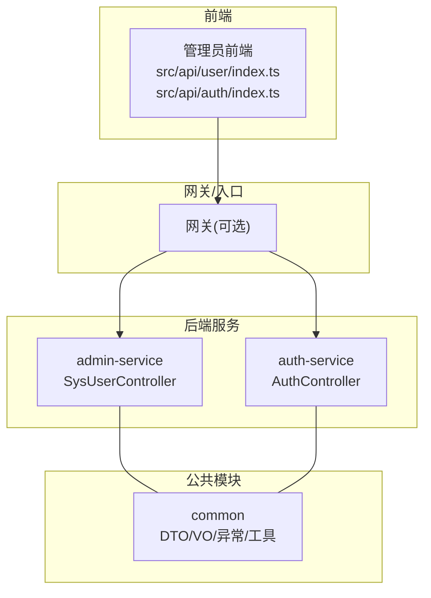
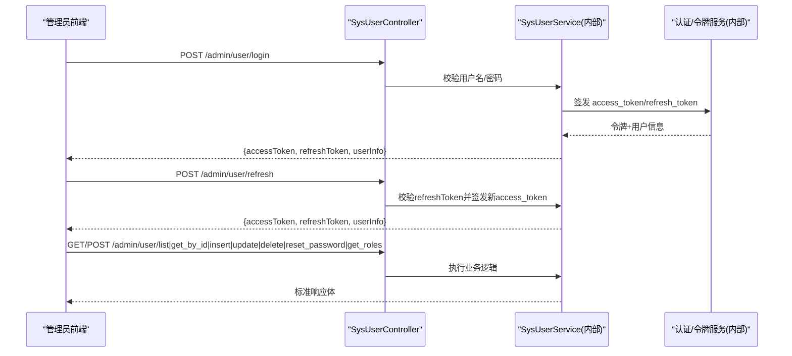
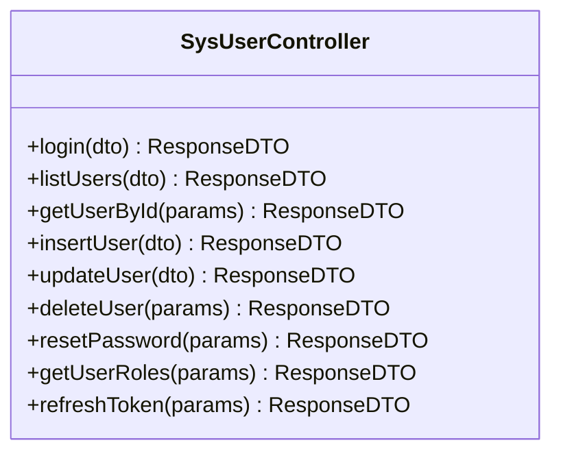
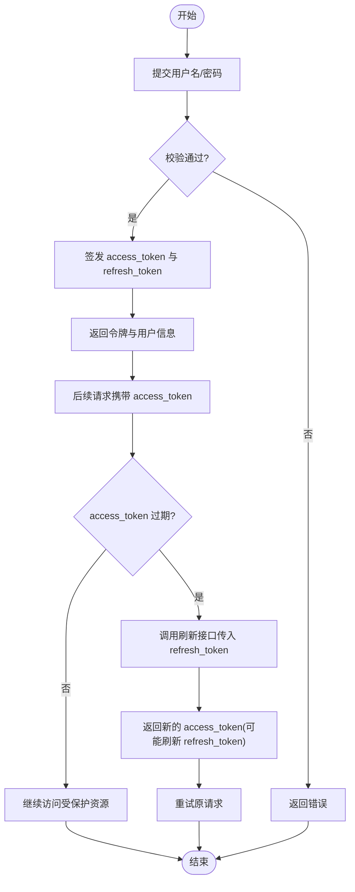
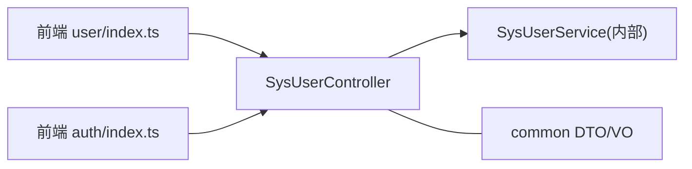

# 系统用户管理接口

<cite>
**本文引用的文件**
- [SysUserController.java](file://class_times_record_back/admin-service/src/main/java/com/shiroko/controller/SysUserController.java)
- [AuthController.java](file://class_times_record_back/auth-service/src/main/java/com/shiroko/controller/AuthController.java)
- [LoginSysUserDTO.java](file://class_times_record_back/common/src/main/java/com/shiroko/repository/dto/admin/LoginSysUserDTO.java)
- [QuerySysUserDTO.java](file://class_times_record_back/common/src/main/java/com/shiroko/repository/dto/admin/QuerySysUserDTO.java)
- [LoginSysUserVO.java](file://class_times_record_back/common/src/main/java/com/shiroko/repository/vo/admin/LoginSysUserVO.java)
- [user/index.ts](file://class_record_admin_front/src/api/user/index.ts)
- [auth/index.ts](file://class_record_admin_front/src/api/auth/index.ts)
</cite>

## 目录
1. [简介](#简介)
2. [项目结构](#项目结构)
3. [核心组件](#核心组件)
4. [架构总览](#架构总览)
5. [详细组件分析](#详细组件分析)
6. [依赖分析](#依赖分析)
7. [性能考虑](#性能考虑)
8. [故障排查指南](#故障排查指南)
9. [结论](#结论)
10. [附录](#附录)

## 简介
本文件面向管理员端“系统用户管理”能力，覆盖以下范围：
- 管理员登录与令牌刷新（JWT）
- 用户列表查询、用户详情获取
- 用户新增、更新、删除
- 密码重置
- 用户角色关联查询
- 认证流程说明（含令牌生成与刷新机制）
- 请求参数、响应数据结构、错误码约定
- 调用示例与最佳实践建议

## 项目结构
后端采用多服务拆分：
- admin-service：提供管理员侧业务接口（用户管理、菜单、日志等）
- auth-service：提供通用认证授权能力（小程序端为主）
- common：跨服务共享的 DTO/VO、通用异常、工具类等
- class_record_admin_front：管理员前端，封装了用户管理与认证相关 API 调用

图示来源
- [SysUserController.java:1-79](file://class_times_record_back/admin-service/src/main/java/com/shiroko/controller/SysUserController.java#L1-L79)
- [AuthController.java:1-197](file://class_times_record_back/auth-service/src/main/java/com/shiroko/controller/AuthController.java#L1-L197)
- [user/index.ts:1-30](file://class_record_admin_front/src/api/user/index.ts#L1-L30)
- [auth/index.ts:1-14](file://class_record_admin_front/src/api/auth/index.ts#L1-L14)

章节来源
- [SysUserController.java:1-79](file://class_times_record_back/admin-service/src/main/java/com/shiroko/controller/SysUserController.java#L1-L79)
- [AuthController.java:1-197](file://class_times_record_back/auth-service/src/main/java/com/shiroko/controller/AuthController.java#L1-L197)
- [user/index.ts:1-30](file://class_record_admin_front/src/api/user/index.ts#L1-L30)
- [auth/index.ts:1-14](file://class_record_admin_front/src/api/auth/index.ts#L1-L14)

## 核心组件
- 管理员用户控制器：暴露用户管理的 REST 接口，包含登录、分页查询、详情、新增、更新、删除、重置密码、角色查询、刷新令牌。
- 认证控制器：提供通用认证能力（如小程序登录），用于对比理解 JWT 刷新机制在不同服务的实现差异。
- 前端 API 封装：对管理员前端的用户与认证接口进行统一封装，便于页面调用。

章节来源
- [SysUserController.java:1-79](file://class_times_record_back/admin-service/src/main/java/com/shiroko/controller/SysUserController.java#L1-L79)
- [AuthController.java:1-197](file://class_times_record_back/auth-service/src/main/java/com/shiroko/controller/AuthController.java#L1-L197)
- [user/index.ts:1-30](file://class_record_admin_front/src/api/user/index.ts#L1-L30)
- [auth/index.ts:1-14](file://class_record_admin_front/src/api/auth/index.ts#L1-L14)

## 架构总览
管理员端用户管理的关键交互路径如下：
- 登录：前端调用管理员登录接口，返回 access_token 与 refresh_token，以及用户信息。
- 刷新：使用 refresh_token 换取新的 access_token。
- 用户 CRUD：通过访问令牌访问用户管理接口完成增删改查。
- 角色查询：根据用户 ID 查询其关联的角色集合。

图示来源
- [SysUserController.java:30-77](file://class_times_record_back/admin-service/src/main/java/com/shiroko/controller/SysUserController.java#L30-L77)
- [AuthController.java:78-81](file://class_times_record_back/auth-service/src/main/java/com/shiroko/controller/AuthController.java#L78-L81)

## 详细组件分析

### 管理员用户管理接口（SysUserController）
- 基础路径：/admin/user
- 方法列表与职责：
  - 登录：POST /login
  - 列表查询：POST /list
  - 详情获取：POST /get_by_id
  - 新增：POST /insert
  - 更新：POST /update
  - 删除：POST /delete
  - 重置密码：POST /reset_password
  - 角色查询：POST /get_roles
  - 刷新令牌：POST /refresh

图示来源
- [SysUserController.java:23-78](file://class_times_record_back/admin-service/src/main/java/com/shiroko/controller/SysUserController.java#L23-L78)

#### 接口清单与参数/响应说明
以下为管理员端用户管理接口的完整定义。所有接口均返回统一响应体（由 ResponseDTO 承载）。

- 登录
  - 方法：POST
  - 路径：/admin/user/login
  - 请求体：LoginSysUserDTO
    - username：字符串，必填
    - password：字符串，必填
  - 响应体：LoginSysUserVO
    - accessToken：字符串
    - refreshToken：字符串
    - userInfo：SysUserVO（对象）

- 列表查询
  - 方法：POST
  - 路径：/admin/user/list
  - 请求体：QuerySysUserDTO
    - username：字符串（可选）
    - phone：字符串（可选）
    - status：整数（可选）
    - currentPage：整数（可选）
    - pageSize：整数（可选）
  - 响应体：Map<String, Object>（分页数据载体）

- 详情获取
  - 方法：POST
  - 路径：/admin/user/get_by_id
  - 请求体：{ id: Long }
  - 响应体：SysUserVO

- 新增
  - 方法：POST
  - 路径：/admin/user/insert
  - 请求体：InsertSysUserDTO（对象）
  - 响应体：SysUserVO

- 更新
  - 方法：POST
  - 路径：/admin/user/update
  - 请求体：UpdateSysUserDTO（对象）
  - 响应体：SysUserVO

- 删除
  - 方法：POST
  - 路径：/admin/user/delete
  - 请求体：{ id: Long }
  - 响应体：String（操作结果消息）

- 重置密码
  - 方法：POST
  - 路径：/admin/user/reset_password
  - 请求体：{ id: Long, newPassword: String }
  - 响应体：String（操作结果消息）

- 角色查询
  - 方法：POST
  - 路径：/admin/user/get_roles
  - 请求体：{ userId: Long }
  - 响应体：List<SysRole>

- 刷新令牌
  - 方法：POST
  - 路径：/admin/user/refresh
  - 请求体：{ refreshToken: String }
  - 响应体：LoginSysUserVO

章节来源
- [SysUserController.java:30-77](file://class_times_record_back/admin-service/src/main/java/com/shiroko/controller/SysUserController.java#L30-L77)
- [LoginSysUserDTO.java:1-18](file://class_times_record_back/common/src/main/java/com/shiroko/repository/dto/admin/LoginSysUserDTO.java#L1-L18)
- [QuerySysUserDTO.java:1-21](file://class_times_record_back/common/src/main/java/com/shiroko/repository/dto/admin/QuerySysUserDTO.java#L1-L21)
- [LoginSysUserVO.java:1-18](file://class_times_record_back/common/src/main/java/com/shiroko/repository/vo/admin/LoginSysUserVO.java#L1-L18)

#### 调用示例（前端封装）
- 用户管理接口封装（路径与方法）
  - 列表：post('/admin/user/list', data)
  - 详情：post('/admin/user/get_by_id', { id })
  - 新增：post('/admin/user/insert', data)
  - 更新：post('/admin/user/update', data)
  - 删除：post('/admin/user/delete', { id })
  - 重置密码：post('/admin/user/reset_password', data)
  - 角色查询：post('/admin/user/get_roles', { userId })

- 认证相关封装
  - 登录：post('/admin/user/login', data)
  - 刷新令牌：post('/admin/user/refresh', { refreshToken })

章节来源
- [user/index.ts:1-30](file://class_record_admin_front/src/api/user/index.ts#L1-L30)
- [auth/index.ts:1-14](file://class_record_admin_front/src/api/auth/index.ts#L1-L14)

### 认证流程与令牌机制
- 登录流程
  - 客户端提交用户名与密码至管理员登录接口
  - 服务端校验通过后签发 access_token 与 refresh_token，并返回用户信息
- 刷新流程
  - 客户端携带 refresh_token 调用刷新接口，服务端校验后签发新的 access_token（可能同时刷新 refresh_token）
- 与通用认证服务的对比
  - auth-service 提供通用的 refresh 接口，供其他端（如小程序）刷新令牌；管理员端在 admin-service 中同样提供 /admin/user/refresh 以适配管理员场景

图示来源
- [SysUserController.java:30-77](file://class_times_record_back/admin-service/src/main/java/com/shiroko/controller/SysUserController.java#L30-L77)
- [AuthController.java:78-81](file://class_times_record_back/auth-service/src/main/java/com/shiroko/controller/AuthController.java#L78-L81)

章节来源
- [SysUserController.java:30-77](file://class_times_record_back/admin-service/src/main/java/com/shiroko/controller/SysUserController.java#L30-L77)
- [AuthController.java:78-81](file://class_times_record_back/auth-service/src/main/java/com/shiroko/controller/AuthController.java#L78-L81)

### 用户状态管理与权限继承机制
- 用户状态
  - 列表查询支持按 status 筛选，表明用户存在状态字段用于控制可用性等
- 权限模型
  - 通过用户角色查询接口可获取用户关联的角色集合，结合 RBAC 模型可实现基于角色的权限控制
- 权限继承
  - 若系统中存在角色层级或权限继承关系，可在角色维度进行权限聚合；具体策略需参考角色与权限的数据模型与服务实现

章节来源
- [QuerySysUserDTO.java:1-21](file://class_times_record_back/common/src/main/java/com/shiroko/repository/dto/admin/QuerySysUserDTO.java#L1-L21)
- [SysUserController.java:69-72](file://class_times_record_back/admin-service/src/main/java/com/shiroko/controller/SysUserController.java#L69-L72)

## 依赖分析
- 控制器到服务层
  - SysUserController 依赖 SysUserService 完成业务处理
- 前端到后端
  - 管理员前端 user/index.ts 与 auth/index.ts 分别封装用户管理与认证相关接口
- 公共模块
  - DTO/VO 定义位于 common 模块，被前后端共同引用

图示来源
- [user/index.ts:1-30](file://class_record_admin_front/src/api/user/index.ts#L1-L30)
- [auth/index.ts:1-14](file://class_record_admin_front/src/api/auth/index.ts#L1-L14)
- [SysUserController.java:1-79](file://class_times_record_back/admin-service/src/main/java/com/shiroko/controller/SysUserController.java#L1-L79)

章节来源
- [user/index.ts:1-30](file://class_record_admin_front/src/api/user/index.ts#L1-L30)
- [auth/index.ts:1-14](file://class_record_admin_front/src/api/auth/index.ts#L1-L14)
- [SysUserController.java:1-79](file://class_times_record_back/admin-service/src/main/java/com/shiroko/controller/SysUserController.java#L1-L79)

## 性能考虑
- 分页查询
  - 列表接口支持 currentPage 与 pageSize，建议合理设置页大小以避免一次性返回过多数据
- 缓存策略
  - 对于热点用户信息与角色信息，可在服务层引入缓存以降低数据库压力
- 令牌刷新
  - 建议在客户端维护 access_token 生命周期，避免频繁刷新造成额外开销

[本节为通用指导，不直接分析具体文件]

## 故障排查指南
- 常见错误
  - 参数校验失败：例如登录时用户名或密码为空会触发校验错误
  - 令牌无效或过期：刷新接口返回错误或再次登录
  - 资源不存在：详情或删除时 ID 不存在
- 定位步骤
  - 检查请求体字段是否符合 DTO 定义
  - 确认是否携带有效的 access_token
  - 核对用户是否存在且状态正常
- 日志与审计
  - 部分接口标注了操作日志注解，可用于追踪关键操作

章节来源
- [LoginSysUserDTO.java:1-18](file://class_times_record_back/common/src/main/java/com/shiroko/repository/dto/admin/LoginSysUserDTO.java#L1-L18)
- [SysUserController.java:30-77](file://class_times_record_back/admin-service/src/main/java/com/shiroko/controller/SysUserController.java#L30-L77)

## 结论
管理员用户管理接口覆盖了完整的用户生命周期与认证流程，配合统一的响应体与分页查询能力，能够满足后台管理系统的基本需求。建议在生产环境中完善错误码规范、增强鉴权拦截与审计记录，并对敏感操作增加二次确认与审批流。

[本节为总结性内容，不直接分析具体文件]

## 附录

### 统一响应体约定
- 所有接口返回统一响应体（ResponseDTO），包含成功标志、消息与数据载荷。具体字段定义请参考后端 ResponseDTO 的实现。

章节来源
- [SysUserController.java:1-79](file://class_times_record_back/admin-service/src/main/java/com/shiroko/controller/SysUserController.java#L1-L79)