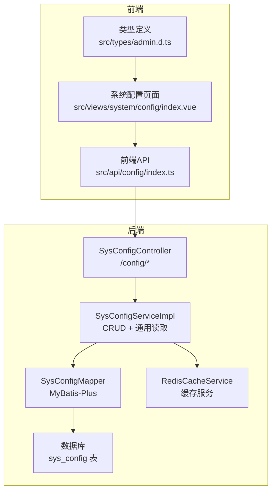
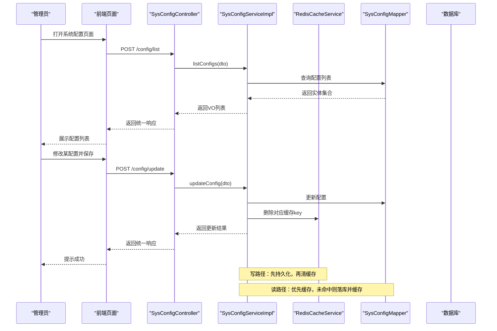
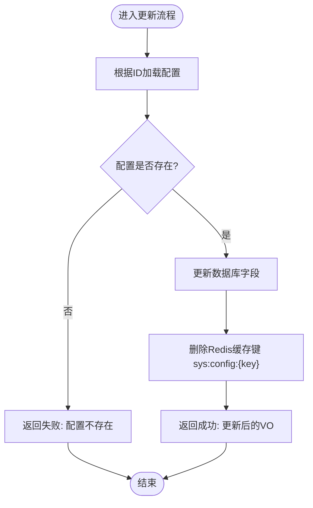
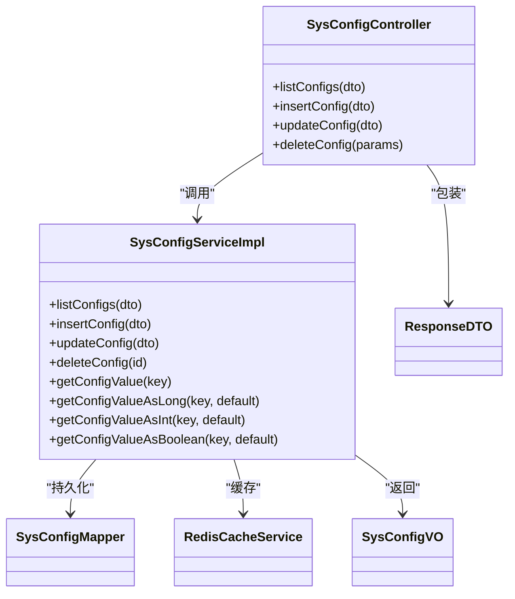

# 系统配置管理接口

<cite>
**本文引用的文件**
- [SysConfigController.java](file://class_times_record_back/admin-service/src/main/java/com/shiroko/controller/SysConfigController.java)
- [SysConfigServiceImpl.java](file://class_times_record_back/admin-service/src/main/java/com/shiroko/service/impl/SysConfigServiceImpl.java)
- [JwtConfigInitializer.java](file://class_times_record_back/admin-service/src/main/java/com/shiroko/config/JwtConfigInitializer.java)
- [index.ts（前端配置API）](file://class_record_admin_front/src/api/config/index.ts)
- [index.vue（系统配置页面）](file://class_record_admin_front/src/views/system/config/index.vue)
- [admin.d.ts（类型定义）](file://class_record_admin_front/src/types/admin.d.ts)
</cite>

## 目录
1. [简介](#简介)
2. [项目结构](#项目结构)
3. [核心组件](#核心组件)
4. [架构总览](#架构总览)
5. [详细组件分析](#详细组件分析)
6. [依赖分析](#依赖分析)
7. [性能考虑](#性能考虑)
8. [故障排查指南](#故障排查指南)
9. [结论](#结论)
10. [附录](#附录)

## 简介
本文件面向“系统配置管理”能力，围绕系统参数的动态配置管理进行系统化说明。内容涵盖：
- 配置项的增删改查、分组查询与排序
- 配置热更新机制与缓存策略（Cache-Aside）
- 通用读取方法（字符串、数值、布尔）及默认值处理
- 配置类型定义、值验证规则、默认值设置
- 导入导出、批量更新、版本控制与回滚等扩展建议
- 配置优先级与覆盖规则的最佳实践
- 安全注意事项与运维建议

## 项目结构
后端采用 Spring Boot 分层架构，配置管理相关代码位于 admin-service 模块；前端在 class_record_admin_front 中提供配置管理的 API 调用与页面。

图示来源
- [SysConfigController.java:1-77](file://class_times_record_back/admin-service/src/main/java/com/shiroko/controller/SysConfigController.java#L1-L77)
- [SysConfigServiceImpl.java:1-232](file://class_times_record_back/admin-service/src/main/java/com/shiroko/service/impl/SysConfigServiceImpl.java#L1-L232)
- [index.ts（前端配置API）:1-40](file://class_record_admin_front/src/api/config/index.ts#L1-L40)
- [index.vue（系统配置页面）:1-170](file://class_record_admin_front/src/views/system/config/index.vue#L1-L170)
- [admin.d.ts（类型定义）:200-240](file://class_record_admin_front/src/types/admin.d.ts#L200-L240)

章节来源
- [SysConfigController.java:1-77](file://class_times_record_back/admin-service/src/main/java/com/shiroko/controller/SysConfigController.java#L1-L77)
- [SysConfigServiceImpl.java:1-232](file://class_times_record_back/admin-service/src/main/java/com/shiroko/service/impl/SysConfigServiceImpl.java#L1-L232)
- [index.ts（前端配置API）:1-40](file://class_record_admin_front/src/api/config/index.ts#L1-L40)
- [index.vue（系统配置页面）:1-170](file://class_record_admin_front/src/views/system/config/index.vue#L1-L170)
- [admin.d.ts（类型定义）:200-240](file://class_record_admin_front/src/types/admin.d.ts#L200-L240)

## 核心组件
- SysConfigController：对外暴露 /config 系列接口，负责接收请求、参数校验与返回统一响应。
- SysConfigServiceImpl：实现配置 CRUD 与通用读取方法，采用 Cache-Aside 模式读写 Redis 与数据库。
- JwtConfigInitializer：将 SysConfigService 适配为 JWT 工具的配置提供者，体现配置热更新的消费场景。
- 前端 API 与页面：封装配置列表、新增、更新、删除等调用，并提供可视化操作界面。

章节来源
- [SysConfigController.java:1-77](file://class_times_record_back/admin-service/src/main/java/com/shiroko/controller/SysConfigController.java#L1-L77)
- [SysConfigServiceImpl.java:1-232](file://class_times_record_back/admin-service/src/main/java/com/shiroko/service/impl/SysConfigServiceImpl.java#L1-L232)
- [JwtConfigInitializer.java:1-40](file://class_times_record_back/admin-service/src/main/java/com/shiroko/config/JwtConfigInitializer.java#L1-L40)
- [index.ts（前端配置API）:1-40](file://class_record_admin_front/src/api/config/index.ts#L1-L40)
- [index.vue（系统配置页面）:1-170](file://class_record_admin_front/src/views/system/config/index.vue#L1-L170)

## 架构总览
系统配置管理采用前后端分离架构，后端通过 Controller → Service → Mapper 三层访问数据库，并通过 Redis 缓存提升读性能；写路径更新后主动清除缓存，确保后续读取命中最新数据。JWT 初始化阶段通过 SysConfigService 动态获取配置，体现运行时生效的热更新能力。

图示来源
- [SysConfigController.java:39-75](file://class_times_record_back/admin-service/src/main/java/com/shiroko/controller/SysConfigController.java#L39-L75)
- [SysConfigServiceImpl.java:57-153](file://class_times_record_back/admin-service/src/main/java/com/shiroko/service/impl/SysConfigServiceImpl.java#L57-L153)
- [SysConfigServiceImpl.java:159-214](file://class_times_record_back/admin-service/src/main/java/com/shiroko/service/impl/SysConfigServiceImpl.java#L159-L214)

## 详细组件分析

### 控制器层：SysConfigController
- 路由前缀：/config
- 接口清单
  - POST /config/list：查询配置列表，支持按 key、name、group 过滤，并按 group 与 id 升序排列
  - POST /config/insert：新增配置，需唯一性校验（key 不可重复）
  - POST /config/update：更新配置名称、备注与值，更新后自动清理缓存
  - POST /config/delete：根据 id 删除配置，同时清理缓存
- 统一响应：使用 ResponseDTO 包装结果
- 审计日志：对新增、更新、删除操作标注了操作日志注解

章节来源
- [SysConfigController.java:29-75](file://class_times_record_back/admin-service/src/main/java/com/shiroko/controller/SysConfigController.java#L29-L75)

### 服务层：SysConfigServiceImpl
- 设计要点
  - 读路径：Cache-Aside 模式，优先从 Redis 读取，未命中则查库并写入缓存（TTL 30分钟）
  - 写路径：更新或删除后主动删除对应缓存键，保证下次读取加载最新值
  - 通用读取：提供 getConfigValue/getConfigValueAsLong/getConfigValueAsInt/getConfigValueAsBoolean 等方法，支持默认值与类型转换容错
- 关键行为
  - 新增时检查 key 唯一性
  - 更新时仅覆盖传入字段（name、remark、value），其余保留
  - 删除时校验存在性并清理缓存
  - 列表查询支持模糊匹配与分组筛选，稳定排序

图示来源
- [SysConfigServiceImpl.java:110-133](file://class_times_record_back/admin-service/src/main/java/com/shiroko/service/impl/SysConfigServiceImpl.java#L110-L133)

章节来源
- [SysConfigServiceImpl.java:34-232](file://class_times_record_back/admin-service/src/main/java/com/shiroko/service/impl/SysConfigServiceImpl.java#L34-L232)

### 热更新消费方：JwtConfigInitializer
- 作用：应用启动后将 SysConfigService 适配为 JWT 工具所需的配置提供者，从而在运行期通过配置中心/数据库动态获取 JWT 过期时间等参数
- 效果：无需重启即可使配置变更对 JWT 行为生效（取决于具体消费逻辑是否监听或周期性刷新）

章节来源
- [JwtConfigInitializer.java:1-40](file://class_times_record_back/admin-service/src/main/java/com/shiroko/config/JwtConfigInitializer.java#L1-L40)

### 前端集成：API 与页面
- API 封装
  - 提供 getConfigList、insertConfig、updateConfig 等函数，统一返回 ApiResponse<T>
- 页面交互
  - 列表页加载配置数据，支持编辑与删除操作
  - 提交表单后刷新列表，反馈操作结果
- 类型定义
  - 前端类型文件中定义了 SysConfigResponse 等结构，用于约束响应数据

章节来源
- [index.ts（前端配置API）:1-40](file://class_record_admin_front/src/api/config/index.ts#L1-L40)
- [index.vue（系统配置页面）:1-170](file://class_record_admin_front/src/views/system/config/index.vue#L1-L170)
- [admin.d.ts（类型定义）:200-240](file://class_record_admin_front/src/types/admin.d.ts#L200-L240)

## 依赖分析
- 组件耦合
  - Controller 仅依赖 Service，职责清晰
  - Service 依赖 Mapper 与 RedisCacheService，读写分离明确
  - 前端通过 API 层与后端交互，类型定义在前端侧约束数据结构
- 外部依赖
  - MyBatis-Plus 简化 SQL 编写
  - Redis 作为缓存中间件
  - 统一响应体 ResponseDTO 贯穿前后端

图示来源
- [SysConfigController.java:29-75](file://class_times_record_back/admin-service/src/main/java/com/shiroko/controller/SysConfigController.java#L29-L75)
- [SysConfigServiceImpl.java:34-232](file://class_times_record_back/admin-service/src/main/java/com/shiroko/service/impl/SysConfigServiceImpl.java#L34-L232)

章节来源
- [SysConfigController.java:29-75](file://class_times_record_back/admin-service/src/main/java/com/shiroko/controller/SysConfigController.java#L29-L75)
- [SysConfigServiceImpl.java:34-232](file://class_times_record_back/admin-service/src/main/java/com/shiroko/service/impl/SysConfigServiceImpl.java#L34-L232)

## 性能考虑
- 读多写少场景优化
  - 读路径走 Redis，降低数据库压力
  - TTL 设置为 30 分钟，平衡一致性与性能
- 写路径一致性
  - 更新/删除后立即删除缓存键，避免脏读
- 并发与幂等
  - 新增时对 key 做唯一性校验，防止重复插入
- 可扩展点
  - 可按业务维度拆分缓存前缀或引入二级缓存
  - 热点配置可考虑本地缓存（注意失效策略）

[本节为通用性能建议，不直接分析具体文件]

## 故障排查指南
- 常见问题
  - 更新后未生效：确认是否执行了缓存删除逻辑；检查 Redis 连接与键空间
  - 解析异常：当配置值为非预期类型时，通用读取方法会记录警告并使用默认值
  - 重复键错误：新增时若 key 已存在将返回失败，需先删除或更新已有配置
- 定位步骤
  - 查看操作日志注解对应的审计记录
  - 核对 Redis 中 sys:config:{key} 是否存在
  - 检查数据库对应记录是否被正确更新或删除

章节来源
- [SysConfigServiceImpl.java:180-214](file://class_times_record_back/admin-service/src/main/java/com/shiroko/service/impl/SysConfigServiceImpl.java#L180-L214)
- [SysConfigController.java:49-75](file://class_times_record_back/admin-service/src/main/java/com/shiroko/controller/SysConfigController.java#L49-L75)

## 结论
当前系统配置管理实现了稳定的 CRUD 与热更新能力，配合 Cache-Aside 缓存策略满足高并发读场景。建议在后续迭代中补充导入导出、批量更新、版本控制与回滚等企业级特性，并完善配置项的类型校验与权限控制，以提升系统的可维护性与安全性。

[本节为总结性内容，不直接分析具体文件]

## 附录

### 接口清单与请求/响应约定
- 基础约定
  - 统一响应体：ResponseDTO<T>
  - 请求体：JSON 对象
  - 路由前缀：/config
- 接口明细
  - POST /config/list
    - 请求体：QuerySysConfigDTO（支持 configKey、configName、configGroup 过滤）
    - 响应：List<SysConfigVO>
  - POST /config/insert
    - 请求体：InsertSysConfigDTO（必填：configKey、configValue、configName；可选：configGroup、valueType、remark）
    - 响应：SysConfigVO
  - POST /config/update
    - 请求体：UpdateSysConfigDTO（必填：id；可选：configValue、configName、remark）
    - 响应：SysConfigVO
  - POST /config/delete
    - 请求体：Map<String, Long>（包含 id）
    - 响应：String（操作结果）

章节来源
- [SysConfigController.java:39-75](file://class_times_record_back/admin-service/src/main/java/com/shiroko/controller/SysConfigController.java#L39-L75)

### 配置类型与默认值
- 值类型
  - STRING：默认类型
  - LONG/INT/BOOLEAN：通过通用读取方法进行类型转换，失败时使用默认值
- 默认值策略
  - 新增时若未指定 valueType，默认 STRING
  - 新增时若未指定 configGroup，默认 system
  - 通用读取方法均支持传入默认值，保障健壮性

章节来源
- [SysConfigServiceImpl.java:81-103](file://class_times_record_back/admin-service/src/main/java/com/shiroko/service/impl/SysConfigServiceImpl.java#L81-L103)
- [SysConfigServiceImpl.java:180-214](file://class_times_record_back/admin-service/src/main/java/com/shiroko/service/impl/SysConfigServiceImpl.java#L180-L214)

### 热更新与缓存策略
- 缓存键命名：sys:config:{configKey}
- 缓存策略：Cache-Aside
  - 读：先查缓存，未命中查库并回填缓存（TTL 30分钟）
  - 写：更新/删除后删除对应缓存键
- 消费示例：JwtConfigInitializer 将配置服务注入到 JWT 工具，实现运行时生效

章节来源
- [SysConfigServiceImpl.java:159-177](file://class_times_record_back/admin-service/src/main/java/com/shiroko/service/impl/SysConfigServiceImpl.java#L159-L177)
- [SysConfigServiceImpl.java:128-133](file://class_times_record_back/admin-service/src/main/java/com/shiroko/service/impl/SysConfigServiceImpl.java#L128-L133)
- [JwtConfigInitializer.java:1-40](file://class_times_record_back/admin-service/src/main/java/com/shiroko/config/JwtConfigInitializer.java#L1-L40)

### 企业级扩展建议（导入导出、批量更新、版本控制与回滚）
- 导入导出
  - 导出：按分组导出全量配置为 JSON/CSV，便于备份与迁移
  - 导入：支持增量合并或覆盖策略，导入前进行格式与唯一性校验
- 批量更新
  - 提供批量更新接口，支持按分组或 key 列表批量赋值
  - 事务包裹，失败整体回滚
- 版本控制与回滚
  - 为每次变更生成版本号或快照，记录变更人、时间与差异
  - 支持按版本回滚，回滚后同步清理缓存
- 最佳实践
  - 配置项命名规范：模块_子域_参数名（如 jwt_expire_seconds）
  - 敏感配置加密存储，读取时按需解密
  - 严格权限控制：仅授权角色可编辑敏感配置
  - 变更审计：所有增删改操作记录审计日志

[本节为概念性建议，不直接分析具体文件]

### 配置优先级与覆盖规则（建议）
- 优先级建议
  - 运行时配置 > 环境配置 > 默认配置
- 覆盖规则
  - 相同 key 的多源配置以最高优先级为准
  - 冲突时记录告警并保留高优先级值
- 实施建议
  - 在读取链路中实现优先级合并器
  - 提供配置来源追踪字段，便于排障

[本节为概念性建议，不直接分析具体文件]

### 安全注意事项
- 鉴权与授权
  - 配置管理接口需登录态与角色权限校验
- 输入校验
  - 服务端对 key/value/group/type 等进行长度、格式与白名单校验
- 敏感信息保护
  - 对密码、密钥等敏感值进行脱敏显示与加密存储
- 审计与合规
  - 完整记录操作人、时间、IP 与变更前后值

[本节为通用安全建议，不直接分析具体文件]