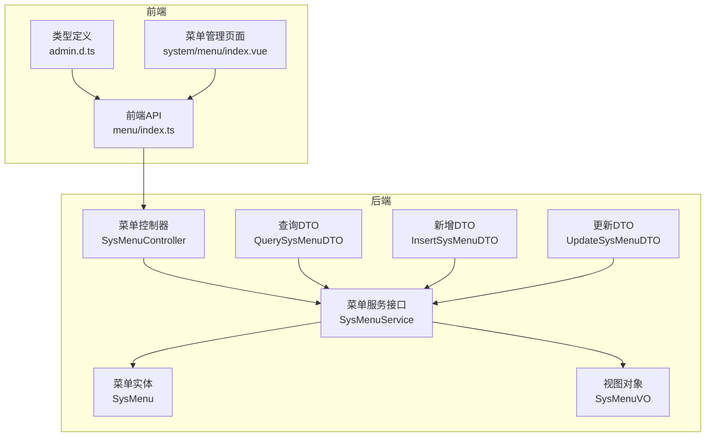
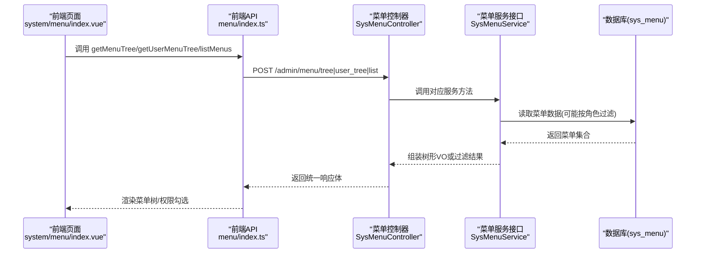
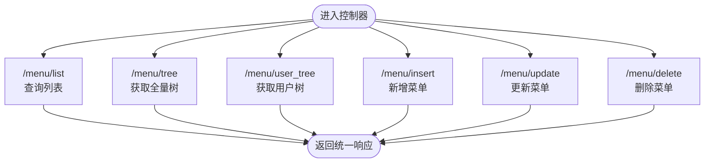
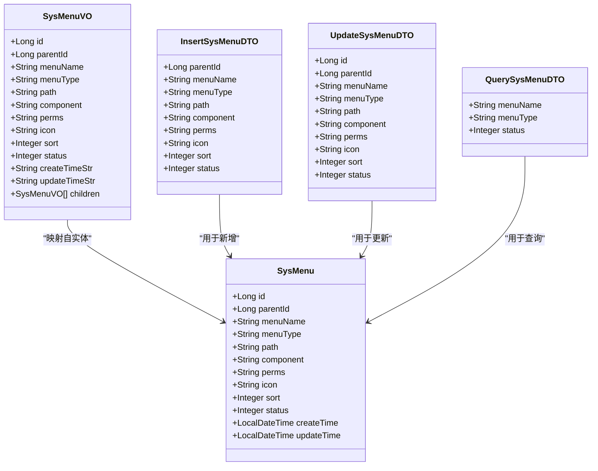
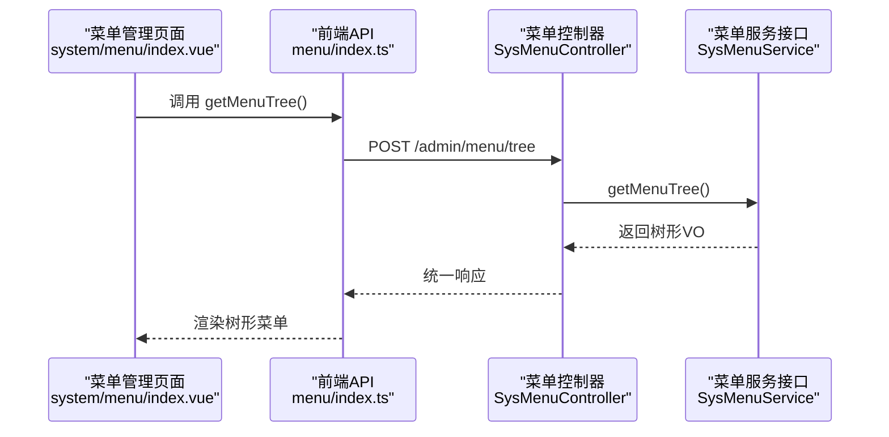
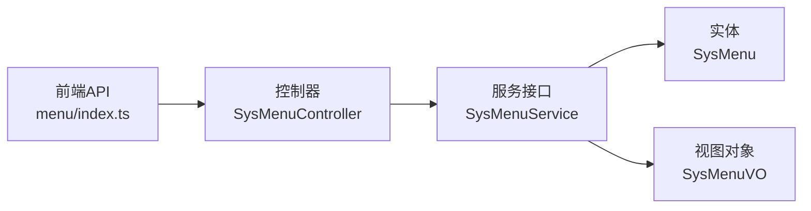

# 菜单配置管理接口

<cite>
**本文引用的文件**
- [SysMenuController.java](file://class_times_record_back/admin-service/src/main/java/com/shiroko/controller/SysMenuController.java)
- [SysMenuService.java](file://class_times_record_back/common/src/main/java/com/shiroko/service/SysMenuService.java)
- [SysMenu.java](file://class_times_record_back/common/src/main/java/com/shiroko/repository/entity/SysMenu.java)
- [QuerySysMenuDTO.java](file://class_times_record_back/common/src/main/java/com/shiroko/repository/dto/admin/QuerySysMenuDTO.java)
- [InsertSysMenuDTO.java](file://class_times_record_back/common/src/main/java/com/shiroko/repository/dto/admin/InsertSysMenuDTO.java)
- [UpdateSysMenuDTO.java](file://class_times_record_back/common/src/main/java/com/shiroko/repository/dto/admin/UpdateSysMenuDTO.java)
- [SysMenuVO.java](file://class_times_record_back/common/src/main/java/com/shiroko/repository/vo/admin/SysMenuVO.java)
- [menu/index.ts](file://class_record_admin_front/src/api/menu/index.ts)
- [admin.d.ts](file://class_record_admin_front/src/types/admin.d.ts)
- [menu/index.vue](file://class_record_admin_front/src/views/system/menu/index.vue)
</cite>

## 目录
1. [简介](#简介)
2. [项目结构](#项目结构)
3. [核心组件](#核心组件)
4. [架构总览](#架构总览)
5. [详细组件分析](#详细组件分析)
6. [依赖关系分析](#依赖关系分析)
7. [性能与缓存](#性能与缓存)
8. [故障排查指南](#故障排查指南)
9. [结论](#结论)
10. [附录：接口规范与数据格式](#附录接口规范与数据格式)

## 简介
本文件面向“动态菜单系统”的菜单配置管理，覆盖后端接口、前端调用、树形数据结构、排序规则、图标配置、权限绑定与过滤、以及前后端路由同步等关键能力。文档基于仓库中实际代码进行梳理，确保内容可追溯、可落地。

## 项目结构
围绕菜单管理的前后端关键位置如下：
- 后端控制器：提供菜单列表、树、用户树、增删改等接口
- 服务层接口：定义菜单业务方法（含按角色获取菜单）
- 实体与数据传输对象：描述菜单字段、查询条件、新增/更新参数、视图返回结构
- 前端 API 封装：统一请求路径与类型
- 前端类型定义：菜单节点类型、请求/响应结构
- 前端页面：菜单管理与权限分配页面的使用方式

图表来源
- [SysMenuController.java:1-59](file://class_times_record_back/admin-service/src/main/java/com/shiroko/controller/SysMenuController.java#L1-L59)
- [SysMenuService.java:1-29](file://class_times_record_back/common/src/main/java/com/shiroko/service/SysMenuService.java#L1-L29)
- [SysMenu.java:1-46](file://class_times_record_back/common/src/main/java/com/shiroko/repository/entity/SysMenu.java#L1-L46)
- [QuerySysMenuDTO.java:1-17](file://class_times_record_back/common/src/main/java/com/shiroko/repository/dto/admin/QuerySysMenuDTO.java#L1-L17)
- [InsertSysMenuDTO.java:1-33](file://class_times_record_back/common/src/main/java/com/shiroko/repository/dto/admin/InsertSysMenuDTO.java#L1-L33)
- [UpdateSysMenuDTO.java:1-33](file://class_times_record_back/common/src/main/java/com/shiroko/repository/dto/admin/UpdateSysMenuDTO.java#L1-L33)
- [SysMenuVO.java:1-43](file://class_times_record_back/common/src/main/java/com/shiroko/repository/vo/admin/SysMenuVO.java#L1-L43)
- [menu/index.ts:1-26](file://class_record_admin_front/src/api/menu/index.ts#L1-L26)
- [admin.d.ts:35-51](file://class_record_admin_front/src/types/admin.d.ts#L35-L51)

章节来源
- [SysMenuController.java:1-59](file://class_times_record_back/admin-service/src/main/java/com/shiroko/controller/SysMenuController.java#L1-L59)
- [menu/index.ts:1-26](file://class_record_admin_front/src/api/menu/index.ts#L1-L26)
- [admin.d.ts:35-51](file://class_record_admin_front/src/types/admin.d.ts#L35-L51)

## 核心组件
- 控制器层：暴露 /menu 相关 REST 接口，负责接收请求并委托服务层处理
- 服务层接口：定义菜单 CRUD、树构建、用户可见菜单树、按角色获取菜单等能力
- 数据模型：
  - 实体 SysMenu：持久化字段，包含层级 parentId、类型 menuType、路由 path、组件 component、权限 perms、图标 icon、排序 sort、状态 status 等
  - 查询/新增/更新 DTO：用于入参校验与约束
  - 视图对象 SysMenuVO：对外返回的树形结构，包含 children 子节点
- 前端：
  - API 封装：统一调用 /admin/menu/* 接口
  - 类型定义：菜单节点类型、请求/响应结构
  - 页面：菜单管理页对树形数据进行展示与操作

章节来源
- [SysMenuController.java:21-58](file://class_times_record_back/admin-service/src/main/java/com/shiroko/controller/SysMenuController.java#L21-L58)
- [SysMenuService.java:13-28](file://class_times_record_back/common/src/main/java/com/shiroko/service/SysMenuService.java#L13-L28)
- [SysMenu.java:13-45](file://class_times_record_back/common/src/main/java/com/shiroko/repository/entity/SysMenu.java#L13-L45)
- [QuerySysMenuDTO.java:9-16](file://class_times_record_back/common/src/main/java/com/shiroko/repository/dto/admin/QuerySysMenuDTO.java#L9-L16)
- [InsertSysMenuDTO.java:11-32](file://class_times_record_back/common/src/main/java/com/shiroko/repository/dto/admin/InsertSysMenuDTO.java#L11-L32)
- [UpdateSysMenuDTO.java:10-32](file://class_times_record_back/common/src/main/java/com/shiroko/repository/dto/admin/UpdateSysMenuDTO.java#L10-L32)
- [SysMenuVO.java:15-42](file://class_times_record_back/common/src/main/java/com/shiroko/repository/vo/admin/SysMenuVO.java#L15-L42)
- [menu/index.ts:3-25](file://class_record_admin_front/src/api/menu/index.ts#L3-L25)
- [admin.d.ts:35-51](file://class_record_admin_front/src/types/admin.d.ts#L35-L51)

## 架构总览
从前端到后端的典型调用链路如下：

图表来源
- [menu/index.ts:7-25](file://class_record_admin_front/src/api/menu/index.ts#L7-L25)
- [SysMenuController.java:28-41](file://class_times_record_back/admin-service/src/main/java/com/shiroko/controller/SysMenuController.java#L28-L41)
- [SysMenuService.java:15-27](file://class_times_record_back/common/src/main/java/com/shiroko/service/SysMenuService.java#L15-L27)

## 详细组件分析

### 控制器层：菜单管理接口
- 列表查询：POST /menu/list，支持按名称、类型、状态筛选
- 全量树：POST /menu/tree，返回完整菜单树
- 用户树：POST /menu/user_tree，返回当前用户可见菜单树（通常结合角色权限）
- 新增：POST /menu/insert，入参带必填校验
- 更新：POST /menu/update，入参需携带 id
- 删除：POST /menu/delete，传入 id

图表来源
- [SysMenuController.java:28-57](file://class_times_record_back/admin-service/src/main/java/com/shiroko/controller/SysMenuController.java#L28-L57)

章节来源
- [SysMenuController.java:21-58](file://class_times_record_back/admin-service/src/main/java/com/shiroko/controller/SysMenuController.java#L21-L58)

### 服务层接口：业务能力边界
- listMenus：根据查询条件返回菜单列表
- getMenuTree：返回完整树
- getUserMenuTree：返回用户可见树（结合角色）
- insertMenu/updateMenu/deleteMenu：基础 CRUD
- getMenusByRoleId：按角色获取菜单（供权限分配使用）

章节来源
- [SysMenuService.java:13-28](file://class_times_record_back/common/src/main/java/com/shiroko/service/SysMenuService.java#L13-L28)

### 数据模型与树形结构
- 实体字段要点：
  - 层级：parentId（根节点通常为 0 或 null，具体以实现为准）
  - 类型：menuType（前端类型为 'M' | 'C' | 'F' | 'L'）
  - 路由：path（前端路由路径）
  - 组件：component（前端组件标识）
  - 权限：perms（按钮级权限标识）
  - 图标：icon（菜单图标）
  - 排序：sort（同级排序权重）
  - 状态：status（启用/禁用）
- 视图对象：
  - 包含 children 子节点，形成树形结构
  - 包含创建/更新时间字符串字段，便于前端展示

图表来源
- [SysMenu.java:13-45](file://class_times_record_back/common/src/main/java/com/shiroko/repository/entity/SysMenu.java#L13-L45)
- [QuerySysMenuDTO.java:9-16](file://class_times_record_back/common/src/main/java/com/shiroko/repository/dto/admin/QuerySysMenuDTO.java#L9-L16)
- [InsertSysMenuDTO.java:11-32](file://class_times_record_back/common/src/main/java/com/shiroko/repository/dto/admin/InsertSysMenuDTO.java#L11-L32)
- [UpdateSysMenuDTO.java:10-32](file://class_times_record_back/common/src/main/java/com/shiroko/repository/dto/admin/UpdateSysMenuDTO.java#L10-L32)
- [SysMenuVO.java:15-42](file://class_times_record_back/common/src/main/java/com/shiroko/repository/vo/admin/SysMenuVO.java#L15-L42)

章节来源
- [SysMenu.java:13-45](file://class_times_record_back/common/src/main/java/com/shiroko/repository/entity/SysMenu.java#L13-L45)
- [SysMenuVO.java:15-42](file://class_times_record_back/common/src/main/java/com/shiroko/repository/vo/admin/SysMenuVO.java#L15-L42)
- [admin.d.ts:35-51](file://class_record_admin_front/src/types/admin.d.ts#L35-L51)

### 前端集成与路由同步
- 前端 API 封装：
  - getMenuList/getMenuTree/getUserMenuTree/insertMenu/updateMenu/deleteMenu 分别对应后端 /admin/menu/* 接口
- 类型定义：
  - SysMenuResponse 包含 children 递归结构，menuType 为枚举字符
- 页面使用：
  - 菜单管理页面加载树数据并进行增删改查；权限页面基于树进行勾选授权

图表来源
- [menu/index.ts:7-9](file://class_record_admin_front/src/api/menu/index.ts#L7-L9)
- [SysMenuController.java:33-36](file://class_times_record_back/admin-service/src/main/java/com/shiroko/controller/SysMenuController.java#L33-L36)
- [SysMenuService.java:17](file://class_times_record_back/common/src/main/java/com/shiroko/service/SysMenuService.java#L17)
- [menu/index.vue:102-119](file://class_record_admin_front/src/views/system/menu/index.vue#L102-L119)

章节来源
- [menu/index.ts:3-25](file://class_record_admin_front/src/api/menu/index.ts#L3-L25)
- [admin.d.ts:133-162](file://class_record_admin_front/src/types/admin.d.ts#L133-L162)
- [menu/index.vue:102-119](file://class_record_admin_front/src/views/system/menu/index.vue#L102-L119)

## 依赖关系分析
- 控制器依赖服务接口，不直接访问数据层
- 服务接口定义清晰的能力边界，便于后续实现扩展
- 前端通过统一的 API 模块与后端交互，类型定义保证前后端契约一致

图表来源
- [menu/index.ts:3-25](file://class_record_admin_front/src/api/menu/index.ts#L3-L25)
- [SysMenuController.java:21-58](file://class_times_record_back/admin-service/src/main/java/com/shiroko/controller/SysMenuController.java#L21-L58)
- [SysMenuService.java:13-28](file://class_times_record_back/common/src/main/java/com/shiroko/service/SysMenuService.java#L13-L28)
- [SysMenu.java:13-45](file://class_times_record_back/common/src/main/java/com/shiroko/repository/entity/SysMenu.java#L13-L45)
- [SysMenuVO.java:15-42](file://class_times_record_back/common/src/main/java/com/shiroko/repository/vo/admin/SysMenuVO.java#L15-L42)

章节来源
- [SysMenuController.java:21-58](file://class_times_record_back/admin-service/src/main/java/com/shiroko/controller/SysMenuController.java#L21-L58)
- [SysMenuService.java:13-28](file://class_times_record_back/common/src/main/java/com/shiroko/service/SysMenuService.java#L13-L28)

## 性能与缓存
- 树构建复杂度：若采用递归拼接，时间复杂度近似 O(n)，空间复杂度取决于树深度
- 建议优化：
  - 在内存中将扁平列表转换为 Map，再一次性挂接 children，降低重复查找
  - 对高频读取的全量树和用户树增加缓存（如 Redis），设置合理过期策略
  - 列表查询支持分页与索引（menuName、menuType、status）
- 前端优化：
  - 用户登录后仅拉取 user_tree，避免全量树传输
  - 对树数据进行去重与懒加载，减少首屏渲染压力

[本节为通用性能建议，不直接分析具体文件]

## 故障排查指南
- 新增失败：检查必填字段校验（如菜单名称、类型），确认 parentId 合法
- 更新失败：确认 id 存在且未被删除，注意父节点变更是否导致循环引用
- 删除失败：检查是否存在子节点或关联权限，必要时先清理子节点或权限绑定
- 用户树为空：确认用户角色是否正确绑定菜单，perms 与按钮权限是否匹配
- 前端显示异常：核对 menuType 是否为预期值，children 是否为空数组而非 null

章节来源
- [InsertSysMenuDTO.java:15-19](file://class_times_record_back/common/src/main/java/com/shiroko/repository/dto/admin/InsertSysMenuDTO.java#L15-L19)
- [UpdateSysMenuDTO.java:12-13](file://class_times_record_back/common/src/main/java/com/shiroko/repository/dto/admin/UpdateSysMenuDTO.java#L12-L13)
- [SysMenuController.java:43-57](file://class_times_record_back/admin-service/src/main/java/com/shiroko/controller/SysMenuController.java#L43-L57)

## 结论
该菜单配置管理系统具备清晰的层次结构与完善的 CRUD 能力，支持树形展示、用户可见菜单树与按角色获取菜单。通过规范的 DTO/VO 设计与前端类型契约，前后端协作顺畅。建议在服务层实现中引入缓存与高效树构建算法，进一步提升性能与稳定性。

[本节为总结性内容，不直接分析具体文件]

## 附录：接口规范与数据格式

### 接口清单
- 列表查询
  - 方法：POST
  - 路径：/admin/menu/list
  - 请求体：GetMenuListRequest（menuName、menuType、status）
  - 响应：ApiResponse<SysMenuResponse[]>
- 全量树
  - 方法：POST
  - 路径：/admin/menu/tree
  - 请求体：GetMenuListRequest（可选）
  - 响应：ApiResponse<SysMenuResponse[]>
- 用户树
  - 方法：POST
  - 路径：/admin/menu/user_tree
  - 请求体：空
  - 响应：ApiResponse<SysMenuResponse[]>
- 新增
  - 方法：POST
  - 路径：/admin/menu/insert
  - 请求体：InsertMenuRequest（menuName、menuType 必填）
  - 响应：ApiResponse<void>
- 更新
  - 方法：POST
  - 路径：/admin/menu/update
  - 请求体：UpdateMenuRequest（id 必填）
  - 响应：ApiResponse<void>
- 删除
  - 方法：POST
  - 路径：/admin/menu/delete
  - 请求体：{ id: number }
  - 响应：ApiResponse<void>

章节来源
- [menu/index.ts:3-25](file://class_record_admin_front/src/api/menu/index.ts#L3-L25)
- [admin.d.ts:133-162](file://class_record_admin_front/src/types/admin.d.ts#L133-L162)

### 树形数据格式与排序规则
- 树形结构：每个节点包含 children 子节点数组，形成多级嵌套
- 排序规则：同级节点按 sort 升序排列
- 图标配置：icon 字段用于菜单图标展示
- 权限标识：perms 字段用于按钮级权限控制

章节来源
- [SysMenuVO.java:31-41](file://class_times_record_back/common/src/main/java/com/shiroko/repository/vo/admin/SysMenuVO.java#L31-L41)
- [admin.d.ts:35-51](file://class_record_admin_front/src/types/admin.d.ts#L35-L51)

### 菜单与角色的关联与权限控制逻辑
- 角色-菜单关联：通过角色 ID 获取其绑定的菜单集合（getMenusByRoleId）
- 用户可见菜单树：根据当前用户角色过滤得到用户树（getUserMenuTree）
- 权限过滤：前端依据 perms 控制按钮显隐与操作权限

章节来源
- [SysMenuService.java:25-27](file://class_times_record_back/common/src/main/java/com/shiroko/service/SysMenuService.java#L25-L27)
- [admin.d.ts:35-51](file://class_record_admin_front/src/types/admin.d.ts#L35-L51)

### 菜单层级关系设计
- 层级字段：parentId 表示父节点，支持多级菜单
- 类型字段：menuType 区分目录、菜单、按钮、外链等
- 路由字段：path 与 component 配合实现动态路由生成

章节来源
- [SysMenu.java:20-28](file://class_times_record_back/common/src/main/java/com/shiroko/repository/entity/SysMenu.java#L20-L28)
- [admin.d.ts:35-51](file://class_record_admin_front/src/types/admin.d.ts#L35-L51)