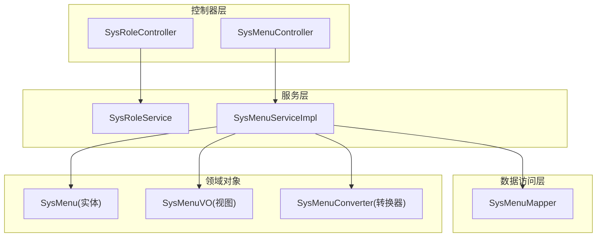
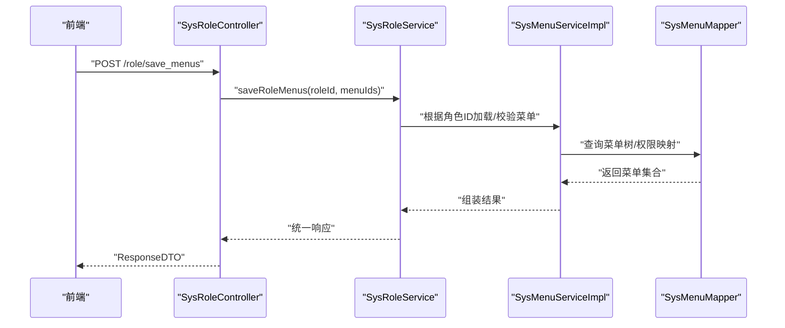
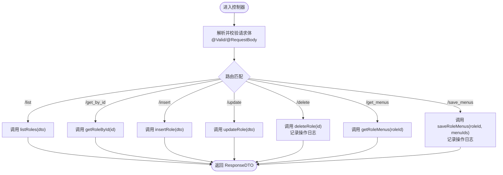
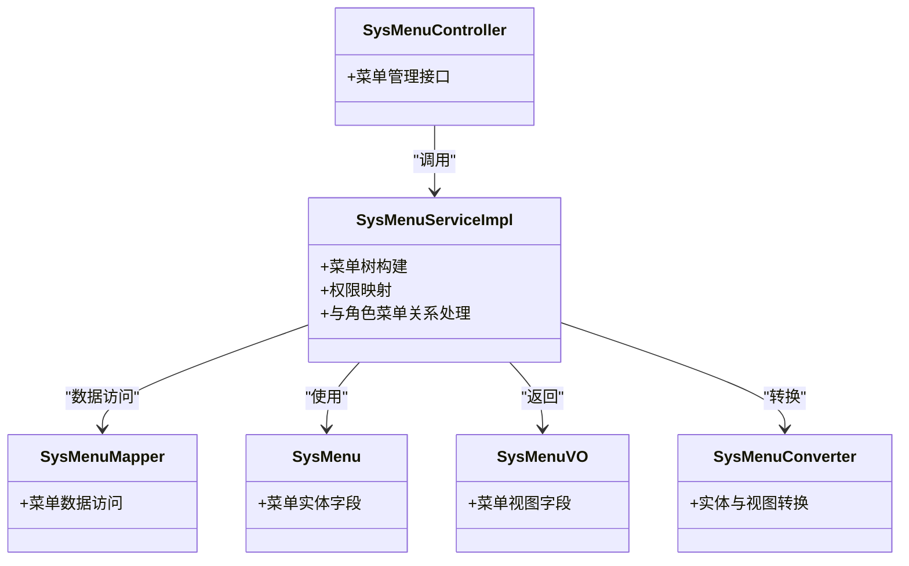
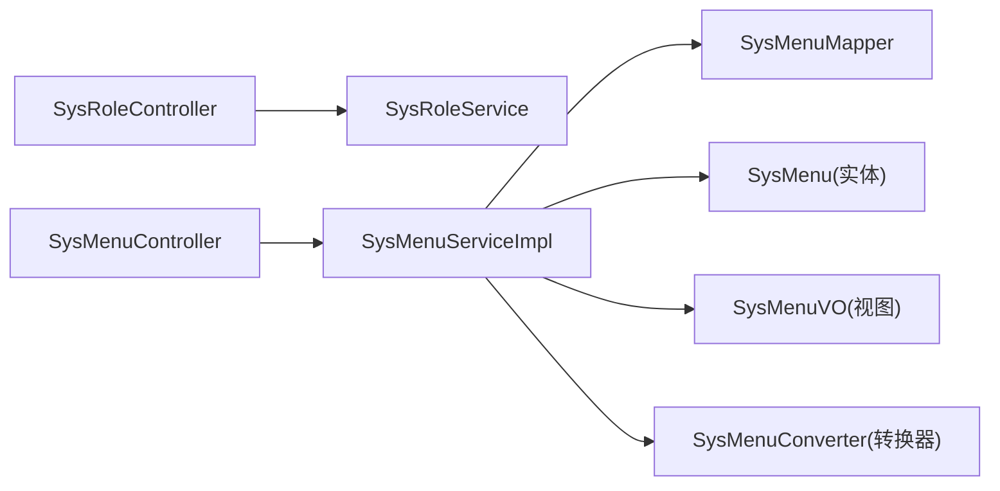

# 角色权限管理接口

<cite>
**本文引用的文件**
- [SysRoleController.java](file://class_times_record_back/admin-service/src/main/java/com/shiroko/controller/SysRoleController.java)
- [SysRoleService.java](file://class_times_record_back/common/src/main/java/com/shiroko/service/SysRoleService.java)
- [SysMenuController.java](file://class_times_record_back/admin-service/src/main/java/com/shiroko/controller/SysMenuController.java)
- [SysMenuServiceImpl.java](file://class_times_record_back/admin-service/src/main/java/com/shiroko/service/impl/SysMenuServiceImpl.java)
- [SysMenuMapper.java](file://class_times_record_back/admin-service/src/main/java/com/shiroko/mapper/SysMenuMapper.java)
- [SysMenu.java](file://class_times_record_back/common/src/main/java/com/shiroko/repository/entity/SysMenu.java)
- [SysMenuVO.java](file://class_times_record_back/common/src/main/java/com/shiroko/repository/vo/admin/SysMenuVO.java)
- [SysMenuConverter.java](file://class_times_record_back/common/src/main/java/com/shiroko/converter/SysMenuConverter.java)
- [SysRoleControllerApiTest.java](file://class_times_record_back/admin-service/src/test/java/com/shiroko/controller/SysRoleControllerApiTest.java)
</cite>

## 目录
1. [简介](#简介)
2. [项目结构](#项目结构)
3. [核心组件](#核心组件)
4. [架构总览](#架构总览)
5. [详细组件分析](#详细组件分析)
6. [依赖关系分析](#依赖关系分析)
7. [性能考虑](#性能考虑)
8. [故障排查指南](#故障排查指南)
9. [结论](#结论)
10. [附录](#附录)

## 简介
本文件面向“角色权限管理”相关接口的后端实现，聚焦 RBAC（基于角色的访问控制）模型中的角色管理能力。文档覆盖：
- 角色基础操作：创建、修改、删除、查询
- 角色与菜单权限的关联：获取与保存
- 参数校验规则、响应格式、日志记录
- 与企业级能力相关的扩展建议：批量分配、角色复制、权限继承、层级结构与合并策略
- 安全与最佳实践建议

说明：
- 当前仓库中可验证的角色管理入口为 SysRoleController；其服务层接口定义位于 SysRoleService。
- 菜单实体与 VO、转换器、控制器与服务实现用于支撑“角色菜单权限”的读取与保存流程。
- 数据权限、权限继承、角色层级等高级特性在现有代码中未直接体现，本节提供概念性设计与落地建议。

## 项目结构
围绕角色与菜单权限的核心文件分布如下：
- 控制器层：角色与菜单的 HTTP 接口
- 服务层：业务逻辑编排（角色、菜单）
- 数据访问层：MyBatis Mapper
- 领域对象：实体、视图对象、转换器

图表来源
- [SysRoleController.java:1-69](file://class_times_record_back/admin-service/src/main/java/com/shiroko/controller/SysRoleController.java#L1-L69)
- [SysMenuController.java](file://class_times_record_back/admin-service/src/main/java/com/shiroko/controller/SysMenuController.java)
- [SysMenuServiceImpl.java](file://class_times_record_back/admin-service/src/main/java/com/shiroko/service/impl/SysMenuServiceImpl.java)
- [SysMenuMapper.java](file://class_times_record_back/admin-service/src/main/java/com/shiroko/mapper/SysMenuMapper.java)
- [SysMenu.java](file://class_times_record_back/common/src/main/java/com/shiroko/repository/entity/SysMenu.java)
- [SysMenuVO.java](file://class_times_record_back/common/src/main/java/com/shiroko/repository/vo/admin/SysMenuVO.java)
- [SysMenuConverter.java](file://class_times_record_back/common/src/main/java/com/shiroko/converter/SysMenuConverter.java)

章节来源
- [SysRoleController.java:1-69](file://class_times_record_back/admin-service/src/main/java/com/shiroko/controller/SysRoleController.java#L1-L69)
- [SysMenuController.java](file://class_times_record_back/admin-service/src/main/java/com/shiroko/controller/SysMenuController.java)
- [SysMenuServiceImpl.java](file://class_times_record_back/admin-service/src/main/java/com/shiroko/service/impl/SysMenuServiceImpl.java)
- [SysMenuMapper.java](file://class_times_record_back/admin-service/src/main/java/com/shiroko/mapper/SysMenuMapper.java)
- [SysMenu.java](file://class_times_record_back/common/src/main/java/com/shiroko/repository/entity/SysMenu.java)
- [SysMenuVO.java](file://class_times_record_back/common/src/main/java/com/shiroko/repository/vo/admin/SysMenuVO.java)
- [SysMenuConverter.java](file://class_times_record_back/common/src/main/java/com/shiroko/converter/SysMenuConverter.java)

## 核心组件
- SysRoleController：暴露角色管理的 REST 接口，包含列表、详情、新增、更新、删除、获取菜单、保存菜单权限等能力。
- SysRoleService：角色服务的对外接口定义，承载具体业务编排（由实现类完成）。
- SysMenuController / SysMenuServiceImpl / SysMenuMapper：菜单管理与角色菜单权限的数据流转支撑。
- SysMenu / SysMenuVO / SysMenuConverter：菜单实体、视图对象及转换工具。

章节来源
- [SysRoleController.java:1-69](file://class_times_record_back/admin-service/src/main/java/com/shiroko/controller/SysRoleController.java#L1-L69)
- [SysRoleService.java](file://class_times_record_back/common/src/main/java/com/shiroko/service/SysRoleService.java)
- [SysMenuController.java](file://class_times_record_back/admin-service/src/main/java/com/shiroko/controller/SysMenuController.java)
- [SysMenuServiceImpl.java](file://class_times_record_back/admin-service/src/main/java/com/shiroko/service/impl/SysMenuServiceImpl.java)
- [SysMenuMapper.java](file://class_times_record_back/admin-service/src/main/java/com/shiroko/mapper/SysMenuMapper.java)
- [SysMenu.java](file://class_times_record_back/common/src/main/java/com/shiroko/repository/entity/SysMenu.java)
- [SysMenuVO.java](file://class_times_record_back/common/src/main/java/com/shiroko/repository/vo/admin/SysMenuVO.java)
- [SysMenuConverter.java](file://class_times_record_back/common/src/main/java/com/shiroko/converter/SysMenuConverter.java)

## 架构总览
角色与菜单权限的整体调用链路如下：前端通过 SysRoleController 发起请求，控制器委托 SysRoleService 执行业务；涉及菜单时，可能进一步调用菜单服务与数据访问层。

图表来源
- [SysRoleController.java:59-67](file://class_times_record_back/admin-service/src/main/java/com/shiroko/controller/SysRoleController.java#L59-L67)
- [SysRoleService.java](file://class_times_record_back/common/src/main/java/com/shiroko/service/SysRoleService.java)
- [SysMenuServiceImpl.java](file://class_times_record_back/admin-service/src/main/java/com/shiroko/service/impl/SysMenuServiceImpl.java)
- [SysMenuMapper.java](file://class_times_record_back/admin-service/src/main/java/com/shiroko/mapper/SysMenuMapper.java)

## 详细组件分析

### 角色管理接口（SysRoleController）
- 路由前缀：/role
- 主要端点
  - POST /role/list：分页或条件查询角色列表
  - POST /role/get_by_id：按 ID 查询角色详情
  - POST /role/insert：新增角色
  - POST /role/update：更新角色
  - POST /role/delete：删除角色（带操作日志注解）
  - POST /role/get_menus：获取某角色的已授权菜单
  - POST /role/save_menus：保存角色的菜单权限（支持批量）

- 请求体约定
  - get_by_id、delete、get_menus、save_menus 使用 Map 传参，键名示例：id、roleId、menuIds
  - insert 使用 InsertSysRoleDTO，update 使用 UpdateSysRoleDTO，list 使用 QuerySysRoleDTO
  - save_menus 的 menuIds 为整数数组，内部会转换为 Long 列表后交由服务层处理

- 响应格式
  - 统一包装 ResponseDTO<T>，成功码 200，失败码非 200

- 操作日志
  - delete 与 save_menus 使用 @OperationLog 注解记录操作日志

- 参数校验
  - insert 与 update 使用 @Valid 触发 Bean Validation 校验

图表来源
- [SysRoleController.java:28-67](file://class_times_record_back/admin-service/src/main/java/com/shiroko/controller/SysRoleController.java#L28-L67)

章节来源
- [SysRoleController.java:1-69](file://class_times_record_back/admin-service/src/main/java/com/shiroko/controller/SysRoleController.java#L1-L69)
- [SysRoleControllerApiTest.java:53-166](file://class_times_record_back/admin-service/src/test/java/com/shiroko/controller/SysRoleControllerApiTest.java#L53-L166)

### 角色服务接口（SysRoleService）
- 职责：定义角色相关业务能力（CRUD、菜单权限读写），由具体实现类完成事务与复杂逻辑编排。
- 典型方法（从控制器调用推断）
  - listRoles(QuerySysRoleDTO) -> ResponseDTO<Map<String,Object>>
  - getRoleById(Long) -> ResponseDTO<SysRoleVO>
  - insertRole(InsertSysRoleDTO) -> ResponseDTO<SysRoleVO>
  - updateRole(UpdateSysRoleDTO) -> ResponseDTO<SysRoleVO>
  - deleteRole(Long) -> ResponseDTO<String>
  - getRoleMenus(Long roleId) -> ResponseDTO<List<SysMenu>>
  - saveRoleMenus(Long roleId, List<Long> menuIds) -> ResponseDTO<String>

章节来源
- [SysRoleService.java](file://class_times_record_back/common/src/main/java/com/shiroko/service/SysRoleService.java)

### 菜单权限支撑（SysMenu 系列）
- SysMenuController：提供菜单管理相关接口（如菜单树、菜单项增删改查等），供角色授权界面使用。
- SysMenuServiceImpl：菜单业务实现，负责菜单树构建、权限映射、与角色菜单关系的处理。
- SysMenuMapper：数据访问层，执行 SQL 查询菜单数据。
- SysMenu / SysMenuVO / SysMenuConverter：实体、视图对象与转换工具，用于在不同层之间传递数据。

图表来源
- [SysMenuController.java](file://class_times_record_back/admin-service/src/main/java/com/shiroko/controller/SysMenuController.java)
- [SysMenuServiceImpl.java](file://class_times_record_back/admin-service/src/main/java/com/shiroko/service/impl/SysMenuServiceImpl.java)
- [SysMenuMapper.java](file://class_times_record_back/admin-service/src/main/java/com/shiroko/mapper/SysMenuMapper.java)
- [SysMenu.java](file://class_times_record_back/common/src/main/java/com/shiroko/repository/entity/SysMenu.java)
- [SysMenuVO.java](file://class_times_record_back/common/src/main/java/com/shiroko/repository/vo/admin/SysMenuVO.java)
- [SysMenuConverter.java](file://class_times_record_back/common/src/main/java/com/shiroko/converter/SysMenuConverter.java)

章节来源
- [SysMenuController.java](file://class_times_record_back/admin-service/src/main/java/com/shiroko/controller/SysMenuController.java)
- [SysMenuServiceImpl.java](file://class_times_record_back/admin-service/src/main/java/com/shiroko/service/impl/SysMenuServiceImpl.java)
- [SysMenuMapper.java](file://class_times_record_back/admin-service/src/main/java/com/shiroko/mapper/SysMenuMapper.java)
- [SysMenu.java](file://class_times_record_back/common/src/main/java/com/shiroko/repository/entity/SysMenu.java)
- [SysMenuVO.java](file://class_times_record_back/common/src/main/java/com/shiroko/repository/vo/admin/SysMenuVO.java)
- [SysMenuConverter.java](file://class_times_record_back/common/src/main/java/com/shiroko/converter/SysMenuConverter.java)

### 接口契约与参数校验规则
- 通用响应
  - 类型：ResponseDTO<T>
  - 成功状态码：200
- 角色列表
  - 路径：POST /role/list
  - 请求体：QuerySysRoleDTO（字段以 DTO 定义为准）
  - 响应：{ list, total } 的结构化分页信息
- 角色详情
  - 路径：POST /role/get_by_id
  - 请求体：Map{id: Long}
  - 响应：SysRoleVO
- 新增角色
  - 路径：POST /role/insert
  - 请求体：InsertSysRoleDTO（受 @Valid 校验）
  - 响应：SysRoleVO
- 更新角色
  - 路径：POST /role/update
  - 请求体：UpdateSysRoleDTO（受 @Valid 校验）
  - 响应：SysRoleVO
- 删除角色
  - 路径：POST /role/delete
  - 请求体：Map{id: Long}
  - 响应：String（提示消息）
  - 日志：@OperationLog("删除角色")
- 获取角色菜单
  - 路径：POST /role/get_menus
  - 请求体：Map{roleId: Long}
  - 响应：List<SysMenu>
- 保存角色菜单权限
  - 路径：POST /role/save_menus
  - 请求体：Map{roleId: Number, menuIds: Integer[]}
  - 行为：将 menuIds 转为 Long 列表后交由服务层持久化
  - 日志：@OperationLog("保存角色菜单权限")

章节来源
- [SysRoleController.java:28-67](file://class_times_record_back/admin-service/src/main/java/com/shiroko/controller/SysRoleController.java#L28-L67)
- [SysRoleControllerApiTest.java:53-166](file://class_times_record_back/admin-service/src/test/java/com/shiroko/controller/SysRoleControllerApiTest.java#L53-L166)

### 角色与权限的关联机制
- 菜单权限
  - 通过 /role/get_menus 与 /role/save_menus 完成角色与菜单的关联读取与写入。
  - 保存时支持批量传入 menuIds，内部进行类型转换与持久化。
- 数据权限
  - 当前代码未直接暴露数据权限接口。建议在 Service 层结合租户/机构维度进行数据范围过滤，或在查询时注入数据权限拦截器。
- 权限继承与层级
  - 当前未实现显式的角色层级与继承。可在角色表增加 parent_role_id 字段，并在权限计算时自顶向下合并权限集合。

章节来源
- [SysRoleController.java:54-67](file://class_times_record_back/admin-service/src/main/java/com/shiroko/controller/SysRoleController.java#L54-L67)

### 企业级功能建议（概念设计）
- 批量角色分配
  - 新增接口：POST /role/batch_assign_users
  - 请求体：{ roleIds: Long[], userIds: Long[] }
  - 行为：批量建立用户-角色关系，支持幂等与回滚
- 角色复制
  - 新增接口：POST /role/copy
  - 请求体：{ sourceRoleId: Long, targetRoleName: String, targetRoleKey: String }
  - 行为：复制角色基本信息与菜单权限，必要时复制自定义数据权限模板
- 权限继承与合并策略
  - 数据结构：角色表增加 parent_role_id
  - 合并策略：自上而下合并，子角色显式拒绝优先于父角色允许；最终权限集 = 子角色 ∪ (父角色 ∖ 子角色拒绝)
- 操作审计
  - 对关键写操作（新增/更新/删除/授权）统一打点，记录操作人、时间、IP、变更前后快照

[本节为概念性设计，不直接对应具体源码]

## 依赖关系分析
- 控制器到服务：SysRoleController 依赖 SysRoleService
- 菜单服务到数据访问：SysMenuServiceImpl 依赖 SysMenuMapper
- 领域对象：SysMenuServiceImpl 使用 SysMenu、SysMenuVO 并通过 SysMenuConverter 进行转换

图表来源
- [SysRoleController.java:1-69](file://class_times_record_back/admin-service/src/main/java/com/shiroko/controller/SysRoleController.java#L1-L69)
- [SysMenuController.java](file://class_times_record_back/admin-service/src/main/java/com/shiroko/controller/SysMenuController.java)
- [SysMenuServiceImpl.java](file://class_times_record_back/admin-service/src/main/java/com/shiroko/service/impl/SysMenuServiceImpl.java)
- [SysMenuMapper.java](file://class_times_record_back/admin-service/src/main/java/com/shiroko/mapper/SysMenuMapper.java)
- [SysMenu.java](file://class_times_record_back/common/src/main/java/com/shiroko/repository/entity/SysMenu.java)
- [SysMenuVO.java](file://class_times_record_back/common/src/main/java/com/shiroko/repository/vo/admin/SysMenuVO.java)
- [SysMenuConverter.java](file://class_times_record_back/common/src/main/java/com/shiroko/converter/SysMenuConverter.java)

章节来源
- [SysRoleController.java:1-69](file://class_times_record_back/admin-service/src/main/java/com/shiroko/controller/SysRoleController.java#L1-L69)
- [SysMenuServiceImpl.java](file://class_times_record_back/admin-service/src/main/java/com/shiroko/service/impl/SysMenuServiceImpl.java)
- [SysMenuMapper.java](file://class_times_record_back/admin-service/src/main/java/com/shiroko/mapper/SysMenuMapper.java)
- [SysMenu.java](file://class_times_record_back/common/src/main/java/com/shiroko/repository/entity/SysMenu.java)
- [SysMenuVO.java](file://class_times_record_back/common/src/main/java/com/shiroko/repository/vo/admin/SysMenuVO.java)
- [SysMenuConverter.java](file://class_times_record_back/common/src/main/java/com/shiroko/converter/SysMenuConverter.java)

## 性能考虑
- 菜单树构建
  - 避免 N+1 查询：一次性拉取菜单与关系，内存中构建树
  - 缓存热点菜单树：结合 Redis 缓存，设置合理过期策略
- 批量授权
  - 使用批量插入/更新减少往返次数
  - 大事务拆分为小批次，降低锁竞争与回滚成本
- 分页与索引
  - 角色列表查询需分页，确保常用筛选字段有合适索引
- 序列化与转换
  - 合理使用转换器，避免在循环中进行重复转换

[本节为通用性能建议，不直接对应具体源码]

## 故障排查指南
- 常见错误定位
  - 参数缺失或类型不匹配：检查请求体键名与类型（例如 roleId 是否为数字、menuIds 是否为整数数组）
  - 校验失败：查看 @Valid 触发的 Bean Validation 错误信息
  - 权限不足：确认当前登录用户是否具备系统管理员或相应角色
- 日志与断点
  - 关注 @OperationLog 标注的写操作日志
  - 在 Controller 与 Service 边界加断点，观察入参与返回值
- 单元测试参考
  - 使用 SysRoleControllerApiTest 作为接口行为参考，快速复现问题场景

章节来源
- [SysRoleControllerApiTest.java:53-166](file://class_times_record_back/admin-service/src/test/java/com/shiroko/controller/SysRoleControllerApiTest.java#L53-L166)

## 结论
- 当前仓库提供了完整的角色 CRUD 与菜单权限绑定接口，满足 RBAC 的基础能力。
- 数据权限、角色层级与继承等企业级特性可通过扩展服务层与数据模型逐步完善。
- 建议在生产环境强化参数校验、操作审计与缓存策略，保障安全性与性能。

[本节为总结性内容，不直接对应具体源码]

## 附录
- 术语
  - RBAC：基于角色的访问控制
  - 菜单权限：控制页面/按钮/功能的可见性与可操作性
  - 数据权限：控制数据行/列的可见范围（如按机构、部门隔离）
- 参考测试用例
  - SysRoleControllerApiTest 覆盖了各接口的正常路径与响应码

[本节为补充信息，不直接对应具体源码]