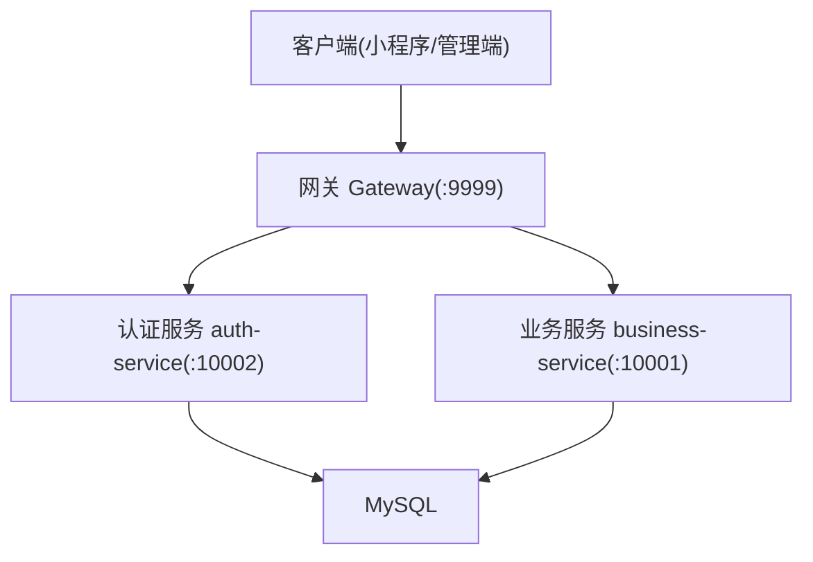
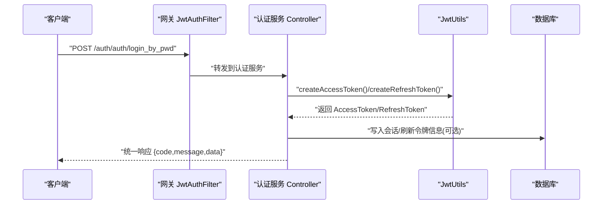
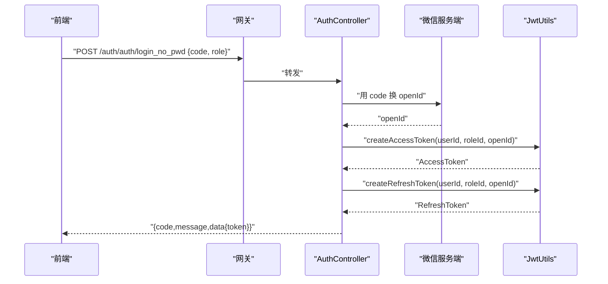
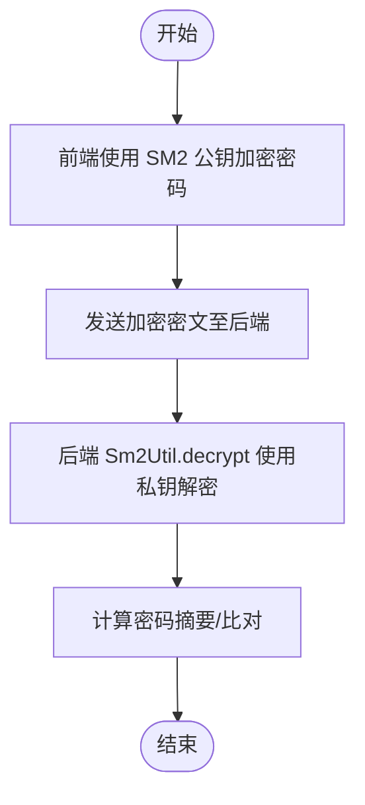
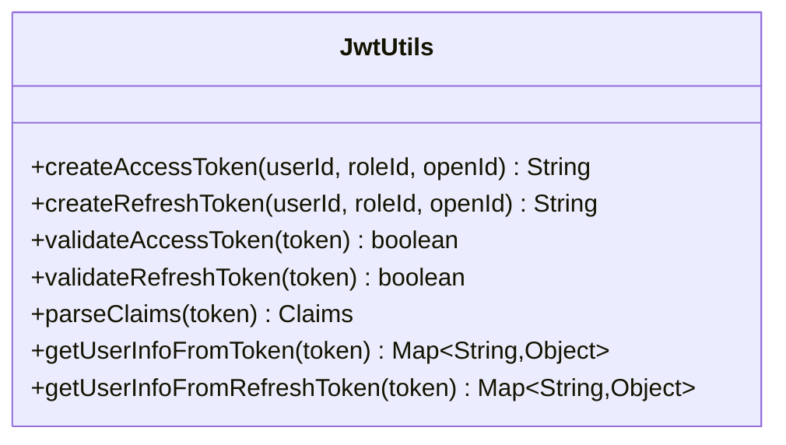
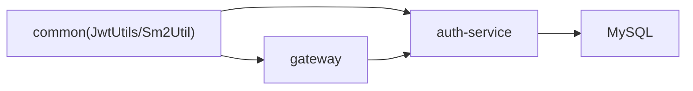

# 认证接口

<cite>
**本文引用的文件**   
- [架构设计文档](file://class_times_record_back/docs/architecture.md)
- [API 测试文档](file://class_times_record_back/docs/api-test.md)
- [JwtUtils.java](file://class_times_record_back/common/src/main/java/com/shiroko/util/JwtUtils.java)
- [Sm2Util.java](file://class_times_record_back/common/src/main/java/com/shiroko/util/Sm2Util.java)
</cite>

## 目录
1. [简介](#简介)
2. [项目结构](#项目结构)
3. [核心组件](#核心组件)
4. [架构总览](#架构总览)
5. [详细组件分析](#详细组件分析)
6. [依赖分析](#依赖分析)
7. [性能考虑](#性能考虑)
8. [故障排查指南](#故障排查指南)
9. [结论](#结论)
10. [附录](#附录)

## 简介
本文件聚焦于“课时记录系统”的认证相关能力，覆盖以下要点：
- 认证域 API 清单与说明（登录、注册、Token 刷新、登出等）
- SM2 国密算法在敏感数据传输中的使用方式
- JWT Token 的生成与校验流程（双 Token：AccessToken + RefreshToken）
- 统一响应格式、错误码与异常处理机制
- 前端集成建议（登录状态管理、Token 自动刷新）
- 多角色认证体系（管理员、教师、家长）的实现原理与使用方式

## 项目结构
后端采用 Spring Cloud Alibaba 微服务架构，认证授权集中在 auth-service，通过 Gateway 统一入口进行路由分发与安全校验。认证相关接口统一以 /auth/** 前缀对外暴露。

图表来源
- [架构设计文档:47-65](file://class_times_record_back/docs/architecture.md#L47-L65)

章节来源
- [架构设计文档:1-90](file://class_times_record_back/docs/architecture.md#L1-L90)

## 核心组件
- 认证控制器（AuthController）：提供 OpenId 获取、免密登录、密码登录、Token 登录、注册、刷新、登出等接口。
- 菜单控制器（MenuController）：按角色返回菜单配置。
- 权限记录控制器（PermissionRecordController）：课程记录与用户权限绑定与查询。
- 安全过滤器与拦截器：
  - 网关层 JwtAuthFilter：公开路径放行、JWT 校验并注入 X-User-Id/X-User-Role。
  - 服务层 RequestCachingFilter/GatewayUserFilter/UserInterceptor/JwtInterceptor/SignInterceptor：二次校验、签名校验、上下文注入。
- 工具类：
  - JwtUtils：双 Token 签发与校验、Claims 解析。
  - Sm2Util：SM2 解密（配合前端 sm-crypto 加密）。

章节来源
- [架构设计文档:92-186](file://class_times_record_back/docs/architecture.md#L92-L186)
- [架构设计文档:473-524](file://class_times_record_back/docs/architecture.md#L473-L524)
- [JwtUtils.java:1-213](file://class_times_record_back/common/src/main/java/com/shiroko/util/JwtUtils.java#L1-L213)
- [Sm2Util.java:1-61](file://class_times_record_back/common/src/main/java/com/shiroko/util/Sm2Util.java#L1-L61)

## 架构总览
两级防护体系：
- Level 1：Gateway JwtAuthFilter 全局过滤，对公开路径放行，其余路径校验 Bearer Token，提取 userId/roleId 并注入请求头。
- Level 2：服务层拦截器链完成请求体缓存、用户上下文注入、JWT 二次校验与 SM3 签名校验。

图表来源
- [架构设计文档:92-147](file://class_times_record_back/docs/architecture.md#L92-L147)
- [架构设计文档:473-524](file://class_times_record_back/docs/architecture.md#L473-L524)
- [JwtUtils.java:106-149](file://class_times_record_back/common/src/main/java/com/shiroko/util/JwtUtils.java#L106-L149)

## 详细组件分析

### 认证接口清单与规范
- 统一风格：全部使用 POST + @RequestBody；统一响应格式为 {code, message, data}。
- 公开路径（无需携带 Token）：登录、注册、OpenId 获取、刷新等。
- 受保护路径：除公开路径外的所有接口需携带有效 AccessToken。

认证接口列表（Gateway 路径 → 服务路径）：
- POST /auth/auth/get_open_id → /auth/get_open_id（公开）
- POST /auth/auth/register → /auth/register（公开）
- POST /auth/auth/login_no_pwd → /auth/login_no_pwd（公开）
- POST /auth/auth/login_by_pwd → /auth/login_by_pwd（公开）
- POST /auth/auth/login_by_token → /auth/login_by_token（公开）
- POST /auth/auth/refresh → /auth/refresh（公开）
- POST /auth/auth/logout → /auth/logout（受保护）
- POST /auth/auth/get_user_auth_info_by_teacher_id → /auth/get_user_auth_info_by_teacher_id（受保护）

章节来源
- [架构设计文档:473-524](file://class_times_record_back/docs/architecture.md#L473-L524)
- [API 测试文档:58-74](file://class_times_record_back/docs/api-test.md#L58-L74)

### 登录与注册流程

#### 微信免密登录（login_no_pwd）
- 方法：POST
- 路径：/auth/auth/login_no_pwd
- 公开：是
- 输入参数（示例字段）：code、role
- 输出数据：包含 AccessToken、RefreshToken 及必要用户信息
- 关键步骤：
  - 网关放行
  - 调用微信服务端换取 openId
  - 校验 role 并创建双 Token
  - 返回统一响应

图表来源
- [架构设计文档:473-524](file://class_times_record_back/docs/architecture.md#L473-L524)
- [JwtUtils.java:106-149](file://class_times_record_back/common/src/main/java/com/shiroko/util/JwtUtils.java#L106-L149)

章节来源
- [API 测试文档:62-66](file://class_times_record_back/docs/api-test.md#L62-L66)

#### 密码登录（login_by_pwd）
- 方法：POST
- 路径：/auth/auth/login_by_pwd
- 公开：是
- 输入参数（示例字段）：openId、role、account、password
- 输出数据：AccessToken、RefreshToken
- 关键步骤：
  - 校验账号密码（含盐值）
  - 校验 role
  - 签发双 Token

章节来源
- [API 测试文档:66-67](file://class_times_record_back/docs/api-test.md#L66-L67)

#### Token 登录（login_by_token）
- 方法：POST
- 路径：/auth/auth/login_by_token
- 公开：是
- 输入参数（示例字段）：openId、token、needValidateAdmin
- 输出数据：刷新后的 token
- 适用场景：第三方平台或历史系统凭据迁移

章节来源
- [API 测试文档:68-68](file://class_times_record_back/docs/api-test.md#L68-L68)

#### 注册（register）
- 方法：POST
- 路径：/auth/auth/register
- 公开：是
- 输入参数（示例字段）：account、password、role、openId
- 输出数据：openId 等注册结果
- 注意：密码应通过 SM2 加密传输，后端使用 SM2 私钥解密后再做哈希存储

章节来源
- [API 测试文档:69-70](file://class_times_record_back/docs/api-test.md#L69-L70)

#### 刷新 Token（refresh）
- 方法：POST
- 路径：/auth/auth/refresh
- 公开：是
- 输入参数（示例字段）：accessToken、refreshToken
- 输出数据：新的 AccessToken（可能同时返回新 RefreshToken）
- 关键步骤：
  - 校验 RefreshToken 类型与有效性
  - 基于原 claims 签发新 AccessToken

章节来源
- [架构设计文档:177-186](file://class_times_record_back/docs/architecture.md#L177-L186)
- [API 测试文档:73-73](file://class_times_record_back/docs/api-test.md#L73-L73)

#### 登出（logout）
- 方法：POST
- 路径：/auth/auth/logout
- 公开：否（需携带有效 AccessToken）
- 输入参数（示例字段）：token
- 行为：使当前 Token 失效（如加入黑名单或清除会话）

章节来源
- [API 测试文档:71-71](file://class_times_record_back/docs/api-test.md#L71-L71)

#### 获取 OpenId（get_open_id）
- 方法：POST
- 路径：/auth/auth/get_open_id
- 公开：是
- 输入参数（示例字段）：code
- 输出数据：openId

章节来源
- [API 测试文档:72-72](file://class_times_record_back/docs/api-test.md#L72-L72)

### 安全与加密传输

#### SM2 国密算法（敏感数据传输）
- 用途：前端使用 sm-crypto 公钥加密敏感字段（如密码），后端使用 SM2 私钥解密。
- 后端实现：Sm2Util.decrypt(cipherTextHex, privateKeyHex)
- 模式：C1C3C2（与新国标一致）

图表来源
- [Sm2Util.java:28-42](file://class_times_record_back/common/src/main/java/com/shiroko/util/Sm2Util.java#L28-L42)

章节来源
- [架构设计文档:168-176](file://class_times_record_back/docs/architecture.md#L168-L176)
- [Sm2Util.java:1-61](file://class_times_record_back/common/src/main/java/com/shiroko/util/Sm2Util.java#L1-L61)

#### SM3 请求签名与防重放
- 请求头：x-sign、x-timestamp、x-nonce
- 签名流程：收集 Query 与 Body 参数 → 字典序拼接 → 追加系统盐值 → SM3 哈希 → 与 x-sign 比较
- 时间戳有效期：60s

章节来源
- [架构设计文档:149-167](file://class_times_record_back/docs/architecture.md#L149-L167)

### JWT 双 Token 机制

- 双 Token：
  - AccessToken：短期，用于业务鉴权
  - RefreshToken：长期，用于刷新 AccessToken
- 生成与校验：
  - createAccessToken/createRefreshToken：签发时写入 userId、roleId、openId（可选）、tokenType
  - validateAccessToken/validateRefreshToken：校验 tokenType 与签名
  - getUserInfoFromToken/getUserInfoFromRefreshToken：解析 Claims

图表来源
- [JwtUtils.java:106-211](file://class_times_record_back/common/src/main/java/com/shiroko/util/JwtUtils.java#L106-L211)

章节来源
- [架构设计文档:177-186](file://class_times_record_back/docs/architecture.md#L177-L186)
- [JwtUtils.java:1-213](file://class_times_record_back/common/src/main/java/com/shiroko/util/JwtUtils.java#L1-L213)

### 多角色认证体系（管理员、教师、家长）
- 角色来源：登录凭据中携带 role，并在 Token 中持久化 roleId
- 访问控制：
  - 网关层 JwtAuthFilter 将 userId/roleId 注入请求头
  - 服务层可结合角色进行菜单与权限控制（MenuController 按角色返回菜单）
- 典型角色：
  - 管理员：系统管理与配置
  - 教师：教学与排课、学生管理
  - 家长：查看课程与课时记录、订阅通知

章节来源
- [架构设计文档:473-524](file://class_times_record_back/docs/architecture.md#L473-L524)

### 统一响应与错误码
- 统一响应格式：{code, message, data}
- 常见错误：
  - 参数校验失败：400 Bad Request
  - 业务异常：自定义 code/message
  - 运行时异常/SQL 异常：通用错误
- 全局异常处理器统一封装响应

章节来源
- [架构设计文档:250-262](file://class_times_record_back/docs/architecture.md#L250-L262)
- [API 测试文档:64-70](file://class_times_record_back/docs/api-test.md#L64-L70)

## 依赖分析
- 模块耦合：
  - common 提供 JwtUtils、Sm2Util 等工具
  - auth-service 依赖 common 实现认证逻辑
  - gateway 依赖 common 的安全过滤器与拦截器
- 外部依赖：
  - jjwt：JWT 签发与校验
  - BouncyCastle：SM2/SM3 国密算法
  - Nacos：服务注册发现
  - MySQL：持久化

图表来源
- [架构设计文档:66-89](file://class_times_record_back/docs/architecture.md#L66-L89)

章节来源
- [架构设计文档:66-89](file://class_times_record_back/docs/architecture.md#L66-L89)

## 性能考虑
- 虚拟线程：JDK 21 虚拟线程提升 I/O 密集型场景吞吐
- 主键策略：雪花算法分布式唯一 ID，趋势递增利于索引
- 逻辑删除：MyBatis-Plus 全局配置减少误删风险
- 限流熔断：Sentinel 在网关层提供流量控制与降级

章节来源
- [架构设计文档:234-249](file://class_times_record_back/docs/architecture.md#L234-L249)
- [架构设计文档:216-233](file://class_times_record_back/docs/architecture.md#L216-L233)
- [架构设计文档:72-76](file://class_times_record_back/docs/architecture.md#L72-L76)

## 故障排查指南
- 登录失败：
  - 检查 code/openId 获取是否成功
  - 检查 role 是否正确
  - 检查密码是否经 SM2 加密后传输
- Token 无效：
  - 确认 AccessToken 未过期
  - 使用 RefreshToken 调用 /auth/auth/refresh 刷新
- 签名校验失败：
  - 检查 x-sign/x-timestamp/x-nonce 是否齐全
  - 确认时间戳在 60s 内且 nonce 未被重复使用
- 权限不足：
  - 检查角色与菜单权限配置
  - 确认网关已正确注入 X-User-Id/X-User-Role

章节来源
- [架构设计文档:149-167](file://class_times_record_back/docs/architecture.md#L149-L167)
- [架构设计文档:92-147](file://class_times_record_back/docs/architecture.md#L92-L147)

## 结论
本认证方案通过网关与服务层双重校验、SM2/SM3 国密保障传输安全、双 Token 机制兼顾安全与体验，并结合 RBAC 实现多角色访问控制。前端应妥善管理登录态与 Token 刷新，确保用户体验与安全性并重。

## 附录

### 前端集成示例（概念性说明）
- 登录态管理：
  - 登录后保存 AccessToken 与 RefreshToken
  - 每次请求携带 Authorization: Bearer <AccessToken>
  - 监听 401 或 Token 失效事件，自动调用 /auth/auth/refresh 刷新
- SM2 加密：
  - 使用 sm-crypto 公钥对密码等敏感字段加密
  - 将密文字符串作为请求参数提交
- 角色与菜单：
  - 根据返回的菜单列表动态渲染导航
  - 根据角色控制页面与按钮可见性

[本节为概念性说明，不直接分析具体源文件]