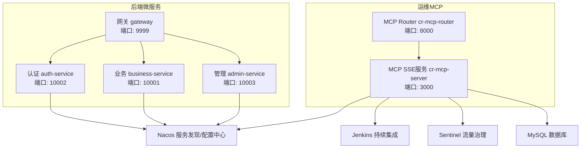
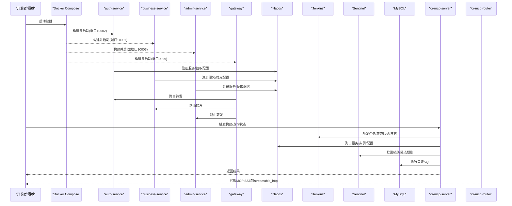
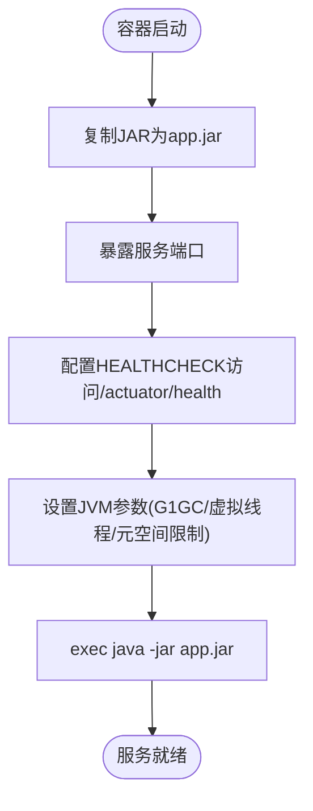
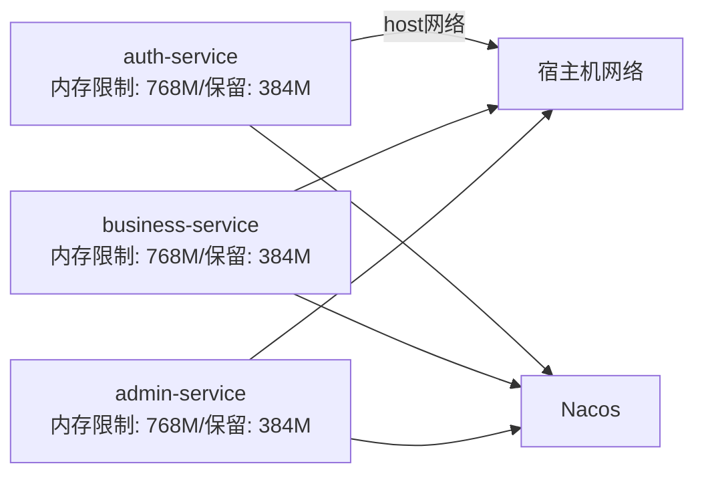
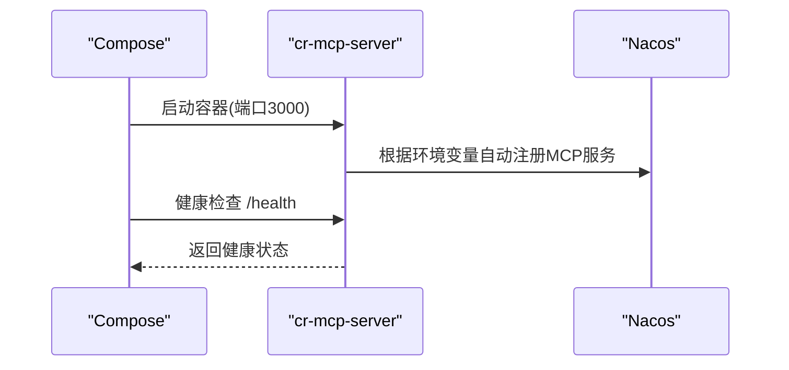
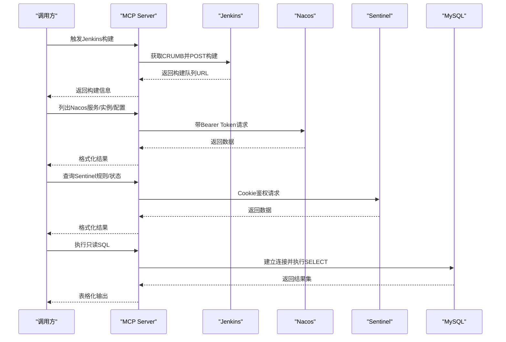
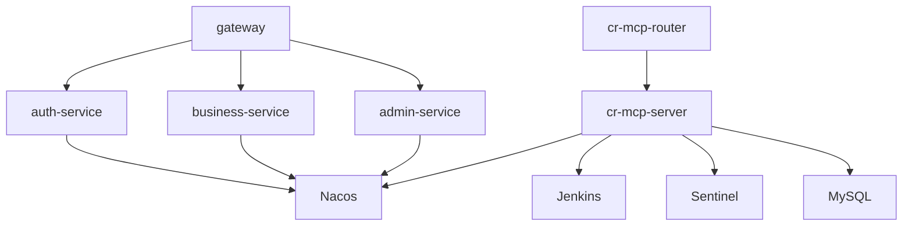

# Docker容器管理

<cite>
**本文引用的文件**   
- [docker-compose.yml](file://class_times_record_back/docker-compose.yml)
- [admin-service/Dockerfile](file://class_times_record_back/admin-service/Dockerfile)
- [auth-service/Dockerfile](file://class_times_record_back/auth-service/Dockerfile)
- [business-service/Dockerfile](file://class_times_record_back/business-service/Dockerfile)
- [gateway/Dockerfile](file://class_times_record_back/gateway/Dockerfile)
- [course_record_mcp_server/Dockerfile](file://course_record_mcp_server/Dockerfile)
- [course_record_mcp_server/docker-compose.yml](file://course_record_mcp_server/docker-compose.yml)
- [server.ts](file://course_record_mcp_server/server.ts)
</cite>

## 目录
1. [简介](#简介)
2. [项目结构](#项目结构)
3. [核心组件](#核心组件)
4. [架构总览](#架构总览)
5. [详细组件分析](#详细组件分析)
6. [依赖关系分析](#依赖关系分析)
7. [性能与资源限制](#性能与资源限制)
8. [安全与最佳实践](#安全与最佳实践)
9. [监控与日志方案](#监控与日志方案)
10. [故障排查指南](#故障排查指南)
11. [结论](#结论)
12. [附录：API调用示例与编排清单](#附录api调用示例与编排清单)

## 简介
本文件围绕仓库中的Docker化部署与运维能力，系统化梳理镜像构建、容器编排、服务注册发现、健康检查、资源限制与安全配置等关键主题。重点覆盖以下方面：
- 容器生命周期管理与基础操作（启动、停止、重启、删除）
- 镜像构建与推送流程（基于现有Dockerfile与CI流水线）
- 网络模式与端口暴露策略
- 服务编排与健康检查（Compose + Healthcheck）
- 通过MCP Server统一运维接口对接Jenkins/Nacos/Sentinel/Docker等系统
- 监控与日志收集建议
- 安全与资源限制的最佳实践

## 项目结构
本项目采用多模块微服务架构，后端服务以JAR运行于容器中；同时提供Node.js实现的MCP Server用于统一运维能力。主要与Docker相关的文件包括：
- 各服务的Dockerfile定义镜像构建与运行时参数
- docker-compose.yml定义服务编排、环境变量、资源限制与健康检查
- MCP Server的Dockerfile与compose定义SSE模式下的运行与Nacos自动注册

图示来源
- [docker-compose.yml:1-75](file://class_times_record_back/docker-compose.yml#L1-L75)
- [course_record_mcp_server/docker-compose.yml:1-73](file://course_record_mcp_server/docker-compose.yml#L1-L73)
- [admin-service/Dockerfile:1-31](file://class_times_record_back/admin-service/Dockerfile#L1-L31)
- [auth-service/Dockerfile:1-30](file://class_times_record_back/auth-service/Dockerfile#L1-L30)
- [business-service/Dockerfile:1-29](file://class_times_record_back/business-service/Dockerfile#L1-L29)
- [gateway/Dockerfile:1-29](file://class_times_record_back/gateway/Dockerfile#L1-L29)
- [course_record_mcp_server/Dockerfile:1-41](file://course_record_mcp_server/Dockerfile#L1-L41)

章节来源
- [docker-compose.yml:1-75](file://class_times_record_back/docker-compose.yml#L1-L75)
- [course_record_mcp_server/docker-compose.yml:1-73](file://course_record_mcp_server/docker-compose.yml#L1-L73)

## 核心组件
- 后端微服务镜像
  - 使用Alpine基础镜像+JRE 21，开启G1GC与虚拟线程，设置合理的堆与元空间上限，并通过HEALTHCHECK暴露Actuator健康端点。
  - 各服务在Compose中通过network_mode=host直接绑定宿主机网络，简化跨进程通信。
- MCP Server（Node.js）
  - 基于Node 20 Alpine镜像，安装tsx运行TypeScript，默认以SSE模式对外提供服务，支持向Nacos AI注册中心自动注册。
  - 提供对Jenkins、Nacos、Sentinel、数据库的统一工具封装，作为运维入口。

章节来源
- [admin-service/Dockerfile:1-31](file://class_times_record_back/admin-service/Dockerfile#L1-L31)
- [auth-service/Dockerfile:1-30](file://class_times_record_back/auth-service/Dockerfile#L1-L30)
- [business-service/Dockerfile:1-29](file://class_times_record_back/business-service/Dockerfile#L1-L29)
- [gateway/Dockerfile:1-29](file://class_times_record_back/gateway/Dockerfile#L1-L29)
- [course_record_mcp_server/Dockerfile:1-41](file://course_record_mcp_server/Dockerfile#L1-L41)

## 架构总览
下图展示了容器编排与服务间交互关系，以及MCP Server作为统一运维接口的角色。

图示来源
- [docker-compose.yml:1-75](file://class_times_record_back/docker-compose.yml#L1-L75)
- [course_record_mcp_server/docker-compose.yml:1-73](file://course_record_mcp_server/docker-compose.yml#L1-L73)
- [server.ts:1-800](file://course_record_mcp_server/server.ts#L1-L800)

## 详细组件分析

### 后端微服务镜像与运行时
- 基础镜像与依赖
  - 使用eclipse-temurin:21-jre-alpine，安装curl用于健康检查。
- 应用包复制与端口
  - 从宿主target目录复制对应JAR为app.jar，EXPOSE各自端口。
- 健康检查
  - HEALTHCHECK定期访问actuator/health，失败则标记不健康。
- JVM优化
  - 启用G1GC、虚拟线程，限制MaxMetaspaceSize与ReservedCodeCacheSize，减少内存占用。

图示来源
- [admin-service/Dockerfile:1-31](file://class_times_record_back/admin-service/Dockerfile#L1-L31)
- [auth-service/Dockerfile:1-30](file://class_times_record_back/auth-service/Dockerfile#L1-L30)
- [business-service/Dockerfile:1-29](file://class_times_record_back/business-service/Dockerfile#L1-L29)
- [gateway/Dockerfile:1-29](file://class_times_record_back/gateway/Dockerfile#L1-L29)

章节来源
- [admin-service/Dockerfile:1-31](file://class_times_record_back/admin-service/Dockerfile#L1-L31)
- [auth-service/Dockerfile:1-30](file://class_times_record_back/auth-service/Dockerfile#L1-L30)
- [business-service/Dockerfile:1-29](file://class_times_record_back/business-service/Dockerfile#L1-L29)
- [gateway/Dockerfile:1-29](file://class_times_record_back/gateway/Dockerfile#L1-L29)

### 容器编排与资源限制
- 服务定义
  - 通过docker-compose.yml定义auth-service、business-service、admin-service，指定镜像名、容器名、重启策略、环境变量、资源限制与网络模式。
- 环境变量
  - 注入Nacos地址与命名空间、Sentinel地址与客户端IP、Tomcat线程池与HikariCP连接池大小等。
- 资源限制
  - deploy.resources.limits/reservations分别设置最大与保留内存，避免单服务过度消耗。
- 网络模式
  - network_mode=host，直接使用宿主机网络栈，便于本地调试与外部访问。

图示来源
- [docker-compose.yml:1-75](file://class_times_record_back/docker-compose.yml#L1-L75)

章节来源
- [docker-compose.yml:1-75](file://class_times_record_back/docker-compose.yml#L1-L75)

### MCP Server（SSE模式）与Nacos自动注册
- 镜像构建
  - 基于node:20-alpine，安装CA证书与curl，全局安装tsx，复制package.json与源码，设置环境变量后以tsx运行server.ts。
- 运行模式
  - 默认MCP_TRANSPORT=sse，监听3000端口，允许自签名证书（内网环境）。
- Nacos自动注册
  - 通过Nacos MCP相关环境变量控制是否注册、服务名称、版本、描述与对外端点。
- 健康检查
  - compose中通过wget探测http://localhost:3000/health，间隔30s，超时5s，重试3次。

图示来源
- [course_record_mcp_server/Dockerfile:1-41](file://course_record_mcp_server/Dockerfile#L1-L41)
- [course_record_mcp_server/docker-compose.yml:1-73](file://course_record_mcp_server/docker-compose.yml#L1-L73)

章节来源
- [course_record_mcp_server/Dockerfile:1-41](file://course_record_mcp_server/Dockerfile#L1-L41)
- [course_record_mcp_server/docker-compose.yml:1-73](file://course_record_mcp_server/docker-compose.yml#L1-L73)

### MCP Server统一运维工具链
MCP Server提供一系列工具，用于与Jenkins、Nacos、Sentinel、数据库进行交互，典型流程如下：

图示来源
- [server.ts:1-800](file://course_record_mcp_server/server.ts#L1-L800)

章节来源
- [server.ts:1-800](file://course_record_mcp_server/server.ts#L1-L800)

## 依赖关系分析
- 服务间依赖
  - 网关依赖认证、业务、管理服务；这些服务均依赖Nacos进行服务发现与配置拉取。
- 运维依赖
  - MCP Server依赖Jenkins、Nacos、Sentinel与数据库，提供统一的运维工具接口。
- 编排依赖
  - MCP Router依赖MCP SSE服务健康状态，确保代理可用后再对外暴露。

图示来源
- [docker-compose.yml:1-75](file://class_times_record_back/docker-compose.yml#L1-L75)
- [course_record_mcp_server/docker-compose.yml:1-73](file://course_record_mcp_server/docker-compose.yml#L1-L73)

章节来源
- [docker-compose.yml:1-75](file://class_times_record_back/docker-compose.yml#L1-L75)
- [course_record_mcp_server/docker-compose.yml:1-73](file://course_record_mcp_server/docker-compose.yml#L1-L73)

## 性能与资源限制
- JVM层面
  - 使用G1GC与虚拟线程，降低线程栈内存占用；合理设置堆大小与元空间上限，避免频繁Full GC与OOM。
- 连接池与线程池
  - 通过环境变量限制Tomcat线程池与HikariCP连接池大小，适配容器资源边界。
- 容器资源
  - 使用deploy.resources.limits与reservations约束最大与保留内存，保障整体稳定性。
- 健康检查
  - 各服务通过HEALTHCHECK与Compose healthcheck周期性探测，快速剔除不健康实例。

章节来源
- [admin-service/Dockerfile:1-31](file://class_times_record_back/admin-service/Dockerfile#L1-L31)
- [auth-service/Dockerfile:1-30](file://class_times_record_back/auth-service/Dockerfile#L1-L30)
- [business-service/Dockerfile:1-29](file://class_times_record_back/business-service/Dockerfile#L1-L29)
- [gateway/Dockerfile:1-29](file://class_times_record_back/gateway/Dockerfile#L1-L29)
- [docker-compose.yml:1-75](file://class_times_record_back/docker-compose.yml#L1-L75)
- [course_record_mcp_server/docker-compose.yml:1-73](file://course_record_mcp_server/docker-compose.yml#L1-L73)

## 安全与最佳实践
- 敏感信息
  - 数据库密码、Jenkins Token、Sentinel凭据通过环境变量注入，避免硬编码。
- 最小权限
  - 数据库工具仅允许只读查询或受控写操作，DDL需显式确认；禁止DROP/TRUNCATE/GRANT/REVOKE等高危操作。
- 网络隔离
  - 生产环境建议使用自定义网络而非host模式，结合反向代理与防火墙策略限制访问范围。
- 镜像安全
  - 使用官方基础镜像，定期更新；扫描镜像漏洞；最小化镜像层数与体积。
- 健康检查与自愈
  - 配置合理的健康检查与重启策略，确保异常快速恢复。

章节来源
- [server.ts:1-800](file://course_record_mcp_server/server.ts#L1-L800)
- [course_record_mcp_server/Dockerfile:1-41](file://course_record_mcp_server/Dockerfile#L1-L41)
- [docker-compose.yml:1-75](file://class_times_record_back/docker-compose.yml#L1-L75)

## 监控与日志方案
- 健康检查
  - 后端服务通过Actuator健康端点；MCP SSE通过/health端点；Compose按周期探测。
- 指标采集
  - 可结合Prometheus抓取Actuator指标；MCP Server可暴露自身指标端点。
- 日志收集
  - 将容器标准输出重定向至集中日志系统（如ELK/Loki），或通过Docker驱动收集。
- 链路追踪
  - 引入OpenTelemetry或SkyWalking，配合网关与服务埋点，实现端到端追踪。

[本节为通用指导，不直接分析具体文件]

## 故障排查指南
- 容器无法启动
  - 检查Dockerfile中JAR路径与环境变量是否正确；查看容器日志定位JVM或应用错误。
- 健康检查失败
  - 确认actuator/health或/health端点可达；检查网络模式与端口映射。
- 服务未注册到Nacos
  - 核对Nacos地址、命名空间与Token；查看MCP Server自动注册逻辑与日志。
- Jenkins构建失败
  - 检查CRUMB获取与Cookie传递；确认任务是否为参数化任务及参数格式。
- 数据库连接异常
  - 校验DB_HOST/PORT/USER/PASSWORD；确认白名单与网络连通性。

章节来源
- [course_record_mcp_server/Dockerfile:1-41](file://course_record_mcp_server/Dockerfile#L1-L41)
- [course_record_mcp_server/docker-compose.yml:1-73](file://course_record_mcp_server/docker-compose.yml#L1-L73)
- [server.ts:1-800](file://course_record_mcp_server/server.ts#L1-L800)

## 结论
本项目通过标准化的Dockerfile与Compose编排，实现了微服务与运维MCP的统一容器化部署。借助Nacos的服务发现与配置中心、Jenkins的持续集成、Sentinel的流量治理，以及MCP Server提供的统一运维工具，形成了完整的开发—构建—部署—运维闭环。在生产环境中，建议进一步细化网络隔离、镜像安全扫描、指标与日志体系，以提升系统的稳定性与可观测性。

[本节为总结性内容，不直接分析具体文件]

## 附录：API调用示例与编排清单

### 容器基础操作（概念性说明）
- 启动/停止/重启/删除
  - 使用Docker CLI或Compose命令对容器进行生命周期管理。例如：
    - 启动：docker compose up -d
    - 停止：docker compose stop
    - 重启：docker compose restart
    - 删除：docker compose down
- 查看状态与日志
  - 状态：docker ps / docker compose ps
  - 日志：docker logs <container_name> / docker compose logs -f

[本节为通用指导，不直接分析具体文件]

### 镜像构建与推送（概念性说明）
- 构建镜像
  - 在各服务目录下执行docker build -t <image>:<tag> .
- 推送镜像
  - 登录镜像仓库后执行docker push <image>:<tag>
- CI流水线
  - 参考Jenkinsfile进行自动化构建与推送（仓库中存在Jenkinsfile，可作为参考）

[本节为通用指导，不直接分析具体文件]

### MCP Server工具调用示例（概念性说明）
- 触发Jenkins构建
  - 调用MCP工具trigger_jenkins_job，传入任务名、分支、部署范围等参数。
- 列出Nacos服务与实例
  - 调用list_nacos_services与get_nacos_service_instances，查看服务注册情况与健康度。
- 查询Sentinel规则
  - 调用sentinelApi相关方法，获取限流与降级规则。
- 执行只读SQL
  - 调用execute_db_query，传入SELECT语句与最大行数限制。

章节来源
- [server.ts:1-800](file://course_record_mcp_server/server.ts#L1-L800)