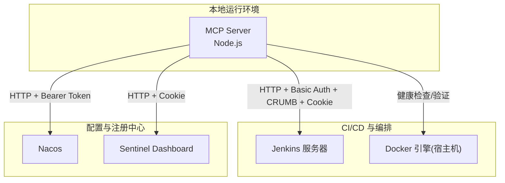
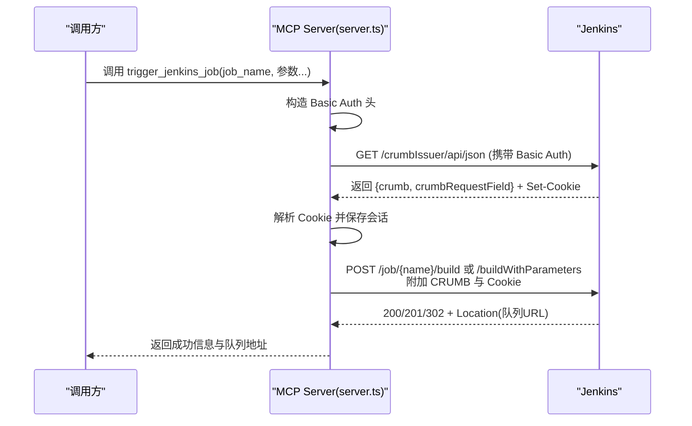
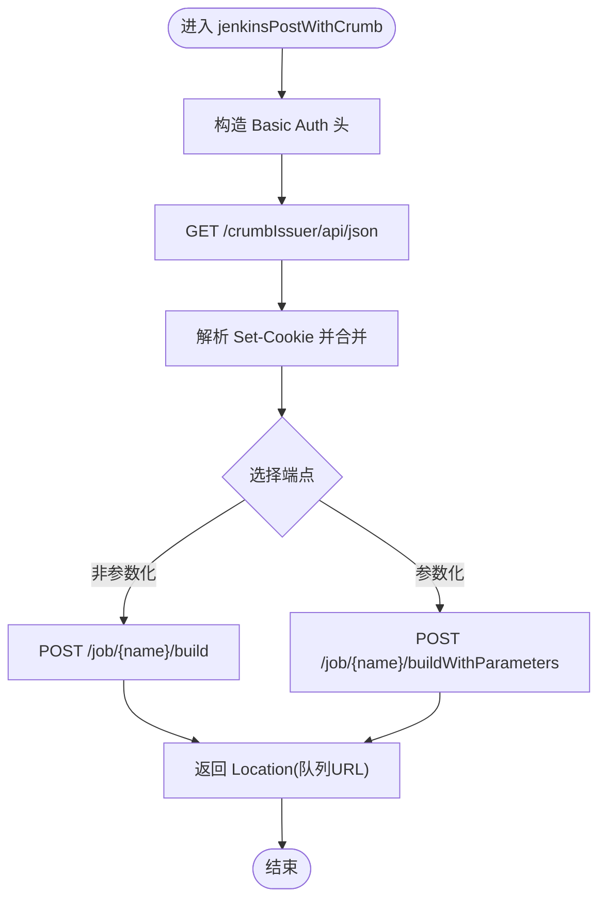
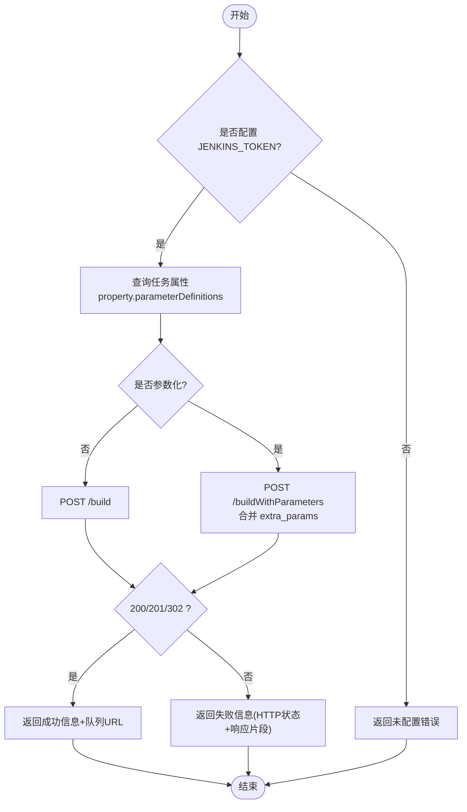
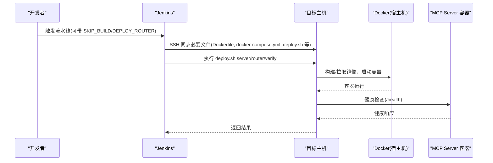
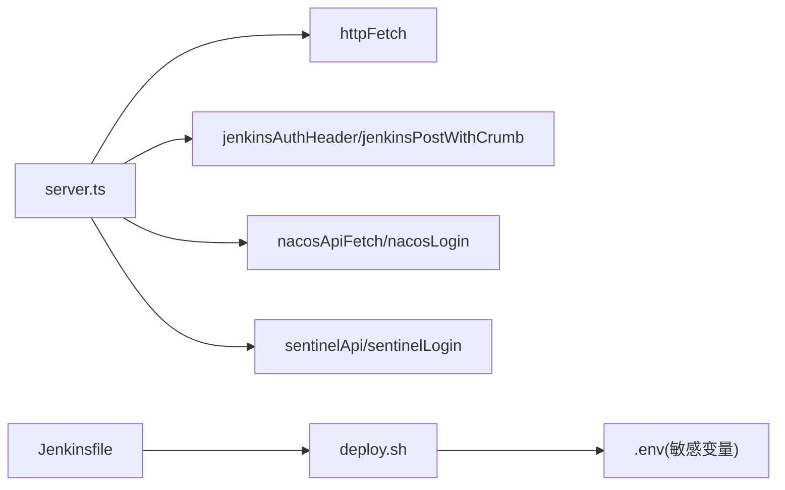

# Jenkins CI/CD集成

<cite>
**本文引用的文件**
- [server.ts](file://course_record_mcp_server/server.ts)
- [Jenkinsfile](file://course_record_mcp_server/Jenkinsfile)
- [deploy.sh](file://course_record_mcp_server/deploy.sh)
</cite>

## 目录
1. [简介](#简介)
2. [项目结构](#项目结构)
3. [核心组件](#核心组件)
4. [架构总览](#架构总览)
5. [详细组件分析](#详细组件分析)
6. [依赖关系分析](#依赖关系分析)
7. [性能与可靠性](#性能与可靠性)
8. [故障排查指南](#故障排查指南)
9. [结论](#结论)
10. [附录：API调用示例与最佳实践](#附录api调用示例与最佳实践)

## 简介
本文件面向使用 MCP Server 统一运维能力的团队，聚焦于与 Jenkins 的 CI/CD 集成。内容覆盖：
- Jenkins API 认证机制（CRUMB CSRF、Basic Auth、Cookie 会话）
- trigger_jenkins_job 工具的实现逻辑（参数化任务检测、构建参数传递、队列状态监控）
- 构建历史查询、日志获取、状态监控等工具使用方法
- 任务类型识别、参数校验、错误重试机制
- 完整的 API 调用示例、故障排查指南与性能优化建议
- 与 Docker 部署流程的集成方案

## 项目结构
MCP Server 通过 server.ts 暴露一组“工具”（Tools），其中包含对 Jenkins、Nacos、Sentinel、宝塔面板等的管理能力；Jenkinsfile 和 deploy.sh 负责将服务以容器方式部署到目标主机，并在部署过程中注入 Jenkins 相关环境变量。

图表来源
- [server.ts:14-45](file://course_record_mcp_server/server.ts#L14-L45)
- [server.ts:89-132](file://course_record_mcp_server/server.ts#L89-L132)
- [server.ts:139-181](file://course_record_mcp_server/server.ts#L139-L181)
- [server.ts:188-235](file://course_record_mcp_server/server.ts#L188-L235)

章节来源
- [server.ts:14-45](file://course_record_mcp_server/server.ts#L14-L45)
- [Jenkinsfile:18-21](file://course_record_mcp_server/Jenkinsfile#L18-L21)
- [deploy.sh:100-129](file://course_record_mcp_server/deploy.sh#L100-L129)

## 核心组件
- Jenkins 认证与请求封装
  - Basic Auth：基于用户名与令牌生成 Authorization 头
  - CRUMB 防护：先拉取 /crumbIssuer/api/json，再在同一会话中附带 Cookie 与 CRUMB 发起 POST
  - Cookie 会话：解析 set-cookie，合并并复用，确保 CSRF 校验通过
- 触发构建工具 trigger_jenkins_job
  - 自动判断是否为参数化任务（读取 property.parameterDefinitions）
  - 非参数化：POST /build
  - 参数化：POST /buildWithParameters，支持 extra_params 合并
  - 返回 Location 中的队列地址，便于后续监控
- 构建历史与日志
  - list_jenkins_jobs：列出任务及颜色状态
  - get_jenkins_builds：最近 N 次构建摘要
  - get_jenkins_build_log：尾部 N 行日志
  - get_jenkins_build_status：单次构建详情（含参数）
  - get_jenkins_queue：当前队列概览
- 其他系统能力（辅助）
  - Nacos：登录态缓存、401 自动刷新、AI 资源列表
  - Sentinel：Cookie 登录态、规则增删改查
  - 宝塔面板：签名、Host 头处理、Cookie 合并、数据解包

章节来源
- [server.ts:82-132](file://course_record_mcp_server/server.ts#L82-L132)
- [server.ts:350-410](file://course_record_mcp_server/server.ts#L350-L410)
- [server.ts:412-529](file://course_record_mcp_server/server.ts#L412-L529)
- [server.ts:139-181](file://course_record_mcp_server/server.ts#L139-L181)
- [server.ts:188-235](file://course_record_mcp_server/server.ts#L188-L235)

## 架构总览
下图展示从 MCP Server 到 Jenkins 的完整交互链路，包括认证、CSRF 防护与构建触发。

图表来源
- [server.ts:89-132](file://course_record_mcp_server/server.ts#L89-L132)
- [server.ts:350-410](file://course_record_mcp_server/server.ts#L350-L410)

## 详细组件分析

### Jenkins 认证与 CSRF 防护
- Basic Auth：使用用户名与令牌拼接后 Base64 编码，作为 Authorization 头发送
- CRUMB 获取：访问 /crumbIssuer/api/json，动态读取 crumbRequestField 与 crumb 值
- Cookie 会话：解析响应头 set-cookie，提取键值对并合并为 Cookie 头，保证同一会话内 CSRF 有效
- 超时控制：所有 HTTP 请求均设置超时信号，避免阻塞

图表来源
- [server.ts:89-132](file://course_record_mcp_server/server.ts#L89-L132)

章节来源
- [server.ts:82-132](file://course_record_mcp_server/server.ts#L82-L132)

### trigger_jenkins_job 实现逻辑
- 参数定义
  - job_name：任务名
  - branch、deploy_scope、skip_build、rollback、deploy_router：内置参数映射
  - extra_params：自定义 KEY=VAL 对，逗号分隔，与内置参数合并
- 参数化任务检测
  - 读取 /job/{name}/api/json?tree=property[parameterDefinitions[name]]
  - 若存在 parameterDefinitions 且长度大于 0，则视为参数化任务
- 构建触发
  - 非参数化：POST /build
  - 参数化：POST /buildWithParameters，Content-Type 为 application/x-www-form-urlencoded
- 返回值
  - 成功时返回 Location 中的队列 URL，便于后续监控
  - 失败时返回 HTTP 状态码与响应体前 200 字符

图表来源
- [server.ts:350-410](file://course_record_mcp_server/server.ts#L350-L410)

章节来源
- [server.ts:350-410](file://course_record_mcp_server/server.ts#L350-L410)

### 构建历史、日志与状态监控
- 列出任务：list_jenkins_jobs
  - 读取 jobs[name,url,color]，按 color 推断状态
- 构建历史：get_jenkins_builds
  - 读取 builds[number,result,duration,timestamp]，限制返回条数
- 构建日志：get_jenkins_build_log
  - 读取 consoleText，返回最后 N 行
- 构建状态：get_jenkins_build_status
  - 读取 number,result,duration,timestamp,url,actions[parameters]
- 队列监控：get_jenkins_queue
  - 读取 queue/api/json，输出等待中的任务

章节来源
- [server.ts:412-529](file://course_record_mcp_server/server.ts#L412-L529)

### 任务类型识别与参数校验
- 任务类型识别
  - 通过 property.parameterDefinitions 是否存在且非空判定
- 参数校验
  - 使用输入模式约束（如字符串、布尔、数字）
  - extra_params 以逗号分隔的 KEY=VAL 形式解析，空值与 false 值在汇总时过滤
- 错误处理
  - 网络异常捕获并返回结构化文本
  - 非 2xx 响应返回状态码与响应片段

章节来源
- [server.ts:350-410](file://course_record_mcp_server/server.ts#L350-L410)

### 错误重试机制
- Nacos
  - 首次登录获取 accessToken，后续请求自动携带
  - 遇到 401/403 时刷新 token 并重试一次
- Sentinel
  - 首次登录获取 sentinel_dashboard_cookie，后续请求携带
  - 遇到 401 时重新登录并重试一次
- Jenkins
  - 当前实现未内置重试；建议在调用层增加指数退避重试策略

章节来源
- [server.ts:139-181](file://course_record_mcp_server/server.ts#L139-L181)
- [server.ts:188-235](file://course_record_mcp_server/server.ts#L188-L235)

### 与 Docker 部署流程的集成
- Jenkinsfile
  - 提供 SKIP_BUILD、DEPLOY_ROUTER 两个参数
  - 拉取代码、同步文件到远程主机、执行远程部署脚本、可选部署 Router、健康检查
- deploy.sh
  - 从 .env 加载敏感变量（JENKINS_*、DB_*、BT_* 等）
  - server 子命令：备份镜像、停止旧容器、按需构建镜像、启动新容器、健康检查、清理悬空镜像
  - router 子命令：构建修补后的 Router 镜像并启动
  - verify 子命令：检查 MCP Server 与 Router 的健康状态
- 环境变量注入
  - 容器启动时传入 JENKINS_URL、JENKINS_USER、JENKINS_TOKEN 等，供 MCP Server 使用

图表来源
- [Jenkinsfile:24-90](file://course_record_mcp_server/Jenkinsfile#L24-L90)
- [deploy.sh:74-146](file://course_record_mcp_server/deploy.sh#L74-L146)

章节来源
- [Jenkinsfile:18-21](file://course_record_mcp_server/Jenkinsfile#L18-L21)
- [Jenkinsfile:24-90](file://course_record_mcp_server/Jenkinsfile#L24-L90)
- [deploy.sh:100-146](file://course_record_mcp_server/deploy.sh#L100-L146)

## 依赖关系分析
- server.ts 对外暴露的工具函数依赖：
  - httpFetch：统一 HTTP 客户端，带超时与错误打印
  - jenkinsAuthHeader/jenkinsPostWithCrumb：Jenkins 认证与 CSRF 处理
  - nacosApiFetch/nacosLogin：Nacos 登录与 Bearer Token 管理
  - sentinelApi/sentinelLogin：Sentinel 登录与 Cookie 管理
- 部署依赖：
  - Jenkinsfile 依赖 Git、SSH Key、远程主机可达
  - deploy.sh 依赖 Docker、curl、.env 配置文件

图表来源
- [server.ts:59-84](file://course_record_mcp_server/server.ts#L59-L84)
- [server.ts:89-132](file://course_record_mcp_server/server.ts#L89-L132)
- [server.ts:139-181](file://course_record_mcp_server/server.ts#L139-L181)
- [server.ts:188-235](file://course_record_mcp_server/server.ts#L188-L235)
- [Jenkinsfile:24-90](file://course_record_mcp_server/Jenkinsfile#L24-L90)
- [deploy.sh:100-146](file://course_record_mcp_server/deploy.sh#L100-L146)

章节来源
- [server.ts:59-84](file://course_record_mcp_server/server.ts#L59-L84)
- [Jenkinsfile:24-90](file://course_record_mcp_server/Jenkinsfile#L24-L90)
- [deploy.sh:100-146](file://course_record_mcp_server/deploy.sh#L100-L146)

## 性能与可靠性
- 连接与超时
  - 所有外部 HTTP 请求均设置超时信号，避免长尾阻塞
- 并发与幂等
  - 触发构建接口具备幂等性（重复触发会创建新的构建号）
- 重试与容错
  - Nacos/Sentinel 已内置 401 自动刷新与重试
  - Jenkins 侧建议在上层增加指数退避重试（例如最多 3 次，间隔 1s/2s/4s）
- 资源清理
  - deploy.sh 在部署完成后执行 docker image prune，减少磁盘占用

章节来源
- [server.ts:59-84](file://course_record_mcp_server/server.ts#L59-L84)
- [server.ts:139-181](file://course_record_mcp_server/server.ts#L139-L181)
- [server.ts:188-235](file://course_record_mcp_server/server.ts#L188-L235)
- [deploy.sh:144-146](file://course_record_mcp_server/deploy.sh#L144-L146)

## 故障排查指南
- 常见错误定位
  - 401/403：检查 JENKINS_TOKEN、Nacos/Sentinel 凭据是否正确；查看自动刷新是否生效
  - CSRF 失败：确认 CRUMB 与 Cookie 是否在同一会话中传递
  - 构建失败：通过 get_jenkins_build_log 查看尾部日志；结合 get_jenkins_build_status 确认参数
  - 网络问题：httpFetch 会打印详细错误信息，关注 DNS/TLS/代理相关提示
- 快速自检清单
  - 环境变量：JENKINS_URL、JENKINS_USER、JENKINS_TOKEN 是否注入
  - 连通性：curl 测试 /crumbIssuer/api/json、/job/{name}/api/json
  - 权限：Jenkins 用户具备触发构建权限
  - 防火墙/Nginx：端口可达、Host 头正确

章节来源
- [server.ts:59-84](file://course_record_mcp_server/server.ts#L59-L84)
- [server.ts:89-132](file://course_record_mcp_server/server.ts#L89-L132)
- [server.ts:412-529](file://course_record_mcp_server/server.ts#L412-L529)

## 结论
本集成通过 MCP Server 统一封装了 Jenkins 的认证与构建能力，并结合 Nacos/Sentinel 的管理接口形成一套可观测、可操作的运维体系。借助 Jenkinsfile 与 deploy.sh，实现了从代码拉取、镜像构建到容器部署的全链路自动化。建议在生产环境中完善上层重试与熔断策略，并对关键操作增加审计与告警。

## 附录：API调用示例与最佳实践
- 触发构建（非参数化）
  - 工具：trigger_jenkins_job
  - 参数：job_name=xxx，其余保持默认
  - 预期：返回成功信息与队列 URL
- 触发构建（参数化）
  - 工具：trigger_jenkins_job
  - 参数：branch、deploy_scope、extra_params=KEY1=VAL1,KEY2=VAL2
  - 预期：返回成功信息与队列 URL
- 查看任务列表
  - 工具：list_jenkins_jobs
- 查看构建历史
  - 工具：get_jenkins_builds(job_name, limit)
- 查看构建日志
  - 工具：get_jenkins_build_log(job_name, build_number, tail_lines)
- 查看构建状态
  - 工具：get_jenkins_build_status(job_name, build_number)
- 查看队列
  - 工具：get_jenkins_queue

最佳实践
- 安全
  - 仅注入最小权限令牌；避免在前端直接暴露 Jenkins 凭据
  - 使用 HTTPS 访问 Jenkins，并确保证书可信
- 稳定性
  - 对 trigger_jenkins_job 增加指数退避重试与最大重试次数
  - 对队列轮询采用退避策略，避免高频请求
- 可观测性
  - 记录每次触发的参数、返回的队列 URL、最终构建结果
  - 结合 Nacos/Sentinel 指标进行端到端监控

章节来源
- [server.ts:350-529](file://course_record_mcp_server/server.ts#L350-L529)