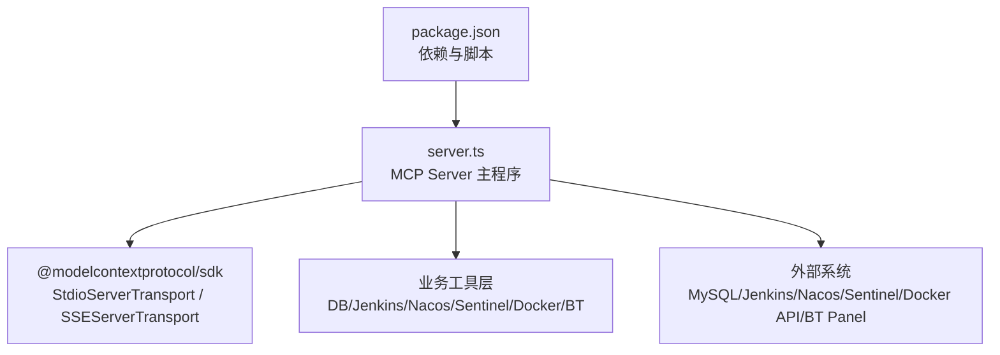
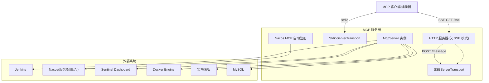
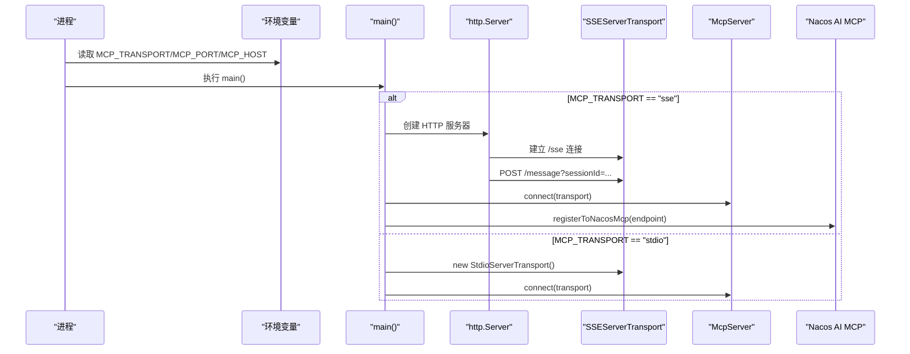
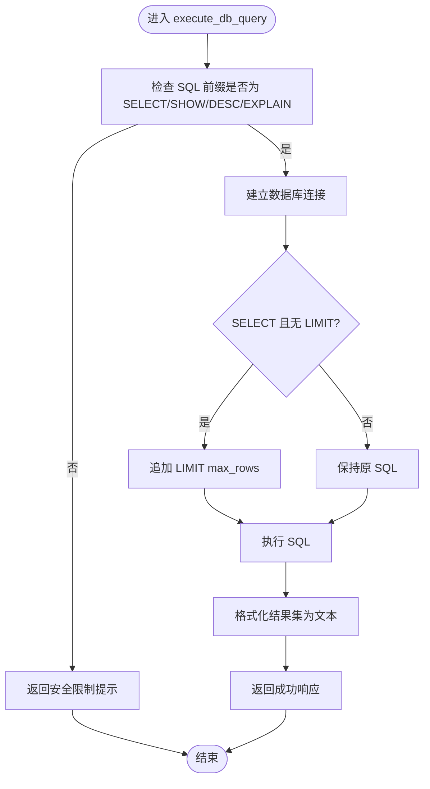
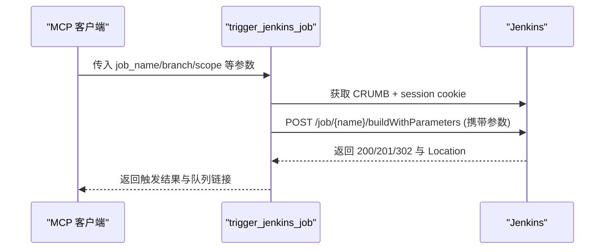
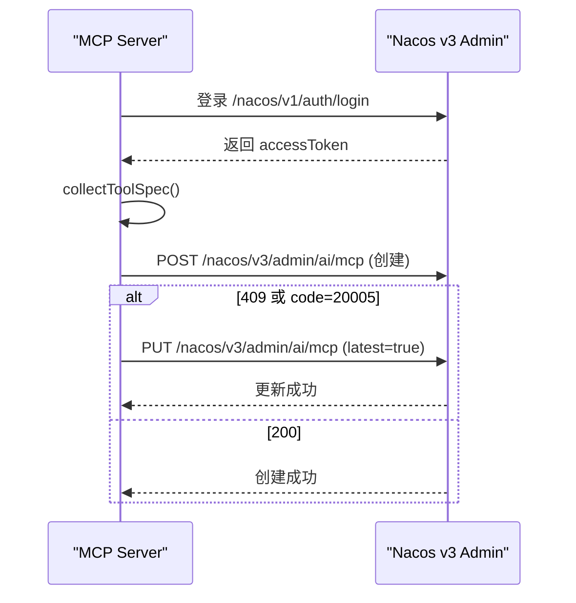
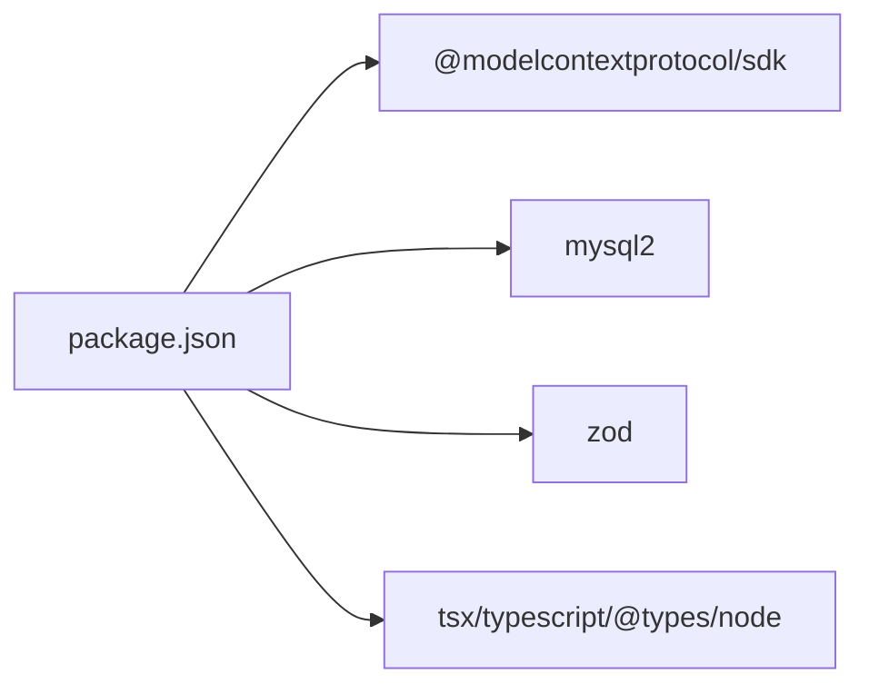

# MCP架构设计

<cite>
**本文引用的文件**
- [server.ts](file://course_record_mcp_server/server.ts)
- [package.json](file://course_record_mcp_server/package.json)
</cite>

## 目录
1. [引言](#引言)
2. [项目结构](#项目结构)
3. [核心组件](#核心组件)
4. [架构总览](#架构总览)
5. [详细组件分析](#详细组件分析)
6. [依赖关系分析](#依赖关系分析)
7. [性能与扩展性](#性能与扩展性)
8. [故障排查指南](#故障排查指南)
9. [结论](#结论)

## 引言
本设计文档面向“MCP运维服务器”，基于 Node.js + TypeScript，实现 Model Context Protocol（MCP）的本地运维能力。该服务通过标准输入输出传输（stdio）或 SSE 远程模式运行，提供对 Jenkins、Nacos、Sentinel、Docker、宝塔面板以及 MySQL 的统一运维工具集。其关键特性包括：
- 无 HTTP 端口设计理念（默认 stdio 模式），降低暴露面，提升安全性
- SSE 远程模式支持，便于跨进程/跨主机调用并注册到 Nacos AI MCP 注册中心
- 自动发现机制：在 SSE 模式下将自身作为 MCP 服务注册至 Nacos，供上层 AI 编排系统动态发现
- 完善的生命周期管理、工具注册机制与错误处理策略

## 项目结构
仓库中 MCP 服务端位于 course_record_mcp_server 目录，核心入口为 server.ts，依赖声明在 package.json。整体采用单文件模块化组织，按功能域划分工具集合（数据库、Jenkins、Nacos、Sentinel、Docker、宝塔等）。

图表来源
- [server.ts:1-50](file://course_record_mcp_server/server.ts#L1-L50)
- [package.json:1-22](file://course_record_mcp_server/package.json#L1-L22)

章节来源
- [server.ts:1-50](file://course_record_mcp_server/server.ts#L1-L50)
- [package.json:1-22](file://course_record_mcp_server/package.json#L1-L22)

## 核心组件
- MCP 运行时
  - McpServer：统一的服务实例，负责工具注册、消息路由与协议编解码
  - StdioServerTransport：本地 stdio 传输，无需监听 HTTP 端口
  - SSEServerTransport：SSE 传输，用于远程访问与 Nacos 注册
- 工具集合
  - 数据库工具：只读查询与受限写操作（含 DDL 开关）
  - Jenkins 工具：触发构建、查看任务/队列/日志/状态
  - Nacos 工具：服务/配置/AI 资源（MCP/Prompt/A2A/Skill）列表与详情
  - Sentinel 工具：应用/机器/流控/熔断规则查询与变更
  - Docker 工具：容器/镜像/系统信息/日志/清理
  - 宝塔面板工具：系统/网站/域名/备份/计划任务/SSL/文件管理等
- 外部集成
  - MySQL：mysql2/promise 连接池
  - HTTP 客户端：原生 fetch，封装超时与重试逻辑
  - 认证与安全：Basic Auth、Cookie、Bearer Token、MD5 签名

章节来源
- [server.ts:238-241](file://course_record_mcp_server/server.ts#L238-L241)
- [server.ts:265-346](file://course_record_mcp_server/server.ts#L265-L346)
- [server.ts:350-530](file://course_record_mcp_server/server.ts#L350-L530)
- [server.ts:533-806](file://course_record_mcp_server/server.ts#L533-L806)
- [server.ts:810-1006](file://course_record_mcp_server/server.ts#L810-L1006)
- [server.ts:1009-1602](file://course_record_mcp_server/server.ts#L1009-L1602)
- [server.ts:1890-2096](file://course_record_mcp_server/server.ts#L1890-L2096)

## 架构总览
下图展示 MCP 服务器的两种运行模式及与外部系统的交互关系。默认 stdio 模式不暴露任何 HTTP 端口；SSE 模式通过 HTTP 暴露 /sse 与 /message 端点，并可注册到 Nacos AI MCP。

图表来源
- [server.ts:2271-2373](file://course_record_mcp_server/server.ts#L2271-L2373)
- [server.ts:2151-2259](file://course_record_mcp_server/server.ts#L2151-L2259)

## 详细组件分析

### 传输与启动流程（stdio vs SSE）
- 环境变量控制
  - MCP_TRANSPORT：选择 stdio 或 sse
  - MCP_PORT/MCP_HOST：SSE 监听地址与端口
  - NACOS_MCP_REGISTER：是否启用 Nacos 自动注册（仅 SSE 模式）
- 启动逻辑
  - stdio：创建 StdioServerTransport 并连接 McpServer
  - sse：创建 http.Server，维护 sessionId 到 transport 的映射，处理 /sse、/message、/health 三个路径，并在启动后尝试注册到 Nacos

图表来源
- [server.ts:2271-2373](file://course_record_mcp_server/server.ts#L2271-L2373)
- [server.ts:2151-2259](file://course_record_mcp_server/server.ts#L2151-L2259)

章节来源
- [server.ts:40-55](file://course_record_mcp_server/server.ts#L40-L55)
- [server.ts:2271-2373](file://course_record_mcp_server/server.ts#L2271-L2373)

### 安全设计与无 HTTP 端口理念
- 默认 stdio 模式不监听任何端口，避免被网络直接访问，减少攻击面
- 仅在显式开启 SSE 模式时暴露 /sse 与 /message，且可通过反向代理进行鉴权与限流
- 对外部系统调用均设置超时与异常捕获，防止阻塞与级联失败
- 敏感凭据通过环境变量注入，不在代码中硬编码

章节来源
- [server.ts:14-46](file://course_record_mcp_server/server.ts#L14-L46)
- [server.ts:59-84](file://course_record_mcp_server/server.ts#L59-L84)
- [server.ts:2271-2373](file://course_record_mcp_server/server.ts#L2271-L2373)

### 工具注册机制与分类
- 使用 server.registerTool(name, schema, handler) 注册工具，schema 由 zod 定义，确保参数校验与描述清晰
- 工具按领域分组：
  - 数据库：execute_db_query、execute_db_update、get_db_config
  - Jenkins：trigger_jenkins_job、list_jenkins_jobs、get_jenkins_builds、get_jenkins_build_log、get_jenkins_build_status、get_jenkins_queue
  - Nacos：list_nacos_services、list_nacos_configs、get_nacos_config、update_nacos_config、get_nacos_service_instances、AI 相关（MCP/Prompt/A2A/Skill）
  - Sentinel：list_sentinel_apps、get_sentinel_machines、流控/熔断规则增删改查
  - Docker：容器/镜像/系统信息与日志
  - 宝塔：系统/网站/域名/备份/计划任务/SSL/文件管理

章节来源
- [server.ts:244-261](file://course_record_mcp_server/server.ts#L244-L261)
- [server.ts:277-346](file://course_record_mcp_server/server.ts#L277-L346)
- [server.ts:350-530](file://course_record_mcp_server/server.ts#L350-L530)
- [server.ts:533-806](file://course_record_mcp_server/server.ts#L533-L806)
- [server.ts:810-1006](file://course_record_mcp_server/server.ts#L810-L1006)
- [server.ts:1009-1602](file://course_record_mcp_server/server.ts#L1009-L1602)
- [server.ts:1890-2096](file://course_record_mcp_server/server.ts#L1890-L2096)

### 数据库工具与权限控制
- 只读工具 execute_db_query：限制 SQL 前缀为 SELECT/SHOW/DESC/EXPLAIN，自动追加 LIMIT，返回格式化文本
- 写工具 execute_db_update：允许 INSERT/UPDATE/DELETE，DDL 需显式 allow_ddl=true；禁止 DROP/TRUNCATE/GRANT/REVOKE
- 连接获取 getDbConnection：从环境变量构造连接，未配置密码则拒绝

图表来源
- [server.ts:277-307](file://course_record_mcp_server/server.ts#L277-L307)
- [server.ts:309-346](file://course_record_mcp_server/server.ts#L309-L346)

章节来源
- [server.ts:265-346](file://course_record_mcp_server/server.ts#L265-L346)

### Jenkins 集成与 CSRF 处理
- 使用 Basic Auth 与 CRUMB 机制保证会话一致性
- 非参数化任务走 /build，参数化任务走 /buildWithParameters，支持额外参数合并
- 提供任务列表、构建历史、日志与队列查询

图表来源
- [server.ts:89-132](file://course_record_mcp_server/server.ts#L89-L132)
- [server.ts:350-410](file://course_record_mcp_server/server.ts#L350-L410)

章节来源
- [server.ts:89-132](file://course_record_mcp_server/server.ts#L89-L132)
- [server.ts:350-410](file://course_record_mcp_server/server.ts#L350-L410)

### Nacos 集成与 AI MCP 自动注册
- 登录与 Token 缓存：nacosLogin 获取 accessToken，nacosApiFetch 自动处理 401 重试
- 服务/配置/AI 资源查询：提供 list/get/update 接口
- 自动注册 registerToNacosMcp：
  - 收集已注册工具规格（名称与描述）
  - 解析 SSE 端点 URL，构造 serverSpecification、endpointSpecification、toolSpecification
  - 先 POST 创建，冲突时 PUT 更新，支持 latest 标记

图表来源
- [server.ts:139-181](file://course_record_mcp_server/server.ts#L139-L181)
- [server.ts:2120-2259](file://course_record_mcp_server/server.ts#L2120-L2259)

章节来源
- [server.ts:139-181](file://course_record_mcp_server/server.ts#L139-L181)
- [server.ts:2120-2259](file://course_record_mcp_server/server.ts#L2120-L2259)

### Sentinel 集成与规则管理
- 登录 Cookie 管理：sentinelLogin 提取 sentinel_dashboard_cookie
- 规则查询：流控 /v1/flow/rules、熔断 /degrade/rules.json
- 规则变更：POST/PUT/DELETE 对应接口，支持多种策略与效果

章节来源
- [server.ts:186-235](file://course_record_mcp_server/server.ts#L186-L235)
- [server.ts:810-1006](file://course_record_mcp_server/server.ts#L810-L1006)

### Docker 集成与日志解析
- 容器/镜像/系统信息查询
- 日志流解析：兼容 Docker 二进制流格式（8 字节头部），回退为纯文本
- 清理悬空镜像与删除镜像

章节来源
- [server.ts:1890-2096](file://course_record_mcp_server/server.ts#L1890-L2096)

### 宝塔面板集成与文件管理
- 签名算法：request_token = md5(request_time + md5(api_sk))
- 统一 POST /files 路径，action 区分具体操作
- 网站/域名/备份/计划任务/SSL/文件读写与元信息

章节来源
- [server.ts:1009-1602](file://course_record_mcp_server/server.ts#L1009-L1602)
- [server.ts:1640-1888](file://course_record_mcp_server/server.ts#L1640-L1888)

## 依赖关系分析
- 运行时依赖
  - @modelcontextprotocol/sdk：提供 McpServer、StdioServerTransport、SSEServerTransport
  - mysql2：MySQL 驱动
  - zod：参数校验与描述生成
- 开发依赖
  - tsx：TypeScript 直跑
  - typescript、@types/node：类型与类型定义

图表来源
- [package.json:1-22](file://course_record_mcp_server/package.json#L1-L22)

章节来源
- [package.json:1-22](file://course_record_mcp_server/package.json#L1-L22)

## 性能与扩展性
- 传输层优化
  - stdio 模式零网络开销，适合本地高吞吐场景
  - SSE 模式建议配合反向代理（如 Nginx）做连接复用与限流
- 外部调用优化
  - 统一 httpFetch 封装超时（默认 10-15 秒），避免长尾请求
  - Nacos/Sentinel 登录态缓存与 401 自动重试，减少重复认证成本
- 数据库操作
  - 查询强制 LIMIT，防止大结果集拖垮内存
  - 写操作参数化，减少 SQL 注入风险与解析开销
- 扩展性考虑
  - 新增工具只需 registerTool，schema 与描述即文档
  - 可按模块拆分工具文件，按需导入，保持 server.ts 简洁
  - 可引入连接池与并发控制（如 p-limit）以应对批量操作

[本节为通用指导，不直接分析具体文件]

## 故障排查指南
- 无法连接外部系统
  - 检查环境变量（JENKINS_URL/NACOS_URL/SENTINEL_URL/DOCKER_URL/BT_URL）
  - 查看控制台错误日志中的 httpFetch 异常信息
- Nacos 自动注册失败
  - 确认 NACOS_MCP_REGISTER 不为 false
  - 检查 Nacos 登录凭证与命名空间
  - 关注 409 冲突时的更新流程
- SSE 模式不可用
  - 确认 MCP_TRANSPORT=sse 且 MCP_PORT/MCP_HOST 正确
  - 验证 /sse 与 /message 路由与防火墙策略
- 数据库操作报错
  - 检查 DB_* 环境变量是否正确
  - 确认 SQL 前缀与 allow_ddl 标志是否符合预期

章节来源
- [server.ts:59-84](file://course_record_mcp_server/server.ts#L59-L84)
- [server.ts:139-181](file://course_record_mcp_server/server.ts#L139-L181)
- [server.ts:2151-2259](file://course_record_mcp_server/server.ts#L2151-L2259)
- [server.ts:2271-2373](file://course_record_mcp_server/server.ts#L2271-L2373)
- [server.ts:265-346](file://course_record_mcp_server/server.ts#L265-L346)

## 结论
本 MCP 运维服务器以 stdio 为首选模式，天然具备“无 HTTP 端口”的安全优势；在需要远程访问时，SSE 模式提供灵活的接入方式，并通过 Nacos AI MCP 自动注册实现服务发现。统一的工具注册机制与严格的权限控制，使得运维操作既强大又可控。结合外部系统集成与完善的错误处理，该方案具备良好的稳定性与可扩展性，适合作为团队统一的运维能力中枢。