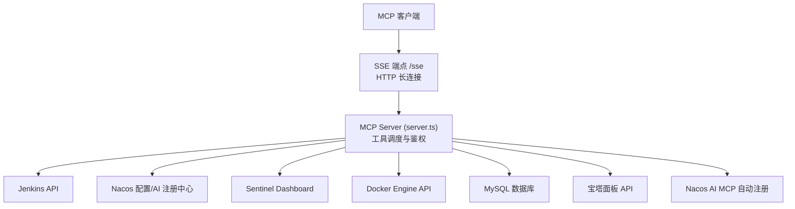
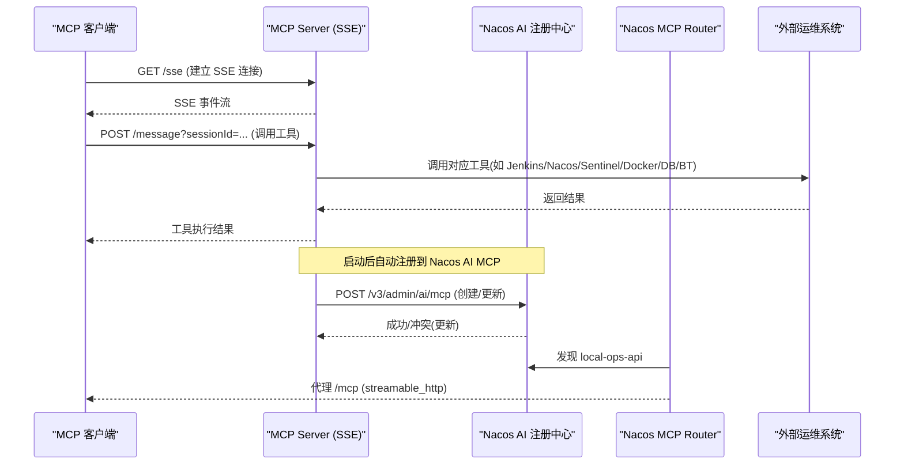
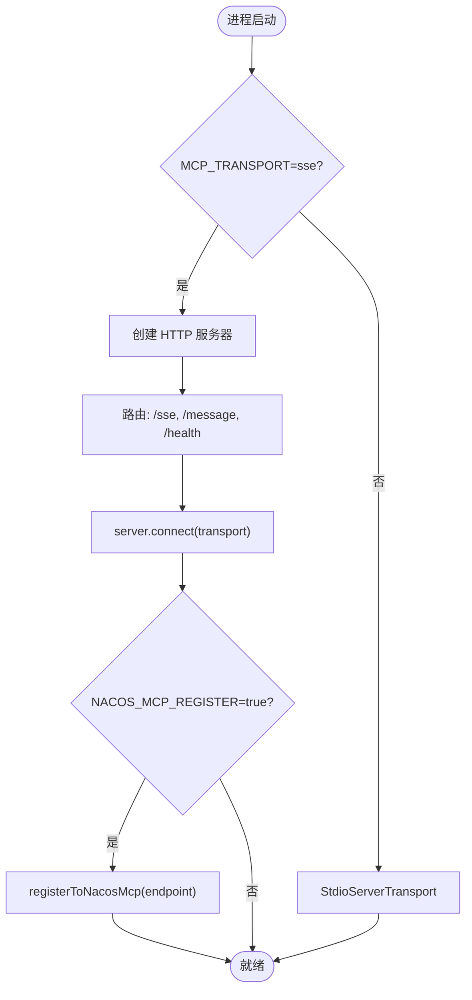
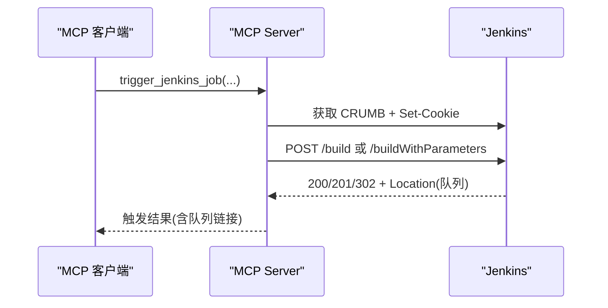
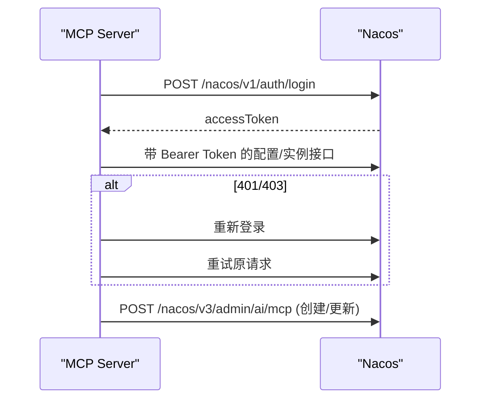
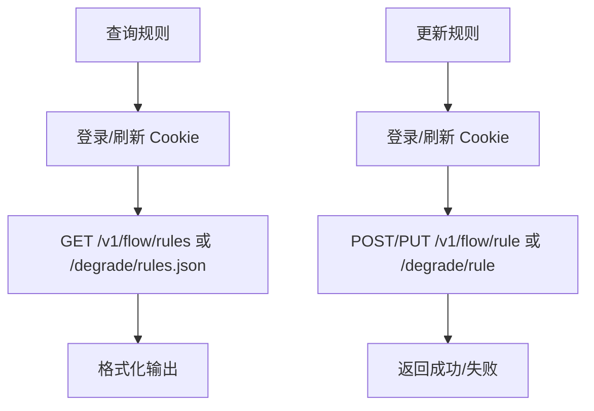
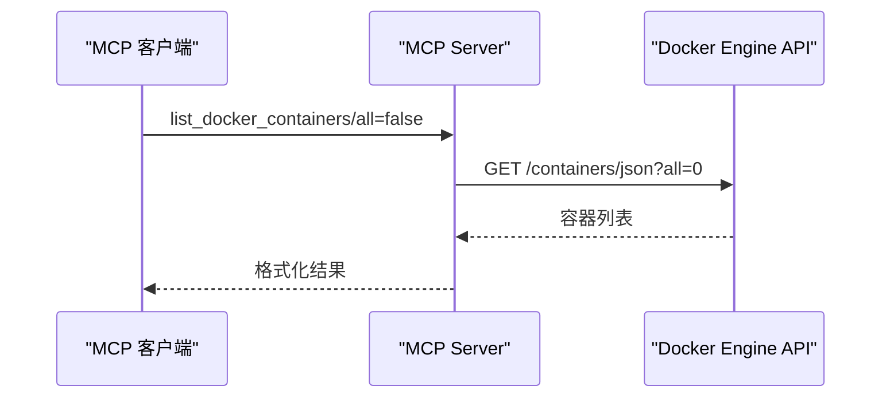
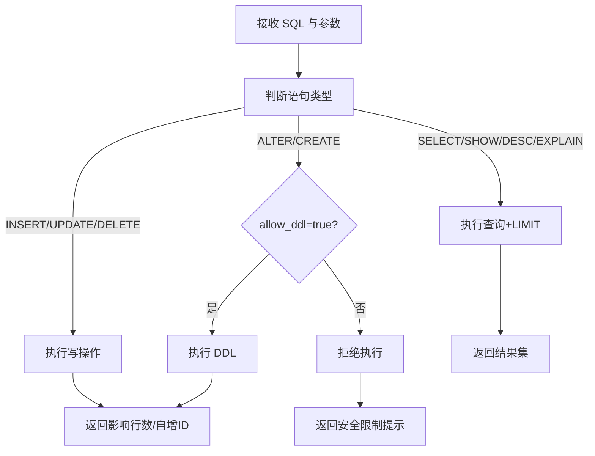
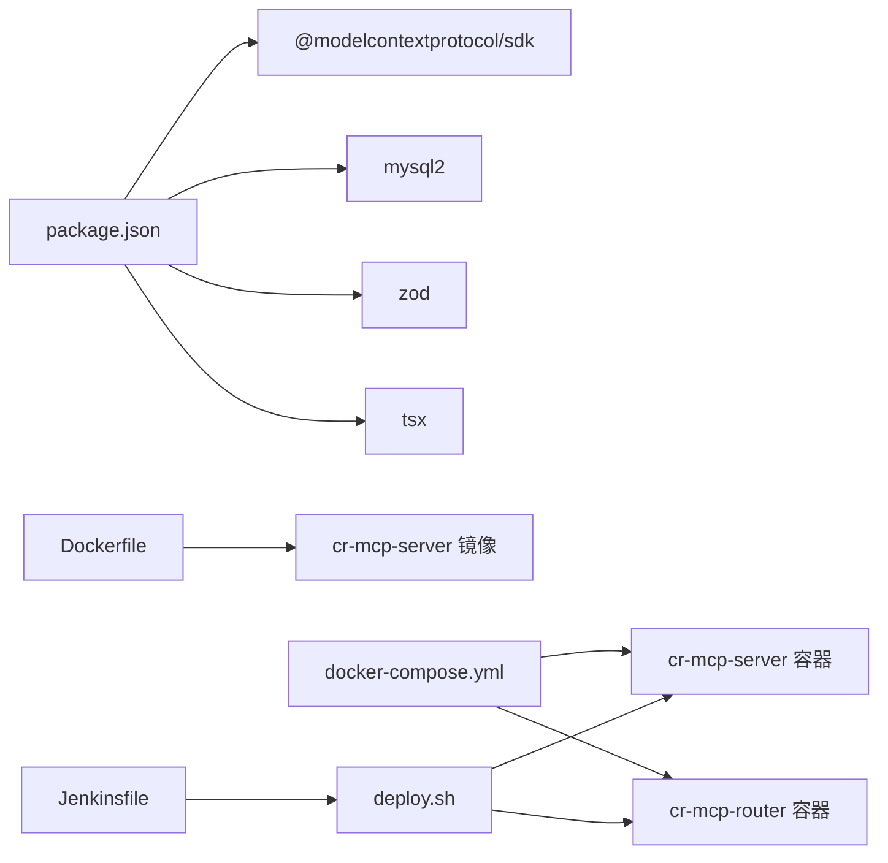

# MCP运维服务器

<cite>
**本文引用的文件**   
- [server.ts](file://course_record_mcp_server/server.ts)
- [package.json](file://course_record_mcp_server/package.json)
- [Dockerfile](file://course_record_mcp_server/Dockerfile)
- [docker-compose.yml](file://course_record_mcp_server/docker-compose.yml)
- [Jenkinsfile](file://course_record_mcp_server/Jenkinsfile)
- [deploy.sh](file://course_record_mcp_server/deploy.sh)
</cite>

## 目录
1. [简介](#简介)
2. [项目结构](#项目结构)
3. [核心组件](#核心组件)
4. [架构总览](#架构总览)
5. [详细组件分析](#详细组件分析)
6. [依赖关系分析](#依赖关系分析)
7. [性能与可靠性](#性能与可靠性)
8. [故障排查指南](#故障排查指南)
9. [结论](#结论)
10. [附录：工具清单与参数说明](#附录工具清单与参数说明)

## 简介
本仓库包含一个基于 Node.js + TypeScript 的 MCP（Model Context Protocol）运维服务器，提供统一的本地运维能力，集成 Jenkins CI/CD、Nacos 配置中心与 AI 注册中心、Sentinel 流量治理、Docker 容器管理、MySQL 数据库操作以及宝塔面板管理能力。该服务支持两种传输模式：
- stdio：本地进程内通信，无 HTTP 端口暴露
- SSE：通过 HTTP Server-Sent Events 对外暴露 /sse 和 /message 端点，并支持自动注册到 Nacos AI MCP 注册中心

MCP 协议采用标准输入输出或 SSE 进行消息传输，不直接暴露业务 HTTP API，从而降低攻击面并简化安全策略。

## 项目结构
- course_record_mcp_server
  - server.ts：MCP 服务器主程序，实现工具注册、外部系统集成、SSE 路由与健康检查等
  - package.json：依赖与脚本定义（@modelcontextprotocol/sdk、mysql2、zod、tsx 等）
  - Dockerfile：构建镜像，默认以 SSE 模式运行，内置 Nacos MCP 自动注册开关
  - docker-compose.yml：编排 cr-mcp-server 与 cr-mcp-router（代理 local-ops-api）
  - Jenkinsfile：CI/CD 流水线，拉取代码、同步部署、构建镜像、启动服务、验证健康
  - deploy.sh：远程一键部署脚本，支持 server/router/verify 三种模式

图表来源
- [server.ts:2271-2376](file://course_record_mcp_server/server.ts#L2271-L2376)
- [docker-compose.yml:1-73](file://course_record_mcp_server/docker-compose.yml#L1-L73)

章节来源
- [server.ts:1-120](file://course_record_mcp_server/server.ts#L1-L120)
- [package.json:1-22](file://course_record_mcp_server/package.json#L1-L22)

## 核心组件
- MCP 传输层
  - stdio：本地进程通信，无需监听端口
  - SSE：HTTP GET /sse 建立事件流，POST /message?sessionId=... 发送请求；提供 /health 健康检查
- 工具注册机制
  - 使用 @modelcontextprotocol/sdk 的 McpServer.registerTool 注册工具，配合 zod 定义输入校验 schema
  - 工具描述用于 Nacos AI MCP 自动注册时生成 toolSpec
- 外部系统适配器
  - Jenkins：CRUMB 获取与 session cookie 复用，支持参数化与非参数化任务触发
  - Nacos：登录态缓存与 401 自动重试，支持配置管理与 AI 注册中心（MCP/Prompt/A2A/Skill）
  - Sentinel：Cookie 登录态维护，流控/熔断规则查询与更新
  - Docker：容器/镜像/日志/系统信息查看与启停、清理
  - MySQL：只读查询与受限写操作（含 DDL 白名单控制）
  - 宝塔面板：签名算法、会话 Cookie 合并、站点/计划任务/文件管理等

章节来源
- [server.ts:238-241](file://course_record_mcp_server/server.ts#L238-L241)
- [server.ts:243-346](file://course_record_mcp_server/server.ts#L243-L346)
- [server.ts:348-530](file://course_record_mcp_server/server.ts#L348-L530)
- [server.ts:531-806](file://course_record_mcp_server/server.ts#L531-L806)
- [server.ts:808-1006](file://course_record_mcp_server/server.ts#L808-L1006)
- [server.ts:1008-1888](file://course_record_mcp_server/server.ts#L1008-L1888)
- [server.ts:1890-2109](file://course_record_mcp_server/server.ts#L1890-L2109)
- [server.ts:2111-2259](file://course_record_mcp_server/server.ts#L2111-L2259)

## 架构总览
MCP 服务器作为统一运维入口，屏蔽各子系统差异，将能力封装为“工具”。在 SSE 模式下，服务可被 Nacos AI MCP Router 发现并代理，对外暴露 streamable_http 协议，供 TRAE 等客户端访问。

图表来源
- [server.ts:2271-2376](file://course_record_mcp_server/server.ts#L2271-L2376)
- [server.ts:2150-2259](file://course_record_mcp_server/server.ts#L2150-L2259)
- [docker-compose.yml:53-73](file://course_record_mcp_server/docker-compose.yml#L53-L73)

## 详细组件分析

### MCP 传输与启动流程
- 环境变量驱动
  - MCP_TRANSPORT：stdio 或 sse
  - MCP_PORT/MCP_HOST：SSE 监听地址
  - NACOS_MCP_REGISTER：是否自动注册到 Nacos AI MCP
- 启动逻辑
  - SSE 模式：创建 http.Server，处理 /sse、/message、/health
  - stdio 模式：StdioServerTransport 直连
  - 启动后根据配置尝试注册到 Nacos AI MCP

图表来源
- [server.ts:2271-2376](file://course_record_mcp_server/server.ts#L2271-L2376)
- [server.ts:2150-2259](file://course_record_mcp_server/server.ts#L2150-L2259)

章节来源
- [server.ts:2271-2376](file://course_record_mcp_server/server.ts#L2271-L2376)

### 工具注册与自定义开发
- 注册方式
  - server.registerTool(name, { description, inputSchema }, handler)
  - inputSchema 使用 zod 定义参数类型与约束
- 权限与安全
  - 写操作工具需显式开启 allow_ddl 等开关
  - 敏感信息通过环境变量注入，不在代码中硬编码
- 错误处理
  - 统一捕获异常，返回结构化文本内容
  - 外部系统 401/403 自动刷新令牌并重试一次
- 扩展建议
  - 新增工具遵循现有命名与 schema 风格
  - 对耗时操作增加超时与限流保护
  - 对幂等性操作记录必要上下文以便审计

章节来源
- [server.ts:243-346](file://course_record_mcp_server/server.ts#L243-L346)
- [server.ts:348-530](file://course_record_mcp_server/server.ts#L348-L530)
- [server.ts:531-806](file://course_record_mcp_server/server.ts#L531-L806)
- [server.ts:808-1006](file://course_record_mcp_server/server.ts#L808-L1006)
- [server.ts:1008-1888](file://course_record_mcp_server/server.ts#L1008-L1888)
- [server.ts:1890-2109](file://course_record_mcp_server/server.ts#L1890-L2109)

### Jenkins CI/CD 集成
- 认证与会话
  - Basic Auth + CRUMB 获取，同一会话复用 Cookie
- 任务触发
  - 非参数化：/job/{name}/build
  - 参数化：/job/{name}/buildWithParameters，支持额外参数合并
- 状态与日志
  - 列表任务、最近构建、构建详情、队列、日志尾部 N 行

图表来源
- [server.ts:348-410](file://course_record_mcp_server/server.ts#L348-L410)

章节来源
- [server.ts:348-530](file://course_record_mcp_server/server.ts#L348-L530)

### Nacos 配置中心与 AI 注册中心
- 配置中心
  - 登录态缓存，401 自动刷新
  - 列出服务/配置、读取/更新配置、实例列表
- AI 注册中心
  - 列出 MCP 服务、Prompt 模板、A2A Agent、Skill
  - 自动注册当前 MCP Server 的 toolSpec 到 Nacos

图表来源
- [server.ts:135-181](file://course_record_mcp_server/server.ts#L135-L181)
- [server.ts:531-806](file://course_record_mcp_server/server.ts#L531-L806)
- [server.ts:2150-2259](file://course_record_mcp_server/server.ts#L2150-L2259)

章节来源
- [server.ts:135-181](file://course_record_mcp_server/server.ts#L135-L181)
- [server.ts:531-806](file://course_record_mcp_server/server.ts#L531-L806)
- [server.ts:2150-2259](file://course_record_mcp_server/server.ts#L2150-L2259)

### Sentinel 流量监控与治理
- 应用与机器
  - 列出应用及机器健康状态
- 规则管理
  - 流控规则：创建/更新/删除/查询
  - 熔断降级规则：创建/更新/删除/查询
- 会话保持
  - 登录后保存 sentinel_dashboard_cookie，401 自动重登

图表来源
- [server.ts:808-1006](file://course_record_mcp_server/server.ts#L808-L1006)

章节来源
- [server.ts:808-1006](file://course_record_mcp_server/server.ts#L808-L1006)

### Docker 容器管理
- 容器
  - 列表（可按名称过滤）、详细信息、启停重启、日志
- 镜像
  - 列表（支持悬空镜像）、删除、清理
- 系统
  - 版本/信息/磁盘使用概览

图表来源
- [server.ts:1890-2109](file://course_record_mcp_server/server.ts#L1890-L2109)

章节来源
- [server.ts:1890-2109](file://course_record_mcp_server/server.ts#L1890-L2109)

### MySQL 数据库操作
- 只读查询
  - execute_db_query：仅允许 SELECT/SHOW/DESC/EXPLAIN，自动追加 LIMIT
- 受限写操作
  - execute_db_update：允许 INSERT/UPDATE/DELETE；DDL 需显式 allow_ddl=true
  - 禁止 DROP/TRUNCATE/GRANT/REVOKE
- 连接池
  - 每次工具调用新建连接并在 finally 关闭

图表来源
- [server.ts:263-346](file://course_record_mcp_server/server.ts#L263-L346)

章节来源
- [server.ts:263-346](file://course_record_mcp_server/server.ts#L263-L346)

### 宝塔面板集成
- 认证与签名
  - MD5(request_time + md5(api_sk)) 生成 request_token
  - 自动合并 set-cookie，维持会话一致性
- 功能覆盖
  - 系统/网络/磁盘信息
  - 站点管理（增删改查、域名、Nginx 配置读写、备份）
  - 计划任务（增删改查、启用/暂停、立即执行、日志）
  - 文件管理（目录浏览、读写、创建、移动/复制、权限、大小统计）
  - SSL 证书列表

章节来源
- [server.ts:1008-1888](file://course_record_mcp_server/server.ts#L1008-L1888)

## 依赖关系分析
- 运行时依赖
  - @modelcontextprotocol/sdk：MCP 服务端 SDK（McpServer、StdioServerTransport、SSEServerTransport）
  - mysql2：MySQL 客户端
  - zod：输入参数校验
  - tsx：TypeScript 运行时
- 构建与部署
  - Dockerfile：Node 20 Alpine，安装 CA 证书与 curl，全局安装 tsx
  - docker-compose.yml：编排 cr-mcp-server 与 cr-mcp-router，host 网络模式
  - Jenkinsfile：拉取代码、同步部署、构建镜像、启动服务、健康检查
  - deploy.sh：远程一键部署脚本，加载 .env 敏感变量，支持 server/router/verify

图表来源
- [package.json:1-22](file://course_record_mcp_server/package.json#L1-L22)
- [Dockerfile:1-41](file://course_record_mcp_server/Dockerfile#L1-L41)
- [docker-compose.yml:1-73](file://course_record_mcp_server/docker-compose.yml#L1-L73)
- [Jenkinsfile:1-111](file://course_record_mcp_server/Jenkinsfile#L1-L111)
- [deploy.sh:1-235](file://course_record_mcp_server/deploy.sh#L1-L235)

章节来源
- [package.json:1-22](file://course_record_mcp_server/package.json#L1-L22)
- [Dockerfile:1-41](file://course_record_mcp_server/Dockerfile#L1-L41)
- [docker-compose.yml:1-73](file://course_record_mcp_server/docker-compose.yml#L1-L73)
- [Jenkinsfile:1-111](file://course_record_mcp_server/Jenkinsfile#L1-L111)
- [deploy.sh:1-235](file://course_record_mcp_server/deploy.sh#L1-L235)

## 性能与可靠性
- 连接与超时
  - 外部 HTTP 请求统一设置超时（10s~15s），避免阻塞
  - Docker 日志解析兼容二进制流格式，提升稳定性
- 令牌与会话
  - Nacos/Sentinel 登录态缓存，401/403 自动刷新并重试一次
  - Jenkins 使用同一会话 Cookie 保证 CSRF 有效
- 资源清理
  - 提供 Docker 悬空镜像清理工具
  - 数据库连接在 finally 中确保关闭
- 可扩展性
  - 工具按模块划分，便于横向扩展
  - SSE 模式支持多会话并发（Map 维护 sessionId -> transport）

[本节为通用指导，不直接分析具体文件]

## 故障排查指南
- 无法连接 HTTPS 后端
  - 检查 NODE_TLS_REJECT_UNAUTHORIZED 与环境变量配置
  - 查看 httpFetch 的错误日志（包含 cause 信息）
- Nacos 登录失败或 token 过期
  - 确认 NACOS_URL/USER/PASSWORD/NAMESPACE
  - 观察自动刷新重试日志
- Jenkins 触发失败
  - 确认 JENKINS_TOKEN 与 CRUMB 获取成功
  - 检查 /build 或 /buildWithParameters 返回码与 Location
- Sentinel 规则操作失败
  - 确认 Cookie 存在且未过期
  - 关注 401 重登后的重试结果
- Docker API 不可用
  - 确认 DOCKER_URL 可达（注意 host 网络下使用 localhost）
  - 检查防火墙与 TLS 配置
- 宝塔面板 API 报错
  - 检查 BT_URL 与 BT_API_SK
  - 若使用 IP 访问，确认 Host 头已设置为面板域名
- 健康检查
  - SSE 模式：GET /health 返回 ok 与活跃会话数
  - 部署脚本 verify 子命令会同时检查 server 与 router

章节来源
- [server.ts:59-80](file://course_record_mcp_server/server.ts#L59-L80)
- [server.ts:135-181](file://course_record_mcp_server/server.ts#L135-L181)
- [server.ts:186-235](file://course_record_mcp_server/server.ts#L186-L235)
- [server.ts:2271-2376](file://course_record_mcp_server/server.ts#L2271-L2376)
- [deploy.sh:206-235](file://course_record_mcp_server/deploy.sh#L206-L235)

## 结论
本 MCP 运维服务器以统一工具抽象整合了 Jenkins、Nacos、Sentinel、Docker、MySQL 与宝塔面板等关键运维能力，并通过 MCP 协议提供标准化输入输出。SSE 模式支持远程访问与 Nacos AI MCP 自动注册，结合 Router 可实现跨客户端的统一接入。通过严格的输入校验、权限控制与错误处理，系统在安全性与可用性方面具备良好基础。建议在后续迭代中补充更完善的审计日志、指标采集与灰度发布策略。

[本节为总结性内容，不直接分析具体文件]

## 附录：工具清单与参数说明
- 数据库
  - get_db_config：返回连接信息（不含密码）
  - execute_db_query：SELECT/SHOW/DESC/EXPLAIN，支持 max_rows
  - execute_db_update：INSERT/UPDATE/DELETE，可选 allow_ddl
- Jenkins
  - trigger_jenkins_job：触发构建（支持参数化与额外参数）
  - list_jenkins_jobs：列出任务与状态
  - get_jenkins_builds：最近构建历史
  - get_jenkins_build_log：构建日志尾部 N 行
  - get_jenkins_build_status：构建详情与参数
  - get_jenkins_queue：当前队列
- Nacos
  - list_nacos_services：列出服务
  - list_nacos_configs：列出配置
  - get_nacos_config：读取配置
  - update_nacos_config：更新配置
  - get_nacos_service_instances：实例列表
  - list_nacos_ai_mcp / get_nacos_ai_mcp：MCP 服务列表与详情
  - list_nacos_ai_prompt / list_nacos_ai_agent / list_nacos_ai_skill：AI 资源列表
- Sentinel
  - list_sentinel_apps / get_sentinel_machines：应用与机器
  - get_sentinel_flow_rules / set_sentinel_flow_rule / delete_sentinel_flow_rule：流控规则
  - get_sentinel_degrade_rules / set_sentinel_degrade_rule / delete_sentinel_degrade_rule：熔断规则
  - remove_sentinel_machine：移除失效机器
- Docker
  - list_docker_containers / get_docker_container_info / docker_container_action：容器管理
  - get_docker_container_logs：日志
  - list_docker_images / remove_docker_image / prune_docker_images：镜像管理
  - get_docker_system_info：系统信息
- 宝塔面板
  - 系统/网络/磁盘信息、站点管理、域名管理、Nginx 配置读写、备份、计划任务、文件管理、SSL 证书等

章节来源
- [server.ts:243-346](file://course_record_mcp_server/server.ts#L243-L346)
- [server.ts:348-530](file://course_record_mcp_server/server.ts#L348-L530)
- [server.ts:531-806](file://course_record_mcp_server/server.ts#L531-L806)
- [server.ts:808-1006](file://course_record_mcp_server/server.ts#L808-L1006)
- [server.ts:1008-1888](file://course_record_mcp_server/server.ts#L1008-L1888)
- [server.ts:1890-2109](file://course_record_mcp_server/server.ts#L1890-L2109)