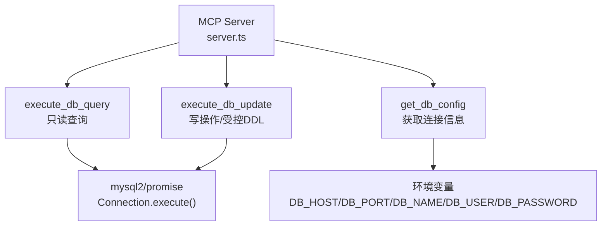
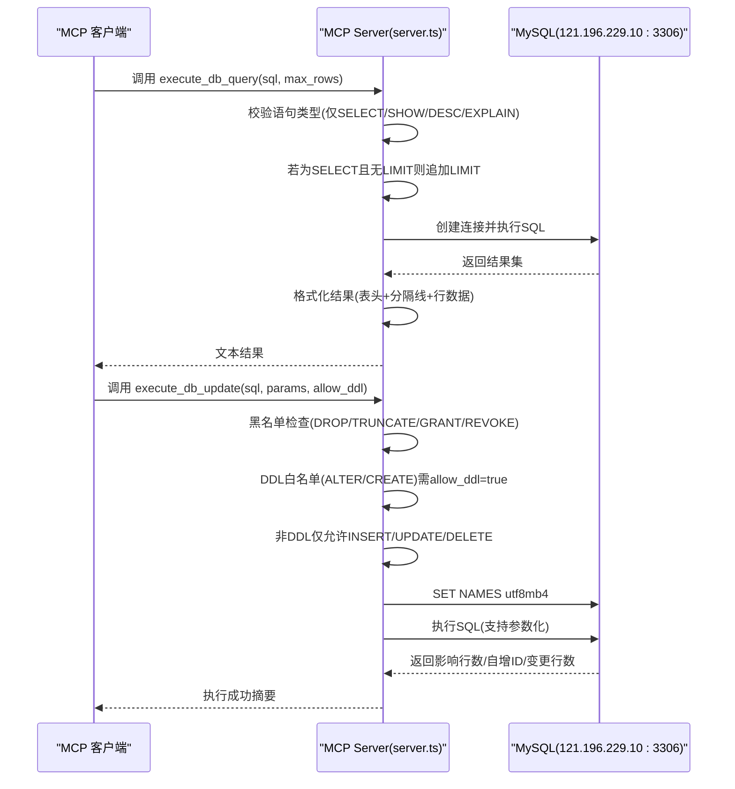
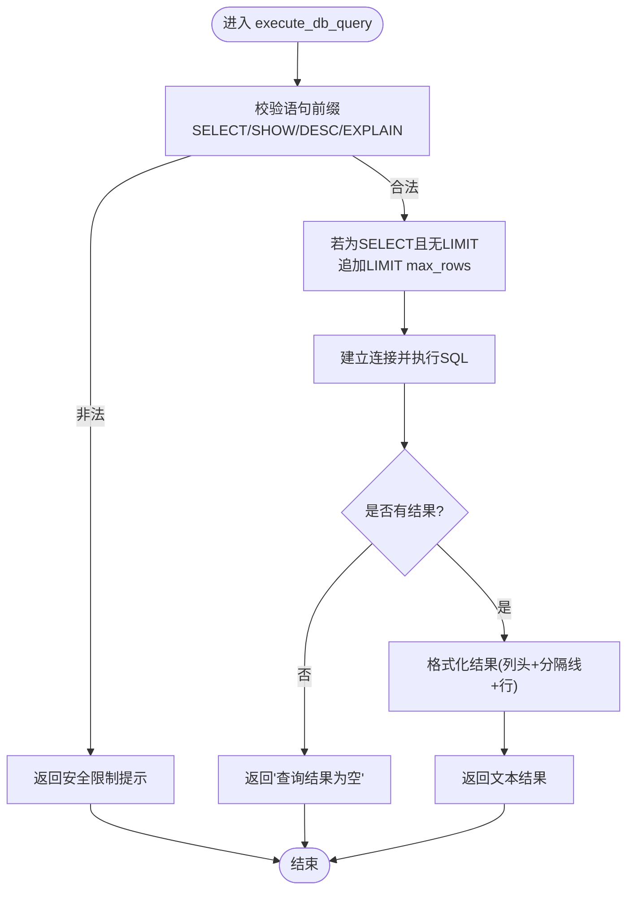
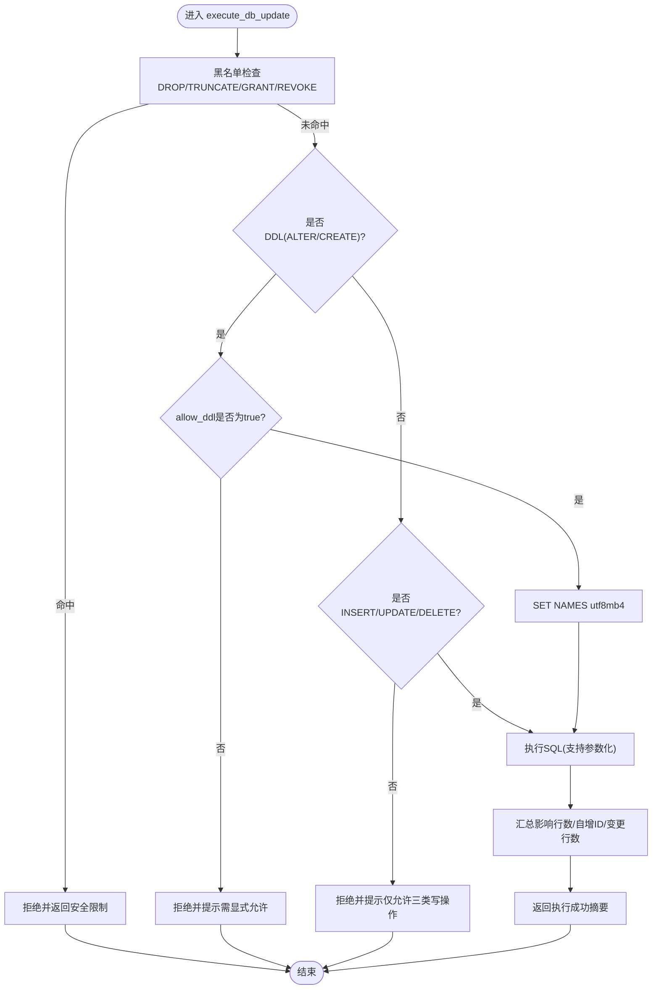
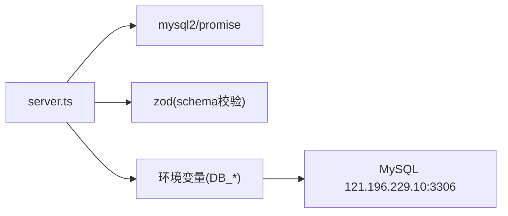

# MySQL数据库操作工具

<cite>
**本文引用的文件**   
- [server.ts](file://course_record_mcp_server/server.ts)
- [CLAUDE.md](file://CLAUDE.md)
</cite>

## 目录
1. [简介](#简介)
2. [项目结构](#项目结构)
3. [核心组件](#核心组件)
4. [架构总览](#架构总览)
5. [详细组件分析](#详细组件分析)
6. [依赖关系分析](#依赖关系分析)
7. [性能与连接池](#性能与连接池)
8. [事务处理](#事务处理)
9. [安全与注入防护](#安全与注入防护)
10. [API调用示例](#api调用示例)
11. [错误处理模式](#错误处理模式)
12. [最佳实践](#最佳实践)
13. [故障排查指南](#故障排查指南)
14. [结论](#结论)

## 简介
本文件面向使用 MCP Server 提供的 MySQL 数据库操作工具的开发者，聚焦以下两个核心工具：
- execute_db_query：只读查询工具，支持 SELECT/SHOW/DESC/EXPLAIN，具备自动 LIMIT 保护与结果集格式化输出。
- execute_db_update：写操作工具，支持 INSERT/UPDATE/DELETE，DDL 需显式开启 allow_ddl=true；DROP/TRUNCATE/GRANT/REVOKE 始终禁止。

文档同时覆盖参数化查询、SQL 注入防护、连接管理现状、事务处理建议、错误处理模式与最佳实践，并提供可直接参考的 API 调用示例路径。

## 项目结构
MCP Server 为单文件实现（Node.js + TypeScript），所有工具注册在 server.ts 中。MySQL 相关工具位于该文件的“Database Tools”区域。

图表来源
- [server.ts:276-346](file://course_record_mcp_server/server.ts#L276-L346)
- [server.ts:244-275](file://course_record_mcp_server/server.ts#L244-L275)

章节来源
- [server.ts:276-346](file://course_record_mcp_server/server.ts#L276-L346)
- [CLAUDE.md:73-74](file://CLAUDE.md#L73-L74)

## 核心组件
- get_db_config：返回当前数据库连接信息（主机、端口、库名、用户、JDBC URL、mysqldump 命令等）。
- execute_db_query：执行只读 SQL，限制语句类型，自动追加 LIMIT，并以表格文本形式返回结果。
- execute_db_update：执行写入或受限 DDL，严格白名单校验与危险操作黑名单拦截，支持参数化。

章节来源
- [server.ts:244-275](file://course_record_mcp_server/server.ts#L244-L275)
- [server.ts:276-346](file://course_record_mcp_server/server.ts#L276-L346)

## 架构总览
下图展示了从 MCP 客户端到 MySQL 的端到端流程，包括安全校验、参数化执行与结果返回。

图表来源
- [server.ts:276-346](file://course_record_mcp_server/server.ts#L276-L346)

## 详细组件分析

### 组件：execute_db_query
- 功能
  - 仅允许 SELECT/SHOW/DESC/EXPLAIN 四类语句。
  - 对 SELECT 自动追加 LIMIT（当未显式包含 LIMIT 时），默认最大返回行数由 max_rows 控制。
  - 将结果集格式化为“列头 | 分隔线 | 逐行列值”的纯文本表格。
- 输入参数
  - sql：字符串，限定为上述四类语句之一。
  - max_rows：数字，默认 100，用于限制返回行数。
- 输出
  - 成功：包含行数的提示与格式化后的表格文本。
  - 空结果：返回“查询结果为空”。
  - 异常：返回“查询失败：{错误信息}”。
- 安全要点
  - 语句前缀白名单校验。
  - 自动 LIMIT 防止全表扫描。
  - 不拼接用户输入到 SQL 中（直接执行传入的 sql 字符串）。
- 连接与资源
  - 每次调用新建连接，finally 中关闭连接。

图表来源
- [server.ts:276-307](file://course_record_mcp_server/server.ts#L276-L307)

章节来源
- [server.ts:276-307](file://course_record_mcp_server/server.ts#L276-L307)

### 组件：execute_db_update
- 功能
  - 支持 INSERT/UPDATE/DELETE。
  - DDL（ALTER/CREATE）需要显式设置 allow_ddl=true 才允许执行。
  - DROP/TRUNCATE/GRANT/REVOKE 在任何情况下均被拒绝。
  - 支持参数化查询，通过 params 数组传入参数值。
- 输入参数
  - sql：字符串，限定为上述允许的操作。
  - params：任意值数组，作为参数化占位符的值。
  - allow_ddl：布尔，默认 false；设为 true 才允许 DDL。
- 输出
  - 成功：返回影响行数、自增ID（如有）、变更行数（如存在差异）。
  - 异常：返回“执行失败：{错误信息}”。
- 安全要点
  - 黑名单：DROP/TRUNCATE/GRANT/REVOKE 一律拒绝。
  - DDL 白名单：仅 ALTER/CREATE，且需 allow_ddl=true。
  - 非 DDL 白名单：仅 INSERT/UPDATE/DELETE。
  - 参数化：优先使用 params 避免 SQL 注入。
- 连接与资源
  - 每次调用新建连接，执行前设置字符集为 utf8mb4，finally 中关闭连接。

图表来源
- [server.ts:309-346](file://course_record_mcp_server/server.ts#L309-L346)

章节来源
- [server.ts:309-346](file://course_record_mcp_server/server.ts#L309-L346)

### 组件：get_db_config
- 功能：返回数据库连接信息（地址、端口、库名、用户、JDBC URL、mysqldump 命令等）。
- 用途：便于运维快速定位连接配置，无需查看敏感密码。

章节来源
- [server.ts:244-275](file://course_record_mcp_server/server.ts#L244-L275)

## 依赖关系分析
- 运行时依赖
  - mysql2/promise：提供异步连接与 execute 方法。
  - zod：用于输入参数校验（schema 定义）。
- 外部系统
  - MySQL 实例：121.196.229.10:3306，数据库 class_times_record。
- 环境变量
  - DB_HOST、DB_PORT、DB_NAME、DB_USER、DB_PASSWORD 注入连接凭据。

图表来源
- [server.ts:1-10](file://course_record_mcp_server/server.ts#L1-L10)
- [server.ts:34-38](file://course_record_mcp_server/server.ts#L34-L38)

章节来源
- [server.ts:1-10](file://course_record_mcp_server/server.ts#L1-L10)
- [server.ts:34-38](file://course_record_mcp_server/server.ts#L34-L38)

## 性能与连接池
- 当前实现
  - 每次工具调用通过 createConnection 新建连接，并在 finally 中 end 关闭。
  - 未使用连接池（pool），在高并发场景下可能产生频繁建连/断连开销。
- 建议
  - 引入连接池（例如 mysql2/promise 的 pool）以复用连接，降低延迟与资源消耗。
  - 合理配置池大小、超时与空闲回收策略。
  - 对长耗时查询增加超时控制与分页/限流。

章节来源
- [server.ts:265-275](file://course_record_mcp_server/server.ts#L265-L275)
- [server.ts:288-306](file://course_record_mcp_server/server.ts#L288-L306)
- [server.ts:331-345](file://course_record_mcp_server/server.ts#L331-L345)

## 事务处理
- 当前实现
  - 每个工具调用独立执行单个 SQL，未封装事务边界。
- 建议
  - 对于多步写操作，应在同一连接上开启事务（START TRANSACTION），按业务逻辑提交或回滚。
  - 注意：当前实现每次调用新建连接，如需事务，应改为在同一连接内顺序执行多条语句，或在更高层面编排事务。

章节来源
- [server.ts:288-306](file://course_record_mcp_server/server.ts#L288-L306)
- [server.ts:331-345](file://course_record_mcp_server/server.ts#L331-L345)

## 安全与注入防护
- 只读工具（execute_db_query）
  - 语句类型白名单：仅允许 SELECT/SHOW/DESC/EXPLAIN。
  - 自动 LIMIT：对 SELECT 若无 LIMIT 则追加，防止全表扫描。
  - 注意：当前实现直接执行传入的 sql 字符串，未进行参数化绑定。
- 写工具（execute_db_update）
  - 黑名单：DROP/TRUNCATE/GRANT/REVOKE 一律拒绝。
  - DDL 白名单：仅 ALTER/CREATE，且需显式 allow_ddl=true。
  - 非 DDL 白名单：仅 INSERT/UPDATE/DELETE。
  - 参数化：支持 params 数组，推荐用于防止 SQL 注入。
- 全局约束
  - 生产环境数据库访问通过 MCP 工具统一入口，避免直连。
  - 敏感凭据通过环境变量注入，不在代码中硬编码。

章节来源
- [server.ts:276-346](file://course_record_mcp_server/server.ts#L276-L346)
- [CLAUDE.md:73-74](file://CLAUDE.md#L73-L74)

## API调用示例
以下为常用调用方式的路径参考（请根据实际上下文替换参数）：
- 获取数据库连接信息
  - 工具：get_db_config
  - 参考路径：[server.ts:244-275](file://course_record_mcp_server/server.ts#L244-L275)
- 只读查询（带自动 LIMIT）
  - 工具：execute_db_query
  - 参数：sql="SELECT ...", max_rows=100
  - 参考路径：[server.ts:276-307](file://course_record_mcp_server/server.ts#L276-L307)
- 写操作（INSERT/UPDATE/DELETE）
  - 工具：execute_db_update
  - 参数：sql="INSERT/UPDATE/DELETE ...", params=[...], allow_ddl=false
  - 参考路径：[server.ts:309-346](file://course_record_mcp_server/server.ts#L309-L346)
- 受限 DDL（ALTER/CREATE）
  - 工具：execute_db_update
  - 参数：sql="ALTER/CREATE ...", allow_ddl=true
  - 参考路径：[server.ts:309-346](file://course_record_mcp_server/server.ts#L309-L346)

章节来源
- [server.ts:244-346](file://course_record_mcp_server/server.ts#L244-L346)

## 错误处理模式
- 只读查询
  - 空结果：返回“查询结果为空”。
  - 异常：返回“查询失败：{错误信息}”。
- 写操作
  - 安全拒绝：返回明确的安全限制提示（如“禁止执行 DROP/TRUNCATE/GRANT/REVOKE 操作”、“检测到 DDL 操作，如需执行请设置 allow_ddl=true...”）。
  - 异常：返回“执行失败：{错误信息}”。
- 连接与资源
  - 无论成功或异常，均在 finally 中确保连接关闭，避免泄漏。

章节来源
- [server.ts:276-346](file://course_record_mcp_server/server.ts#L276-L346)

## 最佳实践
- 查询侧
  - 尽量使用明确的 WHERE 条件，配合 max_rows 控制返回量。
  - 复杂查询可先用 EXPLAIN 分析执行计划。
- 写操作侧
  - 优先使用参数化（params）以避免 SQL 注入。
  - 谨慎开启 allow_ddl，仅在必要时执行 ALTER/CREATE。
  - 批量更新建议使用分批提交，避免长时间锁表。
- 连接与事务
  - 高并发场景建议引入连接池。
  - 多步写操作建议在应用层组织事务，保证一致性。
- 安全合规
  - 遵循最小权限原则，数据库账号仅授予必要权限。
  - 审计关键写操作与 DDL 变更。

[本节为通用指导，不直接分析具体文件]

## 故障排查指南
- 无法连接数据库
  - 检查环境变量 DB_HOST/DB_PORT/DB_NAME/DB_USER/DB_PASSWORD 是否正确。
  - 参考路径：[server.ts:34-38](file://course_record_mcp_server/server.ts#L34-L38)
- 查询结果为空
  - 确认 SQL 条件与数据是否存在；适当调整 max_rows。
  - 参考路径：[server.ts:295-301](file://course_record_mcp_server/server.ts#L295-L301)
- 执行失败
  - 查看返回的错误信息，核对 SQL 语法与权限。
  - 参考路径：[server.ts:302-306](file://course_record_mcp_server/server.ts#L302-L306), [server.ts:341-345](file://course_record_mcp_server/server.ts#L341-L345)
- 安全限制报错
  - 确认语句类型是否在白名单内；DDL 是否已显式 allow_ddl=true。
  - 参考路径：[server.ts:284-286](file://course_record_mcp_server/server.ts#L284-L286), [server.ts:318-330](file://course_record_mcp_server/server.ts#L318-L330)

章节来源
- [server.ts:34-38](file://course_record_mcp_server/server.ts#L34-L38)
- [server.ts:284-306](file://course_record_mcp_server/server.ts#L284-L306)
- [server.ts:318-345](file://course_record_mcp_server/server.ts#L318-L345)

## 结论
- execute_db_query 提供了安全的只读访问能力，具备语句类型白名单与自动 LIMIT 保护，适合日常查询与诊断。
- execute_db_update 在严格的白/黑名单规则下支持写操作与受限 DDL，并通过参数化机制增强安全性。
- 当前实现未使用连接池与事务封装，建议在后续迭代中引入连接池与事务编排，以提升性能与一致性保障。
- 结合环境变量注入与统一的 MCP 入口，可有效收敛数据库访问面，提升整体安全性与可观测性。

[本节为总结性内容，不直接分析具体文件]