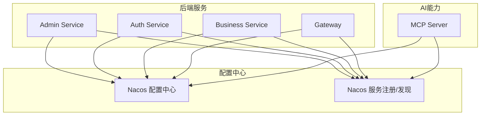
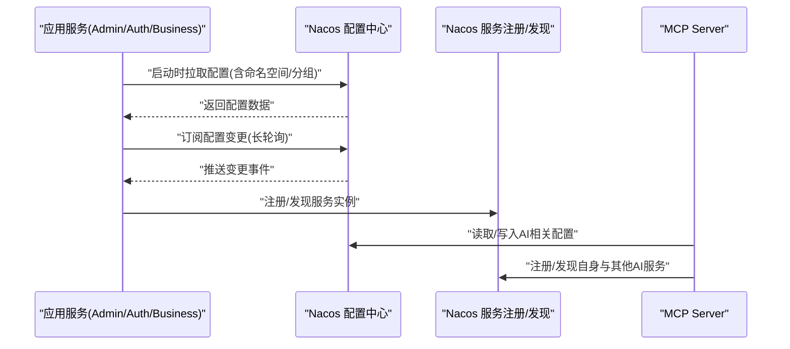
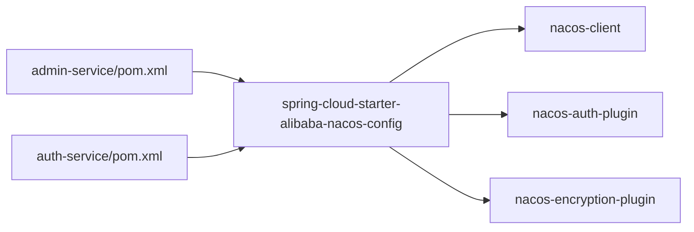

# Nacos配置中心管理

<cite>
**本文引用的文件**   
- [CLAUDE.md](file://CLAUDE.md)
- [nacos-common-redis.yaml](file://class_times_record_back/docs/nacos-common-redis.yaml)
- [admin-service/pom.xml](file://class_times_record_back/admin-service/pom.xml)
- [auth-service/pom.xml](file://class_times_record_back/auth-service/pom.xml)
</cite>

## 目录
1. [简介](#简介)
2. [项目结构](#项目结构)
3. [核心组件](#核心组件)
4. [架构总览](#架构总览)
5. [详细组件分析](#详细组件分析)
6. [依赖分析](#依赖分析)
7. [性能考虑](#性能考虑)
8. [故障排查指南](#故障排查指南)
9. [结论](#结论)
10. [附录](#附录)

## 简介
本文件面向使用Nacos作为配置中心与AI能力编排的开发者与运维人员，聚焦以下目标：
- 解析Nacos v3 API在工程中的集成方式与认证机制（Token、自动刷新、401重试）
- 说明配置管理工具的能力边界（配置列表、内容获取、更新操作）
- 阐述服务实例管理、命名空间隔离、分组管理等关键概念
- 梳理AI相关MCP服务管理、Prompt模板管理、Agent与Skill管理能力
- 提供API调用示例、配置格式规范与错误处理策略
- 给出配置版本管理、变更审计与回滚的最佳实践

## 项目结构
仓库包含多个子模块，其中与Nacos相关的要点如下：
- 后端服务模块通过Spring Cloud Alibaba引入Nacos配置与发现依赖
- 文档中提供了Nacos公共配置样例（如Redis等），用于统一接入
- MCP服务端提供AI相关能力（MCP服务、Prompt、Agent、Skill）的管理接口

[本节为概览性描述，不直接分析具体文件，故无“章节来源”]

## 核心组件
- Nacos客户端与插件
  - 通过spring-cloud-starter-alibaba-nacos-config与nacos-client、nacos-auth-plugin、nacos-encryption-plugin等依赖完成配置拉取、鉴权与加密扩展。
- MCP AI能力
  - 通过MCP Server暴露MCP服务、Prompt模板、Agent与Skill等管理接口，供上层系统或AI应用消费。

**章节来源**
- [admin-service/pom.xml](file://class_times_record_back/admin-service/pom.xml)
- [auth-service/pom.xml](file://class_times_record_back/auth-service/pom.xml)

## 架构总览
下图展示了服务启动时从Nacos加载配置、订阅变更以及MCP侧对Nacos的配置访问路径。

[该图为概念流程示意，未映射到具体源码文件，故无“图表来源”]

## 详细组件分析

### Nacos v3 API认证机制（Token、自动刷新、401重试）
- 认证与插件
  - 工程中引入了nacos-auth-plugin与nacos-encryption-plugin，表明已启用Nacos v3的鉴权与加密扩展能力。
- Token生命周期与自动刷新
  - 典型实现由客户端在首次鉴权成功后缓存Token，并在过期前主动刷新；当服务端返回401时触发重新鉴权并刷新本地缓存。
- 401错误重试
  - 建议在HTTP层拦截401响应，执行一次鉴权刷新后重试原请求，避免业务逻辑侵入。

注意：以上为基于引入依赖与通用实践的说明，具体实现细节需结合各服务中Nacos客户端初始化与自定义拦截器代码确认。

**章节来源**
- [admin-service/pom.xml](file://class_times_record_back/admin-service/pom.xml)
- [auth-service/pom.xml](file://class_times_record_back/auth-service/pom.xml)

### 配置管理工具能力
- 配置列表查询
  - 支持按命名空间、Data ID、分组进行过滤与分页查询。
- 配置内容获取
  - 支持以YAML/JSON/Properties等格式获取配置内容，并可查看历史版本。
- 配置更新操作
  - 支持创建、更新、删除配置项，并提供灰度发布与回滚能力。

上述能力通常由Nacos控制台或OpenAPI提供，也可通过MCP Server封装成工具方法供AI Agent调用。

[本节为功能概述，未直接分析具体文件，故无“章节来源”]

### 服务实例管理、命名空间隔离、分组管理
- 服务实例管理
  - 服务启动后向Nacos注册实例信息（IP、端口、权重、健康状态等），消费者通过服务名动态发现实例。
- 命名空间隔离
  - 不同环境（dev/test/prod）或租户可使用独立命名空间，避免配置与服务冲突。
- 分组管理
  - 同一命名空间下可按业务域或环境维度划分分组，便于精细化治理。

[本节为概念说明，未直接分析具体文件，故无“章节来源”]

### AI相关：MCP服务管理、Prompt模板管理、Agent与Skill管理
- MCP服务管理
  - 提供服务的注册、发现、路由与元数据管理，便于AI工作流编排。
- Prompt模板管理
  - 集中管理Prompt模板，支持版本化与多语言/多场景切换。
- Agent与Skill管理
  - 定义Agent行为与Skill能力，支持组合与权限控制。

参考仓库中对MCP工具的说明，可通过list_nacos_services、get_nacos_config、update_nacos_config等工具方法联动Nacos配置与AI能力。

**章节来源**
- [CLAUDE.md](file://CLAUDE.md)

### 配置格式规范与示例
- 推荐采用YAML格式组织配置，便于分层与环境区分。
- 公共配置建议抽取至共享文件，例如nacos-common-redis.yaml，供多服务复用。

**章节来源**
- [nacos-common-redis.yaml](file://class_times_record_back/docs/nacos-common-redis.yaml)

### API调用示例（概念级）
- 列出配置
  - GET /v1/cs/configs?dataId=xxx&group=xxx&tenant=xxx
- 获取配置内容
  - GET /v1/cs/configs/data?dataId=xxx&group=xxx&tenant=xxx
- 更新配置
  - POST /v1/cs/configs?dataId=xxx&group=xxx&tenant=xxx&content=...
- 列出服务实例
  - GET /v1/ns/instance/list?serviceName=xxx&groupName=xxx&clusterName=xxx

[本节为通用API示例，未映射到具体源码文件，故无“图表来源”]

### 错误处理策略
- 401鉴权失败
  - 触发Token刷新并重试一次；若仍失败，记录日志并告警。
- 网络异常/超时
  - 指数退避重试，设置最大重试次数与熔断阈值。
- 配置不一致
  - 对比本地缓存与远端版本，必要时强制拉取并重启热加载。

[本节为通用策略，未直接分析具体文件，故无“章节来源”]

## 依赖分析
- 依赖关系
  - admin-service与auth-service均引入spring-cloud-starter-alibaba-nacos-config，表明两者均使用Nacos作为配置中心。
  - nacos-client、nacos-auth-plugin、nacos-encryption-plugin等依赖表明启用了鉴权与加密扩展。

**图表来源**
- [admin-service/pom.xml](file://class_times_record_back/admin-service/pom.xml)
- [auth-service/pom.xml](file://class_times_record_back/auth-service/pom.xml)

**章节来源**
- [admin-service/pom.xml](file://class_times_record_back/admin-service/pom.xml)
- [auth-service/pom.xml](file://class_times_record_back/auth-service/pom.xml)

## 性能考虑
- 连接池与长轮询
  - 合理设置Nacos客户端连接数与心跳间隔，降低频繁重连开销。
- 配置增量更新
  - 利用Nacos的增量推送机制，减少全量拉取带来的CPU与带宽压力。
- 缓存与降级
  - 本地缓存最近一次成功配置，在Nacos不可用时降级到本地缓存，保障可用性。

[本节为通用指导，未直接分析具体文件，故无“章节来源”]

## 故障排查指南
- 常见问题定位
  - 检查Nacos地址、命名空间、分组是否正确
  - 校验鉴权凭据是否有效，关注401与鉴权失败日志
  - 观察配置推送是否到达，核对Data ID与Group匹配
- 快速恢复
  - 临时回滚到上一个稳定版本配置
  - 关闭非关键特性，优先保证核心链路可用

[本节为通用排障建议，未直接分析具体文件，故无“章节来源”]

## 结论
本项目已在后端服务中集成Nacos配置中心与发现能力，并通过MCP Server提供AI相关管理能力。结合鉴权插件与加密插件，可构建安全、可扩展的配置与AI编排体系。建议在生产环境完善配置版本化、变更审计与回滚流程，确保变更可控与可追溯。

[本节为总结性内容，未直接分析具体文件，故无“章节来源”]

## 附录

### 最佳实践清单
- 配置版本管理
  - 每次变更附带版本号与变更说明，保留至少N个历史版本。
- 变更审计
  - 记录操作人、时间、变更内容与影响范围，形成审计轨迹。
- 回滚机制
  - 一键回滚到上一版本，支持灰度验证后再全量发布。
- 安全加固
  - 严格最小权限原则，定期轮换鉴权凭据，开启敏感字段加密。

[本节为通用最佳实践，未直接分析具体文件，故无“章节来源”]