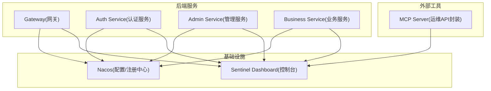
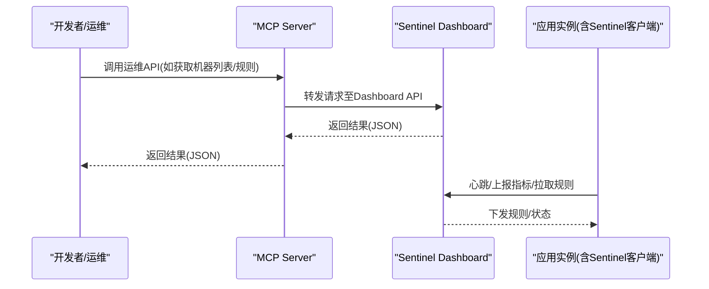
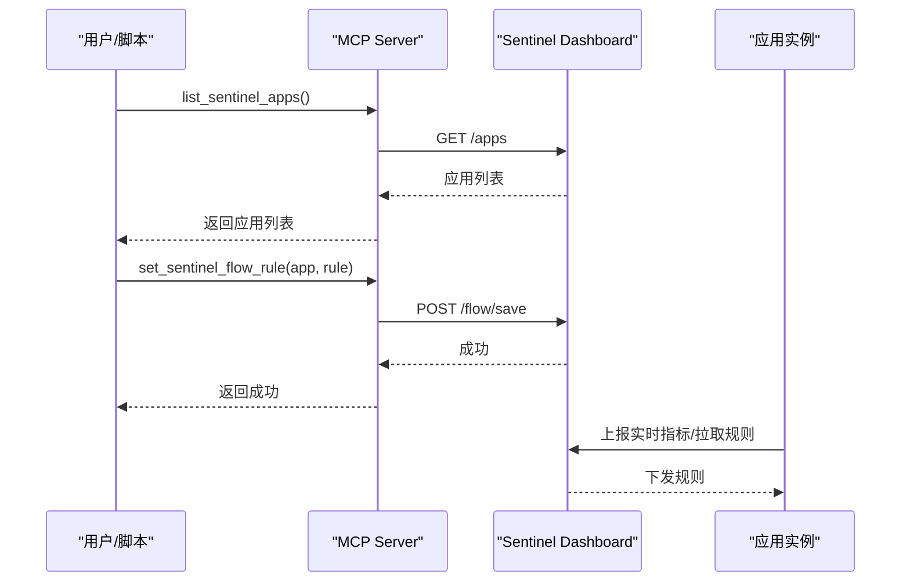
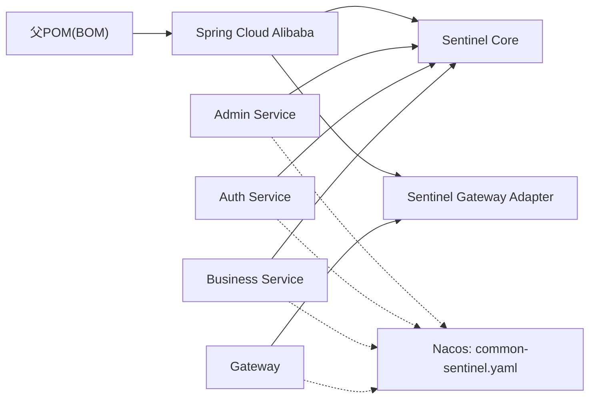

# Sentinel流量监控

<cite>
**本文引用的文件**
- [CLAUDE.md](file://CLAUDE.md)
- [pom.xml](file://class_times_record_back/pom.xml)
- [admin-service/pom.xml](file://class_times_record_back/admin-service/pom.xml)
- [auth-service/pom.xml](file://class_times_record_back/auth-service/pom.xml)
- [business-service/pom.xml](file://class_times_record_back/business-service/pom.xml)
- [gateway/pom.xml](file://class_times_record_back/gateway/pom.xml)
- [admin-service/src/main/resources/application.yml](file://class_times_record_back/admin-service/src/main/resources/application.yml)
</cite>

## 目录
1. [简介](#简介)
2. [项目结构](#项目结构)
3. [核心组件](#核心组件)
4. [架构总览](#架构总览)
5. [详细组件分析](#详细组件分析)
6. [依赖分析](#依赖分析)
7. [性能考虑](#性能考虑)
8. [故障排查指南](#故障排查指南)
9. [结论](#结论)
10. [附录](#附录)

## 简介
本文件围绕Sentinel在系统中的集成与使用，聚焦以下目标：
- 解析Sentinel Dashboard的认证机制（Cookie登录、会话保持、自动重登）在本仓库中的现状与可落地建议。
- 梳理与Sentinel相关的API调用能力（实时监控、规则管理、熔断降级配置），并给出基于现有MCP Server暴露能力的操作指引。
- 说明限流规则查看、热点参数监控、系统负载监控等功能的实践方法。
- 提供完整的API调用示例、监控数据解读与告警配置指南。
- 给出性能调优建议与常见问题排查方法。

## 项目结构
本项目为Spring Cloud Alibaba微服务工程，包含网关、认证、业务与管理服务，并通过Nacos进行配置与发现。Sentinel作为流量治理组件，通过starter引入并在运行时与Dashboard交互。

图表来源
- [pom.xml:50-57](file://class_times_record_back/pom.xml#L50-L57)
- [admin-service/pom.xml:47-52](file://class_times_record_back/admin-service/pom.xml#L47-L52)
- [auth-service/pom.xml:61](file://class_times_record_back/auth-service/pom.xml#L61)
- [business-service/pom.xml](file://class_times_record_back/business-service/pom.xml)
- [gateway/pom.xml](file://class_times_record_back/gateway/pom.xml)
- [CLAUDE.md:234](file://CLAUDE.md#L234)

章节来源
- [pom.xml:1-162](file://class_times_record_back/pom.xml#L1-L162)
- [CLAUDE.md:67](file://CLAUDE.md#L67)
- [CLAUDE.md:234](file://CLAUDE.md#L234)

## 核心组件
- Spring Cloud Alibaba Starter
  - 各服务通过spring-cloud-starter-alibaba-sentinel接入Sentinel，实现应用侧的限流、熔断、降级能力。
- Sentinel Gateway Adapter
  - 网关层通过sentinel-gateway适配，对路由级或全局维度进行流量控制。
- Nacos动态配置
  - 通过application.yml的spring.config.import从Nacos拉取common-sentinel.yaml，实现规则热更新。
- MCP Server运维API
  - 提供list/get/set/delete等统一接口，屏蔽不同中间件差异，便于自动化与平台化。

章节来源
- [admin-service/pom.xml:47-52](file://class_times_record_back/admin-service/pom.xml#L47-L52)
- [auth-service/pom.xml:61](file://class_times_record_back/auth-service/pom.xml#L61)
- [admin-service/src/main/resources/application.yml:8](file://class_times_record_back/admin-service/src/main/resources/application.yml#L8)
- [CLAUDE.md:234](file://CLAUDE.md#L234)

## 架构总览
下图展示了Sentinel在系统中的位置与交互关系：应用进程内嵌入Sentinel客户端，向Dashboard上报指标并接收规则；MCP Server作为统一入口，对外暴露运维API，内部转发到Sentinel控制台。

图表来源
- [CLAUDE.md:234](file://CLAUDE.md#L234)

## 详细组件分析

### 一、Sentinel Dashboard认证机制（Cookie登录、会话保持、自动重登）
- 现状说明
  - 仓库中未包含Dashboard源码或自定义鉴权逻辑，因此默认采用官方Dashboard的内置认证模型。
  - 官方Dashboard通常以Cookie维持登录态，浏览器关闭后若Cookie过期则需重新登录；前端可通过“自动重登”策略在检测到401时跳转登录页或刷新Token。
- 在本项目的落地建议
  - 若需要统一单点登录或无感续期，可在网关层或反向代理层做统一鉴权透传，或在Dashboard前加一层鉴权网关（例如JWT校验+Cookie注入）。
  - 前端在访问Dashboard页面时，若检测到会话失效，应引导用户重新登录，并在成功后携带Cookie再次进入。
- 相关参考
  - 运维API清单由MCP Server提供，可用于自动化场景绕过交互式登录。

章节来源
- [CLAUDE.md:234](file://CLAUDE.md#L234)

### 二、Sentinel规则管理与实时监控（基于MCP Server）
- 可用能力（来自MCP Server）
  - 应用与机器管理：list_sentinel_apps、get_sentinel_machines、remove_sentinel_machine
  - 规则管理：get/set/remove/delete 限流与熔断降级规则
- 典型流程（以设置限流规则为例）
  - 步骤1：获取应用列表，确认目标应用名
  - 步骤2：构造限流规则（资源名、阈值、策略、热点参数等）
  - 步骤3：调用set接口写入规则
  - 步骤4：验证规则生效（查看实时指标或规则列表）

图表来源
- [CLAUDE.md:234](file://CLAUDE.md#L234)

章节来源
- [CLAUDE.md:234](file://CLAUDE.md#L234)

### 三、限流规则查看与热点参数监控
- 查看规则
  - 通过MCP Server的查询接口获取当前应用的限流规则集合，关注资源名、阈值类型（QPS/线程数）、策略（直接拒绝/预热/匀速排队）及热点参数配置。
- 热点参数监控
  - 在Dashboard中打开对应应用的“热点参数”视图，观察热点项分布、被限流次数与占比，结合业务特征调整阈值或参数过滤条件。
- 实战要点
  - 热点参数适合针对特定入参（如userId、itemId）进行精细化限流。
  - 建议配合白名单与黑名单策略，避免误伤正常流量。

章节来源
- [CLAUDE.md:234](file://CLAUDE.md#L234)

### 四、系统负载监控与熔断降级
- 系统负载监控
  - 在Dashboard“系统负载”页面查看CPU、Load、内存、网络IO等指标，结合Sentinel的系统自适应保护阈值进行整体防护。
- 熔断降级
  - 根据慢调用比例、异常比例或异常数设置熔断策略，选择快速失败、抛出异常或返回兜底数据。
  - 建议在关键链路（如第三方依赖、数据库连接）启用熔断，避免雪崩。

章节来源
- [CLAUDE.md:234](file://CLAUDE.md#L234)

### 五、网关层限流（Sentinel Gateway）
- 适用场景
  - 对全局或按路由维度进行限流，保护下游服务不被突发流量打垮。
- 配置方式
  - 在网关模块引入sentinel-gateway，并通过Nacos推送网关规则（如URL模式、白名单、QPS阈值）。
- 效果验证
  - 在Dashboard的“网关”视图查看命中统计与拒绝情况。

章节来源
- [admin-service/pom.xml:52](file://class_times_record_back/admin-service/pom.xml#L52)
- [gateway/pom.xml](file://class_times_record_back/gateway/pom.xml)

## 依赖分析
- 版本与BOM
  - 父POM统一管理Spring Cloud Alibaba与Spring Cloud版本，确保Sentinel与其生态兼容。
- 模块引入
  - admin-service、auth-service、business-service均引入sentinel starter；gateway引入sentinel-gateway适配器。
- 配置加载
  - application.yml通过spring.config.import从Nacos导入common-sentinel.yaml，支持动态刷新。

图表来源
- [pom.xml:50-57](file://class_times_record_back/pom.xml#L50-L57)
- [admin-service/pom.xml:47-52](file://class_times_record_back/admin-service/pom.xml#L47-L52)
- [auth-service/pom.xml:61](file://class_times_record_back/auth-service/pom.xml#L61)
- [admin-service/src/main/resources/application.yml:8](file://class_times_record_back/admin-service/src/main/resources/application.yml#L8)

章节来源
- [pom.xml:1-162](file://class_times_record_back/pom.xml#L1-L162)
- [admin-service/src/main/resources/application.yml:8](file://class_times_record_back/admin-service/src/main/resources/application.yml#L8)

## 性能考虑
- 采集粒度与采样率
  - 合理设置采样周期与采样窗口，避免过多指标导致Dashboard与客户端压力过大。
- 规则数量与复杂度
  - 规则过多会增加匹配开销，建议按服务/路由分层组织，合并相似规则。
- 热点参数与长尾
  - 热点参数过多会增大内存占用，建议仅对高频且必要的参数开启热点检测。
- 网关限流前置
  - 将粗粒度限流放在网关层，减少无效请求进入业务服务。
- 动态配置刷新
  - 利用Nacos推送规则，避免重启发布，降低抖动风险。

[本节为通用指导，不直接分析具体文件]

## 故障排查指南
- 无法连接Dashboard
  - 检查Sentinel地址与端口是否正确，网络可达性与防火墙策略。
  - 确认应用是否成功启动并上报心跳。
- 规则未生效
  - 核对Nacos中common-sentinel.yaml内容是否已推送并刷新。
  - 在Dashboard查看规则列表与实时指标，确认资源名与阈值匹配。
- 频繁触发限流
  - 检查热点参数是否误判，适当放宽阈值或增加白名单。
  - 评估是否为恶意刷量，必要时在网关层加强防护。
- 认证问题（Dashboard）
  - 若出现401或会话丢失，检查浏览器Cookie与自动重登策略。
  - 在自动化场景中优先使用MCP Server提供的API，避免交互式登录。

章节来源
- [CLAUDE.md:234](file://CLAUDE.md#L234)

## 结论
- 本项目已在多服务中引入Sentinel，并通过Nacos集中管理配置，具备完善的限流、熔断与降级能力基础。
- 借助MCP Server暴露的运维API，可实现对Sentinel的统一管控与自动化编排。
- 对于Dashboard的认证与会话管理，建议结合统一鉴权网关或平台化方案提升安全性与用户体验。

[本节为总结性内容，不直接分析具体文件]

## 附录

### A. 常用运维API清单（来自MCP Server）
- 应用与机器
  - list_sentinel_apps
  - get_sentinel_machines
  - remove_sentinel_machine
- 限流规则
  - get_sentinel_flow_rules
  - set_sentinel_flow_rule
  - delete_sentinel_flow_rule
- 熔断降级规则
  - get_sentinel_degrade_rules
  - set_sentinel_degrade_rule
  - delete_sentinel_degrade_rule

章节来源
- [CLAUDE.md:234](file://CLAUDE.md#L234)

### B. 配置加载路径
- 通过application.yml的spring.config.import从Nacos导入common-sentinel.yaml，实现规则热更新。

章节来源
- [admin-service/src/main/resources/application.yml:8](file://class_times_record_back/admin-service/src/main/resources/application.yml#L8)