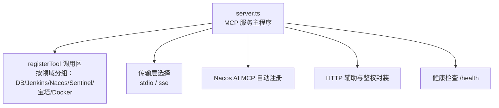
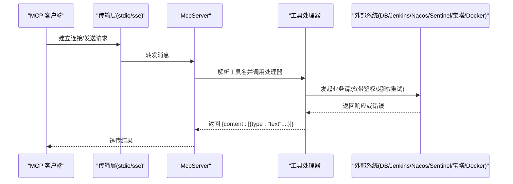
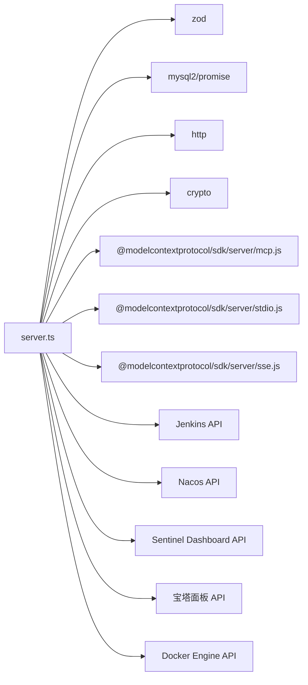

# 自定义工具开发

<cite>
**本文引用的文件**   
- [server.ts](file://course_record_mcp_server/server.ts)
</cite>

## 目录
1. [简介](#简介)
2. [项目结构](#项目结构)
3. [核心组件](#核心组件)
4. [架构总览](#架构总览)
5. [详细组件分析](#详细组件分析)
6. [依赖关系分析](#依赖关系分析)
7. [性能与可靠性](#性能与可靠性)
8. [故障排查指南](#故障排查指南)
9. [结论](#结论)
10. [附录：自定义工具开发示例与最佳实践](#附录自定义工具开发示例与最佳实践)

## 简介
本文件面向希望在 MCP Server 中开发“自定义工具”的工程师，围绕 server.registerTool 注册机制、inputSchema（基于 zod）参数校验与默认值、工具函数实现模式（含异步处理与错误返回格式）、横切关注点（权限控制、日志记录、性能监控），以及测试、调试与部署的最佳实践进行系统化说明。文档以仓库中的 course_record_mcp_server/server.ts 为唯一代码依据，结合其中已实现的数据库、Jenkins、Nacos、Sentinel、宝塔面板、Docker 等工具样例，提炼出可复用的开发范式。

## 项目结构
MCP 服务位于 course_record_mcp_server 目录下，核心入口与全部工具定义集中在 server.ts。该文件包含：
- 环境变量与配置读取
- HTTP 通用封装与鉴权辅助
- 各子系统（DB/Jenkins/Nacos/Sentinel/宝塔/Docker）的工具封装
- MCP Server 初始化、传输层选择（stdio/sse）与 Nacos AI MCP 自动注册
- 健康检查端点

图表来源
- [server.ts:2271-2376](file://course_record_mcp_server/server.ts#L2271-L2376)
- [server.ts:240-242](file://course_record_mcp_server/server.ts#L240-L242)

章节来源
- [server.ts:2271-2376](file://course_record_mcp_server/server.ts#L2271-L2376)
- [server.ts:240-242](file://course_record_mcp_server/server.ts#L240-L242)

## 核心组件
- MCP Server 实例与工具注册
  - 使用 McpServer 创建服务实例，并通过 registerTool(name, options, handler) 批量注册工具。
  - 每个工具包含 name、description、可选 inputSchema（zod schema），以及一个异步处理器函数。
- 输入参数校验与默认值
  - 通过 zod 在 inputSchema 中声明字段类型、描述与默认值；未提供的可选字段将使用默认值。
- 工具返回值规范
  - 所有工具统一返回 { content: [{ type: "text", text: "..." }] } 文本结果，便于 LLM 消费。
- 传输模式
  - stdio：本地进程内通信（默认）。
  - sse：HTTP SSE 模式，提供 /sse 连接端点与 /message 消息端点，并支持 /health 健康检查。
- 自动注册到 Nacos AI MCP
  - 启动后收集已注册工具元信息，构造服务端点与工具规格，向 Nacos v3 Admin API 注册或更新。

章节来源
- [server.ts:240-242](file://course_record_mcp_server/server.ts#L240-L242)
- [server.ts:243-261](file://course_record_mcp_server/server.ts#L243-L261)
- [server.ts:276-346](file://course_record_mcp_server/server.ts#L276-L346)
- [server.ts:2271-2376](file://course_record_mcp_server/server.ts#L2271-L2376)
- [server.ts:2115-2259](file://course_record_mcp_server/server.ts#L2115-L2259)

## 架构总览
下图展示了 MCP Server 的整体交互流程：客户端通过 stdio 或 SSE 与 server 通信，server 根据工具名路由到对应处理器，处理器调用外部系统（DB/Jenkins/Nacos/Sentinel/宝塔/Docker），并以统一文本格式返回。

图表来源
- [server.ts:2271-2376](file://course_record_mcp_server/server.ts#L2271-L2376)
- [server.ts:240-242](file://course_record_mcp_server/server.ts#L240-L242)

## 详细组件分析

### 1) 工具注册机制与参数规范
- 方法签名
  - server.registerTool(name, options, handler)
    - name：字符串，工具唯一标识
    - options：对象，至少包含 description；可选 inputSchema（zod schema）
    - handler：async (params) => { content: [...] }
- 关键约定
  - 返回值必须为 { content: [{ type: "text", text: "..." }] }
  - 异常需被捕获并转换为文本错误，避免抛出未处理异常
  - 敏感信息通过环境变量注入，不在代码中硬编码

章节来源
- [server.ts:243-261](file://course_record_mcp_server/server.ts#L243-L261)
- [server.ts:276-346](file://course_record_mcp_server/server.ts#L276-L346)
- [server.ts:349-410](file://course_record_mcp_server/server.ts#L349-L410)

### 2) inputSchema 与 zod 类型定义、验证与默认值
- 常用类型
  - z.string()、z.number()、z.boolean()、z.enum([...])、z.array(...)
- 默认值
  - 使用 .default(value) 为可选参数设置默认值
- 描述
  - 使用 .describe("...") 为字段添加人类可读说明，有助于生成文档与提示
- 示例要点
  - 查询类工具常包含分页、限制行数等参数
  - 写操作工具常包含安全开关（如 allow_ddl）
  - 枚举型参数用于约束行为分支（如 action=start|stop|restart）

章节来源
- [server.ts:276-346](file://course_record_mcp_server/server.ts#L276-L346)
- [server.ts:349-410](file://course_record_mcp_server/server.ts#L349-L410)
- [server.ts:902-939](file://course_record_mcp_server/server.ts#L902-L939)
- [server.ts:1968-1986](file://course_record_mcp_server/server.ts#L1968-L1986)

### 3) 工具函数实现模式与异步处理
- 统一模式
  - 前置校验（参数/权限/开关）→ 调用外部接口 → 格式化结果 → 统一返回
- 异步与并发
  - 使用 async/await；必要时并行调用（如 Docker 系统信息聚合）
- 错误处理
  - 外层 try/catch 捕获网络/IO 异常，返回文本错误
  - 对特定状态码做语义化转换（如 401 重登、304 幂等提示）
- 资源释放
  - 数据库连接在 finally 中关闭，避免泄漏

章节来源
- [server.ts:265-346](file://course_record_mcp_server/server.ts#L265-L346)
- [server.ts:2047-2079](file://course_record_mcp_server/server.ts#L2047-L2079)
- [server.ts:1893-1908](file://course_record_mcp_server/server.ts#L1893-L1908)

### 4) 错误返回格式与一致性
- 成功路径：返回文本内容，结构化展示关键信息
- 失败路径：返回明确错误原因（HTTP 状态、上游错误消息、业务错误码）
- 幂等与友好提示：例如容器已在运行/停止时返回 304 并给出提示

章节来源
- [server.ts:1968-1986](file://course_record_mcp_server/server.ts#L1968-L1986)
- [server.ts:302-346](file://course_record_mcp_server/server.ts#L302-L346)

### 5) 权限控制与安全策略
- 鉴权方式
  - Basic Auth（Jenkins）
  - Bearer Token（Nacos，自动刷新）
  - Cookie 会话（Sentinel、宝塔）
- 安全限制
  - SQL 白名单：仅允许 SELECT/SHOW/DESC/EXPLAIN；DDL 需要显式开关
  - 禁止危险命令：DROP/TRUNCATE/GRANT/REVOKE
- 最小权限原则
  - 通过环境变量注入凭据，避免硬编码
  - 对外暴露只读能力为主，写操作需显式确认

章节来源
- [server.ts:89-132](file://course_record_mcp_server/server.ts#L89-L132)
- [server.ts:137-181](file://course_record_mcp_server/server.ts#L137-L181)
- [server.ts:186-235](file://course_record_mcp_server/server.ts#L186-L235)
- [server.ts:1012-1101](file://course_record_mcp_server/server.ts#L1012-L1101)
- [server.ts:276-346](file://course_record_mcp_server/server.ts#L276-L346)

### 6) 日志记录与可观测性
- 运行时日志
  - 关键节点输出（SSE 连接、Nacos 注册、错误堆栈）
- 健康检查
  - /health 返回服务名、版本、活跃会话数等
- 指标建议（扩展）
  - 可在 httpFetch 或各工具处理器处增加耗时统计与错误计数

章节来源
- [server.ts:2271-2376](file://course_record_mcp_server/server.ts#L2271-L2376)
- [server.ts:2115-2259](file://course_record_mcp_server/server.ts#L2115-L2259)

### 7) 性能与稳定性
- 超时控制
  - 所有外部请求均设置 AbortSignal.timeout，避免长尾阻塞
- 重试与容错
  - Nacos/Sentinel 登录失败自动重试一次
- 并发优化
  - 聚合查询使用 Promise.all 并行获取多源数据
- 资源管理
  - 数据库连接在 finally 中确保关闭

章节来源
- [server.ts:59-80](file://course_record_mcp_server/server.ts#L59-L80)
- [server.ts:159-181](file://course_record_mcp_server/server.ts#L159-L181)
- [server.ts:2047-2079](file://course_record_mcp_server/server.ts#L2047-L2079)
- [server.ts:304-346](file://course_record_mcp_server/server.ts#L304-L346)

### 8) 典型工具分类与参考路径
- 数据库工具
  - 查询：execute_db_query
  - 写入：execute_db_update
- Jenkins 工具
  - 触发构建、任务列表、构建历史、队列、日志、状态
- Nacos 工具
  - 服务/配置列表、AI MCP/Prompt/Agent/Skill 列表与详情
- Sentinel 工具
  - 应用/机器列表、流控/熔断规则增删改查
- 宝塔面板工具
  - 系统/磁盘/网络信息、站点/域名/备份、计划任务、文件管理
- Docker 工具
  - 容器/镜像/系统信息、日志、启停、清理

章节来源
- [server.ts:276-346](file://course_record_mcp_server/server.ts#L276-L346)
- [server.ts:349-529](file://course_record_mcp_server/server.ts#L349-L529)
- [server.ts:532-806](file://course_record_mcp_server/server.ts#L532-L806)
- [server.ts:809-1006](file://course_record_mcp_server/server.ts#L809-L1006)
- [server.ts:1105-1621](file://course_record_mcp_server/server.ts#L1105-L1621)
- [server.ts:1912-2109](file://course_record_mcp_server/server.ts#L1912-L2109)

## 依赖关系分析
- 内部依赖
  - McpServer、StdioServerTransport、SSEServerTransport
  - zod（参数校验）
  - mysql2/promise（数据库连接）
  - Node.js http（SSE 服务器）
  - crypto（宝塔签名）
- 外部依赖
  - Jenkins、Nacos、Sentinel、宝塔面板、Docker Engine、MySQL

图表来源
- [server.ts:1-10](file://course_record_mcp_server/server.ts#L1-L10)
- [server.ts:2271-2376](file://course_record_mcp_server/server.ts#L2271-L2376)

章节来源
- [server.ts:1-10](file://course_record_mcp_server/server.ts#L1-L10)
- [server.ts:2271-2376](file://course_record_mcp_server/server.ts#L2271-L2376)

## 性能与可靠性
- 建议
  - 为高频工具增加缓存（如 Nacos 服务列表）
  - 对大结果集强制分页与上限保护（已有 max_rows 示例）
  - 对写操作引入二次确认与审计日志
  - 为关键链路增加指标上报（QPS、P95、错误率）
- 注意
  - 避免在工具中执行长时间阻塞逻辑
  - 合理设置超时与重试次数，防止雪崩

[本节为通用指导，不直接分析具体文件]

## 故障排查指南
- 常见问题定位
  - 环境变量缺失：检查 DB_PASSWORD、JENKINS_TOKEN、NACOS_*、BT_* 等
  - 鉴权失败：Basic/Bearer/Cookie 是否正确传递，是否过期
  - 网络连通性：DNS/HTTPS/防火墙/Host 头（宝塔直连 IP 时需 Host）
  - 参数校验失败：核对 zod 类型与必填项
- 快速自检
  - 访问 /health 确认服务可用
  - 查看控制台日志定位具体错误堆栈
  - 针对写操作先走只读接口验证连通性

章节来源
- [server.ts:59-80](file://course_record_mcp_server/server.ts#L59-L80)
- [server.ts:1012-1101](file://course_record_mcp_server/server.ts#L1012-L1101)
- [server.ts:2271-2376](file://course_record_mcp_server/server.ts#L2271-L2376)

## 结论
通过在 server.ts 中遵循统一的注册与返回规范、使用 zod 严格定义输入、完善鉴权与错误处理、配合超时与重试策略，可以高效地扩展各类运维与业务工具。同时，借助 Nacos AI MCP 自动注册，可将新工具快速纳入统一发现体系，提升可维护性与可观测性。

[本节为总结性内容，不直接分析具体文件]

## 附录：自定义工具开发示例与最佳实践

### A. 简单查询工具（示例：获取数据库连接信息）
- 目标：返回当前数据库连接相关的环境变量信息（不含密码明文）
- 关键点
  - 无 inputSchema
  - 返回文本摘要
- 参考路径
  - [get_db_config:243-261](file://course_record_mcp_server/server.ts#L243-L261)

章节来源
- [server.ts:243-261](file://course_record_mcp_server/server.ts#L243-L261)

### B. 复杂业务工具（示例：触发 Jenkins 构建）
- 目标：支持参数化与非参数化任务，合并额外参数，返回队列链接
- 关键点
  - inputSchema 包含多个可选参数与默认值
  - 动态拼接 URLSearchParams
  - 统一错误包装
- 参考路径
  - [trigger_jenkins_job:349-410](file://course_record_mcp_server/server.ts#L349-L410)

章节来源
- [server.ts:349-410](file://course_record_mcp_server/server.ts#L349-L410)

### C. 写操作工具（示例：数据库写操作）
- 目标：执行 INSERT/UPDATE/DELETE，DDL 需显式开启
- 关键点
  - 安全白名单与黑名单
  - 参数化查询防注入
  - 影响行数与自增ID反馈
- 参考路径
  - [execute_db_update:308-346](file://course_record_mcp_server/server.ts#L308-L346)

章节来源
- [server.ts:308-346](file://course_record_mcp_server/server.ts#L308-L346)

### D. 文件管理工具（示例：读取/保存文件）
- 目标：读取/保存服务器文件，支持编码与大小截断
- 关键点
  - 大文件截断保护
  - 编码参数校验
- 参考路径
  - [bt_read_file:1697-1714](file://course_record_mcp_server/server.ts#L1697-L1714)
  - [bt_write_file:1720-1731](file://course_record_mcp_server/server.ts#L1720-L1731)

章节来源
- [server.ts:1697-1731](file://course_record_mcp_server/server.ts#L1697-L1731)

### E. 容器编排工具（示例：容器日志）
- 目标：拉取容器日志，兼容二进制流格式
- 关键点
  - 解析 Docker 日志帧头
  - 尾部行截取
- 参考路径
  - [get_docker_container_logs:1988-2022](file://course_record_mcp_server/server.ts#L1988-L2022)

章节来源
- [server.ts:1988-2022](file://course_record_mcp_server/server.ts#L1988-L2022)

### F. 自动化注册（示例：Nacos AI MCP 注册）
- 目标：启动后自动收集工具规格并注册到 Nacos
- 关键点
  - 遍历内部 _registeredTools
  - 构造 server/endpoint/toolSpecification JSON
  - POST 创建，冲突则 PUT 更新
- 参考路径
  - [collectToolSpec:2115-2140](file://course_record_mcp_server/server.ts#L2115-L2140)
  - [registerToNacosMcp:2151-2259](file://course_record_mcp_server/server.ts#L2151-L2259)

章节来源
- [server.ts:2115-2259](file://course_record_mcp_server/server.ts#L2115-L2259)

### G. 测试与调试
- 单元测试
  - 对工具处理器进行纯函数式测试（传入 params，断言返回 content）
  - 模拟外部依赖（如 fetch、mysql2）
- 集成测试
  - 使用 /health 验证服务可用性
  - 端到端调用关键工具（只读优先）
- 调试技巧
  - 打开 SSE 模式并在浏览器访问 /sse 观察连接
  - 查看控制台日志定位错误堆栈

[本节为通用指导，不直接分析具体文件]

### H. 部署与运维
- 环境变量
  - 按需配置 MCP_TRANSPORT、MCP_PORT、MCP_HOST、NACOS_MCP_REGISTER 等
- 传输模式
  - stdio：适合本地/进程内调用
  - sse：适合远程访问与注册到 Nacos
- 健康检查
  - 使用 /health 进行存活探测
- 参考路径
  - [main 启动逻辑:2271-2376](file://course_record_mcp_server/server.ts#L2271-L2376)

章节来源
- [server.ts:2271-2376](file://course_record_mcp_server/server.ts#L2271-L2376)