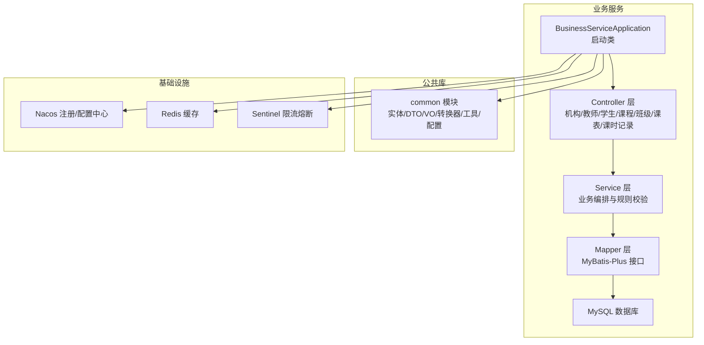
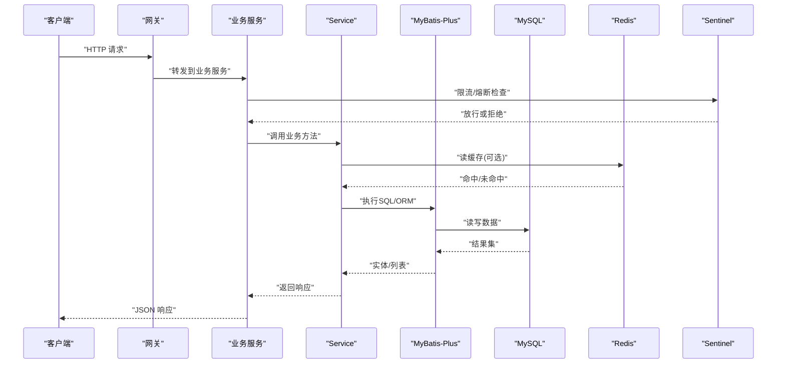
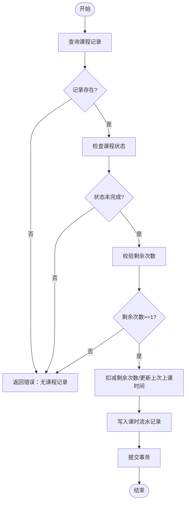
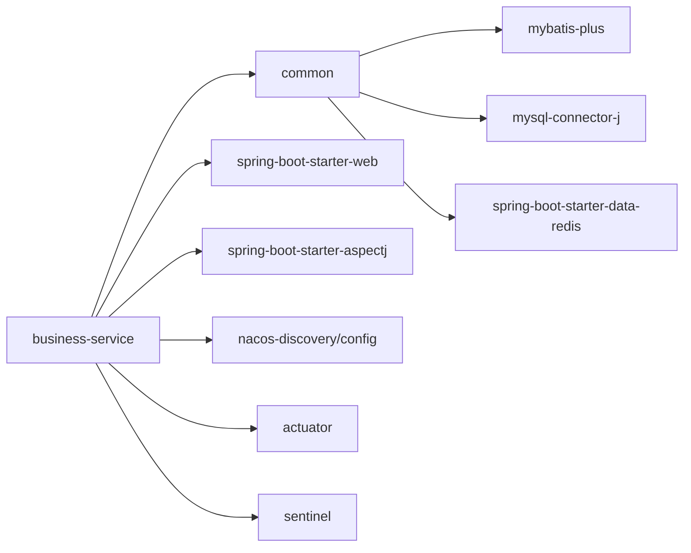

# 业务服务 (business-service)

<cite>
**本文引用的文件**   
- [pom.xml](file://class_times_record_back/business-service/pom.xml)
- [BusinessServiceApplication.java](file://class_times_record_back/business-service/src/main/java/com/shiroko/BusinessServiceApplication.java)
- [application.yml](file://class_times_record_back/business-service/src/main/resources/application.yml)
- [application-dev.yml](file://class_times_record_back/business-service/src/main/resources/application-dev.yml)
- [common-pom.xml](file://class_times_record_back/common/pom.xml)
- [architecture.md](file://class_times_record_back/docs/architecture.md)
- [class_times_record.sql](file://class_times_record_back/docs/class_times_record.sql)
</cite>

## 目录
1. [简介](#简介)
2. [项目结构](#项目结构)
3. [核心组件](#核心组件)
4. [架构总览](#架构总览)
5. [详细组件分析](#详细组件分析)
6. [依赖分析](#依赖分析)
7. [性能考虑](#性能考虑)
8. [故障排查指南](#故障排查指南)
9. [结论](#结论)
10. [附录](#附录)

## 简介
本文件面向“课时记录”系统中的业务服务模块（business-service），聚焦机构管理、教师管理、学生管理、课程管理、班级管理、课时记录等完整业务域。文档从系统架构、数据模型、CRUD与业务规则、事务与一致性、AOP横切关注点、API流程与扩展规范等方面，为开发者提供可落地的参考。

## 项目结构
business-service 采用 Spring Boot + MyBatis-Plus 的分层架构，结合 common 公共库提供的实体、转换器、通用配置与工具能力；通过 Nacos 完成服务注册与配置中心接入；使用 Sentinel 进行限流熔断保护；通过 AOP 实现操作日志、统计更新等横切逻辑。



图表来源
- [BusinessServiceApplication.java](file://class_times_record_back/business-service/src/main/java/com/shiroko/BusinessServiceApplication.java)
- [application.yml](file://class_times_record_back/business-service/src/main/resources/application.yml)
- [application-dev.yml](file://class_times_record_back/business-service/src/main/resources/application-dev.yml)
- [common-pom.xml](file://class_times_record_back/common/pom.xml)

章节来源
- [pom.xml:1-75](file://class_times_record_back/business-service/pom.xml#L1-L75)
- [common-pom.xml:1-155](file://class_times_record_back/common/pom.xml#L1-L155)

## 核心组件
- 启动与装配
  - 应用启动类负责扫描包、启用 Web、AOP、MyBatis-Plus、Nacos、Actuator、Sentinel 等能力。
- 控制器层
  - 暴露机构、教师、学生、课程、班级、课表、课时记录等 REST API，统一入参出参与错误码。
- 服务层
  - 封装业务编排、参数校验、权限与归属校验、并发安全与事务边界控制。
- 持久层
  - 基于 MyBatis-Plus 的 Mapper 接口与 XML 映射，支撑复杂查询与批量操作。
- 公共库
  - 提供实体、DTO/VO、MapStruct 转换器、通用异常、拦截器、上下文、工具类等。

章节来源
- [BusinessServiceApplication.java](file://class_times_record_back/business-service/src/main/java/com/shiroko/BusinessServiceApplication.java)
- [common-pom.xml:18-115](file://class_times_record_back/common/pom.xml#L18-L115)

## 架构总览
业务服务作为微服务之一，通过网关对外暴露接口，内部以 Controller-Service-Mapper 分层组织，借助 Nacos 完成服务发现与动态配置，使用 Redis 做热点数据缓存，使用 Sentinel 做流量治理，使用 AOP 实现非功能性需求。



图表来源
- [application.yml](file://class_times_record_back/business-service/src/main/resources/application.yml)
- [application-dev.yml](file://class_times_record_back/business-service/src/main/resources/application-dev.yml)
- [common-pom.xml:105-115](file://class_times_record_back/common/pom.xml#L105-L115)
- [pom.xml:35-63](file://class_times_record_back/business-service/pom.xml#L35-L63)

## 详细组件分析

### 数据模型与关系
以下 ER 图描述了核心业务实体的关系，包括机构、用户、教师、学生、课程、班级、课表、课时记录、记录流水等。

```mermaid
erDiagram
INSTITUTION {
int id PK
string institution_name
string institution_address
tinyint status
string institution_code
datetime create_time
datetime update_time
}
USER {
int id PK
int institution_id FK
datetime create_time
datetime update_time
}
TEACHER {
int id PK
int institution_id FK
int user_id FK
tinyint is_available
string username
}
STUDENT {
int id PK
int institution_id FK
string student_name
tinyint sex
date birth
string school
string address
}
COURSE {
int id PK
string course_name
tinyint course_type
int institution_id FK
tinyint is_available
}
CLASS {
int id PK
int course_id FK
string class_name
int student_count
int student_max_count
tinyint status
tinyint isDelete
}
CLASS_SCHEDULE {
int id PK
int class_id FK
date start_date
date end_date
tinyint day_of_week
time start_time
time end_time
string remark
}
CLASS_STUDENT {
int id PK
int class_id FK
int student_id FK
}
CLASS_TEACHER {
int id PK
int class_id FK
int teacher_id FK
}
COURSE_RECORD {
int id PK
int student_id FK
int course_id FK
int course_total_time
int course_rest_time
datetime course_last_time
datetime expire_time
int course_status
int course_owner_user_id FK
string course_remark
tinyint is_delete
}
RECORD {
int id PK
int course_record_id FK
datetime record_time
string record_remark
int record_type
int record_change
int operate_teacher_id FK
tinyint is_delete
}
INSTITUTION ||--o{ USER : "拥有"
INSTITUTION ||--o{ TEACHER : "拥有"
INSTITUTION ||--o{ STUDENT : "拥有"
INSTITUTION ||--o{ COURSE : "拥有"
COURSE ||--o{ CLASS : "包含"
CLASS ||--o{ CLASS_SCHEDULE : "排课"
CLASS ||--o{ CLASS_STUDENT : "学生关联"
CLASS ||--o{ CLASS_TEACHER : "教师关联"
STUDENT ||--o{ COURSE_RECORD : "选课记录"
COURSE ||--o{ COURSE_RECORD : "课程维度"
COURSE_RECORD ||--o{ RECORD : "课时流水"
TEACHER ||--o{ RECORD : "操作人"
```

图表来源
- [class_times_record.sql:39-164](file://class_times_record_back/docs/class_times_record.sql#L39-L164)
- [class_times_record.sql:264-281](file://class_times_record_back/docs/class_times_record.sql#L264-L281)

章节来源
- [class_times_record.sql:39-164](file://class_times_record_back/docs/class_times_record.sql#L39-L164)
- [class_times_record.sql:264-281](file://class_times_record_back/docs/class_times_record.sql#L264-L281)

### 机构管理
- 职责：机构的创建、启停、禁用、信息查询与唯一性校验。
- 关键规则：
  - 机构代码唯一性约束。
  - 状态机：待审核→启用/禁用。
- 典型流程：
  - 创建：校验名称/地址/代码→写入机构表→返回ID。
  - 启停：根据当前状态切换并记录时间戳。
- 数据一致性：单表写操作，无需跨表事务。

章节来源
- [class_times_record.sql:169-179](file://class_times_record_back/docs/class_times_record.sql#L169-L179)

### 教师管理
- 职责：教师档案维护、与机构绑定、账号关联、可用状态管理。
- 关键规则：
  - 同一机构内 user_id 唯一。
  - 教师与用户表一对一关联。
- 典型流程：
  - 新增：校验机构存在→生成用户→插入教师表→返回信息。
  - 编辑：按ID更新字段，保持 user_id 不变。
  - 禁用/启用：更新 is_available。

章节来源
- [class_times_record.sql:411-423](file://class_times_record_back/docs/class_times_record.sql#L411-L423)
- [class_times_record.sql:444-453](file://class_times_record_back/docs/class_times_record.sql#L444-L453)

### 学生管理
- 职责：学生基本信息维护、所属机构绑定、基础检索。
- 关键规则：
  - 学生属于某机构，支持按机构范围查询。
- 典型流程：
  - 新增：校验机构→写入学生表。
  - 编辑：按ID更新。
  - 删除：逻辑删除标记。

章节来源
- [class_times_record.sql:299-316](file://class_times_record_back/docs/class_times_record.sql#L299-L316)

### 课程管理
- 职责：课程定义、类型（按次/按天）、可用性控制、机构归属。
- 关键规则：
  - 课程归属于机构，支持启用/禁用。
- 典型流程：
  - 新增：校验机构→创建课程。
  - 编辑：更新名称/类型/可用性。
  - 删除：逻辑删除或禁用。

章节来源
- [class_times_record.sql:110-122](file://class_times_record_back/docs/class_times_record.sql#L110-L122)

### 班级管理
- 职责：班级创建、容量控制、状态管理、师生关联。
- 关键规则：
  - 班级隶属于课程。
  - 学生人数上限限制（student_max_count）。
  - 班级-学生、班级-教师多对多关联。
- 典型流程：
  - 创建：校验课程→初始化人数→写入班级。
  - 加入学生：校验名额→插入班级-学生关联。
  - 分配教师：插入班级-教师关联。

章节来源
- [class_times_record.sql:39-53](file://class_times_record_back/docs/class_times_record.sql#L39-L53)
- [class_times_record.sql:78-89](file://class_times_record_back/docs/class_times_record.sql#L78-L89)
- [class_times_record.sql:94-105](file://class_times_record_back/docs/class_times_record.sql#L94-L105)

### 课表管理
- 职责：为班级设置上课时间段、星期、起止时间、备注。
- 关键规则：
  - 课表隶属于班级。
  - 避免时间冲突（建议在 Service 层校验）。
- 典型流程：
  - 新增：校验班级→写入课表。
  - 调整：修改日期/时间/备注。
  - 删除：移除指定课表。

章节来源
- [class_times_record.sql:58-73](file://class_times_record_back/docs/class_times_record.sql#L58-L73)

### 课时记录与消课增课
- 职责：维护学生的课程购买/剩余次数、到期时间、上次上课时间；记录每次增课/消课流水。
- 关键规则：
  - 学生-课程唯一记录（course_record）。
  - 记录类型：增课、消课、纯记录。
  - 消课需保证剩余次数充足。
- 典型流程（消课）：
  - 校验课程记录存在且状态未完成→校验剩余次数≥1→扣减剩余次数→更新上次上课时间→写入流水记录→提交事务。
- 典型流程（增课）：
  - 校验课程记录存在→增加总次数与剩余次数→写入流水记录→提交事务。



图表来源
- [class_times_record.sql:142-164](file://class_times_record_back/docs/class_times_record.sql#L142-L164)
- [class_times_record.sql:264-281](file://class_times_record_back/docs/class_times_record.sql#L264-L281)

章节来源
- [class_times_record.sql:142-164](file://class_times_record_back/docs/class_times_record.sql#L142-L164)
- [class_times_record.sql:264-281](file://class_times_record_back/docs/class_times_record.sql#L264-L281)

### 事务管理与数据一致性
- 事务边界：在 Service 层标注事务，确保“扣减剩余次数+写入流水”原子性。
- 一致性策略：
  - 短事务优先，减少锁持有时间。
  - 幂等设计：对重复请求通过唯一键或幂等键去重。
  - 乐观锁：对高并发场景可增加版本号字段。
- 补偿机制：
  - 异步任务失败重试与死信队列兜底。
  - 定时核对任务比对课程记录与流水一致性。

章节来源
- [class_times_record.sql:142-164](file://class_times_record_back/docs/class_times_record.sql#L142-L164)
- [class_times_record.sql:264-281](file://class_times_record_back/docs/class_times_record.sql#L264-L281)

### 异步处理机制
- 适用场景：通知发送、报表汇总、统计指标更新等非实时强一致任务。
- 建议方案：
  - 基于消息队列（如 RabbitMQ/Kafka）或本地延迟任务。
  - 消费端具备幂等与重试能力。
  - 监控告警与失败补偿。

[本节为通用指导，不直接分析具体文件]

### AOP 切面应用
- 操作日志：在 Service 方法前后记录操作人、时间、IP、参数与结果摘要。
- 统计更新：在增删改后异步更新统计缓存或指标表。
- 权限校验：在方法级注解驱动鉴权，简化 Controller 逻辑。
- 限流熔断：结合 Sentinel 注解对热点接口进行保护。

章节来源
- [pom.xml:30-34](file://class_times_record_back/business-service/pom.xml#L30-L34)
- [common-pom.xml:24-26](file://class_times_record_back/common/pom.xml#L24-L26)

### API 接口说明（示例）
以下为常见业务接口的约定式说明（路径与方法名以实际实现为准）：
- 机构管理
  - POST /api/institution/create：创建机构
  - PUT /api/institution/update：更新机构
  - DELETE /api/institution/delete/{id}：删除机构
  - GET /api/institution/detail/{id}：获取详情
  - GET /api/institution/list：分页查询
- 教师管理
  - POST /api/teacher/create：新增教师
  - PUT /api/teacher/update：编辑教师
  - DELETE /api/teacher/delete/{id}：删除教师
  - GET /api/teacher/detail/{id}：详情
  - GET /api/teacher/list：分页
- 学生管理
  - POST /api/student/create：新增学生
  - PUT /api/student/update：编辑学生
  - DELETE /api/student/delete/{id}：删除学生
  - GET /api/student/detail/{id}：详情
  - GET /api/student/list：分页
- 课程管理
  - POST /api/course/create：新增课程
  - PUT /api/course/update：编辑课程
  - DELETE /api/course/delete/{id}：删除课程
  - GET /api/course/detail/{id}：详情
  - GET /api/course/list：分页
- 班级管理
  - POST /api/class/create：新增班级
  - PUT /api/class/update：编辑班级
  - DELETE /api/class/delete/{id}：删除班级
  - GET /api/class/detail/{id}：详情
  - GET /api/class/list：分页
  - POST /api/class/student/add：添加学生
  - POST /api/class/teacher/add：分配教师
- 课表管理
  - POST /api/schedule/create：新增课表
  - PUT /api/schedule/update：编辑课表
  - DELETE /api/schedule/delete/{id}：删除课表
  - GET /api/schedule/list：按班级查询
- 课时记录
  - POST /api/course-record/create：创建课程记录
  - POST /api/course-record/deduct：消课
  - POST /api/course-record/add：增课
  - GET /api/course-record/detail/{id}：详情
  - GET /api/course-record/list：分页
  - GET /api/record/list：课时流水分页

[本节为约定式说明，具体实现以 Controller 为准]

## 依赖分析
- 内部依赖
  - business-service 依赖 common 模块，复用实体、转换器、工具与通用配置。
- 外部依赖
  - Spring Boot Web、AOP、MyBatis-Plus、MySQL 连接器。
  - Nacos 服务注册与配置中心。
  - Actuator 健康检查与指标。
  - Sentinel 限流熔断。
  - Redis 缓存（由 common 引入）。



图表来源
- [pom.xml:19-63](file://class_times_record_back/business-service/pom.xml#L19-L63)
- [common-pom.xml:18-115](file://class_times_record_back/common/pom.xml#L18-L115)

章节来源
- [pom.xml:19-63](file://class_times_record_back/business-service/pom.xml#L19-L63)
- [common-pom.xml:18-115](file://class_times_record_back/common/pom.xml#L18-L115)

## 性能考虑
- 数据库
  - 合理索引：外键列、查询条件列建立索引；避免全表扫描。
  - 分页查询：使用游标或基于主键的范围查询替代深分页。
  - 批量操作：合并多次小写为大写批量写入。
- 缓存
  - 热点数据（字典、菜单、用户信息）缓存至 Redis，注意过期与一致性。
  - 防穿透/击穿/雪崩策略：空值缓存、互斥锁、随机过期。
- 限流与降级
  - 针对高频接口配置 Sentinel 规则，保障核心链路稳定。
- 连接池
  - 合理配置 MySQL 与 Redis 连接池大小与超时。
- 异步化
  - 将非关键路径（通知、统计）异步化，缩短主流程耗时。

[本节为通用指导，不直接分析具体文件]

## 故障排查指南
- 常见问题定位
  - 服务无法注册：检查 Nacos 配置与网络连通性。
  - 接口超时：查看慢 SQL 与线程池配置，必要时开启慢查询日志。
  - 限流触发：确认 Sentinel 规则是否过严，结合 QPS 与资源位评估。
  - 缓存不一致：核对缓存更新时机与失效策略。
- 日志与监控
  - 使用 AOP 操作日志追踪关键变更。
  - 利用 Actuator 暴露健康与指标端点，配合监控系统告警。
- 数据一致性
  - 核对课程记录与流水的一致性，必要时运行补偿任务修复。

章节来源
- [application.yml](file://class_times_record_back/business-service/src/main/resources/application.yml)
- [application-dev.yml](file://class_times_record_back/business-service/src/main/resources/application-dev.yml)

## 结论
business-service 围绕课时记录的核心业务，构建了清晰的领域模型与服务分层，结合 Nacos、Redis、Sentinel 与 AOP 实现了可扩展、可观测、可治理的业务平台。通过完善的事务与一致性策略、异步化与限流降级措施，可在高并发场景下保持稳定与高效。

## 附录
- 架构参考
  - 参见仓库中的架构文档，了解整体微服务划分与交互方式。

章节来源
- [architecture.md](file://class_times_record_back/docs/architecture.md)