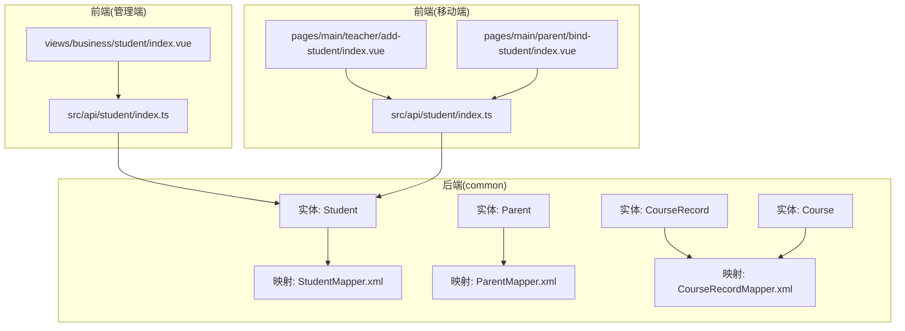
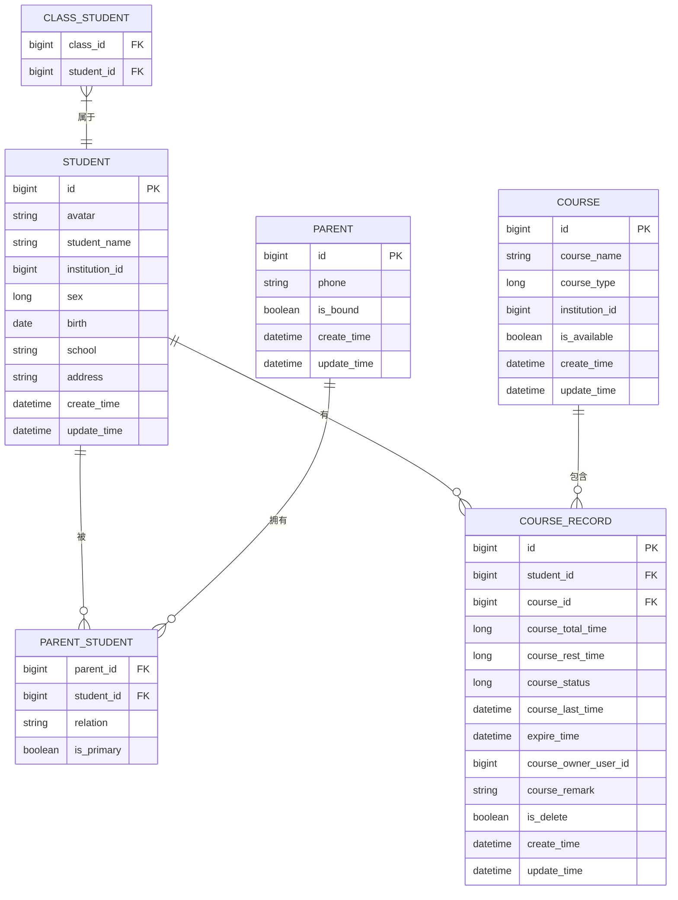
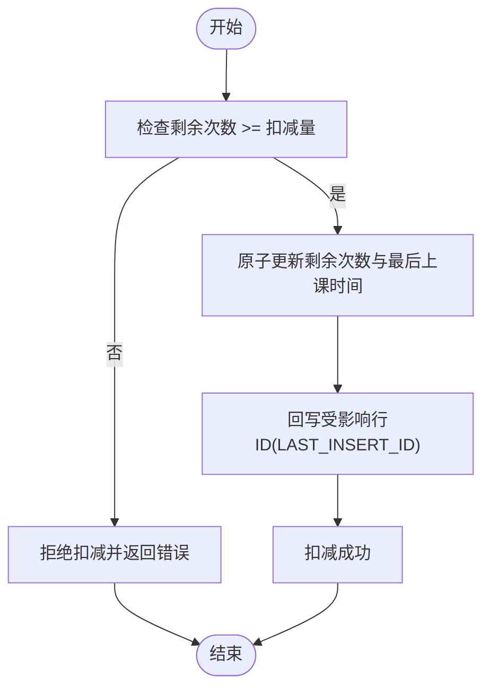
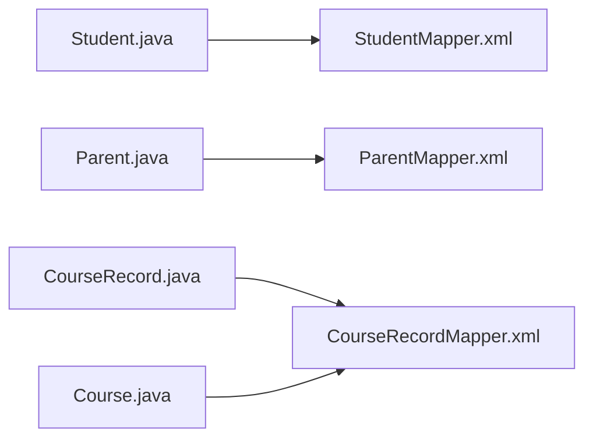
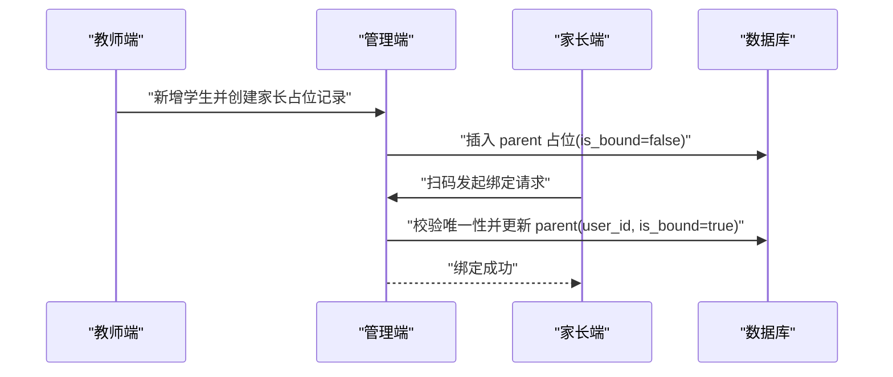
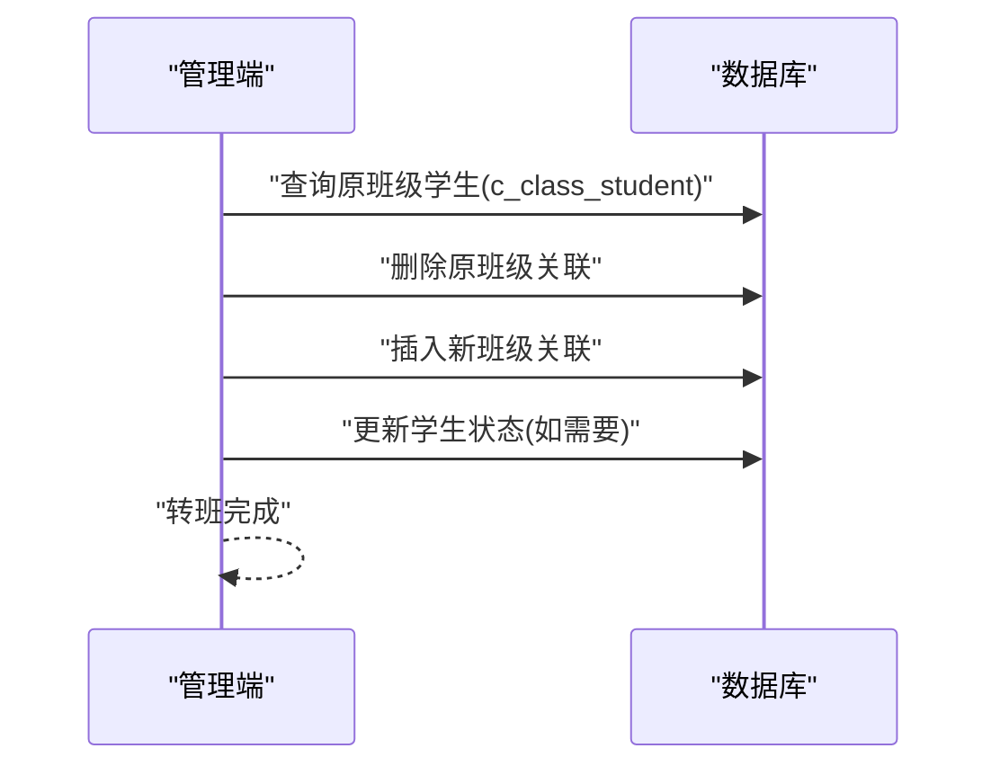
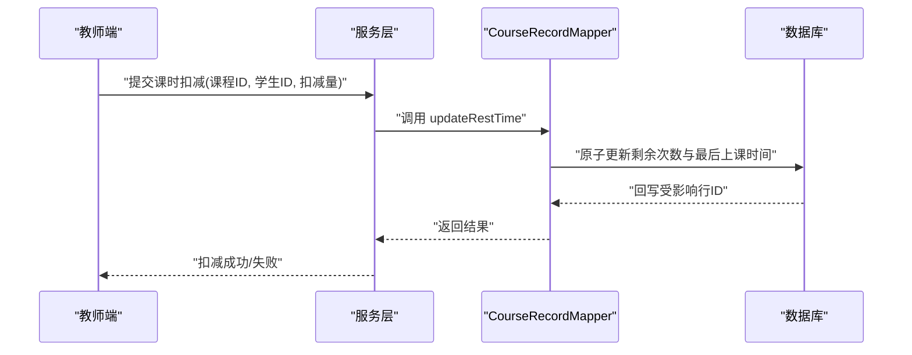

# 学生管理模块

<cite>
**本文引用的文件**
- [Student.java](file://class_times_record_back/common/src/main/java/com/shiroko/repository/entity/Student.java)
- [Parent.java](file://class_times_record_back/common/src/main/java/com/shiroko/repository/entity/Parent.java)
- [CourseRecord.java](file://class_times_record_back/common/src/main/java/com/shiroko/repository/entity/CourseRecord.java)
- [Course.java](file://class_times_record_back/common/src/main/java/com/shiroko/repository/entity/Course.java)
- [StudentMapper.xml](file://class_times_record_back/common/src/main/resources/com/shiroko/mapper/StudentMapper.xml)
- [ParentMapper.xml](file://class_times_record_back/common/src/main/resources/com/shiroko/mapper/ParentMapper.xml)
- [CourseRecordMapper.xml](file://class_times_record_back/common/src/main/resources/com/shiroko/mapper/CourseRecordMapper.xml)
</cite>

## 目录
1. [简介](#简介)
2. [项目结构](#项目结构)
3. [核心组件](#核心组件)
4. [架构总览](#架构总览)
5. [详细组件分析](#详细组件分析)
6. [依赖关系分析](#依赖关系分析)
7. [性能考虑](#性能考虑)
8. [故障排查指南](#故障排查指南)
9. [结论](#结论)
10. [附录：API 与业务场景示例](#附录api-与业务场景示例)

## 简介
本模块聚焦“学生管理”的完整实现，覆盖以下关键能力：
- 学员基本信息维护（增删改查、查询过滤）
- 家长绑定关系管理（占位创建、扫码认领、多对多关联）
- 正式学员管理与状态流转（在读、毕业、退学等）
- 学生与班级、课程、课时记录的关联与一致性保障
- 家长绑定流程、转班处理、数据统计更新等业务逻辑说明
- 面向前端的 API 接口文档与典型业务场景示例

## 项目结构
后端采用分层架构，实体与映射位于 common 模块；前端包含管理端与移动端两个应用。学生管理相关的数据模型与查询集中在 common 的 entity 与 mapper 中，并通过服务层暴露给业务服务。

图表来源
- [Student.java:1-89](file://class_times_record_back/common/src/main/java/com/shiroko/repository/entity/Student.java#L1-L89)
- [Parent.java:1-65](file://class_times_record_back/common/src/main/java/com/shiroko/repository/entity/Parent.java#L1-L65)
- [CourseRecord.java:1-111](file://class_times_record_back/common/src/main/java/com/shiroko/repository/entity/CourseRecord.java#L1-L111)
- [Course.java:1-60](file://class_times_record_back/common/src/main/java/com/shiroko/repository/entity/Course.java#L1-L60)
- [StudentMapper.xml:1-146](file://class_times_record_back/common/src/main/resources/com/shiroko/mapper/StudentMapper.xml#L1-L146)
- [ParentMapper.xml:1-8](file://class_times_record_back/common/src/main/resources/com/shiroko/mapper/ParentMapper.xml#L1-L8)
- [CourseRecordMapper.xml:1-137](file://class_times_record_back/common/src/main/resources/com/shiroko/mapper/CourseRecordMapper.xml#L1-L137)

章节来源
- [Student.java:1-89](file://class_times_record_back/common/src/main/java/com/shiroko/repository/entity/Student.java#L1-L89)
- [Parent.java:1-65](file://class_times_record_back/common/src/main/java/com/shiroko/repository/entity/Parent.java#L1-L65)
- [CourseRecord.java:1-111](file://class_times_record_back/common/src/main/java/com/shiroko/repository/entity/CourseRecord.java#L1-L111)
- [Course.java:1-60](file://class_times_record_back/common/src/main/java/com/shiroko/repository/entity/Course.java#L1-L60)
- [StudentMapper.xml:1-146](file://class_times_record_back/common/src/main/resources/com/shiroko/mapper/StudentMapper.xml#L1-L146)
- [ParentMapper.xml:1-8](file://class_times_record_back/common/src/main/resources/com/shiroko/mapper/ParentMapper.xml#L1-L8)
- [CourseRecordMapper.xml:1-137](file://class_times_record_back/common/src/main/resources/com/shiroko/mapper/CourseRecordMapper.xml#L1-L137)

## 核心组件
- 学生实体（Student）
  - 字段涵盖头像、姓名、机构ID、性别、出生日期、学校、地址、时间戳等基础信息
  - 继承通用基类，具备统一审计字段
- 家长实体（Parent）
  - 字段包括手机号、是否已绑定微信用户、时间戳等
  - 设计要点：教师添加学生时先创建 parent 占位记录（未绑定），家长扫码后认领并绑定
- 课程记录实体（CourseRecord）
  - 记录学生与课程的课时总量、剩余次数、上次上课时间、过期时间、归属人、备注等
  - 支持按次扣减剩余次数，并维护课程状态
- 课程实体（Course）
  - 定义课程名称、类型（按次/按天）、所属机构、可用性等

章节来源
- [Student.java:1-89](file://class_times_record_back/common/src/main/java/com/shiroko/repository/entity/Student.java#L1-L89)
- [Parent.java:1-65](file://class_times_record_back/common/src/main/java/com/shiroko/repository/entity/Parent.java#L1-L65)
- [CourseRecord.java:1-111](file://class_times_record_back/common/src/main/java/com/shiroko/repository/entity/CourseRecord.java#L1-L111)
- [Course.java:1-60](file://class_times_record_back/common/src/main/java/com/shiroko/repository/entity/Course.java#L1-L60)

## 架构总览
学生管理在数据层通过 MyBatis XML 完成复杂查询与批量操作，结合数据库约束保证数据一致性。核心关系如下：
- 学生与家长的多对多：通过中间表 c_parent_student 建立关联，支持主家长标记与关系描述
- 学生与课程记录：c_course_record 记录学生选课与课时消耗
- 学生与班级：通过 c_class_student 关联，支持查询某班级下的学生列表
- 课程与课程记录：c_course 与 c_course_record 一对多

图表来源
- [Student.java:1-89](file://class_times_record_back/common/src/main/java/com/shiroko/repository/entity/Student.java#L1-L89)
- [Parent.java:1-65](file://class_times_record_back/common/src/main/java/com/shiroko/repository/entity/Parent.java#L1-L65)
- [CourseRecord.java:1-111](file://class_times_record_back/common/src/main/java/com/shiroko/repository/entity/CourseRecord.java#L1-L111)
- [Course.java:1-60](file://class_times_record_back/common/src/main/java/com/shiroko/repository/entity/Course.java#L1-L60)
- [StudentMapper.xml:22-37](file://class_times_record_back/common/src/main/resources/com/shiroko/mapper/StudentMapper.xml#L22-L37)
- [StudentMapper.xml:116-129](file://class_times_record_back/common/src/main/resources/com/shiroko/mapper/StudentMapper.xml#L116-L129)
- [CourseRecordMapper.xml:88-101](file://class_times_record_back/common/src/main/resources/com/shiroko/mapper/CourseRecordMapper.xml#L88-L101)

## 详细组件分析

### 学生实体与查询
- 数据结构
  - 基础信息：头像、姓名、性别、出生日期、学校、地址
  - 组织维度：机构ID
  - 审计字段：创建时间、更新时间
- 查询能力
  - 按家长ID获取学生列表（含关系字段）
  - 按教师维度筛选学生（支持性别、是否已分班、关键词模糊匹配）
  - 按机构维度筛选学生（支持性别、是否已分班、关键词模糊匹配）
  - 按班级维度列出学生（附带家长电话、课程剩余次数等）
  - 按课程维度列出学生（附带课程剩余次数）
- 性能优化
  - 使用 EXISTS 子查询避免 JOIN 重复行
  - 条件动态拼接减少不必要扫描

章节来源
- [Student.java:1-89](file://class_times_record_back/common/src/main/java/com/shiroko/repository/entity/Student.java#L1-L89)
- [StudentMapper.xml:22-37](file://class_times_record_back/common/src/main/resources/com/shiroko/mapper/StudentMapper.xml#L22-L37)
- [StudentMapper.xml:39-80](file://class_times_record_back/common/src/main/resources/com/shiroko/mapper/StudentMapper.xml#L39-L80)
- [StudentMapper.xml:82-114](file://class_times_record_back/common/src/main/resources/com/shiroko/mapper/StudentMapper.xml#L82-L114)
- [StudentMapper.xml:116-129](file://class_times_record_back/common/src/main/resources/com/shiroko/mapper/StudentMapper.xml#L116-L129)
- [StudentMapper.xml:136-144](file://class_times_record_back/common/src/main/resources/com/shiroko/mapper/StudentMapper.xml#L136-L144)

### 家长绑定关系管理
- 设计要点
  - 教师添加学生时，系统会创建一条 parent 占位记录（未绑定微信用户）
  - 家长扫码后认领该占位记录，更新为已绑定
  - 唯一性约束：一个微信用户仅对应一个 parent 记录
- 多对多关联
  - 通过 c_parent_student 表建立家长与学生多对多关系
  - 支持关系描述与主家长标记（is_primary）
- 查询展示
  - 按家长ID拉取学生列表，返回关系字段
  - 按班级拉取学生时，默认关联主家长与联系方式

章节来源
- [Parent.java:1-65](file://class_times_record_back/common/src/main/java/com/shiroko/repository/entity/Parent.java#L1-L65)
- [StudentMapper.xml:22-37](file://class_times_record_back/common/src/main/resources/com/shiroko/mapper/StudentMapper.xml#L22-L37)
- [StudentMapper.xml:116-129](file://class_times_record_back/common/src/main/resources/com/shiroko/mapper/StudentMapper.xml#L116-L129)

### 课时记录与扣减一致性
- 数据结构
  - 课程记录包含学生ID、课程ID、总课时、剩余次数、状态、上次上课时间、过期时间、归属人、备注等
- 扣减逻辑
  - 提供原子更新接口：在满足剩余次数足够的条件下扣减，同时记录最后上课时间
  - 使用 LAST_INSERT_ID() 回写受影响行 ID，便于后续事务或日志记录
- 查询能力
  - 分页查询课程记录，支持按学生名、课程名、备注、过期状态等筛选
  - 权限控制：非分享模式下需校验权限记录

图表来源
- [CourseRecordMapper.xml:28-44](file://class_times_record_back/common/src/main/resources/com/shiroko/mapper/CourseRecordMapper.xml#L28-L44)

章节来源
- [CourseRecord.java:1-111](file://class_times_record_back/common/src/main/java/com/shiroko/repository/entity/CourseRecord.java#L1-L111)
- [CourseRecordMapper.xml:28-44](file://class_times_record_back/common/src/main/resources/com/shiroko/mapper/CourseRecordMapper.xml#L28-L44)
- [CourseRecordMapper.xml:45-86](file://class_times_record_back/common/src/main/resources/com/shiroko/mapper/CourseRecordMapper.xml#L45-L86)
- [CourseRecordMapper.xml:88-134](file://class_times_record_back/common/src/main/resources/com/shiroko/mapper/CourseRecordMapper.xml#L88-L134)

### 学生与班级、课程、课时记录的关联
- 学生与班级
  - 通过 c_class_student 关联，支持查询某班级下学生列表
- 学生与课程
  - 通过 c_course_record 关联，记录学生选课与课时消耗
- 课程与课程记录
  - 一对多关系，用于统计与展示课程维度的学生列表

章节来源
- [StudentMapper.xml:116-129](file://class_times_record_back/common/src/main/resources/com/shiroko/mapper/StudentMapper.xml#L116-L129)
- [CourseRecordMapper.xml:88-101](file://class_times_record_back/common/src/main/resources/com/shiroko/mapper/CourseRecordMapper.xml#L88-L101)

### 学生状态管理（在读、毕业、退学）
- 现状
  - 当前 Student 实体未包含显式“状态”字段
- 建议方案
  - 在 Student 增加 status 字段（枚举：在读、毕业、退学）
  - 在转班、结业、退学流程中更新状态
  - 在查询与报表中按状态过滤与统计

[本节为概念性建议，不直接分析具体文件]

## 依赖关系分析
- 实体与映射
  - Student 与 StudentMapper.xml 强耦合，负责学生多维查询
  - Parent 与 ParentMapper.xml 弱耦合（当前无自定义 SQL）
  - CourseRecord 与 CourseRecordMapper.xml 强耦合，负责课时扣减与分页查询
- 外部依赖
  - MyBatis 动态 SQL 与结果映射
  - 数据库约束（如 parent 唯一性）保障数据一致性

图表来源
- [Student.java:1-89](file://class_times_record_back/common/src/main/java/com/shiroko/repository/entity/Student.java#L1-L89)
- [Parent.java:1-65](file://class_times_record_back/common/src/main/java/com/shiroko/repository/entity/Parent.java#L1-L65)
- [CourseRecord.java:1-111](file://class_times_record_back/common/src/main/java/com/shiroko/repository/entity/CourseRecord.java#L1-L111)
- [Course.java:1-60](file://class_times_record_back/common/src/main/java/com/shiroko/repository/entity/Course.java#L1-L60)
- [StudentMapper.xml:1-146](file://class_times_record_back/common/src/main/resources/com/shiroko/mapper/StudentMapper.xml#L1-L146)
- [ParentMapper.xml:1-8](file://class_times_record_back/common/src/main/resources/com/shiroko/mapper/ParentMapper.xml#L1-L8)
- [CourseRecordMapper.xml:1-137](file://class_times_record_back/common/src/main/resources/com/shiroko/mapper/CourseRecordMapper.xml#L1-L137)

章节来源
- [StudentMapper.xml:1-146](file://class_times_record_back/common/src/main/resources/com/shiroko/mapper/StudentMapper.xml#L1-L146)
- [CourseRecordMapper.xml:1-137](file://class_times_record_back/common/src/main/resources/com/shiroko/mapper/CourseRecordMapper.xml#L1-L137)

## 性能考虑
- 查询优化
  - 使用 EXISTS 替代 JOIN 避免重复行与额外排序
  - 条件动态拼接，减少无效索引扫描
- 扣减优化
  - 原子更新 + LAST_INSERT_ID 回写，降低并发冲突风险
- 索引建议
  - 学生表：institution_id、update_time、student_name
  - 家长表：phone、is_bound
  - 课程记录表：student_id、course_id、expire_time、course_rest_time
  - 家长学生关联表：parent_id、student_id、is_primary

[本节为通用指导，不直接分析具体文件]

## 故障排查指南
- 家长绑定失败
  - 检查 parent 唯一约束是否冲突（同一微信用户重复绑定）
  - 确认占位记录是否存在且未被其他用户认领
- 课时扣减异常
  - 检查剩余次数是否足够（course_rest_time >= 扣减量）
  - 查看扣减 SQL 执行结果与回写的受影响行 ID
- 查询结果不完整
  - 核对动态条件是否生效（性别、是否分班、关键词）
  - 确认关联表（家长学生、班级学生）数据完整性

章节来源
- [Parent.java:1-65](file://class_times_record_back/common/src/main/java/com/shiroko/repository/entity/Parent.java#L1-L65)
- [CourseRecordMapper.xml:28-44](file://class_times_record_back/common/src/main/resources/com/shiroko/mapper/CourseRecordMapper.xml#L28-L44)
- [StudentMapper.xml:39-80](file://class_times_record_back/common/src/main/resources/com/shiroko/mapper/StudentMapper.xml#L39-L80)

## 结论
学生管理模块以清晰的实体设计与灵活的 MyBatis 查询为基础，结合数据库约束与原子更新策略，实现了学生信息维护、家长绑定、课时扣减与多维度查询的核心能力。建议在后续迭代中完善学生状态字段与转班流程，进一步提升数据一致性与可观测性。

[本节为总结性内容，不直接分析具体文件]

## 附录：API 与业务场景示例

### 家长绑定流程（序列图）

[此图为概念流程示意，不直接映射到具体源文件]

### 转班处理（序列图）

[此图为概念流程示意，不直接映射到具体源文件]

### 课时扣减（序列图）

图表来源
- [CourseRecordMapper.xml:28-44](file://class_times_record_back/common/src/main/resources/com/shiroko/mapper/CourseRecordMapper.xml#L28-L44)

### 典型查询场景
- 按家长查看学生列表
  - 输入：parentId
  - 输出：学生基本信息与关系字段
- 按教师筛选学生
  - 输入：teacherId、性别、是否已分班、关键词
  - 输出：符合条件的学生集合
- 按班级列出学生
  - 输入：classId
  - 输出：学生、主家长电话、课程剩余次数
- 按课程列出学生
  - 输入：courseId
  - 输出：学生与课程剩余次数

章节来源
- [StudentMapper.xml:22-37](file://class_times_record_back/common/src/main/resources/com/shiroko/mapper/StudentMapper.xml#L22-L37)
- [StudentMapper.xml:39-80](file://class_times_record_back/common/src/main/resources/com/shiroko/mapper/StudentMapper.xml#L39-L80)
- [StudentMapper.xml:116-129](file://class_times_record_back/common/src/main/resources/com/shiroko/mapper/StudentMapper.xml#L116-L129)
- [StudentMapper.xml:136-144](file://class_times_record_back/common/src/main/resources/com/shiroko/mapper/StudentMapper.xml#L136-L144)