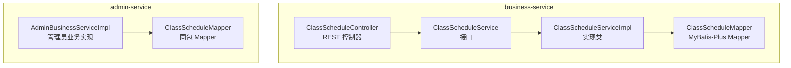
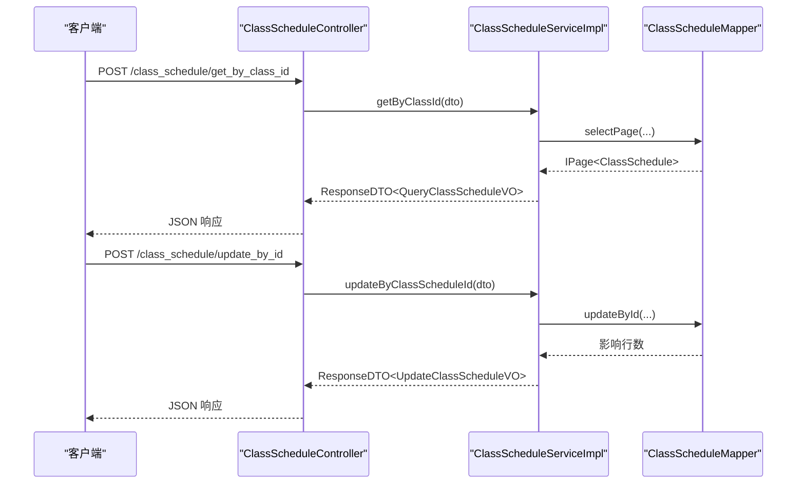
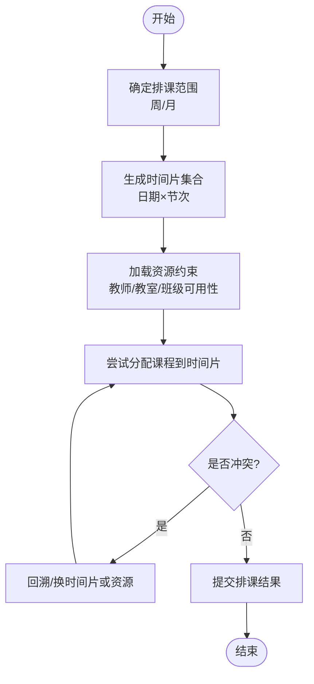
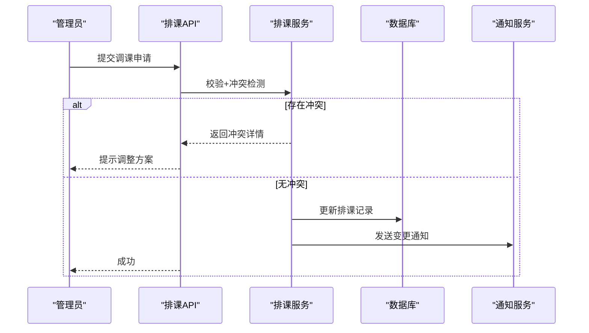
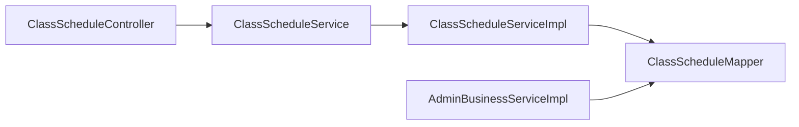

# 排课管理模块

<cite>
**本文引用的文件**   
- [ClassScheduleController.java](file://class_times_record_back/business-service/src/main/java/com/shiroko/controller/ClassScheduleController.java)
- [ClassScheduleService.java](file://class_times_record_back/business-service/src/main/java/com/shiroko/service/ClassScheduleService.java)
- [ClassScheduleServiceImpl.java](file://class_times_record_back/business-service/src/main/java/com/shiroko/service/impl/ClassScheduleServiceImpl.java)
- [AdminBusinessServiceImpl.java](file://class_times_record_back/admin-service/src/main/java/com/shiroko/service/impl/AdminBusinessServiceImpl.java)
</cite>

## 目录
1. [简介](#简介)
2. [项目结构](#项目结构)
3. [核心组件](#核心组件)
4. [架构总览](#架构总览)
5. [详细组件分析](#详细组件分析)
6. [依赖关系分析](#依赖关系分析)
7. [性能考虑](#性能考虑)
8. [故障排查指南](#故障排查指南)
9. [结论](#结论)
10. [附录：API 接口文档](#附录api-接口文档)

## 简介
本模块聚焦“排课管理”，围绕课程安排与调度提供完整的后端能力，包括：
- 按班级、机构、教师维度查询排课
- 基于 ID 的排课记录更新
- 与实体、转换器、分页等通用能力的集成
- 面向管理员侧的批量或辅助操作（在 admin-service 中通过 Mapper 访问）

说明：当前仓库未包含自动排课算法、冲突检测、调停课通知、补课安排等高级功能的实现代码。本文在“概念性设计”部分给出可落地的方案建议，并在“API 接口文档”中仅列出已实现的接口。

## 项目结构
排课相关功能位于 business-service 与 admin-service 两个服务中：
- business-service：对外暴露排课查询与更新的 REST API，内部通过 Service 层调用 MyBatis-Plus 的 Mapper 完成数据访问。
- admin-service：在管理员业务实现中直接通过 ClassScheduleMapper 进行排课记录的读取与更新，用于后台管理场景。



图表来源
- [ClassScheduleController.java:1-55](file://class_times_record_back/business-service/src/main/java/com/shiroko/controller/ClassScheduleController.java#L1-L55)
- [ClassScheduleService.java:1-30](file://class_times_record_back/business-service/src/main/java/com/shiroko/service/ClassScheduleService.java#L1-L30)
- [ClassScheduleServiceImpl.java:1-88](file://class_times_record_back/business-service/src/main/java/com/shiroko/service/impl/ClassScheduleServiceImpl.java#L1-L88)
- [AdminBusinessServiceImpl.java:55-568](file://class_times_record_back/admin-service/src/main/java/com/shiroko/service/impl/AdminBusinessServiceImpl.java#L55-L568)

章节来源
- [ClassScheduleController.java:1-55](file://class_times_record_back/business-service/src/main/java/com/shiroko/controller/ClassScheduleController.java#L1-L55)
- [ClassScheduleService.java:1-30](file://class_times_record_back/business-service/src/main/java/com/shiroko/service/ClassScheduleService.java#L1-L30)
- [ClassScheduleServiceImpl.java:1-88](file://class_times_record_back/business-service/src/main/java/com/shiroko/service/impl/ClassScheduleServiceImpl.java#L1-L88)
- [AdminBusinessServiceImpl.java:55-568](file://class_times_record_back/admin-service/src/main/java/com/shiroko/service/impl/AdminBusinessServiceImpl.java#L55-L568)

## 核心组件
- 控制器：提供按班级、机构、教师查询以及按 ID 更新排课的 HTTP 接口。
- 服务接口：定义排课查询与更新的契约。
- 服务实现：封装分页查询、DTO/VO 转换、单条更新逻辑。
- 管理员服务：在后台管理中直接通过 Mapper 对排课数据进行读写。

章节来源
- [ClassScheduleController.java:25-53](file://class_times_record_back/business-service/src/main/java/com/shiroko/controller/ClassScheduleController.java#L25-L53)
- [ClassScheduleService.java:18-29](file://class_times_record_back/business-service/src/main/java/com/shiroko/service/ClassScheduleService.java#L18-L29)
- [ClassScheduleServiceImpl.java:30-83](file://class_times_record_back/business-service/src/main/java/com/shiroko/service/impl/ClassScheduleServiceImpl.java#L30-L83)
- [AdminBusinessServiceImpl.java:213-568](file://class_times_record_back/admin-service/src/main/java/com/shiroko/service/impl/AdminBusinessServiceImpl.java#L213-L568)

## 架构总览
排课模块采用典型的 Controller → Service → Mapper 分层结构，结合 DTO/VO 转换器完成请求/响应对象与领域对象的映射。



图表来源
- [ClassScheduleController.java:30-53](file://class_times_record_back/business-service/src/main/java/com/shiroko/controller/ClassScheduleController.java#L30-L53)
- [ClassScheduleServiceImpl.java:37-83](file://class_times_record_back/business-service/src/main/java/com/shiroko/service/impl/ClassScheduleServiceImpl.java#L37-L83)

## 详细组件分析

### 控制器：ClassScheduleController
- 职责：接收排课查询与更新请求，参数校验后委托给 Service 层处理。
- 关键端点：
  - 按班级查询
  - 按机构查询
  - 按教师查询
  - 按 ID 查询
  - 按 ID 更新

章节来源
- [ClassScheduleController.java:25-53](file://class_times_record_back/business-service/src/main/java/com/shiroko/controller/ClassScheduleController.java#L25-L53)

### 服务接口：ClassScheduleService
- 职责：定义排课查询与更新的统一契约，便于替换实现与测试。
- 方法：
  - 按班级、机构、教师分页查询
  - 按 ID 更新
  - 按 ID 获取单条

章节来源
- [ClassScheduleService.java:18-29](file://class_times_record_back/business-service/src/main/java/com/shiroko/service/ClassScheduleService.java#L18-L29)

### 服务实现：ClassScheduleServiceImpl
- 职责：
  - 使用 MyBatis-Plus 的分页插件执行查询
  - 将 POJO/DTO 转换为 VO 返回给前端
  - 单条更新时先转换再持久化
- 关键点：
  - 分页查询返回总数与列表
  - 更新成功后构造返回 VO
  - 按 ID 查询不存在时返回失败提示

章节来源
- [ClassScheduleServiceImpl.java:30-83](file://class_times_record_back/business-service/src/main/java/com/shiroko/service/impl/ClassScheduleServiceImpl.java#L30-L83)

### 管理员侧：AdminBusinessServiceImpl
- 职责：在管理员业务场景中直接通过 ClassScheduleMapper 读取与更新排课记录。
- 典型用法：
  - 条件查询排课列表
  - 根据 ID 更新排课字段并回写最新值

章节来源
- [AdminBusinessServiceImpl.java:213-568](file://class_times_record_back/admin-service/src/main/java/com/shiroko/service/impl/AdminBusinessServiceImpl.java#L213-L568)

### 数据结构与关联关系（概念性设计）
说明：以下模型为概念性设计，用于指导后续扩展（如自动排课、冲突检测）。实际字段以数据库与实体为准。

```mermaid
erDiagram
CLASS_SCHEDULE {
bigint id PK
bigint class_id FK
bigint institution_id FK
bigint teacher_id FK
date schedule_date
int period_index
time start_time
time end_time
string room_code
string status
datetime created_at
datetime updated_at
}
CLASS {
bigint id PK
string name
bigint institution_id FK
}
TEACHER {
bigint id PK
string name
}
ROOM {
string code PK
string building
int capacity
}
CLASS ||--o{ CLASS_SCHEDULE : "拥有"
TEACHER ||--o{ CLASS_SCHEDULE : "授课"
ROOM ||--o{ CLASS_SCHEDULE : "占用"
```

[本节为概念性设计，不直接分析具体文件，故无“章节来源”]

### 排课周期管理与时间片分配（概念性流程）
- 周课表：以“星期 + 节次”作为时间片，支持跨天排课。
- 月课表：以“日期 + 节次”作为时间片，适合月度视图展示。
- 资源约束：教师、教室、班级在同一时间片内不可重复占用。



[本节为概念性设计，不直接分析具体文件，故无“章节来源”]

### 冲突检测与解决策略（概念性）
- 冲突类型：
  - 教师时间冲突
  - 教室时间冲突
  - 班级时间冲突
- 解决策略：
  - 优先选择空闲资源
  - 启发式评分（距离现有课表中心、通勤成本等）
  - 局部重排与回溯

[本节为概念性设计，不直接分析具体文件，故无“章节来源”]

### 调课、停课与补课（概念性流程）
- 调课：修改原排课的时间/地点，触发冲突检测与受影响方通知。
- 停课：将状态置为“停课”，释放资源并通知学生/家长/教师。
- 补课：创建新的排课记录，尽量与原课时间接近且满足资源可用。



[本节为概念性设计，不直接分析具体文件，故无“章节来源”]

## 依赖关系分析
- 控制器依赖服务接口；服务实现依赖 Mapper 与转换器。
- 管理员服务直接依赖 Mapper，绕过业务服务层，适用于后台批处理或快速维护。



图表来源
- [ClassScheduleController.java:25-53](file://class_times_record_back/business-service/src/main/java/com/shiroko/controller/ClassScheduleController.java#L25-L53)
- [ClassScheduleService.java:18-29](file://class_times_record_back/business-service/src/main/java/com/shiroko/service/ClassScheduleService.java#L18-L29)
- [ClassScheduleServiceImpl.java:30-83](file://class_times_record_back/business-service/src/main/java/com/shiroko/service/impl/ClassScheduleServiceImpl.java#L30-L83)
- [AdminBusinessServiceImpl.java:213-568](file://class_times_record_back/admin-service/src/main/java/com/shiroko/service/impl/AdminBusinessServiceImpl.java#L213-L568)

章节来源
- [ClassScheduleController.java:25-53](file://class_times_record_back/business-service/src/main/java/com/shiroko/controller/ClassScheduleController.java#L25-L53)
- [ClassScheduleService.java:18-29](file://class_times_record_back/business-service/src/main/java/com/shiroko/service/ClassScheduleService.java#L18-L29)
- [ClassScheduleServiceImpl.java:30-83](file://class_times_record_back/business-service/src/main/java/com/shiroko/service/impl/ClassScheduleServiceImpl.java#L30-L83)
- [AdminBusinessServiceImpl.java:213-568](file://class_times_record_back/admin-service/src/main/java/com/shiroko/service/impl/AdminBusinessServiceImpl.java#L213-L568)

## 性能考虑
- 分页查询：使用 MyBatis-Plus 分页插件，避免全量拉取。
- 索引建议：为 class_id、institution_id、teacher_id、schedule_date 建立合适索引以提升查询效率。
- 更新优化：批量更新时使用批量接口，减少往返次数。
- 缓存策略：热点查询（如某教师本周课表）可引入缓存层降低数据库压力。

[本节为通用建议，不直接分析具体文件，故无“章节来源”]

## 故障排查指南
- 常见错误：
  - 查询结果为空：检查传入的 class_id/institution_id/teacher_id 是否正确。
  - 更新失败：确认 ID 是否存在，字段是否符合约束。
- 定位步骤：
  - 查看控制器日志与入参
  - 在服务实现层打印分页与转换过程
  - 在 Mapper 层核对 SQL 与索引命中情况

章节来源
- [ClassScheduleServiceImpl.java:75-82](file://class_times_record_back/business-service/src/main/java/com/shiroko/service/impl/ClassScheduleServiceImpl.java#L75-L82)

## 结论
当前排课模块已具备基础的查询与更新能力，并通过清晰的分层结构支撑后续扩展。建议在后续迭代中补充自动排课、冲突检测、调停课通知与补课安排等功能，同时完善数据模型与索引策略，以满足大规模排课场景的性能与稳定性要求。

[本节为总结性内容，不直接分析具体文件，故无“章节来源”]

## 附录：API 接口文档
以下接口均已实现并可调用。所有接口均返回统一的 ResponseDTO 包装体。

- 按班级查询排课
  - 路径：POST /class_schedule/get_by_class_id
  - 入参：QueryClassScheduleDTO（包含分页参数与 class_id）
  - 出参：ResponseDTO<QueryClassScheduleVO>

- 按机构查询排课
  - 路径：POST /class_schedule/get_by_institution_id
  - 入参：QueryClassScheduleDTO（包含分页参数与 institution_id）
  - 出参：ResponseDTO<QueryClassScheduleVO>

- 按教师查询排课
  - 路径：POST /class_schedule/get_by_teacher_id
  - 入参：QueryClassScheduleDTO（包含分页参数与 teacher_id）
  - 出参：ResponseDTO<QueryClassScheduleVO>

- 按 ID 查询排课
  - 路径：POST /class_schedule/get_by_id
  - 入参：QueryClassScheduleDTO（包含 id）
  - 出参：ResponseDTO<QueryClassScheduleVO>

- 按 ID 更新排课
  - 路径：POST /class_schedule/update_by_id
  - 入参：UpdateClassScheduleDTO（包含待更新字段）
  - 出参：ResponseDTO<UpdateClassScheduleVO>

章节来源
- [ClassScheduleController.java:30-53](file://class_times_record_back/business-service/src/main/java/com/shiroko/controller/ClassScheduleController.java#L30-L53)
- [ClassScheduleService.java:20-28](file://class_times_record_back/business-service/src/main/java/com/shiroko/service/ClassScheduleService.java#L20-L28)
- [ClassScheduleServiceImpl.java:37-83](file://class_times_record_back/business-service/src/main/java/com/shiroko/service/impl/ClassScheduleServiceImpl.java#L37-L83)