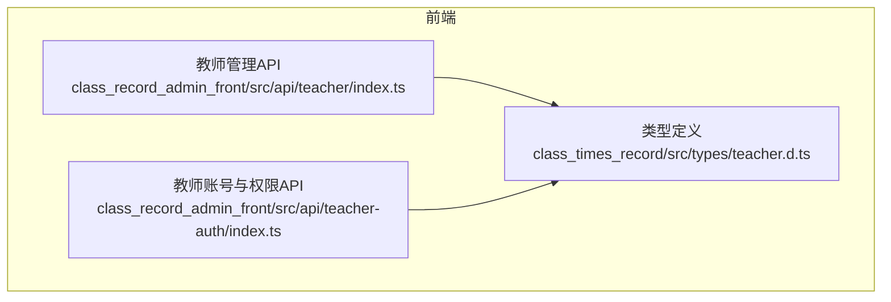
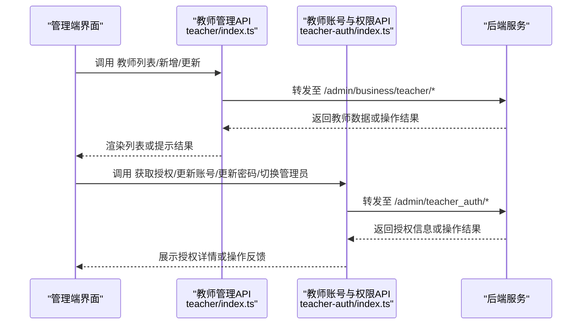
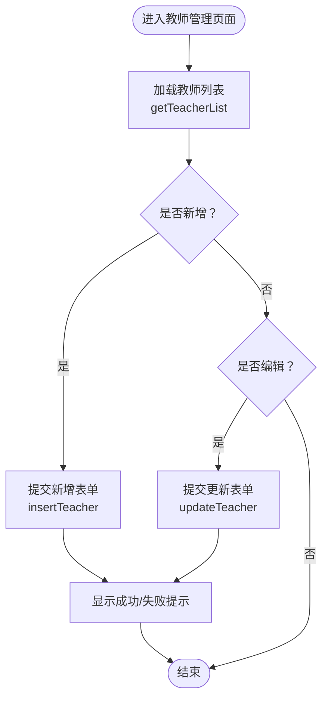
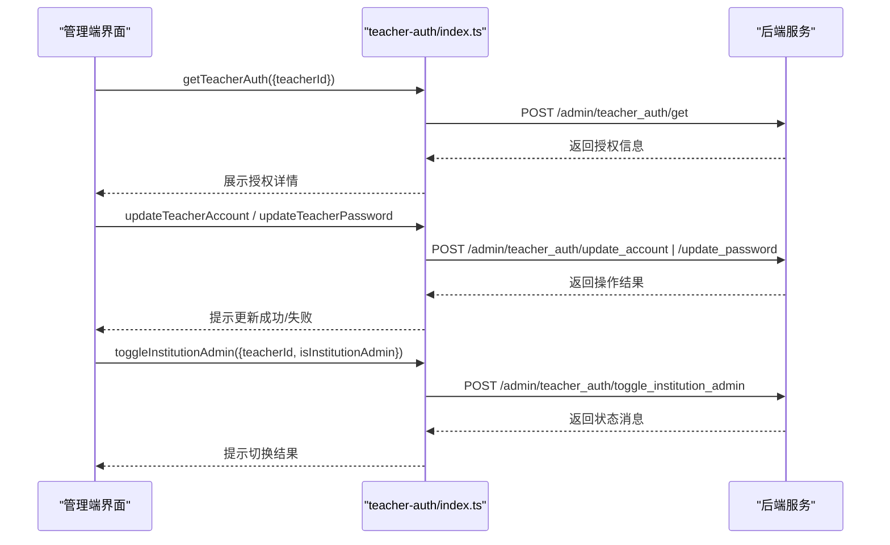
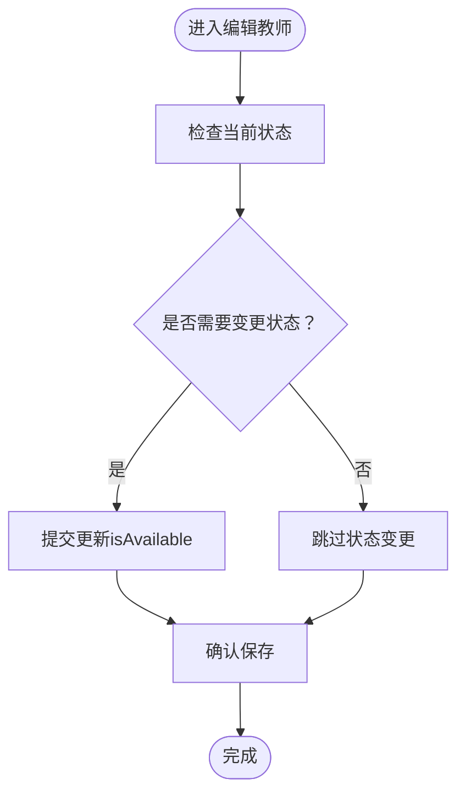
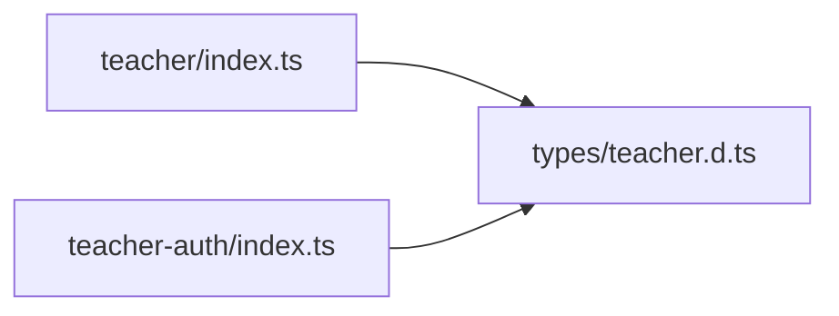

# 教师管理模块

<cite>
**本文引用的文件**
- [class_record_admin_front/src/api/teacher/index.ts](file://class_record_admin_front/src/api/teacher/index.ts)
- [class_record_admin_front/src/api/teacher-auth/index.ts](file://class_record_admin_front/src/api/teacher-auth/index.ts)
- [class_times_record/src/types/teacher.d.ts](file://class_times_record/src/types/teacher.d.ts)
</cite>

## 目录
1. [简介](#简介)
2. [项目结构](#项目结构)
3. [核心组件](#核心组件)
4. [架构总览](#架构总览)
5. [详细组件分析](#详细组件分析)
6. [依赖关系分析](#依赖关系分析)
7. [性能考虑](#性能考虑)
8. [故障排查指南](#故障排查指南)
9. [结论](#结论)
10. [附录](#附录)

## 简介
本模块聚焦“教师管理”的完整实现，覆盖以下能力：
- 教师基本信息维护（新增、编辑、查询）
- 教师账号管理（获取授权信息、更新账号与密码）
- 机构管理员身份切换（为教师授予或取消机构管理员身份）
- 教师状态管理（可用/不可用）
- 教师与机构、用户体系的关联关系说明
- 教师与班级、课程的绑定关系管理思路与扩展规范
- 完整的业务流程图与API接口文档

## 项目结构
教师管理相关的前端API定义集中在两个文件中：
- 教师基础信息管理 API：列表、新增、更新
- 教师账号与权限管理 API：获取授权、更新账号/密码、切换机构管理员身份



图表来源
- [class_record_admin_front/src/api/teacher/index.ts:1-14](file://class_record_admin_front/src/api/teacher/index.ts#L1-L14)
- [class_record_admin_front/src/api/teacher-auth/index.ts:1-24](file://class_record_admin_front/src/api/teacher-auth/index.ts#L1-L24)
- [class_times_record/src/types/teacher.d.ts:1-52](file://class_times_record/src/types/teacher.d.ts#L1-L52)

章节来源
- [class_record_admin_front/src/api/teacher/index.ts:1-14](file://class_record_admin_front/src/api/teacher/index.ts#L1-L14)
- [class_record_admin_front/src/api/teacher-auth/index.ts:1-24](file://class_record_admin_front/src/api/teacher-auth/index.ts#L1-L24)
- [class_times_record/src/types/teacher.d.ts:1-52](file://class_times_record/src/types/teacher.d.ts#L1-L52)

## 核心组件
本节从数据结构、接口契约与业务语义三个维度梳理教师管理的关键要素。

- 教师实体与响应模型
  - 字段包括：教师ID、用户名、账号、手机号、是否机构管理员、是否可用、所属机构等
  - 列表响应包含教师集合与总数
- 请求与响应模型
  - 新增教师：需要用户名、账号、密码、所属机构ID，可选手机号
  - 更新教师：支持按ID更新用户名、账号、可用性、密码、手机号等
  - 查询教师：分页参数与筛选条件由调用方封装
- 账号与权限
  - 获取教师授权信息
  - 更新教师账号与密码
  - 切换机构管理员身份（与系统管理员不同）

章节来源
- [class_times_record/src/types/teacher.d.ts:1-52](file://class_times_record/src/types/teacher.d.ts#L1-L52)
- [class_record_admin_front/src/api/teacher/index.ts:1-14](file://class_record_admin_front/src/api/teacher/index.ts#L1-L14)
- [class_record_admin_front/src/api/teacher-auth/index.ts:1-24](file://class_record_admin_front/src/api/teacher-auth/index.ts#L1-L24)

## 架构总览
教师管理在前端通过两类API完成：
- 教师基础信息管理：列表、新增、更新
- 教师账号与权限管理：获取授权、更新账号/密码、切换机构管理员身份



图表来源
- [class_record_admin_front/src/api/teacher/index.ts:1-14](file://class_record_admin_front/src/api/teacher/index.ts#L1-L14)
- [class_record_admin_front/src/api/teacher-auth/index.ts:1-24](file://class_record_admin_front/src/api/teacher-auth/index.ts#L1-L24)

## 详细组件分析

### 教师基础信息管理
- 功能范围
  - 教师列表查询：支持分页与筛选
  - 新增教师：创建教师并关联机构
  - 更新教师：修改教师基本信息与状态
- 关键流程
  - 列表查询：前端构造分页参数，调用列表接口，服务端返回分页数据
  - 新增教师：校验必填项（用户名、账号、密码、机构ID），成功后返回教师对象
  - 更新教师：根据教师ID更新指定字段，支持更新可用性（在职/离职）
- 错误处理建议
  - 统一捕获网络异常与服务端错误码
  - 对重复账号、非法输入进行友好提示



章节来源
- [class_record_admin_front/src/api/teacher/index.ts:1-14](file://class_record_admin_front/src/api/teacher/index.ts#L1-L14)
- [class_times_record/src/types/teacher.d.ts:1-52](file://class_times_record/src/types/teacher.d.ts#L1-L52)

### 教师账号与权限管理
- 功能范围
  - 获取教师授权信息：查看当前教师的账号与权限状态
  - 更新教师账号：修改登录账号
  - 更新教师密码：重置或修改密码
  - 切换机构管理员身份：为教师授予或取消机构管理员身份
- 关键流程
  - 获取授权：传入教师ID，返回授权详情
  - 更新账号/密码：校验新值合法性后提交更新
  - 切换管理员：根据布尔标志位设置是否为机构管理员
- 注意事项
  - 机构管理员与系统管理员是不同的身份体系
  - 敏感操作需二次确认与审计日志记录



图表来源
- [class_record_admin_front/src/api/teacher-auth/index.ts:1-24](file://class_record_admin_front/src/api/teacher-auth/index.ts#L1-L24)

章节来源
- [class_record_admin_front/src/api/teacher-auth/index.ts:1-24](file://class_record_admin_front/src/api/teacher-auth/index.ts#L1-L24)
- [class_times_record/src/types/teacher.d.ts:1-52](file://class_times_record/src/types/teacher.d.ts#L1-L52)

### 教师实体数据结构设计
- 核心字段
  - 教师ID：唯一标识
  - 用户名：显示名称
  - 账号：登录账号
  - 手机号：联系方式
  - 是否机构管理员：控制小程序端额外权限
  - 是否可用：表示在职/离职等状态
  - 所属机构：关联机构信息
- 关系说明
  - 教师与机构：一对多（一个机构拥有多个教师）
  - 教师与用户体系：通过账号与认证体系关联
  - 教师与班级/课程：通过业务表建立多对多绑定关系（扩展点）

```mermaid
erDiagram
TEACHER {
int teacherId PK
string username
string account
string phone
boolean isInstitutionAdmin
boolean isAvailable
}
INSTITUTION {
int institutionId PK
string name
}
TEACHER ||--o{ CLASS : "授课"
TEACHER ||--o{ COURSE : "教授"
TEACHER }o--|| INSTITUTION : "归属"
```

图表来源
- [class_times_record/src/types/teacher.d.ts:1-52](file://class_times_record/src/types/teacher.d.ts#L1-L52)

章节来源
- [class_times_record/src/types/teacher.d.ts:1-52](file://class_times_record/src/types/teacher.d.ts#L1-L52)

### 教师状态管理（在职/离职）
- 状态字段
  - isAvailable：true表示可用（在职），false表示不可用（离职）
- 变更流程
  - 在编辑教师时更新isAvailable字段
  - 列表页可按状态筛选
  - 结合权限控制，仅允许有权限的管理员执行状态变更
- 影响面
  - 状态为不可用时，教师可能无法登录或参与排课、录课等业务



章节来源
- [class_times_record/src/types/teacher.d.ts:1-52](file://class_times_record/src/types/teacher.d.ts#L1-L52)
- [class_record_admin_front/src/api/teacher/index.ts:1-14](file://class_record_admin_front/src/api/teacher/index.ts#L1-L14)

### 教师与班级、课程的绑定关系管理
- 设计要点
  - 教师与班级：多对多（同一教师可教多个班级，同一班级可有多个教师）
  - 教师与课程：多对多（同一教师可教授多门课程，同一课程可由多位教师讲授）
- 管理方式
  - 在班级/课程详情页提供“选择教师”的能力
  - 在教师详情页展示其绑定的班级与课程列表
- 扩展建议
  - 引入中间表存储绑定关系，便于统计与审计
  - 增加生效时间、角色（主讲/助教）等字段以支持复杂场景

[本节为概念性说明，不直接分析具体文件]

## 依赖关系分析
- 前端API层依赖
  - 教师管理API依赖通用请求工具与类型定义
  - 教师账号与权限API同样依赖通用请求工具与类型定义
- 类型定义集中化
  - 教师相关的请求与响应类型集中在类型定义文件中，确保前后端契约一致



图表来源
- [class_record_admin_front/src/api/teacher/index.ts:1-14](file://class_record_admin_front/src/api/teacher/index.ts#L1-L14)
- [class_record_admin_front/src/api/teacher-auth/index.ts:1-24](file://class_record_admin_front/src/api/teacher-auth/index.ts#L1-L24)
- [class_times_record/src/types/teacher.d.ts:1-52](file://class_times_record/src/types/teacher.d.ts#L1-L52)

章节来源
- [class_record_admin_front/src/api/teacher/index.ts:1-14](file://class_record_admin_front/src/api/teacher/index.ts#L1-L14)
- [class_record_admin_front/src/api/teacher-auth/index.ts:1-24](file://class_record_admin_front/src/api/teacher-auth/index.ts#L1-L24)
- [class_times_record/src/types/teacher.d.ts:1-52](file://class_times_record/src/types/teacher.d.ts#L1-L52)

## 性能考虑
- 列表查询
  - 使用分页参数减少单次数据量
  - 合理设置默认pageSize，避免过大导致渲染卡顿
- 缓存策略
  - 对机构列表、教师下拉选项等静态数据进行本地缓存
- 并发与重试
  - 对敏感操作（如切换管理员）避免重复提交，采用防抖与幂等设计
- 前端渲染
  - 大数据列表采用虚拟滚动或懒加载

[本节提供一般性指导，不直接分析具体文件]

## 故障排查指南
- 常见问题
  - 列表为空：检查分页参数与筛选条件是否正确
  - 新增失败：核对必填字段与格式（账号、密码、机构ID）
  - 更新无效：确认教师ID与目标机构ID匹配
  - 切换管理员失败：检查权限与后端返回状态
- 定位步骤
  - 查看浏览器网络面板的请求与响应
  - 对照类型定义确认字段是否缺失或类型不符
  - 在后端日志中搜索对应接口路径与教师ID

章节来源
- [class_record_admin_front/src/api/teacher/index.ts:1-14](file://class_record_admin_front/src/api/teacher/index.ts#L1-L14)
- [class_record_admin_front/src/api/teacher-auth/index.ts:1-24](file://class_record_admin_front/src/api/teacher-auth/index.ts#L1-L24)
- [class_times_record/src/types/teacher.d.ts:1-52](file://class_times_record/src/types/teacher.d.ts#L1-L52)

## 结论
教师管理模块通过清晰的前端API分层与集中的类型定义，实现了教师基本信息维护、账号管理与机构管理员身份切换等核心能力。结合状态管理与扩展的绑定关系设计，能够满足教学业务中的常见需求。建议在后续迭代中完善权限控制、审计日志与数据一致性保障，以提升系统的健壮性与可维护性。

[本节为总结性内容，不直接分析具体文件]

## 附录

### API接口清单
- 教师基础信息管理
  - 获取教师列表
    - 方法：POST
    - 路径：/admin/business/teacher/list
    - 入参：分页与筛选参数（由调用方封装）
    - 出参：教师列表与总数
  - 新增教师
    - 方法：POST
    - 路径：/admin/business/teacher/insert
    - 入参：用户名、账号、密码、机构ID、可选手机号
    - 出参：新增后的教师对象
  - 更新教师
    - 方法：POST
    - 路径：/admin/business/teacher/update
    - 入参：教师ID、待更新字段（用户名、账号、可用性、密码、手机号等）
    - 出参：更新结果
- 教师账号与权限管理
  - 获取教师授权
    - 方法：POST
    - 路径：/admin/teacher_auth/get
    - 入参：教师ID
    - 出参：授权信息
  - 更新教师账号
    - 方法：POST
    - 路径：/admin/teacher_auth/update_account
    - 入参：教师ID与新账号
    - 出参：操作结果
  - 更新教师密码
    - 方法：POST
    - 路径：/admin/teacher_auth/update_password
    - 入参：教师ID与新密码
    - 出参：操作结果
  - 切换机构管理员身份
    - 方法：POST
    - 路径：/admin/teacher_auth/toggle_institution_admin
    - 入参：教师ID、是否设为机构管理员（布尔）
    - 出参：状态消息

章节来源
- [class_record_admin_front/src/api/teacher/index.ts:1-14](file://class_record_admin_front/src/api/teacher/index.ts#L1-L14)
- [class_record_admin_front/src/api/teacher-auth/index.ts:1-24](file://class_record_admin_front/src/api/teacher-auth/index.ts#L1-L24)
- [class_times_record/src/types/teacher.d.ts:1-52](file://class_times_record/src/types/teacher.d.ts#L1-L52)

### 开发规范与扩展建议
- 命名与契约
  - 严格遵循现有类型定义，新增字段需在类型文件中同步声明
  - 接口路径保持REST风格，动词明确（list/insert/update/get）
- 权限与安全
  - 敏感操作（更新账号/密码、切换管理员）需二次确认与审计日志
  - 对输入进行服务端校验，防止注入与越权访问
- 数据一致性
  - 涉及多表更新时使用事务保证一致性
  - 对状态变更（如isAvailable）增加版本或时间戳字段以便追踪
- 扩展点
  - 教师与班级/课程的绑定关系建议使用中间表，支持角色与生效时间
  - 预留扩展字段用于未来业务需求（如职称、专业方向等）

[本节为规范性建议，不直接分析具体文件]