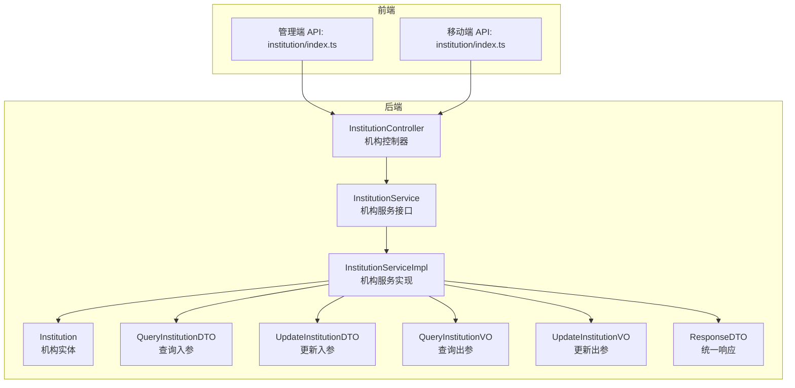
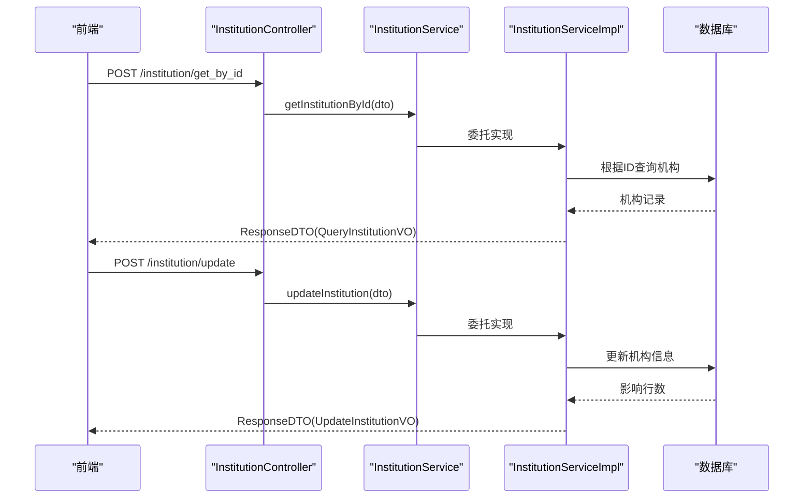
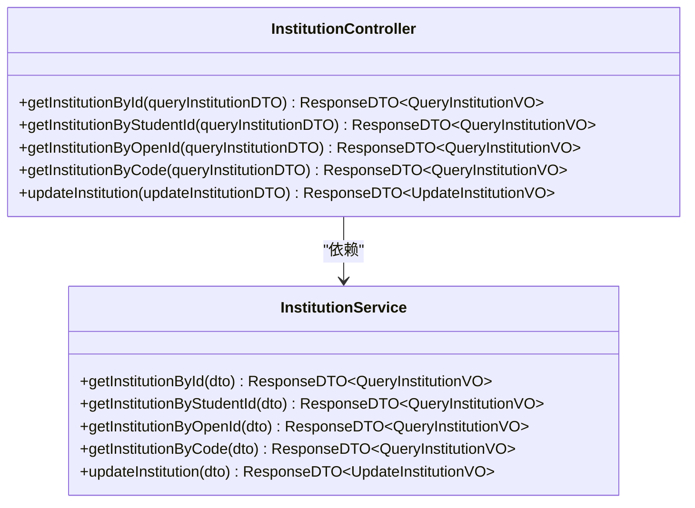
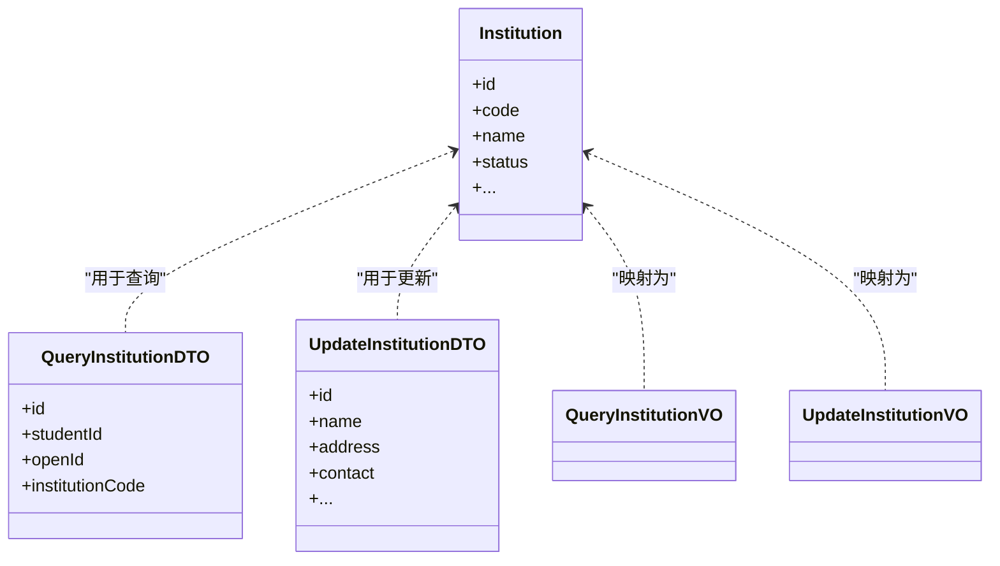
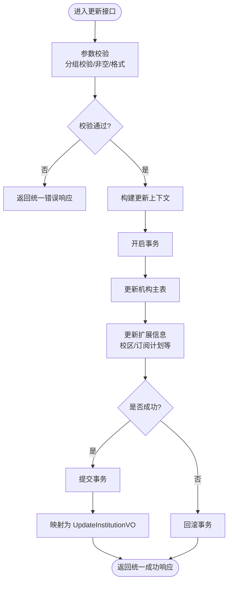
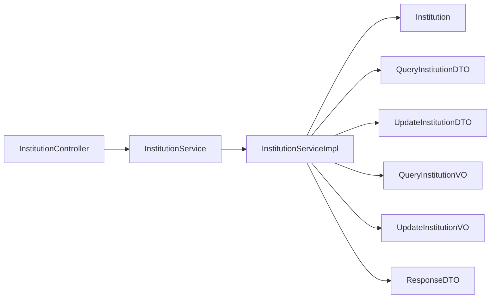

# 机构管理模块

<cite>
**本文引用的文件**
- [InstitutionController.java](file://class_times_record_back/business-service/src/main/java/com/shiroko/controller/InstitutionController.java)
- [InstitutionService.java](file://class_times_record_back/common/src/main/java/com/shiroko/service/InstitutionService.java)
- [InstitutionServiceImpl.java](file://class_times_record_back/business-service/src/main/java/com/shiroko/service/impl/InstitutionServiceImpl.java)
- [Institution.java](file://class_times_record_back/common/src/main/java/com/shiroko/repository/entity/Institution.java)
- [QueryInstitutionDTO.java（业务端）](file://class_times_record_back/common/src/main/java/com/shiroko/repository/dto/institution/QueryInstitutionDTO.java)
- [UpdateInstitutionDTO.java](file://class_times_record_back/common/src/main/java/com/shiroko/repository/dto/institution/UpdateInstitutionDTO.java)
- [QueryInstitutionVO.java](file://class_times_record_back/common/src/main/java/com/shiroko/repository/vo/institution/QueryInstitutionVO.java)
- [UpdateInstitutionVO.java](file://class_times_record_back/common/src/main/java/com/shiroko/repository/vo/institution/UpdateInstitutionVO.java)
- [ResponseDTO.java](file://class_times_record_back/common/src/main/java/com/shiroko/repository/dto/ResponseDTO.java)
</cite>

## 目录
1. [简介](#简介)
2. [项目结构](#项目结构)
3. [核心组件](#核心组件)
4. [架构总览](#架构总览)
5. [详细组件分析](#详细组件分析)
6. [依赖关系分析](#依赖关系分析)
7. [性能考虑](#性能考虑)
8. [故障排查指南](#故障排查指南)
9. [结论](#结论)
10. [附录：API 接口文档](#附录api-接口文档)

## 简介
本模块聚焦“培训机构信息管理”，提供机构基本信息维护、校区管理、订阅计划配置等能力，并围绕机构实体构建与教师、学生、课程之间的关联关系。后端采用分层架构（控制器-服务-仓储），通过统一的响应封装与校验分组实现一致的输入验证与错误处理。前端在管理端与移动端均提供对应页面与 API 调用入口，便于多端统一使用。

## 项目结构
- 后端服务
  - business-service：业务服务层，包含控制器与具体服务实现
  - common：公共领域模型、DTO/VO、通用响应体、服务接口定义等
- 前端应用
  - class_record_admin_front：管理端（Vue）
  - class_times_record：移动端（uni-app）

图表来源
- [InstitutionController.java:1-57](file://class_times_record_back/business-service/src/main/java/com/shiroko/controller/InstitutionController.java#L1-L57)
- [InstitutionService.java:1-30](file://class_times_record_back/common/src/main/java/com/shiroko/service/InstitutionService.java#L1-L30)
- [InstitutionServiceImpl.java](file://class_times_record_back/business-service/src/main/java/com/shiroko/service/impl/InstitutionServiceImpl.java)
- [Institution.java](file://class_times_record_back/common/src/main/java/com/shiroko/repository/entity/Institution.java)
- [QueryInstitutionDTO.java（业务端）](file://class_times_record_back/common/src/main/java/com/shiroko/repository/dto/institution/QueryInstitutionDTO.java)
- [UpdateInstitutionDTO.java](file://class_times_record_back/common/src/main/java/com/shiroko/repository/dto/institution/UpdateInstitutionDTO.java)
- [QueryInstitutionVO.java](file://class_times_record_back/common/src/main/java/com/shiroko/repository/vo/institution/QueryInstitutionVO.java)
- [UpdateInstitutionVO.java](file://class_times_record_back/common/src/main/java/com/shiroko/repository/vo/institution/UpdateInstitutionVO.java)
- [ResponseDTO.java](file://class_times_record_back/common/src/main/java/com/shiroko/repository/dto/ResponseDTO.java)

章节来源
- [InstitutionController.java:1-57](file://class_times_record_back/business-service/src/main/java/com/shiroko/controller/InstitutionController.java#L1-L57)
- [InstitutionService.java:1-30](file://class_times_record_back/common/src/main/java/com/shiroko/service/InstitutionService.java#L1-L30)

## 核心组件
- 控制器层
  - 暴露机构相关 HTTP 接口，负责参数接收、校验分组绑定与结果返回
- 服务层
  - 定义机构业务能力接口，并在实现类中编排查询、更新等流程
- 数据模型
  - 实体：机构主数据
  - DTO：请求入参（按场景拆分）
  - VO：响应出参（面向展示）
  - 统一响应：ResponseDTO 包裹业务结果与状态码

章节来源
- [InstitutionController.java:1-57](file://class_times_record_back/business-service/src/main/java/com/shiroko/controller/InstitutionController.java#L1-L57)
- [InstitutionService.java:1-30](file://class_times_record_back/common/src/main/java/com/shiroko/service/InstitutionService.java#L1-L30)
- [InstitutionServiceImpl.java](file://class_times_record_back/business-service/src/main/java/com/shiroko/service/impl/InstitutionServiceImpl.java)
- [Institution.java](file://class_times_record_back/common/src/main/java/com/shiroko/repository/entity/Institution.java)
- [QueryInstitutionDTO.java（业务端）](file://class_times_record_back/common/src/main/java/com/shiroko/repository/dto/institution/QueryInstitutionDTO.java)
- [UpdateInstitutionDTO.java](file://class_times_record_back/common/src/main/java/com/shiroko/repository/dto/institution/UpdateInstitutionDTO.java)
- [QueryInstitutionVO.java](file://class_times_record_back/common/src/main/java/com/shiroko/repository/vo/institution/QueryInstitutionVO.java)
- [UpdateInstitutionVO.java](file://class_times_record_back/common/src/main/java/com/shiroko/repository/vo/institution/UpdateInstitutionVO.java)
- [ResponseDTO.java](file://class_times_record_back/common/src/main/java/com/shiroko/repository/dto/ResponseDTO.java)

## 架构总览
机构管理模块遵循标准的分层架构：
- 控制器层：路由与参数校验
- 服务层：业务编排与事务边界
- 数据访问层：基于 MyBatis-Plus 的 CRUD 操作
- 统一响应：所有接口以 ResponseDTO 包装返回

图表来源
- [InstitutionController.java:1-57](file://class_times_record_back/business-service/src/main/java/com/shiroko/controller/InstitutionController.java#L1-L57)
- [InstitutionService.java:1-30](file://class_times_record_back/common/src/main/java/com/shiroko/service/InstitutionService.java#L1-L30)
- [InstitutionServiceImpl.java](file://class_times_record_back/business-service/src/main/java/com/shiroko/service/impl/InstitutionServiceImpl.java)

## 详细组件分析

### 控制器：InstitutionController
- 职责
  - 定义 RESTful 风格接口，统一使用 POST 提交 JSON 请求体
  - 使用校验分组对入参进行差异化校验
  - 将请求转发至服务层并返回统一响应
- 关键接口
  - 按 ID 查询机构
  - 按学生标识查询机构
  - 按 OpenId 查询机构
  - 按机构编码查询机构
  - 更新机构信息

图表来源
- [InstitutionController.java:1-57](file://class_times_record_back/business-service/src/main/java/com/shiroko/controller/InstitutionController.java#L1-L57)
- [InstitutionService.java:1-30](file://class_times_record_back/common/src/main/java/com/shiroko/service/InstitutionService.java#L1-L30)

章节来源
- [InstitutionController.java:1-57](file://class_times_record_back/business-service/src/main/java/com/shiroko/controller/InstitutionController.java#L1-L57)

### 服务接口：InstitutionService
- 职责
  - 定义机构领域的查询与更新能力
  - 作为业务编排的统一入口，供控制器调用
- 方法说明
  - 按 ID/学生标识/OpenId/机构编码查询机构
  - 更新机构信息

章节来源
- [InstitutionService.java:1-30](file://class_times_record_back/common/src/main/java/com/shiroko/service/InstitutionService.java#L1-L30)

### 服务实现：InstitutionServiceImpl
- 职责
  - 实现查询与更新逻辑，协调数据访问层完成持久化操作
  - 组装 VO 返回给上层
- 注意
  - 若涉及跨表一致性（如校区、订阅计划），应在同一事务内完成读写与变更

章节来源
- [InstitutionServiceImpl.java](file://class_times_record_back/business-service/src/main/java/com/shiroko/service/impl/InstitutionServiceImpl.java)

### 数据模型与校验
- 实体：Institution
  - 承载机构主数据，字段包括基础信息与扩展属性（如名称、编码、地址、联系方式、状态等）
- 入参 DTO
  - QueryInstitutionDTO：查询条件，支持按 ID、学生标识、OpenId、机构编码等维度查询
  - UpdateInstitutionDTO：更新机构信息的入参，包含需更新的字段集合
- 出参 VO
  - QueryInstitutionVO：查询结果视图对象
  - UpdateInstitutionVO：更新结果视图对象
- 校验分组
  - 控制器中对部分接口使用 @Validated 指定分组，确保不同场景下的必填与格式校验

图表来源
- [Institution.java](file://class_times_record_back/common/src/main/java/com/shiroko/repository/entity/Institution.java)
- [QueryInstitutionDTO.java（业务端）](file://class_times_record_back/common/src/main/java/com/shiroko/repository/dto/institution/QueryInstitutionDTO.java)
- [UpdateInstitutionDTO.java](file://class_times_record_back/common/src/main/java/com/shiroko/repository/dto/institution/UpdateInstitutionDTO.java)
- [QueryInstitutionVO.java](file://class_times_record_back/common/src/main/java/com/shiroko/repository/vo/institution/QueryInstitutionVO.java)
- [UpdateInstitutionVO.java](file://class_times_record_back/common/src/main/java/com/shiroko/repository/vo/institution/UpdateInstitutionVO.java)

章节来源
- [Institution.java](file://class_times_record_back/common/src/main/java/com/shiroko/repository/entity/Institution.java)
- [QueryInstitutionDTO.java（业务端）](file://class_times_record_back/common/src/main/java/com/shiroko/repository/dto/institution/QueryInstitutionDTO.java)
- [UpdateInstitutionDTO.java](file://class_times_record_back/common/src/main/java/com/shiroko/repository/dto/institution/UpdateInstitutionDTO.java)
- [QueryInstitutionVO.java](file://class_times_record_back/common/src/main/java/com/shiroko/repository/vo/institution/QueryInstitutionVO.java)
- [UpdateInstitutionVO.java](file://class_times_record_back/common/src/main/java/com/shiroko/repository/vo/institution/UpdateInstitutionVO.java)

### 业务流程与一致性
- 查询流程
  - 控制器接收请求并进行分组校验
  - 服务层根据条件查询机构主数据，必要时关联查询校区、订阅计划等
  - 组装 VO 并返回
- 更新流程
  - 控制器接收更新请求并进行字段级校验
  - 服务层执行更新，如涉及多表变更，应置于事务中保证一致性
  - 返回更新后的视图对象或影响结果

图表来源
- [InstitutionController.java:1-57](file://class_times_record_back/business-service/src/main/java/com/shiroko/controller/InstitutionController.java#L1-L57)
- [InstitutionServiceImpl.java](file://class_times_record_back/business-service/src/main/java/com/shiroko/service/impl/InstitutionServiceImpl.java)

章节来源
- [InstitutionController.java:1-57](file://class_times_record_back/business-service/src/main/java/com/shiroko/controller/InstitutionController.java#L1-L57)
- [InstitutionServiceImpl.java](file://class_times_record_back/business-service/src/main/java/com/shiroko/service/impl/InstitutionServiceImpl.java)

### 与教师、学生、课程的关联关系
- 学生-机构
  - 通过学生记录中的机构标识建立归属关系，查询时可按学生标识反查所属机构
- 教师-机构
  - 教师通常归属于某一机构，可在教师表中保留机构外键；机构详情可聚合其名下教师数量或列表
- 课程-机构
  - 课程属于机构，课程表应包含机构外键；机构详情可聚合课程列表或统计
- 数据一致性建议
  - 删除机构前检查是否存在关联的学生、教师、课程，若有则拒绝删除或采用软删除策略
  - 变更机构标识时，需同步更新下游关联表的外键引用

章节来源
- [InstitutionController.java:1-57](file://class_times_record_back/business-service/src/main/java/com/shiroko/controller/InstitutionController.java#L1-L57)
- [InstitutionService.java:1-30](file://class_times_record_back/common/src/main/java/com/shiroko/service/InstitutionService.java#L1-L30)
- [InstitutionServiceImpl.java](file://class_times_record_back/business-service/src/main/java/com/shiroko/service/impl/InstitutionServiceImpl.java)

## 依赖关系分析
- 直接依赖
  - 控制器依赖服务接口
  - 服务实现依赖实体、DTO/VO 与统一响应体
- 间接依赖
  - 数据访问层（MyBatis-Plus）由服务实现调用
- 耦合与内聚
  - 控制器仅做路由与校验，业务逻辑集中在服务层，内聚性良好
  - DTO/VO 与实体分离，降低对外暴露的数据结构复杂度

图表来源
- [InstitutionController.java:1-57](file://class_times_record_back/business-service/src/main/java/com/shiroko/controller/InstitutionController.java#L1-L57)
- [InstitutionService.java:1-30](file://class_times_record_back/common/src/main/java/com/shiroko/service/InstitutionService.java#L1-L30)
- [InstitutionServiceImpl.java](file://class_times_record_back/business-service/src/main/java/com/shiroko/service/impl/InstitutionServiceImpl.java)
- [Institution.java](file://class_times_record_back/common/src/main/java/com/shiroko/repository/entity/Institution.java)
- [QueryInstitutionDTO.java（业务端）](file://class_times_record_back/common/src/main/java/com/shiroko/repository/dto/institution/QueryInstitutionDTO.java)
- [UpdateInstitutionDTO.java](file://class_times_record_back/common/src/main/java/com/shiroko/repository/dto/institution/UpdateInstitutionDTO.java)
- [QueryInstitutionVO.java](file://class_times_record_back/common/src/main/java/com/shiroko/repository/vo/institution/QueryInstitutionVO.java)
- [UpdateInstitutionVO.java](file://class_times_record_back/common/src/main/java/com/shiroko/repository/vo/institution/UpdateInstitutionVO.java)
- [ResponseDTO.java](file://class_times_record_back/common/src/main/java/com/shiroko/repository/dto/ResponseDTO.java)

章节来源
- [InstitutionController.java:1-57](file://class_times_record_back/business-service/src/main/java/com/shiroko/controller/InstitutionController.java#L1-L57)
- [InstitutionService.java:1-30](file://class_times_record_back/common/src/main/java/com/shiroko/service/InstitutionService.java#L1-L30)

## 性能考虑
- 查询优化
  - 针对常用查询条件（机构编码、OpenId、学生标识）建立索引
  - 按需加载扩展信息，避免一次性拉取过多关联数据
- 更新优化
  - 批量更新时合并变更，减少往返次数
  - 大对象字段（如富文本、附件路径）单独存储，主表只保留引用
- 缓存策略
  - 机构基础信息适合读多写少，可引入本地或分布式缓存，设置合理过期时间
- 事务范围
  - 控制事务粒度，避免长事务导致锁竞争

[本节为通用性能建议，不直接分析具体文件]

## 故障排查指南
- 常见错误
  - 参数校验失败：检查请求体字段是否符合分组校验规则
  - 未找到机构：确认传入的 ID/编码/标识是否正确且存在
  - 更新失败：检查权限、并发冲突与外键约束
- 定位步骤
  - 查看控制器日志与异常堆栈
  - 核对数据库记录与索引命中情况
  - 复现最小用例，逐步缩小问题范围

章节来源
- [InstitutionController.java:1-57](file://class_times_record_back/business-service/src/main/java/com/shiroko/controller/InstitutionController.java#L1-L57)
- [InstitutionServiceImpl.java](file://class_times_record_back/business-service/src/main/java/com/shiroko/service/impl/InstitutionServiceImpl.java)

## 结论
机构管理模块以清晰的层次划分与统一的响应封装实现了机构信息的查询与更新能力。通过合理的 DTO/VO 设计与校验分组，提升了接口的健壮性与可维护性。后续可扩展校区管理与订阅计划配置，并通过索引、缓存与事务优化提升整体性能。

[本节为总结性内容，不直接分析具体文件]

## 附录：API 接口文档
以下接口均以 POST 方式提交 JSON 请求体，统一响应体为 ResponseDTO。

- 按 ID 查询机构
  - 路径：/institution/get_by_id
  - 请求体：QueryInstitutionDTO（含 id）
  - 响应体：ResponseDTO<QueryInstitutionVO>
  - 错误示例：参数缺失或非法时返回统一错误响应

- 按学生标识查询机构
  - 路径：/institution/get_institution_by_student_id
  - 请求体：QueryInstitutionDTO（含 studentId）
  - 响应体：ResponseDTO<QueryInstitutionVO>

- 按 OpenId 查询机构
  - 路径：/institution/get_by_open_id
  - 请求体：QueryInstitutionDTO（含 openId）
  - 响应体：ResponseDTO<QueryInstitutionVO>

- 按机构编码查询机构
  - 路径：/institution/get_by_institution_code
  - 请求体：QueryInstitutionDTO（含 institutionCode）
  - 响应体：ResponseDTO<QueryInstitutionVO>

- 更新机构信息
  - 路径：/institution/update
  - 请求体：UpdateInstitutionDTO（包含需更新的字段）
  - 响应体：ResponseDTO<UpdateInstitutionVO>
  - 错误示例：校验失败或更新失败时返回统一错误响应

章节来源
- [InstitutionController.java:1-57](file://class_times_record_back/business-service/src/main/java/com/shiroko/controller/InstitutionController.java#L1-L57)
- [InstitutionService.java:1-30](file://class_times_record_back/common/src/main/java/com/shiroko/service/InstitutionService.java#L1-L30)
- [QueryInstitutionDTO.java（业务端）](file://class_times_record_back/common/src/main/java/com/shiroko/repository/dto/institution/QueryInstitutionDTO.java)
- [UpdateInstitutionDTO.java](file://class_times_record_back/common/src/main/java/com/shiroko/repository/dto/institution/UpdateInstitutionDTO.java)
- [QueryInstitutionVO.java](file://class_times_record_back/common/src/main/java/com/shiroko/repository/vo/institution/QueryInstitutionVO.java)
- [UpdateInstitutionVO.java](file://class_times_record_back/common/src/main/java/com/shiroko/repository/vo/institution/UpdateInstitutionVO.java)
- [ResponseDTO.java](file://class_times_record_back/common/src/main/java/com/shiroko/repository/dto/ResponseDTO.java)