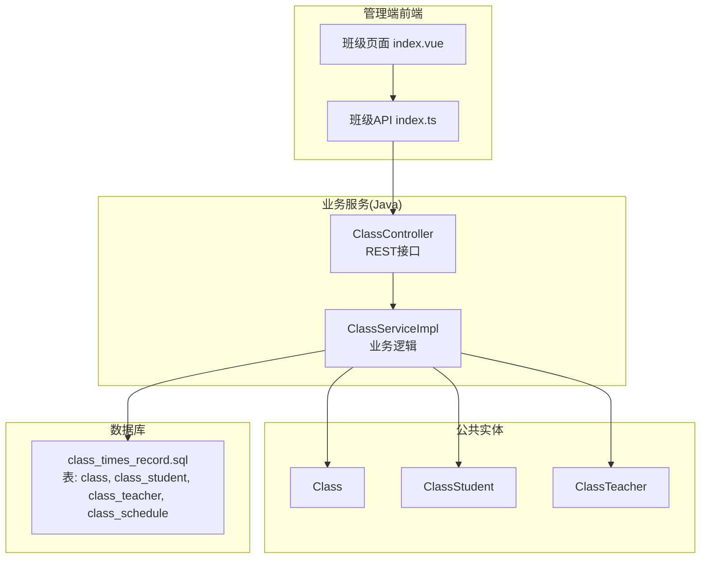
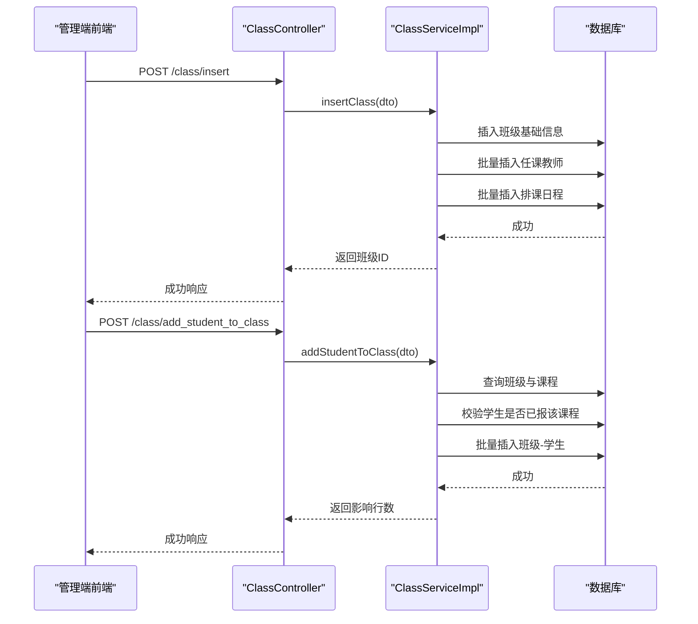
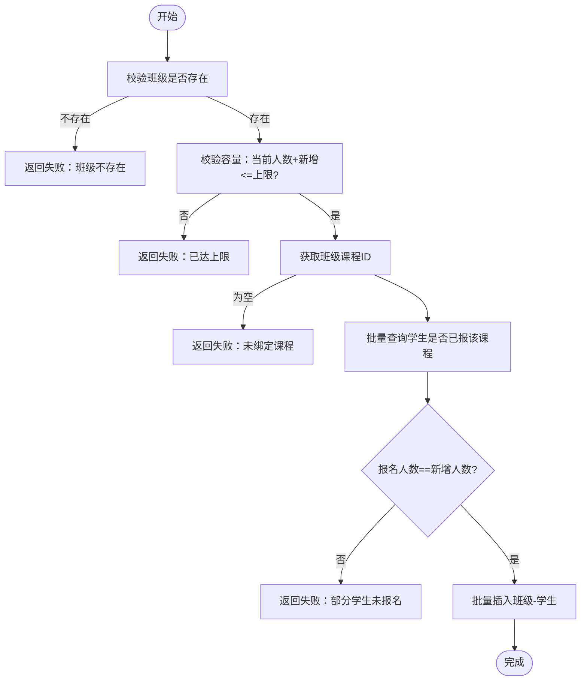
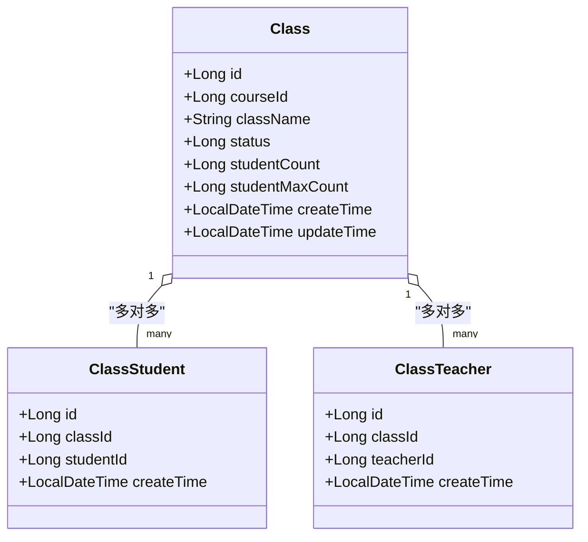
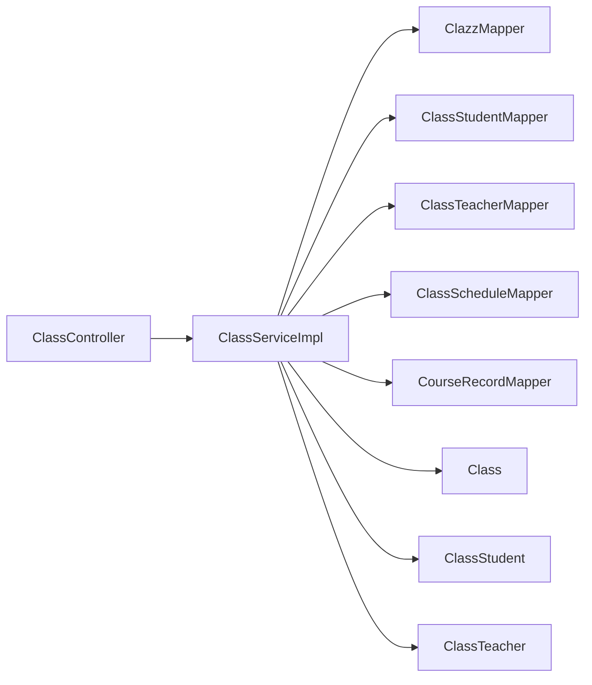

# 班级管理模块

<cite>
**本文引用的文件**   
- [ClassController.java](file://class_times_record_back/business-service/src/main/java/com/shiroko/controller/ClassController.java)
- [ClassServiceImpl.java](file://class_times_record_back/business-service/src/main/java/com/shiroko/service/impl/ClassServiceImpl.java)
- [Class.java](file://class_times_record_back/common/src/main/java/com/shiroko/repository/entity/Class.java)
- [ClassStudent.java](file://class_times_record_back/common/src/main/java/com/shiroko/repository/entity/ClassStudent.java)
- [ClassTeacher.java](file://class_times_record_back/common/src/main/java/com/shiroko/repository/entity/ClassTeacher.java)
- [class_times_record.sql](file://class_times_record_back/docs/class_times_record.sql)
- [index.vue（管理端班级页面）](file://class_record_admin_front/src/views/business/class/index.vue)
- [index.ts（管理端班级API）](file://class_record_admin_front/src/api/class/index.ts)
</cite>

## 目录
1. [简介](#简介)
2. [项目结构](#项目结构)
3. [核心组件](#核心组件)
4. [架构总览](#架构总览)
5. [详细组件分析](#详细组件分析)
6. [依赖关系分析](#依赖关系分析)
7. [性能与容量控制](#性能与容量控制)
8. [故障排查指南](#故障排查指南)
9. [结论](#结论)
10. [附录：API接口文档](#附录api接口文档)

## 简介
本模块聚焦“班级”的完整生命周期管理，覆盖以下能力：
- 班级基本信息维护（名称、课程关联、状态、人数上限等）
- 班级成员管理（教师多对多、学生多对多）
- 班级排课基础（按周几、日期区间、具体时段）
- 容量控制（添加学生时校验是否超员）
- 复杂业务场景（创建、编辑、加入/退出、批量操作、仅更新自身字段等）

## 项目结构
后端采用分层架构：控制器层暴露REST接口，服务层实现业务逻辑，数据访问层通过Mapper对接数据库；实体类定义在公共模块中。前端管理端提供班级列表、创建、编辑等页面与API封装。



图示来源
- [ClassController.java:1-75](file://class_times_record_back/business-service/src/main/java/com/shiroko/controller/ClassController.java#L1-L75)
- [ClassServiceImpl.java:1-282](file://class_times_record_back/business-service/src/main/java/com/shiroko/service/impl/ClassServiceImpl.java#L1-L282)
- [Class.java:1-68](file://class_times_record_back/common/src/main/java/com/shiroko/repository/entity/Class.java#L1-L68)
- [ClassStudent.java:1-53](file://class_times_record_back/common/src/main/java/com/shiroko/repository/entity/ClassStudent.java#L1-L53)
- [ClassTeacher.java:1-43](file://class_times_record_back/common/src/main/java/com/shiroko/repository/entity/ClassTeacher.java#L1-L43)
- [class_times_record.sql:37-105](file://class_times_record_back/docs/class_times_record.sql#L37-L105)

章节来源
- [ClassController.java:1-75](file://class_times_record_back/business-service/src/main/java/com/shiroko/controller/ClassController.java#L1-L75)
- [ClassServiceImpl.java:1-282](file://class_times_record_back/business-service/src/main/java/com/shiroko/service/impl/ClassServiceImpl.java#L1-L282)
- [class_times_record.sql:37-105](file://class_times_record_back/docs/class_times_record.sql#L37-L105)

## 核心组件
- 控制器层：统一接收请求参数并委托服务处理，返回标准响应体。
- 服务层：实现班级查询、创建、更新、成员增删等核心流程，包含容量校验、报名校验、事务控制。
- 实体层：班级、班级-学生、班级-老师三张核心实体，支撑多对多关系。
- 数据库：以独立关联表实现多对多，使用唯一索引保证幂等与一致性。

章节来源
- [ClassController.java:1-75](file://class_times_record_back/business-service/src/main/java/com/shiroko/controller/ClassController.java#L1-L75)
- [ClassServiceImpl.java:1-282](file://class_times_record_back/business-service/src/main/java/com/shiroko/service/impl/ClassServiceImpl.java#L1-L282)
- [Class.java:1-68](file://class_times_record_back/common/src/main/java/com/shiroko/repository/entity/Class.java#L1-L68)
- [ClassStudent.java:1-53](file://class_times_record_back/common/src/main/java/com/shiroko/repository/entity/ClassStudent.java#L1-L53)
- [ClassTeacher.java:1-43](file://class_times_record_back/common/src/main/java/com/shiroko/repository/entity/ClassTeacher.java#L1-L43)

## 架构总览
从调用链路看，管理端前端通过API封装发起HTTP请求，进入业务服务的控制器，再落到服务实现进行业务校验与持久化。



图示来源
- [ClassController.java:65-73](file://class_times_record_back/business-service/src/main/java/com/shiroko/controller/ClassController.java#L65-L73)
- [ClassServiceImpl.java:172-222](file://class_times_record_back/business-service/src/main/java/com/shiroko/service/impl/ClassServiceImpl.java#L172-L222)
- [ClassServiceImpl.java:96-160](file://class_times_record_back/business-service/src/main/java/com/shiroko/service/impl/ClassServiceImpl.java#L96-L160)

## 详细组件分析

### 数据模型与关系设计
- 班级表：记录课程关联、名称、状态、人数统计与上限等。
- 班级-学生表：多对多中间表，唯一键(class_id, student_id)避免重复绑定。
- 班级-教师表：多对多中间表，唯一键(class_id, teacher_id)避免重复绑定。
- 排课表：记录班级的上课周期（起止日期）、星期几、具体时间段与备注。

```mermaid
erDiagram
CLASS {
int id PK
int course_id FK
string class_name
tinyint status
int student_count
int student_max_count
datetime create_time
datetime update_time
}
CLASS_STUDENT {
int id PK
int class_id FK
int student_id FK
datetime create_time
}
CLASS_TEACHER {
int id PK
int class_id FK
int teacher_id FK
datetime create_time
}
CLASS_SCHEDULE {
int id PK
int class_id FK
date start_date
date end_date
tinyint day_of_week
time start_time
time end_time
varchar remark
datetime create_time
datetime update_time
}
COURSE {
int id PK
string course_name
}
STUDENT {
int id PK
}
TEACHER {
int id PK
}
CLASS ||--o{ CLASS_STUDENT : "拥有"
CLASS ||--o{ CLASS_TEACHER : "拥有"
CLASS ||--o{ CLASS_SCHEDULE : "排课"
COURSE ||--o{ CLASS : "被关联"
STUDENT ||--o{ CLASS_STUDENT : "参与"
TEACHER ||--o{ CLASS_TEACHER : "任教"
```

图示来源
- [class_times_record.sql:37-105](file://class_times_record_back/docs/class_times_record.sql#L37-L105)

章节来源
- [class_times_record.sql:37-105](file://class_times_record_back/docs/class_times_record.sql#L37-L105)

### 控制器层（ClassController）
职责：
- 暴露班级相关REST接口：按学生/教师/机构查询、按ID查询、添加/移除学生、创建/更新班级。
- 统一入参出参格式，便于前后端协作。

关键接口路径（示例）：
- POST /class/get_classes_by_student_id
- POST /class/get_classes_by_teacher_id
- POST /class/get_classes_by_institution_id
- POST /class/get_class_by_id
- POST /class/add_student_to_class
- POST /class/remove_student_from_class
- POST /class/insert
- POST /class/update_by_id

章节来源
- [ClassController.java:35-73](file://class_times_record_back/business-service/src/main/java/com/shiroko/controller/ClassController.java#L35-L73)

### 服务层（ClassServiceImpl）
职责：
- 查询：按学生/教师/机构维度聚合班级信息。
- 创建：写入班级基础信息、批量写入任课教师、批量写入排课日程。
- 更新：支持仅更新班级自身字段或全量替换教师与日程。
- 成员管理：添加学生前进行容量与报名校验，移除学生走批量删除。

核心流程要点：
- 容量控制：添加学生时，若当前人数+新增人数超过上限则拒绝。
- 报名校验：新增学生必须已在该班级对应课程下存在课时记录，否则拒绝并提示未报名学生。
- 幂等保护：插入班级-学生时捕获唯一键冲突，提示“已存在”。
- 事务性：涉及多表写操作的方法具备事务语义，确保一致性。



图示来源
- [ClassServiceImpl.java:96-160](file://class_times_record_back/business-service/src/main/java/com/shiroko/service/impl/ClassServiceImpl.java#L96-L160)

章节来源
- [ClassServiceImpl.java:96-160](file://class_times_record_back/business-service/src/main/java/com/shiroko/service/impl/ClassServiceImpl.java#L96-L160)
- [ClassServiceImpl.java:172-222](file://class_times_record_back/business-service/src/main/java/com/shiroko/service/impl/ClassServiceImpl.java#L172-L222)
- [ClassServiceImpl.java:232-275](file://class_times_record_back/business-service/src/main/java/com/shiroko/service/impl/ClassServiceImpl.java#L232-L275)

### 实体层（Class / ClassStudent / ClassTeacher）
- Class：承载班级主数据，包括课程ID、名称、状态、人数统计与上限等。
- ClassStudent：班级与学生多对多的中间表实体。
- ClassTeacher：班级与教师多对多的中间表实体。



图示来源
- [Class.java:1-68](file://class_times_record_back/common/src/main/java/com/shiroko/repository/entity/Class.java#L1-L68)
- [ClassStudent.java:1-53](file://class_times_record_back/common/src/main/java/com/shiroko/repository/entity/ClassStudent.java#L1-L53)
- [ClassTeacher.java:1-43](file://class_times_record_back/common/src/main/java/com/shiroko/repository/entity/ClassTeacher.java#L1-L43)

章节来源
- [Class.java:1-68](file://class_times_record_back/common/src/main/java/com/shiroko/repository/entity/Class.java#L1-L68)
- [ClassStudent.java:1-53](file://class_times_record_back/common/src/main/java/com/shiroko/repository/entity/ClassStudent.java#L1-L53)
- [ClassTeacher.java:1-43](file://class_times_record_back/common/src/main/java/com/shiroko/repository/entity/ClassTeacher.java#L1-L43)

### 前端集成与管理端入口
- 管理端页面：提供班级列表、创建、编辑等交互。
- API封装：将后端接口封装为可复用的方法，供页面调用。

章节来源
- [index.vue（管理端班级页面）](file://class_record_admin_front/src/views/business/class/index.vue)
- [index.ts（管理端班级API）](file://class_record_admin_front/src/api/class/index.ts)

## 依赖关系分析
- 控制器依赖服务接口，服务实现依赖多个Mapper（班级、班级-学生、班级-教师、排课、课时记录）。
- 实体与数据库表一一对应，多对多通过中间表实现，配合唯一索引保障数据一致性。
- 前端通过API封装与后端通信，形成清晰的前后端契约。



图示来源
- [ClassController.java:1-75](file://class_times_record_back/business-service/src/main/java/com/shiroko/controller/ClassController.java#L1-L75)
- [ClassServiceImpl.java:1-282](file://class_times_record_back/business-service/src/main/java/com/shiroko/service/impl/ClassServiceImpl.java#L1-L282)

章节来源
- [ClassController.java:1-75](file://class_times_record_back/business-service/src/main/java/com/shiroko/controller/ClassController.java#L1-L75)
- [ClassServiceImpl.java:1-282](file://class_times_record_back/business-service/src/main/java/com/shiroko/service/impl/ClassServiceImpl.java#L1-L282)

## 性能与容量控制
- 容量控制：在添加学生前进行人数上限校验，避免超员。
- 批量操作：添加/移除学生、插入教师与排课均使用批量接口，减少往返次数。
- 查询优化：只选择必要字段，降低网络与序列化开销。
- 幂等与去重：利用唯一索引防止重复绑定，提升健壮性。

[本节为通用指导，不直接分析具体文件]

## 故障排查指南
常见问题与建议：
- 添加学生失败且提示“已达上限”：检查班级最大人数与实际人数，必要时扩容或先移除多余学生。
- 添加学生失败且提示“未报名”：确认学生在该班级对应课程下存在课时记录。
- 添加学生失败且提示“已存在”：说明该学生已在班级中，无需重复添加。
- 更新班级失败：检查必填字段与传参完整性，确认仅更新自身字段开关是否正确设置。

章节来源
- [ClassServiceImpl.java:96-160](file://class_times_record_back/business-service/src/main/java/com/shiroko/service/impl/ClassServiceImpl.java#L96-L160)
- [ClassServiceImpl.java:232-275](file://class_times_record_back/business-service/src/main/java/com/shiroko/service/impl/ClassServiceImpl.java#L232-L275)

## 结论
本模块围绕“班级”构建了完整的CRUD与成员管理能力，结合容量控制与报名校验，确保业务规则落地。通过多对中间表实现教师与学生的多对多关系，并通过排课表支撑基础排课需求。整体架构清晰、扩展性强，适合后续增加分组策略、合并拆分等更复杂的业务场景。

[本节为总结，不直接分析具体文件]

## 附录：API接口文档
以下为班级相关接口清单（基于控制器暴露的路径）：
- 查询接口
  - POST /class/get_classes_by_student_id
  - POST /class/get_classes_by_teacher_id
  - POST /class/get_classes_by_institution_id
  - POST /class/get_class_by_id
- 成员管理
  - POST /class/add_student_to_class
  - POST /class/remove_student_from_class
- 班级维护
  - POST /class/insert
  - POST /class/update_by_id

章节来源
- [ClassController.java:35-73](file://class_times_record_back/business-service/src/main/java/com/shiroko/controller/ClassController.java#L35-L73)