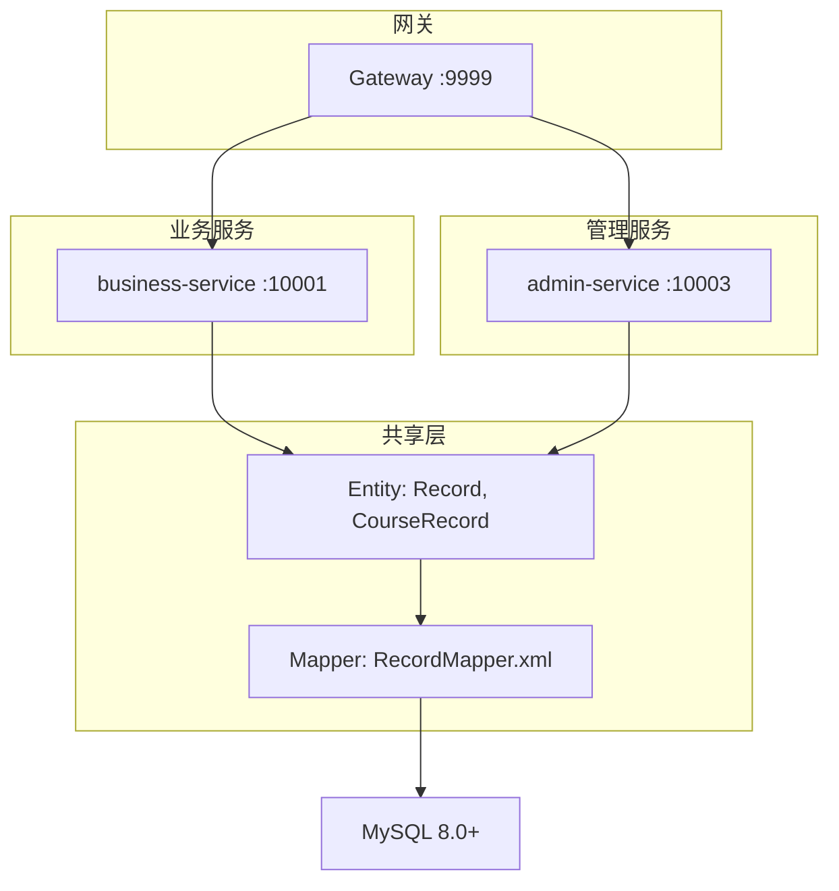
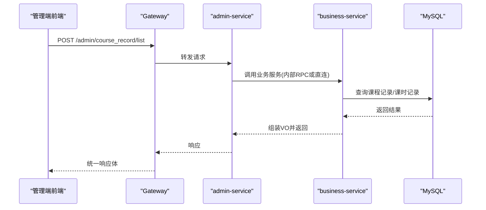
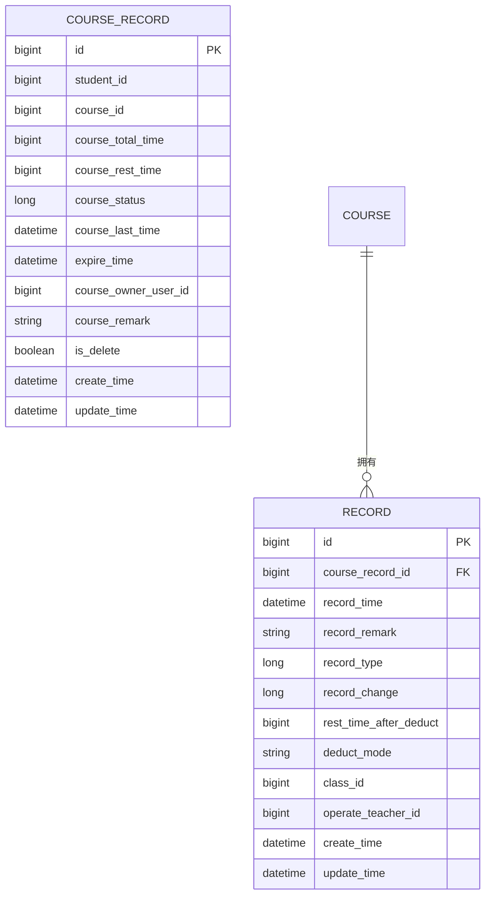
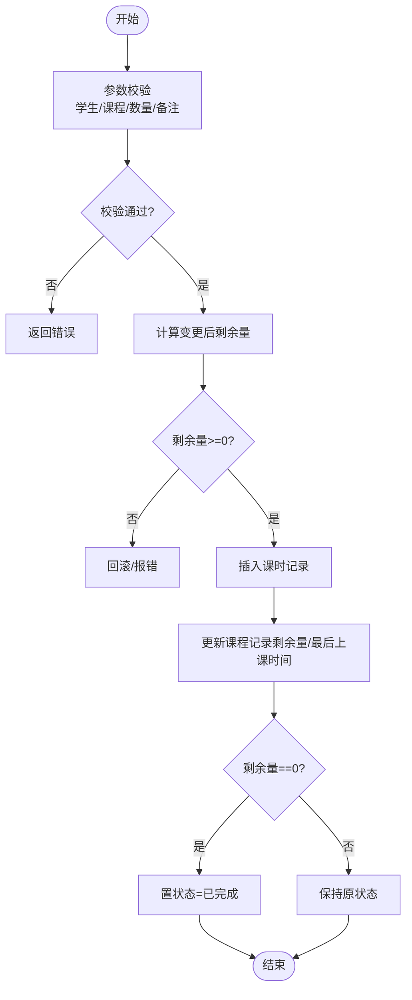
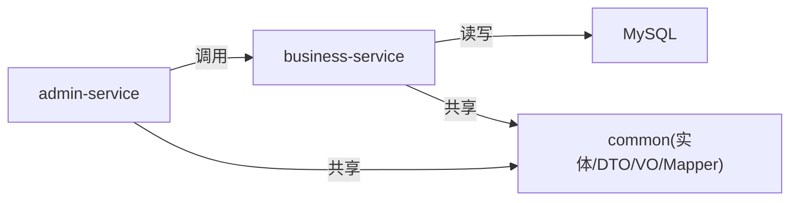

# 记录管理模块

<cite>
**本文引用的文件**
- [CLAUDE.md](file://CLAUDE.md)
- [architecture.md](file://class_times_record_back/docs/architecture.md)
- [Record.java](file://class_times_record_back/common/src/main/java/com/shiroko/repository/entity/Record.java)
- [CourseRecord.java](file://class_times_record_back/common/src/main/java/com/shiroko/repository/entity/CourseRecord.java)
- [RecordMapper.xml](file://class_times_record_back/common/src/main/resources/com/shiroko/mapper/RecordMapper.xml)
- [AdminBusinessController.java](file://class_times_record_back/admin-service/src/main/java/com/shiroko/controller/AdminBusinessController.java)
- [AdminBusinessService.java](file://class_times_record_back/admin-service/src/main/java/com/shiroko/service/AdminBusinessService.java)
</cite>

## 目录
1. [引言](#引言)
2. [项目结构](#项目结构)
3. [核心组件](#核心组件)
4. [架构总览](#架构总览)
5. [详细组件分析](#详细组件分析)
6. [依赖关系分析](#依赖关系分析)
7. [性能与扩展性](#性能与扩展性)
8. [故障排查指南](#故障排查指南)
9. [结论](#结论)
10. [附录：API 接口文档](#附录api-接口文档)

## 引言
本章节聚焦“记录管理模块”，围绕课时记录（Record）与课程记录（CourseRecord）的统一管理进行系统化说明。内容涵盖：
- 记录类型定义、数据结构设计与关联关系
- 记录的创建流程、查询统计与批量处理
- 分类管理、状态流转与数据完整性保证
- 同步机制、历史归档策略与最佳实践
- 面向管理与业务端的 API 规范与调用要点

该模块贯穿“购课—扣课—明细”的完整链路，是教学机构课时资产管理的核心。

## 项目结构
后端采用 Spring Cloud Alibaba 微服务架构，记录相关能力主要分布在以下位置：
- 实体与映射：common 模块中的实体类与 MyBatis XML
- 控制器与服务：admin-service 提供管理端统一入口；business-service 承载核心业务逻辑
- 网关路由：统一前缀 /biz/** 与 /admin/** 分发至对应服务

图表来源
- [architecture.md:47-65](file://class_times_record_back/docs/architecture.md#L47-L65)
- [Record.java:1-102](file://class_times_record_back/common/src/main/java/com/shiroko/repository/entity/Record.java#L1-L102)
- [CourseRecord.java:1-111](file://class_times_record_back/common/src/main/java/com/shiroko/repository/entity/CourseRecord.java#L1-L111)
- [RecordMapper.xml:1-86](file://class_times_record_back/common/src/main/resources/com/shiroko/mapper/RecordMapper.xml#L1-L86)

章节来源
- [CLAUDE.md:25-76](file://CLAUDE.md#L25-L76)
- [architecture.md:47-65](file://class_times_record_back/docs/architecture.md#L47-L65)

## 核心组件
- 课程记录（CourseRecord）：代表学生购买某课程的“账户”，维护总量、剩余量、状态、过期时间等，作为课时变更的归属主体。
- 课时记录（Record）：对课程记录的“流水明细”，记录每次增减、操作人、扣费模式、快照剩余等，用于审计与统计。
- 查询映射（RecordMapper.xml）：聚合课程、学生、教师信息，支持按机构、学生、课程、记录类型等多条件分页查询。

章节来源
- [CourseRecord.java:1-111](file://class_times_record_back/common/src/main/java/com/shiroko/repository/entity/CourseRecord.java#L1-L111)
- [Record.java:1-102](file://class_times_record_back/common/src/main/java/com/shiroko/repository/entity/Record.java#L1-L102)
- [RecordMapper.xml:1-86](file://class_times_record_back/common/src/main/resources/com/shiroko/mapper/RecordMapper.xml#L1-L86)

## 架构总览
记录管理在微服务中的职责划分：
- business-service：实现课程记录与课时记录的增删改查、扣课、批量新增等核心业务
- admin-service：提供管理端统一的列表、新增、更新、删除等入口，便于后台运营
- common：实体、DTO/VO、转换器、Mapper 等共享资源
- Gateway：统一鉴权、签名校验、路由转发

图表来源
- [AdminBusinessController.java:72-79](file://class_times_record_back/admin-service/src/main/java/com/shiroko/controller/AdminBusinessController.java#L72-L79)
- [AdminBusinessController.java:203-226](file://class_times_record_back/admin-service/src/main/java/com/shiroko/controller/AdminBusinessController.java#L203-L226)
- [architecture.md:59-65](file://class_times_record_back/docs/architecture.md#L59-L65)

## 详细组件分析

### 数据模型与关系
- 课程记录（CourseRecord）
  - 关键字段：学生ID、课程ID、总课时、剩余课时、状态、上次上课时间、过期时间、归属用户、备注、逻辑删除标记
  - 作用：课时资产的“账户”，所有课时变动均影响其剩余量与状态
- 课时记录（Record）
  - 关键字段：课程记录ID、记录时间、备注、记录类型（增/减）、课时变更量、扣费后剩余快照、扣费模式（按学生/课程/班级）、班级ID、操作人ID
  - 作用：课时变动的不可篡改流水，支撑审计、对账与报表
- 关联关系
  - CourseRecord 1:N Record
  - Record 通过 operate_teacher_id 关联 c_teacher
  - Record 通过 course_record_id 关联 c_course_record，再间接关联 c_student、c_course

图表来源
- [CourseRecord.java:1-111](file://class_times_record_back/common/src/main/java/com/shiroko/repository/entity/CourseRecord.java#L1-L111)
- [Record.java:1-102](file://class_times_record_back/common/src/main/java/com/shiroko/repository/entity/Record.java#L1-L102)

章节来源
- [CourseRecord.java:1-111](file://class_times_record_back/common/src/main/java/com/shiroko/repository/entity/CourseRecord.java#L1-L111)
- [Record.java:1-102](file://class_times_record_back/common/src/main/java/com/shiroko/repository/entity/Record.java#L1-L102)

### 记录类型与分类
- 记录类型（record_type）
  - 1：增加课时
  - 2：减少课时
- 扣费模式（deduct_mode）
  - BY_STUDENT：按学生维度扣课
  - BY_COURSE：按课程维度扣课
  - BY_CLASS：按班级维度扣课
- 分类建议
  - 以“记录类型 + 扣费模式”为维度进行分类与筛选
  - 结合“机构ID、学生ID、课程名称、记录时间范围”形成多维查询

章节来源
- [Record.java:52-73](file://class_times_record_back/common/src/main/java/com/shiroko/repository/entity/Record.java#L52-L73)
- [RecordMapper.xml:66-82](file://class_times_record_back/common/src/main/resources/com/shiroko/mapper/RecordMapper.xml#L66-L82)

### 状态流转与数据一致性
- 课程记录状态（course_status）
  - 0：未定义/初始
  - 1：未完成
  - 2：已完成
- 状态触发点
  - 新增购课：初始化状态为未完成
  - 扣课：当剩余课时归零时，可置为已完成
  - 过期：expire_time 到达后，可自动置为已完成或冻结
- 一致性保障
  - 事务边界：一次扣课需同时写入 Record 并更新 CourseRecord 剩余量，确保原子性
  - 快照字段：rest_time_after_deduct 记录扣费后的剩余课时，便于审计与回溯
  - 幂等与防重：批量新增时需基于唯一键或业务幂等键避免重复入账

章节来源
- [CourseRecord.java:58-76](file://class_times_record_back/common/src/main/java/com/shiroko/repository/entity/CourseRecord.java#L58-L76)
- [Record.java:64-67](file://class_times_record_back/common/src/main/java/com/shiroko/repository/entity/Record.java#L64-L67)

### 记录创建流程（单条/批量）
- 单条新增
  - 入参校验（学生/课程/数量/备注等）
  - 计算变更后剩余量，校验是否越界
  - 插入 Record，更新 CourseRecord 剩余量与最后上课时间
  - 若剩余量为 0，更新状态为已完成
- 批量新增
  - 逐条校验与计算，必要时分批提交
  - 失败回滚或记录错误明细，保证整体一致性
- 扣课路径
  - 支持按学生/课程/班级三种模式
  - 按班级扣课时，class_id 写入 Record，便于后续统计

图表来源
- [Record.java:52-73](file://class_times_record_back/common/src/main/java/com/shiroko/repository/entity/Record.java#L52-L73)
- [CourseRecord.java:46-76](file://class_times_record_back/common/src/main/java/com/shiroko/repository/entity/CourseRecord.java#L46-L76)

### 记录查询与统计
- 多条件查询
  - 机构ID、学生ID、课程记录ID、课程名称模糊匹配、记录类型
  - 默认按记录时间倒序排序
- 聚合视图
  - 通过 ResultMap 将课程、学生、教师信息一并返回，便于前端展示
- 统计指标建议
  - 按机构/学生/课程维度的课时消耗总量、剩余总量
  - 按记录类型的分布占比
  - 近N日新增/扣减趋势

章节来源
- [RecordMapper.xml:43-84](file://class_times_record_back/common/src/main/resources/com/shiroko/mapper/RecordMapper.xml#L43-L84)

### 管理端统一入口
- 列表查询
  - 课程记录列表：POST /admin/course_record/list
  - 课时记录列表：POST /admin/record/list
- 新增/更新/删除
  - 课程记录：insert/update/delete
  - 课时记录：insert
- 控制层仅负责接收 DTO、调用 Service、封装 ResponseDTO，不直接访问 Mapper

章节来源
- [AdminBusinessController.java:72-79](file://class_times_record_back/admin-service/src/main/java/com/shiroko/controller/AdminBusinessController.java#L72-L79)
- [AdminBusinessController.java:203-226](file://class_times_record_back/admin-service/src/main/java/com/shiroko/controller/AdminBusinessController.java#L203-L226)
- [AdminBusinessService.java:9-10](file://class_times_record_back/admin-service/src/main/java/com/shiroko/service/AdminBusinessService.java#L9-L10)

## 依赖关系分析
- 模块内依赖
  - admin-service 依赖 common 的 DTO/VO/Entity，并通过 Service 层调用 business-service 的业务能力
  - business-service 依赖 common 的 Entity/Mapper，完成持久化
- 外部依赖
  - MySQL：存储课程记录与课时记录
  - Nacos/Sentinel：注册发现与流量治理（由网关与服务共同使用）
- 耦合与内聚
  - 记录查询强依赖多表 JOIN，建议在高频场景引入缓存或预聚合表
  - 扣课逻辑需严格事务边界，避免并发导致剩余量不一致

图表来源
- [architecture.md:47-65](file://class_times_record_back/docs/architecture.md#L47-L65)
- [RecordMapper.xml:1-86](file://class_times_record_back/common/src/main/resources/com/shiroko/mapper/RecordMapper.xml#L1-L86)

章节来源
- [architecture.md:47-65](file://class_times_record_back/docs/architecture.md#L47-L65)

## 性能与扩展性
- 查询优化
  - 合理索引：student_id、course_record_id、record_time、record_type、operate_teacher_id
  - 分页查询：限制返回字段，避免大对象传输
  - 热点数据缓存：课程记录余额、最近变更记录
- 写入优化
  - 批量新增：分批次提交，降低单次事务压力
  - 异步落库：非关键路径（如通知、日志）异步处理
- 扩展建议
  - 中间表实体化：teacher_course、role_menu 等无实体中间表建议实体化，便于扩展与维护
  - 版本化接口：new_get/newGetCourseRecords 等新旧接口并存，建议采用 /v1/、/v2/ 路径管理
  - 跨服务调用：business-service 对 auth-service 的引用可通过 Feign/RPC 解耦

章节来源
- [architecture.md:635-644](file://class_times_record_back/docs/architecture.md#L635-L644)

## 故障排查指南
- 常见问题定位
  - 剩余课时为负：检查扣课事务是否完整、并发是否加锁
  - 记录缺失：核对批量新增的事务边界与重试策略
  - 查询缓慢：检查 SQL 执行计划与索引命中情况
- 日志与追踪
  - 开启 SQL 日志（开发环境），关注慢查询
  - 结合网关与服务的拦截器日志，确认鉴权与签名问题
- 配置与部署
  - 确认 Nacos 服务发现正常、Sentinel 限流规则未误伤
  - 数据库连接池与虚拟线程配置符合预期

章节来源
- [architecture.md:250-262](file://class_times_record_back/docs/architecture.md#L250-L262)
- [CLAUDE.md:53-68](file://CLAUDE.md#L53-L68)

## 结论
记录管理模块以 CourseRecord 为资产账户、Record 为流水明细，构建了完整的课时生命周期管理能力。通过统一的管理端入口与标准化的 API 风格，实现了跨角色、跨端的一致体验。未来可在索引优化、缓存与批处理方面持续演进，进一步提升稳定性与吞吐。

## 附录：API 接口文档

### 管理端（/admin/**）
- 课程记录
  - POST /admin/course_record/list：分页查询课程记录
  - POST /admin/course_record/insert：新增课程记录
  - POST /admin/course_record/update：更新课程记录
  - POST /admin/course_record/delete：删除课程记录（逻辑删除）
- 课时记录
  - POST /admin/record/list：分页查询课时记录
  - POST /admin/record/insert：新增课时记录

章节来源
- [AdminBusinessController.java:72-79](file://class_times_record_back/admin-service/src/main/java/com/shiroko/controller/AdminBusinessController.java#L72-L79)
- [AdminBusinessController.java:203-226](file://class_times_record_back/admin-service/src/main/java/com/shiroko/controller/AdminBusinessController.java#L203-L226)

### 业务端（/biz/**）
- 课时记录
  - POST /biz/record/get：分页查询课时记录
  - POST /biz/record/new_get：新版查询（扩展筛选）
  - POST /biz/record/add：单条新增
  - POST /biz/record/add_all：批量新增
- 课程记录
  - POST /biz/course_record/get：分页查询
  - POST /biz/course_record/new_get：新版分页查询
  - POST /biz/course_record/add：新增（旧校验组）
  - POST /biz/course_record/insert：新增（新校验组）
  - POST /biz/course_record/update：更新
  - POST /biz/course_record/delete：删除（逻辑删除）
  - POST /biz/course_record/deduct_by_student_id：按学生扣课
  - POST /biz/course_record/deduct_by_course_id：按课程扣课
  - POST /biz/course_record/deduct_by_class_id：按班级扣课
  - POST /biz/course_record/get_by_student_id：按学生查询

章节来源
- [architecture.md:525-578](file://class_times_record_back/docs/architecture.md#L525-L578)