# 课时记录管理模块

<cite>
**本文引用的文件**   
- [CLAUDE.md](file://CLAUDE.md)
- [CourseRecordController.java](file://class_times_record_back/business-service/src/main/java/com/shiroko/controller/CourseRecordController.java)
- [CourseRecordService.java](file://class_times_record_back/common/src/main/java/com/shiroko/service/CourseRecordService.java)
- [CourseRecordServiceImpl.java](file://class_times_record_back/business-service/src/main/java/com/shiroko/service/impl/CourseRecordServiceImpl.java)
- [CourseRecordMapper.java](file://class_times_record_back/common/src/main/java/com/shiroko/mapper/CourseRecordMapper.java)
- [CourseRecordConverter.java](file://class_times_record_back/common/src/main/java/com/shiroko/converter/CourseRecordConverter.java)
- [CourseRecord.java](file://class_times_record_back/common/src/main/java/com/shiroko/repository/entity/CourseRecord.java)
- [CourseRecordDTO.java](file://class_times_record_back/common/src/main/java/com/shiroko/repository/dto/courserecord/CourseRecordDTO.java)
- [CourseRecordVO.java](file://class_times_record_back/common/src/main/java/com/shiroko/repository/vo/courserecord/CourseRecordVO.java)
- [index.ts（小程序端）](file://class_times_record/src/api/course-record/index.ts)
- [index.vue（小程序端-课时记录列表）](file://class_times_record/src/pages/main/teacher/manage-course-record/index.vue)
- [index.vue（小程序端-快速消课）](file://class_times_record/src/pages/main/teacher/fast-deduct/index.vue)
- [index.vue（小程序端-扣费详情）](file://class_times_record/src/pages/main/parent/deduct-detail/index.vue)
- [index.d.ts（小程序端-类型定义）](file://class_times_record/src/types/course-record.d.ts)
- [index.ts（管理端API）](file://class_record_admin_front/src/api/course-record/index.ts)
- [business.d.ts（管理端类型）](file://class_record_admin_front/src/types/business.d.ts)
- [index.vue（管理端-课时记录）](file://class_record_admin_front/src/views/business/course-record/index.vue)
</cite>

## 目录
1. [简介](#简介)
2. [项目结构](#项目结构)
3. [核心组件](#核心组件)
4. [架构总览](#架构总览)
5. [详细组件分析](#详细组件分析)
6. [依赖关系分析](#依赖关系分析)
7. [性能与扩展性](#性能与扩展性)
8. [故障排查指南](#故障排查指南)
9. [结论](#结论)
10. [附录：API 接口文档](#附录api-接口文档)

## 简介
本模块围绕“课时记录”的核心业务，提供上课记录创建、课时扣减处理、请假与补课管理、余额计算与退费流程、批量扣费、课时统计报表、异常处理机制、生命周期管理与数据审计追踪等能力。后端采用 Spring Cloud Alibaba 微服务架构，前端包含管理端与微信小程序端，统一通过网关路由到业务服务进行处理。

## 项目结构
- 后端
  - 网关：统一鉴权与路由
  - 认证服务：登录、鉴权、菜单权限
  - 业务服务：课程、班级、排课、课时记录、记录流水等核心业务
  - 公共模块：实体、DTO/VO、转换器、通用 Mapper、通用 Service 接口
- 前端
  - 管理端：Vue 3 + Element Plus，用于教务管理
  - 小程序端：uni-app，教师与家长使用

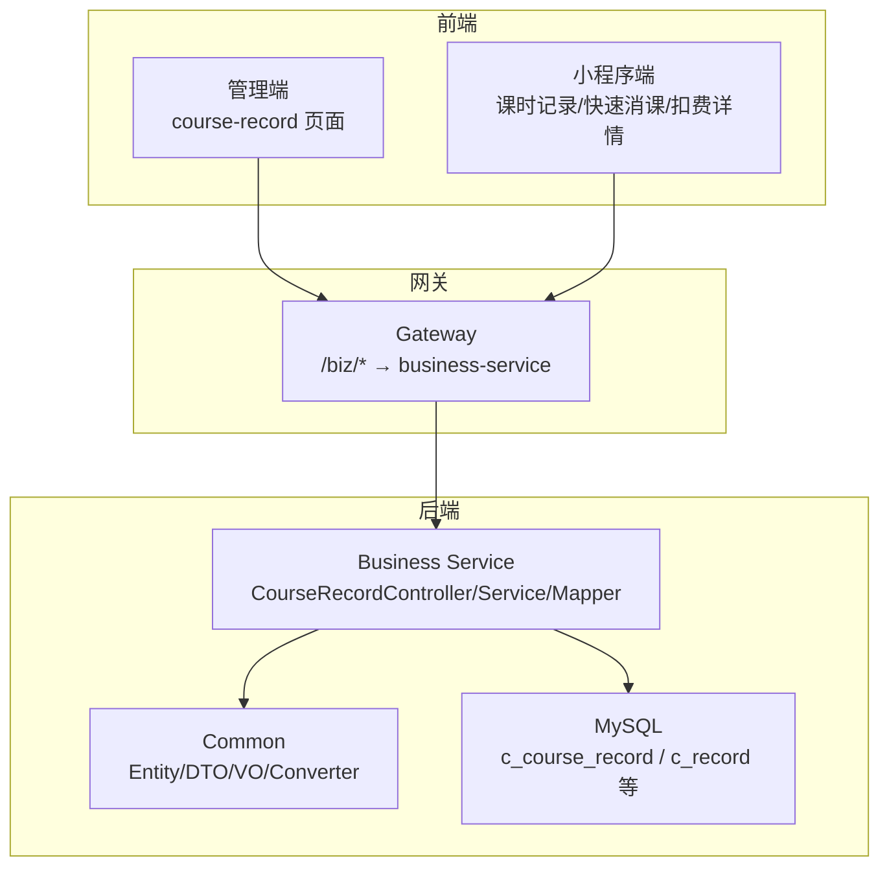

图表来源
- [CLAUDE.md:41-51](file://CLAUDE.md#L41-L51)
- [CourseRecordController.java](file://class_times_record_back/business-service/src/main/java/com/shiroko/controller/CourseRecordController.java)
- [CourseRecordService.java](file://class_times_record_back/common/src/main/java/com/shiroko/service/CourseRecordService.java)
- [CourseRecordServiceImpl.java](file://class_times_record_back/business-service/src/main/java/com/shiroko/service/impl/CourseRecordServiceImpl.java)
- [CourseRecordMapper.java](file://class_times_record_back/common/src/main/java/com/shiroko/mapper/CourseRecordMapper.java)

章节来源
- [CLAUDE.md:25-51](file://CLAUDE.md#L25-L51)

## 核心组件
- 实体层
  - CourseRecord：课时记录主实体，关联学生、课程、班级、排课等上下文信息
- DTO/VO
  - CourseRecordDTO：请求参数封装
  - CourseRecordVO：响应视图对象
- 转换器
  - CourseRecordConverter：实体与 DTO/VO 的转换
- 数据访问
  - CourseRecordMapper：课时记录相关查询与写入
- 服务层
  - CourseRecordService（接口）：对外暴露课时记录业务能力
  - CourseRecordServiceImpl（实现）：具体业务逻辑，含创建、扣减、请假/补课、统计、批量操作等

章节来源
- [CourseRecord.java](file://class_times_record_back/common/src/main/java/com/shiroko/repository/entity/CourseRecord.java)
- [CourseRecordDTO.java](file://class_times_record_back/common/src/main/java/com/shiroko/repository/dto/courserecord/CourseRecordDTO.java)
- [CourseRecordVO.java](file://class_times_record_back/common/src/main/java/com/shiroko/repository/vo/courserecord/CourseRecordVO.java)
- [CourseRecordConverter.java](file://class_times_record_back/common/src/main/java/com/shiroko/converter/CourseRecordConverter.java)
- [CourseRecordMapper.java](file://class_times_record_back/common/src/main/java/com/shiroko/mapper/CourseRecordMapper.java)
- [CourseRecordService.java](file://class_times_record_back/common/src/main/java/com/shiroko/service/CourseRecordService.java)
- [CourseRecordServiceImpl.java](file://class_times_record_back/business-service/src/main/java/com/shiroko/service/impl/CourseRecordServiceImpl.java)

## 架构总览
课时记录在系统中的位置与交互如下：

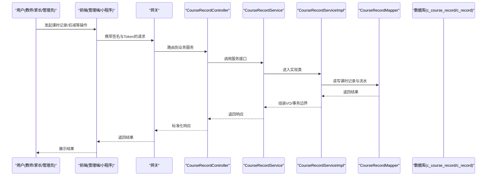

图表来源
- [CourseRecordController.java](file://class_times_record_back/business-service/src/main/java/com/shiroko/controller/CourseRecordController.java)
- [CourseRecordService.java](file://class_times_record_back/common/src/main/java/com/shiroko/service/CourseRecordService.java)
- [CourseRecordServiceImpl.java](file://class_times_record_back/business-service/src/main/java/com/shiroko/service/impl/CourseRecordServiceImpl.java)
- [CourseRecordMapper.java](file://class_times_record_back/common/src/main/java/com/shiroko/mapper/CourseRecordMapper.java)
- [CLAUDE.md:41-51](file://CLAUDE.md#L41-L51)

## 详细组件分析

### 实体与数据模型
- 课时记录实体 CourseRecord
  - 关键字段：学生ID、课程ID、班级ID、排课ID、课时数量、状态、备注、时间戳等
  - 与课程、学生、教师、班级的关联：通过外键或关联表维护
  - 与记录流水 c_record 的一对多关系：一次课时记录可产生多条明细流水（如扣减、退费、补课时等）
- 数据表约定
  - 业务表以 c_ 前缀命名，如 c_course_record、c_record
  - 系统表以 sys_ 前缀命名，如 sys_operation_log（审计日志）

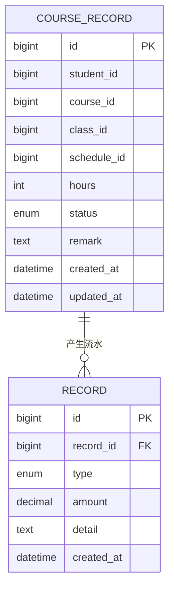

图表来源
- [CourseRecord.java](file://class_times_record_back/common/src/main/java/com/shiroko/repository/entity/CourseRecord.java)
- [CLAUDE.md:95-114](file://CLAUDE.md#L95-L114)

章节来源
- [CourseRecord.java](file://class_times_record_back/common/src/main/java/com/shiroko/repository/entity/CourseRecord.java)
- [CLAUDE.md:95-114](file://CLAUDE.md#L95-L114)

### 控制器与服务层职责
- CourseRecordController
  - 暴露 REST 接口：新增课时记录、更新、删除、查询列表、按维度查询、扣减课时、批量扣减、获取扣费详情等
- CourseRecordService（接口）
  - 定义课时记录领域能力：创建、扣减、请假/补课、统计、批量处理、详情查询等
- CourseRecordServiceImpl（实现）
  - 实现业务规则：校验、事务控制、余额计算、退费处理、通知推送（如微信订阅消息）、审计日志落库

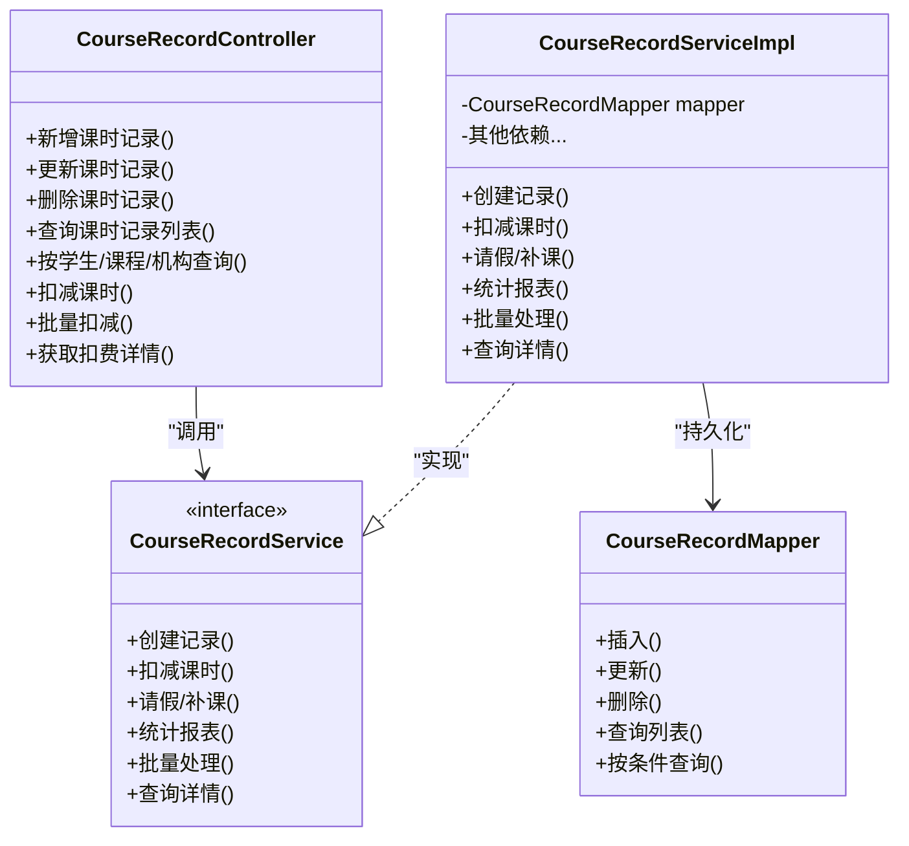

图表来源
- [CourseRecordController.java](file://class_times_record_back/business-service/src/main/java/com/shiroko/controller/CourseRecordController.java)
- [CourseRecordService.java](file://class_times_record_back/common/src/main/java/com/shiroko/service/CourseRecordService.java)
- [CourseRecordServiceImpl.java](file://class_times_record_back/business-service/src/main/java/com/shiroko/service/impl/CourseRecordServiceImpl.java)
- [CourseRecordMapper.java](file://class_times_record_back/common/src/main/java/com/shiroko/mapper/CourseRecordMapper.java)

章节来源
- [CourseRecordController.java](file://class_times_record_back/business-service/src/main/java/com/shiroko/controller/CourseRecordController.java)
- [CourseRecordService.java](file://class_times_record_back/common/src/main/java/com/shiroko/service/CourseRecordService.java)
- [CourseRecordServiceImpl.java](file://class_times_record_back/business-service/src/main/java/com/shiroko/service/impl/CourseRecordServiceImpl.java)
- [CourseRecordMapper.java](file://class_times_record_back/common/src/main/java/com/shiroko/mapper/CourseRecordMapper.java)

### 课时记录创建流程
- 输入：学生、课程、班级、排课、课时数、备注等
- 校验：学生/课程/班级有效性、排课存在性与状态、课时数合法性
- 持久化：写入 c_course_record，并生成初始流水 c_record（如“创建记录”）
- 返回：标准响应 VO

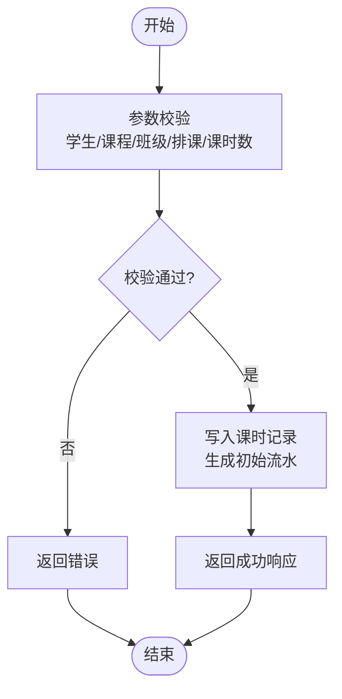

图表来源
- [CourseRecordServiceImpl.java](file://class_times_record_back/business-service/src/main/java/com/shiroko/service/impl/CourseRecordServiceImpl.java)
- [CourseRecordMapper.java](file://class_times_record_back/common/src/main/java/com/shiroko/mapper/CourseRecordMapper.java)

章节来源
- [CourseRecordServiceImpl.java](file://class_times_record_back/business-service/src/main/java/com/shiroko/service/impl/CourseRecordServiceImpl.java)

### 课时扣减业务规则与余额计算
- 触发场景
  - 教师完成上课后执行扣减；支持按班级、课程、学生维度扣减
  - 支持批量扣减（同一批次多个学生/课程）
- 业务规则
  - 校验排课状态为“已上课”或允许扣减的状态
  - 校验学生剩余课时是否充足（基于 c_course_record 累计与 c_record 流水汇总）
  - 扣减成功后生成扣减流水（type=扣减），并更新课时记录状态
  - 若涉及退费，生成退费流水（type=退费），并回滚相应课时
- 余额计算逻辑
  - 学生某课程的剩余课时 = 该课程下所有课时记录的课时总和 - 所有扣减流水课时总和 + 补课流水课时总和
  - 支持按时间段、机构、班级等多维聚合统计

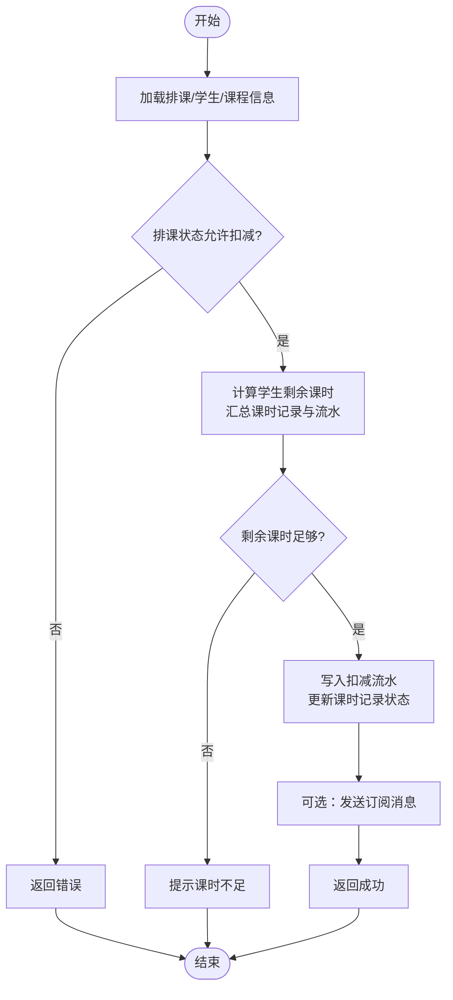

图表来源
- [CourseRecordServiceImpl.java](file://class_times_record_back/business-service/src/main/java/com/shiroko/service/impl/CourseRecordServiceImpl.java)
- [CourseRecordMapper.java](file://class_times_record_back/common/src/main/java/com/shiroko/mapper/CourseRecordMapper.java)

章节来源
- [CourseRecordServiceImpl.java](file://class_times_record_back/business-service/src/main/java/com/shiroko/service/impl/CourseRecordServiceImpl.java)

### 请假与补课管理
- 请假
  - 将对应排课标记为“请假”，不扣课时
  - 生成请假流水（type=请假），便于统计与审计
- 补课
  - 在原有请假基础上，安排补课排课
  - 补课完成后正常扣减课时，生成扣减流水
  - 支持将补课课时计入课时记录，确保余额一致性

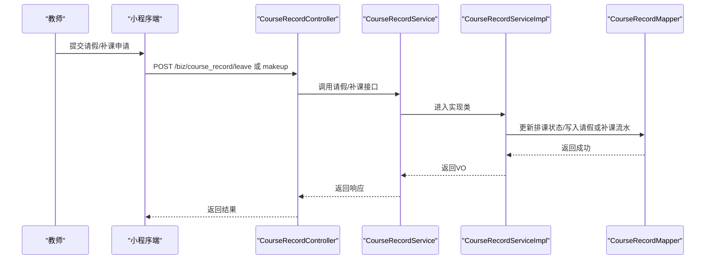

图表来源
- [CourseRecordController.java](file://class_times_record_back/business-service/src/main/java/com/shiroko/controller/CourseRecordController.java)
- [CourseRecordServiceImpl.java](file://class_times_record_back/business-service/src/main/java/com/shiroko/service/impl/CourseRecordServiceImpl.java)
- [CourseRecordMapper.java](file://class_times_record_back/common/src/main/java/com/shiroko/mapper/CourseRecordMapper.java)

章节来源
- [CourseRecordController.java](file://class_times_record_back/business-service/src/main/java/com/shiroko/controller/CourseRecordController.java)
- [CourseRecordServiceImpl.java](file://class_times_record_back/business-service/src/main/java/com/shiroko/service/impl/CourseRecordServiceImpl.java)

### 批量扣费与统计报表
- 批量扣费
  - 支持一次性对多个学生/课程进行扣减，内部循环校验与事务控制
  - 失败项记录原因，整体返回成功/部分成功状态
- 统计报表
  - 按机构、班级、课程、时间段统计课时消耗、请假、补课、退费情况
  - 输出汇总与明细，支持导出

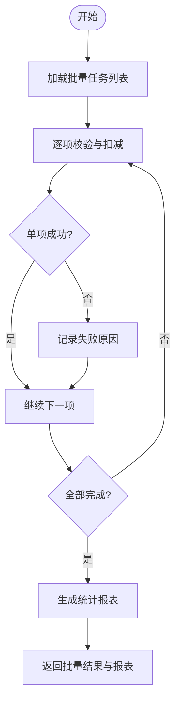

图表来源
- [CourseRecordServiceImpl.java](file://class_times_record_back/business-service/src/main/java/com/shiroko/service/impl/CourseRecordServiceImpl.java)
- [CourseRecordMapper.java](file://class_times_record_back/common/src/main/java/com/shiroko/mapper/CourseRecordMapper.java)

章节来源
- [CourseRecordServiceImpl.java](file://class_times_record_back/business-service/src/main/java/com/shiroko/service/impl/CourseRecordServiceImpl.java)

### 退费处理流程
- 触发条件
  - 家长申请退费或教务主动退费
- 处理步骤
  - 校验退费范围（未消耗的课时、已发生费用）
  - 生成退费流水（type=退费），回滚课时记录
  - 更新课时记录状态，并记录审计日志
  - 可选：发送订阅消息通知家长

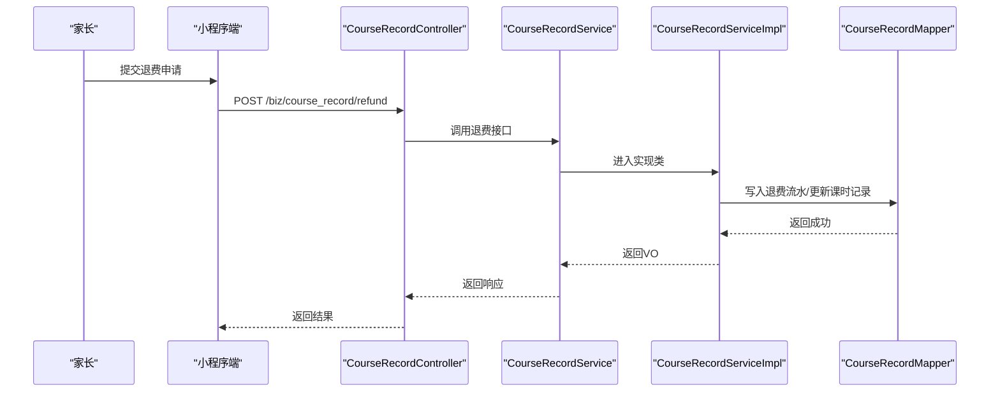

图表来源
- [CourseRecordController.java](file://class_times_record_back/business-service/src/main/java/com/shiroko/controller/CourseRecordController.java)
- [CourseRecordServiceImpl.java](file://class_times_record_back/business-service/src/main/java/com/shiroko/service/impl/CourseRecordServiceImpl.java)
- [CourseRecordMapper.java](file://class_times_record_back/common/src/main/java/com/shiroko/mapper/CourseRecordMapper.java)

章节来源
- [CourseRecordController.java](file://class_times_record_back/business-service/src/main/java/com/shiroko/controller/CourseRecordController.java)
- [CourseRecordServiceImpl.java](file://class_times_record_back/business-service/src/main/java/com/shiroko/service/impl/CourseRecordServiceImpl.java)

### 前端集成与使用
- 小程序端
  - API 模块：course-record/index.ts，提供新增、更新、查询、扣减、批量扣减、详情等接口
  - 页面：
    - 课时记录列表：manage-course-record/index.vue
    - 快速消课：fast-deduct/index.vue
    - 扣费详情：deduct-detail/index.vue
  - 类型定义：types/course-record.d.ts
- 管理端
  - API 模块：src/api/course-record/index.ts
  - 页面：views/business/course-record/index.vue
  - 类型定义：src/types/business.d.ts

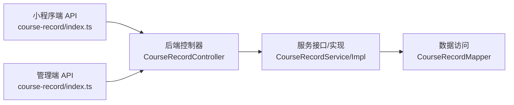

图表来源
- [index.ts（小程序端）](file://class_times_record/src/api/course-record/index.ts)
- [index.vue（小程序端-课时记录列表）](file://class_times_record/src/pages/main/teacher/manage-course-record/index.vue)
- [index.vue（小程序端-快速消课）](file://class_times_record/src/pages/main/teacher/fast-deduct/index.vue)
- [index.vue（小程序端-扣费详情）](file://class_times_record/src/pages/main/parent/deduct-detail/index.vue)
- [index.d.ts（小程序端-类型定义）](file://class_times_record/src/types/course-record.d.ts)
- [index.ts（管理端API）](file://class_record_admin_front/src/api/course-record/index.ts)
- [business.d.ts（管理端类型）](file://class_record_admin_front/src/types/business.d.ts)
- [index.vue（管理端-课时记录）](file://class_record_admin_front/src/views/business/course-record/index.vue)

章节来源
- [index.ts（小程序端）](file://class_times_record/src/api/course-record/index.ts)
- [index.vue（小程序端-课时记录列表）](file://class_times_record/src/pages/main/teacher/manage-course-record/index.vue)
- [index.vue（小程序端-快速消课）](file://class_times_record/src/pages/main/teacher/fast-deduct/index.vue)
- [index.vue（小程序端-扣费详情）](file://class_times_record/src/pages/main/parent/deduct-detail/index.vue)
- [index.d.ts（小程序端-类型定义）](file://class_times_record/src/types/course-record.d.ts)
- [index.ts（管理端API）](file://class_record_admin_front/src/api/course-record/index.ts)
- [business.d.ts（管理端类型）](file://class_record_admin_front/src/types/business.d.ts)
- [index.vue（管理端-课时记录）](file://class_record_admin_front/src/views/business/course-record/index.vue)

## 依赖关系分析
- 组件耦合
  - Controller 仅依赖 Service 接口，避免直接注入 Mapper
  - ServiceImpl 依赖 Mapper 进行数据访问
  - Converter 负责实体与 DTO/VO 的转换
- 外部依赖
  - 网关路由：/biz/** → business-service
  - 数据库：MySQL（c_course_record、c_record 等）
  - 审计日志：sys_operation_log（系统级）

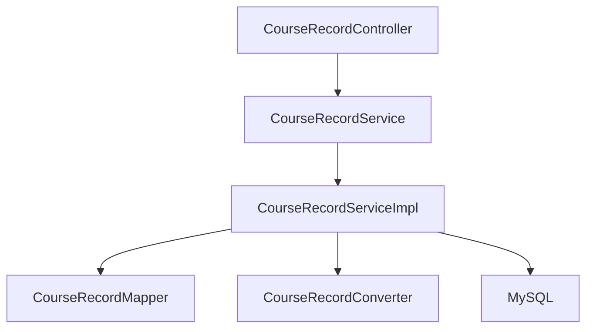

图表来源
- [CourseRecordController.java](file://class_times_record_back/business-service/src/main/java/com/shiroko/controller/CourseRecordController.java)
- [CourseRecordService.java](file://class_times_record_back/common/src/main/java/com/shiroko/service/CourseRecordService.java)
- [CourseRecordServiceImpl.java](file://class_times_record_back/business-service/src/main/java/com/shiroko/service/impl/CourseRecordServiceImpl.java)
- [CourseRecordMapper.java](file://class_times_record_back/common/src/main/java/com/shiroko/mapper/CourseRecordMapper.java)
- [CourseRecordConverter.java](file://class_times_record_back/common/src/main/java/com/shiroko/converter/CourseRecordConverter.java)

章节来源
- [CourseRecordController.java](file://class_times_record_back/business-service/src/main/java/com/shiroko/controller/CourseRecordController.java)
- [CourseRecordService.java](file://class_times_record_back/common/src/main/java/com/shiroko/service/CourseRecordService.java)
- [CourseRecordServiceImpl.java](file://class_times_record_back/business-service/src/main/java/com/shiroko/service/impl/CourseRecordServiceImpl.java)
- [CourseRecordMapper.java](file://class_times_record_back/common/src/main/java/com/shiroko/mapper/CourseRecordMapper.java)
- [CourseRecordConverter.java](file://class_times_record_back/common/src/main/java/com/shiroko/converter/CourseRecordConverter.java)

## 性能与扩展性
- 批量操作
  - 批量扣减建议分批提交，避免长事务与锁竞争
- 索引优化
  - 针对学生ID、课程ID、班级ID、排课ID建立合适索引，提升查询效率
- 缓存策略
  - 对高频读取的统计报表可使用 Redis 缓存，定期刷新
- 异步处理
  - 订阅消息推送可异步化，降低主流程耗时

[本节为通用指导，无需源码引用]

## 故障排查指南
- 常见问题
  - 课时不足：检查课时记录与流水汇总是否正确
  - 排课状态不允许扣减：确认排课状态机与业务规则
  - 批量扣减部分失败：查看失败原因记录，定位具体项
- 审计追踪
  - 通过 sys_operation_log 查看操作日志
  - 通过 c_record 明细流水追溯变更历史

章节来源
- [CLAUDE.md:75-76](file://CLAUDE.md#L75-L76)

## 结论
课时记录管理模块以清晰的实体设计与分层架构为基础，提供了完整的课时记录生命周期管理能力。通过严格的业务规则、完善的流水审计与灵活的统计报表，满足教务管理的复杂需求。前后端分离与统一网关路由确保了系统的可扩展性与可维护性。

[本节为总结，无需源码引用]

## 附录：API 接口文档
以下为课时记录相关的主要接口（路径均以网关前缀 /biz/ 开头）：

- 新增课时记录
  - 方法：POST
  - 路径：/biz/course_record/insert
  - 说明：创建新的课时记录，并生成初始流水
- 更新课时记录
  - 方法：POST
  - 路径：/biz/course_record/update
  - 说明：修改课时记录信息
- 删除课时记录
  - 方法：POST
  - 路径：/biz/course_record/delete
  - 说明：删除课时记录（需考虑关联流水）
- 查询课时记录列表
  - 方法：POST
  - 路径：/biz/course_record/new_get
  - 说明：分页查询课时记录，支持多维度筛选
- 按学生查询课时记录
  - 方法：POST
  - 路径：/biz/course_record/get_by_student_id
  - 说明：根据学生ID查询其课时记录
- 按课程查询课时记录
  - 方法：POST
  - 路径：/biz/course_record/get_by_course_id
  - 说明：根据课程ID查询其课时记录
- 按机构查询课时记录
  - 方法：POST
  - 路径：/biz/course_record/get_by_institution_id
  - 说明：根据机构ID查询其课时记录
- 扣减课时（按班级）
  - 方法：POST
  - 路径：/biz/course_record/deduct_by_class_id
  - 说明：按班级维度进行课时扣减
- 扣减课时（按课程）
  - 方法：POST
  - 路径：/biz/course_record/deduct_by_course_id
  - 说明：按课程维度进行课时扣减
- 扣减课时（按学生）
  - 方法：POST
  - 路径：/biz/course_record/deduct_by_student_id
  - 说明：按学生维度进行课时扣减
- 获取扣费详情
  - 方法：GET
  - 路径：/biz/course_record/deduct-detail
  - 说明：根据记录ID获取扣费明细
- 请假/补课
  - 方法：POST
  - 路径：/biz/course_record/leave 或 /biz/course_record/makeup
  - 说明：处理请假与补课流程，生成相应流水

章节来源
- [index.ts（小程序端）](file://class_times_record/src/api/course-record/index.ts)
- [index.ts（管理端API）](file://class_record_admin_front/src/api/course-record/index.ts)