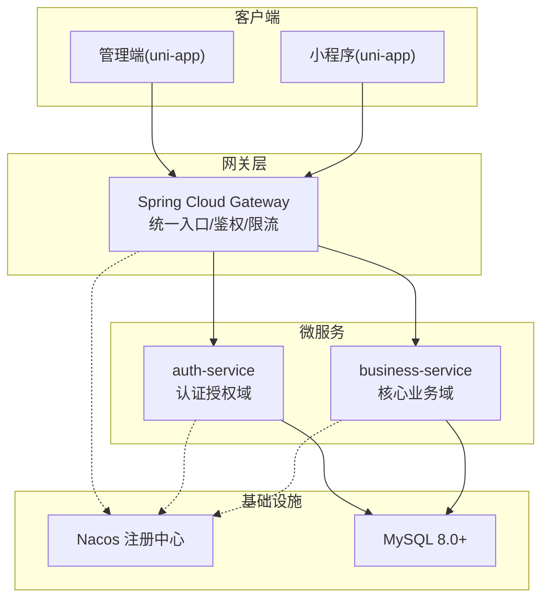
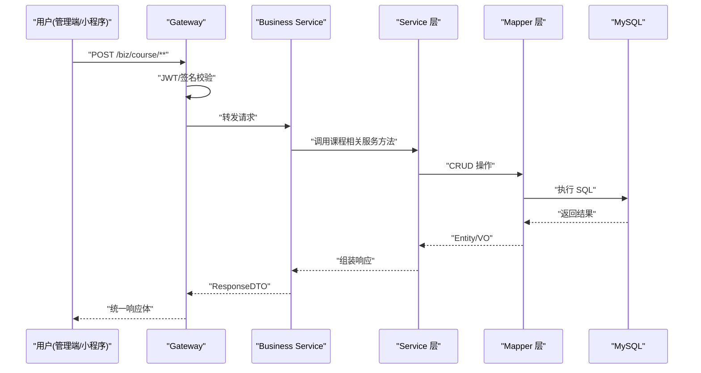
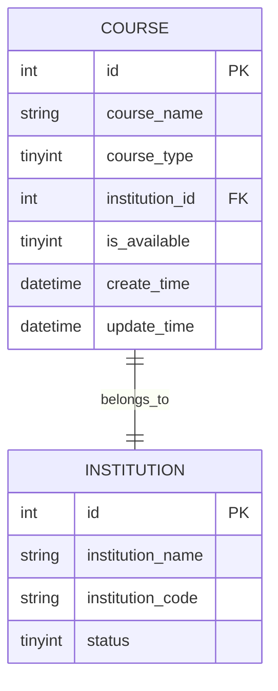
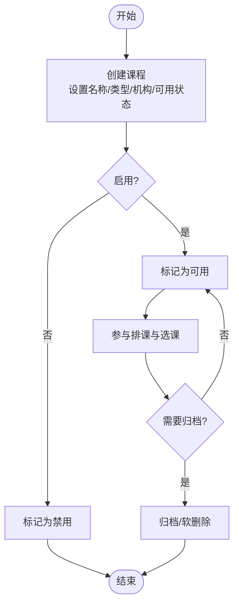
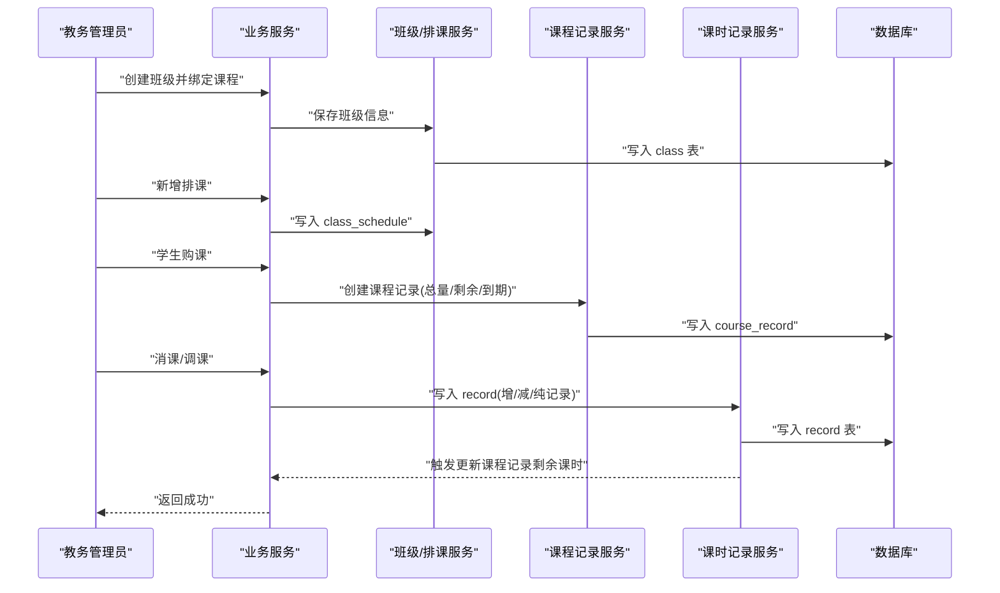
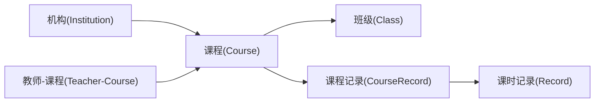

# 课程管理模块

<cite>
**本文引用的文件**   
- [架构设计文档](file://class_times_record_back/docs/architecture.md)
- [数据库脚本](file://class_times_record_back/docs/class_times_record.sql)
</cite>

## 目录
1. [引言](#引言)
2. [项目结构](#项目结构)
3. [核心组件](#核心组件)
4. [架构总览](#架构总览)
5. [详细组件分析](#详细组件分析)
6. [依赖关系分析](#依赖关系分析)
7. [性能与扩展性](#性能与扩展性)
8. [故障排查指南](#故障排查指南)
9. [结论](#结论)
10. [附录：API 接口规范（课程相关）](#附录api-接口规范课程相关)

## 引言
本章节聚焦“课程管理模块”的完整实现说明，覆盖课程设置与管理、课程类型、课时与费用配置、实体数据模型、与机构/教师/班级的关联、生命周期管理、版本控制与模板复用、以及与排课系统与课时记录系统的集成方案。同时提供面向前后端的 API 接口规范与最佳实践建议，帮助读者快速理解并落地课程管理能力。

## 项目结构
后端采用 Spring Cloud Alibaba 微服务架构，统一由网关路由分发，认证授权与核心业务分别部署为独立服务；前端包含管理端与移动端小程序两套客户端。课程管理相关的核心能力集中在业务服务中，并通过统一的网关对外暴露接口。



图表来源
- [架构设计文档:1-644](file://class_times_record_back/docs/architecture.md#L1-L644)

章节来源
- [架构设计文档:1-644](file://class_times_record_back/docs/architecture.md#L1-L644)

## 核心组件
围绕课程管理的关键领域对象与职责如下：
- 课程（Course）：定义课程名称、类型（按次/按天）、所属机构、可用状态等基础信息。
- 班级（Class）：绑定具体课程，承载上课时间、人数上限、当前人数、状态等运行期信息。
- 排课（ClassSchedule）：描述班级在特定日期范围与星期几的具体上课时段。
- 课程记录（CourseRecord）：学生购课后的课时总量、剩余课时、到期时间、状态等。
- 课时记录（Record）：增课/消课/纯记录的明细流水，驱动课程记录的课时变更。
- 教师-课程（Teacher-Course）：教师与课程的授课关系。
- 机构（Institution）：课程与学生的归属组织边界。

上述对象通过外键与唯一索引约束形成稳定的数据契约，支撑课程从创建到归档的全生命周期管理。

章节来源
- [数据库脚本:108-122](file://class_times_record_back/docs/class_times_record.sql#L108-L122)
- [数据库脚本:37-53](file://class_times_record_back/docs/class_times_record.sql#L37-L53)
- [数据库脚本:56-73](file://class_times_record_back/docs/class_times_record.sql#L56-L73)
- [数据库脚本:140-164](file://class_times_record_back/docs/class_times_record.sql#L140-L164)
- [数据库脚本:262-281](file://class_times_record_back/docs/class_times_record.sql#L262-L281)
- [数据库脚本:427-440](file://class_times_record_back/docs/class_times_record.sql#L427-L440)
- [数据库脚本:167-179](file://class_times_record_back/docs/class_times_record.sql#L167-L179)

## 架构总览
课程管理在整体系统中的位置与交互如下：
- 管理端/小程序通过网关访问业务服务，完成课程的查询、新增、更新等操作。
- 业务服务内部以 Service 层编排课程、班级、排课、课程记录、课时记录等子域逻辑。
- 数据持久化使用 MyBatis-Plus + MySQL，主键采用雪花算法，全局启用逻辑删除。
- 安全方面，网关进行 JWT 校验与签名校验，服务内通过拦截器链二次校验。



图表来源
- [架构设计文档:59-65](file://class_times_record_back/docs/architecture.md#L59-L65)
- [架构设计文档:473-511](file://class_times_record_back/docs/architecture.md#L473-L511)

章节来源
- [架构设计文档:59-65](file://class_times_record_back/docs/architecture.md#L59-L65)
- [架构设计文档:473-511](file://class_times_record_back/docs/architecture.md#L473-L511)

## 详细组件分析

### 课程实体与数据结构
- 课程表字段要点：课程名称、课程类型（按次/按天）、所属机构、是否可用、审计字段。
- 关键索引：机构维度索引便于按机构筛选课程。
- 约束：外键关联机构，保证数据一致性。



图表来源
- [数据库脚本:108-122](file://class_times_record_back/docs/class_times_record.sql#L108-L122)
- [数据库脚本:167-179](file://class_times_record_back/docs/class_times_record.sql#L167-L179)

章节来源
- [数据库脚本:108-122](file://class_times_record_back/docs/class_times_record.sql#L108-L122)
- [数据库脚本:167-179](file://class_times_record_back/docs/class_times_record.sql#L167-L179)

### 课程与机构、教师、班级的关联
- 与机构：课程属于某机构，支持多机构隔离。
- 与教师：通过中间表建立教师-课程的多对多关系，用于授课安排与统计。
- 与班级：班级绑定课程，作为教学实施载体。

```mermaid
erDiagram
TEACHER_COURSE {
int id PK
int teacher_id FK
int course_id FK
}
CLASS {
int id PK
int course_id FK
string class_name
int student_count
int student_max_count
tinyint status
}
COURSE ||--o{ CLASS : "has_many"
TEACHER_COURSE }|--|| COURSE : "references"
TEACHER_COURSE }|--|| TEACHER : "references"
```

图表来源
- [数据库脚本:427-440](file://class_times_record_back/docs/class_times_record.sql#L427-L440)
- [数据库脚本:37-53](file://class_times_record_back/docs/class_times_record.sql#L37-L53)
- [数据库脚本:108-122](file://class_times_record_back/docs/class_times_record.sql#L108-L122)

章节来源
- [数据库脚本:427-440](file://class_times_record_back/docs/class_times_record.sql#L427-L440)
- [数据库脚本:37-53](file://class_times_record_back/docs/class_times_record.sql#L37-L53)
- [数据库脚本:108-122](file://class_times_record_back/docs/class_times_record.sql#L108-L122)

### 课时设置与费用配置
- 课时设置：课程类型决定计费与扣减方式（按次/按天），结合课程记录与课时记录实现课时流转。
- 费用配置：当前数据模型未直接体现费用字段，建议在课程或课程记录上扩展价格/折扣/套餐等字段以满足财务核算需求。

章节来源
- [数据库脚本:108-122](file://class_times_record_back/docs/class_times_record.sql#L108-L122)
- [数据库脚本:140-164](file://class_times_record_back/docs/class_times_record.sql#L140-L164)
- [数据库脚本:262-281](file://class_times_record_back/docs/class_times_record.sql#L262-L281)

### 课程生命周期管理（创建、启用、停用、归档）
- 创建：新建课程并设置类型、机构、初始可用状态。
- 启用/停用：通过可用状态字段控制课程在前端与排课中的可见性与可用性。
- 归档：可引入归档状态或软删除策略，配合审计日志保留历史数据。



[本节为概念流程，不直接映射具体源码文件]

### 课程版本控制与模板复用
- 版本控制：建议在课程表增加版本号字段，并在变更时递增，以便对比差异与回滚。
- 模板复用：基于现有课程创建“模板”，新开课时可复制模板的基础信息与规则，减少重复录入。

[本节为概念设计，不直接映射具体源码文件]

### 与排课系统、课时记录系统的集成
- 与排课：班级绑定课程后，通过排课表维护具体的上课时间段，供教师与学生查看与调整。
- 与课时记录：课程记录维护学生购课总量与剩余课时，课时记录作为增/减/纯记录的流水，驱动课程记录的状态与剩余课时变化。



图表来源
- [数据库脚本:37-53](file://class_times_record_back/docs/class_times_record.sql#L37-L53)
- [数据库脚本:56-73](file://class_times_record_back/docs/class_times_record.sql#L56-L73)
- [数据库脚本:140-164](file://class_times_record_back/docs/class_times_record.sql#L140-L164)
- [数据库脚本:262-281](file://class_times_record_back/docs/class_times_record.sql#L262-L281)

章节来源
- [数据库脚本:37-53](file://class_times_record_back/docs/class_times_record.sql#L37-L53)
- [数据库脚本:56-73](file://class_times_record_back/docs/class_times_record.sql#L56-L73)
- [数据库脚本:140-164](file://class_times_record_back/docs/class_times_record.sql#L140-L164)
- [数据库脚本:262-281](file://class_times_record_back/docs/class_times_record.sql#L262-L281)

## 依赖关系分析
- 课程与机构的强依赖：课程必须归属于某机构，确保数据隔离与权限控制。
- 课程与教师的弱耦合：通过中间表解耦，灵活分配授课教师。
- 课程与班级的强依赖：班级作为教学实施单元，需绑定课程。
- 课程记录与课时记录的联动：课时记录驱动课程记录的剩余课时与状态变更。



图表来源
- [数据库脚本:108-122](file://class_times_record_back/docs/class_times_record.sql#L108-L122)
- [数据库脚本:427-440](file://class_times_record_back/docs/class_times_record.sql#L427-L440)
- [数据库脚本:37-53](file://class_times_record_back/docs/class_times_record.sql#L37-L53)
- [数据库脚本:140-164](file://class_times_record_back/docs/class_times_record.sql#L140-L164)
- [数据库脚本:262-281](file://class_times_record_back/docs/class_times_record.sql#L262-L281)

章节来源
- [数据库脚本:108-122](file://class_times_record_back/docs/class_times_record.sql#L108-L122)
- [数据库脚本:427-440](file://class_times_record_back/docs/class_times_record.sql#L427-L440)
- [数据库脚本:37-53](file://class_times_record_back/docs/class_times_record.sql#L37-L53)
- [数据库脚本:140-164](file://class_times_record_back/docs/class_times_record.sql#L140-L164)
- [数据库脚本:262-281](file://class_times_record_back/docs/class_times_record.sql#L262-L281)

## 性能与扩展性
- 主键策略：全局使用雪花算法生成主键，趋势递增利于索引性能。
- 逻辑删除：通过全局配置自动追加过滤条件，避免物理删除带来的数据丢失风险。
- 虚拟线程：I/O 密集型场景下提升吞吐，适合高并发课程查询与排课计算。
- 索引优化：针对常用查询维度（如机构、课程ID、学生ID）建立合适索引，避免全表扫描。
- 事务边界：跨表更新（如课时记录影响课程记录）应置于事务中，保证一致性。

章节来源
- [架构设计文档:242-248](file://class_times_record_back/docs/architecture.md#L242-L248)
- [架构设计文档:218-233](file://class_times_record_back/docs/architecture.md#L218-L233)
- [架构设计文档:234-241](file://class_times_record_back/docs/architecture.md#L234-L241)

## 故障排查指南
- 参数校验失败：检查 DTO 校验注解与分组校验是否正确配置。
- 权限不足：确认网关与服务的拦截器链是否放行对应路径，以及用户角色是否具备相应权限。
- 数据不一致：核对事务边界与唯一约束（如同一学生同一课程仅一条记录）。
- 性能问题：关注慢查询与缺失索引，必要时补充复合索引。
- 签名校验失败：检查请求头 x-sign/x-timestamp/x-nonce 是否符合签名算法与时钟同步要求。

章节来源
- [架构设计文档:250-262](file://class_times_record_back/docs/architecture.md#L250-L262)
- [架构设计文档:149-175](file://class_times_record_back/docs/architecture.md#L149-L175)

## 结论
课程管理模块以课程为核心，围绕机构、教师、班级、排课、课程记录与课时记录构建起完整的教培业务闭环。通过清晰的实体设计与严格的约束，保障了数据一致性与可追溯性。结合网关统一鉴权与微服务分层，具备良好的可扩展性与运维可控性。后续可在版本控制、模板复用、费用配置等方面进一步增强，以提升运营效率与商业灵活性。

## 附录：API 接口规范（课程相关）
- 接口风格：统一 POST + @RequestBody，统一 ResponseDTO 包装。
- 课程接口分组：/biz/course 提供课程查询与增改能力。
- 课程记录接口分组：/biz/course_record 提供购课记录 CRUD、扣课与多维度查询。
- 课时记录接口分组：/biz/record 提供课时变更记录查询与批量新增。

章节来源
- [架构设计文档:473-511](file://class_times_record_back/docs/architecture.md#L473-L511)
- [架构设计文档:525-578](file://class_times_record_back/docs/architecture.md#L525-L578)