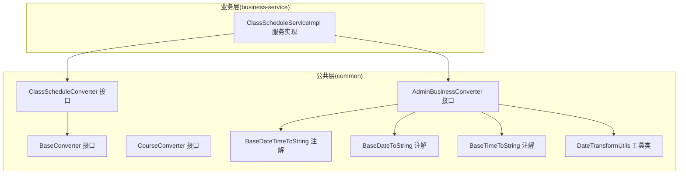
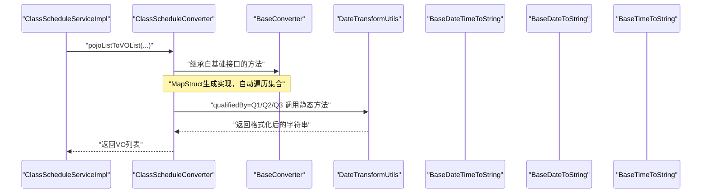
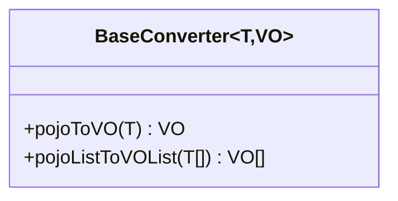
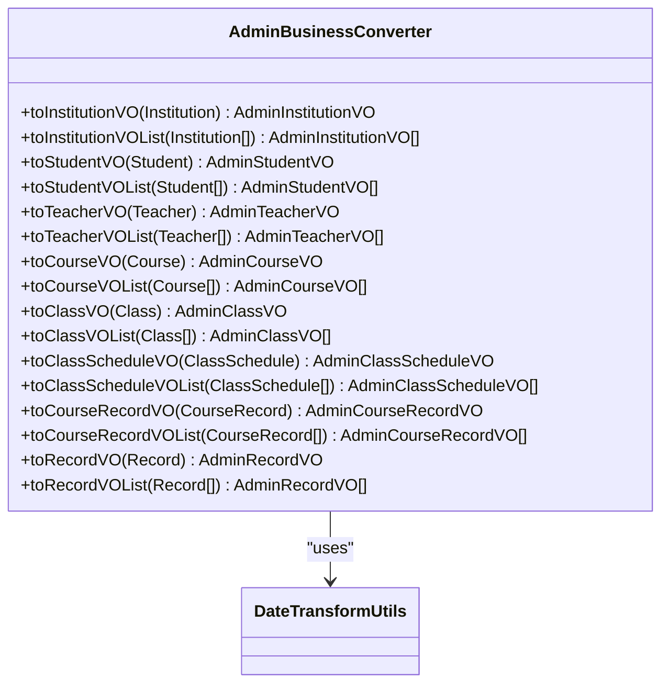
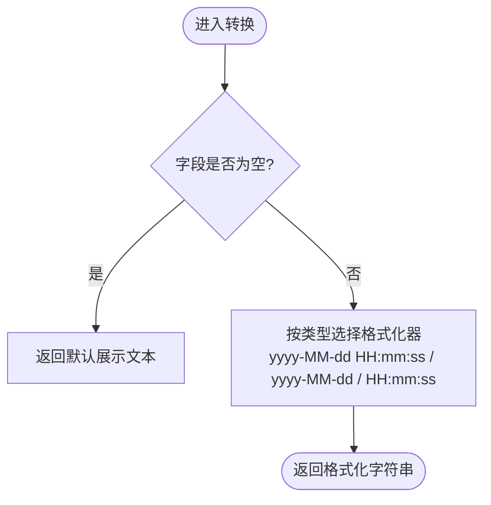
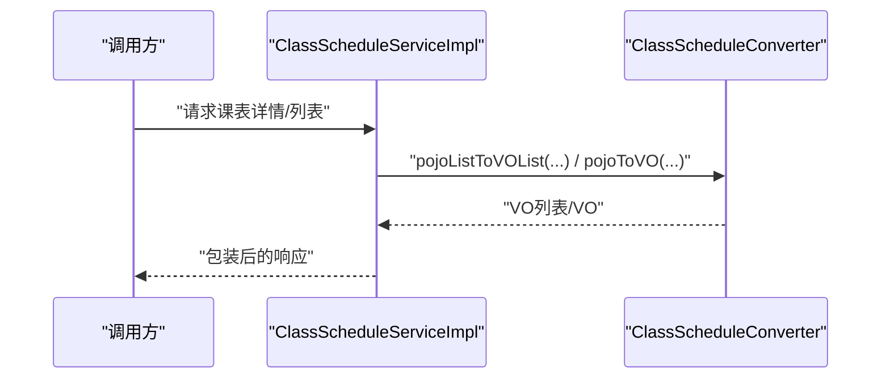
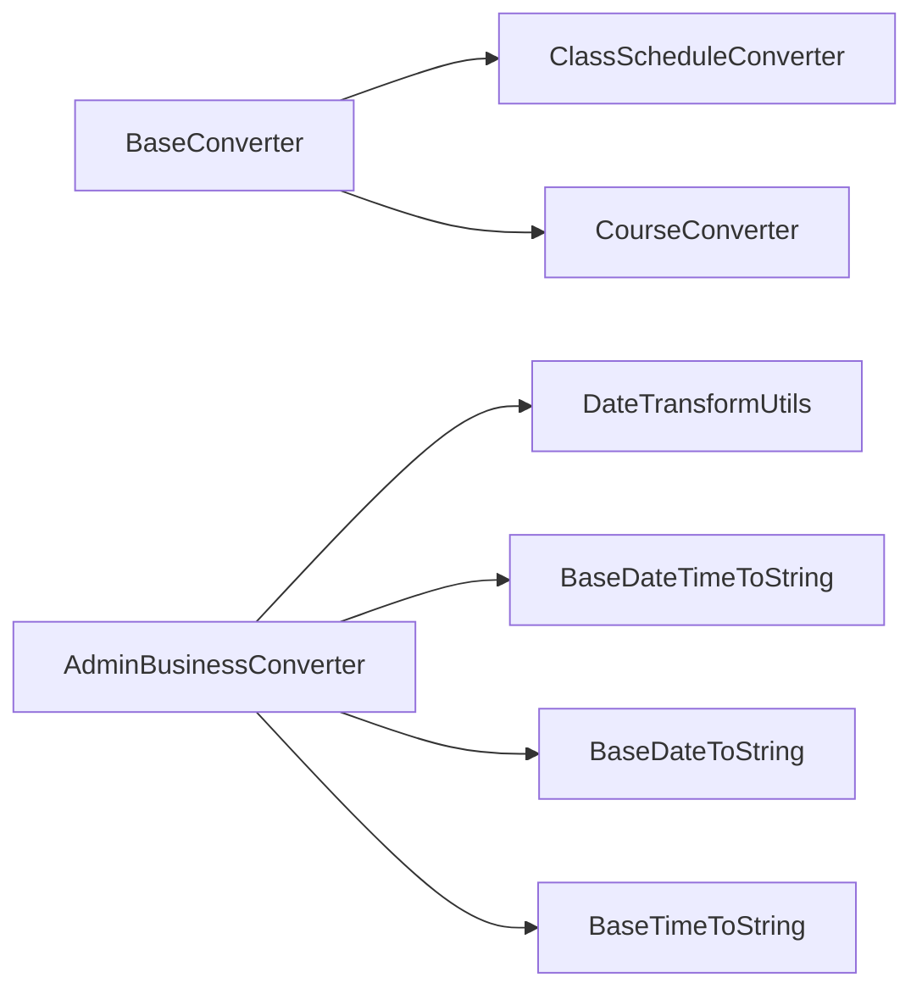

# DTO/VO转换机制

<cite>
**本文引用的文件**   
- [BaseConverter.java](file://class_times_record_back/common/src/main/java/com/shiroko/converter/BaseConverter.java)
- [AdminBusinessConverter.java](file://class_times_record_back/common/src/main/java/com/shiroko/converter/AdminBusinessConverter.java)
- [ClassScheduleConverter.java](file://class_times_record_back/common/src/main/java/com/shiroko/converter/ClassScheduleConverter.java)
- [CourseConverter.java](file://class_times_record_back/common/src/main/java/com/shiroko/converter/CourseConverter.java)
- [DateTransformUtils.java](file://class_times_record_back/common/src/main/java/com/shiroko/util/DateTransformUtils.java)
- [BaseDateTimeToString.java](file://class_times_record_back/common/src/main/java/com/shiroko/annotation/BaseDateTimeToString.java)
- [BaseDateToString.java](file://class_times_record_back/common/src/main/java/com/shiroko/annotation/BaseDateToString.java)
- [BaseTimeToString.java](file://class_times_record_back/common/src/main/java/com/shiroko/annotation/BaseTimeToString.java)
- [ClassScheduleServiceImpl.java](file://class_times_record_back/business-service/src/main/java/com/shiroko/service/impl/ClassScheduleServiceImpl.java)
</cite>

## 目录
1. [简介](#简介)
2. [项目结构](#项目结构)
3. [核心组件](#核心组件)
4. [架构总览](#架构总览)
5. [详细组件分析](#详细组件分析)
6. [依赖关系分析](#依赖关系分析)
7. [性能考虑](#性能考虑)
8. [故障排查指南](#故障排查指南)
9. [结论](#结论)
10. [附录：创建新转换器完整指南](#附录创建新转换器完整指南)

## 简介
本文件系统性阐述项目中DTO/VO转换机制，重点围绕MapStruct转换器与自定义注解、工具类协作的体系化设计。内容涵盖：
- MapStruct转换器的工作原理与配置方法
- BaseConverter基类接口的设计与使用
- DTO（数据传输对象）与VO（视图对象）模式及适用场景
- 转换器接口定义规范、字段映射规则、复杂对象处理
- 批量转换、条件转换、自定义转换器的实现方式
- 具体示例路径与性能优化建议
- 为开发者提供从零到一创建新转换器的操作指南

## 项目结构
本项目在后端common模块中集中管理转换器与通用能力，业务服务通过注入转换器完成POJO/DTO/VO之间的数据转换。关键位置如下：
- 转换器接口：位于 common 模块 converter 包下
- 自定义限定符注解：位于 common 模块 annotation 包下
- 日期转换工具：位于 common 模块 util 包下
- 业务服务调用：位于 business-service 模块 service.impl 包下

图表来源
- [BaseConverter.java:1-19](file://class_times_record_back/common/src/main/java/com/shiroko/converter/BaseConverter.java#L1-L19)
- [AdminBusinessConverter.java:1-87](file://class_times_record_back/common/src/main/java/com/shiroko/converter/AdminBusinessConverter.java#L1-L87)
- [ClassScheduleConverter.java:23-23](file://class_times_record_back/common/src/main/java/com/shiroko/converter/ClassScheduleConverter.java#L23-L23)
- [CourseConverter.java:20-21](file://class_times_record_back/common/src/main/java/com/shiroko/converter/CourseConverter.java#L20-L21)
- [BaseDateTimeToString.java:1-22](file://class_times_record_back/common/src/main/java/com/shiroko/annotation/BaseDateTimeToString.java#L1-L22)
- [BaseDateToString.java:1-22](file://class_times_record_back/common/src/main/java/com/shiroko/annotation/BaseDateToString.java#L1-L22)
- [BaseTimeToString.java:1-22](file://class_times_record_back/common/src/main/java/com/shiroko/annotation/BaseTimeToString.java#L1-L22)
- [DateTransformUtils.java:1-58](file://class_times_record_back/common/src/main/java/com/shiroko/util/DateTransformUtils.java#L1-L58)
- [ClassScheduleServiceImpl.java:34-80](file://class_times_record_back/business-service/src/main/java/com/shiroko/service/impl/ClassScheduleServiceImpl.java#L34-L80)

章节来源
- [BaseConverter.java:1-19](file://class_times_record_back/common/src/main/java/com/shiroko/converter/BaseConverter.java#L1-L19)
- [AdminBusinessConverter.java:1-87](file://class_times_record_back/common/src/main/java/com/shiroko/converter/AdminBusinessConverter.java#L1-L87)
- [ClassScheduleConverter.java:23-23](file://class_times_record_back/common/src/main/java/com/shiroko/converter/ClassScheduleConverter.java#L23-L23)
- [CourseConverter.java:20-21](file://class_times_record_back/common/src/main/java/com/shiroko/converter/CourseConverter.java#L20-L21)
- [BaseDateTimeToString.java:1-22](file://class_times_record_back/common/src/main/java/com/shiroko/annotation/BaseDateTimeToString.java#L1-L22)
- [BaseDateToString.java:1-22](file://class_times_record_back/common/src/main/java/com/shiroko/annotation/BaseDateToString.java#L1-L22)
- [BaseTimeToString.java:1-22](file://class_times_record_back/common/src/main/java/com/shiroko/annotation/BaseTimeToString.java#L1-L22)
- [DateTransformUtils.java:1-58](file://class_times_record_back/common/src/main/java/com/shiroko/util/DateTransformUtils.java#L1-L58)
- [ClassScheduleServiceImpl.java:34-80](file://class_times_record_back/business-service/src/main/java/com/shiroko/service/impl/ClassScheduleServiceImpl.java#L34-L80)

## 核心组件
- BaseConverter 基础接口
  - 定义 pojoToVO 单对象转换与 pojoListToVOList 批量转换方法，供各领域转换器统一继承，减少样板代码。
- AdminBusinessConverter 转换器
  - 面向管理端实体到VO的转换，广泛使用 @Mapping 与 qualifiedBy 指定字段映射与自定义格式化策略。
  - 声明 uses = {DateTransformUtils.class}，将工具类注册为可被MapStruct调用的外部依赖。
- ClassScheduleConverter / CourseConverter 等
  - 遵循 BaseConverter 约定，按领域拆分转换器，便于维护与复用。
- 自定义限定符注解
  - BaseDateTimeToString、BaseDateToString、BaseTimeToString 作为 MapStruct 的 Qualifier，用于精确匹配 DateTransformUtils 中的静态方法。
- DateTransformUtils 工具类
  - 提供 LocalDateTime/LocalDate/LocalTime 到字符串的格式化方法，并标注对应限定符注解，供转换器在 @Mapping 中引用。

章节来源
- [BaseConverter.java:1-19](file://class_times_record_back/common/src/main/java/com/shiroko/converter/BaseConverter.java#L1-L19)
- [AdminBusinessConverter.java:26-86](file://class_times_record_back/common/src/main/java/com/shiroko/converter/AdminBusinessConverter.java#L26-L86)
- [ClassScheduleConverter.java:23-23](file://class_times_record_back/common/src/main/java/com/shiroko/converter/ClassScheduleConverter.java#L23-L23)
- [CourseConverter.java:20-21](file://class_times_record_back/common/src/main/java/com/shiroko/converter/CourseConverter.java#L20-L21)
- [BaseDateTimeToString.java:17-21](file://class_times_record_back/common/src/main/java/com/shiroko/annotation/BaseDateTimeToString.java#L17-L21)
- [BaseDateToString.java:17-21](file://class_times_record_back/common/src/main/java/com/shiroko/annotation/BaseDateToString.java#L17-L21)
- [BaseTimeToString.java:17-21](file://class_times_record_back/common/src/main/java/com/shiroko/annotation/BaseTimeToString.java#L17-L21)
- [DateTransformUtils.java:20-56](file://class_times_record_back/common/src/main/java/com/shiroko/util/DateTransformUtils.java#L20-L56)

## 架构总览
下图展示了从业务服务到转换器再到工具类的调用链与依赖关系。

图表来源
- [ClassScheduleServiceImpl.java:34-80](file://class_times_record_back/business-service/src/main/java/com/shiroko/service/impl/ClassScheduleServiceImpl.java#L34-L80)
- [ClassScheduleConverter.java:23-23](file://class_times_record_back/common/src/main/java/com/shiroko/converter/ClassScheduleConverter.java#L23-L23)
- [BaseConverter.java:12-18](file://class_times_record_back/common/src/main/java/com/shiroko/converter/BaseConverter.java#L12-L18)
- [DateTransformUtils.java:20-56](file://class_times_record_back/common/src/main/java/com/shiroko/util/DateTransformUtils.java#L20-L56)
- [BaseDateTimeToString.java:17-21](file://class_times_record_back/common/src/main/java/com/shiroko/annotation/BaseDateTimeToString.java#L17-L21)
- [BaseDateToString.java:17-21](file://class_times_record_back/common/src/main/java/com/shiroko/annotation/BaseDateToString.java#L17-L21)
- [BaseTimeToString.java:17-21](file://class_times_record_back/common/src/main/java/com/shiroko/annotation/BaseTimeToString.java#L17-L21)

## 详细组件分析

### BaseConverter 基础接口
- 职责
  - 抽象出 pojoToVO 与 pojoListToVOList 两个通用方法，降低重复代码。
- 设计要点
  - 泛型 T 表示源对象（如POJO/DTO），VO 表示目标视图对象。
  - 批量转换由 MapStruct 自动生成实现，无需手写循环。
- 复杂度
  - 单对象转换 O(1)，批量转换 O(n)。

图表来源
- [BaseConverter.java:12-18](file://class_times_record_back/common/src/main/java/com/shiroko/converter/BaseConverter.java#L12-L18)

章节来源
- [BaseConverter.java:1-19](file://class_times_record_back/common/src/main/java/com/shiroko/converter/BaseConverter.java#L1-L19)

### AdminBusinessConverter 转换器
- 职责
  - 负责多个管理端实体到VO的转换，包括机构、学生、教师、课程、班级、课表、课时记录、记录等。
- 映射规则
  - 使用 @Mapping(target=..., source=..., qualifiedBy=...) 将时间字段映射为字符串展示字段。
  - 使用 ignore=true 忽略不需要暴露的敏感或冗余字段。
- 外部依赖
  - uses={DateTransformUtils.class}，配合限定符注解选择具体格式化方法。
- 批量转换
  - 每个实体均提供 toXxxVOList 方法，交由MapStruct生成实现。

图表来源
- [AdminBusinessConverter.java:26-86](file://class_times_record_back/common/src/main/java/com/shiroko/converter/AdminBusinessConverter.java#L26-L86)
- [DateTransformUtils.java:20-56](file://class_times_record_back/common/src/main/java/com/shiroko/util/DateTransformUtils.java#L20-L56)

章节来源
- [AdminBusinessConverter.java:1-87](file://class_times_record_back/common/src/main/java/com/shiroko/converter/AdminBusinessConverter.java#L1-L87)

### 自定义限定符注解与日期工具
- 限定符注解
  - BaseDateTimeToString、BaseDateToString、BaseTimeToString 使用 @Qualifier 标记，使MapStruct能根据注解名精确匹配工具方法。
- 日期工具
  - DateTransformUtils 提供三类静态方法，分别处理 LocalDateTime/LocalDate/LocalTime 的格式化，空值时返回友好提示。

图表来源
- [BaseDateTimeToString.java:17-21](file://class_times_record_back/common/src/main/java/com/shiroko/annotation/BaseDateTimeToString.java#L17-L21)
- [BaseDateToString.java:17-21](file://class_times_record_back/common/src/main/java/com/shiroko/annotation/BaseDateToString.java#L17-L21)
- [BaseTimeToString.java:17-21](file://class_times_record_back/common/src/main/java/com/shiroko/annotation/BaseTimeToString.java#L17-L21)
- [DateTransformUtils.java:20-56](file://class_times_record_back/common/src/main/java/com/shiroko/util/DateTransformUtils.java#L20-L56)

章节来源
- [BaseDateTimeToString.java:1-22](file://class_times_record_back/common/src/main/java/com/shiroko/annotation/BaseDateTimeToString.java#L1-22)
- [BaseDateToString.java:1-22](file://class_times_record_back/common/src/main/java/com/shiroko/annotation/BaseDateToString.java#L1-22)
- [BaseTimeToString.java:1-22](file://class_times_record_back/common/src/main/java/com/shiroko/annotation/BaseTimeToString.java#L1-22)
- [DateTransformUtils.java:1-58](file://class_times_record_back/common/src/main/java/com/shiroko/util/DateTransformUtils.java#L1-L58)

### 业务服务中的转换器使用
- ClassScheduleServiceImpl 通过注入 ClassScheduleConverter 进行批量与单对象转换，并在更新/查询场景中组合不同转换结果。
- 典型流程
  - 分页查询后，将 POJO 列表转换为 VO 列表返回给上层。
  - 更新后，将单个 POJO 转为 VO 封装响应。

图表来源
- [ClassScheduleServiceImpl.java:34-80](file://class_times_record_back/business-service/src/main/java/com/shiroko/service/impl/ClassScheduleServiceImpl.java#L34-L80)
- [ClassScheduleConverter.java:23-23](file://class_times_record_back/common/src/main/java/com/shiroko/converter/ClassScheduleConverter.java#L23-L23)

章节来源
- [ClassScheduleServiceImpl.java:34-80](file://class_times_record_back/business-service/src/main/java/com/shiroko/service/impl/ClassScheduleServiceImpl.java#L34-L80)

## 依赖关系分析
- 组件耦合
  - 转换器接口之间通过 BaseConverter 形成统一契约，低耦合高内聚。
  - AdminBusinessConverter 依赖 DateTransformUtils 与限定符注解，职责清晰。
- 外部依赖
  - MapStruct 编译期生成实现类；Spring 容器以 componentModel="spring" 管理实例。
- 潜在循环依赖
  - 当前未见循环引用；若新增转换器间互相依赖，需避免环状依赖。

图表来源
- [BaseConverter.java:12-18](file://class_times_record_back/common/src/main/java/com/shiroko/converter/BaseConverter.java#L12-L18)
- [ClassScheduleConverter.java:23-23](file://class_times_record_back/common/src/main/java/com/shiroko/converter/ClassScheduleConverter.java#L23-L23)
- [CourseConverter.java:20-21](file://class_times_record_back/common/src/main/java/com/shiroko/converter/CourseConverter.java#L20-L21)
- [AdminBusinessConverter.java:26-86](file://class_times_record_back/common/src/main/java/com/shiroko/converter/AdminBusinessConverter.java#L26-L86)
- [DateTransformUtils.java:20-56](file://class_times_record_back/common/src/main/java/com/shiroko/util/DateTransformUtils.java#L20-L56)
- [BaseDateTimeToString.java:17-21](file://class_times_record_back/common/src/main/java/com/shiroko/annotation/BaseDateTimeToString.java#L17-L21)
- [BaseDateToString.java:17-21](file://class_times_record_back/common/src/main/java/com/shiroko/annotation/BaseDateToString.java#L17-L21)
- [BaseTimeToString.java:17-21](file://class_times_record_back/common/src/main/java/com/shiroko/annotation/BaseTimeToString.java#L17-L21)

章节来源
- [BaseConverter.java:1-19](file://class_times_record_back/common/src/main/java/com/shiroko/converter/BaseConverter.java#L1-L19)
- [AdminBusinessConverter.java:1-87](file://class_times_record_back/common/src/main/java/com/shiroko/converter/AdminBusinessConverter.java#L1-L87)
- [ClassScheduleConverter.java:23-23](file://class_times_record_back/common/src/main/java/com/shiroko/converter/ClassScheduleConverter.java#L23-L23)
- [CourseConverter.java:20-21](file://class_times_record_back/common/src/main/java/com/shiroko/converter/CourseConverter.java#L20-L21)
- [DateTransformUtils.java:1-58](file://class_times_record_back/common/src/main/java/com/shiroko/util/DateTransformUtils.java#L1-L58)
- [BaseDateTimeToString.java:1-22](file://class_times_record_back/common/src/main/java/com/shiroko/annotation/BaseDateTimeToString.java#L1-22)
- [BaseDateToString.java:1-22](file://class_times_record_back/common/src/main/java/com/shiroko/annotation/BaseDateToString.java#L1-22)
- [BaseTimeToString.java:1-22](file://class_times_record_back/common/src/main/java/com/shiroko/annotation/BaseTimeToString.java#L1-22)

## 性能考虑
- 批量转换
  - 优先使用 pojoListToVOList 等方法，避免在业务层手写循环，减少样板代码与潜在错误。
- 自定义转换
  - 将耗时逻辑放入 DateTransformUtils 等工具类，保持转换器简洁；必要时对频繁格式化的字段做缓存。
- 选择性映射
  - 使用 ignore=true 排除不需要的字段，减少不必要的拷贝与计算。
- 对象复用
  - 对于超大列表，结合分页与流式处理，避免一次性加载过多数据。
- 编译期优化
  - 合理组织转换器接口，避免过度嵌套与复杂表达式，利于MapStruct生成高效代码。

[本节为通用指导，不涉及具体文件分析]

## 故障排查指南
- 限定符未生效
  - 检查注解是否添加 @Qualifier，且名称与方法上的注解一致。
- 工具类未被识别
  - 确认转换器 @Mapper 的 uses 中包含工具类，且方法上使用了正确的限定符注解。
- 字段映射缺失
  - 核对 @Mapping 的 target/source 名称是否与实体/VO一致，必要时显式声明 ignore。
- 空值处理
  - 确保工具方法对 null 有兜底处理，避免NPE。

章节来源
- [AdminBusinessConverter.java:29-84](file://class_times_record_back/common/src/main/java/com/shiroko/converter/AdminBusinessConverter.java#L29-L84)
- [DateTransformUtils.java:20-56](file://class_times_record_back/common/src/main/java/com/shiroko/util/DateTransformUtils.java#L20-L56)
- [BaseDateTimeToString.java:17-21](file://class_times_record_back/common/src/main/java/com/shiroko/annotation/BaseDateTimeToString.java#L17-L21)
- [BaseDateToString.java:17-21](file://class_times_record_back/common/src/main/java/com/shiroko/annotation/BaseDateToString.java#L17-L21)
- [BaseTimeToString.java:17-21](file://class_times_record_back/common/src/main/java/com/shiroko/annotation/BaseTimeToString.java#L17-L21)

## 结论
本项目通过 BaseConverter 统一契约、MapStruct 自动化生成、限定符注解与工具类协同的方式，构建了稳定高效的DTO/VO转换机制。该机制具备良好的扩展性与可维护性，适合在多领域、多服务中复用。

[本节为总结性内容，不涉及具体文件分析]

## 附录：创建新转换器完整指南
- 步骤一：定义转换器接口
  - 新建接口并继承 BaseConverter<T, VO>，获得 pojoToVO 与 pojoListToVOList 能力。
  - 如需额外转换方法，可在接口中声明。
- 步骤二：声明 MapStruct 配置
  - 在接口上使用 @Mapper(componentModel = "spring", uses = {...})，注册需要的外部工具类或其他转换器。
- 步骤三：定义字段映射
  - 使用 @Mapping(target=..., source=..., qualifiedBy=...) 指定字段映射与自定义转换。
  - 对不需要暴露的字段使用 ignore=true。
- 步骤四：编写自定义转换（可选）
  - 在工具类中新增静态方法，并使用对应的限定符注解标注。
  - 在转换器中使用 qualifiedBy 引用该方法。
- 步骤五：在业务服务中注入并使用
  - 通过构造器注入转换器，调用 pojoToVO/pojoListToVOList 等方法完成转换。
- 示例参考路径
  - 基础接口：[BaseConverter.java:12-18](file://class_times_record_back/common/src/main/java/com/shiroko/converter/BaseConverter.java#L12-L18)
  - 转换器示例：[AdminBusinessConverter.java:26-86](file://class_times_record_back/common/src/main/java/com/shiroko/converter/AdminBusinessConverter.java#L26-L86)
  - 限定符注解：[BaseDateTimeToString.java:17-21](file://class_times_record_back/common/src/main/java/com/shiroko/annotation/BaseDateTimeToString.java#L17-L21)、[BaseDateToString.java:17-21](file://class_times_record_back/common/src/main/java/com/shiroko/annotation/BaseDateToString.java#L17-L21)、[BaseTimeToString.java:17-21](file://class_times_record_back/common/src/main/java/com/shiroko/annotation/BaseTimeToString.java#L17-L21)
  - 工具类示例：[DateTransformUtils.java:20-56](file://class_times_record_back/common/src/main/java/com/shiroko/util/DateTransformUtils.java#L20-L56)
  - 服务使用示例：[ClassScheduleServiceImpl.java:34-80](file://class_times_record_back/business-service/src/main/java/com/shiroko/service/impl/ClassScheduleServiceImpl.java#L34-L80)

章节来源
- [BaseConverter.java:12-18](file://class_times_record_back/common/src/main/java/com/shiroko/converter/BaseConverter.java#L12-L18)
- [AdminBusinessConverter.java:26-86](file://class_times_record_back/common/src/main/java/com/shiroko/converter/AdminBusinessConverter.java#L26-L86)
- [BaseDateTimeToString.java:17-21](file://class_times_record_back/common/src/main/java/com/shiroko/annotation/BaseDateTimeToString.java#L17-L21)
- [BaseDateToString.java:17-21](file://class_times_record_back/common/src/main/java/com/shiroko/annotation/BaseDateToString.java#L17-L21)
- [BaseTimeToString.java:17-21](file://class_times_record_back/common/src/main/java/com/shiroko/annotation/BaseTimeToString.java#L17-L21)
- [DateTransformUtils.java:20-56](file://class_times_record_back/common/src/main/java/com/shiroko/util/DateTransformUtils.java#L20-L56)
- [ClassScheduleServiceImpl.java:34-80](file://class_times_record_back/business-service/src/main/java/com/shiroko/service/impl/ClassScheduleServiceImpl.java#L34-L80)