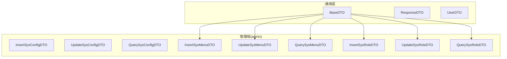
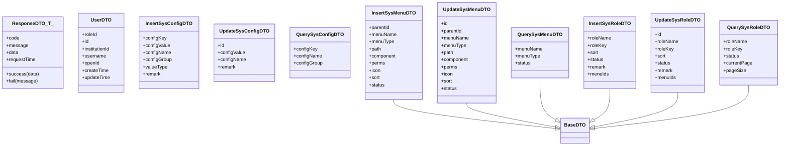
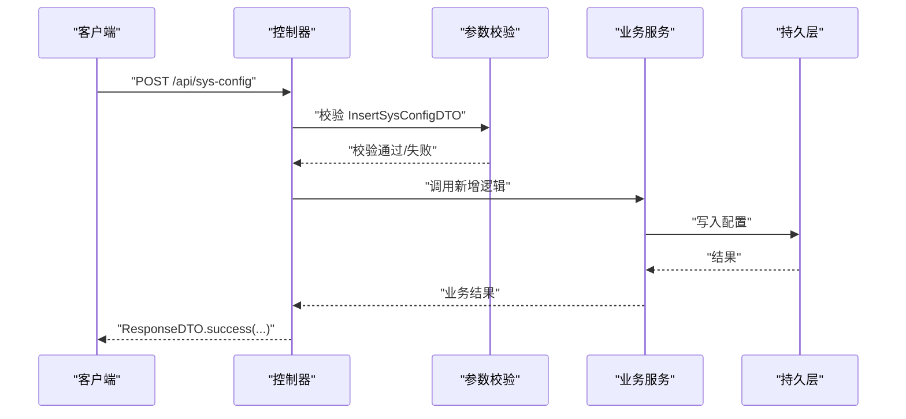
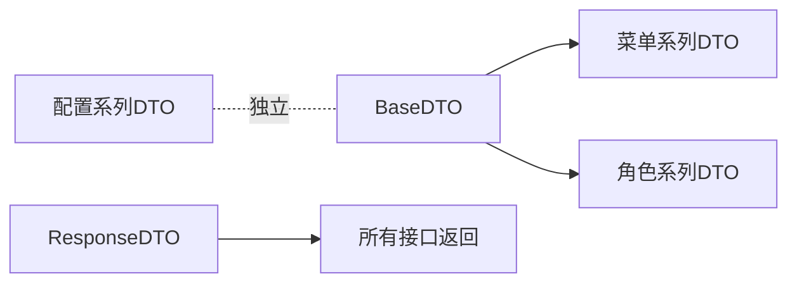

# DTO定义规范

<cite>
**本文引用的文件**   
- [BaseDTO.java](file://class_times_record_back/common/src/main/java/com/shiroko/repository/dto/BaseDTO.java)
- [ResponseDTO.java](file://class_times_record_back/common/src/main/java/com/shiroko/repository/dto/ResponseDTO.java)
- [UserDTO.java](file://class_times_record_back/common/src/main/java/com/shiroko/repository/dto/UserDTO.java)
- [InsertSysConfigDTO.java](file://class_times_record_back/common/src/main/java/com/shiroko/repository/dto/admin/InsertSysConfigDTO.java)
- [QuerySysConfigDTO.java](file://class_times_record_back/common/src/main/java/com/shiroko/repository/dto/admin/QuerySysConfigDTO.java)
- [UpdateSysConfigDTO.java](file://class_times_record_back/common/src/main/java/com/shiroko/repository/dto/admin/UpdateSysConfigDTO.java)
- [InsertSysMenuDTO.java](file://class_times_record_back/common/src/main/java/com/shiroko/repository/dto/admin/InsertSysMenuDTO.java)
- [QuerySysMenuDTO.java](file://class_times_record_back/common/src/main/java/com/shiroko/repository/dto/admin/QuerySysMenuDTO.java)
- [UpdateSysMenuDTO.java](file://class_times_record_back/common/src/main/java/com/shiroko/repository/dto/admin/UpdateSysMenuDTO.java)
- [InsertSysRoleDTO.java](file://class_times_record_back/common/src/main/java/com/shiroko/repository/dto/admin/InsertSysRoleDTO.java)
- [QuerySysRoleDTO.java](file://class_times_record_back/common/src/main/java/com/shiroko/repository/dto/admin/QuerySysRoleDTO.java)
- [UpdateSysRoleDTO.java](file://class_times_record_back/common/src/main/java/com/shiroko/repository/dto/admin/UpdateSysRoleDTO.java)
</cite>

## 目录
1. [引言](#引言)
2. [项目结构](#项目结构)
3. [核心组件](#核心组件)
4. [架构总览](#架构总览)
5. [详细组件分析](#详细组件分析)
6. [依赖关系分析](#依赖关系分析)
7. [性能与一致性考虑](#性能与一致性考虑)
8. [故障排查指南](#故障排查指南)
9. [结论](#结论)
10. [附录：最佳实践清单](#附录最佳实践清单)

## 引言
本规范面向后端服务的数据传输对象（DTO）设计与实现，目标是统一前后端交互契约、提升可维护性与可读性。文档基于现有代码库中的通用基础类与业务模块DTO进行总结，覆盖设计原则、命名规范、操作类型分类（新增/更新/查询）、字段校验注解使用、必填标记、类型选择、继承与复用策略，并提供完整示例路径与图示说明，帮助开发者创建高质量的DTO。

## 项目结构
本项目在后端公共模块中集中管理DTO，采用“包+前缀”的约定式组织方式：
- 通用DTO位于 dto 根包下，如 BaseDTO、ResponseDTO、UserDTO
- 业务域DTO按子包划分，例如 admin 包下的系统配置、菜单、角色等

图表来源
- [BaseDTO.java:1-26](file://class_times_record_back/common/src/main/java/com/shiroko/repository/dto/BaseDTO.java#L1-L26)
- [ResponseDTO.java:1-50](file://class_times_record_back/common/src/main/java/com/shiroko/repository/dto/ResponseDTO.java#L1-L50)
- [UserDTO.java:1-30](file://class_times_record_back/common/src/main/java/com/shiroko/repository/dto/UserDTO.java#L1-L30)
- [InsertSysConfigDTO.java:1-36](file://class_times_record_back/common/src/main/java/com/shiroko/repository/dto/admin/InsertSysConfigDTO.java#L1-L36)
- [QuerySysConfigDTO.java:1-23](file://class_times_record_back/common/src/main/java/com/shiroko/repository/dto/admin/QuerySysConfigDTO.java#L1-L23)
- [UpdateSysConfigDTO.java:1-30](file://class_times_record_back/common/src/main/java/com/shiroko/repository/dto/admin/UpdateSysConfigDTO.java#L1-L30)
- [InsertSysMenuDTO.java:1-33](file://class_times_record_back/common/src/main/java/com/shiroko/repository/dto/admin/InsertSysMenuDTO.java#L1-L33)
- [QuerySysMenuDTO.java:1-17](file://class_times_record_back/common/src/main/java/com/shiroko/repository/dto/admin/QuerySysMenuDTO.java#L1-L17)
- [UpdateSysMenuDTO.java:1-33](file://class_times_record_back/common/src/main/java/com/shiroko/repository/dto/admin/UpdateSysMenuDTO.java#L1-L33)
- [InsertSysRoleDTO.java:1-28](file://class_times_record_back/common/src/main/java/com/shiroko/repository/dto/admin/InsertSysRoleDTO.java#L1-L28)
- [QuerySysRoleDTO.java:1-21](file://class_times_record_back/common/src/main/java/com/shiroko/repository/dto/admin/QuerySysRoleDTO.java#L1-L21)
- [UpdateSysRoleDTO.java:1-29](file://class_times_record_back/common/src/main/java/com/shiroko/repository/dto/admin/UpdateSysRoleDTO.java#L1-L29)

章节来源
- [BaseDTO.java:1-26](file://class_times_record_back/common/src/main/java/com/shiroko/repository/dto/BaseDTO.java#L1-L26)
- [ResponseDTO.java:1-50](file://class_times_record_back/common/src/main/java/com/shiroko/repository/dto/ResponseDTO.java#L1-L50)
- [UserDTO.java:1-30](file://class_times_record_back/common/src/main/java/com/shiroko/repository/dto/UserDTO.java#L1-L30)
- [InsertSysConfigDTO.java:1-36](file://class_times_record_back/common/src/main/java/com/shiroko/repository/dto/admin/InsertSysConfigDTO.java#L1-L36)
- [QuerySysConfigDTO.java:1-23](file://class_times_record_back/common/src/main/java/com/shiroko/repository/dto/admin/QuerySysConfigDTO.java#L1-L23)
- [UpdateSysConfigDTO.java:1-30](file://class_times_record_back/common/src/main/java/com/shiroko/repository/dto/admin/UpdateSysConfigDTO.java#L1-L30)
- [InsertSysMenuDTO.java:1-33](file://class_times_record_back/common/src/main/java/com/shiroko/repository/dto/admin/InsertSysMenuDTO.java#L1-L33)
- [QuerySysMenuDTO.java:1-17](file://class_times_record_back/common/src/main/java/com/shiroko/repository/dto/admin/QuerySysMenuDTO.java#L1-L17)
- [UpdateSysMenuDTO.java:1-33](file://class_times_record_back/common/src/main/java/com/shiroko/repository/dto/admin/UpdateSysMenuDTO.java#L1-L33)
- [InsertSysRoleDTO.java:1-28](file://class_times_record_back/common/src/main/java/com/shiroko/repository/dto/admin/InsertSysRoleDTO.java#L1-L28)
- [QuerySysRoleDTO.java:1-21](file://class_times_record_back/common/src/main/java/com/shiroko/repository/dto/admin/QuerySysRoleDTO.java#L1-L21)
- [UpdateSysRoleDTO.java:1-29](file://class_times_record_back/common/src/main/java/com/shiroko/repository/dto/admin/UpdateSysRoleDTO.java#L1-L29)

## 核心组件
- 基础DTO（BaseDTO）
  - 定位：承载跨领域通用能力或扩展点（当前为空基类，便于后续扩展通用字段或校验规则）。
  - 建议：如需分页、审计时间戳等通用字段，优先在 BaseDTO 中声明并配合验证注解。
- 响应DTO（ResponseDTO<T>）
  - 定位：统一接口返回结构，包含状态码、消息、数据体与请求时间。
  - 建议：对外API一律使用该包装，避免前端处理不一致。
- 用户上下文DTO（UserDTO）
  - 定位：登录态与权限信息载体，用于上下文透传。
  - 建议：仅携带必要最小集，避免泄露敏感信息。

章节来源
- [BaseDTO.java:1-26](file://class_times_record_back/common/src/main/java/com/shiroko/repository/dto/BaseDTO.java#L1-L26)
- [ResponseDTO.java:1-50](file://class_times_record_back/common/src/main/java/com/shiroko/repository/dto/ResponseDTO.java#L1-L50)
- [UserDTO.java:1-30](file://class_times_record_back/common/src/main/java/com/shiroko/repository/dto/UserDTO.java#L1-L30)

## 架构总览
下图展示各业务域DTO与基础类的继承关系及职责边界。

图表来源
- [BaseDTO.java:1-26](file://class_times_record_back/common/src/main/java/com/shiroko/repository/dto/BaseDTO.java#L1-L26)
- [ResponseDTO.java:1-50](file://class_times_record_back/common/src/main/java/com/shiroko/repository/dto/ResponseDTO.java#L1-L50)
- [UserDTO.java:1-30](file://class_times_record_back/common/src/main/java/com/shiroko/repository/dto/UserDTO.java#L1-L30)
- [InsertSysConfigDTO.java:1-36](file://class_times_record_back/common/src/main/java/com/shiroko/repository/dto/admin/InsertSysConfigDTO.java#L1-L36)
- [QuerySysConfigDTO.java:1-23](file://class_times_record_back/common/src/main/java/com/shiroko/repository/dto/admin/QuerySysConfigDTO.java#L1-L23)
- [UpdateSysConfigDTO.java:1-30](file://class_times_record_back/common/src/main/java/com/shiroko/repository/dto/admin/UpdateSysConfigDTO.java#L1-L30)
- [InsertSysMenuDTO.java:1-33](file://class_times_record_back/common/src/main/java/com/shiroko/repository/dto/admin/InsertSysMenuDTO.java#L1-L33)
- [QuerySysMenuDTO.java:1-17](file://class_times_record_back/common/src/main/java/com/shiroko/repository/dto/admin/QuerySysMenuDTO.java#L1-L17)
- [UpdateSysMenuDTO.java:1-33](file://class_times_record_back/common/src/main/java/com/shiroko/repository/dto/admin/UpdateSysMenuDTO.java#L1-L33)
- [InsertSysRoleDTO.java:1-28](file://class_times_record_back/common/src/main/java/com/shiroko/repository/dto/admin/InsertSysRoleDTO.java#L1-L28)
- [QuerySysRoleDTO.java:1-21](file://class_times_record_back/common/src/main/java/com/shiroko/repository/dto/admin/QuerySysRoleDTO.java#L1-L21)
- [UpdateSysRoleDTO.java:1-29](file://class_times_record_back/common/src/main/java/com/shiroko/repository/dto/admin/UpdateSysRoleDTO.java#L1-L29)

## 详细组件分析

### 设计原则与命名规范
- 单一职责：每个DTO只承载一次操作的输入或输出，避免“万能DTO”。
- 操作导向：按操作类型拆分，常见为 Insert/Update/Query 三类；必要时增加 Delete/Export/Import 等专用DTO。
- 命名约定：
  - 新增：InsertXxxDTO
  - 更新：UpdateXxxDTO
  - 查询：QueryXxxDTO
  - 列表查询：ListXxxDTO 或 PageXxxDTO（含分页字段）
- 字段可见性：仅暴露调用方必需的最小字段集合，避免过度耦合。
- 不可变优先：对于纯输出DTO，尽量不提供setter，减少误改风险。

章节来源
- [InsertSysConfigDTO.java:1-36](file://class_times_record_back/common/src/main/java/com/shiroko/repository/dto/admin/InsertSysConfigDTO.java#L1-L36)
- [UpdateSysConfigDTO.java:1-30](file://class_times_record_back/common/src/main/java/com/shiroko/repository/dto/admin/UpdateSysConfigDTO.java#L1-L30)
- [QuerySysConfigDTO.java:1-23](file://class_times_record_back/common/src/main/java/com/shiroko/repository/dto/admin/QuerySysConfigDTO.java#L1-L23)
- [InsertSysMenuDTO.java:1-33](file://class_times_record_back/common/src/main/java/com/shiroko/repository/dto/admin/InsertSysMenuDTO.java#L1-L33)
- [UpdateSysMenuDTO.java:1-33](file://class_times_record_back/common/src/main/java/com/shiroko/repository/dto/admin/UpdateSysMenuDTO.java#L1-L33)
- [QuerySysMenuDTO.java:1-17](file://class_times_record_back/common/src/main/java/com/shiroko/repository/dto/admin/QuerySysMenuDTO.java#L1-L17)
- [InsertSysRoleDTO.java:1-28](file://class_times_record_back/common/src/main/java/com/shiroko/repository/dto/admin/InsertSysRoleDTO.java#L1-L28)
- [UpdateSysRoleDTO.java:1-29](file://class_times_record_back/common/src/main/java/com/shiroko/repository/dto/admin/UpdateSysRoleDTO.java#L1-L29)
- [QuerySysRoleDTO.java:1-21](file://class_times_record_back/common/src/main/java/com/shiroko/repository/dto/admin/QuerySysRoleDTO.java#L1-L21)

### 操作类型分类与字段设计
- InsertDTO（新增）
  - 必须包含业务主键以外的所有必填字段。
  - 示例参考：InsertSysConfigDTO、InsertSysMenuDTO、InsertSysRoleDTO
- UpdateDTO（更新）
  - 必须包含资源标识（如 id），其余字段按需更新。
  - 示例参考：UpdateSysConfigDTO、UpdateSysMenuDTO、UpdateSysRoleDTO
- QueryDTO（查询）
  - 以筛选条件为主，支持模糊/精确匹配与分页参数。
  - 示例参考：QuerySysConfigDTO、QuerySysMenuDTO、QuerySysRoleDTO

章节来源
- [InsertSysConfigDTO.java:1-36](file://class_times_record_back/common/src/main/java/com/shiroko/repository/dto/admin/InsertSysConfigDTO.java#L1-L36)
- [UpdateSysConfigDTO.java:1-30](file://class_times_record_back/common/src/main/java/com/shiroko/repository/dto/admin/UpdateSysConfigDTO.java#L1-L30)
- [QuerySysConfigDTO.java:1-23](file://class_times_record_back/common/src/main/java/com/shiroko/repository/dto/admin/QuerySysConfigDTO.java#L1-L23)
- [InsertSysMenuDTO.java:1-33](file://class_times_record_back/common/src/main/java/com/shiroko/repository/dto/admin/InsertSysMenuDTO.java#L1-L33)
- [UpdateSysMenuDTO.java:1-33](file://class_times_record_back/common/src/main/java/com/shiroko/repository/dto/admin/UpdateSysMenuDTO.java#L1-L33)
- [QuerySysMenuDTO.java:1-17](file://class_times_record_back/common/src/main/java/com/shiroko/repository/dto/admin/QuerySysMenuDTO.java#L1-L17)
- [InsertSysRoleDTO.java:1-28](file://class_times_record_back/common/src/main/java/com/shiroko/repository/dto/admin/InsertSysRoleDTO.java#L1-L28)
- [UpdateSysRoleDTO.java:1-29](file://class_times_record_back/common/src/main/java/com/shiroko/repository/dto/admin/UpdateSysRoleDTO.java#L1-L29)
- [QuerySysRoleDTO.java:1-21](file://class_times_record_back/common/src/main/java/com/shiroko/repository/dto/admin/QuerySysRoleDTO.java#L1-L21)

### 数据验证注解与必填标记
- 常用注解
  - @NotNull：对象类型非空
  - @NotBlank：字符串非空且非空白
  - @NotEmpty：集合/数组非空
  - @Email/@Phone：格式校验（若自定义需确保生效）
- 应用建议
  - 对业务关键输入强制标注校验注解，并在错误消息中给出明确提示。
  - 区分“必填”和“可选”，避免过度校验导致用户体验下降。
- 示例参考
  - 新增配置：InsertSysConfigDTO 中对 key/value/name 使用 @NotBlank
  - 更新配置：UpdateSysConfigDTO 中对 id 使用 @NotNull，对 configValue 使用 @NotBlank
  - 菜单新增：InsertSysMenuDTO 中对名称与类型使用 @NotBlank
  - 角色新增：InsertSysRoleDTO 中对名称与标识使用 @NotBlank

章节来源
- [InsertSysConfigDTO.java:1-36](file://class_times_record_back/common/src/main/java/com/shiroko/repository/dto/admin/InsertSysConfigDTO.java#L1-L36)
- [UpdateSysConfigDTO.java:1-30](file://class_times_record_back/common/src/main/java/com/shiroko/repository/dto/admin/UpdateSysConfigDTO.java#L1-L30)
- [InsertSysMenuDTO.java:1-33](file://class_times_record_back/common/src/main/java/com/shiroko/repository/dto/admin/InsertSysMenuDTO.java#L1-L33)
- [InsertSysRoleDTO.java:1-28](file://class_times_record_back/common/src/main/java/com/shiroko/repository/dto/admin/InsertSysRoleDTO.java#L1-L28)

### 字段类型选择
- 标识类：Long（数据库自增ID）
- 文本类：String（长度限制由注解或业务约束保证）
- 布尔类：Boolean（注意默认值语义）
- 数值类：Integer/Long（排序、状态码等）
- 集合类：List<Long>（批量关联，如菜单ID集合）
- 时间类：LocalDateTime（持久化时间）
- 示例参考
  - 用户上下文：UserDTO 使用 Long/String/LocalDateTime
  - 角色菜单关联：InsertSysRoleDTO/UpdateSysRoleDTO 使用 List<Long>

章节来源
- [UserDTO.java:1-30](file://class_times_record_back/common/src/main/java/com/shiroko/repository/dto/UserDTO.java#L1-L30)
- [InsertSysRoleDTO.java:1-28](file://class_times_record_back/common/src/main/java/com/shiroko/repository/dto/admin/InsertSysRoleDTO.java#L1-L28)
- [UpdateSysRoleDTO.java:1-29](file://class_times_record_back/common/src/main/java/com/shiroko/repository/dto/admin/UpdateSysRoleDTO.java#L1-L29)

### 继承关系与复用策略
- 通过 BaseDTO 作为扩展点，将通用字段（如分页、审计时间戳）下沉到基类，减少重复。
- 同一实体的多操作DTO共享命名前缀 XxxDTO，并通过 Insert/Update/Query 前缀表达意图。
- 示例参考
  - 菜单与角色相关DTO均继承 BaseDTO，便于后续扩展通用能力。

章节来源
- [BaseDTO.java:1-26](file://class_times_record_back/common/src/main/java/com/shiroko/repository/dto/BaseDTO.java#L1-L26)
- [InsertSysMenuDTO.java:1-33](file://class_times_record_back/common/src/main/java/com/shiroko/repository/dto/admin/InsertSysMenuDTO.java#L1-L33)
- [UpdateSysMenuDTO.java:1-33](file://class_times_record_back/common/src/main/java/com/shiroko/repository/dto/admin/UpdateSysMenuDTO.java#L1-L33)
- [QuerySysMenuDTO.java:1-17](file://class_times_record_back/common/src/main/java/com/shiroko/repository/dto/admin/QuerySysMenuDTO.java#L1-L17)
- [InsertSysRoleDTO.java:1-28](file://class_times_record_back/common/src/main/java/com/shiroko/repository/dto/admin/InsertSysRoleDTO.java#L1-L28)
- [UpdateSysRoleDTO.java:1-29](file://class_times_record_back/common/src/main/java/com/shiroko/repository/dto/admin/UpdateSysRoleDTO.java#L1-L29)
- [QuerySysRoleDTO.java:1-21](file://class_times_record_back/common/src/main/java/com/shiroko/repository/dto/admin/QuerySysRoleDTO.java#L1-L21)

### 统一响应封装
- 所有对外接口应返回 ResponseDTO<T>，包含 code/message/data/requestTime。
- 提供便捷工厂方法 success/fail，简化构造逻辑。
- 示例参考
  - ResponseDTO 的静态方法与字段定义

章节来源
- [ResponseDTO.java:1-50](file://class_times_record_back/common/src/main/java/com/shiroko/repository/dto/ResponseDTO.java#L1-L50)

### 典型流程时序（以新增配置为例）

图表来源
- [InsertSysConfigDTO.java:1-36](file://class_times_record_back/common/src/main/java/com/shiroko/repository/dto/admin/InsertSysConfigDTO.java#L1-L36)
- [ResponseDTO.java:1-50](file://class_times_record_back/common/src/main/java/com/shiroko/repository/dto/ResponseDTO.java#L1-L50)

## 依赖关系分析
- 内聚性
  - 每个DTO聚焦单一操作，职责清晰，内聚度高。
- 耦合度
  - 通过 BaseDTO 抽象通用能力，降低重复耦合。
  - 业务DTO之间无直接依赖，仅通过 Controller/Service 组合使用。
- 外部依赖
  - 使用 Jakarta Validation 注解进行声明式校验。
  - 使用 Lombok 生成样板代码，提高可读性与一致性。

图表来源
- [BaseDTO.java:1-26](file://class_times_record_back/common/src/main/java/com/shiroko/repository/dto/BaseDTO.java#L1-L26)
- [InsertSysMenuDTO.java:1-33](file://class_times_record_back/common/src/main/java/com/shiroko/repository/dto/admin/InsertSysMenuDTO.java#L1-L33)
- [UpdateSysMenuDTO.java:1-33](file://class_times_record_back/common/src/main/java/com/shiroko/repository/dto/admin/UpdateSysMenuDTO.java#L1-L33)
- [QuerySysMenuDTO.java:1-17](file://class_times_record_back/common/src/main/java/com/shiroko/repository/dto/admin/QuerySysMenuDTO.java#L1-L17)
- [InsertSysRoleDTO.java:1-28](file://class_times_record_back/common/src/main/java/com/shiroko/repository/dto/admin/InsertSysRoleDTO.java#L1-L28)
- [UpdateSysRoleDTO.java:1-29](file://class_times_record_back/common/src/main/java/com/shiroko/repository/dto/admin/UpdateSysRoleDTO.java#L1-L29)
- [QuerySysRoleDTO.java:1-21](file://class_times_record_back/common/src/main/java/com/shiroko/repository/dto/admin/QuerySysRoleDTO.java#L1-L21)
- [InsertSysConfigDTO.java:1-36](file://class_times_record_back/common/src/main/java/com/shiroko/repository/dto/admin/InsertSysConfigDTO.java#L1-L36)
- [UpdateSysConfigDTO.java:1-30](file://class_times_record_back/common/src/main/java/com/shiroko/repository/dto/admin/UpdateSysConfigDTO.java#L1-L30)
- [QuerySysConfigDTO.java:1-23](file://class_times_record_back/common/src/main/java/com/shiroko/repository/dto/admin/QuerySysConfigDTO.java#L1-L23)
- [ResponseDTO.java:1-50](file://class_times_record_back/common/src/main/java/com/shiroko/repository/dto/ResponseDTO.java#L1-L50)

## 性能与一致性考虑
- 校验前置：在Controller入口完成参数校验，尽早失败，减少无效处理。
- 最小传输：DTO仅包含必要字段，降低序列化/反序列化开销。
- 分页查询：在 QueryDTO 中显式声明 currentPage/pageSize，避免隐式默认值带来的不确定性。
- 枚举与字典：对有限取值字段建议使用枚举或常量，结合校验注解保障一致性。

[本节为通用指导，不直接分析具体文件]

## 故障排查指南
- 校验失败
  - 现象：请求被拒绝，返回校验错误信息。
  - 排查：检查对应DTO字段是否缺失或格式不符，确认注解 message 提示是否清晰。
  - 参考：InsertSysConfigDTO、UpdateSysConfigDTO、InsertSysMenuDTO、InsertSysRoleDTO 的注解使用。
- 响应结构不一致
  - 现象：前端无法解析返回体。
  - 排查：确认接口统一返回 ResponseDTO<T>，并使用其静态方法构造。
  - 参考：ResponseDTO 的字段与静态方法。

章节来源
- [InsertSysConfigDTO.java:1-36](file://class_times_record_back/common/src/main/java/com/shiroko/repository/dto/admin/InsertSysConfigDTO.java#L1-L36)
- [UpdateSysConfigDTO.java:1-30](file://class_times_record_back/common/src/main/java/com/shiroko/repository/dto/admin/UpdateSysConfigDTO.java#L1-L30)
- [InsertSysMenuDTO.java:1-33](file://class_times_record_back/common/src/main/java/com/shiroko/repository/dto/admin/InsertSysMenuDTO.java#L1-L33)
- [InsertSysRoleDTO.java:1-28](file://class_times_record_back/common/src/main/java/com/shiroko/repository/dto/admin/InsertSysRoleDTO.java#L1-L28)
- [ResponseDTO.java:1-50](file://class_times_record_back/common/src/main/java/com/shiroko/repository/dto/ResponseDTO.java#L1-L50)

## 结论
通过统一的DTO分层与命名约定、严格的校验注解与最小字段原则，以及 BaseDTO 的复用机制，可以显著提升系统的可维护性与稳定性。建议在新增业务时严格遵循本规范，并结合 ResponseDTO 统一返回结构，确保前后端协作顺畅。

[本节为总结性内容，不直接分析具体文件]

## 附录：最佳实践清单
- 命名
  - 使用 InsertXxxDTO/UpdateXxxDTO/QueryXxxDTO 表达操作意图
- 校验
  - 必填字段加 @NotNull/@NotBlank，集合用 @NotEmpty
  - 错误消息明确、友好
- 类型
  - 标识用 Long，文本用 String，布尔用 Boolean，时间用 LocalDateTime
- 继承
  - 通用字段下沉至 BaseDTO，减少重复
- 返回
  - 统一使用 ResponseDTO<T>，借助静态方法快速构建
- 安全
  - 不在DTO中传递敏感信息，最小化暴露

[本节为通用指导，不直接分析具体文件]