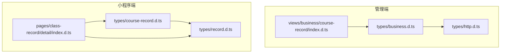
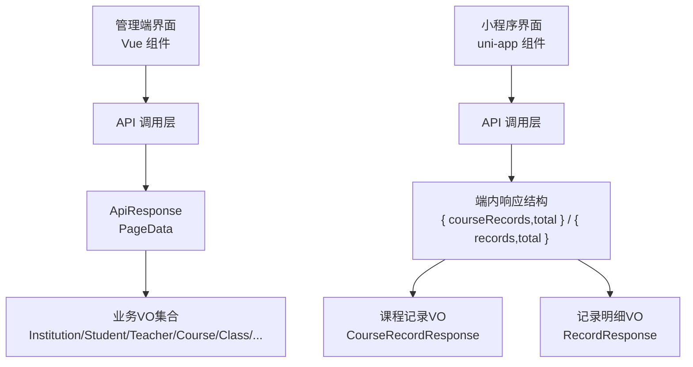
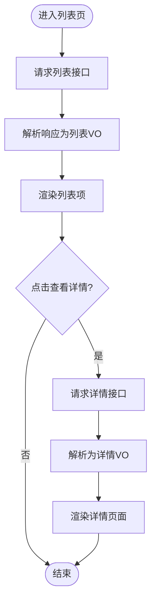
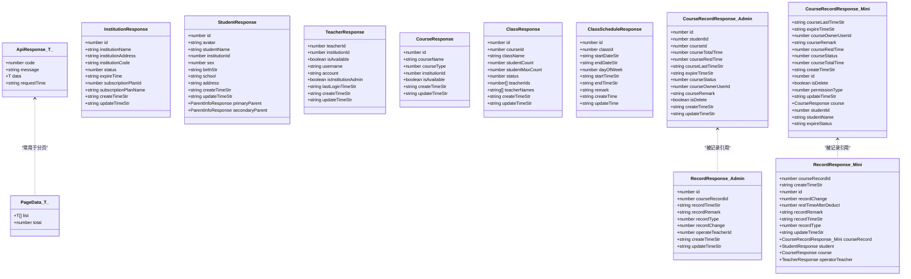
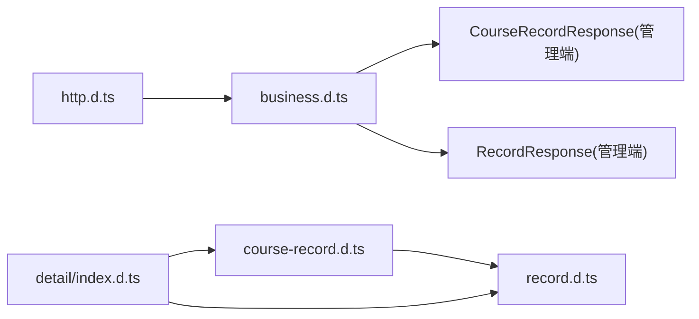

# VO定义规范

<cite>
**本文引用的文件**
- [business.d.ts](file://class_record_admin_front/src/types/business.d.ts)
- [http.d.ts](file://class_record_admin_front/src/types/http.d.ts)
- [course-record.d.ts](file://class_times_record/src/types/course-record.d.ts)
- [record.d.ts](file://class_times_record/src/types/record.d.ts)
- [index.d.ts（课程记录表单）](file://class_record_admin_front/src/views/business/course-record/index.d.ts)
- [detail/index.d.ts（小程序课程记录详情导出）](file://class_times_record/src/pages/class-record/detail/index.d.ts)
</cite>

## 目录
1. [引言](#引言)
2. [项目结构](#项目结构)
3. [核心组件](#核心组件)
4. [架构总览](#架构总览)
5. [详细组件分析](#详细组件分析)
6. [依赖分析](#依赖分析)
7. [性能考虑](#性能考虑)
8. [故障排查指南](#故障排查指南)
9. [结论](#结论)
10. [附录](#附录)

## 引言
本规范面向前后端协作中的视图对象（VO，View Object）设计，聚焦展示层数据组织、列表与详情VO的差异、前端格式化与计算字段处理、敏感信息过滤、嵌套对象处理以及响应格式标准化。通过统一VO约定，降低前后端耦合度，提升可维护性与渲染性能。

## 项目结构
本项目包含管理端与小程序端两套前端工程，各自在类型定义中体现VO的边界与职责：
- 管理端（Vue + TypeScript）：业务VO集中在 types/business.d.ts，通用响应包装在 types/http.d.ts；页面级表单VO位于对应视图的 index.d.ts。
- 小程序端（uni-app + TypeScript）：课程记录相关VO集中在 types/course-record.d.ts，记录明细VO在 types/record.d.ts；部分页面会重新导出VO以简化引用。

图表来源
- [business.d.ts:1-443](file://class_record_admin_front/src/types/business.d.ts#L1-L443)
- [http.d.ts:1-12](file://class_record_admin_front/src/types/http.d.ts#L1-L12)
- [course-record.d.ts:1-96](file://class_times_record/src/types/course-record.d.ts#L1-L96)
- [record.d.ts:1-34](file://class_times_record/src/types/record.d.ts#L1-L34)
- [index.d.ts（课程记录表单）:1-11](file://class_record_admin_front/src/views/business/course-record/index.d.ts#L1-L11)
- [detail/index.d.ts（小程序课程记录详情导出）:1-5](file://class_times_record/src/pages/class-record/detail/index.d.ts#L1-L5)

章节来源
- [business.d.ts:1-443](file://class_record_admin_front/src/types/business.d.ts#L1-L443)
- [http.d.ts:1-12](file://class_record_admin_front/src/types/http.d.ts#L1-L12)
- [course-record.d.ts:1-96](file://class_times_record/src/types/course-record.d.ts#L1-L96)
- [record.d.ts:1-34](file://class_times_record/src/types/record.d.ts#L1-L34)
- [index.d.ts（课程记录表单）:1-11](file://class_record_admin_front/src/views/business/course-record/index.d.ts#L1-L11)
- [detail/index.d.ts（小程序课程记录详情导出）:1-5](file://class_times_record/src/pages/class-record/detail/index.d.ts#L1-L5)

## 核心组件
本节梳理现有VO的设计模式与约定，作为后续规范的依据。

- 通用响应包装
  - ApiResponse<T>：统一返回码、消息、数据体与请求时间戳，便于全局拦截与错误提示。
  - PageData<T>：分页数据结构，list 与 total 是标准分页字段。

- 管理端业务VO（示例）
  - InstitutionResponse、StudentResponse、TeacherResponse、CourseResponse、ClassResponse、ClassScheduleResponse、CourseRecordResponse、RecordResponse 等，均提供展示用字段，如 createTimeStr/updateTimeStr 用于直接渲染。
  - 列表响应封装为 GetXxxListResponse，包含 list 与 total。
  - 表单VO（如 CourseRecordForm）用于新增/编辑场景，字段与后端一致但允许可选。

- 小程序端业务VO（示例）
  - CourseRecordResponse：除基础课时信息外，包含关联对象 course、学生姓名 studentName、到期状态 expireStatus 等“展示增强”字段。
  - RecordResponse：记录明细，包含操作人、课程、学生等关联对象，以及快照字段 restTimeAfterDeduct。
  - 列表响应使用自定义结构（如 { courseRecords, total }），与通用 PageData 不同，需按端内约定消费。

- 页面级导出
  - 小程序详情页将 VO 重新导出，便于页面集中引用，减少跨层级导入复杂度。

章节来源
- [http.d.ts:1-12](file://class_record_admin_front/src/types/http.d.ts#L1-L12)
- [business.d.ts:1-443](file://class_record_admin_front/src/types/business.d.ts#L1-L443)
- [course-record.d.ts:1-96](file://class_times_record/src/types/course-record.d.ts#L1-L96)
- [record.d.ts:1-34](file://class_times_record/src/types/record.d.ts#L1-L34)
- [index.d.ts（课程记录表单）:1-11](file://class_record_admin_front/src/views/business/course-record/index.d.ts#L1-L11)
- [detail/index.d.ts（小程序课程记录详情导出）:1-5](file://class_times_record/src/pages/class-record/detail/index.d.ts#L1-L5)

## 架构总览
下图展示了管理端与小程序端VO在整体架构中的位置与交互关系。

图表来源
- [http.d.ts:1-12](file://class_record_admin_front/src/types/http.d.ts#L1-L12)
- [business.d.ts:1-443](file://class_record_admin_front/src/types/business.d.ts#L1-L443)
- [course-record.d.ts:1-96](file://class_times_record/src/types/course-record.d.ts#L1-L96)
- [record.d.ts:1-34](file://class_times_record/src/types/record.d.ts#L1-L34)

## 详细组件分析

### 列表VO与详情VO的设计差异
- 列表VO
  - 目标：快速渲染表格或卡片，强调轻量与可读性。
  - 字段策略：仅包含必要展示字段；时间字段尽量提供已格式化字符串（如 createTimeStr）；枚举值提供人类可读文本或标签类字段。
  - 示例参考：管理端的 GetXxxListResponse 与对应实体VO（如 StudentResponse、TeacherResponse、CourseRecordResponse）。
- 详情VO
  - 目标：承载完整上下文与计算结果，支持复杂展示逻辑。
  - 字段策略：包含关联对象（如 course、student、operatorTeacher）、计算字段（如 expireStatus）、敏感信息按需脱敏或隐藏。
  - 示例参考：小程序端 CourseRecordResponse 包含 course 与 expireStatus；RecordResponse 包含多关联对象与快照字段。

图表来源
- [business.d.ts:1-443](file://class_record_admin_front/src/types/business.d.ts#L1-L443)
- [course-record.d.ts:1-96](file://class_times_record/src/types/course-record.d.ts#L1-L96)
- [record.d.ts:1-34](file://class_times_record/src/types/record.d.ts#L1-L34)

章节来源
- [business.d.ts:1-443](file://class_record_admin_front/src/types/business.d.ts#L1-L443)
- [course-record.d.ts:1-96](file://class_times_record/src/types/course-record.d.ts#L1-L96)
- [record.d.ts:1-34](file://class_times_record/src/types/record.d.ts#L1-L34)

### 前端展示数据的格式化与计算字段
- 时间格式化
  - 建议后端直接返回格式化后的字符串字段（如 createTimeStr、expireTimeStr），前端避免重复格式化，减少主线程压力。
  - 若必须本地格式化，应缓存结果或使用惰性计算，避免在长列表渲染时频繁执行。
- 计算字段
  - 示例：expireStatus 由后端根据当前时间与到期时间计算并返回，前端直接使用，避免重复判断。
  - 对于需要动态计算的字段（如剩余课时比例），建议在详情VO中提供，列表VO保持轻量。
- 枚举与标签
  - 对状态、类型等枚举，建议后端返回人类可读文本或标签配置，前端直接显示，减少映射逻辑。

章节来源
- [business.d.ts:1-443](file://class_record_admin_front/src/types/business.d.ts#L1-L443)
- [course-record.d.ts:1-96](file://class_times_record/src/types/course-record.d.ts#L1-L96)

### 敏感信息的过滤与脱敏
- 原则
  - 不在列表VO中暴露敏感字段（如手机号、身份证号、密码等）。
  - 详情VO按需暴露，并在UI层进行掩码展示（如中间四位替换为星号）。
- 实践
  - 管理端 VO 中未出现明文密码字段；如需展示用户联系方式，建议使用脱敏字段（例如 phoneMasked）。
  - 小程序端 VO 应避免携带 token 或鉴权凭据。

章节来源
- [admin.d.ts:1-263](file://class_record_admin_front/src/types/admin.d.ts#L1-L263)
- [business.d.ts:1-443](file://class_record_admin_front/src/types/business.d.ts#L1-L443)

### 嵌套对象处理
- 列表VO
  - 尽量避免深层嵌套，必要时只保留关键ID与简短名称（如 teacherNames[]）。
- 详情VO
  - 合理嵌套关联对象（如 course、student、operatorTeacher），便于详情页面一次性获取所需上下文。
  - 注意控制嵌套深度，避免过大响应体积影响首屏加载。

章节来源
- [business.d.ts:1-443](file://class_record_admin_front/src/types/business.d.ts#L1-L443)
- [record.d.ts:1-34](file://class_times_record/src/types/record.d.ts#L1-L34)

### 响应格式标准化
- 管理端
  - 统一使用 ApiResponse<T> 包裹业务数据；分页使用 PageData<T>（list、total）。
- 小程序端
  - 采用端内约定的响应结构（如 { courseRecords, total } 或 { records, total }），需在API层做统一解析与转换，确保上层类型安全。

章节来源
- [http.d.ts:1-12](file://class_record_admin_front/src/types/http.d.ts#L1-L12)
- [course-record.d.ts:1-96](file://class_times_record/src/types/course-record.d.ts#L1-L96)
- [record.d.ts:1-34](file://class_times_record/src/types/record.d.ts#L1-L34)

### 表单VO与提交约定
- 表单VO（如 CourseRecordForm）
  - 字段与后端保持一致，允许可选字段以支持增量更新。
  - 必填校验应在提交前完成，错误信息统一收集并提示。
- 提交流程
  - 组装表单VO -> 调用API -> 解析 ApiResponse -> 成功回调刷新列表或跳转。

章节来源
- [index.d.ts（课程记录表单）:1-11](file://class_record_admin_front/src/views/business/course-record/index.d.ts#L1-L11)
- [http.d.ts:1-12](file://class_record_admin_front/src/types/http.d.ts#L1-L12)

### 代码级关系图（管理端与小程序端VO）

图表来源
- [http.d.ts:1-12](file://class_record_admin_front/src/types/http.d.ts#L1-L12)
- [business.d.ts:1-443](file://class_record_admin_front/src/types/business.d.ts#L1-L443)
- [course-record.d.ts:1-96](file://class_times_record/src/types/course-record.d.ts#L1-L96)
- [record.d.ts:1-34](file://class_times_record/src/types/record.d.ts#L1-L34)

## 依赖分析
- 管理端
  - business.d.ts 依赖 http.d.ts 的分页与响应包装。
  - 各业务VO之间通过数组或对象引用形成弱耦合（如 ClassResponse.teacherNames[]）。
- 小程序端
  - course-record.d.ts 与 record.d.ts 相互引用，形成课程记录与记录的强关联。
  - 详情页导出VO，简化页面层引用路径。

图表来源
- [http.d.ts:1-12](file://class_record_admin_front/src/types/http.d.ts#L1-L12)
- [business.d.ts:1-443](file://class_record_admin_front/src/types/business.d.ts#L1-L443)
- [course-record.d.ts:1-96](file://class_times_record/src/types/course-record.d.ts#L1-L96)
- [record.d.ts:1-34](file://class_times_record/src/types/record.d.ts#L1-L34)
- [detail/index.d.ts（小程序课程记录详情导出）:1-5](file://class_times_record/src/pages/class-record/detail/index.d.ts#L1-L5)

章节来源
- [http.d.ts:1-12](file://class_record_admin_front/src/types/http.d.ts#L1-L12)
- [business.d.ts:1-443](file://class_record_admin_front/src/types/business.d.ts#L1-L443)
- [course-record.d.ts:1-96](file://class_times_record/src/types/course-record.d.ts#L1-L96)
- [record.d.ts:1-34](file://class_times_record/src/types/record.d.ts#L1-L34)
- [detail/index.d.ts（小程序课程记录详情导出）:1-5](file://class_times_record/src/pages/class-record/detail/index.d.ts#L1-L5)

## 性能考虑
- 列表VO轻量化
  - 仅包含必要字段，避免大对象与深层嵌套，减少序列化与渲染开销。
- 计算字段后置
  - 列表不计算复杂字段，详情再计算或交由后端返回。
- 时间格式化
  - 优先使用后端提供的格式化字段，减少前端重复计算。
- 分页与懒加载
  - 结合 PageData<T> 或端内分页结构，配合虚拟滚动或分页加载，优化大数据量场景。
- 缓存策略
  - 对静态字典（如状态枚举）与热点详情数据进行本地缓存，避免重复请求。

[本节为通用指导，无需源码引用]

## 故障排查指南
- 响应结构不一致
  - 检查是否混用不同端的响应结构（ApiResponse vs 端内结构），在API层统一解析。
- 字段缺失或类型不符
  - 对照VO定义确认字段名与类型，尤其是枚举与可选字段。
- 敏感信息泄露
  - 审查VO是否包含不应展示的字段，必要时在后端裁剪或在UI层脱敏。
- 性能问题
  - 定位是否在列表VO中包含过多计算或嵌套对象，拆分至详情VO或后端预计算。

章节来源
- [http.d.ts:1-12](file://class_record_admin_front/src/types/http.d.ts#L1-L12)
- [business.d.ts:1-443](file://class_record_admin_front/src/types/business.d.ts#L1-L443)
- [course-record.d.ts:1-96](file://class_times_record/src/types/course-record.d.ts#L1-L96)
- [record.d.ts:1-34](file://class_times_record/src/types/record.d.ts#L1-L34)

## 结论
通过统一的VO设计规范，明确列表与详情的职责边界，强化格式化与计算字段的处理策略，严格管控敏感信息，并结合响应格式标准化与性能优化建议，可显著提升前后端协作效率与用户体验。建议在各端建立VO评审清单，持续迭代完善。

[本节为总结，无需源码引用]

## 附录
- 命名约定
  - Response 后缀表示展示型VO；Request 后缀表示请求参数；Form 后缀表示表单VO。
- 字段后缀约定
  - Str 后缀表示已格式化字符串（如 createTimeStr、expireTimeStr）。
  - Id 后缀表示关联实体标识（如 studentId、courseId）。
- 分页约定
  - 管理端使用 PageData<T>；小程序端使用端内约定结构，需在API层统一转换。

[本节为补充说明，无需源码引用]