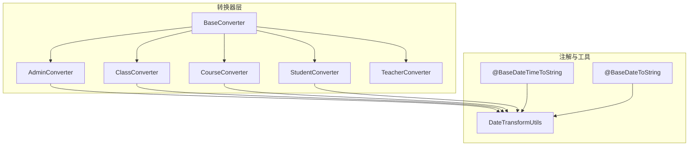
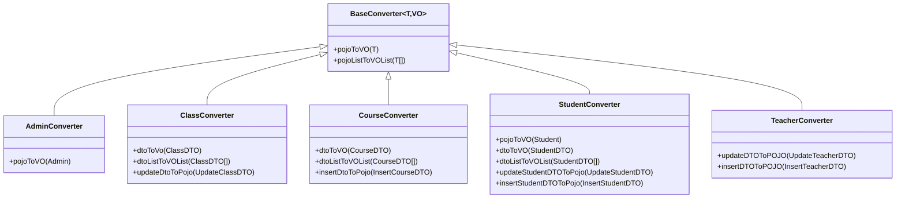
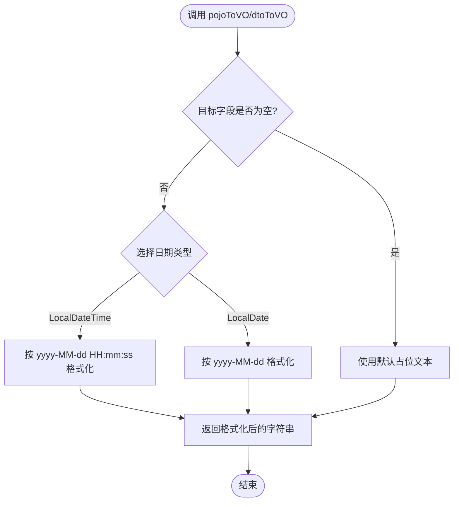
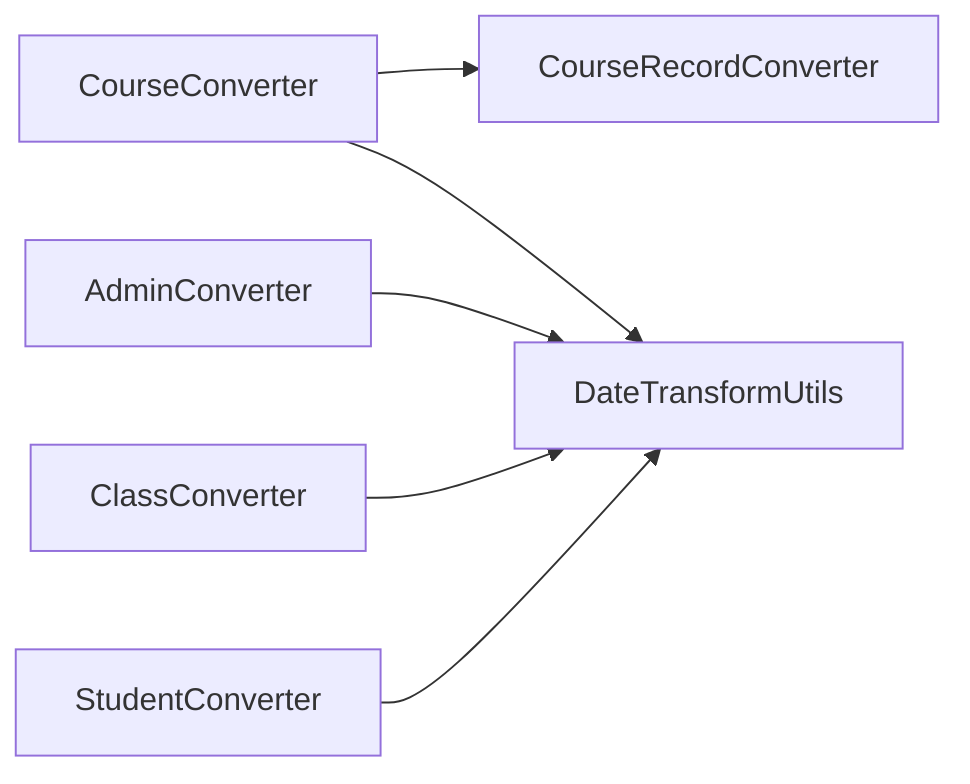

# 业务转换器实现

<cite>
**本文引用的文件**   
- [BaseConverter.java](file://class_times_record_back/common/src/main/java/com/shiroko/converter/BaseConverter.java)
- [AdminConverter.java](file://class_times_record_back/common/src/main/java/com/shiroko/converter/AdminConverter.java)
- [ClassConverter.java](file://class_times_record_back/common/src/main/java/com/shiroko/converter/ClassConverter.java)
- [CourseConverter.java](file://class_times_record_back/common/src/main/java/com/shiroko/converter/CourseConverter.java)
- [StudentConverter.java](file://class_times_record_back/common/src/main/java/com/shiroko/converter/StudentConverter.java)
- [TeacherConverter.java](file://class_times_record_back/common/src/main/java/com/shiroko/converter/TeacherConverter.java)
- [BaseDateTimeToString.java](file://class_times_record_back/common/src/main/java/com/shiroko/annotation/BaseDateTimeToString.java)
- [BaseDateToString.java](file://class_times_record_back/common/src/main/java/com/shiroko/annotation/BaseDateToString.java)
- [DateTransformUtils.java](file://class_times_record_back/common/src/main/java/com/shiroko/util/DateTransformUtils.java)
</cite>

## 目录
1. [简介](#简介)
2. [项目结构](#项目结构)
3. [核心组件](#核心组件)
4. [架构总览](#架构总览)
5. [详细组件分析](#详细组件分析)
6. [依赖关系分析](#依赖关系分析)
7. [性能与扩展性](#性能与扩展性)
8. [故障排查指南](#故障排查指南)
9. [结论](#结论)
10. [附录：创建新业务转换器的完整指南](#附录创建新业务转换器的完整指南)

## 简介
本文件聚焦于后端通用模块中的“业务转换器”体系，围绕 MapStruct 的接口式转换器进行系统化说明。内容覆盖字段映射规则、复杂对象处理、数据验证与转换逻辑、一对多/多对多关系的处理方式，以及为开发者提供创建新业务转换器的最佳实践与步骤指引。

## 项目结构
转换器位于 common 模块的 converter 包下，采用“接口 + 注解 + 工具类”的组合方式，统一由 Spring 容器管理（componentModel = "spring"）。日期格式化通过自定义限定符注解与工具方法解耦，便于复用与扩展。

图表来源
- [BaseConverter.java:1-19](file://class_times_record_back/common/src/main/java/com/shiroko/converter/BaseConverter.java#L1-L19)
- [AdminConverter.java:1-25](file://class_times_record_back/common/src/main/java/com/shiroko/converter/AdminConverter.java#L1-L25)
- [ClassConverter.java:1-33](file://class_times_record_back/common/src/main/java/com/shiroko/converter/ClassConverter.java#L1-L33)
- [CourseConverter.java:1-34](file://class_times_record_back/common/src/main/java/com/shiroko/converter/CourseConverter.java#L1-L34)
- [StudentConverter.java:1-45](file://class_times_record_back/common/src/main/java/com/shiroko/converter/StudentConverter.java#L1-L45)
- [TeacherConverter.java:1-24](file://class_times_record_back/common/src/main/java/com/shiroko/converter/TeacherConverter.java#L1-L24)
- [BaseDateTimeToString.java:1-22](file://class_times_record_back/common/src/main/java/com/shiroko/annotation/BaseDateTimeToString.java#L1-L22)
- [BaseDateToString.java:1-22](file://class_times_record_back/common/src/main/java/com/shiroko/annotation/BaseDateToString.java#L1-L22)
- [DateTransformUtils.java:1-58](file://class_times_record_back/common/src/main/java/com/shiroko/util/DateTransformUtils.java#L1-L58)

章节来源
- [BaseConverter.java:1-19](file://class_times_record_back/common/src/main/java/com/shiroko/converter/BaseConverter.java#L1-L19)
- [AdminConverter.java:1-25](file://class_times_record_back/common/src/main/java/com/shiroko/converter/AdminConverter.java#L1-L25)
- [ClassConverter.java:1-33](file://class_times_record_back/common/src/main/java/com/shiroko/converter/ClassConverter.java#L1-L33)
- [CourseConverter.java:1-34](file://class_times_record_back/common/src/main/java/com/shiroko/converter/CourseConverter.java#L1-L34)
- [StudentConverter.java:1-45](file://class_times_record_back/common/src/main/java/com/shiroko/converter/StudentConverter.java#L1-L45)
- [TeacherConverter.java:1-24](file://class_times_record_back/common/src/main/java/com/shiroko/converter/TeacherConverter.java#L1-L24)
- [BaseDateTimeToString.java:1-22](file://class_times_record_back/common/src/main/java/com/shiroko/annotation/BaseDateTimeToString.java#L1-L22)
- [BaseDateToString.java:1-22](file://class_times_record_back/common/src/main/java/com/shiroko/annotation/BaseDateToString.java#L1-L22)
- [DateTransformUtils.java:1-58](file://class_times_record_back/common/src/main/java/com/shiroko/util/DateTransformUtils.java#L1-L58)

## 核心组件
- BaseConverter：定义 POJO 到 VO 的基础转换能力，包括单对象与集合转换。
- 领域转换器：AdminConverter、ClassConverter、CourseConverter、StudentConverter、TeacherConverter，分别负责对应实体的 DTO/POJO 与 VO 之间的转换。
- 日期转换限定符与工具：BaseDateTimeToString、BaseDateToString 作为 MapStruct 限定符，配合 DateTransformUtils 完成时间格式化为字符串的统一策略。

章节来源
- [BaseConverter.java:1-19](file://class_times_record_back/common/src/main/java/com/shiroko/converter/BaseConverter.java#L1-L19)
- [AdminConverter.java:1-25](file://class_times_record_back/common/src/main/java/com/shiroko/converter/AdminConverter.java#L1-L25)
- [ClassConverter.java:1-33](file://class_times_record_back/common/src/main/java/com/shiroko/converter/ClassConverter.java#L1-L33)
- [CourseConverter.java:1-34](file://class_times_record_back/common/src/main/java/com/shiroko/converter/CourseConverter.java#L1-L34)
- [StudentConverter.java:1-45](file://class_times_record_back/common/src/main/java/com/shiroko/converter/StudentConverter.java#L1-L45)
- [TeacherConverter.java:1-24](file://class_times_record_back/common/src/main/java/com/shiroko/converter/TeacherConverter.java#L1-L24)
- [BaseDateTimeToString.java:1-22](file://class_times_record_back/common/src/main/java/com/shiroko/annotation/BaseDateTimeToString.java#L1-L22)
- [BaseDateToString.java:1-22](file://class_times_record_back/common/src/main/java/com/shiroko/annotation/BaseDateToString.java#L1-L22)
- [DateTransformUtils.java:1-58](file://class_times_record_back/common/src/main/java/com/shiroko/util/DateTransformUtils.java#L1-L58)

## 架构总览
转换器采用“声明式映射 + 工具方法注入”的模式：
- 使用 @Mapper(componentModel = "spring") 将转换器注册为 Spring Bean。
- 使用 @Mapping(target=..., source=..., qualifiedBy=...) 指定字段映射与限定符。
- 使用 uses={...} 引入其他转换器或工具类，支持嵌套对象与集合转换。

图表来源
- [BaseConverter.java:1-19](file://class_times_record_back/common/src/main/java/com/shiroko/converter/BaseConverter.java#L1-L19)
- [AdminConverter.java:1-25](file://class_times_record_back/common/src/main/java/com/shiroko/converter/AdminConverter.java#L1-L25)
- [ClassConverter.java:1-33](file://class_times_record_back/common/src/main/java/com/shiroko/converter/ClassConverter.java#L1-L33)
- [CourseConverter.java:1-34](file://class_times_record_back/common/src/main/java/com/shiroko/converter/CourseConverter.java#L1-L34)
- [StudentConverter.java:1-45](file://class_times_record_back/common/src/main/java/com/shiroko/converter/StudentConverter.java#L1-L45)
- [TeacherConverter.java:1-24](file://class_times_record_back/common/src/main/java/com/shiroko/converter/TeacherConverter.java#L1-L24)

## 详细组件分析

### 基础转换器与日期转换机制
- BaseConverter 定义了 pojoToVO 与 pojoListToVOList 两个通用方法，供各业务转换器继承复用。
- 日期转字符串通过限定符注解与工具方法组合实现：
  - @BaseDateTimeToString 用于 LocalDateTime -> String（yyyy-MM-dd HH:mm:ss）
  - @BaseDateToString 用于 LocalDate -> String（yyyy-MM-dd）
  - DateTransformUtils 提供静态方法并标注对应限定符，空值返回友好提示。

图表来源
- [BaseConverter.java:1-19](file://class_times_record_back/common/src/main/java/com/shiroko/converter/BaseConverter.java#L1-L19)
- [BaseDateTimeToString.java:1-22](file://class_times_record_back/common/src/main/java/com/shiroko/annotation/BaseDateTimeToString.java#L1-L22)
- [BaseDateToString.java:1-22](file://class_times_record_back/common/src/main/java/com/shiroko/annotation/BaseDateToString.java#L1-L22)
- [DateTransformUtils.java:1-58](file://class_times_record_back/common/src/main/java/com/shiroko/util/DateTransformUtils.java#L1-L58)

章节来源
- [BaseConverter.java:1-19](file://class_times_record_back/common/src/main/java/com/shiroko/converter/BaseConverter.java#L1-L19)
- [BaseDateTimeToString.java:1-22](file://class_times_record_back/common/src/main/java/com/shiroko/annotation/BaseDateTimeToString.java#L1-L22)
- [BaseDateToString.java:1-22](file://class_times_record_back/common/src/main/java/com/shiroko/annotation/BaseDateToString.java#L1-L22)
- [DateTransformUtils.java:1-58](file://class_times_record_back/common/src/main/java/com/shiroko/util/DateTransformUtils.java#L1-L58)

### AdminConverter（管理员转换器）
- 职责：将 Admin 实体转换为 AdminVO，并将 createTime/updateTime 转为 createTimeStr/updateTimeStr。
- 映射要点：
  - 使用 @Mapping(target="createTimeStr", source="createTime", qualifiedBy=BaseDateTimeToString.class)
  - 使用 @Mapping(target="updateTimeStr", source="updateTime", qualifiedBy=BaseDateTimeToString.class)
  - 通过 @Mapper(uses={DateTransformUtils.class}) 启用日期转换工具。

章节来源
- [AdminConverter.java:1-25](file://class_times_record_back/common/src/main/java/com/shiroko/converter/AdminConverter.java#L1-L25)
- [DateTransformUtils.java:1-58](file://class_times_record_back/common/src/main/java/com/shiroko/util/DateTransformUtils.java#L1-L58)

### ClassConverter（班级转换器）
- 职责：
  - ClassDTO -> ClassVO（含时间字段格式化）
  - List<ClassDTO> -> List<ClassVO>
  - UpdateClassDTO -> Class（更新场景，id 映射自 classId）
- 映射要点：
  - createTimeStr/updateTimeStr 使用 BaseDateTimeToString 限定符
  - updateDtoToPojo 中 id 映射自 classId，避免自动匹配失败

章节来源
- [ClassConverter.java:1-33](file://class_times_record_back/common/src/main/java/com/shiroko/converter/ClassConverter.java#L1-L33)
- [DateTransformUtils.java:1-58](file://class_times_record_back/common/src/main/java/com/shiroko/util/DateTransformUtils.java#L1-L58)

### CourseConverter（课程转换器）
- 职责：
  - CourseDTO -> CourseVO（包含 createTimeStr/updateTimeStr）
  - List<CourseDTO> -> List<CourseVO>
  - InsertCourseDTO -> Course（插入场景）
- 复杂对象处理：
  - @Mapper(uses={CourseConverter.class, CourseRecordConverter.class, DateTransformUtils.class})
  - 通过 uses 引入子转换器，支持嵌套对象（如课程记录列表）的递归转换。

章节来源
- [CourseConverter.java:1-34](file://class_times_record_back/common/src/main/java/com/shiroko/converter/CourseConverter.java#L1-L34)
- [DateTransformUtils.java:1-58](file://class_times_record_back/common/src/main/java/com/shiroko/util/DateTransformUtils.java#L1-L58)

### StudentConverter（学生转换器）
- 职责：
  - pojoToVO：实体 -> VO（含 createTimeStr/updateTimeStr/birthStr）
  - dtoToVO：显式覆盖父类 pojoToVO，确保 DTO->VO 路径不被误用
  - dtoListToVOList：批量转换
  - insert/update DTO -> POJO：新增/更新场景
- 映射要点：
  - birthStr 使用 @BaseDateToString 限定符（yyyy-MM-dd）
  - 显式定义 dtoToVO 以避免 MapStruct 回退到 pojoToVO

章节来源
- [StudentConverter.java:1-45](file://class_times_record_back/common/src/main/java/com/shiroko/converter/StudentConverter.java#L1-L45)
- [BaseDateToString.java:1-22](file://class_times_record_back/common/src/main/java/com/shiroko/annotation/BaseDateToString.java#L1-L22)
- [DateTransformUtils.java:1-58](file://class_times_record_back/common/src/main/java/com/shiroko/util/DateTransformUtils.java#L1-L58)

### TeacherConverter（教师转换器）
- 职责：
  - UpdateTeacherDTO -> Teacher
  - InsertTeacherDTO -> Teacher
- 特点：未涉及日期格式化，保持简洁映射。

章节来源
- [TeacherConverter.java:1-24](file://class_times_record_back/common/src/main/java/com/shiroko/converter/TeacherConverter.java#L1-L24)

## 依赖关系分析
- 转换器之间通过 @Mapper(uses={...}) 形成依赖图，CourseConverter 依赖 CourseRecordConverter 以处理嵌套对象。
- 所有转换器均依赖 DateTransformUtils 完成日期格式化；限定符注解将方法与 MapStruct 绑定。

图表来源
- [CourseConverter.java:1-34](file://class_times_record_back/common/src/main/java/com/shiroko/converter/CourseConverter.java#L1-L34)
- [AdminConverter.java:1-25](file://class_times_record_back/common/src/main/java/com/shiroko/converter/AdminConverter.java#L1-L25)
- [ClassConverter.java:1-33](file://class_times_record_back/common/src/main/java/com/shiroko/converter/ClassConverter.java#L1-L33)
- [StudentConverter.java:1-45](file://class_times_record_back/common/src/main/java/com/shiroko/converter/StudentConverter.java#L1-L45)
- [DateTransformUtils.java:1-58](file://class_times_record_back/common/src/main/java/com/shiroko/util/DateTransformUtils.java#L1-L58)

章节来源
- [CourseConverter.java:1-34](file://class_times_record_back/common/src/main/java/com/shiroko/converter/CourseConverter.java#L1-L34)
- [AdminConverter.java:1-25](file://class_times_record_back/common/src/main/java/com/shiroko/converter/AdminConverter.java#L1-L25)
- [ClassConverter.java:1-33](file://class_times_record_back/common/src/main/java/com/shiroko/converter/ClassConverter.java#L1-L33)
- [StudentConverter.java:1-45](file://class_times_record_back/common/src/main/java/com/shiroko/converter/StudentConverter.java#L1-L45)
- [DateTransformUtils.java:1-58](file://class_times_record_back/common/src/main/java/com/shiroko/util/DateTransformUtils.java#L1-L58)

## 性能与扩展性
- 编译期生成：MapStruct 在编译期生成实现类，运行时无反射开销，性能优异。
- 集合转换：自动为 List 生成批量转换实现，避免手写循环。
- 可插拔工具：通过 uses 引入新的转换器或工具类，无需修改现有代码即可扩展。
- 建议：
  - 对大对象图，优先拆分细粒度转换器，减少单次转换复杂度。
  - 对频繁使用的日期格式化，集中维护在 DateTransformUtils，保证一致性。

[本节为通用指导，不直接分析具体文件]

## 故障排查指南
- 字段名不一致导致映射失败：
  - 使用 @Mapping(source=..., target=...) 显式指定映射关系。
  - 参考：ClassConverter 中 id 映射自 classId 的处理。
- 日期字段未格式化：
  - 确认使用了正确的限定符注解（@BaseDateTimeToString/@BaseDateToString）。
  - 确认 @Mapper(uses={DateTransformUtils.class}) 已配置。
- 嵌套对象为空指针：
  - 检查子转换器是否已在 uses 中声明。
  - 参考：CourseConverter 中对 CourseRecordConverter 的使用。
- 集合转换异常：
  - 确保源和目标均为集合类型，且元素类型具备对应转换器。

章节来源
- [ClassConverter.java:1-33](file://class_times_record_back/common/src/main/java/com/shiroko/converter/ClassConverter.java#L1-L33)
- [CourseConverter.java:1-34](file://class_times_record_back/common/src/main/java/com/shiroko/converter/CourseConverter.java#L1-L34)
- [BaseDateTimeToString.java:1-22](file://class_times_record_back/common/src/main/java/com/shiroko/annotation/BaseDateTimeToString.java#L1-L22)
- [BaseDateToString.java:1-22](file://class_times_record_back/common/src/main/java/com/shiroko/annotation/BaseDateToString.java#L1-L22)
- [DateTransformUtils.java:1-58](file://class_times_record_back/common/src/main/java/com/shiroko/util/DateTransformUtils.java#L1-L58)

## 结论
本转换器体系通过 MapStruct 的声明式映射与 Spring 集成，实现了高内聚、低耦合的数据转换方案。借助限定符注解与工具类，统一了日期格式化策略；通过 uses 机制，轻松应对嵌套对象与集合转换。该模式具备良好的可扩展性与可维护性，适合在多业务域中推广。

[本节为总结性内容，不直接分析具体文件]

## 附录：创建新业务转换器的完整指南
- 步骤概览
  1) 新建转换器接口，继承 BaseConverter<POJO, VO>。
  2) 使用 @Mapper(componentModel = "spring", uses={...}) 声明转换器及依赖。
  3) 定义 pojoToVO/dtoToVO 等方法，必要时使用 @Mapping 显式映射字段。
  4) 若需日期格式化，使用 @Mapping(..., qualifiedBy=BaseDateTimeToString.class) 或 BaseDateToString.class。
  5) 如需嵌套对象转换，在 uses 中添加对应子转换器。
  6) 在 Service 层注入并使用转换器进行转换。

- 字段映射规则
  - 同名同类型：自动映射。
  - 名称不同：使用 @Mapping(source=..., target=...)。
  - 集合字段：确保元素类型存在对应转换器，或使用 @Mapping 指定转换方法。
  - 枚举/常量：可在工具类中提供转换方法并通过限定符引用。

- 复杂对象处理
  - 嵌套对象：在 uses 中声明子转换器，MapStruct 会递归生成实现。
  - 一对多：目标为 List<子VO>，确保子转换器可用。
  - 多对多：通常拆分为中间表聚合结果后映射为 List<关联VO>，再在业务层组装。

- 数据验证与转换逻辑
  - 建议在 Service 层进行业务校验，转换器专注数据形态转换。
  - 对可能为空的日期字段，利用 DateTransformUtils 的默认占位文本提升可读性。

- 示例路径（不含代码）
  - 参考 AdminConverter 的时间字段映射：[AdminConverter.java:1-25](file://class_times_record_back/common/src/main/java/com/shiroko/converter/AdminConverter.java#L1-L25)
  - 参考 ClassConverter 的 id 重映射：[ClassConverter.java:1-33](file://class_times_record_back/common/src/main/java/com/shiroko/converter/ClassConverter.java#L1-L33)
  - 参考 CourseConverter 的嵌套转换：[CourseConverter.java:1-34](file://class_times_record_back/common/src/main/java/com/shiroko/converter/CourseConverter.java#L1-L34)
  - 参考 StudentConverter 的显式 dtoToVO 覆盖：[StudentConverter.java:1-45](file://class_times_record_back/common/src/main/java/com/shiroko/converter/StudentConverter.java#L1-L45)

章节来源
- [BaseConverter.java:1-19](file://class_times_record_back/common/src/main/java/com/shiroko/converter/BaseConverter.java#L1-L19)
- [AdminConverter.java:1-25](file://class_times_record_back/common/src/main/java/com/shiroko/converter/AdminConverter.java#L1-L25)
- [ClassConverter.java:1-33](file://class_times_record_back/common/src/main/java/com/shiroko/converter/ClassConverter.java#L1-L33)
- [CourseConverter.java:1-34](file://class_times_record_back/common/src/main/java/com/shiroko/converter/CourseConverter.java#L1-L34)
- [StudentConverter.java:1-45](file://class_times_record_back/common/src/main/java/com/shiroko/converter/StudentConverter.java#L1-L45)
- [BaseDateTimeToString.java:1-22](file://class_times_record_back/common/src/main/java/com/shiroko/annotation/BaseDateTimeToString.java#L1-L22)
- [BaseDateToString.java:1-22](file://class_times_record_back/common/src/main/java/com/shiroko/annotation/BaseDateToString.java#L1-L22)
- [DateTransformUtils.java:1-58](file://class_times_record_back/common/src/main/java/com/shiroko/util/DateTransformUtils.java#L1-L58)