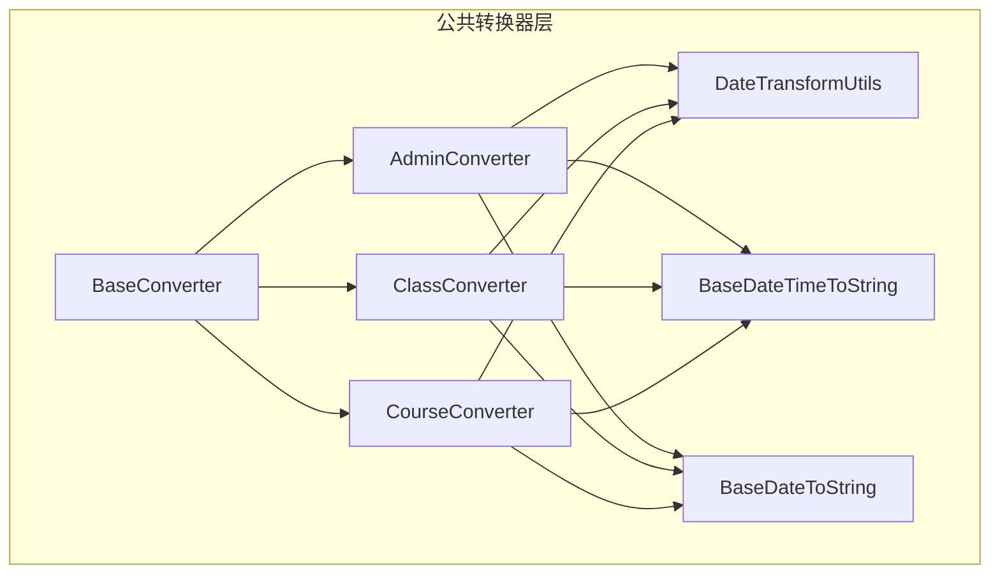
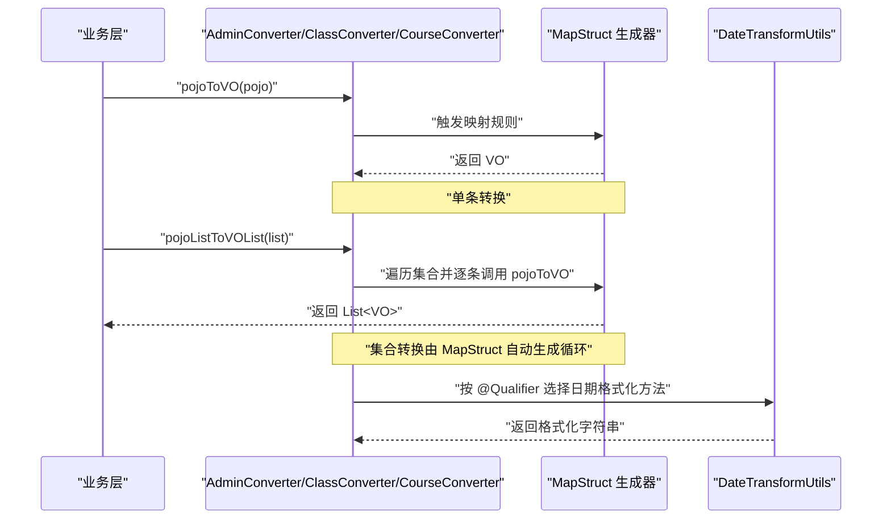
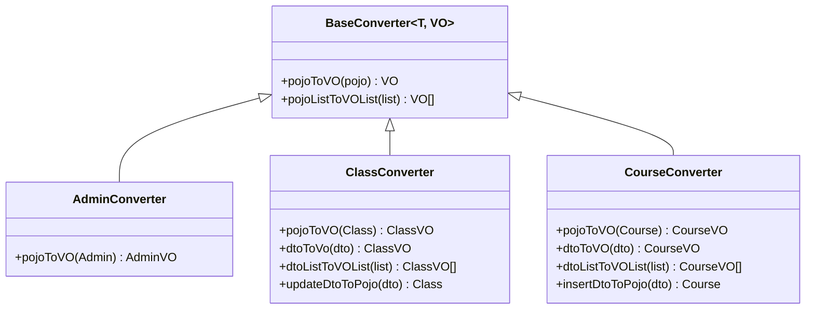
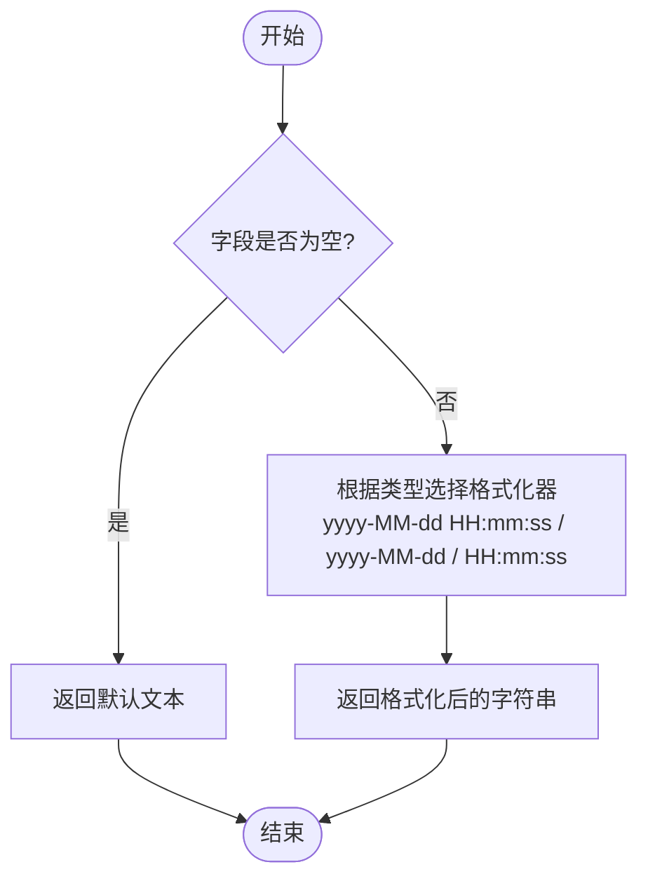
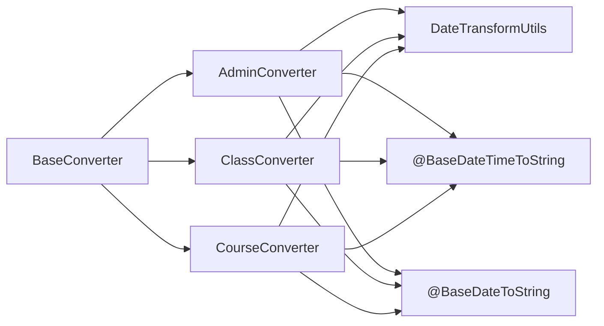

# 基础转换器接口设计

<cite>
**本文引用的文件**   
- [BaseConverter.java](file://class_times_record_back/common/src/main/java/com/shiroko/converter/BaseConverter.java)
- [AdminConverter.java](file://class_times_record_back/common/src/main/java/com/shiroko/converter/AdminConverter.java)
- [ClassConverter.java](file://class_times_record_back/common/src/main/java/com/shiroko/converter/ClassConverter.java)
- [CourseConverter.java](file://class_times_record_back/common/src/main/java/com/shiroko/converter/CourseConverter.java)
- [DateTransformUtils.java](file://class_times_record_back/common/src/main/java/com/shiroko/util/DateTransformUtils.java)
- [BaseDateTimeToString.java](file://class_times_record_back/common/src/main/java/com/shiroko/annotation/BaseDateTimeToString.java)
- [BaseDateToString.java](file://class_times_record_back/common/src/main/java/com/shiroko/annotation/BaseDateToString.java)
</cite>

## 目录
1. [简介](#简介)
2. [项目结构](#项目结构)
3. [核心组件](#核心组件)
4. [架构总览](#架构总览)
5. [详细组件分析](#详细组件分析)
6. [依赖关系分析](#依赖关系分析)
7. [性能考量](#性能考量)
8. [故障排查指南](#故障排查指南)
9. [结论](#结论)
10. [附录](#附录)

## 简介
本文件围绕“基础转换器接口”进行系统化说明，重点阐述 BaseConverter 接口的设计理念与泛型定义，解释 pojoToVO 与 pojoListToVOList 方法的作用、使用场景以及 MapStruct 自动实现集合转换的原理与性能优势。同时提供接口使用示例、最佳实践与扩展指南，帮助开发者快速理解并高效使用基础转换器。

## 项目结构
本项目在后端公共模块 common 中定义了统一的转换器基座：
- 基础接口：BaseConverter<T, VO>
- 领域转换器：如 AdminConverter、ClassConverter、CourseConverter 等，均继承自 BaseConverter
- 自定义限定符与工具：BaseDateTimeToString、BaseDateToString、DateTransformUtils 用于日期格式化映射

图表来源
- [BaseConverter.java:1-19](file://class_times_record_back/common/src/main/java/com/shiroko/converter/BaseConverter.java#L1-L19)
- [AdminConverter.java:1-25](file://class_times_record_back/common/src/main/java/com/shiroko/converter/AdminConverter.java#L1-L25)
- [ClassConverter.java:1-33](file://class_times_record_back/common/src/main/java/com/shiroko/converter/ClassConverter.java#L1-L33)
- [CourseConverter.java:1-34](file://class_times_record_back/common/src/main/java/com/shiroko/converter/CourseConverter.java#L1-L34)
- [DateTransformUtils.java:1-58](file://class_times_record_back/common/src/main/java/com/shiroko/util/DateTransformUtils.java#L1-L58)
- [BaseDateTimeToString.java:1-22](file://class_times_record_back/common/src/main/java/com/shiroko/annotation/BaseDateTimeToString.java#L1-L22)
- [BaseDateToString.java:1-22](file://class_times_record_back/common/src/main/java/com/shiroko/annotation/BaseDateToString.java#L1-L22)

章节来源
- [BaseConverter.java:1-19](file://class_times_record_back/common/src/main/java/com/shiroko/converter/BaseConverter.java#L1-L19)
- [AdminConverter.java:1-25](file://class_times_record_back/common/src/main/java/com/shiroko/converter/AdminConverter.java#L1-L25)
- [ClassConverter.java:1-33](file://class_times_record_back/common/src/main/java/com/shiroko/converter/ClassConverter.java#L1-L33)
- [CourseConverter.java:1-34](file://class_times_record_back/common/src/main/java/com/shiroko/converter/CourseConverter.java#L1-L34)
- [DateTransformUtils.java:1-58](file://class_times_record_back/common/src/main/java/com/shiroko/util/DateTransformUtils.java#L1-L58)
- [BaseDateTimeToString.java:1-22](file://class_times_record_back/common/src/main/java/com/shiroko/annotation/BaseDateTimeToString.java#L1-L22)
- [BaseDateToString.java:1-22](file://class_times_record_back/common/src/main/java/com/shiroko/annotation/BaseDateToString.java#L1-L22)

## 核心组件
- BaseConverter<T, VO>
  - 设计理念：以泛型统一 POJO（持久化对象）到 VO（视图对象）的转换契约，屏蔽具体类型差异，提升复用性与可维护性。
  - 关键方法：
    - pojoToVO(T pojo)：单条记录转换
    - pojoListToVOList(List<T> pojoList)：集合批量转换（由 MapStruct 自动生成实现）
- 领域转换器（示例）
  - AdminConverter、ClassConverter、CourseConverter 等通过 @Mapper(componentModel = "spring") 声明为 Spring Bean，并继承 BaseConverter，获得 pojoToVO 与 pojoListToVOList 的能力。
  - 通过 @Mapping 与自定义限定符将复杂字段（如时间）交由 DateTransformUtils 处理。

章节来源
- [BaseConverter.java:1-19](file://class_times_record_back/common/src/main/java/com/shiroko/converter/BaseConverter.java#L1-L19)
- [AdminConverter.java:1-25](file://class_times_record_back/common/src/main/java/com/shiroko/converter/AdminConverter.java#L1-L25)
- [ClassConverter.java:1-33](file://class_times_record_back/common/src/main/java/com/shiroko/converter/ClassConverter.java#L1-L33)
- [CourseConverter.java:1-34](file://class_times_record_back/common/src/main/java/com/shiroko/converter/CourseConverter.java#L1-L34)

## 架构总览
下图展示了从业务层调用转换器到 MapStruct 生成实现的端到端流程，包括集合转换路径与自定义日期转换的协作方式。

图表来源
- [BaseConverter.java:1-19](file://class_times_record_back/common/src/main/java/com/shiroko/converter/BaseConverter.java#L1-L19)
- [AdminConverter.java:1-25](file://class_times_record_back/common/src/main/java/com/shiroko/converter/AdminConverter.java#L1-L25)
- [ClassConverter.java:1-33](file://class_times_record_back/common/src/main/java/com/shiroko/converter/ClassConverter.java#L1-L33)
- [CourseConverter.java:1-34](file://class_times_record_back/common/src/main/java/com/shiroko/converter/CourseConverter.java#L1-L34)
- [DateTransformUtils.java:1-58](file://class_times_record_back/common/src/main/java/com/shiroko/util/DateTransformUtils.java#L1-L58)
- [BaseDateTimeToString.java:1-22](file://class_times_record_back/common/src/main/java/com/shiroko/annotation/BaseDateTimeToString.java#L1-L22)
- [BaseDateToString.java:1-22](file://class_times_record_back/common/src/main/java/com/shiroko/annotation/BaseDateToString.java#L1-L22)

## 详细组件分析

### BaseConverter 接口设计
- 泛型参数
  - T：源对象类型（POJO/DTO）
  - VO：目标对象类型（视图对象）
- 方法职责
  - pojoToVO：完成一次对象到对象的属性映射
  - pojoListToVOList：对集合中的每个元素执行 pojoToVO，返回新的列表
- 设计收益
  - 统一契约：所有实体转换器遵循相同 API，便于注入与替换
  - 可扩展：新增实体只需实现对应 Converter 即可复用集合转换能力
  - 可测试：接口抽象利于单元测试与 Mock

章节来源
- [BaseConverter.java:1-19](file://class_times_record_back/common/src/main/java/com/shiroko/converter/BaseConverter.java#L1-L19)

### 领域转换器示例与用法
- AdminConverter
  - 继承 BaseConverter<Admin, AdminVO>
  - 使用 @Mapping 与 @BaseDateTimeToString 将时间字段转换为字符串展示字段
- ClassConverter
  - 继承 BaseConverter<Class, ClassVO>
  - 除 pojoToVO 外，还提供 DTO 到 VO 的额外映射方法，体现同一转换器可承载多种映射职责
- CourseConverter
  - 继承 BaseConverter<Course, CourseVO>
  - uses 中包含其他转换器与工具类，体现组合映射能力

图表来源
- [BaseConverter.java:1-19](file://class_times_record_back/common/src/main/java/com/shiroko/converter/BaseConverter.java#L1-L19)
- [AdminConverter.java:1-25](file://class_times_record_back/common/src/main/java/com/shiroko/converter/AdminConverter.java#L1-L25)
- [ClassConverter.java:1-33](file://class_times_record_back/common/src/main/java/com/shiroko/converter/ClassConverter.java#L1-L33)
- [CourseConverter.java:1-34](file://class_times_record_back/common/src/main/java/com/shiroko/converter/CourseConverter.java#L1-L34)

章节来源
- [AdminConverter.java:1-25](file://class_times_record_back/common/src/main/java/com/shiroko/converter/AdminConverter.java#L1-L25)
- [ClassConverter.java:1-33](file://class_times_record_back/common/src/main/java/com/shiroko/converter/ClassConverter.java#L1-L33)
- [CourseConverter.java:1-34](file://class_times_record_back/common/src/main/java/com/shiroko/converter/CourseConverter.java#L1-L34)

### MapStruct 自动实现集合转换原理与性能优势
- 自动实现
  - 在 BaseConverter 中声明 pojoListToVOList 后，MapStruct 会在编译期生成实现类，内部对输入集合进行遍历，并对每个元素调用 pojoToVO，最终组装为结果列表。
- 性能优势
  - 零反射：MapStruct 生成的是普通 Java 代码，避免运行时反射开销
  - 内联优化：编译器可对生成的赋值语句进行优化，减少中间对象创建
  - 可预测行为：映射逻辑在编译期确定，运行时无歧义，易于定位问题
- 适用场景
  - 列表分页查询返回 VO 集合
  - 批量导出/导入时的对象转换
  - 跨层传递时统一的数据形态

章节来源
- [BaseConverter.java:1-19](file://class_times_record_back/common/src/main/java/com/shiroko/converter/BaseConverter.java#L1-L19)

### 自定义日期转换与限定符
- 限定符注解
  - BaseDateTimeToString、BaseDateToString 作为 MapStruct 的 @Qualifier，用于精确匹配目标字段的转换策略
- 工具类
  - DateTransformUtils 提供 LocalDateTime、LocalTime、LocalDate 的格式化方法，并在空值时返回友好提示
- 使用方式
  - 在 @Mapping 中通过 qualifiedBy 指定限定符，使 MapStruct 在生成代码时调用对应的工具方法

图表来源
- [DateTransformUtils.java:1-58](file://class_times_record_back/common/src/main/java/com/shiroko/util/DateTransformUtils.java#L1-L58)
- [BaseDateTimeToString.java:1-22](file://class_times_record_back/common/src/main/java/com/shiroko/annotation/BaseDateTimeToString.java#L1-L22)
- [BaseDateToString.java:1-22](file://class_times_record_back/common/src/main/java/com/shiroko/annotation/BaseDateToString.java#L1-L22)

章节来源
- [DateTransformUtils.java:1-58](file://class_times_record_back/common/src/main/java/com/shiroko/util/DateTransformUtils.java#L1-L58)
- [BaseDateTimeToString.java:1-22](file://class_times_record_back/common/src/main/java/com/shiroko/annotation/BaseDateTimeToString.java#L1-L22)
- [BaseDateToString.java:1-22](file://class_times_record_back/common/src/main/java/com/shiroko/annotation/BaseDateToString.java#L1-L22)

## 依赖关系分析
- 组件耦合
  - 领域转换器强依赖 BaseConverter 提供的统一 API
  - 转换器通过 @Mapper(uses = {...}) 声明依赖的工具或子转换器，形成清晰的组合关系
- 外部依赖
  - MapStruct 注解处理器在编译期生成实现类
  - Spring 容器管理转换器实例（componentModel = "spring"）

图表来源
- [BaseConverter.java:1-19](file://class_times_record_back/common/src/main/java/com/shiroko/converter/BaseConverter.java#L1-L19)
- [AdminConverter.java:1-25](file://class_times_record_back/common/src/main/java/com/shiroko/converter/AdminConverter.java#L1-L25)
- [ClassConverter.java:1-33](file://class_times_record_back/common/src/main/java/com/shiroko/converter/ClassConverter.java#L1-L33)
- [CourseConverter.java:1-34](file://class_times_record_back/common/src/main/java/com/shiroko/converter/CourseConverter.java#L1-L34)
- [DateTransformUtils.java:1-58](file://class_times_record_back/common/src/main/java/com/shiroko/util/DateTransformUtils.java#L1-L58)
- [BaseDateTimeToString.java:1-22](file://class_times_record_back/common/src/main/java/com/shiroko/annotation/BaseDateTimeToString.java#L1-L22)
- [BaseDateToString.java:1-22](file://class_times_record_back/common/src/main/java/com/shiroko/annotation/BaseDateToString.java#L1-L22)

章节来源
- [BaseConverter.java:1-19](file://class_times_record_back/common/src/main/java/com/shiroko/converter/BaseConverter.java#L1-L19)
- [AdminConverter.java:1-25](file://class_times_record_back/common/src/main/java/com/shiroko/converter/AdminConverter.java#L1-L25)
- [ClassConverter.java:1-33](file://class_times_record_back/common/src/main/java/com/shiroko/converter/ClassConverter.java#L1-L33)
- [CourseConverter.java:1-34](file://class_times_record_back/common/src/main/java/com/shiroko/converter/CourseConverter.java#L1-L34)

## 性能考量
- 集合转换
  - 优先使用 pojoListToVOList，避免手写循环，降低出错概率并获得 MapStruct 生成的最优循环实现
- 字段映射
  - 尽量保持源与目标字段名一致，减少 @Mapping 配置，提高可读性与生成效率
- 自定义转换
  - 将复杂转换封装至工具类并通过 @Qualifier 引入，避免在转换器中散落条件分支
- 内存与 GC
  - 大列表转换时注意分批处理，避免一次性创建过多中间对象

[本节为通用指导，不直接分析具体文件]

## 故障排查指南
- 未生成实现类
  - 检查是否启用 MapStruct 注解处理器，确认 @Mapper 与 componentModel 配置正确
- 字段映射失败或为空
  - 核对 @Mapping 的 source/target 名称与类型；必要时添加 @Qualifier 指向正确的工具方法
- 日期格式不符合预期
  - 确认使用的限定符与工具方法一一对应；检查空值处理是否符合期望
- 集合转换结果为空
  - 检查输入集合是否为 null；确认 pojoListToVOList 的实现由 MapStruct 生成且未被覆盖

章节来源
- [AdminConverter.java:1-25](file://class_times_record_back/common/src/main/java/com/shiroko/converter/AdminConverter.java#L1-L25)
- [ClassConverter.java:1-33](file://class_times_record_back/common/src/main/java/com/shiroko/converter/ClassConverter.java#L1-L33)
- [CourseConverter.java:1-34](file://class_times_record_back/common/src/main/java/com/shiroko/converter/CourseConverter.java#L1-L34)
- [DateTransformUtils.java:1-58](file://class_times_record_back/common/src/main/java/com/shiroko/util/DateTransformUtils.java#L1-L58)

## 结论
BaseConverter 以简洁的泛型接口统一了 POJO 到 VO 的转换契约，配合 MapStruct 的编译期代码生成，既保证了高性能又提升了可维护性。通过限定符与工具类的解耦，复杂字段（如日期）的转换策略清晰可控。建议在新实体接入时优先继承 BaseConverter，复用集合转换能力，并将特殊映射收敛到工具类与限定符中，从而构建稳定、易扩展的转换器体系。

[本节为总结性内容，不直接分析具体文件]

## 附录
- 使用示例（步骤式）
  - 定义实体与视图对象
  - 新建转换器接口，继承 BaseConverter<实体, 视图>
  - 使用 @Mapper(componentModel = "spring", uses = {...}) 声明依赖
  - 在需要处注入转换器，调用 pojoToVO 与 pojoListToVOList
- 最佳实践
  - 单一职责：一个转换器聚焦一个实体的映射
  - 命名规范：字段名保持一致，减少显式映射
  - 可测试性：针对 pojoToVO 编写单元测试，验证边界与空值
- 扩展指南
  - 新增实体：复制现有转换器模板，调整泛型与 @Mapping
  - 新增限定符：在 annotation 包下新增 @Qualifier 注解，并在工具类中实现对应方法
  - 组合映射：在 @Mapper(uses = {...}) 中引入其他转换器，实现嵌套对象转换

[本节为概念性指导，不直接分析具体文件]