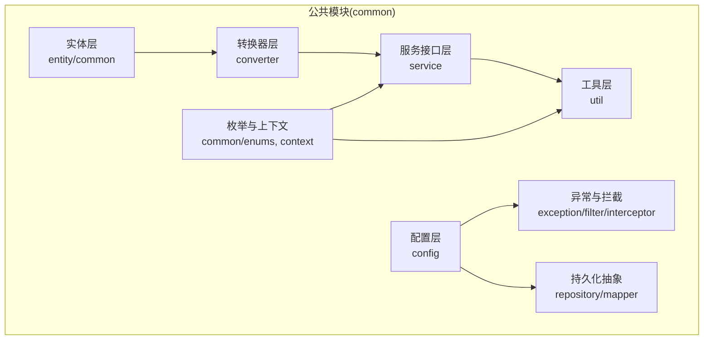
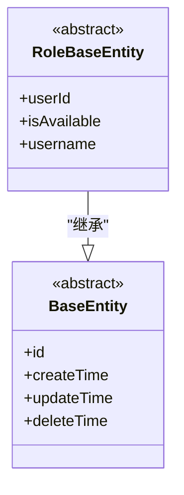
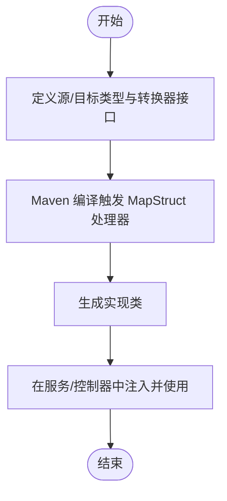
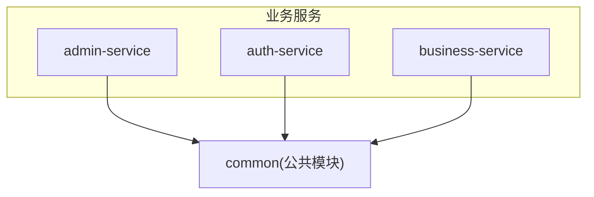
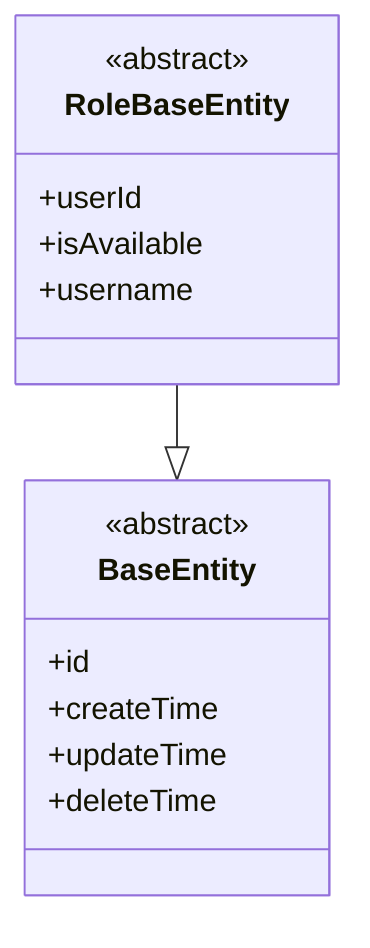
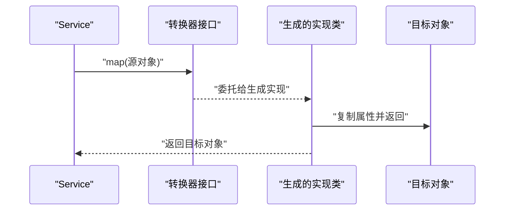
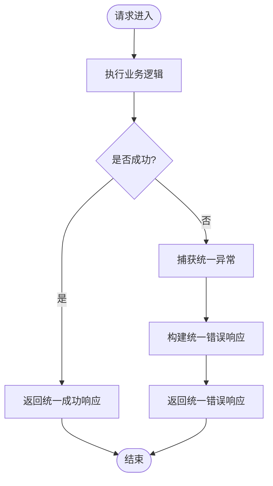
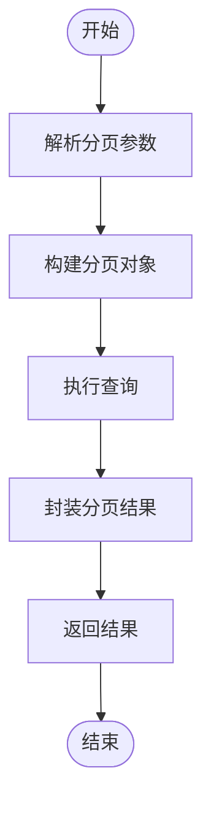

# 公共模块 (common)

<cite>
**本文引用的文件**
- [pom.xml](file://class_times_record_back/common/pom.xml)
- [BaseEntity.java](file://class_times_record_back/common/src/main/java/com/shiroko/repository/entity/common/BaseEntity.java)
- [RoleBaseEntity.java](file://class_times_record_back/common/src/main/java/com/shiroko/repository/entity/common/RoleBaseEntity.java)
</cite>

## 目录
1. [简介](#简介)
2. [项目结构](#项目结构)
3. [核心组件](#核心组件)
4. [架构总览](#架构总览)
5. [详细组件分析](#详细组件分析)
6. [依赖分析](#依赖分析)
7. [性能考虑](#性能考虑)
8. [故障排查指南](#故障排查指南)
9. [结论](#结论)
10. [附录](#附录)

## 简介
本章节面向开发者，系统化梳理后端公共模块（common）的设计与实现。该模块作为多服务共享的基础库，提供实体基类、通用注解、转换器、工具类、异常处理、统一响应、分页封装等基础设施能力，旨在降低业务服务重复建设成本、提升一致性与可维护性。

## 项目结构
common 模块采用分层组织方式，围绕“实体—转换—服务接口—工具—配置”展开：
- 实体层：定义跨领域复用的基础实体与角色相关实体
- 转换器层：基于 MapStruct 的 DTO/VO 与实体映射
- 服务接口层：定义跨服务通用的服务契约
- 工具层：通用工具方法集合
- 配置层：Web、MyBatis-Plus、Redis、OpenAPI 等通用配置
- 异常与拦截：统一异常处理、请求拦截器、过滤器等

[本图为概念结构示意，不直接映射具体源码文件]

## 核心组件
本节聚焦公共模块的关键构件，包括共享实体、DTO/VO 转换机制、工具类、服务接口、统一异常与响应、分页查询封装等。

### 共享实体设计
- BaseEntity：所有实体的根抽象类，用于承载 id、创建时间、更新时间、删除时间等公共字段。通过继承确保各实体具备一致的审计与软删除语义。
- RoleBaseEntity：角色相关实体的基础类，扩展 user_id、是否可用、用户名等通用字段，配合 MyBatis-Plus 注解完成字段映射。

图表来源
- [BaseEntity.java:1-18](file://class_times_record_back/common/src/main/java/com/shiroko/repository/entity/common/BaseEntity.java#L1-L18)
- [RoleBaseEntity.java:1-47](file://class_times_record_back/common/src/main/java/com/shiroko/repository/entity/common/RoleBaseEntity.java#L1-L47)

章节来源
- [BaseEntity.java:1-18](file://class_times_record_back/common/src/main/java/com/shiroko/repository/entity/common/BaseEntity.java#L1-L18)
- [RoleBaseEntity.java:1-47](file://class_times_record_back/common/src/main/java/com/shiroko/repository/entity/common/RoleBaseEntity.java#L1-L47)

### DTO/VO 转换机制（MapStruct）
- 使用 MapStruct 在编译期生成类型安全的对象映射代码，避免手写繁琐的 getter/setter 转换逻辑。
- common 模块中集中管理转换器，便于在多服务间复用并统一命名规范。
- 典型用法：定义源类型与目标类型的 Converter 接口，声明 map() 方法；由编译器生成实现类，注入到 Service 或 Controller 中使用。

[本图为概念流程示意，不直接映射具体源码文件]

### 工具类库
- 常见能力：加密解密、日期格式化、字符串处理、ID 生成、校验辅助等。
- 建议将无状态、幂等的工具方法集中在 util 包下，保持纯函数风格，便于测试与复用。

[本节为通用指导，不直接分析具体文件]

### 服务接口定义
- 在 service 包中定义跨服务复用的接口契约，如用户、权限、菜单、日志等通用服务能力。
- 接口仅暴露必要方法，参数与返回类型尽量使用 DTO/VO，屏蔽底层实现细节。

[本节为通用指导，不直接分析具体文件]

### 统一异常处理与响应格式
- 统一异常：自定义业务异常类型，结合全局异常处理器捕获并转换为标准错误响应。
- 统一响应：定义统一的响应包装结构（如 code、message、data），保证前后端交互一致性。
- 建议在 common 中提供响应构造器与错误码枚举，供各服务引用。

[本节为通用指导，不直接分析具体文件]

### 分页查询封装
- 基于 MyBatis-Plus 的分页能力，在 common 中封装分页查询入口，统一入参（页码、每页条数、排序）、出参（数据列表、总数、页信息）。
- 提供默认排序策略与空结果处理，减少业务服务重复代码。

[本节为通用指导，不直接分析具体文件]

## 架构总览
common 模块作为多服务共享的基础设施，被 admin-service、auth-service、business-service 等消费。其职责边界清晰：仅提供稳定、低耦合、高内聚的通用能力。

[本图为概念结构示意，不直接映射具体源码文件]

## 详细组件分析

### 实体设计规范与注解使用模式
- 命名约定：实体类以名词命名，单数形式；字段遵循驼峰命名，数据库列名通过注解映射。
- 公共字段：通过 BaseEntity 抽象类统一引入 id、审计字段、软删除字段，子类无需重复定义。
- 角色实体：RoleBaseEntity 扩展 user_id、可用性、用户名等字段，配合 @TableField 指定列名，增强可读性与可移植性。

图表来源
- [BaseEntity.java:1-18](file://class_times_record_back/common/src/main/java/com/shiroko/repository/entity/common/BaseEntity.java#L1-L18)
- [RoleBaseEntity.java:1-47](file://class_times_record_back/common/src/main/java/com/shiroko/repository/entity/common/RoleBaseEntity.java#L1-L47)

章节来源
- [BaseEntity.java:1-18](file://class_times_record_back/common/src/main/java/com/shiroko/repository/entity/common/BaseEntity.java#L1-L18)
- [RoleBaseEntity.java:1-47](file://class_times_record_back/common/src/main/java/com/shiroko/repository/entity/common/RoleBaseEntity.java#L1-L47)

### MapStruct 转换器工作原理与使用方法
- 工作原理：在编译期扫描转换器接口，根据方法签名自动生成实现类，将源对象属性复制到目标对象，支持复杂类型映射与自定义规则。
- 使用方法：
  - 定义转换器接口，声明 map() 方法
  - 在 Service 或 Controller 中注入转换器实例
  - 调用 map() 进行对象转换
- 优势：零运行时反射开销、类型安全、IDE 友好、易于重构与维护

[本图为概念流程示意，不直接映射具体源码文件]

### 通用异常处理流程
- 流程要点：
  - 业务抛出统一异常
  - 全局异常处理器捕获并解析错误码与消息
  - 组装统一响应体返回客户端
- 好处：前端可统一处理错误提示与跳转，后端可集中记录日志与监控指标

[本图为概念流程示意，不直接映射具体源码文件]

### 分页查询封装流程
- 流程要点：
  - 接收分页参数（页码、每页大小、排序字段）
  - 构建分页对象并执行查询
  - 封装结果（数据、总数、页信息）返回
- 好处：统一分页行为，简化业务服务开发

[本图为概念流程示意，不直接映射具体源码文件]

## 依赖分析
common 模块依赖 Spring Boot Web、AOP、MyBatis-Plus、MySQL 驱动、JWT、Fastjson2、MapStruct、Hutool、Hashids、Hibernate Validator、SpringDoc OpenAPI、Redis、Lettuce 连接池等。这些依赖为实体映射、对象转换、鉴权、序列化、文档、缓存等能力提供支撑。

```mermaid
graph TB
Common["common 模块"]
Web["spring-boot-starter-web"]
AOP["spring-boot-starter-aspectj"]
MP["mybatis-plus-spring-boot4-starter"]
MySQL["mysql-connector-j"]
JWT["jjwt-api/impl/jackson"]
JSON["fastjson2"]
MS["mapstruct/mapstruct-processor"]
BC["bcprov-jdk18on"]
HU["hutool-all"]
HID["hashids"]
HV["hibernate-validator"]
DOC["springdoc-openapi-starter-webmvc-ui"]
REDIS["spring-boot-starter-data-redis"]
POOL["commons-pool2"]
Common --> Web
Common --> AOP
Common --> MP
Common --> MySQL
Common --> JWT
Common --> JSON
Common --> MS
Common --> BC
Common --> HU
Common --> HID
Common --> HV
Common --> DOC
Common --> REDIS
Common --> POOL
```

图表来源
- [pom.xml:18-115](file://class_times_record_back/common/pom.xml#L18-L115)

章节来源
- [pom.xml:18-115](file://class_times_record_back/common/pom.xml#L18-L115)

## 性能考虑
- 对象转换：优先使用 MapStruct 编译期生成实现，避免运行时反射带来的性能损耗。
- 分页查询：合理设置默认每页大小上限，避免一次性加载过多数据；对高频查询增加索引与缓存。
- 序列化：统一使用 Fastjson2 或 Jackson，避免混用导致额外开销。
- 缓存：利用 Redis 缓存热点数据（如字典、菜单、用户信息），注意过期策略与一致性。

[本节为通用指导，不直接分析具体文件]

## 故障排查指南
- 编译期问题：若 MapStruct 未生成实现类，检查 Maven 编译插件与注解处理器路径是否正确。
- 字段映射不一致：确认实体字段与数据库列名映射注解正确，必要时在转换器中显式声明字段映射。
- 分页异常：检查分页参数合法性（页码、每页大小），确认排序字段是否存在且受允许。
- 统一异常未生效：确认全局异常处理器已启用，且业务抛出的异常类型被正确捕获。

[本节为通用指导，不直接分析具体文件]

## 结论
common 模块通过标准化实体基类、统一的 DTO/VO 转换机制、完善的工具与配置、以及一致的异常与分页封装，显著提升了多服务间的复用度与一致性。建议在新功能开发时优先复用 common 中的能力，并在需要扩展时遵循现有约定，以保持整体架构的整洁与可演进性。

[本节为总结性内容，不直接分析具体文件]

## 附录
- 最佳实践
  - 新增实体时继承 BaseEntity，仅在子类补充领域特有字段
  - 角色相关实体继承 RoleBaseEntity，并通过 @TableField 明确列映射
  - 新增转换器时遵循单一职责，按领域划分转换器接口
  - 统一异常与响应在 common 中定义，业务服务仅做调用
  - 分页查询在 common 中封装，业务服务传入条件即可

[本节为通用指导，不直接分析具体文件]