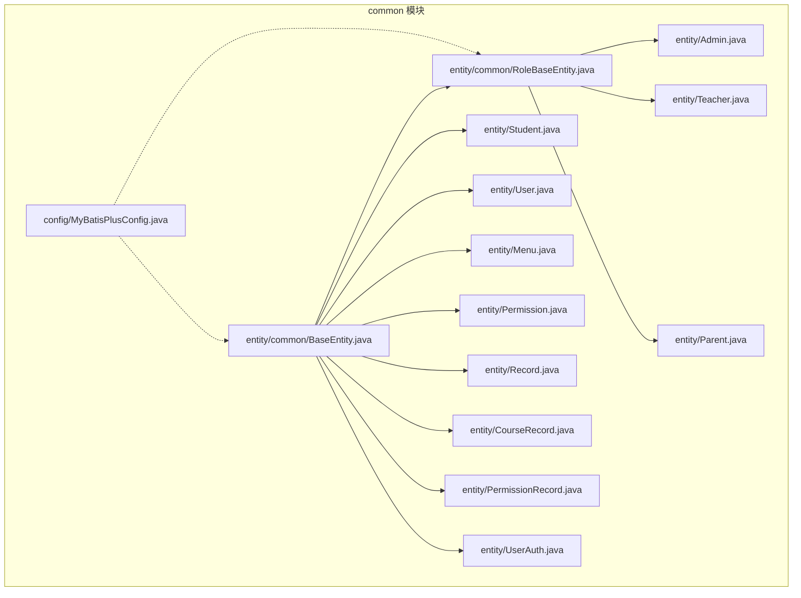
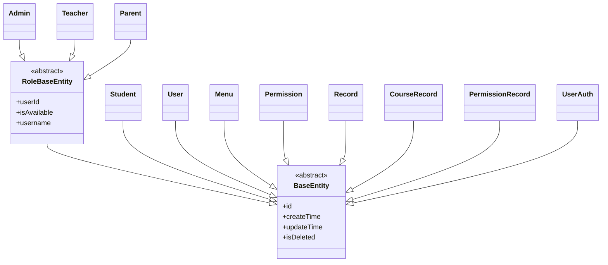
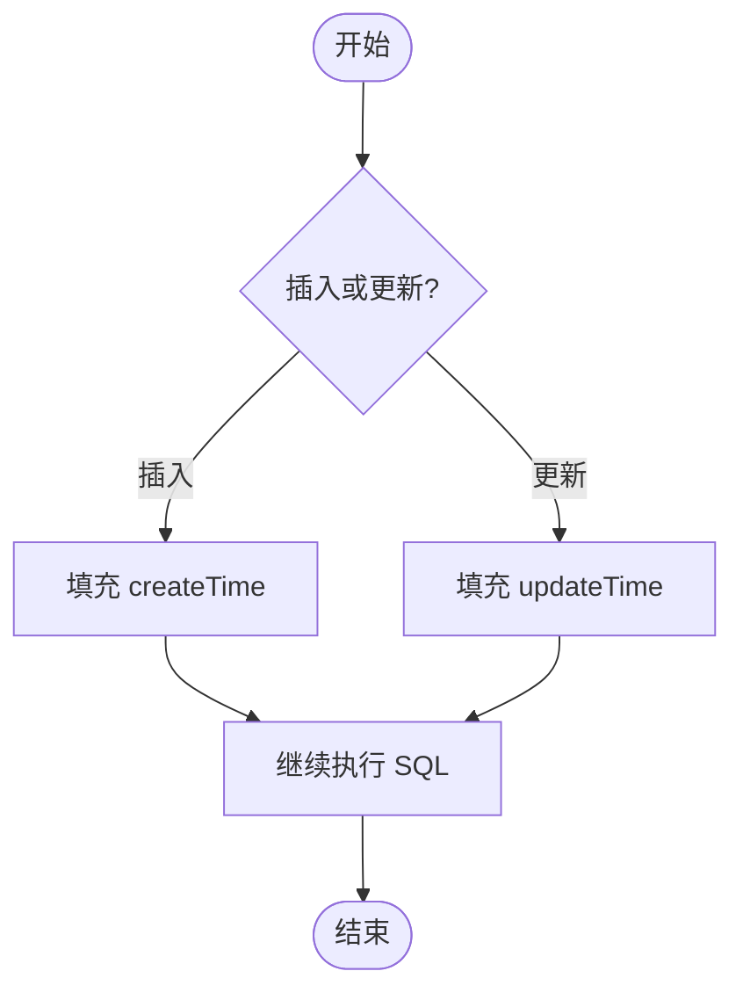
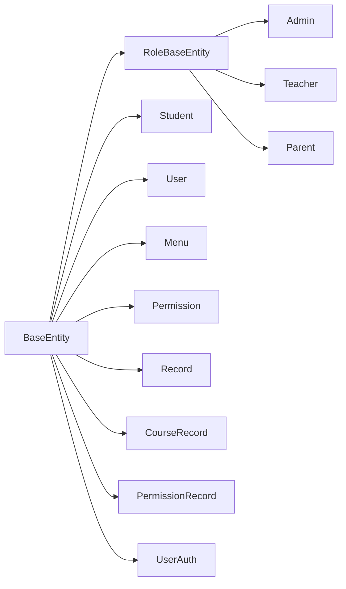

# 实体设计规范

<cite>
**本文引用的文件**   
- [BaseEntity.java](file://class_times_record_back/common/src/main/java/com/shiroko/repository/entity/common/BaseEntity.java)
- [RoleBaseEntity.java](file://class_times_record_back/common/src/main/java/com/shiroko/repository/entity/common/RoleBaseEntity.java)
- [MyBatisPlusConfig.java](file://class_times_record_back/common/src/main/java/com/shiroko/config/MyBatisPlusConfig.java)
- [Admin.java](file://class_times_record_back/common/src/main/java/com/shiroko/repository/entity/Admin.java)
- [CourseRecord.java](file://class_times_record_back/common/src/main/java/com/shiroko/repository/entity/CourseRecord.java)
- [Menu.java](file://class_times_record_back/common/src/main/java/com/shiroko/repository/entity/Menu.java)
- [Parent.java](file://class_times_record_back/common/src/main/java/com/shiroko/repository/entity/Parent.java)
- [Permission.java](file://class_times_record_back/common/src/main/java/com/shiroko/repository/entity/Permission.java)
- [PermissionRecord.java](file://class_times_record_back/common/src/main/java/com/shiroko/repository/entity/PermissionRecord.java)
- [Record.java](file://class_times_record_back/common/src/main/java/com/shiroko/repository/entity/Record.java)
- [Student.java](file://class_times_record_back/common/src/main/java/com/shiroko/repository/entity/Student.java)
- [Teacher.java](file://class_times_record_back/common/src/main/java/com/shiroko/repository/entity/Teacher.java)
- [User.java](file://class_times_record_back/common/src/main/java/com/shiroko/repository/entity/User.java)
- [UserAuth.java](file://class_times_record_back/common/src/main/java/com/shiroko/repository/entity/UserAuth.java)
</cite>

## 目录
1. [引言](#引言)
2. [项目结构](#项目结构)
3. [核心组件](#核心组件)
4. [架构总览](#架构总览)
5. [详细组件分析](#详细组件分析)
6. [依赖分析](#依赖分析)
7. [性能考虑](#性能考虑)
8. [故障排查指南](#故障排查指南)
9. [结论](#结论)
10. [附录：新实体创建清单](#附录新实体创建清单)

## 引言
本规范聚焦于后端通用实体基类与角色基类的设计与使用，明确通用字段、注解约定、继承体系与扩展方式，帮助开发者快速、一致地定义新的业务实体。文档同时给出数据库映射配置要点、字段命名与数据类型选择原则，并提供可操作的“新实体创建清单”。

## 项目结构
本项目采用多模块结构，实体定义集中在 common 模块的 repository.entity 包下，并通过抽象基类统一公共能力；MyBatis-Plus 相关配置位于 config 包中。

图表来源
- [MyBatisPlusConfig.java:1-65](file://class_times_record_back/common/src/main/java/com/shiroko/config/MyBatisPlusConfig.java#L1-L65)
- [BaseEntity.java:1-18](file://class_times_record_back/common/src/main/java/com/shiroko/repository/entity/common/BaseEntity.java#L1-L18)
- [RoleBaseEntity.java:1-47](file://class_times_record_back/common/src/main/java/com/shiroko/repository/entity/common/RoleBaseEntity.java#L1-L47)
- [Admin.java:1-50](file://class_times_record_back/common/src/main/java/com/shiroko/repository/entity/Admin.java#L1-L50)
- [Teacher.java:1-50](file://class_times_record_back/common/src/main/java/com/shiroko/repository/entity/Teacher.java#L1-L50)
- [Parent.java:1-50](file://class_times_record_back/common/src/main/java/com/shiroko/repository/entity/Parent.java#L1-L50)
- [Student.java:1-50](file://class_times_record_back/common/src/main/java/com/shiroko/repository/entity/Student.java#L1-L50)
- [User.java:1-50](file://class_times_record_back/common/src/main/java/com/shiroko/repository/entity/User.java#L1-L50)
- [Menu.java:1-50](file://class_times_record_back/common/src/main/java/com/shiroko/repository/entity/Menu.java#L1-L50)
- [Permission.java:1-50](file://class_times_record_back/common/src/main/java/com/shiroko/repository/entity/Permission.java#L1-L50)
- [Record.java:1-50](file://class_times_record_back/common/src/main/java/com/shiroko/repository/entity/Record.java#L1-L50)
- [CourseRecord.java:1-80](file://class_times_record_back/common/src/main/java/com/shiroko/repository/entity/CourseRecord.java#L1-L80)
- [PermissionRecord.java:1-50](file://class_times_record_back/common/src/main/java/com/shiroko/repository/entity/PermissionRecord.java#L1-L50)
- [UserAuth.java:1-50](file://class_times_record_back/common/src/main/java/com/shiroko/repository/entity/UserAuth.java#L1-L50)

章节来源
- [MyBatisPlusConfig.java:1-65](file://class_times_record_back/common/src/main/java/com/shiroko/config/MyBatisPlusConfig.java#L1-L65)
- [BaseEntity.java:1-18](file://class_times_record_back/common/src/main/java/com/shiroko/repository/entity/common/BaseEntity.java#L1-L18)
- [RoleBaseEntity.java:1-47](file://class_times_record_back/common/src/main/java/com/shiroko/repository/entity/common/RoleBaseEntity.java#L1-L47)

## 核心组件
- BaseEntity：所有实体的根抽象类，用于承载后续统一的通用字段与行为（如 id、审计时间、逻辑删除等）。当前为骨架实现，预留扩展点。
- RoleBaseEntity：面向“角色型”实体的基础类，继承自 BaseEntity，并补充与用户关联及角色表通用字段（user_id、is_available、username），便于在权限体系中复用。

章节来源
- [BaseEntity.java:1-18](file://class_times_record_back/common/src/main/java/com/shiroko/repository/entity/common/BaseEntity.java#L1-L18)
- [RoleBaseEntity.java:1-47](file://class_times_record_back/common/src/main/java/com/shiroko/repository/entity/common/RoleBaseEntity.java#L1-L47)

## 架构总览
下图展示实体继承关系与典型用法：普通实体继承 BaseEntity，角色型实体继承 RoleBaseEntity；MyBatis-Plus 配置提供分页、乐观锁与可选的自动填充能力。

图表来源
- [BaseEntity.java:1-18](file://class_times_record_back/common/src/main/java/com/shiroko/repository/entity/common/BaseEntity.java#L1-L18)
- [RoleBaseEntity.java:1-47](file://class_times_record_back/common/src/main/java/com/shiroko/repository/entity/common/RoleBaseEntity.java#L1-L47)
- [Admin.java:1-50](file://class_times_record_back/common/src/main/java/com/shiroko/repository/entity/Admin.java#L1-L50)
- [Teacher.java:1-50](file://class_times_record_back/common/src/main/java/com/shiroko/repository/entity/Teacher.java#L1-L50)
- [Parent.java:1-50](file://class_times_record_back/common/src/main/java/com/shiroko/repository/entity/Parent.java#L1-L50)
- [Student.java:1-50](file://class_times_record_back/common/src/main/java/com/shiroko/repository/entity/Student.java#L1-L50)
- [User.java:1-50](file://class_times_record_back/common/src/main/java/com/shiroko/repository/entity/User.java#L1-L50)
- [Menu.java:1-50](file://class_times_record_back/common/src/main/java/com/shiroko/repository/entity/Menu.java#L1-L50)
- [Permission.java:1-50](file://class_times_record_back/common/src/main/java/com/shiroko/repository/entity/Permission.java#L1-L50)
- [Record.java:1-50](file://class_times_record_back/common/src/main/java/com/shiroko/repository/entity/Record.java#L1-L50)
- [CourseRecord.java:1-80](file://class_times_record_back/common/src/main/java/com/shiroko/repository/entity/CourseRecord.java#L1-L80)
- [PermissionRecord.java:1-50](file://class_times_record_back/common/src/main/java/com/shiroko/repository/entity/PermissionRecord.java#L1-L50)
- [UserAuth.java:1-50](file://class_times_record_back/common/src/main/java/com/shiroko/repository/entity/UserAuth.java#L1-L50)

## 详细组件分析

### 基类设计：BaseEntity
- 定位：所有实体的根抽象类，承载通用字段与行为。
- 建议通用字段（按规范）：
  - id：主键，建议使用雪花或自增策略，配合 @TableId 标注。
  - createTime：记录创建时间，建议配合自动填充机制。
  - updateTime：记录更新时间，建议配合自动填充机制。
  - isDeleted：逻辑删除标记，建议配合 @TableLogic 与全局策略。
- 注解与配置要点：
  - 主键：@TableId(type = IdType.AUTO) 或 IdType.ASSIGN_ID，视数据库与生成策略而定。
  - 非持久化字段：@TableField(exist = false)。
  - 自动填充：@TableField(fill = FieldFill.INSERT / INSERT_UPDATE)，结合 MetaObjectHandler 启用。
  - 逻辑删除：@TableLogic(value = "0", delval = "1")，并在 MyBatis-Plus 全局配置中开启。
- 当前状态：BaseEntity 已作为抽象类存在，具体通用字段可在其内逐步落地，以统一各实体的公共能力。

章节来源
- [BaseEntity.java:1-18](file://class_times_record_back/common/src/main/java/com/shiroko/repository/entity/common/BaseEntity.java#L1-L18)

### 角色基类：RoleBaseEntity
- 定位：面向“角色型”实体的基础类，适用于教师、家长、管理员等需要与用户表通过 user_id 关联的场景。
- 新增通用字段：
  - userId：与用户表关联的外键。
  - isAvailable：是否可用。
  - username：用户名（冗余字段，便于查询与展示）。
- 注解与映射：
  - 使用 @TableField(value = "...") 显式指定列名，保证与数据库列名一致。
- 适用场景：
  - 当某张业务表代表“某种角色的主体”，且需与用户表建立一对一或一对多关系时，优先继承 RoleBaseEntity。

章节来源
- [RoleBaseEntity.java:1-47](file://class_times_record_back/common/src/main/java/com/shiroko/repository/entity/common/RoleBaseEntity.java#L1-L47)

### 典型实体示例与最佳实践
- 普通实体（继承 BaseEntity）
  - 示例：学生、用户、菜单、权限、记录、课程记录、权限记录、用户认证等。
  - 建议：
    - 主键统一使用 @TableId，类型与策略保持一致。
    - 若存在非持久化字段，使用 @TableField(exist = false)。
    - 对需要审计的字段，配合自动填充与逻辑删除。
- 角色型实体（继承 RoleBaseEntity）
  - 示例：管理员、教师、家长。
  - 建议：
    - 保持 user_id 语义一致，必要时增加唯一索引避免重复绑定。
    - 对 is_available 与 username 进行必要的校验与约束。

章节来源
- [Student.java:1-50](file://class_times_record_back/common/src/main/java/com/shiroko/repository/entity/Student.java#L1-L50)
- [User.java:1-50](file://class_times_record_back/common/src/main/java/com/shiroko/repository/entity/User.java#L1-L50)
- [Menu.java:1-50](file://class_times_record_back/common/src/main/java/com/shiroko/repository/entity/Menu.java#L1-L50)
- [Permission.java:1-50](file://class_times_record_back/common/src/main/java/com/shiroko/repository/entity/Permission.java#L1-L50)
- [Record.java:1-50](file://class_times_record_back/common/src/main/java/com/shiroko/repository/entity/Record.java#L1-L50)
- [CourseRecord.java:1-80](file://class_times_record_back/common/src/main/java/com/shiroko/repository/entity/CourseRecord.java#L1-L80)
- [PermissionRecord.java:1-50](file://class_times_record_back/common/src/main/java/com/shiroko/repository/entity/PermissionRecord.java#L1-L50)
- [UserAuth.java:1-50](file://class_times_record_back/common/src/main/java/com/shiroko/repository/entity/UserAuth.java#L1-L50)
- [Admin.java:1-50](file://class_times_record_back/common/src/main/java/com/shiroko/repository/entity/Admin.java#L1-L50)
- [Teacher.java:1-50](file://class_times_record_back/common/src/main/java/com/shiroko/repository/entity/Teacher.java#L1-L50)
- [Parent.java:1-50](file://class_times_record_back/common/src/main/java/com/shiroko/repository/entity/Parent.java#L1-L50)

### 数据库映射与注解规范
- 主键映射
  - 使用 @TableId 标注主键字段，type 根据数据库与生成策略选择 AUTO 或 ASSIGN_ID。
- 字段映射
  - 使用 @TableField(value = "db_column_name") 显式映射列名，确保与数据库一致。
  - 非持久化字段使用 @TableField(exist = false)。
- 逻辑删除
  - 使用 @TableLogic 标注逻辑删除字段，并在 MP 全局配置中启用。
- 自动填充
  - 使用 @TableField(fill = ...) 标注需要自动填充的字段，并在 MetaObjectHandler 中实现 insertFill/updateFill。
- 乐观锁
  - 如需并发控制，可在实体上添加 @Version，并在拦截器中注册 OptimisticLockerInnerInterceptor。

章节来源
- [MyBatisPlusConfig.java:1-65](file://class_times_record_back/common/src/main/java/com/shiroko/config/MyBatisPlusConfig.java#L1-L65)
- [CourseRecord.java:1-80](file://class_times_record_back/common/src/main/java/com/shiroko/repository/entity/CourseRecord.java#L1-L80)

### 字段命名约定与数据类型选择
- 命名约定
  - Java 属性使用驼峰命名，数据库列使用下划线命名，通过 @TableField(value = "...") 显式映射。
  - 通用字段命名：id、create_time、update_time、is_deleted、user_id、is_available、username。
- 数据类型选择原则
  - 主键：bigint 或 varchar（UUID），对应 Long 或 String。
  - 时间：datetime/timestamp，对应 LocalDateTime。
  - 布尔：tinyint(1)/boolean，对应 Boolean。
  - 文本：varchar/char，长度遵循最小够用原则。
  - 金额：decimal，精度与小数位按业务确定。

章节来源
- [RoleBaseEntity.java:1-47](file://class_times_record_back/common/src/main/java/com/shiroko/repository/entity/common/RoleBaseEntity.java#L1-L47)

### 自动填充流程（概念图）

[此图为概念流程图，不直接映射具体源码文件]

## 依赖分析
- 继承依赖
  - RoleBaseEntity 依赖 BaseEntity。
  - 各类业务实体分别依赖 BaseEntity 或 RoleBaseEntity。
- 框架依赖
  - MyBatis-Plus 插件：分页、乐观锁、自动填充（可选）。
  - Lombok：简化 getter/setter/toString 等样板代码。

图表来源
- [BaseEntity.java:1-18](file://class_times_record_back/common/src/main/java/com/shiroko/repository/entity/common/BaseEntity.java#L1-L18)
- [RoleBaseEntity.java:1-47](file://class_times_record_back/common/src/main/java/com/shiroko/repository/entity/common/RoleBaseEntity.java#L1-L47)
- [Admin.java:1-50](file://class_times_record_back/common/src/main/java/com/shiroko/repository/entity/Admin.java#L1-L50)
- [Teacher.java:1-50](file://class_times_record_back/common/src/main/java/com/shiroko/repository/entity/Teacher.java#L1-L50)
- [Parent.java:1-50](file://class_times_record_back/common/src/main/java/com/shiroko/repository/entity/Parent.java#L1-L50)
- [Student.java:1-50](file://class_times_record_back/common/src/main/java/com/shiroko/repository/entity/Student.java#L1-L50)
- [User.java:1-50](file://class_times_record_back/common/src/main/java/com/shiroko/repository/entity/User.java#L1-L50)
- [Menu.java:1-50](file://class_times_record_back/common/src/main/java/com/shiroko/repository/entity/Menu.java#L1-L50)
- [Permission.java:1-50](file://class_times_record_back/common/src/main/java/com/shiroko/repository/entity/Permission.java#L1-L50)
- [Record.java:1-50](file://class_times_record_back/common/src/main/java/com/shiroko/repository/entity/Record.java#L1-L50)
- [CourseRecord.java:1-80](file://class_times_record_back/common/src/main/java/com/shiroko/repository/entity/CourseRecord.java#L1-L80)
- [PermissionRecord.java:1-50](file://class_times_record_back/common/src/main/java/com/shiroko/repository/entity/PermissionRecord.java#L1-L50)
- [UserAuth.java:1-50](file://class_times_record_back/common/src/main/java/com/shiroko/repository/entity/UserAuth.java#L1-L50)

## 性能考虑
- 分页：合理设置单页最大条数，避免一次性拉取过多数据。
- 索引：为主键、外键（如 user_id）、常用查询条件字段建立合适索引。
- 自动填充：仅在必要字段启用，减少不必要的处理器开销。
- 逻辑删除：注意查询时需带上 is_deleted=0 的条件，或在 MP 全局配置中统一处理。
- 乐观锁：在高并发写场景下启用，避免覆盖更新。

## 故障排查指南
- 自动填充未生效
  - 检查实体字段是否标注 @TableField(fill = ...)。
  - 确认 MetaObjectHandler 已启用，且 insertFill/updateFill 逻辑正确。
- 逻辑删除无效
  - 检查实体是否标注 @TableLogic，以及 MP 全局配置是否开启逻辑删除。
- 字段映射不一致
  - 核对 @TableField(value = "...") 与数据库列名是否一致。
- 主键策略异常
  - 确认 @TableId(type = ...) 与数据库自增/生成策略匹配。

章节来源
- [MyBatisPlusConfig.java:1-65](file://class_times_record_back/common/src/main/java/com/shiroko/config/MyBatisPlusConfig.java#L1-L65)

## 结论
通过 BaseEntity 与 RoleBaseEntity 的抽象分层，项目实现了实体层面的统一治理：统一主键与通用字段、统一注解与映射约定、统一自动填充与逻辑删除能力。在此基础上，新增实体只需选择合适的基类并遵循规范，即可快速融入现有架构。

## 附录：新实体创建清单
- 选择基类
  - 普通实体：继承 BaseEntity。
  - 角色型实体：继承 RoleBaseEntity。
- 定义主键
  - 使用 @TableId，选择合适的主键策略。
- 定义通用字段
  - 在 BaseEntity 中集中维护 id、createTime、updateTime、isDeleted 等字段。
- 映射数据库列
  - 使用 @TableField(value = "...") 显式映射列名。
  - 非持久化字段使用 @TableField(exist = false)。
- 启用自动填充
  - 在实体字段上使用 @TableField(fill = ...)。
  - 在配置中启用 MetaObjectHandler，实现 insertFill/updateFill。
- 启用逻辑删除
  - 在实体字段上使用 @TableLogic，并在 MP 全局配置中开启。
- 启用乐观锁（可选）
  - 在实体字段上使用 @Version，并确保拦截器已注册。
- 命名与类型
  - 遵循字段命名约定与数据类型选择原则。
- 验证与测试
  - 编写单元测试，验证插入、更新、查询、删除（含逻辑删除）行为是否符合预期。