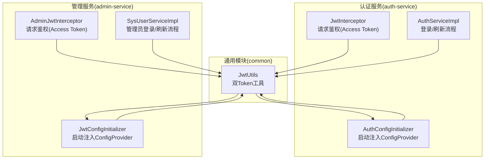
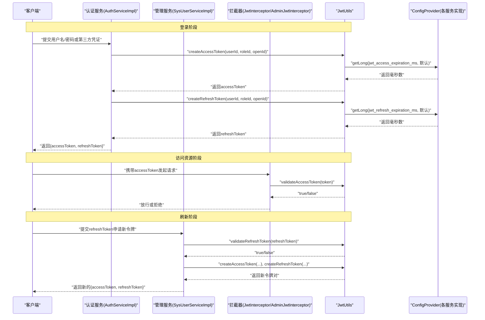
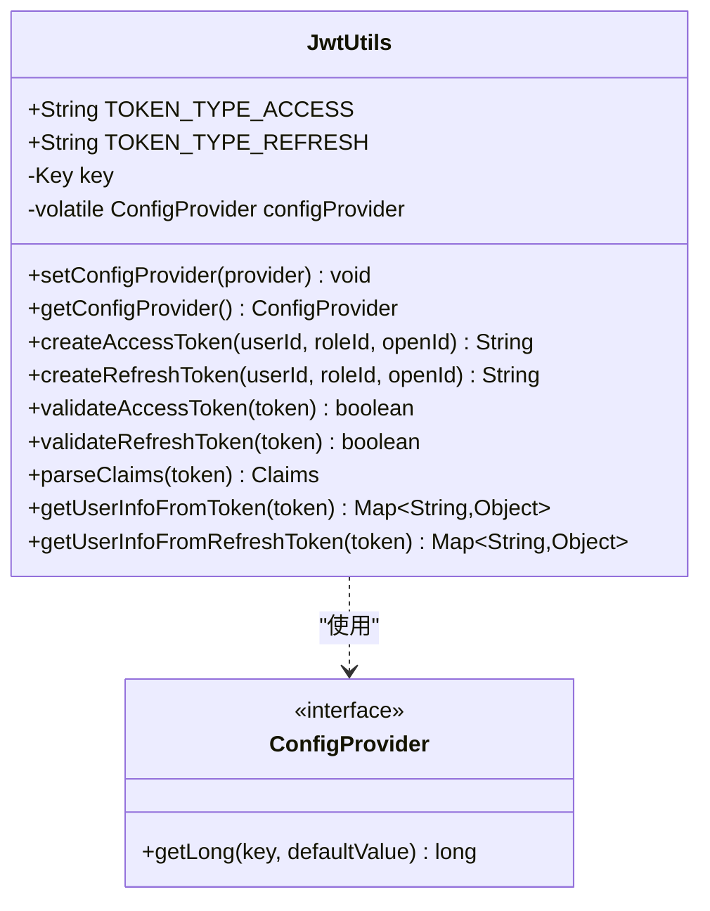
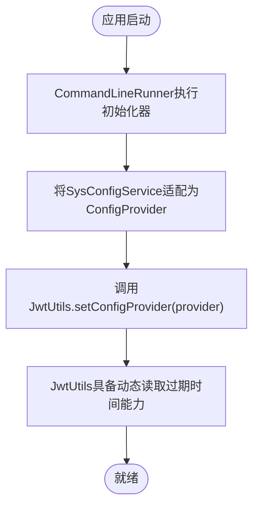
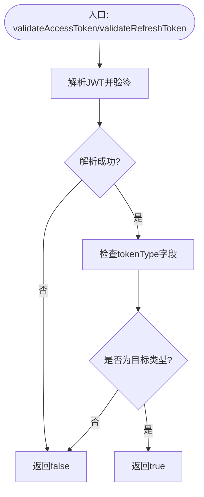
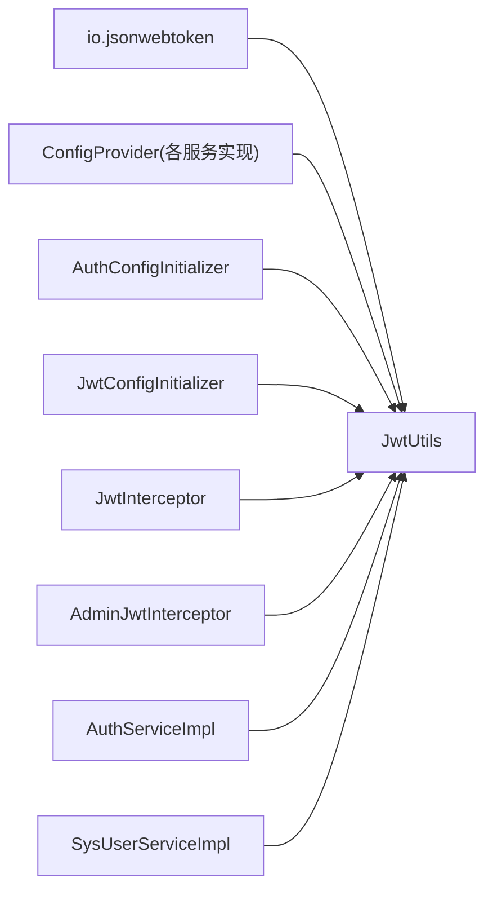

# JWT令牌工具类

<cite>
**本文引用的文件**   
- [JwtUtils.java](file://class_times_record_back/common/src/main/java/com/shiroko/util/JwtUtils.java)
- [AuthConfigInitializer.java](file://class_times_record_back/auth-service/src/main/java/com/shiroko/config/AuthConfigInitializer.java)
- [JwtConfigInitializer.java](file://class_times_record_back/admin-service/src/main/java/com/shiroko/config/JwtConfigInitializer.java)
- [AuthServiceImpl.java](file://class_times_record_back/auth-service/src/main/java/com/shiroko/service/impl/AuthServiceImpl.java)
- [SysUserServiceImpl.java](file://class_times_record_back/admin-service/src/main/java/com/shiroko/service/impl/SysUserServiceImpl.java)
- [JwtInterceptor.java](file://class_times_record_back/auth-service/src/main/java/com/shiroko/interceptor/JwtInterceptor.java)
- [AdminJwtInterceptor.java](file://class_times_record_back/admin-service/src/main/java/com/shiroko/interceptor/AdminJwtInterceptor.java)
- [JwtUtilsTest.java](file://class_times_record_back/auth-service/src/test/java/com/shiroko/JwtUtilsTest.java)
</cite>

## 目录
1. [简介](#简介)
2. [项目结构](#项目结构)
3. [核心组件](#核心组件)
4. [架构总览](#架构总览)
5. [详细组件分析](#详细组件分析)
6. [依赖关系分析](#依赖关系分析)
7. [性能与线程安全](#性能与线程安全)
8. [故障排查指南](#故障排查指南)
9. [结论](#结论)
10. [附录：Claims设计与扩展建议](#附录claims设计与扩展建议)

## 简介
本文件围绕 JwtUtils 工具类，系统性说明其双 Token 机制（Access Token + Refresh Token）的实现细节、配置注入模式、Claims 设计、使用示例、线程安全性与异常处理策略，以及面向开发者的扩展与自定义指导。该工具类位于通用模块 common 中，通过函数式接口 ConfigProvider 解耦具体配置来源，支持运行时动态调整过期时间，提升系统灵活性与可运维性。

## 项目结构
- 通用能力层（common）：提供 JwtUtils 工具类，不依赖任何业务实现，仅定义配置提供者接口。
- 认证服务（auth-service）：在启动时通过初始化器将配置源注入到 JwtUtils；业务登录流程调用 JwtUtils 生成并校验双 Token；网关或拦截器基于 Access Token 进行鉴权。
- 管理服务（admin-service）：同样在启动时注入配置源；管理员登录流程使用 JwtUtils 生成双 Token；管理端拦截器校验 Access Token。

图表来源
- [JwtUtils.java:1-213](file://class_times_record_back/common/src/main/java/com/shiroko/util/JwtUtils.java#L1-L213)
- [AuthConfigInitializer.java:1-42](file://class_times_record_back/auth-service/src/main/java/com/shiroko/config/AuthConfigInitializer.java#L1-L42)
- [JwtConfigInitializer.java:1-36](file://class_times_record_back/admin-service/src/main/java/com/shiroko/config/JwtConfigInitializer.java#L1-L36)
- [JwtInterceptor.java:90](file://class_times_record_back/auth-service/src/main/java/com/shiroko/interceptor/JwtInterceptor.java#L90)
- [AdminJwtInterceptor.java:73](file://class_times_record_back/admin-service/src/main/java/com/shiroko/interceptor/AdminJwtInterceptor.java#L73)
- [AuthServiceImpl.java:108-109](file://class_times_record_back/auth-service/src/main/java/com/shiroko/service/impl/AuthServiceImpl.java#L108-L109)
- [SysUserServiceImpl.java:71-72](file://class_times_record_back/admin-service/src/main/java/com/shiroko/service/impl/SysUserServiceImpl.java#L71-L72)

章节来源
- [JwtUtils.java:1-213](file://class_times_record_back/common/src/main/java/com/shiroko/util/JwtUtils.java#L1-L213)
- [AuthConfigInitializer.java:1-42](file://class_times_record_back/auth-service/src/main/java/com/shiroko/config/AuthConfigInitializer.java#L1-L42)
- [JwtConfigInitializer.java:1-36](file://class_times_record_back/admin-service/src/main/java/com/shiroko/config/JwtConfigInitializer.java#L1-L36)

## 核心组件
- JwtUtils：封装双 Token 的创建、校验、解析与用户信息提取；通过 ConfigProvider 动态读取过期时间；内部以 HMAC-SHA256 签名。
- ConfigProvider：函数式接口，由业务服务实现，从数据库/缓存等来源读取 Long 类型配置值，供 JwtUtils 获取过期时间。
- 初始化器（AuthConfigInitializer / JwtConfigInitializer）：应用启动后，将 SysConfigService 适配为 ConfigProvider 注入到 JwtUtils，使过期时间可在线动态调整。

章节来源
- [JwtUtils.java:27-104](file://class_times_record_back/common/src/main/java/com/shiroko/util/JwtUtils.java#L27-L104)
- [AuthConfigInitializer.java:30-40](file://class_times_record_back/auth-service/src/main/java/com/shiroko/config/AuthConfigInitializer.java#L30-L40)
- [JwtConfigInitializer.java:29-34](file://class_times_record_back/admin-service/src/main/java/com/shiroko/config/JwtConfigInitializer.java#L29-L34)

## 架构总览
下图展示“登录—签发—鉴权—刷新”的端到端流程，体现双 Token 协作与配置注入点。

图表来源
- [AuthServiceImpl.java:108-109](file://class_times_record_back/auth-service/src/main/java/com/shiroko/service/impl/AuthServiceImpl.java#L108-L109)
- [SysUserServiceImpl.java:71-72](file://class_times_record_back/admin-service/src/main/java/com/shiroko/service/impl/SysUserServiceImpl.java#L71-L72)
- [JwtInterceptor.java:90](file://class_times_record_back/auth-service/src/main/java/com/shiroko/interceptor/JwtInterceptor.java#L90)
- [AdminJwtInterceptor.java:73](file://class_times_record_back/admin-service/src/main/java/com/shiroko/interceptor/AdminJwtInterceptor.java#L73)
- [JwtUtils.java:112-149](file://class_times_record_back/common/src/main/java/com/shiroko/util/JwtUtils.java#L112-L149)
- [JwtUtils.java:151-175](file://class_times_record_back/common/src/main/java/com/shiroko/util/JwtUtils.java#L151-L175)

## 详细组件分析

### JwtUtils 类分析
- 双 Token 类型常量：access、refresh，用于区分令牌用途。
- 过期时间策略：优先从 ConfigProvider 读取，失败回退到硬编码默认值（Access 5分钟、Refresh 7天）。
- 签名算法：HMAC-SHA256，密钥来源于静态常量。
- 核心方法：
  - 创建：createAccessToken、createRefreshToken
  - 校验：validateAccessToken、validateRefreshToken
  - 解析：parseClaims、getUserInfoFromToken、getUserInfoFromRefreshToken
- 配置注入：setConfigProvider/getConfigProvider，采用 volatile 字段保证可见性。

图表来源
- [JwtUtils.java:27-104](file://class_times_record_back/common/src/main/java/com/shiroko/util/JwtUtils.java#L27-L104)
- [JwtUtils.java:112-149](file://class_times_record_back/common/src/main/java/com/shiroko/util/JwtUtils.java#L112-L149)
- [JwtUtils.java:151-175](file://class_times_record_back/common/src/main/java/com/shiroko/util/JwtUtils.java#L151-L175)
- [JwtUtils.java:177-211](file://class_times_record_back/common/src/main/java/com/shiroko/util/JwtUtils.java#L177-L211)

章节来源
- [JwtUtils.java:27-104](file://class_times_record_back/common/src/main/java/com/shiroko/util/JwtUtils.java#L27-L104)
- [JwtUtils.java:112-149](file://class_times_record_back/common/src/main/java/com/shiroko/util/JwtUtils.java#L112-L149)
- [JwtUtils.java:151-175](file://class_times_record_back/common/src/main/java/com/shiroko/util/JwtUtils.java#L151-L175)
- [JwtUtils.java:177-211](file://class_times_record_back/common/src/main/java/com/shiroko/util/JwtUtils.java#L177-L211)

### 配置注入机制（ConfigProvider）
- 设计目标：common 模块不依赖业务实现，通过函数式接口解耦配置来源。
- 注入时机：各服务启动后，通过 CommandLineRunner 将 SysConfigService 适配为 ConfigProvider 注入到 JwtUtils。
- 键名约定：jwt_access_expiration_ms、jwt_refresh_expiration_ms；读取失败时回退默认值。

图表来源
- [AuthConfigInitializer.java:30-40](file://class_times_record_back/auth-service/src/main/java/com/shiroko/config/AuthConfigInitializer.java#L30-L40)
- [JwtConfigInitializer.java:29-34](file://class_times_record_back/admin-service/src/main/java/com/shiroko/config/JwtConfigInitializer.java#L29-L34)
- [JwtUtils.java:63-74](file://class_times_record_back/common/src/main/java/com/shiroko/util/JwtUtils.java#L63-L74)

章节来源
- [AuthConfigInitializer.java:30-40](file://class_times_record_back/auth-service/src/main/java/com/shiroko/config/AuthConfigInitializer.java#L30-L40)
- [JwtConfigInitializer.java:29-34](file://class_times_record_back/admin-service/src/main/java/com/shiroko/config/JwtConfigInitializer.java#L29-L34)
- [JwtUtils.java:63-74](file://class_times_record_back/common/src/main/java/com/shiroko/util/JwtUtils.java#L63-L74)

### 使用示例（集成到认证流程）
- 登录流程（认证服务）：
  - 验证用户身份后，调用 createAccessToken 与 createRefreshToken 生成双 Token，并返回给客户端。
- 登录流程（管理服务）：
  - 管理员登录成功后，同样生成双 Token 返回。
- 鉴权流程（拦截器）：
  - 请求进入时，从请求头提取 Access Token，调用 validateAccessToken 进行校验，通过后放行。
- 刷新流程：
  - 客户端提交 Refresh Token，服务端调用 validateRefreshToken 校验通过后，重新签发新的双 Token。

章节来源
- [AuthServiceImpl.java:108-109](file://class_times_record_back/auth-service/src/main/java/com/shiroko/service/impl/AuthServiceImpl.java#L108-L109)
- [SysUserServiceImpl.java:71-72](file://class_times_record_back/admin-service/src/main/java/com/shiroko/service/impl/SysUserServiceImpl.java#L71-L72)
- [JwtInterceptor.java:90](file://class_times_record_back/auth-service/src/main/java/com/shiroko/interceptor/JwtInterceptor.java#L90)
- [AdminJwtInterceptor.java:73](file://class_times_record_back/admin-service/src/main/java/com/shiroko/interceptor/AdminJwtInterceptor.java#L73)

### 复杂逻辑流程图（令牌校验）

图表来源
- [JwtUtils.java:151-175](file://class_times_record_back/common/src/main/java/com/shiroko/util/JwtUtils.java#L151-L175)

章节来源
- [JwtUtils.java:151-175](file://class_times_record_back/common/src/main/java/com/shiroko/util/JwtUtils.java#L151-L175)

## 依赖关系分析
- JwtUtils 依赖：
  - io.jsonwebtoken.*：用于构建、解析与校验 JWT。
  - 配置提供者 ConfigProvider：由各服务实现，提供动态过期时间。
- 服务依赖：
  - auth-service 与 admin-service 均依赖 JwtUtils，并在启动时注入配置源。
  - 拦截器依赖 JwtUtils 进行快速鉴权。

图表来源
- [JwtUtils.java:1-213](file://class_times_record_back/common/src/main/java/com/shiroko/util/JwtUtils.java#L1-L213)
- [AuthConfigInitializer.java:1-42](file://class_times_record_back/auth-service/src/main/java/com/shiroko/config/AuthConfigInitializer.java#L1-L42)
- [JwtConfigInitializer.java:1-36](file://class_times_record_back/admin-service/src/main/java/com/shiroko/config/JwtConfigInitializer.java#L1-L36)
- [JwtInterceptor.java:90](file://class_times_record_back/auth-service/src/main/java/com/shiroko/interceptor/JwtInterceptor.java#L90)
- [AdminJwtInterceptor.java:73](file://class_times_record_back/admin-service/src/main/java/com/shiroko/interceptor/AdminJwtInterceptor.java#L73)
- [AuthServiceImpl.java:108-109](file://class_times_record_back/auth-service/src/main/java/com/shiroko/service/impl/AuthServiceImpl.java#L108-L109)
- [SysUserServiceImpl.java:71-72](file://class_times_record_back/admin-service/src/main/java/com/shiroko/service/impl/SysUserServiceImpl.java#L71-L72)

章节来源
- [JwtUtils.java:1-213](file://class_times_record_back/common/src/main/java/com/shiroko/util/JwtUtils.java#L1-L213)
- [AuthConfigInitializer.java:1-42](file://class_times_record_back/auth-service/src/main/java/com/shiroko/config/AuthConfigInitializer.java#L1-L42)
- [JwtConfigInitializer.java:1-36](file://class_times_record_back/admin-service/src/main/java/com/shiroko/config/JwtConfigInitializer.java#L1-L36)

## 性能与线程安全
- 线程安全：
  - configProvider 字段声明为 volatile，确保多线程环境下可见性。
  - 签名 Key 为静态 final，构造一次复用，避免重复计算。
- 性能特性：
  - 过期时间读取路径包含 try-catch 与日志记录，异常时回退默认值，避免阻塞主流程。
  - 校验方法捕获异常并返回布尔值，减少上层分支复杂度。
- 优化建议：
  - 若配置读取频繁且稳定，可在服务侧增加本地缓存（如短 TTL），降低远程读取开销。
  - 对高频鉴权场景，可考虑在拦截器层做轻量级缓存（例如最近校验结果短时缓存），注意与刷新策略协同。

章节来源
- [JwtUtils.java:41-104](file://class_times_record_back/common/src/main/java/com/shiroko/util/JwtUtils.java#L41-L104)
- [JwtUtils.java:151-175](file://class_times_record_back/common/src/main/java/com/shiroko/util/JwtUtils.java#L151-L175)

## 故障排查指南
- 常见问题定位：
  - 配置未注入：检查各服务的初始化器是否在启动后调用了 setConfigProvider。
  - 配置键缺失或类型错误：确认配置键名为 jwt_access_expiration_ms、jwt_refresh_expiration_ms，且值为 Long。
  - 签名不一致：检查 SECRET_KEY 在各环境保持一致。
  - 令牌被篡改：解析抛出异常，上层应返回非法令牌错误。
- 测试用例参考：
  - 覆盖有效/无效/空/null 令牌校验、不同用户生成不同令牌、Refresh/Access 互斥校验等。

章节来源
- [AuthConfigInitializer.java:30-40](file://class_times_record_back/auth-service/src/main/java/com/shiroko/config/AuthConfigInitializer.java#L30-L40)
- [JwtConfigInitializer.java:29-34](file://class_times_record_back/admin-service/src/main/java/com/shiroko/config/JwtConfigInitializer.java#L29-L34)
- [JwtUtilsTest.java:22-163](file://class_times_record_back/auth-service/src/test/java/com/shiroko/JwtUtilsTest.java#L22-L163)

## 结论
JwtUtils 以简洁清晰的 API 实现了双 Token 机制，并通过 ConfigProvider 解耦配置来源，支持运行时动态调整过期时间。配合服务启动时的初始化器与拦截器的统一鉴权，形成完整的认证闭环。整体设计具备良好的可扩展性与可维护性，适合在多服务环境中复用。

## 附录：Claims设计与扩展建议
- Claims 字段说明：
  - userId：用户标识，用于识别主体。
  - roleId：角色标识，用于权限判断。
  - tokenType：令牌类型（access/refresh），用于区分用途。
  - openId：可选，微信 openId，非微信登录可为 null。
- 扩展建议：
  - 新增业务字段：可在创建令牌时按需添加 claims，但应避免过大 payload。
  - 多租户/多平台：可增加 tenantId、platform 等字段，便于跨域治理。
  - 黑名单/撤销：如需即时失效，可在外部存储（如 Redis）维护黑名单，校验时额外检查。
  - 加密与压缩：对敏感信息建议使用外部存储（如会话中心），不在 JWT 中明文存放。

章节来源
- [JwtUtils.java:112-149](file://class_times_record_back/common/src/main/java/com/shiroko/util/JwtUtils.java#L112-L149)
- [JwtUtils.java:177-211](file://class_times_record_back/common/src/main/java/com/shiroko/util/JwtUtils.java#L177-L211)