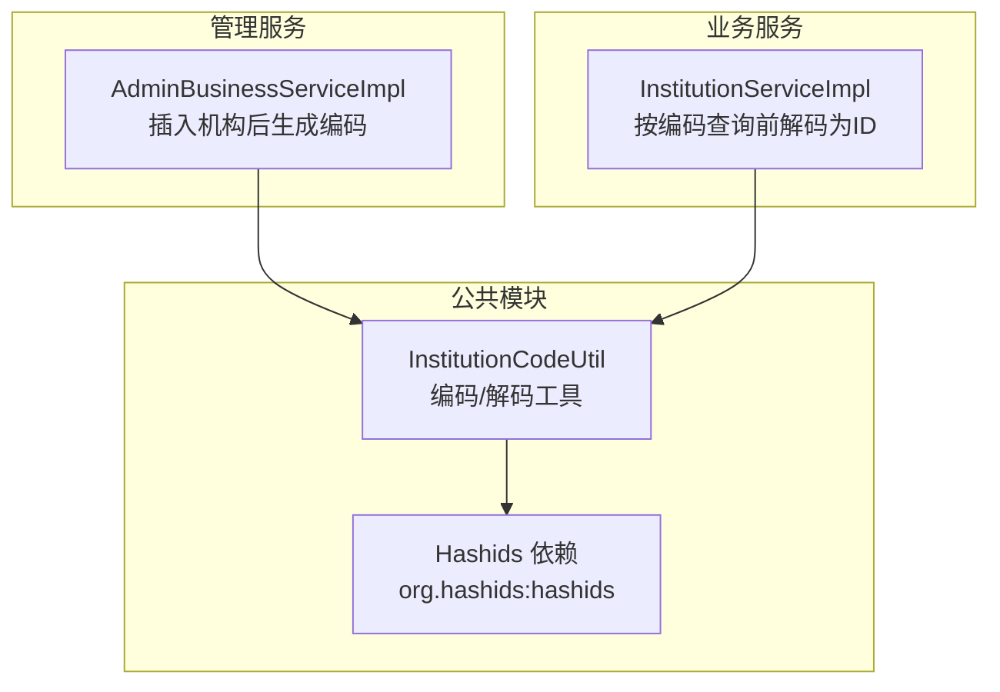
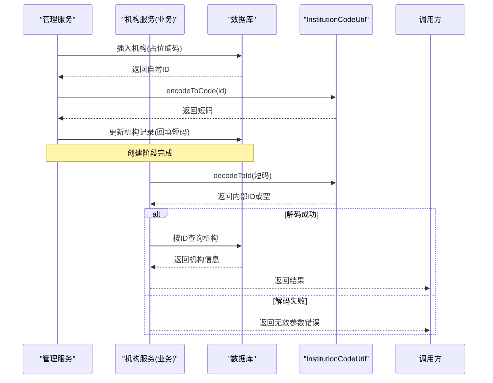
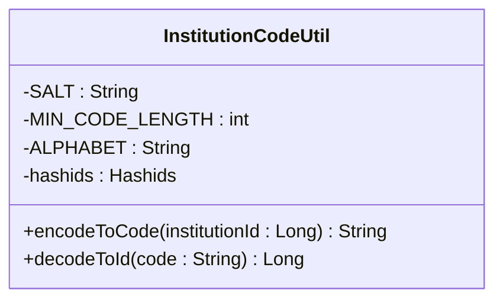
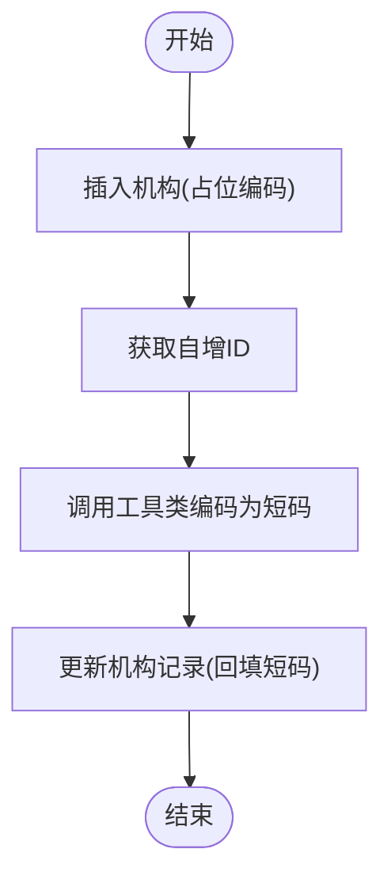
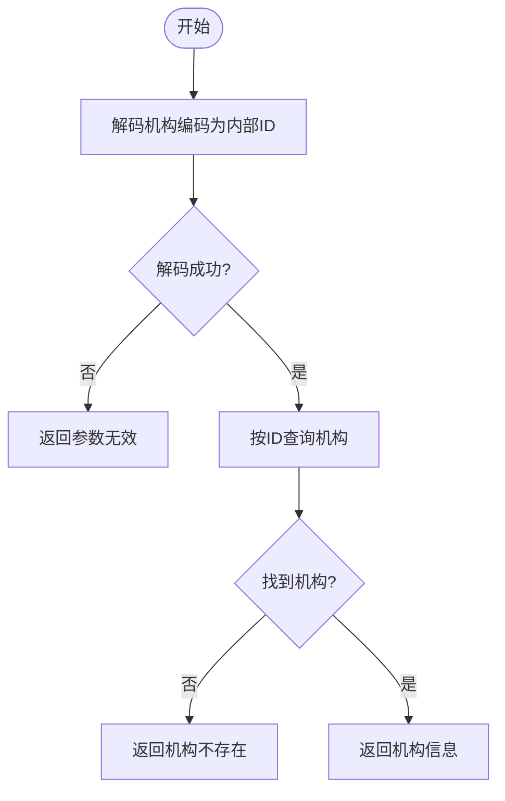
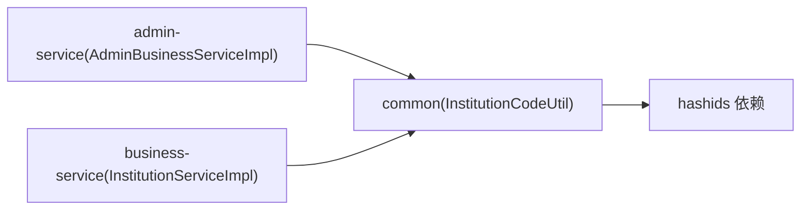

# 业务工具类

<cite>
**本文引用的文件**   
- [InstitutionCodeUtil.java](file://class_times_record_back/common/src/main/java/com/shiroko/util/InstitutionCodeUtil.java)
- [AdminBusinessServiceImpl.java](file://class_times_record_back/admin-service/src/main/java/com/shiroko/service/impl/AdminBusinessServiceImpl.java)
- [InstitutionServiceImpl.java](file://class_times_record_back/business-service/src/main/java/com/shiroko/service/impl/InstitutionServiceImpl.java)
- [pom.xml（common）](file://class_times_record_back/common/pom.xml)
</cite>

## 目录
1. [简介](#简介)
2. [项目结构](#项目结构)
3. [核心组件](#核心组件)
4. [架构总览](#架构总览)
5. [详细组件分析](#详细组件分析)
6. [依赖分析](#依赖分析)
7. [性能考虑](#性能考虑)
8. [故障排查指南](#故障排查指南)
9. [结论](#结论)
10. [附录](#附录)

## 简介
本文件聚焦于“机构编码生成工具”的业务工具类，围绕其实现原理、编码规则设计、唯一性与并发安全、在系统中的业务含义与作用、使用示例与扩展方法进行全面说明。该工具用于将数据库自增主键转换为对外可见的短码（机构编码），并在需要时反向解析回内部ID，从而兼顾可读性、安全性与查询效率。

## 项目结构
- 工具类位于公共模块 common 中，供 admin-service 与 business-service 共同复用。
- 管理端服务在创建机构后调用工具生成并回填机构编码；业务端服务在按“机构编码”查询时先解码为内部ID再查库。

图表来源
- [InstitutionCodeUtil.java:1-47](file://class_times_record_back/common/src/main/java/com/shiroko/util/InstitutionCodeUtil.java#L1-L47)
- [AdminBusinessServiceImpl.java:276-301](file://class_times_record_back/admin-service/src/main/java/com/shiroko/service/impl/AdminBusinessServiceImpl.java#L276-L301)
- [InstitutionServiceImpl.java:38-71](file://class_times_record_back/business-service/src/main/java/com/shiroko/service/impl/InstitutionServiceImpl.java#L38-L71)
- [pom.xml（common）:82-84](file://class_times_record_back/common/pom.xml#L82-L84)

章节来源
- [InstitutionCodeUtil.java:1-47](file://class_times_record_back/common/src/main/java/com/shiroko/util/InstitutionCodeUtil.java#L1-L47)
- [AdminBusinessServiceImpl.java:276-301](file://class_times_record_back/admin-service/src/main/java/com/shiroko/service/impl/AdminBusinessServiceImpl.java#L276-L301)
- [InstitutionServiceImpl.java:38-71](file://class_times_record_back/business-service/src/main/java/com/shiroko/service/impl/InstitutionServiceImpl.java#L38-L71)
- [pom.xml（common）:82-84](file://class_times_record_back/common/pom.xml#L82-L84)

## 核心组件
- InstitutionCodeUtil：提供 encodeToCode(Long) 与 decodeToId(String) 两个静态能力，基于 Hashids 完成 ID 与短码的双向转换。
- AdminBusinessServiceImpl：在新增机构流程中，先写入占位记录，获取自增ID后调用工具生成编码并回填更新。
- InstitutionServiceImpl：在通过“机构编码”查询机构的接口中，先解码为内部ID，再按ID精确查询。

章节来源
- [InstitutionCodeUtil.java:29-45](file://class_times_record_back/common/src/main/java/com/shiroko/util/InstitutionCodeUtil.java#L29-L45)
- [AdminBusinessServiceImpl.java:276-301](file://class_times_record_back/admin-service/src/main/java/com/shiroko/service/impl/AdminBusinessServiceImpl.java#L276-L301)
- [InstitutionServiceImpl.java:58-71](file://class_times_record_back/business-service/src/main/java/com/shiroko/service/impl/InstitutionServiceImpl.java#L58-L71)

## 架构总览
下图展示了从“创建机构”到“按编码查询”的端到端流程，以及工具类在各环节中的职责。

图表来源
- [AdminBusinessServiceImpl.java:276-301](file://class_times_record_back/admin-service/src/main/java/com/shiroko/service/impl/AdminBusinessServiceImpl.java#L276-L301)
- [InstitutionServiceImpl.java:58-71](file://class_times_record_back/business-service/src/main/java/com/shiroko/service/impl/InstitutionServiceImpl.java#L58-L71)
- [InstitutionCodeUtil.java:29-45](file://class_times_record_back/common/src/main/java/com/shiroko/util/InstitutionCodeUtil.java#L29-L45)

## 详细组件分析

### 组件：InstitutionCodeUtil
- 功能概述
  - 将数据库自增ID编码为短码（对外暴露的机构编码）。
  - 将外部传入的短码解码为内部自增ID。
- 关键特性
  - 编码规则：基于 Hashids，配置了盐值、最小长度与字符集（去除了易混淆字符）。
  - 唯一性保证：同一盐值下，相同ID生成的短码固定且唯一；不同ID不会冲突。
  - 并发安全：工具类本身无状态，仅依赖静态 Hashids 实例，天然线程安全。
  - 可逆性：支持双向编解码，便于前端展示与后端解析。
- 复杂度分析
  - 时间复杂度：O(k)，k 为输出短码长度（由最小长度与输入ID决定）。
  - 空间复杂度：O(k)，用于构建和返回短码字符串。
- 扩展点
  - 可通过调整盐值、最小长度、字符集来改变短码风格与长度。
  - 若需引入多租户或多域编码，可在上层封装命名空间或前缀策略。

图表来源
- [InstitutionCodeUtil.java:13-45](file://class_times_record_back/common/src/main/java/com/shiroko/util/InstitutionCodeUtil.java#L13-L45)

章节来源
- [InstitutionCodeUtil.java:13-45](file://class_times_record_back/common/src/main/java/com/shiroko/util/InstitutionCodeUtil.java#L13-L45)

### 组件：AdminBusinessServiceImpl（机构创建流程）
- 职责
  - 接收新增机构请求，先插入占位记录，随后根据自增ID生成短码并回填更新。
- 关键点
  - 先插入占位编码以避免非空约束。
  - 使用工具类对自增ID进行编码，确保短码稳定且唯一。
  - 更新机构记录以持久化短码。

图表来源
- [AdminBusinessServiceImpl.java:276-301](file://class_times_record_back/admin-service/src/main/java/com/shiroko/service/impl/AdminBusinessServiceImpl.java#L276-L301)

章节来源
- [AdminBusinessServiceImpl.java:276-301](file://class_times_record_back/admin-service/src/main/java/com/shiroko/service/impl/AdminBusinessServiceImpl.java#L276-L301)

### 组件：InstitutionServiceImpl（按编码查询流程）
- 职责
  - 接收“机构编码”，先解码为内部ID，再按ID查询机构详情。
- 关键点
  - 解码失败直接返回参数无效提示。
  - 解码成功后按ID精确查询，避免模糊匹配带来的性能问题。

图表来源
- [InstitutionServiceImpl.java:58-71](file://class_times_record_back/business-service/src/main/java/com/shiroko/service/impl/InstitutionServiceImpl.java#L58-L71)

章节来源
- [InstitutionServiceImpl.java:58-71](file://class_times_record_back/business-service/src/main/java/com/shiroko/service/impl/InstitutionServiceImpl.java#L58-L71)

### 概念性总览
- 业务含义
  - 机构编码作为对外标识，具备不可预测性与稳定性，适合用于分享、邀请、扫码等场景。
  - 内部仍使用自增ID进行关联与索引，保障查询性能与一致性。
- 层级关系
  - 当前编码方案不承载层级信息；如需体现层级，可在上层采用分层命名或前缀策略。
- 查询优化
  - 对外使用短码，对内使用ID；查询路径为“短码→ID→精确查询”，避免模糊匹配与全表扫描。

[本节为概念性内容，无需列出具体源码引用]

## 依赖分析
- 外部依赖
  - org.hashids:hashids：用于ID到短码的哈希编码与解码。
- 模块内依赖
  - 工具类被管理服务与业务服务同时依赖，形成稳定的跨服务复用。

图表来源
- [pom.xml（common）:82-84](file://class_times_record_back/common/pom.xml#L82-L84)
- [AdminBusinessServiceImpl.java:276-301](file://class_times_record_back/admin-service/src/main/java/com/shiroko/service/impl/AdminBusinessServiceImpl.java#L276-L301)
- [InstitutionServiceImpl.java:38-71](file://class_times_record_back/business-service/src/main/java/com/shiroko/service/impl/InstitutionServiceImpl.java#L38-L71)

章节来源
- [pom.xml（common）:82-84](file://class_times_record_back/common/pom.xml#L82-L84)
- [AdminBusinessServiceImpl.java:276-301](file://class_times_record_back/admin-service/src/main/java/com/shiroko/service/impl/AdminBusinessServiceImpl.java#L276-L301)
- [InstitutionServiceImpl.java:38-71](file://class_times_record_back/business-service/src/main/java/com/shiroko/service/impl/InstitutionServiceImpl.java#L38-L71)

## 性能考虑
- 编解码开销低：短码长度受最小长度控制，计算复杂度线性相关，CPU 开销极小。
- 查询路径高效：对外短码仅用于身份传递，最终落库查询均基于内部ID，利于索引命中。
- 缓存建议：若短码解码频繁，可在应用层增加本地缓存（如短码→ID映射），降低重复计算。

[本节为通用指导，无需列出具体源码引用]

## 故障排查指南
- 现象：按机构编码查询返回“机构码无效”
  - 可能原因：传入的短码格式不正确或已被篡改。
  - 处理建议：校验输入格式；确认未修改盐值或最小长度；必要时记录日志定位。
- 现象：按机构编码查询返回“机构不存在”
  - 可能原因：短码有效但对应ID在数据库中已删除或迁移。
  - 处理建议：检查数据生命周期与清理策略；必要时做软删除兼容。
- 现象：短码长度不符合预期
  - 可能原因：最小长度配置或字符集变更导致。
  - 处理建议：核对常量配置；保持向后兼容，避免破坏已有短码。

章节来源
- [InstitutionServiceImpl.java:58-71](file://class_times_record_back/business-service/src/main/java/com/shiroko/service/impl/InstitutionServiceImpl.java#L58-L71)

## 结论
InstitutionCodeUtil 以 Hashids 为核心，提供了简洁、稳定、可逆的机构编码生成与解析能力。结合管理端与服务端的协作流程，实现了“对外短码、对内ID”的最佳实践，既满足安全与可读性需求，又保障了查询性能与系统扩展性。

[本节为总结性内容，无需列出具体源码引用]

## 附录

### 使用示例（步骤指引）
- 生成机构编码
  - 在新增机构流程中，先插入占位记录，获取自增ID后调用工具类的编码方法，再将结果回填至机构记录。
  - 参考路径：[AdminBusinessServiceImpl.java:276-301](file://class_times_record_back/admin-service/src/main/java/com/shiroko/service/impl/AdminBusinessServiceImpl.java#L276-L301)
- 按机构编码查询
  - 在服务入口处调用工具类的解码方法，将短码转为内部ID，再按ID查询机构详情。
  - 参考路径：[InstitutionServiceImpl.java:58-71](file://class_times_record_back/business-service/src/main/java/com/shiroko/service/impl/InstitutionServiceImpl.java#L58-L71)

### 编码规则与兼容性设计
- 盐值与最小长度
  - 盐值固定，确保同一ID的短码长期稳定；最小长度控制短码下限，提升可读性与防猜测性。
- 字符集
  - 去除易混淆字符，减少人工输入错误。
- 兼容性
  - 短码与内部ID一一对应，更换展示层或接入层时无需改动底层逻辑。
  - 若未来需要多域隔离，可在上层增加命名空间或前缀策略，避免全局冲突。

章节来源
- [InstitutionCodeUtil.java:13-21](file://class_times_record_back/common/src/main/java/com/shiroko/util/InstitutionCodeUtil.java#L13-L21)

### 扩展方法与自定义编码规则
- 替换底层算法
  - 若需更换编码算法，可在工具类中抽象出接口，注入不同的实现，保持上层调用不变。
- 多租户/多域编码
  - 在上层封装时加入租户或域前缀，或将租户ID参与编码输入，使短码具备领域隔离能力。
- 长度与字符集定制
  - 通过调整最小长度与字符集常量，平衡短码长度与可读性；注意保持历史短码兼容。

章节来源
- [InstitutionCodeUtil.java:13-21](file://class_times_record_back/common/src/main/java/com/shiroko/util/InstitutionCodeUtil.java#L13-L21)