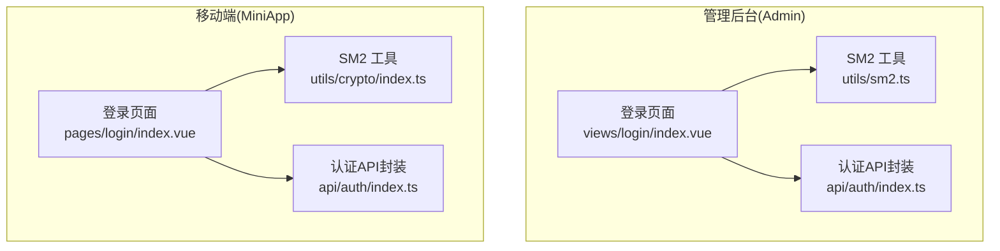
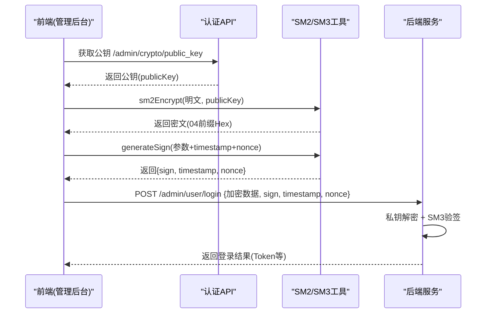
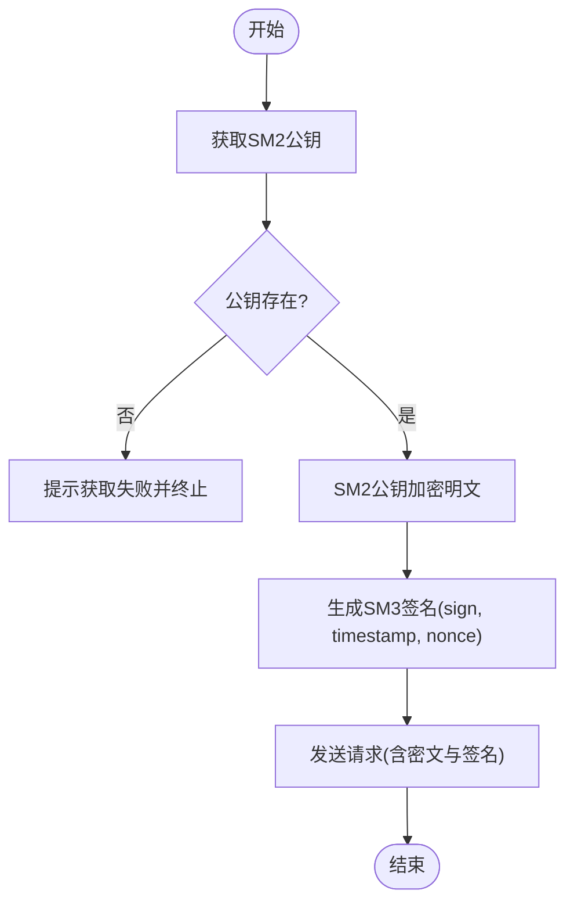
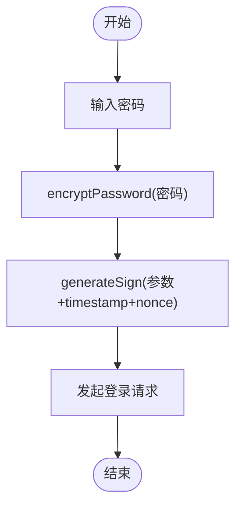
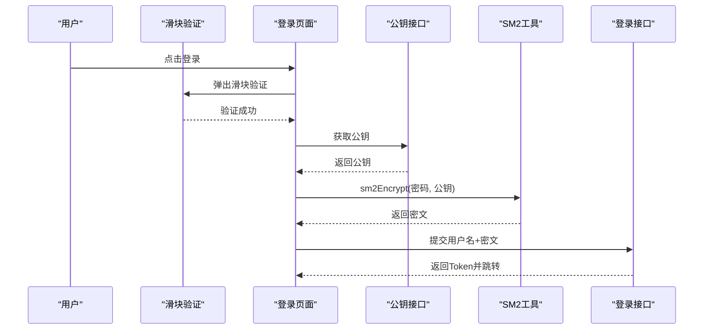
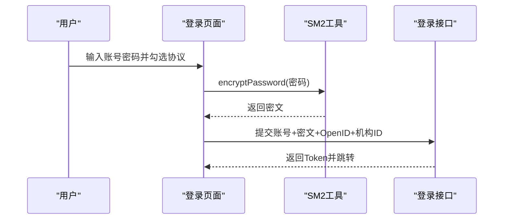
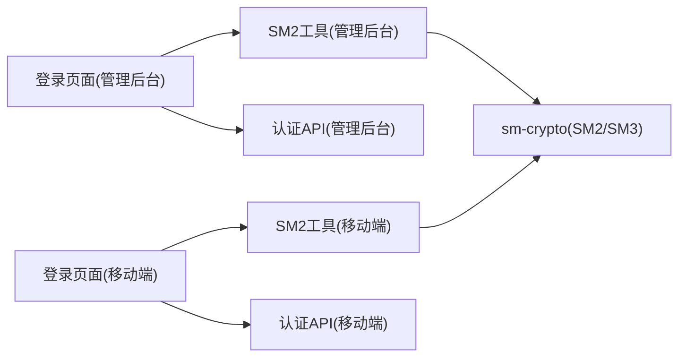

# 国密算法工具类

<cite>
**本文引用的文件**   
- [class_record_admin_front/src/utils/sm2.ts](file://class_record_admin_front/src/utils/sm2.ts)
- [class_times_record/src/utils/crypto/index.ts](file://class_times_record/src/utils/crypto/index.ts)
- [class_record_admin_front/src/views/login/index.vue](file://class_record_admin_front/src/views/login/index.vue)
- [class_record_admin_front/src/api/auth/index.ts](file://class_record_admin_front/src/api/auth/index.ts)
- [class_times_record/src/pages/login/index.vue](file://class_times_record/src/pages/login/index.vue)
- [class_times_record/src/api/auth/index.ts](file://class_times_record/src/api/auth/index.ts)
</cite>

## 目录
1. [简介](#简介)
2. [项目结构](#项目结构)
3. [核心组件](#核心组件)
4. [架构总览](#架构总览)
5. [详细组件分析](#详细组件分析)
6. [依赖关系分析](#依赖关系分析)
7. [性能与安全考虑](#性能与安全考虑)
8. [故障排查指南](#故障排查指南)
9. [结论](#结论)
10. [附录：使用示例与最佳实践](#附录使用示例与最佳实践)

## 简介
本文件面向开发者，系统化梳理项目中“国密算法工具类”的实现与应用，重点覆盖：
- SM2 非对称加密：密钥获取、数据加密/解密（前端侧）、数字签名与验签（参数签名）
- SM3 哈希：接口请求签名、防篡改校验
- 前后端协作的安全流程：前端 SM2 加密传输 + 后端解密验证的完整链路
- 典型场景落地：登录认证、数据传输等
- 安全性与性能考量，以及扩展与自定义方案建议

## 项目结构
本项目在两个前端工程中分别实现了国密能力：
- 管理后台（Vue3 + Element Plus）：位于 class_record_admin_front
- 移动端（uni-app）：位于 class_times_record

关键文件定位：
- 管理后台 SM2 工具：src/utils/sm2.ts
- 移动端 SM2 工具：src/utils/crypto/index.ts
- 管理后台登录页：src/views/login/index.vue
- 管理后台认证 API：src/api/auth/index.ts
- 移动端登录页：src/pages/login/index.vue
- 移动端认证 API：src/api/auth/index.ts

图表来源
- [class_record_admin_front/src/views/login/index.vue:1-177](file://class_record_admin_front/src/views/login/index.vue#L1-L177)
- [class_record_admin_front/src/utils/sm2.ts:1-88](file://class_record_admin_front/src/utils/sm2.ts#L1-L88)
- [class_record_admin_front/src/api/auth/index.ts:1-14](file://class_record_admin_front/src/api/auth/index.ts#L1-L14)
- [class_times_record/src/pages/login/index.vue:1-344](file://class_times_record/src/pages/login/index.vue#L1-L344)
- [class_times_record/src/utils/crypto/index.ts:1-99](file://class_times_record/src/utils/crypto/index.ts#L1-L99)
- [class_times_record/src/api/auth/index.ts:1-213](file://class_times_record/src/api/auth/index.ts#L1-L213)

章节来源
- [class_record_admin_front/src/utils/sm2.ts:1-88](file://class_record_admin_front/src/utils/sm2.ts#L1-L88)
- [class_times_record/src/utils/crypto/index.ts:1-99](file://class_times_record/src/utils/crypto/index.ts#L1-L99)
- [class_record_admin_front/src/views/login/index.vue:1-177](file://class_record_admin_front/src/views/login/index.vue#L1-L177)
- [class_record_admin_front/src/api/auth/index.ts:1-14](file://class_record_admin_front/src/api/auth/index.ts#L1-L14)
- [class_times_record/src/pages/login/index.vue:1-344](file://class_times_record/src/pages/login/index.vue#L1-L344)
- [class_times_record/src/api/auth/index.ts:1-213](file://class_times_record/src/api/auth/index.ts#L1-L213)

## 核心组件
- SM2 加密工具（管理后台）
  - 提供 sm2Encrypt(data, publicKey) 对明文进行 SM2 公钥加密，输出带 04 前缀的 Hex 字符串
  - 提供 generateSign(params) 基于 SM3 生成接口请求签名，包含 sign、timestamp、nonce
  - 内部实现稳定序列化 stableStringify，模拟后端排序与空值过滤行为，确保前后端签名一致
- SM2 加密工具（移动端）
  - 提供 encryptPassword(data) 对密码进行 SM2 公钥加密，输出带 04 前缀的 Hex 字符串
  - 提供 generateSign(params) 基于 SM3 生成接口请求签名，包含 sign、timestamp、nonce
  - 同样内置 stableStringify 保证对象序列化一致性

章节来源
- [class_record_admin_front/src/utils/sm2.ts:1-88](file://class_record_admin_front/src/utils/sm2.ts#L1-L88)
- [class_times_record/src/utils/crypto/index.ts:1-99](file://class_times_record/src/utils/crypto/index.ts#L1-L99)

## 架构总览
下图展示“前端 SM2 加密 + SM3 签名 + 后端解密验签”的整体流程。以管理后台登录为例：
- 前端从后端获取 SM2 公钥
- 使用公钥对敏感字段（如密码）进行 SM2 加密
- 组装请求参数并生成 SM3 签名（含时间戳与随机串）
- 将加密后的数据与签名一并发送至后端
- 后端使用私钥解密、校验签名，完成鉴权与防篡改

图表来源
- [class_record_admin_front/src/views/login/index.vue:70-112](file://class_record_admin_front/src/views/login/index.vue#L70-L112)
- [class_record_admin_front/src/api/auth/index.ts:1-14](file://class_record_admin_front/src/api/auth/index.ts#L1-L14)
- [class_record_admin_front/src/utils/sm2.ts:15-87](file://class_record_admin_front/src/utils/sm2.ts#L15-L87)

## 详细组件分析

### 管理后台 SM2 工具（sm2.ts）
- 功能要点
  - sm2Encrypt：调用底层 sm-crypto 的 doEncrypt，固定模式为 C1C3C2（cipherMode=1），并在结果前拼接 04 前缀，与后端保持一致
  - generateSign：对请求参数进行稳定序列化、键名排序、空值过滤，拼接时间戳与随机串，再与共享盐（API_SECRET）组合后执行 SM3 哈希，得到 sign
  - stableStringify：递归处理对象与数组，仅对第一层 key 做排序与空值过滤，保证与后端 JSON 序列化策略一致
- 安全设计
  - 通过 timestamp 与 nonce 防止重放攻击
  - 通过 SM3 签名与共享盐防止参数篡改
  - 使用 C1C3C2 模式与后端对齐，避免加解密不一致
- 复杂度与性能
  - SM2 加密/解密为椭圆曲线运算，开销随数据长度增长；通常用于小数据（如口令、会话密钥）
  - SM3 哈希为线性复杂度 O(n)，适合对请求体或关键字段进行完整性校验
- 错误处理
  - 公钥缺失时直接提示失败，避免无意义加密
  - 网络异常统一捕获并给出友好提示

图表来源
- [class_record_admin_front/src/views/login/index.vue:70-112](file://class_record_admin_front/src/views/login/index.vue#L70-L112)
- [class_record_admin_front/src/utils/sm2.ts:15-87](file://class_record_admin_front/src/utils/sm2.ts#L15-L87)

章节来源
- [class_record_admin_front/src/utils/sm2.ts:1-88](file://class_record_admin_front/src/utils/sm2.ts#L1-L88)
- [class_record_admin_front/src/views/login/index.vue:1-177](file://class_record_admin_front/src/views/login/index.vue#L1-L177)

### 移动端 SM2 工具（crypto/index.ts）
- 功能要点
  - encryptPassword：使用固定公钥对密码进行 SM2 加密，输出带 04 前缀的 Hex 字符串
  - generateSign：与后台一致的签名逻辑，包含稳定序列化、排序、空值过滤、SM3 哈希
- 使用场景
  - 移动端登录时对密码进行 SM2 加密传输
  - 其他需要防篡改的接口可复用 generateSign 生成签名
- 注意事项
  - 公钥硬编码于工具中，生产环境建议通过配置中心或安全通道动态下发
  - 日志打印 stringA 仅用于调试，上线需关闭

图表来源
- [class_times_record/src/utils/crypto/index.ts:15-98](file://class_times_record/src/utils/crypto/index.ts#L15-L98)
- [class_times_record/src/pages/login/index.vue:296-340](file://class_times_record/src/pages/login/index.vue#L296-L340)

章节来源
- [class_times_record/src/utils/crypto/index.ts:1-99](file://class_times_record/src/utils/crypto/index.ts#L1-L99)
- [class_times_record/src/pages/login/index.vue:1-344](file://class_times_record/src/pages/login/index.vue#L1-L344)

### 登录流程集成（管理后台）
- 步骤
  - 用户点击登录，触发滑块验证码
  - 滑块验证通过后，调用 getPublicKey 获取公钥
  - 使用 sm2Encrypt 对密码进行加密
  - 调用 login 接口提交用户名与加密后的密码
  - 成功后存储 Token 并跳转至首页
- 关键点
  - 公钥必须每次登录前动态获取，避免公钥轮换导致解密失败
  - 滑块验证码作为人机校验，降低暴力破解风险

图表来源
- [class_record_admin_front/src/views/login/index.vue:22-112](file://class_record_admin_front/src/views/login/index.vue#L22-L112)
- [class_record_admin_front/src/api/auth/index.ts:1-14](file://class_record_admin_front/src/api/auth/index.ts#L1-L14)
- [class_record_admin_front/src/utils/sm2.ts:15-17](file://class_record_admin_front/src/utils/sm2.ts#L15-L17)

章节来源
- [class_record_admin_front/src/views/login/index.vue:1-177](file://class_record_admin_front/src/views/login/index.vue#L1-L177)
- [class_record_admin_front/src/api/auth/index.ts:1-14](file://class_record_admin_front/src/api/auth/index.ts#L1-L14)

### 登录流程集成（移动端）
- 步骤
  - 用户输入账号密码并同意协议
  - 使用 encryptPassword 对密码进行 SM2 加密
  - 调用 loginByPwd 接口提交加密后的密码与其他必要信息
  - 成功后缓存 Token 并进入主界面
- 关键点
  - 移动端公钥为固定值，便于快速集成；生产环境建议改为动态下发
  - 结合 OpenID 与机构选择，增强多租户登录体验

图表来源
- [class_times_record/src/pages/login/index.vue:296-340](file://class_times_record/src/pages/login/index.vue#L296-L340)
- [class_times_record/src/utils/crypto/index.ts:15-19](file://class_times_record/src/utils/crypto/index.ts#L15-L19)

章节来源
- [class_times_record/src/pages/login/index.vue:1-344](file://class_times_record/src/pages/login/index.vue#L1-L344)
- [class_times_record/src/utils/crypto/index.ts:1-99](file://class_times_record/src/utils/crypto/index.ts#L1-L99)

## 依赖关系分析
- 外部依赖
  - sm-crypto：提供 SM2 与 SM3 算法实现
- 模块内依赖
  - 登录页面依赖各自工具库进行加密与签名
  - 认证 API 封装负责网络请求与响应处理
- 耦合与内聚
  - 工具库职责单一，内聚度高
  - 登录页面与工具库解耦良好，便于替换或升级

图表来源
- [class_record_admin_front/src/views/login/index.vue:1-177](file://class_record_admin_front/src/views/login/index.vue#L1-L177)
- [class_record_admin_front/src/utils/sm2.ts:1-88](file://class_record_admin_front/src/utils/sm2.ts#L1-L88)
- [class_record_admin_front/src/api/auth/index.ts:1-14](file://class_record_admin_front/src/api/auth/index.ts#L1-L14)
- [class_times_record/src/pages/login/index.vue:1-344](file://class_times_record/src/pages/login/index.vue#L1-L344)
- [class_times_record/src/utils/crypto/index.ts:1-99](file://class_times_record/src/utils/crypto/index.ts#L1-L99)
- [class_times_record/src/api/auth/index.ts:1-213](file://class_times_record/src/api/auth/index.ts#L1-L213)

章节来源
- [class_record_admin_front/src/utils/sm2.ts:1-88](file://class_record_admin_front/src/utils/sm2.ts#L1-L88)
- [class_times_record/src/utils/crypto/index.ts:1-99](file://class_times_record/src/utils/crypto/index.ts#L1-L99)

## 性能与安全考虑
- 性能
  - SM2 加解密为椭圆曲线运算，适合小数据（如口令、会话密钥）。大数据应使用混合加密（SM2 加密对称密钥，再用对称算法加密数据）
  - SM3 哈希为线性复杂度，适合对请求体或关键字段进行完整性校验
- 安全
  - 公钥动态获取，避免静态公钥泄露风险
  - 使用 timestamp 与 nonce 防止重放攻击
  - 使用 SM3 签名与共享盐防止参数篡改
  - 注意 cipherMode 前后端一致（C1C3C2/C1C2C3）
- 可扩展性
  - 工具函数职责清晰，易于扩展新的签名策略或加密模式
  - 可通过配置中心动态下发公钥与共享盐，提升运维灵活性

[本节为通用指导，不直接分析具体文件]

## 故障排查指南
- 公钥为空或获取失败
  - 现象：无法加密或提示获取失败
  - 排查：检查公钥接口是否可用、返回值格式是否正确
- 加解密不一致
  - 现象：后端解密失败或报格式错误
  - 排查：确认 cipherMode 前后端一致（均为 1 表示 C1C3C2），并确保密文带 04 前缀
- 签名校验失败
  - 现象：后端拒绝请求或报签名错误
  - 排查：检查 stableStringify 序列化是否与后端一致、是否遗漏空值过滤、是否包含 timestamp 与 nonce、共享盐是否一致
- 重放攻击防护
  - 现象：重复请求被拒绝
  - 排查：确认 timestamp 与 nonce 唯一且有效，服务端校验时间窗口与随机串去重

章节来源
- [class_record_admin_front/src/utils/sm2.ts:22-87](file://class_record_admin_front/src/utils/sm2.ts#L22-L87)
- [class_times_record/src/utils/crypto/index.ts:27-98](file://class_times_record/src/utils/crypto/index.ts#L27-L98)

## 结论
本项目在前端侧实现了完整的国密能力：
- 管理后台与移动端均提供 SM2 加密与 SM3 签名工具
- 登录流程采用“前端 SM2 加密 + SM3 签名 + 后端解密验签”的安全链路
- 通过稳定序列化与共享盐保障签名一致性，结合时间戳与随机串抵御重放攻击
- 建议在后续迭代中引入动态公钥下发、混合加密与更完善的密钥管理体系

[本节为总结性内容，不直接分析具体文件]

## 附录：使用示例与最佳实践
- 登录认证（管理后台）
  - 获取公钥：调用认证 API 中的 getPublicKey
  - 加密密码：使用 sm2Encrypt(明文, publicKey)
  - 提交登录：调用 login(username, encryptedPassword)
  - 参考路径
    - [class_record_admin_front/src/views/login/index.vue:70-112](file://class_record_admin_front/src/views/login/index.vue#L70-L112)
    - [class_record_admin_front/src/api/auth/index.ts:1-14](file://class_record_admin_front/src/api/auth/index.ts#L1-L14)
    - [class_record_admin_front/src/utils/sm2.ts:15-17](file://class_record_admin_front/src/utils/sm2.ts#L15-L17)
- 登录认证（移动端）
  - 加密密码：使用 encryptPassword(明文)
  - 提交登录：调用 loginByPwd(account, encryptedPassword, institutionId, openId, ...)
  - 参考路径
    - [class_times_record/src/pages/login/index.vue:296-340](file://class_times_record/src/pages/login/index.vue#L296-L340)
    - [class_times_record/src/utils/crypto/index.ts:15-19](file://class_times_record/src/utils/crypto/index.ts#L15-L19)
- 接口签名（通用）
  - 生成签名：调用 generateSign(params)，返回 {sign, timestamp, nonce}
  - 将签名与时间戳、随机串附加到请求头或请求体
  - 参考路径
    - [class_record_admin_front/src/utils/sm2.ts:52-87](file://class_record_admin_front/src/utils/sm2.ts#L52-L87)
    - [class_times_record/src/utils/crypto/index.ts:60-98](file://class_times_record/src/utils/crypto/index.ts#L60-L98)
- 最佳实践
  - 公钥动态获取，避免硬编码
  - 使用 timestamp 与 nonce 防重放
  - 保持稳定序列化策略一致
  - 大对象采用混合加密（SM2 加密对称密钥）
  - 定期轮换共享盐与密钥，完善密钥生命周期管理

章节来源
- [class_record_admin_front/src/views/login/index.vue:70-112](file://class_record_admin_front/src/views/login/index.vue#L70-L112)
- [class_record_admin_front/src/api/auth/index.ts:1-14](file://class_record_admin_front/src/api/auth/index.ts#L1-L14)
- [class_record_admin_front/src/utils/sm2.ts:15-87](file://class_record_admin_front/src/utils/sm2.ts#L15-L87)
- [class_times_record/src/pages/login/index.vue:296-340](file://class_times_record/src/pages/login/index.vue#L296-L340)
- [class_times_record/src/utils/crypto/index.ts:15-98](file://class_times_record/src/utils/crypto/index.ts#L15-L98)