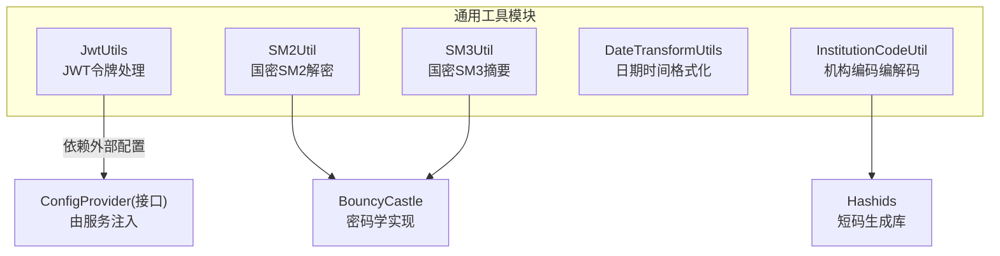
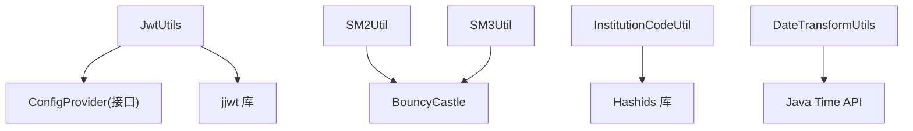
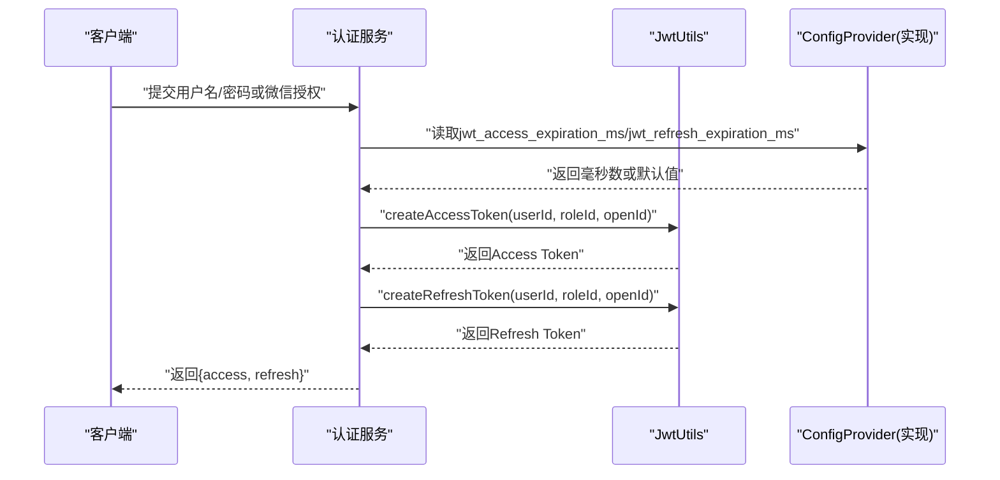
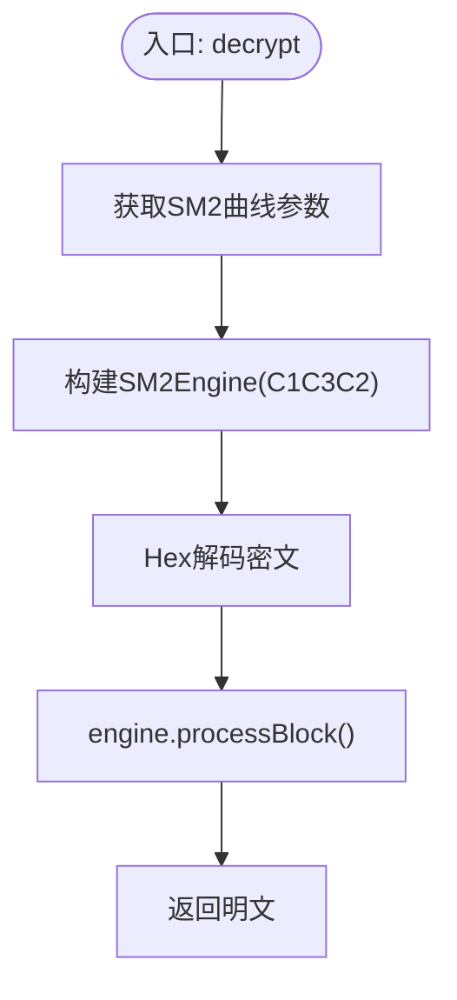
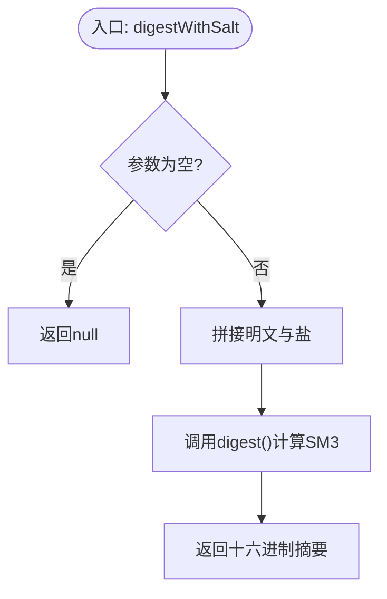
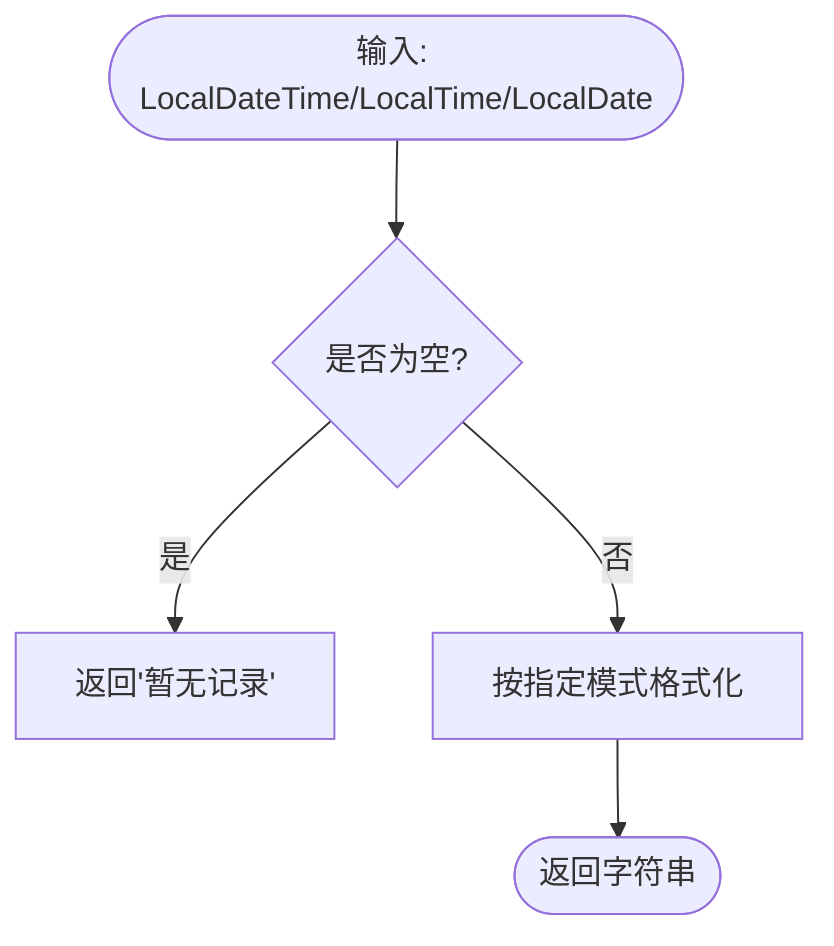
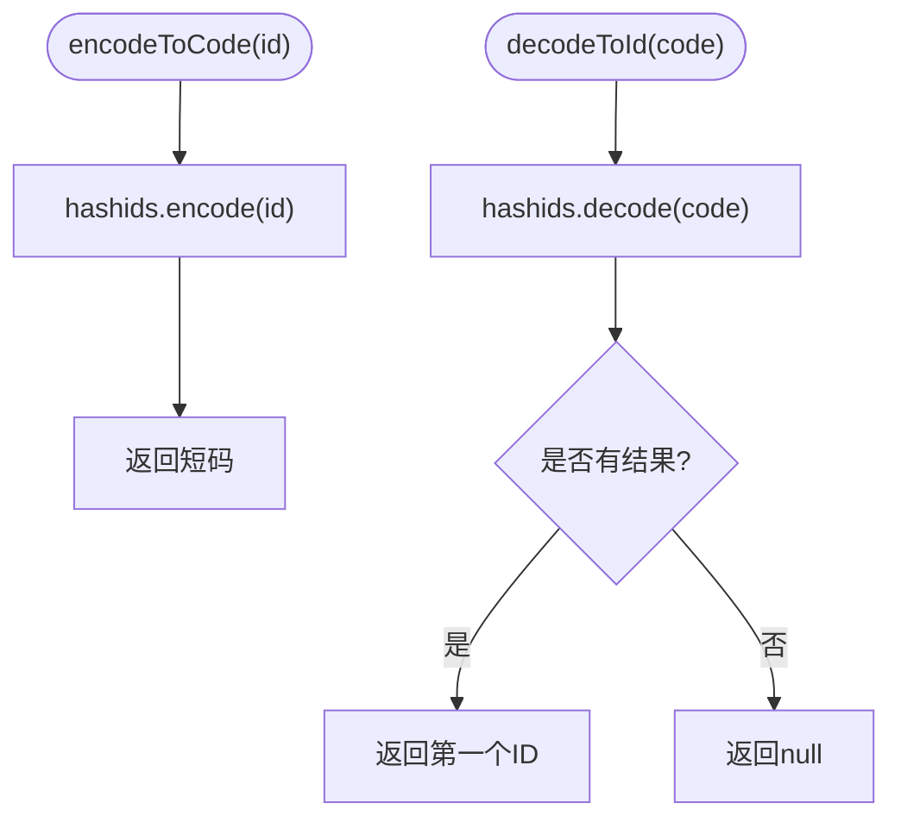
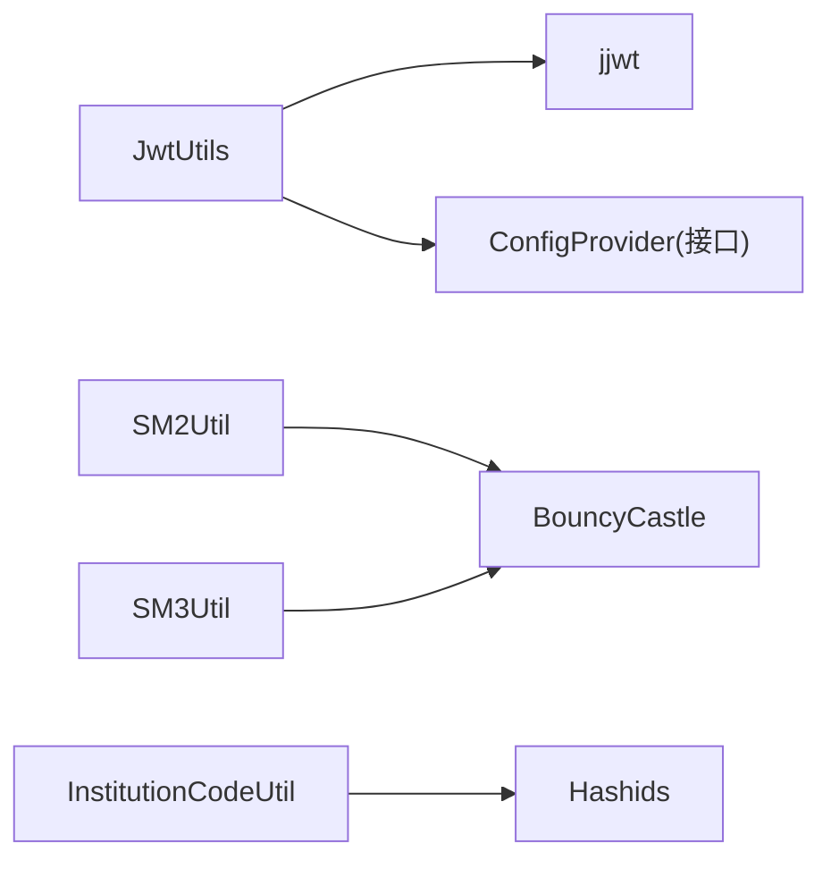

# 工具类库

<cite>
**本文引用的文件**
- [JwtUtils.java](file://class_times_record_back/common/src/main/java/com/shiroko/util/JwtUtils.java)
- [SM2Util.java](file://class_times_record_back/common/src/main/java/com/shiroko/util/SM2Util.java)
- [SM3Util.java](file://class_times_record_back/common/src/main/java/com/shiroko/util/SM3Util.java)
- [DateTransformUtils.java](file://class_times_record_back/common/src/main/java/com/shiroko/util/DateTransformUtils.java)
- [InstitutionCodeUtil.java](file://class_times_record_back/common/src/main/java/com/shiroko/util/InstitutionCodeUtil.java)
</cite>

## 目录
1. [简介](#简介)
2. [项目结构](#项目结构)
3. [核心组件](#核心组件)
4. [架构总览](#架构总览)
5. [详细组件分析](#详细组件分析)
6. [依赖关系分析](#依赖关系分析)
7. [性能与线程安全](#性能与线程安全)
8. [故障排查指南](#故障排查指南)
9. [结论](#结论)
10. [附录：集成与扩展指南](#附录集成与扩展指南)

## 简介
本仓库后端通用模块提供一组稳定、可复用的工具类，覆盖身份令牌处理、国密算法、日期时间格式化以及机构编码生成等常见能力。这些工具类被多个服务模块复用，具备以下特点：
- 面向接口设计：通过配置提供者解耦具体实现，便于在不同环境动态调整参数。
- 无状态或低状态：工具方法尽量保持无状态，提升并发安全性与可测试性。
- 统一异常与错误处理：对关键路径进行健壮的错误捕获与降级策略。
- 易于扩展：遵循单一职责原则，新增工具类时可直接纳入 common 模块供各服务使用。

## 项目结构
工具类集中于后端通用模块的 util 包中，按功能域划分清晰，便于定位与维护。下图展示了工具类在模块中的位置及相互关系（概念图）。

[此图为概念示意，不直接映射到具体源码文件]

## 核心组件
本节概述各工具类的职责与典型用法，后续章节将深入方法与调用流程。

- JwtUtils：支持双 Token（Access + Refresh）的签发、校验与解析；过期时间可通过运行时配置动态获取并回退默认值。
- SM2Util：基于 BouncyCastle 的 SM2 解密，适配新国标模式，用于前端加密数据在后端的解密。
- SM3Util：提供 SM3 摘要计算与校验，支持带盐版本，适合密码存储与完整性校验。
- DateTransformUtils：封装 LocalDateTime/LocalTime/LocalDate 的统一格式化输出，空值友好。
- InstitutionCodeUtil：基于 Hashids 的 ID 编解码，生成不可猜测的短码用于对外暴露的机构标识。

**章节来源**
- [JwtUtils.java:1-213](file://class_times_record_back/common/src/main/java/com/shiroko/util/JwtUtils.java#L1-L213)
- [SM2Util.java:1-61](file://class_times_record_back/common/src/main/java/com/shiroko/util/SM2Util.java#L1-L61)
- [SM3Util.java:1-85](file://class_times_record_back/common/src/main/java/com/shiroko/util/SM3Util.java#L1-L85)
- [DateTransformUtils.java:1-58](file://class_times_record_back/common/src/main/java/com/shiroko/util/DateTransformUtils.java#L1-L58)
- [InstitutionCodeUtil.java:1-47](file://class_times_record_back/common/src/main/java/com/shiroko/util/InstitutionCodeUtil.java#L1-L47)

## 架构总览
下图展示工具类之间的依赖关系与外部库集成点。

**图表来源**
- [JwtUtils.java:1-213](file://class_times_record_back/common/src/main/java/com/shiroko/util/JwtUtils.java#L1-L213)
- [SM2Util.java:1-61](file://class_times_record_back/common/src/main/java/com/shiroko/util/SM2Util.java#L1-L61)
- [SM3Util.java:1-85](file://class_times_record_back/common/src/main/java/com/shiroko/util/SM3Util.java#L1-L85)
- [DateTransformUtils.java:1-58](file://class_times_record_back/common/src/main/java/com/shiroko/util/DateTransformUtils.java#L1-L58)
- [InstitutionCodeUtil.java:1-47](file://class_times_record_back/common/src/main/java/com/shiroko/util/InstitutionCodeUtil.java#L1-L47)

## 详细组件分析

### JwtUtils（JWT 工具类）
- 设计要点
  - 双 Token 机制：Access Token 短期有效，Refresh Token 长期有效，类型字段区分。
  - 配置解耦：通过 ConfigProvider 接口读取过期时间，失败时回退硬编码默认值。
  - 签名算法：HS256，密钥为固定字符串（生产建议替换为环境变量或配置中心）。
- 核心方法
  - createAccessToken(userId, roleId, openId)：生成 Access Token。
  - createRefreshToken(userId, roleId, openId)：生成 Refresh Token。
  - validateAccessToken(token) / validateRefreshToken(token)：校验 Token 类型与有效性。
  - parseClaims(token)：解析 Claims。
  - getUserInfoFromToken(token) / getUserInfoFromRefreshToken(token)：提取用户信息。
- 参数与返回
  - 输入：userId(Long)、roleId(Long)、openId(String，可为空)。
  - 输出：String（Token）、boolean（是否有效）、Map<String,Object>（Claims）。
- 线程安全
  - 静态 Key 对象与内部 volatile 配置引用，方法无共享可变状态，线程安全。
- 使用示例（说明性）
  - 登录成功后同时签发 Access 与 Refresh Token，并在鉴权过滤器中验证 Access Token。
  - Access Token 过期后，使用 Refresh Token 换取新的 Access Token。
- 集成方式
  - 在服务启动时注入 ConfigProvider 实现，使过期时间可从数据库/缓存动态读取。

**图表来源**
- [JwtUtils.java:106-149](file://class_times_record_back/common/src/main/java/com/shiroko/util/JwtUtils.java#L106-L149)
- [JwtUtils.java:76-104](file://class_times_record_back/common/src/main/java/com/shiroko/util/JwtUtils.java#L76-L104)

**章节来源**
- [JwtUtils.java:1-213](file://class_times_record_back/common/src/main/java/com/shiroko/util/JwtUtils.java#L1-L213)

### SM2Util（国密 SM2 工具类）
- 设计要点
  - 仅包含解密能力，适配新国标模式（C1C3C2），与前端 sm-crypto 默认模式一致。
  - 使用 BouncyCastle 提供的 SM2Engine 完成加解密。
- 核心方法
  - decrypt(cipherTextHex, privateKeyHex)：十六进制密文与私钥，返回明文。
- 参数与返回
  - 输入：cipherTextHex(String)、privateKeyHex(String)，均为十六进制字符串。
  - 输出：String（明文）。
- 线程安全
  - 方法内创建引擎实例，无共享可变状态，线程安全。
- 使用示例（说明性）
  - 前端使用公钥加密敏感数据（如手机号），后端使用私钥解密。
- 集成方式
  - 确保引入 BouncyCastle 依赖，并将私钥以十六进制形式安全存储。

**图表来源**
- [SM2Util.java:28-42](file://class_times_record_back/common/src/main/java/com/shiroko/util/SM2Util.java#L28-L42)
- [SM2Util.java:44-59](file://class_times_record_back/common/src/main/java/com/shiroko/util/SM2Util.java#L44-L59)

**章节来源**
- [SM2Util.java:1-61](file://class_times_record_back/common/src/main/java/com/shiroko/util/SM2Util.java#L1-L61)

### SM3Util（国密 SM3 工具类）
- 设计要点
  - 静态块注册 BouncyCastle 提供者，避免重复初始化。
  - 提供基础摘要与带盐摘要两种模式，推荐密码存储使用带盐版本。
- 核心方法
  - digest(srcData)：计算 SM3 摘要（十六进制）。
  - digestWithSalt(srcData, salt)：结合随机盐计算摘要。
  - verify(srcData, hashData)：比对明文与哈希值。
- 参数与返回
  - 输入：srcData(String)、salt(String，可选)。
  - 输出：String（摘要）、boolean（是否匹配）。
- 线程安全
  - 无共享可变状态，方法线程安全。
- 使用示例（说明性）
  - 注册时生成随机盐，计算 SM3(明文+盐) 存入数据库；登录时重新计算并比对。
- 集成方式
  - 确保 BouncyCastle 依赖可用；盐值需独立存储并与用户记录关联。

**图表来源**
- [SM3Util.java:45-49](file://class_times_record_back/common/src/main/java/com/shiroko/util/SM3Util.java#L45-L49)
- [SM3Util.java:32-37](file://class_times_record_back/common/src/main/java/com/shiroko/util/SM3Util.java#L32-L37)

**章节来源**
- [SM3Util.java:1-85](file://class_times_record_back/common/src/main/java/com/shiroko/util/SM3Util.java#L1-L85)

### DateTransformUtils（日期时间转换工具类）
- 设计要点
  - 针对 LocalDateTime、LocalTime、LocalDate 分别提供统一格式化方法。
  - 空值友好：返回“暂无记录”占位文本。
- 核心方法
  - dateTimeToString(dateTime)：格式化为 yyyy-MM-dd HH:mm:ss。
  - timeToString(time)：格式化为 HH:mm:ss。
  - dateToString(date)：格式化为 yyyy-MM-dd。
- 参数与返回
  - 输入：对应 Java Time 对象。
  - 输出：String（格式化结果）。
- 线程安全
  - 方法内构造 DateTimeFormatter，无共享可变状态，线程安全。
- 使用示例（说明性）
  - 在序列化响应时将时间字段转换为统一字符串格式，便于前端展示。
- 集成方式
  - 可在 JSON 序列化层注册自定义转换器或直接调用该方法。

**图表来源**
- [DateTransformUtils.java:21-31](file://class_times_record_back/common/src/main/java/com/shiroko/util/DateTransformUtils.java#L21-L31)
- [DateTransformUtils.java:34-43](file://class_times_record_back/common/src/main/java/com/shiroko/util/DateTransformUtils.java#L34-L43)
- [DateTransformUtils.java:46-56](file://class_times_record_back/common/src/main/java/com/shiroko/util/DateTransformUtils.java#L46-L56)

**章节来源**
- [DateTransformUtils.java:1-58](file://class_times_record_back/common/src/main/java/com/shiroko/util/DateTransformUtils.java#L1-L58)

### InstitutionCodeUtil（机构编码工具类）
- 设计要点
  - 基于 Hashids 将自增 ID 编码为短码，降低枚举风险。
  - 固定盐与字符集保证同一 ID 始终得到相同短码。
- 核心方法
  - encodeToCode(institutionId)：ID → 短码。
  - decodeToId(code)：短码 → ID（失败返回 null）。
- 参数与返回
  - 输入：Long（ID）或 String（短码）。
  - 输出：String（短码）或 Long（ID）。
- 线程安全
  - Hashids 实例为静态常量，方法无共享可变状态，线程安全。
- 使用示例（说明性）
  - 对外 API 返回机构短码；接收短码后解码为真实 ID 查询数据库。
- 集成方式
  - 确保引入 Hashids 依赖；盐值变更会导致历史短码失效，需谨慎维护。

**图表来源**
- [InstitutionCodeUtil.java:32-34](file://class_times_record_back/common/src/main/java/com/shiroko/util/InstitutionCodeUtil.java#L32-L34)
- [InstitutionCodeUtil.java:39-45](file://class_times_record_back/common/src/main/java/com/shiroko/util/InstitutionCodeUtil.java#L39-L45)

**章节来源**
- [InstitutionCodeUtil.java:1-47](file://class_times_record_back/common/src/main/java/com/shiroko/util/InstitutionCodeUtil.java#L1-L47)

## 依赖关系分析
- 外部库
  - jjwt：JWT 签发与解析。
  - BouncyCastle：SM2/SM3 算法实现。
  - Hashids：短码生成与解析。
- 耦合度
  - JwtUtils 通过 ConfigProvider 接口解耦配置来源，降低模块间耦合。
  - 其他工具类均无业务耦合，属于纯工具层。

**图表来源**
- [JwtUtils.java:1-213](file://class_times_record_back/common/src/main/java/com/shiroko/util/JwtUtils.java#L1-L213)
- [SM2Util.java:1-61](file://class_times_record_back/common/src/main/java/com/shiroko/util/SM2Util.java#L1-L61)
- [SM3Util.java:1-85](file://class_times_record_back/common/src/main/java/com/shiroko/util/SM3Util.java#L1-L85)
- [InstitutionCodeUtil.java:1-47](file://class_times_record_back/common/src/main/java/com/shiroko/util/InstitutionCodeUtil.java#L1-L47)

**章节来源**
- [JwtUtils.java:1-213](file://class_times_record_back/common/src/main/java/com/shiroko/util/JwtUtils.java#L1-L213)
- [SM2Util.java:1-61](file://class_times_record_back/common/src/main/java/com/shiroko/util/SM2Util.java#L1-L61)
- [SM3Util.java:1-85](file://class_times_record_back/common/src/main/java/com/shiroko/util/SM3Util.java#L1-L85)
- [InstitutionCodeUtil.java:1-47](file://class_times_record_back/common/src/main/java/com/shiroko/util/InstitutionCodeUtil.java#L1-L47)

## 性能与线程安全
- 线程安全
  - 所有工具方法均为无状态或仅访问不可变静态资源，满足多线程并发调用需求。
- 性能特征
  - SM3 摘要计算为 CPU 密集型操作，建议在批量场景下考虑异步化或批处理。
  - SM2 解密涉及椭圆曲线运算，开销高于对称加密，应限制高频调用频率。
  - JWT 签发/解析为轻量级操作，注意避免在热点路径频繁重建解析器（当前实现每次解析新建解析器，可按需优化为复用）。
- 建议
  - 对高 QPS 场景，可将解析器实例缓存或使用线程局部变量减少对象创建。
  - 对 SM3/SM2 调用进行限流与熔断保护，防止雪崩。

[本节为通用指导，不直接分析具体文件]

## 故障排查指南
- JWT 相关
  - 现象：Token 无效或解析失败。
  - 排查：检查签名密钥一致性、tokenType 字段是否正确、过期时间配置是否生效。
  - 参考：[JwtUtils.java:151-175](file://class_times_record_back/common/src/main/java/com/shiroko/util/JwtUtils.java#L151-L175)
- SM2 解密
  - 现象：抛出运行时异常提示解密失败。
  - 排查：确认前端加密模式与新国标一致（C1C3C2），核对私钥十六进制格式。
  - 参考：[SM2Util.java:28-42](file://class_times_record_back/common/src/main/java/com/shiroko/util/SM2Util.java#L28-L42)
- SM3 校验
  - 现象：密码校验失败。
  - 排查：确认盐值是否与存储一致，比较时使用 digestWithSalt 而非 digest。
  - 参考：[SM3Util.java:45-49](file://class_times_record_back/common/src/main/java/com/shiroko/util/SM3Util.java#L45-L49)
- 机构编码
  - 现象：短码无法解码或解码结果为空。
  - 排查：确认盐值未变更、字符集一致、传入短码未被篡改。
  - 参考：[InstitutionCodeUtil.java:39-45](file://class_times_record_back/common/src/main/java/com/shiroko/util/InstitutionCodeUtil.java#L39-L45)

**章节来源**
- [JwtUtils.java:151-175](file://class_times_record_back/common/src/main/java/com/shiroko/util/JwtUtils.java#L151-L175)
- [SM2Util.java:28-42](file://class_times_record_back/common/src/main/java/com/shiroko/util/SM2Util.java#L28-L42)
- [SM3Util.java:45-49](file://class_times_record_back/common/src/main/java/com/shiroko/util/SM3Util.java#L45-L49)
- [InstitutionCodeUtil.java:39-45](file://class_times_record_back/common/src/main/java/com/shiroko/util/InstitutionCodeUtil.java#L39-L45)

## 结论
本工具类库围绕身份认证、数据安全、时间格式化与标识生成四大领域提供了稳定可靠的实现。通过接口解耦与无状态设计，工具类具备良好的可测试性与可扩展性。建议在生产环境中完善密钥管理、配置中心接入与监控告警，进一步提升系统的安全性与可观测性。

[本节为总结性内容，不直接分析具体文件]

## 附录：集成与扩展指南
- 集成步骤
  - 在服务的启动阶段注入 JwtUtils.ConfigProvider 实现，使其从数据库或缓存读取 JWT 过期时间。
  - 在需要加解密的地方调用 SM2Util/SM3Util，并确保 BouncyCastle 依赖正确引入。
  - 对外暴露的机构标识使用 InstitutionCodeUtil 进行编解码，避免直接暴露自增 ID。
  - 在响应序列化层统一使用 DateTransformUtils 格式化时间字段。
- 扩展建议
  - 新增工具类时遵循无状态原则，必要时提供工厂或单例模式管理外部资源。
  - 对耗时操作增加超时与重试策略，避免阻塞主流程。
  - 为工具类编写单元测试，覆盖边界条件与异常路径。

[本节为通用指导，不直接分析具体文件]