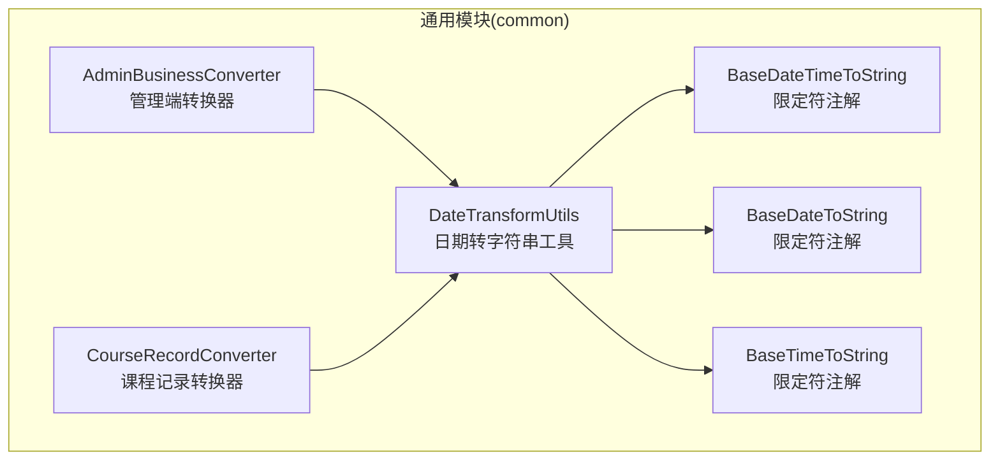
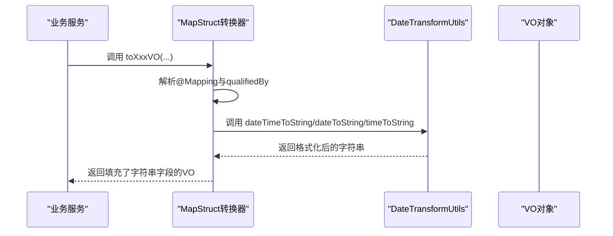
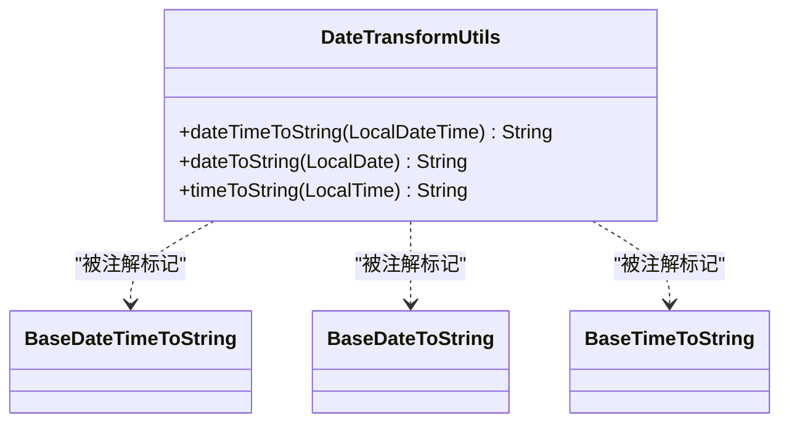

# 日期时间处理工具类

<cite>
**本文引用的文件**
- [DateTransformUtils.java](file://class_times_record_back/common/src/main/java/com/shiroko/util/DateTransformUtils.java)
- [BaseDateTimeToString.java](file://class_times_record_back/common/src/main/java/com/shiroko/annotation/BaseDateTimeToString.java)
- [BaseDateToString.java](file://class_times_record_back/common/src/main/java/com/shiroko/annotation/BaseDateToString.java)
- [BaseTimeToString.java](file://class_times_record_back/common/src/main/java/com/shiroko/annotation/BaseTimeToString.java)
- [AdminBusinessConverter.java](file://class_times_record_back/common/src/main/java/com/shiroko/converter/AdminBusinessConverter.java)
- [CourseRecordConverter.java](file://class_times_record_back/common/src/main/java/com/shiroko/converter/CourseRecordConverter.java)
</cite>

## 目录
1. [简介](#简介)
2. [项目结构](#项目结构)
3. [核心组件](#核心组件)
4. [架构总览](#架构总览)
5. [详细组件分析](#详细组件分析)
6. [依赖关系分析](#依赖关系分析)
7. [性能与线程安全](#性能与线程安全)
8. [业务场景与最佳实践](#业务场景与最佳实践)
9. [故障排查指南](#故障排查指南)
10. [结论](#结论)

## 简介
本文件围绕课时记录系统中的日期时间处理工具类 DateTransformUtils，系统化说明其能力、使用方式与扩展方法。该工具类聚焦于将 Java 8 的 java.time 类型（LocalDateTime、LocalDate、LocalTime）统一格式化为字符串，并通过 MapStruct 注解限定符在转换器中自动应用，从而在课程时间、上课时间、请假时间等关键业务场景中提供一致的展示与输出。

## 项目结构
DateTransformUtils 位于通用模块 common 下，配合三个自定义注解 BaseDateTimeToString、BaseDateToString、BaseTimeToString，被多个 MapStruct 转换器引用，形成“注解 + 工具方法 + 转换器”的组合式日期格式化方案。

图表来源
- [DateTransformUtils.java:1-58](file://class_times_record_back/common/src/main/java/com/shiroko/util/DateTransformUtils.java#L1-L58)
- [BaseDateTimeToString.java:1-22](file://class_times_record_back/common/src/main/java/com/shiroko/annotation/BaseDateTimeToString.java#L1-L22)
- [BaseDateToString.java:1-22](file://class_times_record_back/common/src/main/java/com/shiroko/annotation/BaseDateToString.java#L1-L22)
- [BaseTimeToString.java:1-22](file://class_times_record_back/common/src/main/java/com/shiroko/annotation/BaseTimeToString.java#L1-L22)
- [AdminBusinessConverter.java:1-87](file://class_times_record_back/common/src/main/java/com/shiroko/converter/AdminBusinessConverter.java#L1-L87)
- [CourseRecordConverter.java:1-48](file://class_times_record_back/common/src/main/java/com/shiroko/converter/CourseRecordConverter.java#L1-L48)

章节来源
- [DateTransformUtils.java:1-58](file://class_times_record_back/common/src/main/java/com/shiroko/util/DateTransformUtils.java#L1-L58)
- [AdminBusinessConverter.java:1-87](file://class_times_record_back/common/src/main/java/com/shiroko/converter/AdminBusinessConverter.java#L1-L87)
- [CourseRecordConverter.java:1-48](file://class_times_record_back/common/src/main/java/com/shiroko/converter/CourseRecordConverter.java#L1-L48)

## 核心组件
- DateTransformUtils：提供三类静态方法，分别用于 LocalDateTime、LocalDate、LocalTime 到字符串的转换；空值返回统一提示文本。
- 注解限定符：BaseDateTimeToString、BaseDateToString、BaseTimeToString，作为 MapStruct 的 @Qualifier，声明在工具方法上，供转换器按类型选择对应格式化策略。
- 转换器集成：AdminBusinessConverter、CourseRecordConverter 通过 uses = {DateTransformUtils.class} 引入工具类，并在 @Mapping 中使用 qualifiedBy 指定具体格式化规则。

章节来源
- [DateTransformUtils.java:19-56](file://class_times_record_back/common/src/main/java/com/shiroko/util/DateTransformUtils.java#L19-L56)
- [BaseDateTimeToString.java:17-21](file://class_times_record_back/common/src/main/java/com/shiroko/annotation/BaseDateTimeToString.java#L17-L21)
- [BaseDateToString.java:17-21](file://class_times_record_back/common/src/main/java/com/shiroko/annotation/BaseDateToString.java#L17-L21)
- [BaseTimeToString.java:17-21](file://class_times_record_back/common/src/main/java/com/shiroko/annotation/BaseTimeToString.java#L17-L21)
- [AdminBusinessConverter.java:26-86](file://class_times_record_back/common/src/main/java/com/shiroko/converter/AdminBusinessConverter.java#L26-L86)
- [CourseRecordConverter.java:23-47](file://class_times_record_back/common/src/main/java/com/shiroko/converter/CourseRecordConverter.java#L23-L47)

## 架构总览
下图展示了从实体/DTO 到 VO 的转换流程，以及 DateTransformUtils 在其中的角色。MapStruct 在编译期生成实现类，运行时根据 @Mapping 的 qualifiedBy 调用对应的工具方法完成格式化。

图表来源
- [AdminBusinessConverter.java:26-86](file://class_times_record_back/common/src/main/java/com/shiroko/converter/AdminBusinessConverter.java#L26-L86)
- [CourseRecordConverter.java:23-47](file://class_times_record_back/common/src/main/java/com/shiroko/converter/CourseRecordConverter.java#L23-L47)
- [DateTransformUtils.java:20-56](file://class_times_record_back/common/src/main/java/com/shiroko/util/DateTransformUtils.java#L20-L56)

## 详细组件分析

### DateTransformUtils 工具类
- 功能要点
  - 支持三种 java.time 类型到字符串的转换：
    - LocalDateTime → yyyy-MM-dd HH:mm:ss
    - LocalDate → yyyy-MM-dd
    - LocalTime → HH:mm:ss
  - 空值处理：当输入为 null 时，返回统一的“暂无记录”提示，便于前端展示友好信息。
  - 无时区参数：方法未显式传入时区，默认使用系统默认时区进行格式化。
- 设计模式
  - 静态工具方法 + 注解限定符：通过 @Qualifier 标注的方法被 MapStruct 识别为特定类型的转换策略。
- 复杂度与性能
  - 每次调用都会创建新的 DateTimeFormatter 实例，存在重复创建开销。建议后续优化为缓存或复用常量格式化器。
- 线程安全性
  - 方法本身无共享可变状态，属于纯函数，具备线程安全性。但频繁创建格式化器会影响性能。

章节来源
- [DateTransformUtils.java:20-56](file://class_times_record_back/common/src/main/java/com/shiroko/util/DateTransformUtils.java#L20-L56)

#### 类与方法关系图

图表来源
- [DateTransformUtils.java:20-56](file://class_times_record_back/common/src/main/java/com/shiroko/util/DateTransformUtils.java#L20-L56)
- [BaseDateTimeToString.java:17-21](file://class_times_record_back/common/src/main/java/com/shiroko/annotation/BaseDateTimeToString.java#L17-L21)
- [BaseDateToString.java:17-21](file://class_times_record_back/common/src/main/java/com/shiroko/annotation/BaseDateToString.java#L17-L21)
- [BaseTimeToString.java:17-21](file://class_times_record_back/common/src/main/java/com/shiroko/annotation/BaseTimeToString.java#L17-L21)

### 注解限定符
- BaseDateTimeToString：用于标识 LocalDateTime 到字符串的转换方法。
- BaseDateToString：用于标识 LocalDate 到字符串的转换方法。
- BaseTimeToString：用于标识 LocalTime 到字符串的转换方法。
- 作用范围：仅作用于方法级别，作为 MapStruct 的限定符参与映射策略选择。

章节来源
- [BaseDateTimeToString.java:17-21](file://class_times_record_back/common/src/main/java/com/shiroko/annotation/BaseDateTimeToString.java#L17-L21)
- [BaseDateToString.java:17-21](file://class_times_record_back/common/src/main/java/com/shiroko/annotation/BaseDateToString.java#L17-L21)
- [BaseTimeToString.java:17-21](file://class_times_record_back/common/src/main/java/com/shiroko/annotation/BaseTimeToString.java#L17-L21)

### 转换器集成示例
- AdminBusinessConverter
  - 将机构、学生、教师、课程、班级、课表、课程记录、记录等实体的时间字段映射为带后缀 Str 的字符串字段，如 createTimeStr、updateTimeStr、expireTime、birthStr、startDateStr、endDateStr、startTimeStr、endTimeStr、courseLastTimeStr、recordTimeStr 等。
  - 通过 @Mapping(..., qualifiedBy = BaseDateTimeToString.class / BaseDateToString.class / BaseTimeToString.class) 指定具体的格式化策略。
- CourseRecordConverter
  - 针对课程记录的 expireTime、createTime、updateTime、courseLastTime 等字段，映射为对应的 Str 字符串字段，并同样使用限定符指定格式化方法。

章节来源
- [AdminBusinessConverter.java:26-86](file://class_times_record_back/common/src/main/java/com/shiroko/converter/AdminBusinessConverter.java#L26-L86)
- [CourseRecordConverter.java:23-47](file://class_times_record_back/common/src/main/java/com/shiroko/converter/CourseRecordConverter.java#L23-L47)

## 依赖关系分析
- 直接依赖
  - DateTransformUtils 依赖 java.time 包中的 LocalDate、LocalDateTime、LocalTime 与 DateTimeFormatter。
  - 转换器依赖 DateTransformUtils，并通过 MapStruct 的 uses 机制注入。
- 间接依赖
  - 各业务服务层通过调用转换器，间接使用 DateTransformUtils 完成时间字段的字符串化。
- 耦合与内聚
  - 工具类职责单一、内聚度高；转换器通过注解限定符解耦具体格式化逻辑，具备良好的可维护性。

图表来源
- [AdminBusinessConverter.java:26-86](file://class_times_record_back/common/src/main/java/com/shiroko/converter/AdminBusinessConverter.java#L26-L86)
- [CourseRecordConverter.java:23-47](file://class_times_record_back/common/src/main/java/com/shiroko/converter/CourseRecordConverter.java#L23-L47)
- [DateTransformUtils.java:20-56](file://class_times_record_back/common/src/main/java/com/shiroko/util/DateTransformUtils.java#L20-L56)

章节来源
- [AdminBusinessConverter.java:26-86](file://class_times_record_back/common/src/main/java/com/shiroko/converter/AdminBusinessConverter.java#L26-L86)
- [CourseRecordConverter.java:23-47](file://class_times_record_back/common/src/main/java/com/shiroko/converter/CourseRecordConverter.java#L23-L47)
- [DateTransformUtils.java:20-56](file://class_times_record_back/common/src/main/java/com/shiroko/util/DateTransformUtils.java#L20-L56)

## 性能与线程安全
- 线程安全
  - 工具方法无共享可变状态，属于纯函数，线程安全。
- 性能考量
  - 当前实现每次调用都新建 DateTimeFormatter，存在不必要的对象分配。建议在工具类中定义静态常量格式化器，或在单例中缓存，以减少 GC 压力。
- 时区问题
  - 当前方法未显式设置时区，默认使用系统默认时区。若系统部署在多时区环境或需要固定 UTC 展示，应引入 ZoneId 参数或使用带时区的格式化器。

[本节为通用指导，不直接分析具体文件]

## 业务场景与最佳实践
- 课时记录系统中的应用
  - 课程时间：课程开始/结束时间、有效期等字段在 VO 中以字符串形式展示，提升可读性。
  - 上课时间：课表的 startTime、endTime 以时分秒格式输出，便于排课与提醒。
  - 请假时间：记录时间与过期时间统一格式化，保证报表与列表展示一致。
- 使用方法
  - 在转换器中通过 @Mapping(target="xxxStr", source="xxx", qualifiedBy=...) 指定格式化策略。
  - 新增字段时，遵循现有命名约定（原字段名 + “Str”），保持前后端契约一致。
- 扩展指导
  - 新增自定义格式：在 DateTransformUtils 中增加新方法并用新的注解限定符标注，同时在转换器中配置 @Mapping 使用新限定符。
  - 国际化与本地化：如需多语言显示，可在上层结合 Locale 进行二次包装。
  - 时区统一：建议引入全局时区配置，在工具方法中统一应用。

[本节为通用指导，不直接分析具体文件]

## 故障排查指南
- 常见问题
  - 字段为空导致展示异常：确认源字段是否为 null；工具类已对 null 返回“暂无记录”，确保前端能正确渲染。
  - 格式化结果不符合预期：检查转换器中 @Mapping 的 target 与 source 是否匹配，以及 qualifiedBy 是否指向正确的限定符。
  - 时区不一致：若发现时间相差若干小时，需检查系统默认时区或考虑引入显式时区参数。
- 定位步骤
  - 查看转换器中对应字段的 @Mapping 配置，确认限定符与目标字段名。
  - 核对工具类中对应方法的格式化模板是否与需求一致。
  - 在日志中打印原始时间值与格式化后字符串，快速定位差异来源。

章节来源
- [AdminBusinessConverter.java:26-86](file://class_times_record_back/common/src/main/java/com/shiroko/converter/AdminBusinessConverter.java#L26-L86)
- [CourseRecordConverter.java:23-47](file://class_times_record_back/common/src/main/java/com/shiroko/converter/CourseRecordConverter.java#L23-L47)
- [DateTransformUtils.java:20-56](file://class_times_record_back/common/src/main/java/com/shiroko/util/DateTransformUtils.java#L20-L56)

## 结论
DateTransformUtils 以简洁的方式统一了 java.time 类型到字符串的格式化逻辑，并通过 MapStruct 注解限定符实现了与转换器的松耦合集成。在当前项目中，它有效支撑了课程时间、上课时间、请假时间等关键业务场景的展示需求。后续可从性能与时区两方面进一步优化：缓存格式化器以提升吞吐，引入显式时区参数以确保跨时区一致性。

[本节为总结性内容，不直接分析具体文件]