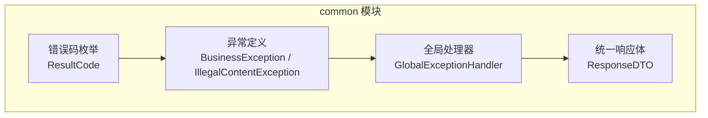
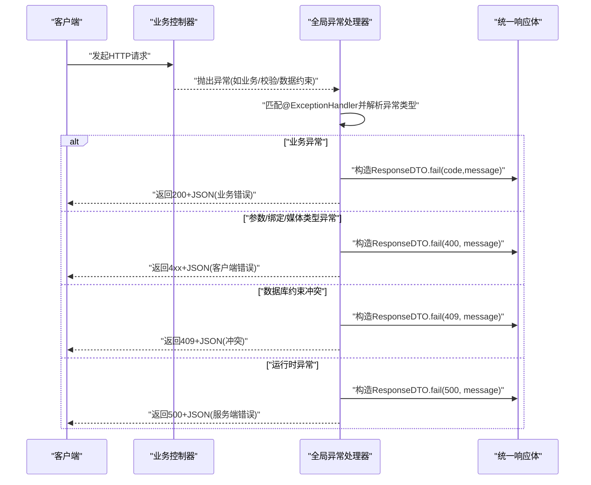
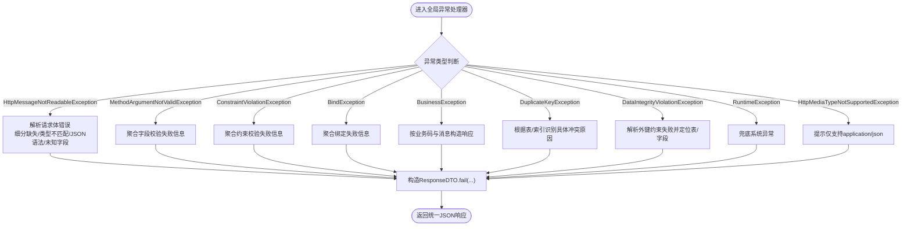
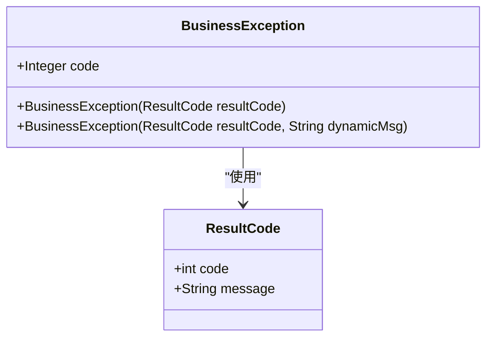
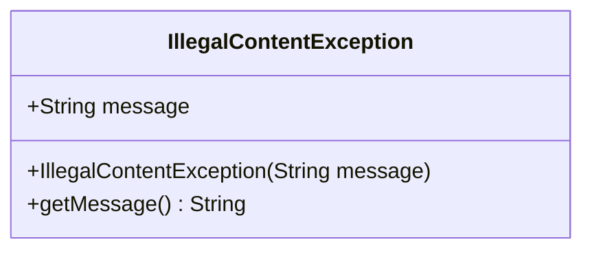
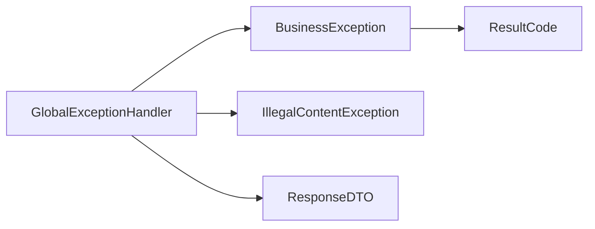

# 异常处理机制

<cite>
**本文引用的文件**
- [GlobalExceptionHandler.java](file://class_times_record_back/common/src/main/java/com/shiroko/exception/handler/GlobalExceptionHandler.java)
- [BusinessException.java](file://class_times_record_back/common/src/main/java/com/shiroko/exception/BusinessException.java)
- [IllegalContentException.java](file://class_times_record_back/common/src/main/java/com/shiroko/exception/IllegalContentException.java)
- [ResultCode.java](file://class_times_record_back/common/src/main/java/com/shiroko/common/enums/ResultCode.java)
- [ResponseDTO.java](file://class_times_record_back/common/src/main/java/com/shiroko/repository/dto/ResponseDTO.java)
</cite>

## 目录
1. [引言](#引言)
2. [项目结构](#项目结构)
3. [核心组件](#核心组件)
4. [架构总览](#架构总览)
5. [详细组件分析](#详细组件分析)
6. [依赖关系分析](#依赖关系分析)
7. [性能与可观测性](#性能与可观测性)
8. [故障排查指南](#故障排查指南)
9. [结论](#结论)
10. [附录：最佳实践与示例](#附录最佳实践与示例)

## 引言
本文件面向后端开发者，系统化阐述课程记录系统（course_record）后端的统一异常处理机制。内容覆盖自定义异常类、全局异常处理器的工作流程、错误码枚举规范、响应体格式统一、以及常见场景的抛出与处理示例。目标是帮助团队在业务层与服务层形成一致的异常语义、统一的错误响应格式和清晰的排障路径。

## 项目结构
异常处理相关代码集中在 common 模块中，采用“异常定义 + 全局处理器 + 统一响应体 + 错误码枚举”的分层组织方式：
- 异常定义：BusinessException、IllegalContentException
- 全局处理器：GlobalExceptionHandler
- 统一响应体：ResponseDTO
- 错误码枚举：ResultCode

图表来源
- [GlobalExceptionHandler.java:1-370](file://class_times_record_back/common/src/main/java/com/shiroko/exception/handler/GlobalExceptionHandler.java#L1-L370)
- [BusinessException.java:1-34](file://class_times_record_back/common/src/main/java/com/shiroko/exception/BusinessException.java#L1-L34)
- [IllegalContentException.java:1-23](file://class_times_record_back/common/src/main/java/com/shiroko/exception/IllegalContentException.java#L1-L23)
- [ResultCode.java:1-29](file://class_times_record_back/common/src/main/java/com/shiroko/common/enums/ResultCode.java#L1-L29)
- [ResponseDTO.java:1-50](file://class_times_record_back/common/src/main/java/com/shiroko/repository/dto/ResponseDTO.java#L1-L50)

章节来源
- [GlobalExceptionHandler.java:1-370](file://class_times_record_back/common/src/main/java/com/shiroko/exception/handler/GlobalExceptionHandler.java#L1-L370)
- [BusinessException.java:1-34](file://class_times_record_back/common/src/main/java/com/shiroko/exception/BusinessException.java#L1-L34)
- [IllegalContentException.java:1-23](file://class_times_record_back/common/src/main/java/com/shiroko/exception/IllegalContentException.java#L1-L23)
- [ResultCode.java:1-29](file://class_times_record_back/common/src/main/java/com/shiroko/common/enums/ResultCode.java#L1-L29)
- [ResponseDTO.java:1-50](file://class_times_record_back/common/src/main/java/com/shiroko/repository/dto/ResponseDTO.java#L1-L50)

## 核心组件
- 全局异常处理器 GlobalExceptionHandler：基于 @RestControllerAdvice 集中捕获并格式化各类异常，统一返回 ResponseDTO。
- 业务异常 BusinessException：携带 ResultCode 或动态消息，用于业务逻辑失败时的明确语义化抛错。
- 非法内容异常 IllegalContentException：用于参数包含敏感词/违规字符等非法内容的快速中断。
- 错误码枚举 ResultCode：集中维护业务状态码与默认消息，供业务异常使用。
- 统一响应体 ResponseDTO：封装 code、message、data、requestTime，保证前后端一致的错误响应结构。

章节来源
- [GlobalExceptionHandler.java:27-370](file://class_times_record_back/common/src/main/java/com/shiroko/exception/handler/GlobalExceptionHandler.java#L27-L370)
- [BusinessException.java:13-34](file://class_times_record_back/common/src/main/java/com/shiroko/exception/BusinessException.java#L13-L34)
- [IllegalContentException.java:10-23](file://class_times_record_back/common/src/main/java/com/shiroko/exception/IllegalContentException.java#L10-L23)
- [ResultCode.java:13-27](file://class_times_record_back/common/src/main/java/com/shiroko/common/enums/ResultCode.java#L13-L27)
- [ResponseDTO.java:20-49](file://class_times_record_back/common/src/main/java/com/shiroko/repository/dto/ResponseDTO.java#L20-L49)

## 架构总览
下图展示了请求进入控制器后，异常如何被全局处理器捕获、分类、映射为统一响应体的整体流程。

图表来源
- [GlobalExceptionHandler.java:37-370](file://class_times_record_back/common/src/main/java/com/shiroko/exception/handler/GlobalExceptionHandler.java#L37-L370)
- [ResponseDTO.java:30-49](file://class_times_record_back/common/src/main/java/com/shiroko/repository/dto/ResponseDTO.java#L30-L49)

## 详细组件分析

### 全局异常处理器 GlobalExceptionHandler
职责与特性
- 使用 @RestControllerAdvice 确保所有控制器异常均被拦截，并以 JSON 形式返回。
- 针对多种异常提供专用处理方法，包括：
  - 请求体不可读/非法JSON：HttpMessageNotReadableException
  - 参数校验异常：MethodArgumentNotValidException、BindException、ConstraintViolationException
  - 业务异常：BusinessException
  - 数据重复冲突：DuplicateKeyException
  - 外键/完整性约束失败：DataIntegrityViolationException
  - 运行时异常：RuntimeException
  - 媒体类型不支持：HttpMediaTypeNotSupportedException
- 对部分异常进行友好信息提取与提示（如字段名、期望类型、行号列号、未知字段等）。
- 统一通过 ResponseDTO.fail(...) 构造错误响应，并设置合适的 HTTP 状态码。

关键处理分支说明
- HttpMessageNotReadableException：根据原始错误信息区分缺失请求体、类型不匹配、反序列化失败、JSON语法错误、未知字段等，分别给出更友好的提示。
- MethodArgumentNotValidException：聚合字段校验失败信息，以“字段名: 错误消息”的形式拼接。
- ConstraintViolationException：从属性路径中提取最后一段作为字段名，拼接错误消息。
- BindException：聚合表单/查询参数绑定失败信息。
- DuplicateKeyException：根据根因信息中的表名/索引名，返回具体冲突原因，并返回 409。
- DataIntegrityViolationException：解析外键约束失败信息，尝试定位子表和字段，返回 400。
- RuntimeException：兜底捕获未处理异常，返回 500。
- HttpMediaTypeNotSupportedException：提示仅支持 application/json。

图表来源
- [GlobalExceptionHandler.java:37-370](file://class_times_record_back/common/src/main/java/com/shiroko/exception/handler/GlobalExceptionHandler.java#L37-L370)
- [ResponseDTO.java:30-49](file://class_times_record_back/common/src/main/java/com/shiroko/repository/dto/ResponseDTO.java#L30-L49)

章节来源
- [GlobalExceptionHandler.java:37-370](file://class_times_record_back/common/src/main/java/com/shiroko/exception/handler/GlobalExceptionHandler.java#L37-L370)

### 业务异常 BusinessException
设计要点
- 继承 RuntimeException，便于在任意层级抛出并被全局处理器捕获。
- 内置 code 字段，来源于 ResultCode 或动态传入，配合全局处理器返回统一业务错误码。
- 提供两种构造方式：
  - 基于 ResultCode 的默认消息
  - 基于 ResultCode 与动态消息的组合，便于上下文化提示（如“学生[张三]余额不足”）

图表来源
- [BusinessException.java:13-34](file://class_times_record_back/common/src/main/java/com/shiroko/exception/BusinessException.java#L13-L34)
- [ResultCode.java:13-27](file://class_times_record_back/common/src/main/java/com/shiroko/common/enums/ResultCode.java#L13-L27)

章节来源
- [BusinessException.java:13-34](file://class_times_record_back/common/src/main/java/com/shiroko/exception/BusinessException.java#L13-L34)
- [ResultCode.java:13-27](file://class_times_record_back/common/src/main/java/com/shiroko/common/enums/ResultCode.java#L13-L27)

### 非法内容异常 IllegalContentException
设计要点
- 用于参数包含敏感词/违规字符等非法内容的快速中断。
- 直接携带 message，适合在参数清洗/过滤阶段抛出，交由上层统一处理。

图表来源
- [IllegalContentException.java:10-23](file://class_times_record_back/common/src/main/java/com/shiroko/exception/IllegalContentException.java#L10-L23)

章节来源
- [IllegalContentException.java:10-23](file://class_times_record_back/common/src/main/java/com/shiroko/exception/IllegalContentException.java#L10-L23)

### 错误码枚举 ResultCode
设计要点
- 集中管理业务状态码与默认消息，避免散落的魔法值。
- 提供 code 与 message 两个字段，供业务异常直接使用。
- 建议新增错误码时遵循“领域+场景”命名约定，保持可读性与可扩展性。

章节来源
- [ResultCode.java:13-27](file://class_times_record_back/common/src/main/java/com/shiroko/common/enums/ResultCode.java#L13-L27)

### 统一响应体 ResponseDTO
设计要点
- 统一字段：code、message、data、requestTime。
- 提供 success/fail 静态工厂方法，简化调用方构造。
- 全局异常处理器统一使用 fail 方法返回错误响应，保证前端一致性。

章节来源
- [ResponseDTO.java:20-49](file://class_times_record_back/common/src/main/java/com/shiroko/repository/dto/ResponseDTO.java#L20-L49)

## 依赖关系分析
- GlobalExceptionHandler 依赖：
  - 异常类型：BusinessException、IllegalContentException、Spring 校验/绑定/媒体类型异常、JPA/Hibernate 数据访问异常等。
  - 统一响应体：ResponseDTO。
  - 日志：SLF4J Logger。
- BusinessException 依赖：
  - ResultCode 枚举。
- IllegalContentException 独立，无外部依赖。
- ResultCode 独立，无外部依赖。
- ResponseDTO 独立，无外部依赖。

图表来源
- [GlobalExceptionHandler.java:1-370](file://class_times_record_back/common/src/main/java/com/shiroko/exception/handler/GlobalExceptionHandler.java#L1-L370)
- [BusinessException.java:1-34](file://class_times_record_back/common/src/main/java/com/shiroko/exception/BusinessException.java#L1-L34)
- [IllegalContentException.java:1-23](file://class_times_record_back/common/src/main/java/com/shiroko/exception/IllegalContentException.java#L1-L23)
- [ResultCode.java:1-29](file://class_times_record_back/common/src/main/java/com/shiroko/common/enums/ResultCode.java#L1-L29)
- [ResponseDTO.java:1-50](file://class_times_record_back/common/src/main/java/com/shiroko/repository/dto/ResponseDTO.java#L1-L50)

章节来源
- [GlobalExceptionHandler.java:1-370](file://class_times_record_back/common/src/main/java/com/shiroko/exception/handler/GlobalExceptionHandler.java#L1-L370)
- [BusinessException.java:1-34](file://class_times_record_back/common/src/main/java/com/shiroko/exception/BusinessException.java#L1-L34)
- [IllegalContentException.java:1-23](file://class_times_record_back/common/src/main/java/com/shiroko/exception/IllegalContentException.java#L1-L23)
- [ResultCode.java:1-29](file://class_times_record_back/common/src/main/java/com/shiroko/common/enums/ResultCode.java#L1-L29)
- [ResponseDTO.java:1-50](file://class_times_record_back/common/src/main/java/com/shiroko/repository/dto/ResponseDTO.java#L1-L50)

## 性能与可观测性
- 日志输出：全局处理器对关键异常路径使用 logger.error 记录完整堆栈，便于线上问题定位。
- 错误信息裁剪：对过长消息进行截断，避免响应过大。
- 结构化提示：对 JSON 解析错误、字段类型不匹配、未知字段等进行细粒度提示，减少往返调试成本。
- 建议：
  - 在高频路径上避免过度字符串拼接与正则解析，必要时将复杂解析逻辑下沉到工具类并缓存结果。
  - 对频繁出现的业务错误码增加监控指标，辅助容量规划与稳定性治理。

## 故障排查指南
常见问题与定位步骤
- 请求体缺失或 JSON 格式错误
  - 现象：返回 400，提示请求体缺失或 JSON 语法错误。
  - 排查：检查 Content-Type 是否为 application/json；确认请求体是否完整且符合 DTO 结构。
  - 参考：[GlobalExceptionHandler.java:37-69](file://class_times_record_back/common/src/main/java/com/shiroko/exception/handler/GlobalExceptionHandler.java#L37-L69)
- 字段类型不匹配或未知字段
  - 现象：返回 400，提示字段类型错误或未知字段。
  - 排查：对照 DTO 字段类型与必填项；移除多余字段。
  - 参考：[GlobalExceptionHandler.java:76-218](file://class_times_record_back/common/src/main/java/com/shiroko/exception/handler/GlobalExceptionHandler.java#L76-L218)
- 参数校验失败
  - 现象：返回 400，列出各字段校验失败信息。
  - 排查：检查 @Valid/@Validated 注解及字段约束。
  - 参考：[GlobalExceptionHandler.java:220-228](file://class_times_record_back/common/src/main/java/com/shiroko/exception/handler/GlobalExceptionHandler.java#L220-L228)、[GlobalExceptionHandler.java:341-364](file://class_times_record_back/common/src/main/java/com/shiroko/exception/handler/GlobalExceptionHandler.java#L341-L364)
- 业务异常
  - 现象：返回 200，但 code 为非 200 的业务错误码。
  - 排查：查看业务层抛出的 BusinessException 对应的 ResultCode 与消息。
  - 参考：[GlobalExceptionHandler.java:230-238](file://class_times_record_back/common/src/main/java/com/shiroko/exception/handler/GlobalExceptionHandler.java#L230-L238)
- 数据重复冲突
  - 现象：返回 409，提示具体冲突原因。
  - 排查：检查唯一索引/联合唯一约束涉及的字段组合。
  - 参考：[GlobalExceptionHandler.java:240-278](file://class_times_record_back/common/src/main/java/com/shiroko/exception/handler/GlobalExceptionHandler.java#L240-L278)
- 外键/完整性约束失败
  - 现象：返回 400，提示关联引用不存在。
  - 排查：确认父表记录是否存在，或先创建父记录再写子记录。
  - 参考：[GlobalExceptionHandler.java:280-329](file://class_times_record_back/common/src/main/java/com/shiroko/exception/handler/GlobalExceptionHandler.java#L280-L329)
- 运行时异常
  - 现象：返回 500，提示系统异常。
  - 排查：查看日志中的完整堆栈，定位 NPE、空指针、越界等。
  - 参考：[GlobalExceptionHandler.java:331-337](file://class_times_record_back/common/src/main/java/com/shiroko/exception/handler/GlobalExceptionHandler.java#L331-L337)

章节来源
- [GlobalExceptionHandler.java:37-370](file://class_times_record_back/common/src/main/java/com/shiroko/exception/handler/GlobalExceptionHandler.java#L37-L370)

## 结论
该异常处理机制通过“统一响应体 + 全局处理器 + 业务异常 + 错误码枚举”的组合，实现了跨模块一致的异常语义与错误响应格式。全局处理器对常见异常进行了精细化处理与友好提示，显著降低了前后端联调与线上排障成本。建议在业务层优先抛出 BusinessException 表达业务失败，结合 ResultCode 明确错误语义；对于非法内容与参数校验失败，使用对应异常或注解驱动校验，由全局处理器统一收敛。

## 附录：最佳实践与示例

### 最佳实践
- 在业务层遇到可预期的失败时，优先抛出 BusinessException，并使用 ResultCode 或动态消息描述原因。
- 对输入参数进行前置校验，利用 @Valid/@Validated 与自定义校验器，尽早失败。
- 对敏感内容/违规字符进行过滤或拒绝，抛出 IllegalContentException。
- 不要吞掉异常，尽量向上抛出，让全局处理器统一处理。
- 在日志中保留足够上下文（如用户ID、操作对象），但不要记录敏感信息。
- 新增错误码时，完善 ResultCode 枚举，并在业务层复用。

### 示例（路径指引）
- 抛出业务异常
  - 参考：[BusinessException.java:21-33](file://class_times_record_back/common/src/main/java/com/shiroko/exception/BusinessException.java#L21-L33)
- 抛出非法内容异常
  - 参考：[IllegalContentException.java:14-17](file://class_times_record_back/common/src/main/java/com/shiroko/exception/IllegalContentException.java#L14-L17)
- 全局处理器处理业务异常
  - 参考：[GlobalExceptionHandler.java:230-238](file://class_times_record_back/common/src/main/java/com/shiroko/exception/handler/GlobalExceptionHandler.java#L230-L238)
- 全局处理器处理参数校验异常
  - 参考：[GlobalExceptionHandler.java:220-228](file://class_times_record_back/common/src/main/java/com/shiroko/exception/handler/GlobalExceptionHandler.java#L220-L228)
- 全局处理器处理数据重复冲突
  - 参考：[GlobalExceptionHandler.java:240-278](file://class_times_record_back/common/src/main/java/com/shiroko/exception/handler/GlobalExceptionHandler.java#L240-L278)
- 全局处理器处理外键约束失败
  - 参考：[GlobalExceptionHandler.java:280-329](file://class_times_record_back/common/src/main/java/com/shiroko/exception/handler/GlobalExceptionHandler.java#L280-L329)
- 统一响应体构造
  - 参考：[ResponseDTO.java:38-44](file://class_times_record_back/common/src/main/java/com/shiroko/repository/dto/ResponseDTO.java#L38-L44)

章节来源
- [BusinessException.java:21-33](file://class_times_record_back/common/src/main/java/com/shiroko/exception/BusinessException.java#L21-L33)
- [IllegalContentException.java:14-17](file://class_times_record_back/common/src/main/java/com/shiroko/exception/IllegalContentException.java#L14-L17)
- [GlobalExceptionHandler.java:220-329](file://class_times_record_back/common/src/main/java/com/shiroko/exception/handler/GlobalExceptionHandler.java#L220-L329)
- [ResponseDTO.java:38-44](file://class_times_record_back/common/src/main/java/com/shiroko/repository/dto/ResponseDTO.java#L38-L44)