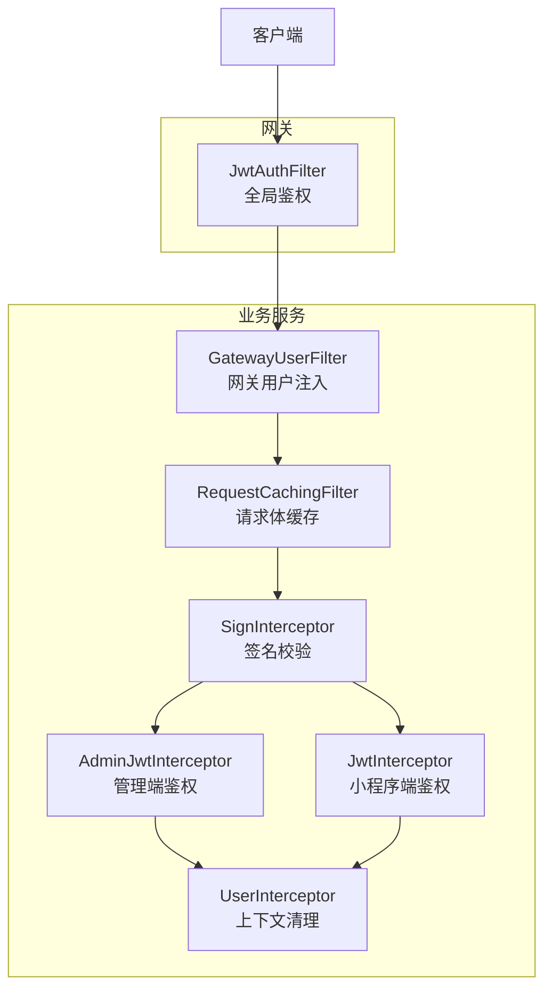
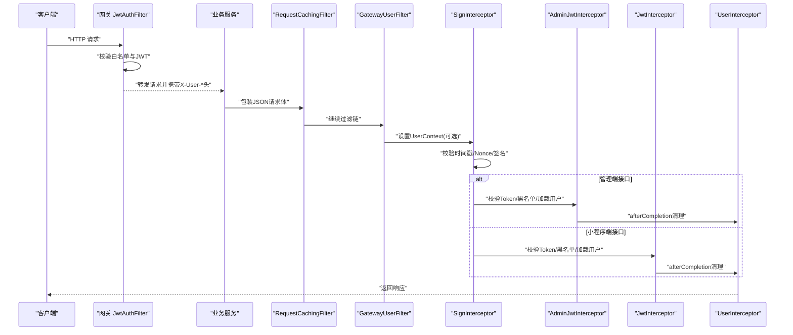
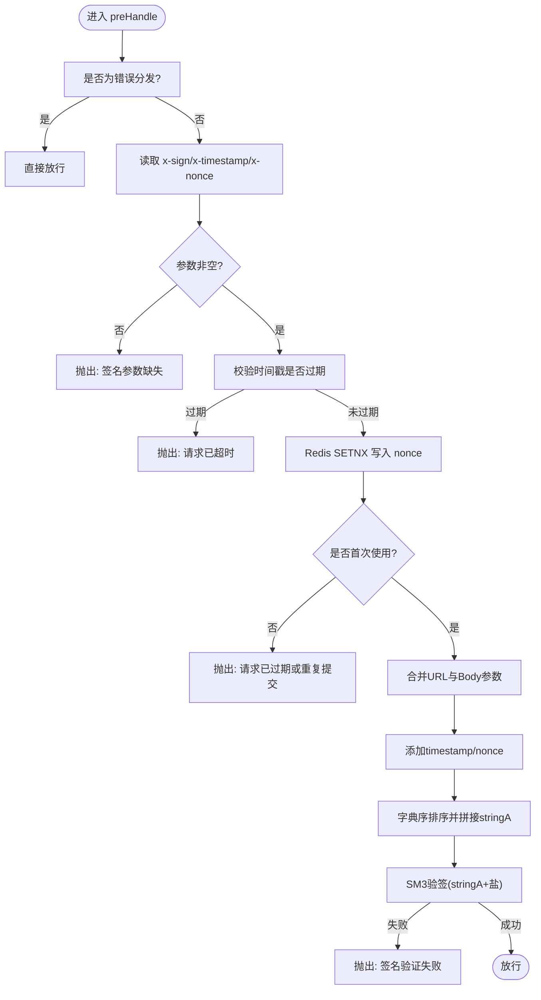
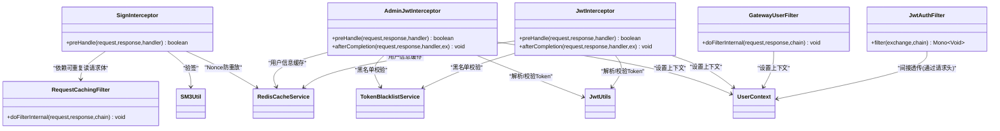

# 拦截器与过滤器

<cite>
**本文引用的文件**
- [SignInterceptor.java](file://class_times_record_back/common/src/main/java/com/shiroko/interceptor/SignInterceptor.java)
- [UserInterceptor.java](file://class_times_record_back/common/src/main/java/com/shiroko/interceptor/UserInterceptor.java)
- [GatewayUserFilter.java](file://class_times_record_back/common/src/main/java/com/shiroko/filter/GatewayUserFilter.java)
- [RequestCachingFilter.java](file://class_times_record_back/common/src/main/java/com/shiroko/filter/RequestCachingFilter.java)
- [AdminJwtInterceptor.java](file://class_times_record_back/admin-service/src/main/java/com/shiroko/interceptor/AdminJwtInterceptor.java)
- [JwtInterceptor.java](file://class_times_record_back/auth-service/src/main/java/com/shiroko/interceptor/JwtInterceptor.java)
- [JwtAuthFilter.java](file://class_times_record_back/gateway/src/main/java/com/shiroko/gateway/filter/JwtAuthFilter.java)
</cite>

## 目录
1. [简介](#简介)
2. [项目结构](#项目结构)
3. [核心组件](#核心组件)
4. [架构总览](#架构总览)
5. [详细组件分析](#详细组件分析)
6. [依赖关系分析](#依赖关系分析)
7. [性能考量](#性能考量)
8. [故障排查指南](#故障排查指南)
9. [结论](#结论)
10. [附录：开发与配置示例](#附录开发与配置示例)

## 简介
本文件聚焦于请求拦截与过滤机制，围绕以下关键实现进行系统化说明：
- 签名验证拦截器（SignInterceptor）
- 用户信息拦截器（UserInterceptor）
- 网关用户过滤器（GatewayUserFilter）
- 请求缓存过滤器（RequestCachingFilter）
- 管理端 JWT 拦截器（AdminJwtInterceptor）
- 小程序端 JWT 拦截器（JwtInterceptor）
- 网关全局鉴权过滤器（JwtAuthFilter）

文档将解释各组件的职责、执行顺序、链式调用机制、请求体缓存原理与内存管理，并提供自定义开发方法与配置使用建议。

## 项目结构
后端采用微服务分层：
- 网关层（gateway）：统一入口，负责全局鉴权与上下文透传
- 业务服务（auth-service、admin-service）：各自注册 Spring MVC 拦截器，完成 Token 校验与用户上下文设置
- 公共模块（common）：提供通用过滤器与拦截器，如请求体缓存、网关用户上下文注入、签名校验等

图表来源
- [JwtAuthFilter.java:1-101](file://class_times_record_back/gateway/src/main/java/com/shiroko/gateway/filter/JwtAuthFilter.java#L1-L101)
- [GatewayUserFilter.java:1-56](file://class_times_record_back/common/src/main/java/com/shiroko/filter/GatewayUserFilter.java#L1-L56)
- [RequestCachingFilter.java:1-37](file://class_times_record_back/common/src/main/java/com/shiroko/filter/RequestCachingFilter.java#L1-L37)
- [SignInterceptor.java:1-149](file://class_times_record_back/common/src/main/java/com/shiroko/interceptor/SignInterceptor.java#L1-L149)
- [AdminJwtInterceptor.java:1-143](file://class_times_record_back/admin-service/src/main/java/com/shiroko/interceptor/AdminJwtInterceptor.java#L1-L143)
- [JwtInterceptor.java:1-153](file://class_times_record_back/auth-service/src/main/java/com/shiroko/interceptor/JwtInterceptor.java#L1-L153)

章节来源
- [JwtAuthFilter.java:1-101](file://class_times_record_back/gateway/src/main/java/com/shiroko/gateway/filter/JwtAuthFilter.java#L1-L101)
- [GatewayUserFilter.java:1-56](file://class_times_record_back/common/src/main/java/com/shiroko/filter/GatewayUserFilter.java#L1-L56)
- [RequestCachingFilter.java:1-37](file://class_times_record_back/common/src/main/java/com/shiroko/filter/RequestCachingFilter.java#L1-L37)
- [SignInterceptor.java:1-149](file://class_times_record_back/common/src/main/java/com/shiroko/interceptor/SignInterceptor.java#L1-L149)
- [AdminJwtInterceptor.java:1-143](file://class_times_record_back/admin-service/src/main/java/com/shiroko/interceptor/AdminJwtInterceptor.java#L1-L143)
- [JwtInterceptor.java:1-153](file://class_times_record_back/auth-service/src/main/java/com/shiroko/interceptor/JwtInterceptor.java#L1-L153)

## 核心组件
- 签名验证拦截器（SignInterceptor）
  - 职责：从请求头获取签名参数，校验时间戳与 Nonce 防重放，收集 URL 查询与 JSON Body 参数，按字典序拼接并验签（SM3）。
  - 关键点：需配合请求体缓存过滤器，确保 Body 可重复读取；Nonce 基于 Redis SETNX 防重放。
- 用户信息拦截器（UserInterceptor）
  - 职责：在请求完成后清理 UserContext，避免线程池污染。
- 网关用户过滤器（GatewayUserFilter）
  - 职责：读取网关转发的 X-User-Id / X-User-Role / X-User-OpenId 请求头，写入 UserContext，供后续处理使用。
- 请求缓存过滤器（RequestCachingFilter）
  - 职责：对 application/json 的请求包装为可重复读取的 RepeatedlyRequestWrapper，以便多次消费请求体。
- 管理端 JWT 拦截器（AdminJwtInterceptor）
  - 职责：校验 Authorization Bearer Token，检查黑名单，加载用户信息到 UserContext。
- 小程序端 JWT 拦截器（JwtInterceptor）
  - 职责：同管理端，但面向小程序用户模型与转换逻辑。
- 网关全局鉴权过滤器（JwtAuthFilter）
  - 职责：在网关层校验 JWT，放行白名单路径，解析 Claims 后以请求头形式向下透传用户信息。

章节来源
- [SignInterceptor.java:1-149](file://class_times_record_back/common/src/main/java/com/shiroko/interceptor/SignInterceptor.java#L1-L149)
- [UserInterceptor.java:1-30](file://class_times_record_back/common/src/main/java/com/shiroko/interceptor/UserInterceptor.java#L1-L30)
- [GatewayUserFilter.java:1-56](file://class_times_record_back/common/src/main/java/com/shiroko/filter/GatewayUserFilter.java#L1-L56)
- [RequestCachingFilter.java:1-37](file://class_times_record_back/common/src/main/java/com/shiroko/filter/RequestCachingFilter.java#L1-L37)
- [AdminJwtInterceptor.java:1-143](file://class_times_record_back/admin-service/src/main/java/com/shiroko/interceptor/AdminJwtInterceptor.java#L1-L143)
- [JwtInterceptor.java:1-153](file://class_times_record_back/auth-service/src/main/java/com/shiroko/interceptor/JwtInterceptor.java#L1-L153)
- [JwtAuthFilter.java:1-101](file://class_times_record_back/gateway/src/main/java/com/shiroko/gateway/filter/JwtAuthFilter.java#L1-L101)

## 架构总览
下图展示了从网关到业务服务的完整请求链路，包括鉴权、签名校验、上下文注入与清理。

图表来源
- [JwtAuthFilter.java:1-101](file://class_times_record_back/gateway/src/main/java/com/shiroko/gateway/filter/JwtAuthFilter.java#L1-L101)
- [RequestCachingFilter.java:1-37](file://class_times_record_back/common/src/main/java/com/shiroko/filter/RequestCachingFilter.java#L1-L37)
- [GatewayUserFilter.java:1-56](file://class_times_record_back/common/src/main/java/com/shiroko/filter/GatewayUserFilter.java#L1-L56)
- [SignInterceptor.java:1-149](file://class_times_record_back/common/src/main/java/com/shiroko/interceptor/SignInterceptor.java#L1-L149)
- [AdminJwtInterceptor.java:1-143](file://class_times_record_back/admin-service/src/main/java/com/shiroko/interceptor/AdminJwtInterceptor.java#L1-L143)
- [JwtInterceptor.java:1-153](file://class_times_record_back/auth-service/src/main/java/com/shiroko/interceptor/JwtInterceptor.java#L1-L153)
- [UserInterceptor.java:1-30](file://class_times_record_back/common/src/main/java/com/shiroko/interceptor/UserInterceptor.java#L1-L30)

## 详细组件分析

### 签名验证拦截器（SignInterceptor）
- 工作流程
  - 跳过错误分发类型
  - 提取 x-sign、x-timestamp、x-nonce
  - 校验时间戳是否过期
  - 通过 Redis SETNX 校验 Nonce 唯一性
  - 合并 URL 查询参数与 JSON Body 参数（需已包装）
  - 加入系统级参数 timestamp、nonce
  - 字典序排序并拼接为 stringA
  - 附加盐值后计算 SM3 并与 x-sign 比对
- 数据流要点
  - 必须前置 RequestCachingFilter，否则无法读取 Body
  - 复杂对象序列化需保证字段排序一致
- 异常与边界
  - 缺失签名参数、超时、Nonce 重复、签名不匹配均会拒绝请求

图表来源
- [SignInterceptor.java:1-149](file://class_times_record_back/common/src/main/java/com/shiroko/interceptor/SignInterceptor.java#L1-L149)
- [RequestCachingFilter.java:1-37](file://class_times_record_back/common/src/main/java/com/shiroko/filter/RequestCachingFilter.java#L1-L37)

章节来源
- [SignInterceptor.java:1-149](file://class_times_record_back/common/src/main/java/com/shiroko/interceptor/SignInterceptor.java#L1-L149)
- [RequestCachingFilter.java:1-37](file://class_times_record_back/common/src/main/java/com/shiroko/filter/RequestCachingFilter.java#L1-L37)

### 用户信息拦截器（UserInterceptor）
- 职责：在 afterCompletion 中移除 UserContext，防止线程复用导致上下文泄漏。
- 适用场景：所有需要设置用户上下文的拦截器都应配套清理。

章节来源
- [UserInterceptor.java:1-30](file://class_times_record_back/common/src/main/java/com/shiroko/interceptor/UserInterceptor.java#L1-L30)

### 网关用户过滤器（GatewayUserFilter）
- 职责：从请求头 X-User-Id / X-User-Role / X-User-OpenId 解析并写入 UserContext。
- 执行顺序：高优先级（Ordered.HIGHEST_PRECEDENCE + 10），确保在业务拦截器之前可用。

章节来源
- [GatewayUserFilter.java:1-56](file://class_times_record_back/common/src/main/java/com/shiroko/filter/GatewayUserFilter.java#L1-L56)

### 请求缓存过滤器（RequestCachingFilter）
- 职责：仅对 application/json 的请求包装为 RepeatedlyRequestWrapper，使请求体可被多次读取。
- 注意：非 JSON 请求保持原样，避免影响文件上传等场景。

章节来源
- [RequestCachingFilter.java:1-37](file://class_times_record_back/common/src/main/java/com/shiroko/filter/RequestCachingFilter.java#L1-L37)

### 管理端 JWT 拦截器（AdminJwtInterceptor）
- 流程：
  - 解析 Authorization Bearer Token
  - 校验 Token 有效性
  - 检查 Token 黑名单
  - 从 Redis 缓存加载管理员用户信息，未命中则查库并回填
  - 设置 UserContext
  - afterCompletion 清理 UserContext
- 输出：未授权时返回 401 及标准响应体。

章节来源
- [AdminJwtInterceptor.java:1-143](file://class_times_record_back/admin-service/src/main/java/com/shiroko/interceptor/AdminJwtInterceptor.java#L1-L143)

### 小程序端 JWT 拦截器（JwtInterceptor）
- 流程：与管理端类似，但针对小程序用户实体与转换器。
- 输出：未授权时返回 401 及标准响应体。

章节来源
- [JwtInterceptor.java:1-153](file://class_times_record_back/auth-service/src/main/java/com/shiroko/interceptor/JwtInterceptor.java#L1-L153)

### 网关全局鉴权过滤器（JwtAuthFilter）
- 流程：
  - 白名单路径直接放行
  - 校验 Authorization 头是否存在且为 Bearer
  - 解析 JWT Claims，提取 userId、roleId、openId
  - 将用户信息以 X-User-* 请求头透传给下游服务
  - 校验失败返回 401
- 公开路径：包含登录、刷新、绑定、订阅、机构查询、管理端登录与公钥等。

章节来源
- [JwtAuthFilter.java:1-101](file://class_times_record_back/gateway/src/main/java/com/shiroko/gateway/filter/JwtAuthFilter.java#L1-L101)

## 依赖关系分析
- 组件耦合
  - SignInterceptor 依赖 RedisCacheService 与 SM3Util，且强依赖 RequestCachingFilter 提供的可重复读请求体。
  - AdminJwtInterceptor 与 JwtInterceptor 依赖 JwtUtils、TokenBlacklistService、RedisCacheService 以及各自的用户服务。
  - GatewayUserFilter 依赖 UserContext 与 UserDTO。
  - JwtAuthFilter 依赖 JJWT 解析令牌并透传用户信息。
- 外部依赖
  - Redis：用于 Nonce 防重放与用户信息缓存
  - JWT：用于令牌签发与校验
  - SM3：用于签名算法

图表来源
- [SignInterceptor.java:1-149](file://class_times_record_back/common/src/main/java/com/shiroko/interceptor/SignInterceptor.java#L1-L149)
- [RequestCachingFilter.java:1-37](file://class_times_record_back/common/src/main/java/com/shiroko/filter/RequestCachingFilter.java#L1-L37)
- [GatewayUserFilter.java:1-56](file://class_times_record_back/common/src/main/java/com/shiroko/filter/GatewayUserFilter.java#L1-L56)
- [AdminJwtInterceptor.java:1-143](file://class_times_record_back/admin-service/src/main/java/com/shiroko/interceptor/AdminJwtInterceptor.java#L1-L143)
- [JwtInterceptor.java:1-153](file://class_times_record_back/auth-service/src/main/java/com/shiroko/interceptor/JwtInterceptor.java#L1-L153)
- [JwtAuthFilter.java:1-101](file://class_times_record_back/gateway/src/main/java/com/shiroko/gateway/filter/JwtAuthFilter.java#L1-L101)

## 性能考量
- 请求体缓存
  - 仅对 application/json 包装，减少不必要的开销
  - 注意大体积 JSON 的内存占用，必要时限制最大请求体大小
- 签名校验
  - 字典序排序与复杂对象序列化可能带来 CPU 开销，应控制参与签名字段数量
  - SM3 计算成本较低，但仍应避免频繁重复计算
- 缓存策略
  - 用户信息缓存命中率直接影响数据库压力，合理设置过期时间
  - Nonce 防重放窗口不宜过长，避免 Redis 键空间膨胀

## 故障排查指南
- 常见问题
  - 签名参数缺失：检查前端是否发送 x-sign、x-timestamp、x-nonce
  - 请求已超时：核对客户端与服务端时间同步
  - 请求已过期或重复提交：确认 Nonce 是否重复使用
  - 签名验证失败：核对参与签名字段集合、排序规则与盐值一致性
  - 未登录/登录过期：检查 Authorization 头格式与 Token 有效期
  - 登录已失效：检查 Token 是否在黑名单中
- 定位建议
  - 开启 DEBUG 日志，关注 SignInterceptor 的 Body 内容与 stringA 拼接结果
  - 检查 RequestCachingFilter 是否正确包装了 JSON 请求
  - 确认 GatewayUserFilter 是否成功注入用户上下文

章节来源
- [SignInterceptor.java:1-149](file://class_times_record_back/common/src/main/java/com/shiroko/interceptor/SignInterceptor.java#L1-L149)
- [RequestCachingFilter.java:1-37](file://class_times_record_back/common/src/main/java/com/shiroko/filter/RequestCachingFilter.java#L1-L37)
- [AdminJwtInterceptor.java:1-143](file://class_times_record_back/admin-service/src/main/java/com/shiroko/interceptor/AdminJwtInterceptor.java#L1-L143)
- [JwtInterceptor.java:1-153](file://class_times_record_back/auth-service/src/main/java/com/shiroko/interceptor/JwtInterceptor.java#L1-L153)

## 结论
本项目通过“网关鉴权 + 业务拦截器 + 通用过滤器”的组合，实现了端到端的身份认证、签名安全与上下文传递。请求体缓存确保了签名校验的可重复读取能力，Redis 防重放与用户信息缓存提升了安全性与性能。遵循本文的开发与配置建议，可快速扩展新的拦截器与过滤器以满足多样化业务需求。

## 附录：开发与配置示例
- 自定义签名拦截器
  - 参考 SignInterceptor 的实现思路：提取签名参数、时间戳与 Nonce、合并参数、排序拼接、SM3 验签
  - 如需调整盐值或超时窗口，请在常量处修改并确保前后端一致
- 自定义用户上下文注入
  - 参考 GatewayUserFilter：从请求头解析用户信息并写入 UserContext
  - 参考 AdminJwtInterceptor/JwtInterceptor：从 Token 解析用户信息并写入 UserContext
- 自定义请求体缓存
  - 参考 RequestCachingFilter：仅对 JSON 请求包装，避免影响其他内容类型
- 配置与注册
  - 网关层：在网关应用中注册 JwtAuthFilter 作为全局过滤器
  - 业务服务：在 WebMvc 配置中注册相应拦截器与过滤器，并设置执行顺序
  - 注意：RequestCachingFilter 应在 SignInterceptor 之前执行，以保证请求体可读

章节来源
- [SignInterceptor.java:1-149](file://class_times_record_back/common/src/main/java/com/shiroko/interceptor/SignInterceptor.java#L1-L149)
- [GatewayUserFilter.java:1-56](file://class_times_record_back/common/src/main/java/com/shiroko/filter/GatewayUserFilter.java#L1-L56)
- [RequestCachingFilter.java:1-37](file://class_times_record_back/common/src/main/java/com/shiroko/filter/RequestCachingFilter.java#L1-L37)
- [AdminJwtInterceptor.java:1-143](file://class_times_record_back/admin-service/src/main/java/com/shiroko/interceptor/AdminJwtInterceptor.java#L1-L143)
- [JwtInterceptor.java:1-153](file://class_times_record_back/auth-service/src/main/java/com/shiroko/interceptor/JwtInterceptor.java#L1-L153)
- [JwtAuthFilter.java:1-101](file://class_times_record_back/gateway/src/main/java/com/shiroko/gateway/filter/JwtAuthFilter.java#L1-L101)