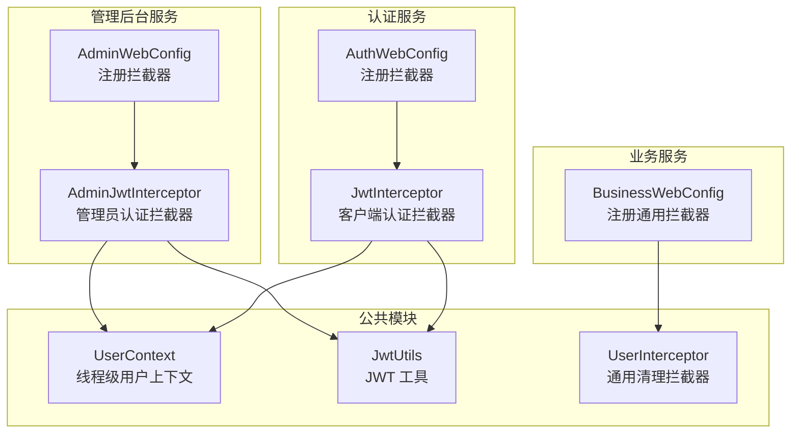
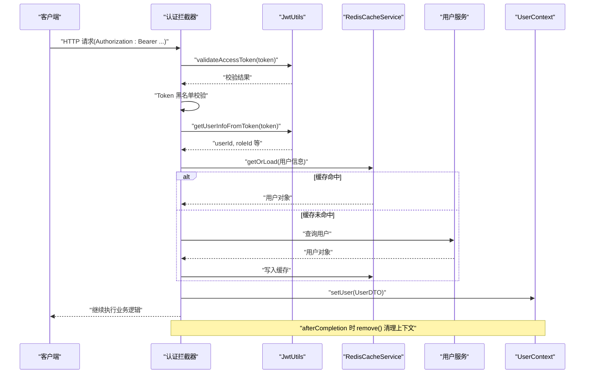
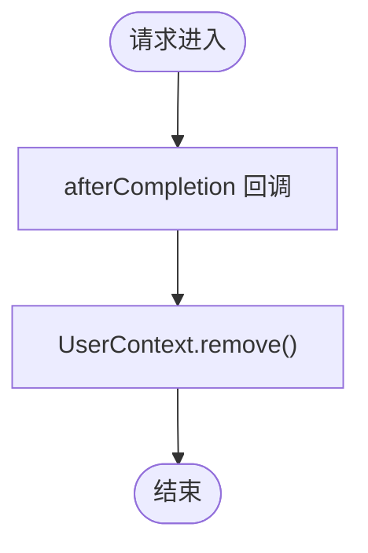
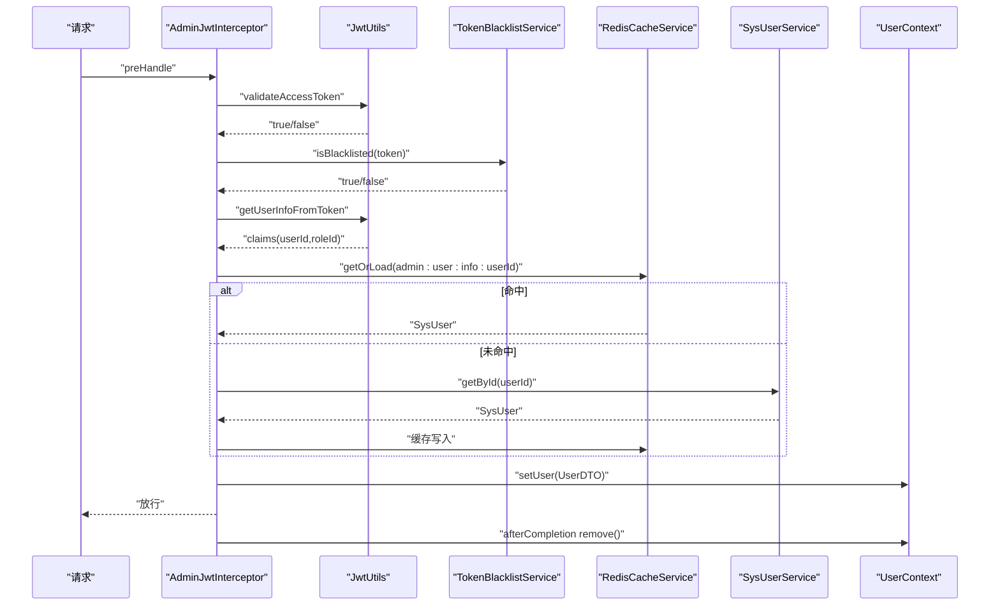
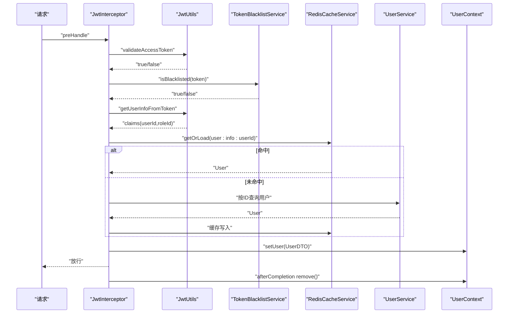
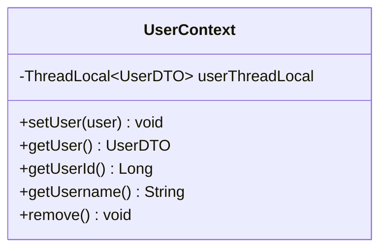
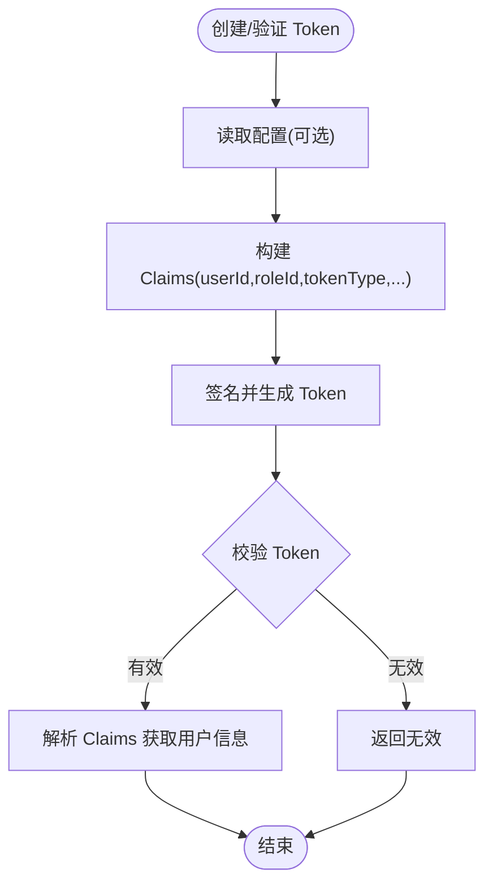
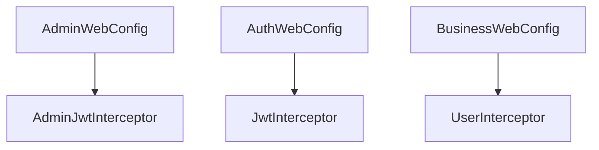
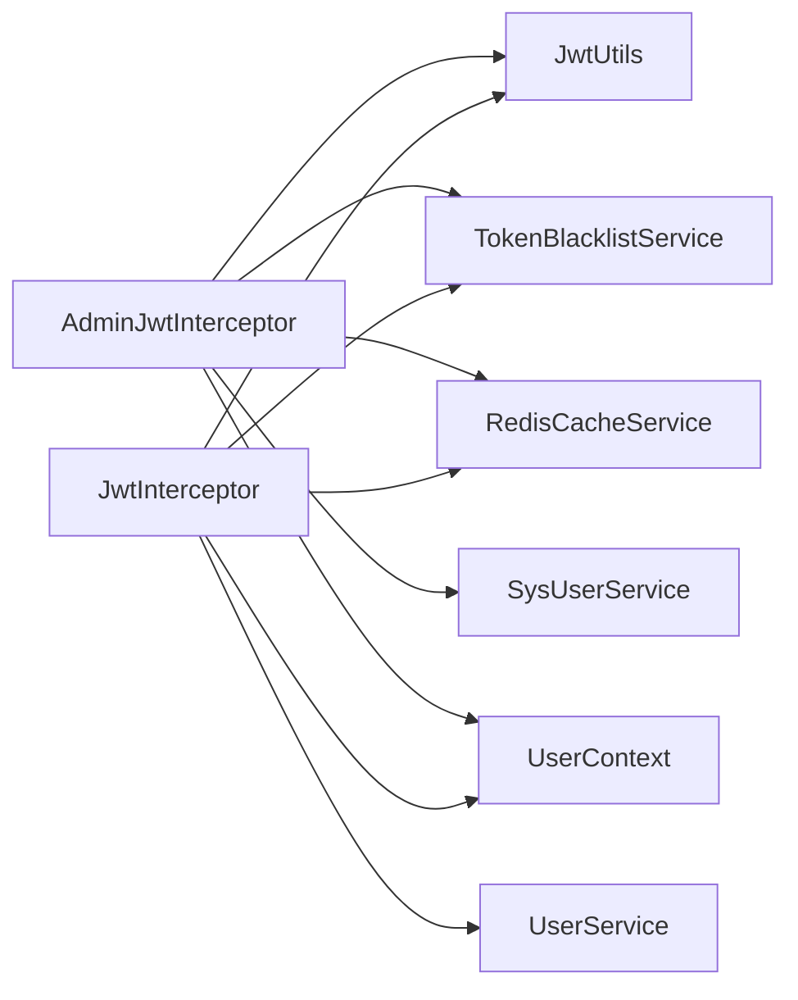

# 用户信息拦截器

<cite>
**本文引用的文件**   
- [UserInterceptor.java](file://class_times_record_back/common/src/main/java/com/shiroko/interceptor/UserInterceptor.java)
- [AdminJwtInterceptor.java](file://class_times_record_back/admin-service/src/main/java/com/shiroko/interceptor/AdminJwtInterceptor.java)
- [JwtInterceptor.java](file://class_times_record_back/auth-service/src/main/java/com/shiroko/interceptor/JwtInterceptor.java)
- [UserContext.java](file://class_times_record_back/common/src/main/java/com/shiroko/context/UserContext.java)
- [JwtUtils.java](file://class_times_record_back/common/src/main/java/com/shiroko/util/JwtUtils.java)
- [AdminWebConfig.java](file://class_times_record_back/admin-service/src/main/java/com/shiroko/config/AdminWebConfig.java)
- [AuthWebConfig.java](file://class_times_record_back/auth-service/src/main/java/com/shiroko/config/AuthWebConfig.java)
- [BusinessWebConfig.java](file://class_times_record_back/business-service/src/main/java/com/shiroko/config/BusinessWebConfig.java)
</cite>

## 目录
1. [简介](#简介)
2. [项目结构](#项目结构)
3. [核心组件](#核心组件)
4. [架构总览](#架构总览)
5. [详细组件分析](#详细组件分析)
6. [依赖关系分析](#依赖关系分析)
7. [性能考虑](#性能考虑)
8. [故障排查指南](#故障排查指南)
9. [结论](#结论)
10. [附录](#附录)

## 简介
本文件围绕“用户信息拦截器”的实现与使用进行系统化说明，重点覆盖：
- UserInterceptor 的职责边界与执行时机
- JWT 令牌解析流程（Access Token 校验、黑名单校验、用户信息提取）
- 用户上下文设置与跨服务传递机制（ThreadLocal + 请求头透传）
- 权限信息提取与扩展方式
- 异常处理策略与性能优化建议
- 最佳实践、常见问题与集成指南

## 项目结构
后端采用多模块微服务架构，认证与鉴权相关能力集中在 common 模块，业务服务通过 Web 配置注册拦截器。关键位置如下：
- 通用能力：common 模块提供 UserContext、JwtUtils、签名拦截器等
- 管理后台：admin-service 提供 AdminJwtInterceptor，负责管理员侧的认证与上下文注入
- 小程序/客户端：auth-service 提供 JwtInterceptor，负责普通用户的认证与上下文注入
- 业务服务：business-service 提供 BusinessWebConfig，用于注册通用用户拦截器
- Web 配置：各服务通过 Web 配置类注册拦截器并定义拦截路径

图示来源
- [AdminWebConfig.java](file://class_times_record_back/admin-service/src/main/java/com/shiroko/config/AdminWebConfig.java)
- [AuthWebConfig.java](file://class_times_record_back/auth-service/src/main/java/com/shiroko/config/AuthWebConfig.java)
- [BusinessWebConfig.java](file://class_times_record_back/business-service/src/main/java/com/shiroko/config/BusinessWebConfig.java)
- [AdminJwtInterceptor.java](file://class_times_record_back/admin-service/src/main/java/com/shiroko/interceptor/AdminJwtInterceptor.java)
- [JwtInterceptor.java](file://class_times_record_back/auth-service/src/main/java/com/shiroko/interceptor/JwtInterceptor.java)
- [UserInterceptor.java](file://class_times_record_back/common/src/main/java/com/shiroko/interceptor/UserInterceptor.java)
- [UserContext.java](file://class_times_record_back/common/src/main/java/com/shiroko/context/UserContext.java)
- [JwtUtils.java](file://class_times_record_back/common/src/main/java/com/shiroko/util/JwtUtils.java)

章节来源
- [AdminWebConfig.java](file://class_times_record_back/admin-service/src/main/java/com/shiroko/config/AdminWebConfig.java)
- [AuthWebConfig.java](file://class_times_record_back/auth-service/src/main/java/com/shiroko/config/AuthWebConfig.java)
- [BusinessWebConfig.java](file://class_times_record_back/business-service/src/main/java/com/shiroko/config/BusinessWebConfig.java)

## 核心组件
- UserContext：基于 ThreadLocal 的用户上下文容器，提供 set/get/remove 等便捷方法，贯穿当前请求线程的生命周期。
- JwtUtils：JWT 工具类，支持 Access Token 与 Refresh Token 的生成、校验与解析；支持动态过期时间配置。
- AdminJwtInterceptor：管理后台专用拦截器，完成 Access Token 校验、黑名单检查、用户信息缓存加载，并将用户信息写入 UserContext。
- JwtInterceptor：客户端（小程序等）专用拦截器，职责与管理后台类似，但面向不同用户模型与缓存键前缀。
- UserInterceptor：通用清理拦截器，在 afterCompletion 阶段确保从 ThreadLocal 中移除用户上下文，避免线程池污染。
- Web 配置类：在各服务中注册对应拦截器，控制拦截路径与顺序。

章节来源
- [UserContext.java](file://class_times_record_back/common/src/main/java/com/shiroko/context/UserContext.java)
- [JwtUtils.java](file://class_times_record_back/common/src/main/java/com/shiroko/util/JwtUtils.java)
- [AdminJwtInterceptor.java](file://class_times_record_back/admin-service/src/main/java/com/shiroko/interceptor/AdminJwtInterceptor.java)
- [JwtInterceptor.java](file://class_times_record_back/auth-service/src/main/java/com/shiroko/interceptor/JwtInterceptor.java)
- [UserInterceptor.java](file://class_times_record_back/common/src/main/java/com/shiroko/interceptor/UserInterceptor.java)

## 架构总览
下图展示了典型请求链路中的认证与上下文传递过程：客户端携带 Authorization 头进入网关或服务，拦截器解析 JWT、校验黑名单、加载用户信息并写入 UserContext，业务层直接读取上下文，最终在响应完成后清理上下文。

图示来源
- [AdminJwtInterceptor.java](file://class_times_record_back/admin-service/src/main/java/com/shiroko/interceptor/AdminJwtInterceptor.java)
- [JwtInterceptor.java](file://class_times_record_back/auth-service/src/main/java/com/shiroko/interceptor/JwtInterceptor.java)
- [JwtUtils.java](file://class_times_record_back/common/src/main/java/com/shiroko/util/JwtUtils.java)
- [UserContext.java](file://class_times_record_back/common/src/main/java/com/shiroko/context/UserContext.java)

## 详细组件分析

### UserInterceptor 分析与定位
- 职责：作为通用清理拦截器，在 afterCompletion 阶段调用 UserContext.remove()，确保线程本地变量被释放，防止线程池复用导致的数据污染。
- 执行时机：在所有 Handler 处理完成后执行，无论成功或异常都会触发。
- 适用场景：所有需要维护用户上下文的业务服务都应注册该拦截器，保证生命周期安全。

图示来源
- [UserInterceptor.java](file://class_times_record_back/common/src/main/java/com/shiroko/interceptor/UserInterceptor.java)
- [UserContext.java](file://class_times_record_back/common/src/main/java/com/shiroko/context/UserContext.java)

章节来源
- [UserInterceptor.java](file://class_times_record_back/common/src/main/java/com/shiroko/interceptor/UserInterceptor.java)
- [UserContext.java](file://class_times_record_back/common/src/main/java/com/shiroko/context/UserContext.java)

### AdminJwtInterceptor（管理后台）
- 功能要点：
  - 从请求头解析 Authorization，提取 Bearer Token
  - 使用 JwtUtils.validateAccessToken 校验 Access Token
  - 通过 TokenBlacklistService 检查是否已登出（黑名单）
  - 使用 JwtUtils.getUserInfoFromToken 获取 userId、roleId
  - 优先从 Redis 缓存加载 SysUser，未命中则查库并回填缓存
  - 构造 UserDTO 并写入 UserContext
  - afterCompletion 清理上下文
- 错误处理：
  - 未登录、登录过期、黑名单、用户不存在均返回 401 及统一响应体
- 性能优化：
  - 用户信息缓存减少数据库访问
  - 黑名单快速拒绝无效会话

图示来源
- [AdminJwtInterceptor.java](file://class_times_record_back/admin-service/src/main/java/com/shiroko/interceptor/AdminJwtInterceptor.java)
- [JwtUtils.java](file://class_times_record_back/common/src/main/java/com/shiroko/util/JwtUtils.java)
- [UserContext.java](file://class_times_record_back/common/src/main/java/com/shiroko/context/UserContext.java)

章节来源
- [AdminJwtInterceptor.java](file://class_times_record_back/admin-service/src/main/java/com/shiroko/interceptor/AdminJwtInterceptor.java)

### JwtInterceptor（客户端/小程序）
- 功能要点：
  - 与 AdminJwtInterceptor 类似的流程，但面向普通用户模型
  - 使用 Redis 缓存键前缀 user:info: 缓存用户信息
  - 通过 UserConverter 将实体转换为 UserDTO 并写入 UserContext
- 错误处理：
  - 未登录、登录过期、黑名单、用户不存在均返回 401 及统一响应体
- 性能优化：
  - 用户信息缓存降低数据库压力
  - 黑名单快速拒绝失效会话

图示来源
- [JwtInterceptor.java](file://class_times_record_back/auth-service/src/main/java/com/shiroko/interceptor/JwtInterceptor.java)
- [JwtUtils.java](file://class_times_record_back/common/src/main/java/com/shiroko/util/JwtUtils.java)
- [UserContext.java](file://class_times_record_back/common/src/main/java/com/shiroko/context/UserContext.java)

章节来源
- [JwtInterceptor.java](file://class_times_record_back/auth-service/src/main/java/com/shiroko/interceptor/JwtInterceptor.java)

### UserContext（用户上下文）
- 存储方式：ThreadLocal<UserDTO>，线程隔离，适合单请求线程内的上下文共享
- 主要方法：
  - setUser：设置当前线程用户信息
  - getUser：获取当前线程用户信息
  - getUserId/getUsername：便捷访问常用字段
  - remove：清理上下文，防止线程池复用污染
- 注意事项：
  - 必须在 afterCompletion 中调用 remove，确保线程资源回收
  - 异步任务需显式传递上下文（见“跨服务用户信息传递”）

图示来源
- [UserContext.java](file://class_times_record_back/common/src/main/java/com/shiroko/context/UserContext.java)

章节来源
- [UserContext.java](file://class_times_record_back/common/src/main/java/com/shiroko/context/UserContext.java)

### JwtUtils（JWT 工具）
- 功能要点：
  - 生成 Access Token 与 Refresh Token，包含 userId、roleId、tokenType 等 claims
  - 支持动态过期时间（通过 ConfigProvider），失败回退默认值
  - 校验 Access/Refresh Token 类型与签名
  - 解析 Claims 并提取用户信息
- 设计亮点：
  - 解耦配置来源，便于运行时调整过期策略
  - 统一的密钥管理与算法选择（HS256）

图示来源
- [JwtUtils.java](file://class_times_record_back/common/src/main/java/com/shiroko/util/JwtUtils.java)

章节来源
- [JwtUtils.java](file://class_times_record_back/common/src/main/java/com/shiroko/util/JwtUtils.java)

### Web 配置与拦截器注册
- 管理后台：AdminWebConfig 注册 AdminJwtInterceptor，限定管理端路径
- 认证服务：AuthWebConfig 注册 JwtInterceptor，限定客户端路径
- 业务服务：BusinessWebConfig 注册通用 UserInterceptor，确保上下文清理

图示来源
- [AdminWebConfig.java](file://class_times_record_back/admin-service/src/main/java/com/shiroko/config/AdminWebConfig.java)
- [AuthWebConfig.java](file://class_times_record_back/auth-service/src/main/java/com/shiroko/config/AuthWebConfig.java)
- [BusinessWebConfig.java](file://class_times_record_back/business-service/src/main/java/com/shiroko/config/BusinessWebConfig.java)

章节来源
- [AdminWebConfig.java](file://class_times_record_back/admin-service/src/main/java/com/shiroko/config/AdminWebConfig.java)
- [AuthWebConfig.java](file://class_times_record_back/auth-service/src/main/java/com/shiroko/config/AuthWebConfig.java)
- [BusinessWebConfig.java](file://class_times_record_back/business-service/src/main/java/com/shiroko/config/BusinessWebConfig.java)

## 依赖关系分析
- 组件耦合：
  - 认证拦截器依赖 JwtUtils 进行令牌解析与校验
  - 依赖 TokenBlacklistService 实现登出后快速拒绝
  - 依赖 RedisCacheService 实现用户信息缓存
  - 依赖各自用户服务（SysUserService/UserService）进行兜底查询
  - 通过 UserContext 将用户信息注入到当前线程
- 外部依赖：
  - JWT 库（JJWT）
  - Redis（缓存）
  - 数据库（兜底查询）
- 潜在循环依赖：
  - common 模块不依赖具体服务实现，通过接口或工厂注入配置提供者，避免循环依赖

图示来源
- [AdminJwtInterceptor.java](file://class_times_record_back/admin-service/src/main/java/com/shiroko/interceptor/AdminJwtInterceptor.java)
- [JwtInterceptor.java](file://class_times_record_back/auth-service/src/main/java/com/shiroko/interceptor/JwtInterceptor.java)
- [JwtUtils.java](file://class_times_record_back/common/src/main/java/com/shiroko/util/JwtUtils.java)
- [UserContext.java](file://class_times_record_back/common/src/main/java/com/shiroko/context/UserContext.java)

章节来源
- [AdminJwtInterceptor.java](file://class_times_record_back/admin-service/src/main/java/com/shiroko/interceptor/AdminJwtInterceptor.java)
- [JwtInterceptor.java](file://class_times_record_back/auth-service/src/main/java/com/shiroko/interceptor/JwtInterceptor.java)
- [JwtUtils.java](file://class_times_record_back/common/src/main/java/com/shiroko/util/JwtUtils.java)
- [UserContext.java](file://class_times_record_back/common/src/main/java/com/shiroko/context/UserContext.java)

## 性能考虑
- 缓存优先：用户信息优先从 Redis 读取，未命中再查库，显著降低数据库压力
- 黑名单快速拒绝：对已登出的 Token 直接拒绝，避免后续解析与查询
- 最小化序列化：仅在必要时将用户信息写入 UserContext，避免重复转换
- 合理过期：Access Token 短过期、Refresh Token 长过期，结合黑名单提升安全性与体验
- 线程安全：afterCompletion 清理 ThreadLocal，避免线程池复用导致内存泄漏或数据污染

[本节为通用指导，无需特定文件引用]

## 故障排查指南
- 常见错误与定位：
  - 未登录/登录过期：检查 Authorization 头是否正确携带 Bearer Token，确认 JwtUtils.validateAccessToken 返回值
  - 登录已失效：检查 Token 是否在黑名单中，确认 TokenBlacklistService 状态
  - 用户不存在：检查用户 ID 是否存在，确认缓存键前缀与缓存一致性
  - 响应写入失败：关注日志中的 IOException，检查响应流是否已被占用
- 调试建议：
  - 打印拦截器 preHandle/afterCompletion 的执行日志
  - 记录缓存命中率与数据库查询耗时
  - 校验 JWT 签名与过期时间配置

章节来源
- [AdminJwtInterceptor.java](file://class_times_record_back/admin-service/src/main/java/com/shiroko/interceptor/AdminJwtInterceptor.java)
- [JwtInterceptor.java](file://class_times_record_back/auth-service/src/main/java/com/shiroko/interceptor/JwtInterceptor.java)

## 结论
本项目通过分层拦截器与通用上下文实现了稳定、可扩展的用户认证与上下文传递机制。管理后台与客户端分别使用专用拦截器，配合 Redis 缓存与黑名单策略，在保证安全性的同时提升了性能。UserInterceptor 确保线程上下文的安全清理，避免潜在的线程池污染问题。整体设计清晰、可维护性强，具备良好的扩展性以支持更多用户属性与权限策略。

[本节为总结性内容，无需特定文件引用]

## 附录

### 用户信息获取最佳实践
- 始终通过 UserContext 获取当前用户信息，避免手动解析请求头
- 在异步任务中显式传递用户上下文（例如通过 MDC 或自定义传播器）
- 对敏感操作增加二次校验（如角色/权限判断）

### 自定义用户属性的扩展方法
- 在 UserDTO 中新增字段，并在拦截器中将额外信息写入 DTO
- 若需跨服务传递，可在请求头中添加自定义字段（如 X-User-Role），由下游服务解析并合并到上下文
- 注意保持 DTO 的最小必要字段集，避免过大负载

### 跨服务用户信息传递
- 同步 HTTP 调用：在发起方添加 Authorization 头，或在网关层统一透传
- 异步消息：在消息头中携带用户标识（userId、roleId），消费者侧重建 UserContext
- 线程内传播：使用 MDC 或自定义传播器在异步线程中复制上下文

### 集成指南
- 在业务服务的 Web 配置中注册 UserInterceptor，确保 afterCompletion 清理上下文
- 在管理后台服务注册 AdminJwtInterceptor，限定管理端路径
- 在客户端服务注册 JwtInterceptor，限定客户端路径
- 确保 Redis 与数据库连接正常，缓存键前缀一致

章节来源
- [UserInterceptor.java](file://class_times_record_back/common/src/main/java/com/shiroko/interceptor/UserInterceptor.java)
- [AdminJwtInterceptor.java](file://class_times_record_back/admin-service/src/main/java/com/shiroko/interceptor/AdminJwtInterceptor.java)
- [JwtInterceptor.java](file://class_times_record_back/auth-service/src/main/java/com/shiroko/interceptor/JwtInterceptor.java)
- [AdminWebConfig.java](file://class_times_record_back/admin-service/src/main/java/com/shiroko/config/AdminWebConfig.java)
- [AuthWebConfig.java](file://class_times_record_back/auth-service/src/main/java/com/shiroko/config/AuthWebConfig.java)
- [BusinessWebConfig.java](file://class_times_record_back/business-service/src/main/java/com/shiroko/config/BusinessWebConfig.java)