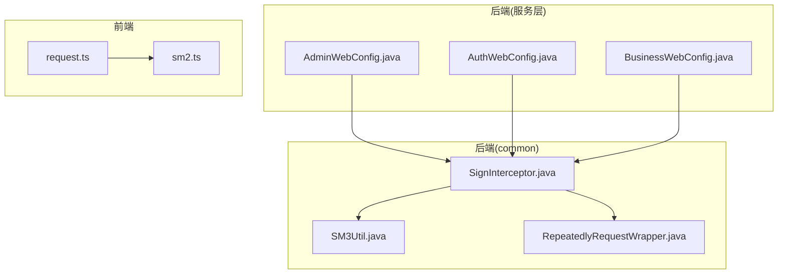
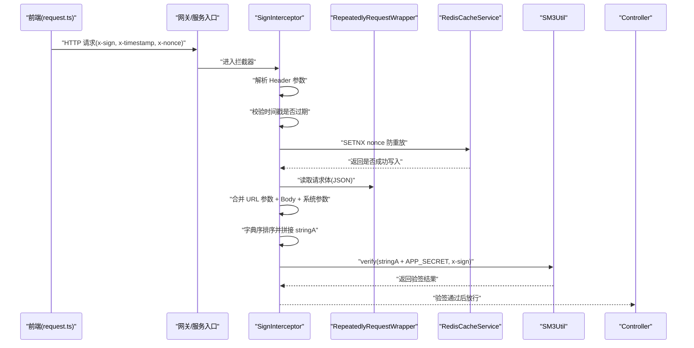
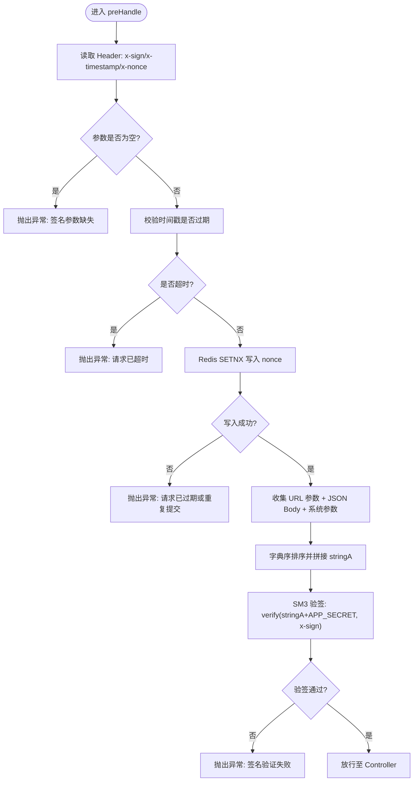
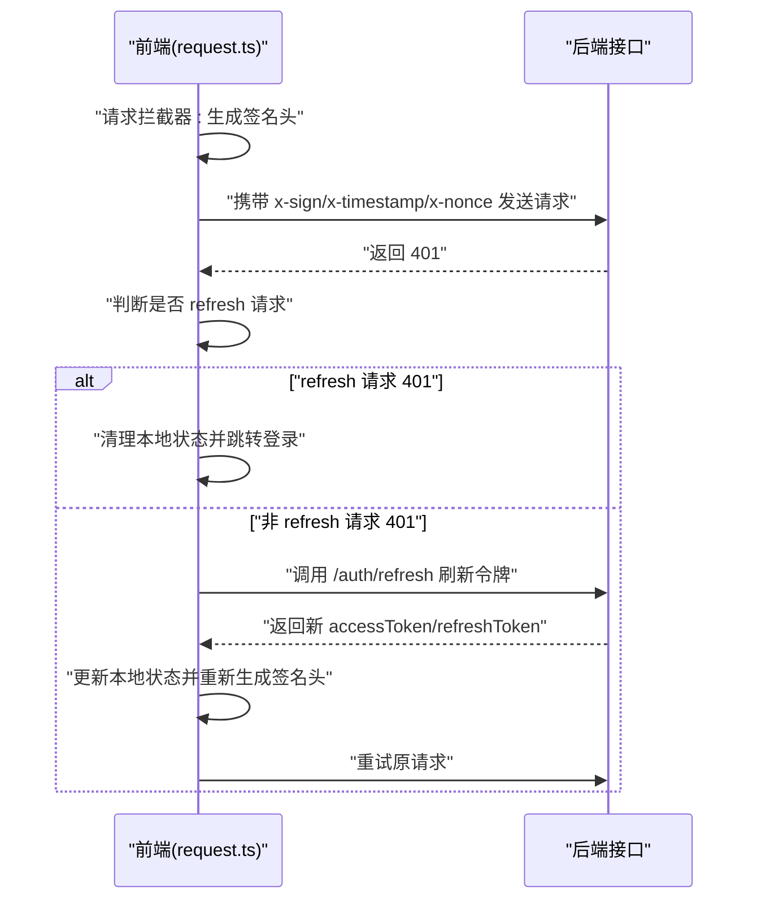
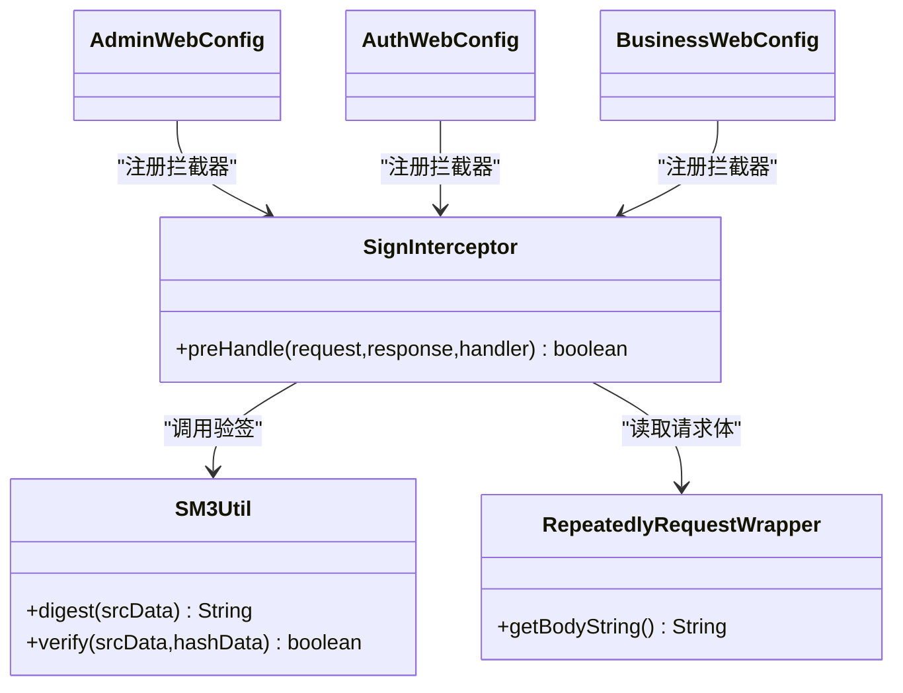

# 签名验证拦截器

<cite>
**本文引用的文件**
- [SignInterceptor.java](file://class_times_record_back/common/src/main/java/com/shiroko/interceptor/SignInterceptor.java)
- [SM3Util.java](file://class_times_record_back/common/src/main/java/com/shiroko/util/SM3Util.java)
- [RepeatedlyRequestWrapper.java](file://class_times_record_back/common/src/main/java/com/shiroko/support/RepeatedlyRequestWrapper.java)
- [request.ts](file://class_record_admin_front/src/utils/request.ts)
- [sm2.ts](file://class_record_admin_front/src/utils/sm2.ts)
- [AdminWebConfig.java](file://class_times_record_back/admin-service/src/main/java/com/shiroko/config/AdminWebConfig.java)
- [AuthWebConfig.java](file://class_times_record_back/auth-service/src/main/java/com/shiroko/config/AuthWebConfig.java)
- [BusinessWebConfig.java](file://class_times_record_back/business-service/src/main/java/com/shiroko/config/BusinessWebConfig.java)
</cite>

## 目录
1. [简介](#简介)
2. [项目结构](#项目结构)
3. [核心组件](#核心组件)
4. [架构总览](#架构总览)
5. [详细组件分析](#详细组件分析)
6. [依赖关系分析](#依赖关系分析)
7. [性能考量](#性能考量)
8. [故障排查指南](#故障排查指南)
9. [结论](#结论)
10. [附录：配置与使用指南](#附录配置与使用指南)

## 简介
本文件围绕后端签名验证拦截器 SignInterceptor 的实现原理与前后端对接进行系统化说明，覆盖以下关键点：
- 请求签名验证流程、时间戳防重放机制、Nonce 唯一性校验
- 参数收集与排序算法（URL 查询参数 + JSON 请求体 + 系统级参数）
- SM3 签名验证逻辑
- 签名参数获取方式（Header 中的 x-sign、x-timestamp、x-nonce）
- 请求体缓存读取（可重复读取包装器）
- URL 参数与 JSON 参数的合并处理
- 防重放攻击防护机制（Redis SETNX 与超时窗口管理）
- 前端对接示例与常见错误排查方法
- 完整配置和使用指南

## 项目结构
签名相关代码主要分布在 common 模块的拦截器与工具类中，并在各业务服务通过 Web 配置注册拦截器；前端在 HTTP 客户端拦截器中统一生成并注入签名头。

图表来源
- [SignInterceptor.java:1-149](file://class_times_record_back/common/src/main/java/com/shiroko/interceptor/SignInterceptor.java#L1-L149)
- [SM3Util.java:1-85](file://class_times_record_back/common/src/main/java/com/shiroko/util/SM3Util.java#L1-L85)
- [RepeatedlyRequestWrapper.java:1-52](file://class_times_record_back/common/src/main/java/com/shiroko/support/RepeatedlyRequestWrapper.java#L1-L52)
- [AdminWebConfig.java:1-30](file://class_times_record_back/admin-service/src/main/java/com/shiroko/config/AdminWebConfig.java#L1-L30)
- [AuthWebConfig.java:1-30](file://class_times_record_back/auth-service/src/main/java/com/shiroko/config/AuthWebConfig.java#L1-L30)
- [BusinessWebConfig.java:1-30](file://class_times_record_back/business-service/src/main/java/com/shiroko/config/BusinessWebConfig.java#L1-L30)
- [request.ts:1-222](file://class_record_admin_front/src/utils/request.ts#L1-L222)
- [sm2.ts:1-50](file://class_record_admin_front/src/utils/sm2.ts#L1-L50)

章节来源
- [SignInterceptor.java:1-149](file://class_times_record_back/common/src/main/java/com/shiroko/interceptor/SignInterceptor.java#L1-L149)
- [SM3Util.java:1-85](file://class_times_record_back/common/src/main/java/com/shiroko/util/SM3Util.java#L1-L85)
- [RepeatedlyRequestWrapper.java:1-52](file://class_times_record_back/common/src/main/java/com/shiroko/support/RepeatedlyRequestWrapper.java#L1-L52)
- [AdminWebConfig.java:1-30](file://class_times_record_back/admin-service/src/main/java/com/shiroko/config/AdminWebConfig.java#L1-L30)
- [AuthWebConfig.java:1-30](file://class_times_record_back/auth-service/src/main/java/com/shiroko/config/AuthWebConfig.java#L1-L30)
- [BusinessWebConfig.java:1-30](file://class_times_record_back/business-service/src/main/java/com/shiroko/config/BusinessWebConfig.java#L1-L30)
- [request.ts:1-222](file://class_record_admin_front/src/utils/request.ts#L1-L222)
- [sm2.ts:1-50](file://class_record_admin_front/src/utils/sm2.ts#L1-L50)

## 核心组件
- 签名拦截器 SignInterceptor：负责从请求头提取签名参数、时间戳与 Nonce 校验、参数收集与排序、SM3 验签。
- SM3 工具类 SM3Util：提供 SM3 摘要计算与校验能力。
- 可重复读取请求体包装器 RepeatedlyRequestWrapper：允许多次读取请求体以参与签名计算。
- 前端请求封装 request.ts：在请求前自动附加 x-sign、x-timestamp、x-nonce 三个签名头，并在 401 时刷新令牌后重新生成签名重试。
- 前端签名工具 sm2.ts：提供 generateSign 等签名生成能力（包含盐值常量）。

章节来源
- [SignInterceptor.java:1-149](file://class_times_record_back/common/src/main/java/com/shiroko/interceptor/SignInterceptor.java#L1-L149)
- [SM3Util.java:1-85](file://class_times_record_back/common/src/main/java/com/shiroko/util/SM3Util.java#L1-L85)
- [RepeatedlyRequestWrapper.java:1-52](file://class_times_record_back/common/src/main/java/com/shiroko/support/RepeatedlyRequestWrapper.java#L1-L52)
- [request.ts:1-222](file://class_record_admin_front/src/utils/request.ts#L1-L222)
- [sm2.ts:1-50](file://class_record_admin_front/src/utils/sm2.ts#L1-L50)

## 架构总览
下图展示了从前端发起请求到后端完成签名校验的整体流程，包括请求体缓存、参数合并、排序与 SM3 验签。

图表来源
- [SignInterceptor.java:50-149](file://class_times_record_back/common/src/main/java/com/shiroko/interceptor/SignInterceptor.java#L50-L149)
- [RepeatedlyRequestWrapper.java:19-52](file://class_times_record_back/common/src/main/java/com/shiroko/support/RepeatedlyRequestWrapper.java#L19-L52)
- [SM3Util.java:68-72](file://class_times_record_back/common/src/main/java/com/shiroko/util/SM3Util.java#L68-L72)
- [request.ts:34-53](file://class_record_admin_front/src/utils/request.ts#L34-L53)

## 详细组件分析

### SignInterceptor 实现原理
- 请求头参数获取
  - 从 Header 中读取 x-sign、x-timestamp、x-nonce，缺失则直接拒绝。
- 时间戳防重放
  - 比较当前时间与 x-timestamp 差值，超过阈值（默认 60 秒）即拒绝。
- Nonce 唯一性与防重放
  - 使用 Redis SETNX 将 nonce 作为 key 写入，设置与时间戳相同的过期时间，确保同一 nonce 在窗口内仅能使用一次。
- 参数收集与排序
  - 先收集 URL 查询参数，再尝试从可重复读取的请求体中解析 JSON 对象并入参集合，最后加入系统级参数 timestamp 与 nonce。
  - 对键进行字典序排序，值为复杂类型（Map/Iterable）时使用 JSON 序列化并强制字段排序，最终拼接为 stringA。
- SM3 验签
  - 将 stringA 与固定盐值 APP_SECRET 拼接后进行 SM3 摘要，与 x-sign 比对，不一致则拒绝。

图表来源
- [SignInterceptor.java:50-149](file://class_times_record_back/common/src/main/java/com/shiroko/interceptor/SignInterceptor.java#L50-L149)

章节来源
- [SignInterceptor.java:50-149](file://class_times_record_back/common/src/main/java/com/shiroko/interceptor/SignInterceptor.java#L50-L149)

### SM3 验签逻辑
- 底层基于 BouncyCastle 的 SM3Digest 实现摘要计算。
- 提供 digest 与 verify 方法，支持大小写不敏感的十六进制字符串比对。
- 验签时由拦截器构造待签名字符串（stringA + APP_SECRET），调用 verify 完成比对。

章节来源
- [SM3Util.java:1-85](file://class_times_record_back/common/src/main/java/com/shiroko/util/SM3Util.java#L1-L85)
- [SignInterceptor.java:140-149](file://class_times_record_back/common/src/main/java/com/shiroko/interceptor/SignInterceptor.java#L140-L149)

### 请求体缓存读取
- 使用 RepeatedlyRequestWrapper 包装请求，限制最大请求体大小，避免 OOM。
- 提供 getBodyString 以便在拦截器中读取 JSON 内容参与签名计算。

章节来源
- [RepeatedlyRequestWrapper.java:19-52](file://class_times_record_back/common/src/main/java/com/shiroko/support/RepeatedlyRequestWrapper.java#L19-L52)

### 前端签名与重试流程
- 在 Axios 请求拦截器中：
  - 根据请求方法选择 params 或 data 作为签名数据源。
  - 调用 generateSign 生成 sign、timestamp、nonce，并注入到请求头 x-sign、x-timestamp、x-nonce。
- 401 响应处理：
  - 若 refresh 接口本身返回 401，则清理本地状态并跳转登录页。
  - 否则尝试使用 refreshToken 静默刷新，成功后更新 token 并重新生成签名头，再重试原请求。

图表来源
- [request.ts:34-53](file://class_record_admin_front/src/utils/request.ts#L34-L53)
- [request.ts:56-189](file://class_record_admin_front/src/utils/request.ts#L56-L189)

章节来源
- [request.ts:34-53](file://class_record_admin_front/src/utils/request.ts#L34-L53)
- [request.ts:56-189](file://class_record_admin_front/src/utils/request.ts#L56-L189)
- [sm2.ts:1-50](file://class_record_admin_front/src/utils/sm2.ts#L1-L50)

## 依赖关系分析
- 服务层通过各自的 Web 配置类注册 SignInterceptor，使其在所有受保护接口上生效。
- 拦截器依赖 RedisCacheService 进行 Nonce 防重放，依赖 SM3Util 进行签名校验，依赖 RepeatedlyRequestWrapper 读取请求体。

图表来源
- [AdminWebConfig.java:1-30](file://class_times_record_back/admin-service/src/main/java/com/shiroko/config/AdminWebConfig.java#L1-L30)
- [AuthWebConfig.java:1-30](file://class_times_record_back/auth-service/src/main/java/com/shiroko/config/AuthWebConfig.java#L1-L30)
- [BusinessWebConfig.java:1-30](file://class_times_record_back/business-service/src/main/java/com/shiroko/config/BusinessWebConfig.java#L1-L30)
- [SignInterceptor.java:1-149](file://class_times_record_back/common/src/main/java/com/shiroko/interceptor/SignInterceptor.java#L1-L149)
- [SM3Util.java:1-85](file://class_times_record_back/common/src/main/java/com/shiroko/util/SM3Util.java#L1-L85)
- [RepeatedlyRequestWrapper.java:1-52](file://class_times_record_back/common/src/main/java/com/shiroko/support/RepeatedlyRequestWrapper.java#L1-L52)

章节来源
- [AdminWebConfig.java:1-30](file://class_times_record_back/admin-service/src/main/java/com/shiroko/config/AdminWebConfig.java#L1-L30)
- [AuthWebConfig.java:1-30](file://class_times_record_back/auth-service/src/main/java/com/shiroko/config/AuthWebConfig.java#L1-L30)
- [BusinessWebConfig.java:1-30](file://class_times_record_back/business-service/src/main/java/com/shiroko/config/BusinessWebConfig.java#L1-L30)
- [SignInterceptor.java:1-149](file://class_times_record_back/common/src/main/java/com/shiroko/interceptor/SignInterceptor.java#L1-L149)

## 性能考量
- 请求体大小限制：RepeatedlyRequestWrapper 限制了最大请求体大小，防止大请求导致内存溢出。
- Redis 操作开销：每次请求执行一次 SETNX，需保证 Redis 低延迟与高可用。
- 排序与序列化：对复杂对象进行 JSON 序列化并强制字段排序，可能带来一定 CPU 开销，建议控制请求体复杂度与大小。
- 日志级别：生产环境建议降低 debug 日志输出，避免影响吞吐。

[本节为通用指导，无需具体文件引用]

## 故障排查指南
- 签名参数缺失
  - 现象：抛出“签名参数缺失”。
  - 排查：确认前端是否在请求头中正确注入 x-sign、x-timestamp、x-nonce。
- 请求已超时
  - 现象：抛出“请求已超时”。
  - 排查：检查客户端与服务端时间同步，确保时间戳差值在阈值内。
- 请求已过期或重复提交
  - 现象：抛出“请求已过期或重复提交”。
  - 排查：确认 Redis 连通性与 Nonce 写入是否成功；检查是否存在并发重放。
- 签名验证失败
  - 现象：抛出“签名验证失败，数据可能被篡改”。
  - 排查：核对前端 generateSign 与后端 APP_SECRET 一致性；确认参数合并与排序规则一致；检查 JSON 字段顺序与序列化策略。
- Request 不是 RepeatedlyRequestWrapper
  - 现象：日志提示当前类型不是包装器。
  - 排查：确认前置过滤器是否正确将请求包装为 RepeatedlyRequestWrapper。

章节来源
- [SignInterceptor.java:62-79](file://class_times_record_back/common/src/main/java/com/shiroko/interceptor/SignInterceptor.java#L62-L79)
- [SignInterceptor.java:107-114](file://class_times_record_back/common/src/main/java/com/shiroko/interceptor/SignInterceptor.java#L107-L114)
- [SignInterceptor.java:140-149](file://class_times_record_back/common/src/main/java/com/shiroko/interceptor/SignInterceptor.java#L140-L149)

## 结论
SignInterceptor 通过严格的头部参数校验、时间戳与 Nonce 防重放、参数合并与排序以及 SM3 验签，构建了完整的请求完整性与时效性保障体系。配合前端的统一签名注入与 401 重试机制，可有效抵御参数篡改与重放攻击，提升整体安全性与健壮性。

[本节为总结性内容，无需具体文件引用]

## 附录：配置与使用指南

### 后端配置与注册
- 在各服务的 Web 配置类中注册 SignInterceptor，使其对所有受保护接口生效。
- 关键要点：
  - 确保请求在进入拦截器之前已被包装为 RepeatedlyRequestWrapper，以便读取请求体。
  - 确保 RedisCacheService 可用且连接正常。
  - 保持 APP_SECRET 与前端一致。

章节来源
- [AdminWebConfig.java:1-30](file://class_times_record_back/admin-service/src/main/java/com/shiroko/config/AdminWebConfig.java#L1-L30)
- [AuthWebConfig.java:1-30](file://class_times_record_back/auth-service/src/main/java/com/shiroko/config/AuthWebConfig.java#L1-L30)
- [BusinessWebConfig.java:1-30](file://class_times_record_back/business-service/src/main/java/com/shiroko/config/BusinessWebConfig.java#L1-L30)
- [SignInterceptor.java:41-48](file://class_times_record_back/common/src/main/java/com/shiroko/interceptor/SignInterceptor.java#L41-L48)

### 前端对接步骤
- 在 Axios 请求拦截器中：
  - 根据请求方法选择 params 或 data 作为签名数据源。
  - 调用 generateSign 生成 sign、timestamp、nonce，并注入到请求头 x-sign、x-timestamp、x-nonce。
- 在 401 响应处理中：
  - 若 refresh 接口返回 401，清理本地状态并跳转登录。
  - 否则调用刷新接口获取新 token，更新本地状态后重新生成签名头并重试原请求。

章节来源
- [request.ts:34-53](file://class_record_admin_front/src/utils/request.ts#L34-L53)
- [request.ts:56-189](file://class_record_admin_front/src/utils/request.ts#L56-L189)
- [sm2.ts:1-50](file://class_record_admin_front/src/utils/sm2.ts#L1-L50)

### 签名算法步骤（前后端一致）
- 收集参与签名的参数：
  - URL 查询参数（按键排序）
  - JSON 请求体（对象字段需按键排序）
  - 系统级参数：timestamp、nonce
- 将上述参数按字典序排序并拼接为 stringA（格式为 key=value&key=value...）。
- 将 stringA 与固定盐值 APP_SECRET 拼接。
- 对拼接后的字符串进行 SM3 摘要，得到小写十六进制字符串作为 x-sign。

章节来源
- [SignInterceptor.java:81-149](file://class_times_record_back/common/src/main/java/com/shiroko/interceptor/SignInterceptor.java#L81-L149)
- [SM3Util.java:32-72](file://class_times_record_back/common/src/main/java/com/shiroko/util/SM3Util.java#L32-L72)
- [sm2.ts:1-50](file://class_record_admin_front/src/utils/sm2.ts#L1-L50)

### 防重放攻击防护机制
- 时间戳窗口：超过 60 秒的请求视为无效。
- Nonce 唯一性：使用 Redis SETNX 写入 nonce，设置与时间戳相同的过期时间，确保同一 nonce 在窗口内仅能使用一次。
- 风险点：
  - Redis 不可用会导致所有请求被拒绝。
  - 时钟漂移可能导致合法请求被拒绝。

章节来源
- [SignInterceptor.java:66-79](file://class_times_record_back/common/src/main/java/com/shiroko/interceptor/SignInterceptor.java#L66-L79)